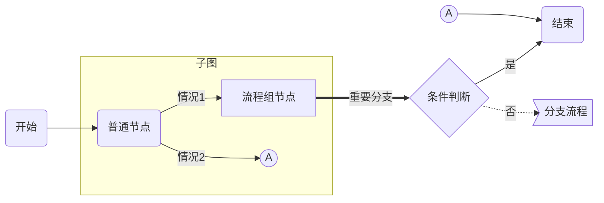
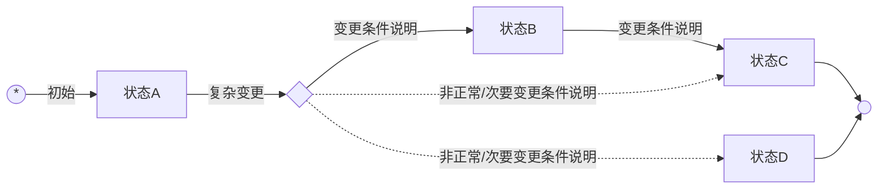
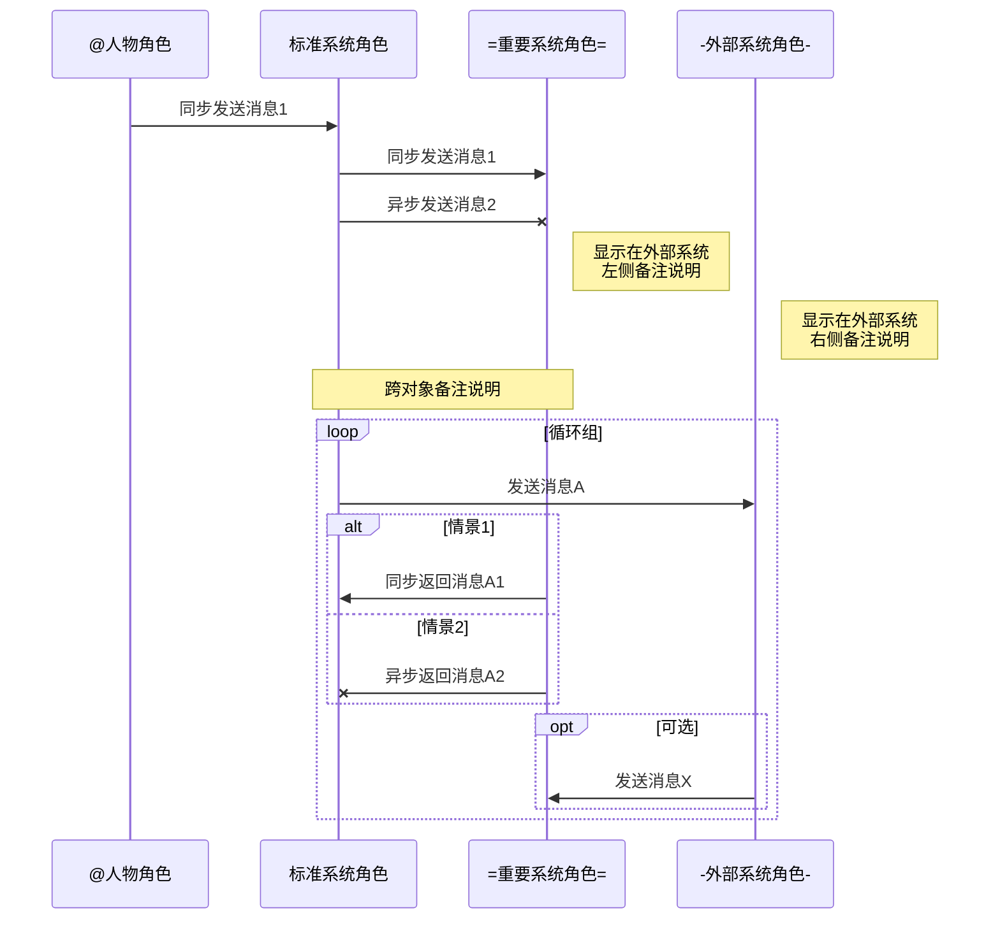

###### <sup>VLOOK™</sup><br>快速参考手册 Quick Reference Manual<br>──<br><br>`# 版本丨V9.13 #`<br><br><br><br><br>**MAX丨孟兆**<br><br>*COPYRIGHT © 2016-2020. MAX°DESIGN.*

[TOC]

# VLOOK™ 是什么

`最新版本丨V9.13`    `+ 官网丨https://github.com/madmaxchow/VLOOK +`    `* 适用平台丨Typora for Win & macOS *`    `- 开源协议丨MIT -`   `! 开发语言丨JavaScript !`

[VLOOK™](https://github.com/MadMaxChow/VLOOK) 是针对由[Typora](https://www.typora.io)[^Typora]（目前最好的跨平台 Markdown 编辑器，没有之一）导出的 HTML 文件进行增强的插件。

VLOOK™ 为开源软件，遵从 [MIT 许可证](#许可协议)。

> [-] **Markdown 是什么？**
>
> > - 2004年，[John Gruber](https://en.wikipedia.org/wiki/John_Gruber) 创造了 [Markdown](https://en.wikipedia.org/wiki/Markdown)，一种专门针对网络写作的`文本标记语言`。使用 Markdown，你只需在写作过程中插入少量的标记符号，就能很轻松地进行排版（例如设置标题、加粗、列表、引用等）。
> > - Markdown文档以`纯文本格式存储`，这意味着，它们可以用几乎任一种文本编辑器打开。同时，又能通过 Markdown 编辑器导出为带排版的富文本文档、HTML 网页等等。纯粹、简洁、易用、灵活，都是人们喜欢 Markdown 的原因。
> > - 目前 Markdown 的标准化项目是 [CommonMark](http://commonmark.org)。
>
> [+] **Markdown 语法：**
>
> > 1. 标准化 **CommonMark** 语法参考：[60秒学会 Markdown 语法](http://commonmark.org/help/)、[10 分钟深入学习 Markdown](http://commonmark.org/help/tutorial/)
> > 2. GitHub 采用 **Flavored Markdown** 的语法参考：Typora 目前采用该标准  [详细](https://support.typora.io/Markdown-Reference/)

[^Typora]: Typora 是非常棒的跨平台的 Markdown 编辑器，支持直接预览与编辑，更详细的特性详见[官网](https://www.typora.io)。

# 特性清单

VLOOK™ 针对 Markdown 的短板，以及在实际众多的文档排版、导航、演示、交互需求中寻找平衡点，为 Markdown 的编辑者和阅读者提供了更好的使用体验。

![VLOOK™ 特性清单]"环境要求：VLOOK V9.7+，Typora mac版 V0.9.9.31+ / Win版 V0.9.83+"

|  特性分类  | 特性说明                                                     |
| :--------: | ------------------------------------------------------------ |
|  排版增强  | **封面、封底**    [>>>](#封面、封底)<br>配合主题样式，让你用 Markdown 写的文档也能焕发专业气质 |
|     ..     | **多主题样式**    [>>>](#多主题样式)<br>让你的文档尽显个性，同时提供主题定制服务 |
|     ..     | **标题、插图、表格、表格行支持自动编号**    [>>>](#标题、插图、表格、表格行自动编号)<br>“0”配置，跟 Word 说 ByeBye 吧～ |
|     ..     | **自动生成插图、表格的题注**    [>>>](#自动生成插图、表格的题注)<br>OMG！配合插图、表格的自动编号，高效高颜值！还有独特的双题注～ |
|     ..     | **表格单元格合并 **   [>>>](#表格单元格合并)<br>这个是用 Markdown 人的真痛点，在这时为你提供了优雅的解决方法 |
|     ..     | **表格列格式设置**    [>>>](#表格列格式设置)<br>Markdown 的表格也能快速设置列的格式（如加粗、高亮、斜体、下划线），同样为你提供了优雅的解决方法 |
|     ..     | **彩虹标签**    [>>>](#彩虹标签)<br>可自定义多个配色的标签、双标签，让你的 Markdown 文档排版更专业、更标准化 |
|     ..     | **mermaid 样式优化**    [>>>](#mermaid 样式优化)<br>全面深度优化 mermaid 图，并提供补丁修正其跨平台的兼容性问题 |
|     ..     | **统一多级列表自动编号**    [>>>](#统一多级列表编号)<br>将多级有序、无序列表的编号进行了统一，以更聚焦内容的结构化 |
|     ..     | **任务列表支持自动编号**    [>>>](#任务列表支持自动编号)<br>让任务列表和多级列表的自动编号两者兼得 |
|  文档导航  | **大纲导航**    [>>>](#大纲导航)<br>最为熟悉和常用的文档导航方式，支持折叠 |
|     ..     | **逐章导航**    [>>>](#逐章导航)<br>在长文档中特别好用，随时眯一眼就知道当前章节、上/下章节是什么了 |
|     ..     | **逐段导航**    [>>>](#逐段导航)<br>这个很 GEEK，可以通过键盘按文档的逐段进行浏览，习惯用 VI / VIM 的人应该会欢呼！ |
|     ..     | **文档插图浏览器**    [>>>](#文档插图浏览器)<br>让你快速在快速浏览文档的所有插图，并能直接跳到文档中对应的位置 |
|  演示辅助  | **聚光灯模式**    [>>>](#聚光灯模式)<br>太COOL了！在投影时可以让大家快速聚焦在关键内容上了（<kbd>S</kbd>激活，<kbd>Z</kbd>调节大小） |
|     ..     | **表格十字光标**    [>>>](#表格十字光标)<br>方便你与大家讨论长表格、大表格时，快速聚焦指定单元格，及对应的行和列 |
|  内容互动  | **在新标签打开插图、表格、代码块**    [>>>](#在新标签打开插图、表格、代码块)<br>在长文档中的来回翻页查看插图、表格、代码示例是很崩溃的事，现在你可以让它们在浏览器的不同标签中显示了 |
|     ..     | **代码块增强**    [>>>](#代码块增强)<br>在这你会发现连闷骚的代码都透着动感，高亮当行、复制～ |
|     ..     | **引用内容可设置为折叠**    [>>>](#引用内容可设置为折叠)<br>引用内容很长很多？现在可以指定是否默认收起，读者点击才展示引用内容……在 VLOOK 的加持下，这里都不是事 |
|     ..     | **长内容自动折叠**    [>>>](#折叠引用内容)<br>长图、长表格、长代码会占用太多屏幕空间？现在可以统统自动折叠，静待你的二维展开指令 |
|     ..     | **文档内容检查**    [>>>](#文档内容检查)<br>文档中的页内链接、图片链接失效了，现在 VLOOK 会悄悄告诉你的 |
|     ..     | **更友好的脚注查看方式**    [>>>](#更友好的脚注查看方式)<br>用 Markdown 也可以像 Kindle 那样以弹窗方式来看脚注 |
| 视觉与交互 | **Dark 模式**    [>>>](#Dark 模式)<br>这个不用多说了，懂的人都会喜欢。也可手动切换回标准的 Light 模式 |
|     ..     | **多字体样式**    [>>>](#多字体样式)<br>AMAZING! 不同的字体风格为你的文档带来不同的调性～ |
|     ..     | **更美观的公式**    [>>>](#更美观的公式)<br>让你的各种公式长得与 VLOOK 的不同主题更搭 |
|     ..     | **打印样式适配**    [>>>](#打印样式适配)<br>使用 VLOOK 提供的打印按钮，确保打印输出的文档样式保持与日常文档更接近 |
|     ..     | **快捷键操作**    [>>>](#快捷键操作)<br>支持键盘快捷键操作，又可以再装个逼了～ |
|     ..     | **七语种界面**<br>界面提示说明、题注前缀等内容，均支持：**简/繁/英/法/俄/日/韩**（依赖于浏览器的当前语言设置） |

# 特性介绍

## 排版增强

### 多主题样式


- 针对 VLOOK 内置多套优化的主题样式[^主题样式]（在导出 HTML 通过 Typora 的「主题」菜单选择名称以 VLOOK 打头的主题）；
  - **Hope 海洋之心**：[预览 ＞](https://madmaxchow.github.io/VLOOK/index.html)
  - **Joint 榫卯**：[预览 ＞](https://madmaxchow.github.io/VLOOK/theme-joint.html)
  - **Geek 极邃**：[预览 ＞](https://madmaxchow.github.io/VLOOK/theme-geek.html)
  - **Fancy 慕幻**：[预览 ＞](https://madmaxchow.github.io/VLOOK/theme-fancy.html)
- 所有主题的文档导出为 HTML 后，都支 **Dark 模式**；
- 提供主题的私人定制服务（私人定制服务微信：**MaxChow**），定制样品示例如下：


[^主题样式]: 可以根据 VLOOK 源码目录下的 LESS 中文件为样例进行自定义扩展，访问 VLOOK 在 [github 主页](http://github.com/madmaxchow/vlook)了解更多。

### 封面、封底

###### 封面
+ 封面样式支持多个信息项，包括：**标题**、**文档类型/密级**、**作者**、**版权信息**；
+ 封面必须以`6级标题`作为整篇文章的**第1个章节**，同时各信息项的顺序与格式规则建议如下（可视实际需要自行调整）：
   - **标题**：无须指定格式标记，直接输入
   - **文档类型/密级**：支持使用 Markdown 的代码格式标记`` ` ``，同时支持 VLOOK 的[双标签风格](#双标签风格)写法，应用举例如下：
     - `+ 文档密级丨对外公开 +`
     - `* 文档密级丨内部公开 *`
     - `- 文档密级丨机密资料 -`
   - **作者**：使用粗体格式标记`**作者**`（插件会自动增加`by`前缀）
   - **版权信息**：使用 Markdown 的斜体格式标记`*版权信息*`
+ 样式见本文的封面，完整示例参考如下（其中`<br>`为换行符号，可选）：

   ```
   ### 此处为标题1<br>此处为标题2<br><br><br><u>此处为作者姓名</u><br>*此处为版权信息*
   ```

###### 封底

+ 以最后一个`6级标题`作为封底；

+ 样式见本文的封底，完整示例参考如下：

   ```
   ###### 此处为封底
   ```

### 标题、插图、表格、表格行自动编号

+ **标题自动编号：**
  
  + 自动对 `1级 ~ 5级` 标题进行自动编号；
  + `6级` 标题在 VLOOK 中应用于[封面和封底](#封面、封底)、分段排版等，不在自动编号范围内。
+ **插图自动编号：**
  
  + 对所有插图，包括图片、mermaid 图进行统一的自动编号。
+ **表格、表格行自动编号：**

   + 在表格自动编号会在以下两种情况下生效：

   + 在`列表`（注意表格要缩进）下：

   | 列1    | 列2    |   列3    |    列4 |
   | --- | --- | :---: | ---: |
   | 第一行 | 左对齐（长内容） | 居中对齐 | 右对齐（长内容） |
   | 第二行（长内容） | 左对齐 | 居中对齐（长内容） | 右对齐 |

   ###### 子表（这是一个缩进的6级标题）

   ![这是表格第1题注]"这是表格第2题注"

   | 列1    | 列2    |   列3    |    列4 |
   | --- | --- | :---: | ---: |
   | 第一行 | 左对齐（长内容） | 居中对齐 | 右对齐（长内容） |
   | 第二行（长内容） | 左对齐 | 居中对齐（长内容） | 右对齐 |

   在`1级 ~ 6级`标题下：

###### 这是6级标题

| 列1    | 列2    |   列3    |    列4 |
| --- | --- | :---: | ---: |
| 第一行 | 左对齐（长内容） | 居中对齐 | 右对齐（长内容） |
| 第二行（长内容） | 左对齐 | 居中对齐（长内容） | 右对齐 |

### 自动生成插图、表格的题注

- 自动为文档内的所有插图、表格添加题注；
- 插图、表格支持多个题注，第1个题注默认在上方，第2上题注在下方。
  - **普通图片**：[查看示例](#Dark 模式)
    - 以图片标题为第 1 题注，如：``
    - 以 URL 后的标题为第 2 题注，如：``
    - 第 2 题注内容为可选。
  - **mermaid 图**：[查看示例](#mermaid－流程图)
    - 在图表前增加题注描述，这里的语法是 VLOOK 扩展的 Markdown 语法；
    - 语法：``![第1题注内容]"第2题注内容"`，其中的「第 2 题注」内容同样为可选；
    - 该原始内容会在应用VLOOK插件后被隐藏，如在`1级 ~ 5级`标题中应用，并要保留原始标题内容，可加起一行进行描述。
  - **表格**：[查看示例](#单元格合并示例)
    - 同「mermaid 图」。

### 表格单元格合并

- **列合并**：直接填写三个英文等号`==`进行标识；
- **行合并**：直接填写三个英文句号`..`进行标识，并支持列头跨行合并。

`- 注意 -`该特性须导出 HTML 并注入 VLOOK 插件后才能生效。

###### 单元格合并示例

###### ![示例一：单元格并列合并、行合并]"注：须使用最新版的 Typora 和 VLOOK"

| 普通列头          | `标签丨测试`列合并（2列） | ==            | 行合并（2行） | 列合并（3列） | ==     | ==             |
| ----------------- | ----------------- | ----------------- | ------------- | ------------- | ---------- | ----------------- |
| **行合并（3行）** | 普通单元格        | 普通单元格        | 普通单元格 | 普通单元格    | 普通单元格 | **跨行（全合并）** |
| ..               | **行合并（2行）**`标签丨测试` | **列合并（4列）** | ==       | ==        | ==     | ..                |
| ..               | ..               | 普通单元格        | 普通单元格    | 普通单元格    | 普通单元格 | ..                |
| 普通单元格        | **行合并（3行）** | 普通单元格        | 普通单元格    | 普通单元格    | 普通单元格 | ..                |
| 普通单元格        | ..               | `标签丨测试`普通单元格 | 普通单元格    | 普通单元格    | 普通单元格 | ..                |
| 普通单元格        | ..               | 普通单元格        | 普通单元格    | 普通单元格    | 普通单元格 | ..                |

###### ![示例二：表头跨行合并1]

| 列头行合并（2行） | 列头列合并（2列） | == | 列头行合并（2行） | 列头列合并（3列） | == | == |
| ----------------- | ------------- | ------------- | :-----------: | ------------- | ------------- | ------------- |
| .. | 二级列头 | 二级列头 | ..   | 二级列头      | 二级列头 | 二级列头 |
| 普通单元格 | 普通单元格     | 普通单元格     | 普通单元格     | 普通单元格          | 普通单元格    | 普通单元格 |
| 普通单元格 | 普通单元格 | 普通单元格 | 普通单元格 | 普通单元格 | 普通单元格 | 普通单元格 |

###### ![示例三：表头跨行合并2]

| 列头行合并（2行） | 列头行合并（3列） | 列头列合并（3列） | == | == | 普通列头 | 普通列头 |
| ----------------- | ------------- | ------------- | :-----------: | ------------- | ------------- | ------------- |
| .. | .. | 二级列头1 | 二级列头2 | 二级列头3     | .. | .. |
| .. | ..     | 三级列头1 | 三级列头2 | 三级列头3     | ..    | .. |
| 普通单元格 | 普通单元格 | 普通单元格 | 普通单元格 | 普通单元格 | 普通单元格 | 普通单元格 |

### 表格列格式设置

- 对表格的任意列统一格式，支持的格式包括：`**加粗**`、`*斜体*`、`<u>下划线</u>`、`==高亮==`、`~~删除线~~`；
- 参考以上形式，只须在表头按标准的 Markdown 语法设置对应的格式即可实现整列格式化（暂不支持多格式的嵌套）。

`- 注意 -`该特性须导出 HTML 并注入 VLOOK 插件后才能生效。

###### 示例效果

| 正常   | **加粗** | `标签丨测试`*斜体* | <u>下划线</u> | ==高亮==                 | ~~删除线~~               |
| ------ | -------- | -----------------: | :-----------: | ------------------------ | ------------------------ |
| 单元格 | 单元格   |             单元格 |    单元格     | 单元格`标签丨测试`单元格 | 单元格`标签丨测试`单元格 |
| 单元格 | 单元格   |             单元格 |    单元格     | 单元格内有**加粗**内容   | 单元格内有**加粗**内容   |
| 单元格 | 单元格   |             单元格 |    单元格     | 单元格内有`行内代码`内容 | 单元格内有`行内代码`内容 |

### 彩虹标签

对于 Markdown 的行内代码标记`` ` `` ，通过特定的**扩展标识**，来用不同的样式渲染指定的代码标签实现彩虹标签效果。

`- 注意 -`因 Typora 的原因，暂不提供在编辑时进行实时预览，样式效果须导出 HTML 并注入 VLOOK 插件后才能生效。

#### 单标签风格

+ 通过在行内代码内容前增加**扩展标识**的内容来标记；

+ 可用于文档中例如修订记录说明、界面元素（按钮、标签）说明、突出标记等，应用举例如下：

   - `+ 新增 +`本次修订新增XXX功能
   - `* 优化 *`本次修订删除XXX功能
   - 消费者点击`# 立即购买 #`后进入XXX页面
   - `- 注意 -`有关的注意事项说明

+ 详细规范如下（文本内容前后须加空格）：

   | 扩展标识示例 |    **色调**    |    渲染效果    |
   | :----------: | :------: | -------- |
   |   `` `= 文本内容 =` ``   | 蓝 | `= 文本内容 =` |
   | `` `+ 文本内容 +` ``  | 绿 | `+ 文本内容 +` |
   |     `` `* 文本内容 *` ``     | 橙 | `* 文本内容 *` |
   | `` `- 文本内容 -` ``  | 红 | `- 文本内容 -` |
   |  `` `! 文本内容 !` ``  | 紫 | `! 文本内容 !` |
   |     `` `# 文本内容 #` ``     | 灰 | `# 文本内容 #` |

#### 双标签风格

+ 目前支持药丸式的两段结构，可用于例如版本号说明、变量说明等，例如：
   - `= 版本号丨V1.0.2 =`
   - `! X取值丨1234 !`
   - `- 优先级丨高 -`

+ 可支持多种样式，举例如下：

   | 写法示例     | **色调**        | 渲染效果              |
   | :---------: | :---------: | ----------- |
   | `` `= 样式类型丨样式1 =` `` | 蓝 | `= 样式类型丨样式1 =` |
   | `` `+ 样式类型丨样式2 +` `` | 绿 | `+ 样式类型丨样式2 +` |
   | `` `* 样式类型丨样式3 *` `` | 橙 | `* 样式类型丨样式3 *` |
   | `` `- 样式类型丨样式4 -` `` | 红 | `- 样式类型丨样式4 -` |
   | `` `! 样式类型丨样式5 !` `` | 紫 | `! 样式类型丨样式5 !` |
   | `` `# 样式类型丨样式6 #` `` | 灰 | `# 样式类型丨样式6 #` |

+ 旧语法，举例如下：

   | 写法示例         | **色调**              | 渲染效果                    |
   | :-----------: | :------------: | -------------- |
   | `` `样式类型丨样式1` ``  | 蓝          | `样式类型丨样式1`           |
   | `` `样式类型丨丨样式2` `` | 绿        | `样式类型丨丨样式2`         |
   | `` `样式类型丨丨丨样式3` `` | 橙     | `样式类型丨丨丨样式3`       |
   | `` `样式类型丨丨丨丨样式4` `` | 红    | `样式类型丨丨丨丨样式4`     |
   | `` `样式类型丨丨丨丨丨样式5` `` | 紫  | `样式类型丨丨丨丨丨样式5`   |
   | `` `样式类型丨丨丨丨丨丨样式6` `` | 灰 | `样式类型丨丨丨丨丨丨样式6` |

`+ 提示 +`其中的竖线符号可用英文半角竖线符号并前后加空格`<空格>|<空格>`，或中文笔划（竖）`丨`或全角竖线符号`｜`。

### mermaid 样式优化

+ 统一优化 **mermaid** 图的样式（opt/alt/loop 标签），并自动适配 [Dark 模式](#Dark 模式)下的呈现：
  + 针对流程图、状态图、顺序图的不同图元应用，重绘不同的外观、形状；
  + 针对顺序图的 `opt` / `alt` / `loop` 标签设置不同的外观、标题位置。
+ 同时修正因 mermaid 原因，在不同操作系统和浏览器下的兼容性问题；
+ 更多脚本化图表样式，以及结合 VLOOK 相关的脚本编写规范内容详见《[脚本化图表 for Markdown](https://madmaxchow.github.io/VLOOK/chart.html)》。

###### mermaid－流程图

![流程图]"（以上的「分支流程」内容由下图进行接续）"


![分支流程（接续上图）]


###### mermaid－状态图


###### mermaid－顺序图


`- 注意 -`因 Typora 的原因，部分特性暂不提供在编辑时进行实时预览，须导出 HTML 并注入 VLOOK 插件后才能生效。

### 统一多级列表编号

+ 对所有**有序**、**无序**的多级列表编号进行统一编号符号。

###### 列表分级编号样式预览：

+ 一级列表内容
   - 二级列表内容
     - 三级列表内容
       - 四级列表内容
         - 五级列表内容
           - 六级列表内容

+ 用 Markdown 编写参考如下（任意写法均可），每级缩进`2`个空格：

    ```
    - 一级列表内容
       - 二级列表内容
         - 三级列表内容
           - 四级列表内容
             - 五级列表内容
               - 六级列表内容
    1. 一级列表内容
       + 二级列表内容
         - 三级列表内容
    ```

### 任务列表支持自动编号

- 在任务列表前保留原始有序/无序列表信息；
- 勾选按钮样式为正常样式，同时保持为不可点击；
- [ ] 示例：这是一级样式
  - [ ] 这是二级样式
  - [x] 这是已选中的二级样式

## 文档导航

### 大纲导航

+ 支持页面左侧显示目录大纲，并能根据页面位置自动高亮当前章节；
+ 可对章节进行折叠/展开。

`- 注意 -`编写 Markdown 文档时，须在封面后添加标签`[TOC]`。

### 逐章导航

+ 支持在页面顶部显示当前章节标题内容（除第6级标题），在封面时自动收起；
+ 根据页面位置自动识别当前章节，正如你现在看到顶部的那样；
+ 显示<kbd>＜ 章节名称</kbd>、<kbd>章节名称 ＞</kbd>的标题，点击进行章节间跳转；

`- 注意 -`编写 Markdown 文档时，须在封面后添加标签`[TOC]`。

### 逐段导航

- 在进行文档评审或演示时，可以通过激活逐段导航，对单块内容进行识别和聚焦；
- 可通过鼠标双击文档任意内容激活该模式，也直接通过快捷键激活（致敬 VI / VIM 的 `JKHL`）：
  |             **快捷键**             | 功能                |
  | :---------------------------------: | ------------------ - |
  |          <kbd>J</kbd>          | 下一个内容块  |
  | <kbd>K</kbd> | 上一个内容块 |
  | <kbd>H</kbd> | 往前十个内容块 |
  | <kbd>L</kbd> | 往后十个内容块 |

### 文档插图浏览器

+ 支持图片、图表格式：
   - 浏览器支持的所有图片（jpg / png / gif / bmp / ..）
   - 脚本化图表（mermaid[^mermaid]，从`V9.0`开始移除对 flowchart.js[^flowchart.js]、JS Sequence Diagrams[^JS Sequence Diagrams]的支持）
+ 点击任意图片、图表打开插图浏览器进行查看；
+ 支持在新标签打开图片、图表；
+ 支持按前一张、后一张方式浏览文档中的所有插图；
+ 对于缺失的图片以默认图片进行替换显示；
+ 点击插图能直接跳转到文档中对应的位置，支持通过热键/快捷键<kbd>esc</kbd>关闭插图浏览器；

[^mermaid]: mermaid 是一个用于画流程图、状态图、顺序图、甘特图的库，使用 JS 进行本地渲染，广泛集成于许多 Markdown 编辑器中。详见 [mermaid官网](https://mermaidjs.github.io)，或 VLOOK 的示例文档《[脚本化图表 for Markdown](https://madmaxchow.github.io/VLOOK/chart.html)》
[^flowchart.js]: flowchart.js 基于 SVG 的流程图插件，它仅需几行代码即可在 Web 上完成流程图的构建。可以从文字表述中画出简单的 SVG 流程图，也可以画出彩色的图表。详见 [flowchart.js 官网](http://flowchart.js.org)，或 VLOOK 的示例文档《[脚本化图表 for Markdown](https://madmaxchow.github.io/VLOOK/chart.html)》。
[^JS Sequence Diagrams]: JS sequence diagrams 是一个方便建立UML的顺序图（序列图or循序图）在线工具，使用简单。详见 [JS Sequence Diagrams](https://bramp.github.io/js-sequence-diagrams/) 官网，或 VLOOK 的示例文档《[脚本化图表 for Markdown](https://madmaxchow.github.io/VLOOK/chart.html)》。

###### 这是普通的图片示例


## 演示辅助

### 聚光灯模式

- 在进行文档评审或演示时，可以通过激活聚光灯来让观众聚焦于文档的特定区域和内容；
- 通过双击文档任意位置进行**激活**或**关闭**聚光灯。

### 表格十字光标

- 对导出的 HTML 文件，鼠标悬停在单元格时自动高亮对应的表格整行、整列，便于在大表格时查看相关行列信息；
- [查看示例效果](#表格单元格合并)

## 内容互动

### 在新标签打开插图、表格、代码块

- 支持在新标签打开文档中的**插图**、**表格**、代码块，便于在长文档、多个内容间进行切换、对比浏览；
- 鼠标悬念在插图、表格时，在左上角显示「在新标签打开」的按钮；
- 在新标签中打开的页面，同样支持部分 VLOOK 的特性，如：[聚光灯模式](#聚光灯模式)、[表格十字光标](#表格十字光标)、[代码块一键复制](#代码块增强)等；
- [查看示例效果](#表格单元格合并)。

`- 注意 -`该特性须导出 HTML 并注入 VLOOK 插件后才能生效。

### 代码块增强

- 更实用、更美观的代码块样式，支持 Dark 模式；
- 支持高亮当前行、一键复制代码；

`- 注意 -`须先启用显示代码行号配置。启用方式：「Typora → 偏好设置 → Markdown → 代码块 - 显示行号」

![应用 VLOOK 后的代码块示例]

```c++
void quickSort(int arr[], int left, int right) {
      int i = left, j = right, tmp, pivot = arr[(left + right) / 2];
      /* partition */
      while (i <= j) {
            while (arr[i] < pivot) i++;
            while (arr[j] > pivot) j--;
            if (i <= j) {
                  tmp = arr[i];
                  arr[i] = arr[j];
                  arr[j] = tmp;
                  i++;
                  j--;
            }
      };
      /* recursion */
      if (left < j) quickSort(arr, left, j);
      if (i < right) quickSort(arr, i, right);
}
```

### 引用内容可设置为折叠

1. 对于「引用」内的二级或多级「引用」，支持动态的折叠 / 展开操作；
2. 在编辑文档时可指定默认的折叠状态（收起 / 展开），这个属于 VLOOK 对 Markdown 语法扩展；
3. 举例如下：

> [+] **这里是引用的折叠标题**
>
> > 1. 在作为引用的标题前增加内容：`[+]<空格>`或`[-]<空格>`
> > 2. `[+]`指该标题下的引用内容默认为「收起」状态；
> > 3. `[-]`指该标题下的引用内容默认为「展开」状态。
> >
> > [+] **支持多级引用的折叠**
> >
> > > 这里是多级引用折叠的内容
> > >
> > > > 这是多级引用不提供折叠的内容
>
> [-] **这是默认展开的「引用」**
>
> > 展示的引用的内容


### 文档内容检查

#### 自动识别缺失的图片

识别出无法加载的图片，并替换为图片缺失提示图，示例如下：


#### 页内链接检查

+ 自动检查页面内部链接的正确性；
+ 若存在无效的页内链接，则通过弹窗提示。

#### 重名章节标题检查

+ 自动检查文档是否存在重名的标题，以提示作者检查是否会存在页内链接不能跳转到重名的标题位置的可能性；
+ 重名章节标题的警告提示信息须启动浏览器的开发者工具或调试工具后，打开其控制台窗口进行查看。

#### 外部链接强制在新标签打开

为提高文档阅读与交互体验，对于外链（如：http、https、ftp等），自动强制设置为在新标签页中打开。

## 视觉与交互

### Dark 模式

根据浏览器的配置，自动适配 Light / Dark 模式，也支持手动方式进行切换。


###### 支持对指定图片在 Dark 模式时用反色显示

- 图片默认在 Dark 模式时按原始颜色显示，对于一些透明底的 PNG 图片（如界面线框图），可指定在 Dark 模式时以反色显示以获得更好的显示效果；

- 对不起要在在 Dark 模式中以反色显示的图片，可在图片地址末尾增加反色标识`?invert=in-dark`；

- 举例： ``


### 多字体样式

- 目前支持 **衬线** 与 **非衬线** 两套字体样式，可根据个人喜好进行切换，后续将会有更多见风格加入；
- 衬线与非衬线分别优先使用开源的 **思源黑体** 和 **思源宋体**，建议下载安装获得更好的视觉体验；
- 下载字体：
  - 思源黑体 / Noto Sans（[常规体](https://github.com/googlefonts/noto-cjk/blob/master/NotoSansCJKsc-Regular.otf)、[粗体](https://github.com/googlefonts/noto-cjk/blob/master/NotoSansCJKsc-Bold.otf)）
  - 思源宋体 / Noto Serif（[常规体](https://github.com/googlefonts/noto-cjk/blob/master/NotoSerifCJKsc-Regular.otf)、[粗体](https://github.com/googlefonts/noto-cjk/blob/master/NotoSerifCJKsc-Bold.otf)）

### 更友好的脚注查看方式

+ 默认情况下，查看脚注信息须在文档中来回跳转；
+ 增强后的脚注功能可以直接在当前页面位置全屏显示；
+ 点击文末的**脚注编号**查看脚注信息[^脚注1]

[^脚注1]: 这是增**强的脚注**的信息，该增强由 VLOOK 插件提供。[VLOOK™ 是什么？](#VLOOK™ 是什么)

### 更美观的公式

#### 行内公式

$\lim_{x \to \infty} \exp{-x}=0$

#### 多行公式

$$
\mathbf{V}_1 \times \mathbf{V}_2 =  \begin{vmatrix} 
\mathbf{i} & \mathbf{j} & \mathbf{k} \\
\frac{\partial X}{\partial u} &  \frac{\partial Y}{\partial u} & 0 \\
\frac{\partial X}{\partial v} &  \frac{\partial Y}{\partial v} & 0 \\
\end{vmatrix}
$$

### 打印样式适配

+ 打印输出时自动优化页面显示样式，以适应用打印输出的应用场景。

### 快捷键操作

![全局快捷键]

|                      快捷键                      | 功能                                        |
| :----------------------------------------------: | ------------------------------------------- |
|                   <kbd>D</kbd>                   | 开启 / 关闭 Dark 模式                       |
|                   <kbd>O</kbd>                   | 显示 / 隐藏大纲面板                         |
|                   <kbd>A</kbd>                   | 切换字体样式，详见[多字体样式](#多字体样式) |
|                   <kbd>I</kbd>                   | 显示 / 隐藏插图浏览器                       |
|                   <kbd>P</kbd>                   | 打印文档                                    |
|                   <kbd>S</kbd>                   | 打开 / 关闭聚光灯                           |
|           <kbd>←</kbd> 或 <kbd><</kbd>           | 上一章                                      |
|           <kbd>→</kbd> 或 <kbd>></kbd>           | 下一章                                      |
| <kbd>J</kbd><kbd>K</kbd><kbd>H</kbd><kbd>L</kbd> | 内容块浏览操作，详见[逐段导航](#逐段导航)   |
|                  <kbd>ESC</kbd>                  | 关闭弹出的界面、聚光灯、内容块聚焦等        |

![插图浏览器快捷键]"注：打开插图浏览器后生效"

|           快捷键            | 功能       |
| :-------------------------: | ---------- |
| <kbd>←</kbd> / <kbd><</kbd> | 前一张插图 |
| <kbd>→</kbd> / <kbd>></kbd> | 后一张插图 |

![聚光灯快捷键]"注：打开聚光灯后生效"

|         快捷键         | 功能       |
| :-------------------------: | ---------- |
| <kbd>Shift</kbd> | 调整聚光灯大小 |

# 打赏

**若喜欢 VLOOK™ 的话，可以请 Max 喝杯咖啡～**


# 如何使用

## 第1步：下载、配置

- 访问 VLOOK 官方主页下载最新发布版本：[https://github.com/MadMaxChow/VLOOK/releases](https://github.com/MadMaxChow/VLOOK/releases)
- 下载并安装 [Typora](https://www.typora.io) ，启动后进入「偏好设置」，启用一些建议的选项，详细如下图：
  
  
  
  
  


## 第2步：应用主题

+ 将`released\theme`下所有CSS文件复制至 Typora 的主题目录（ Typora「偏好设置」中点击「外观 - 打开主题目录」定位到该目录）；
+ 重启 Typora ，点击菜单`主题`，选择以`vlook-*`形式命名的主题，即可启用对应的 VLOOK 主题样式；
+ 可基于`VLOOK\3-demo\VLOOK-Template 文档模板.md`来创建你自己的文档，`VLOOK\3-demo`目录下也有本文档的 Markdown 源文件。

## 第3步：植入插件

+ 在 Typora 中将 Markdown 文件导出为`HTML`文件；
+ 打开文件`released\VLOOK-TOOLBOX 插件.txt`，全选所有内容，并复制；
+ 用纯文件编辑器，如：记事本、[Visual Studio Code](https://code.visualstudio.com/)，打开该导出的 HTML 文件；
+ 搜索「**<body **」，并将复制的内容粘贴到body标签的「**>**」之后：
  ```
  <body ...>
  ← ← ← ← ← 复制的「VLOOK-TOOLBOX 插件」内容粘贴于此！
  ...
  </body>
  ```
+ 保存，大吉大利。

> 强烈建议使用 Chrome 或 Firefox 浏览器查看

# 许可协议

**MIT许可证**

版权所有 (c) 2018 MAX°DESIGN | Max Chow
在此授予任何获得此软件和相关文档文件（“软件”）副本的人免费许可，以无限制地处理本软件，包括但不限于使用，复制，修改，合并，发布，分发，再授权和/或出售本软件的副本，并允许本软件的授予人员遵从以下情况：
上述版权声明和本许可声明应包含在本软件的所有副本或重要部分中。
本软件按“原样”提供，不提供任何以表达或暗示，包括但不限于销售，适用于特定用途和不侵权的保证。在任何情况下，作者或版权所有人不对因软件或软件的使用或其他事宜产生的任何索赔，损害或其他责任（无论是在合同，侵权或其他方面的诉讼中）负责。

###### <br><br><br><br><br><br><br><br><br><br><br>The End