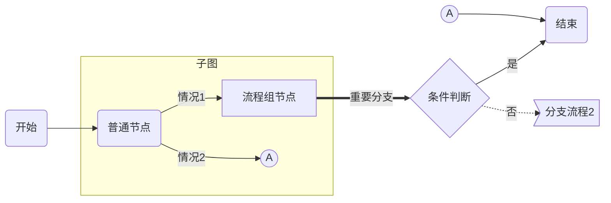
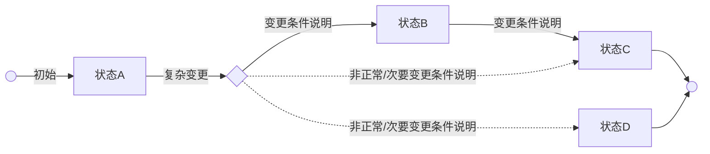
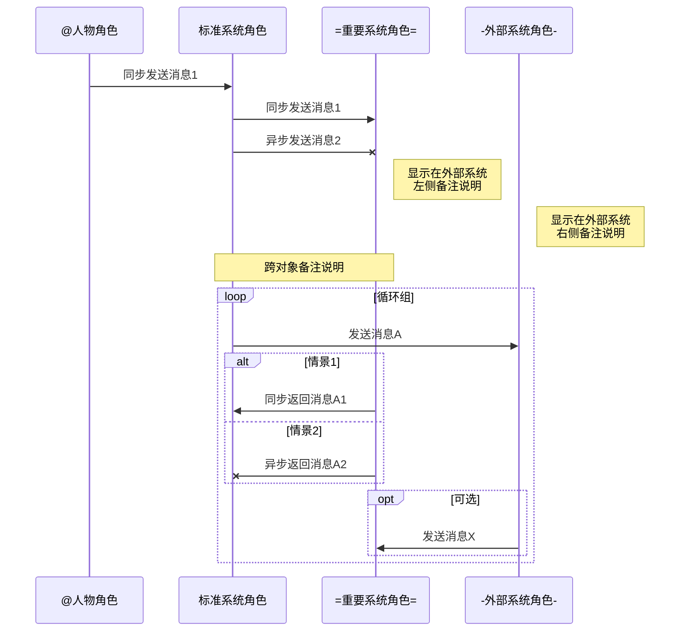

###### <sup>VLOOK™</sup><br>快速参考手册 Quick Reference Manual<br>──<br><br>`+ 版本丨V9.2 +`<br><br><br><br><br>**Max**<br>*COPYRIGHT © 2016-2019. MAX°DESIGN.*
[TOC]

# VLOOK™ 是什么

`最新版本丨V9.2`    `+ 官网丨https://github.com/madmaxchow/VLOOK +`    `* 适用平台丨Typora for Win & macOS *`    `- 开源协议丨MIT -`   `! 开发语言丨JavaScript !`

[VLOOK™](https://github.com/MadMaxChow/VLOOK) 是针对由[Typora](https://www.typora.io)[^Typora]导出的 HTML 文件进行增强的插件。VLOOK™ 为开源软件，遵从 [MIT 许可证](#许可协议)。

VLOOK 插件主要包括：

- **排版增强**：针对 Typora 编辑模式，以及导出的 HTML 文件增加更实用、美观的文档排版与样式（详见[这里](#排版增强)）；
- **功能增强**：针对导出的 HTML 文件提供文档导航、评审演示、插图浏览、内容交互、信息缺失检测等功能（详见[这里](#功能增强)）。

> [-] **Markdown 是什么？**
>
> > - 2004年，[John Gruber](https://en.wikipedia.org/wiki/John_Gruber) 创造了 [Markdown](https://en.wikipedia.org/wiki/Markdown)，一种专门针对网络写作的`文本标记语言`。使用 Markdown，你只需在写作过程中插入少量的标记符号，就能很轻松地进行排版（例如设置标题、加粗、列表、引用等）。
> > - Markdown文档以`纯文本格式存储`，这意味着，它们可以用几乎任一种文本编辑器打开。同时，又能通过 Markdown 编辑器导出为带排版的富文本文档、HTML 网页等等。纯粹、简洁、易用、灵活，都是人们喜欢 Markdown 的原因。
> > - 目前 Markdown 的标准化项目是 [CommonMark](http://commonmark.org)。
>
> [+] **Markdown 语法：**
>
> > 1. 标准化 **CommonMark** 语法参考：[60秒学会 Markdown 语法](http://commonmark.org/help/)、[10 分钟深入学习 Markdown](http://commonmark.org/help/tutorial/)
> > 2. GitHub 采用 **Flavored Markdown** 的语法参考：Typora 目前采用该标准  [详细](https://support.typora.io/Markdown-Reference/)

[^Typora]: Typora 是非常棒的跨平台的 Markdown 编辑器，支持直接预览与编辑，更详细的特性详见[官网](https://www.typora.io)。

# 特性介绍

## 排版增强

### 主题样式


- 针对 VLOOK 内置多套优化的主题样式[^主题样式]（在导出 HTML 通过 Typora 的「主题」菜单选择名称以 VLOOK 打头的主题）；
  - **Hope 海洋之心**：[预览 ＞](https://madmaxchow.github.io/VLOOK/index.html)
  - **Joint 榫卯**：[预览 ＞](https://madmaxchow.github.io/VLOOK/theme-joint.html)
  - **Geek 极邃**：[预览 ＞](https://madmaxchow.github.io/VLOOK/theme-geek.html)
  - **Fancy 慕幻**：[预览 ＞](https://madmaxchow.github.io/VLOOK/theme-fancy.html)
- 所有主题的文档导出为 HTML 后，都支持`Light (明亮)`与`Dark (黑暗)`模式。

[^主题样式]: 可以根据 VLOOK 源码目录下的 LESS 中文件为样例进行自定义扩展，访问 VLOOK 在 github [主页](http://github.com/madmaxchow/vlook)。

### 封面、封底

###### 封面
+ 封面样式支持多个信息项，包括：**标题**、**文档类型/密级**、**作者**、**版权信息**；
+ 封面必须以`6级标题`（<kbd>Ctrl</kbd>+<kbd>6</kbd>）作为整篇文章的`第1个`章节，同时各信息项的顺序与格式规则建议如下（可视实际需要自行调整）：
   - **标题**：无须指定格式标记，直接输入
   - **文档类型/密级**：使用 Markdown 的代码格式标记`` ` ``，同时支持 VLOOK 的[双标签风格](#双标签风格)写法，应用举例如下：
     - `+ 文档密级丨对外公开 +`
     - `* 文档密级丨内部公开 *`
     - `- 文档密级丨机密资料 -`
   - **作者**：使用粗体格式标记`**作者**`（插件会自动增加`by`前缀）
   - **版权信息**：使用 Markdown 的斜体格式标记`*版权信息*`
+ 样式见本文的封面，完整示例参考如下（其中`<br>`为换行符号，可选）：

   ```
   ### 此处为标题1<br>此处为标题2<br><br><br><u>此处为作者姓名</u><br>*此处为版权信息*
   ```

###### 封底

+ 以最后一个`6级标题`作为封底；

+ 样式见本文的封底，完整示例参考如下：

   ```
   ###### 此处为封底
   ```

### Light / Dark 模式

- 根据浏览器的配置，自动适配 Light / Dark 模式，也支持手动方式进行切换。


### 指定图片在 Dark 模式时反色

- 图片默认在 Dark 模式时按原始颜色显示，对于一些透明底的 PNG 图片（如界面线框图），可指定在 Dark 模式时以反色显示以获得更好的显示效果；

- 对不起要在在 Dark 模式中以反色显示的图片，可在图片地址末尾增加反色标识`?invert=in-dark`；

- 举例： ``

###### 图片默认情况下长这样：


###### 指定切换至 Dark 模式后反色，会长这样：


### 标题自动编号

+ 自动对 **1 级 ~ 5 级**标题进行自动编号；
+ **6 级**标题在 VLOOK 中作特殊用途，不在自动编号范围内。

### 统一多级列表编号

+ 对所有**有序**、**无序**的多级列表编号进行统一编号符号。

###### 列表分级编号样式预览：

+ 一级列表内容
   - 二级列表内容
     - 三级列表内容
       - 四级列表内容
         - 五级列表内容
           - 六级列表内容

+ 用 Markdown 编写参考如下（任意写法均可），每级缩进`2`个空格：

    ```
    - 一级列表内容
       - 二级列表内容
         - 三级列表内容
           - 四级列表内容
             - 五级列表内容
               - 六级列表内容
    1. 一级列表内容
       + 二级列表内容
         - 三级列表内容
    ```

### 增强表格排版与交互

#### 单元格合并

- **列合并**：直接填写三个英文等号`==`进行标识；
- **行合并**：直接填写三个英文句号`..`进行标识，并支持列头跨行合并。

`- 注意 -`该特性须导出 HTML 并加入插件代码后才能生效。

###### 示例一

| 普通列头          | `标签丨测试`列合并（2列） | ==            | 行合并（2行） | 列合并（3列） | ==     | ==             |
| ----------------- | ----------------- | ----------------- | ------------- | ------------- | ---------- | ----------------- |
| **行合并（3行）** | 普通单元格        | 普通单元格        | 普通单元格 | 普通单元格    | 普通单元格 | **跨行（全合并）** |
| ..               | **行合并（2行）**`标签丨测试` | **列合并（4列）** | ==       | ==        | ==     | ..                |
| ..               | ..               | 普通单元格        | 普通单元格    | 普通单元格    | 普通单元格 | ..                |
| 普通单元格        | **行合并（3行）** | 普通单元格        | 普通单元格    | 普通单元格    | 普通单元格 | ..                |
| 普通单元格        | ..               | `标签丨测试`普通单元格 | 普通单元格    | 普通单元格    | 普通单元格 | ..                |
| 普通单元格        | ..               | 普通单元格        | 普通单元格    | 普通单元格    | 普通单元格 | ..                |

###### 示例二

| 列头行合并（2行） | 列头列合并（2列） | == | 列头行合并（2行） | 列头列合并（3列） | == | == |
| ----------------- | ------------- | ------------- | :-----------: | ------------- | ------------- | ------------- |
| .. | 二级列头 | 二级列头 | ..   | 二级列头      | 二级列头 | 二级列头 |
| 普通单元格 | 普通单元格     | 普通单元格     | 普通单元格     | 普通单元格          | 普通单元格    | 普通单元格 |
| 普通单元格 | 普通单元格 | 普通单元格 | 普通单元格 | 普通单元格 | 普通单元格 | 普通单元格 |

###### 示例三

| 列头行合并（2行） | 列头行合并（3列） | 列头列合并（3列） | == | == | 普通列头 | 普通列头 |
| ----------------- | ------------- | ------------- | :-----------: | ------------- | ------------- | ------------- |
| .. | .. | 二级列头1 | 二级列头2 | 二级列头3     | .. | .. |
| .. | ..     | 三级列头1 | 三级列头2 | 三级列头3     | ..    | .. |
| 普通单元格 | 普通单元格 | 普通单元格 | 普通单元格 | 普通单元格 | 普通单元格 | 普通单元格 |

#### 表格行自动编号

+ 在表格自动编号会在以下两种情况下生效：

+ 在**有序/无序列表**下（**注意须先缩进一级**）：

   | 列1    | 列2    |   列3    |    列4 |
   | --- | --- | :---: | ---: |
   | 第一行 | 左对齐（长内容） | 居中对齐 | 右对齐（长内容） |
   | 第二行（长内容） | 左对齐 | 居中对齐（长内容） | 右对齐 |

   ###### 子表

   | 列1    | 列2    |   列3    |    列4 |
   | --- | --- | :---: | ---: |
   | 第一行 | 左对齐（长内容） | 居中对齐 | 右对齐（长内容） |
   | 第二行（长内容） | 左对齐 | 居中对齐（长内容） | 右对齐 |

+ 在**标题（H1~H6）**下（**无须不缩进**）：

###### 这是6级标题

| 列1    | 列2    |   列3    |    列4 |
| --- | --- | :---: | ---: |
| 第一行 | 左对齐（长内容） | 居中对齐 | 右对齐（长内容） |
| 第二行（长内容） | 左对齐 | 居中对齐（长内容） | 右对齐 |

#### 列格式增强

- 对表格的任意列统一格式，支持的格式包括：`**加粗**`、`*斜体*`、`<u>下划线</u>`、`==高亮==`、`~~删除线~~`；
- 参考以上形式，只须在表头按标准的 Markdown 语法设置对应的格式即可实现整列格式化（暂不支持多格式的嵌套）。

`- 注意 -`该特性须导出 HTML 并加入插件代码后才能生效。

###### 示例效果

| 正常   | **加粗** | `标签丨测试`*斜体* | <u>下划线</u> | ==高亮==                 | ~~删除线~~               |
| ------ | -------- | -----------------: | :-----------: | ------------------------ | ------------------------ |
| 单元格 | 单元格   |             单元格 |    单元格     | 单元格`标签丨测试`单元格 | 单元格`标签丨测试`单元格 |
| 单元格 | 单元格   |             单元格 |    单元格     | 单元格内有**加粗**内容   | 单元格内有**加粗**内容   |
| 单元格 | 单元格   |             单元格 |    单元格     | 单元格内有`行内代码`内容 | 单元格内有`行内代码`内容 |

#### 单元格十字聚焦

- 对导出的 HTML 文件，鼠标悬停在单元格时自动高亮对应的表格整行、整列，便于在大表格时查看相关行列信息。

#### 在新标签中打开表格

- 支持在新标签打开表格（鼠标悬念在表格时，会在左上角显示打开按钮）。

`- 注意 -`该特性须导出 HTML 并加入插件代码后才能生效。

### 自动添加图注、表注

- 自动为所有插图、表格添加自动编号，并生成图注或表注：
  - 图片：以图片标题为图注，如：``
  - 图表：则为取图表前的 6 级标题，如：`###### 图注、表注`，若图表前不存在 6 级标题，则忽略
  - 表格：（同图表）
- 效果文档中的插图底部的文字样式。

### 更美观的图表

+ 统一优化 **mermaid** 脚本化图表的样式；
+ 更多脚本化图表样式，以及结合 VLOOK 相关的脚本编写规范内容详见《[脚本化图表 for Markdown](https://madmaxchow.github.io/VLOOK/chart.html)》。

###### mermaid－流程图




###### mermaid－状态图


###### mermaid－时序图


`- 注意 -`因 Typora 的原因，部分特性暂不提供在编辑时进行实时预览，须导出 HTML 并加入插件代码后才能生效。

### 彩虹标签

对于 Markdown 的行内代码标记`` ` `` ，通过特定的**扩展标识**，来用不同的样式渲染指定的代码标签实现彩虹标签效果。

`- 注意 -`因 Typora 的原因，暂不提供在编辑时进行实时预览，样式效果须导出 HTML 并加入插件代码后才能生效。

#### 单标签风格

+ 通过在行内代码内容前增加**扩展标识**的内容来标记；

+ 可用于文档中例如修订记录说明、界面元素（按钮、标签）说明、突出标记等，应用举例如下：

   - `+ 新增 +`本次修订新增XXX功能
   - `* 优化 *`本次修订删除XXX功能
   - 用户点击`# 立即购买 #`后进入XXX页面
   - `- 注意 -`有关的注意事项说明

+ 详细规范如下（文本内容前后须加空格）：

   | 扩展标识示例 |    渲染效果    |
   | :----------: | :------: |
   |   `` `= 文本内容 =` ``   | `= 文本内容 =` |
   | `` `+ 文本内容 +` ``  | `+ 文本内容 +` |
   |     `` `* 文本内容 *` ``     | `* 文本内容 *` |
   | `` `- 文本内容 -` ``  | `- 文本内容 -` |
   |  `` `! 文本内容 !` ``  | `! 文本内容 !` |
   |     `` `# 文本内容 #` ``     | `# 文本内容 #` |


#### 双标签风格

+ 目前支持药丸式的两段结构，可用于例如版本号说明、变量说明等，例如：
   - `= 版本号丨V1.0.2 =`
   - `!! X取值丨1234 !!`
   - `- 优先级丨高 -`

+ 可支持多种样式，举例如下：

   | 写法示例     | 渲染效果              |
   | :---------: | ----------- |
   | `` `= 样式类型丨样式1 =` `` | `= 样式类型丨样式1 =` |
   | `` `+ 样式类型丨样式2 +` `` | `+ 样式类型丨样式2 +` |
   | `` `* 样式类型丨样式3 *` `` | `* 样式类型丨样式3 *` |
   | `` `- 样式类型丨样式4 -` `` | `- 样式类型丨样式4 -` |
   | `` `! 样式类型丨样式5 !` `` | `! 样式类型丨样式5 !` |
   | `` `# 样式类型丨样式6 #` `` | `# 样式类型丨样式6 #` |

+ 旧语法，举例如下：

   | 写法示例         | 渲染效果                    |
   | :-----------: | :------------: |
   | `` `样式类型丨样式1` ``  | `样式类型丨样式1`           |
   | `` `样式类型丨丨样式2` `` | `样式类型丨丨样式2`         |
   | `` `样式类型丨丨丨样式3` `` | `样式类型丨丨丨样式3`       |
   | `` `样式类型丨丨丨丨样式4` `` | `样式类型丨丨丨丨样式4`     |
   | `` `样式类型丨丨丨丨丨样式5` `` | `样式类型丨丨丨丨丨样式5`   |
   | `` `样式类型丨丨丨丨丨丨样式6` `` | `样式类型丨丨丨丨丨丨样式6` |

`+ 提示 +`其中的竖线符号可用英文半角竖线符号并前后加空格`<空格>|<空格>`，或中文笔划（竖）`丨`或全角竖线符号`｜`。

#### 多行代码

```javascript
function funName() {
    var a = true;
    if (a = false)
        console.log("Hello World!");
}
```

### 更实用的任务列表

- 在任务列表前保留原始有序/无序列表信息；
- 勾选按钮样式为正常样式，同时保持为不可点击；
- [ ] 示例：这是一级样式
  - [ ] 这是二级样式
  - [x] 这是已选中的二级样式

### 更美观的公式

#### 行内公式

$\lim_{x \to \infty} \exp{-x}=0$

#### 多行公式

$$
\mathbf{V}_1 \times \mathbf{V}_2 =  \begin{vmatrix} 
\mathbf{i} & \mathbf{j} & \mathbf{k} \\
\frac{\partial X}{\partial u} &  \frac{\partial Y}{\partial u} & 0 \\
\frac{\partial X}{\partial v} &  \frac{\partial Y}{\partial v} & 0 \\
\end{vmatrix}
$$

### 打印样式

+ 打印输出时自动优化页面显示样式，以适应用打印输出的应用场景。

## 功能增强

### 文档导航Plus

#### 大纲导航

+ 支持页面左侧显示目录大纲，并能根据页面位置自动高亮当前章节；
+ 目录大纲默认显示前三级，可自行修改样式文件进行调整

`- 注意 -`编写 Markdown 文档时，须在封面后添加标签`[TOC]`。

#### 逐章导航

+ 支持在页面顶部显示当前章节标题内容（除第6级标题）；
+ 根据页面位置自动识别当前章节，正如你现在看到的那样；
+ 显示<kbd>＜ 章节名称</kbd>、<kbd>章节名称 ＞</kbd>的标题，点击进行章节间跳转；

`- 注意 -`编写 Markdown 文档时，须在封面后添加标签`[TOC]`。

### 文档评审/演示辅助

#### 聚光灯

- 在进行文档评审或演示时，可以通过激活聚光灯来让观众聚焦于文档的特定区域和内容；
- 通过双击文档任意位置进行**激活**或**关闭**聚光灯。

#### 内容块聚焦

- 在进行文档评审或演示时，可以通过激活内容块聚焦方式，对单个内容进行识别和聚焦；
- 可通过鼠标点击文档任意内容激活，也支持快捷键操作（致敬 VI / VIM）：
  |             **热键/快捷键**             | 功能                |
  | :---------------------------------: | ------------------ - |
  |          <kbd>J</kbd>          | 下一个内容块  |
  | <kbd>K</kbd> | 上一个内容块 |
  | <kbd>H</kbd> | 往前十个内容块 |
  | <kbd>L</kbd> | 往后十个内容块 |

### 文档插图浏览器

+ 支持图片、图表格式：
   - 浏览器支持的所有图片（jpg / png / gif / bmp / ..）
   - 脚本化图表（mermaid[^mermaid]，从V9开始移除对 flowchart.js[^flowchart.js]、JS Sequence Diagrams[^JS Sequence Diagrams]的支持）
+ 点击任意图片、图表打开插图浏览器进行查看；
+ 支持在新标签打开图片、图表；
+ 支持按前一张、后一张方式浏览文档中的所有插图；
+ 对于缺失的图片以默认图片进行替换显示；
+ 点击插图能直接跳转到文档中对应的位置，支持通过热键/快捷键<kbd>esc</kbd>关闭插图浏览器；

[^mermaid]: mermaid 是一个用于画流程图、状态图、时序图、甘特图的库，使用 JS 进行本地渲染，广泛集成于许多 Markdown 编辑器中。详见 [mermaid官网](https://mermaidjs.github.io)，或 VLOOK 的示例文档《[脚本化图表 for Markdown](https://madmaxchow.github.io/VLOOK/chart.html)》
[^flowchart.js]: flowchart.js 基于 SVG 的流程图插件，它仅需几行代码即可在 Web 上完成流程图的构建。可以从文字表述中画出简单的 SVG 流程图，也可以画出彩色的图表。详见 [flowchart.js 官网](http://flowchart.js.org)，或 VLOOK 的示例文档《[脚本化图表 for Markdown](https://madmaxchow.github.io/VLOOK/chart.html)》。
[^JS Sequence Diagrams]: JS sequence diagrams 是一个方便建立UML的时序图（序列图or循序图）在线工具，使用简单。详见 [JS Sequence Diagrams](https://bramp.github.io/js-sequence-diagrams/) 官网，或 VLOOK 的示例文档《[脚本化图表 for Markdown](https://madmaxchow.github.io/VLOOK/chart.html)》。

###### 这是普通的图片示例


### 自动识别缺失的图片

+ 识别出无法加载的图片，并替换为图片缺失提示图，示例如下：


### 支持折叠引用内容

1. 对于「引用」，支持动态折叠操作；
2. 在编辑时可指定默认的折叠状态（收起 / 展开）。
3. 举例如下：

> [+] **这里是引用的折叠标题**
>
> > 1. 标题前加`[+]<空格>`或`[-]<空格>`；
> > 2. `[+]`指默认为「收起」状态；
> > 3. `[-]`指默认为「展开」状态。
> >
> > [+] **支持多级引用的折叠**
> >
> > > 这里是多级引用折叠的内容
> > >
> > > > 这是多级引用不提供折叠的内容
>
> [-] **这是默认展开的「引用」**
>
> > 展示的引用的内容

### 更友好的脚注体验

+ 默认情况下，查看脚注信息须在文档中来回跳转；
+ 增强后的脚注功能可以直接在当前页面位置全屏显示；
+ 点击文末的**脚注编号**查看脚注信息[^脚注1]

[^脚注1]: 这是增**强的脚注**的信息，该增强由 VLOOK 插件提供。[VLOOK™ 是什么？](#VLOOK™ 是什么)

### 切换字体样式

- 支持**衬线**与**无衬线**字体风格，可根据个人喜好进行切换；
- VLOOK 优先显示开源的**思源黑体**和**思源宋体**，建议下载安装获得更好的视觉体验；
- 下载地址：
  - 思源黑体 / Noto Sans（[常规体](https://github.com/googlefonts/noto-cjk/blob/master/NotoSansCJKsc-Regular.otf)、[粗体](https://github.com/googlefonts/noto-cjk/blob/master/NotoSansCJKsc-Bold.otf)）
  - 思源宋体 / Noto Serif（[常规体](https://github.com/googlefonts/noto-cjk/blob/master/NotoSerifCJKsc-Regular.otf)、[粗体](https://github.com/googlefonts/noto-cjk/blob/master/NotoSerifCJKsc-Bold.otf)）

### 链接管理

#### 外链强制新标签打开

+ 为提高文档阅读与交互体验，对于外链（如：http、https、ftp等），自动强制设置为在新标签页中打开。

#### 内链有效性检查

###### 无效内链

+ 自动检查页面内部链接的正确性；
+ 若存在无效的页内链接，则通过弹窗提示。

###### 重名章节标题

+ 自动检查文档是否存在重名的标题，以提示作者检查是否会存在页内链接不能跳转到重名的标题位置的可能性；
+ 重名章节标题的警告提示信息须启动浏览器的开发者工具或调试工具后，打开其控制台窗口进行查看。

### 热键操作

1. 全局热键：
  |                   热键/快捷键                    | 功能                                            |
  | :----------------------------------------------: | ----------------------------------------------- |
  |                   <kbd>T</kbd>                   | 切换文档主题                                    |
  |                   <kbd>O</kbd>                   | 显示 / 隐藏大纲面板                             |
  |                   <kbd>A</kbd>                   | 切换字体样式，详见[切换字体样式](#切换字体样式) |
  |                   <kbd>I</kbd>                   | 显示 / 隐藏插图浏览器                           |
  |                   <kbd>P</kbd>                   | 打印文档                                        |
  |                   <kbd>S</kbd>                   | 打开 / 关闭聚光灯                               |
  |           <kbd>←</kbd> / <kbd><</kbd>            | 上一章                                          |
  |           <kbd>→</kbd> / <kbd>></kbd>            | 下一章                                          |
  | <kbd>J</kbd><kbd>K</kbd><kbd>H</kbd><kbd>L</kbd> | 内容块操作，详见[内容块聚焦](#内容块聚焦)       |
  |                  <kbd>ESC</kbd>                  | 关闭弹出的界面、聚光灯、内容块聚焦等            |
  
2. 插图浏览器热键：
  |         热键/快捷键         | 功能       |
  | :-------------------------: | ---------- |
  | <kbd>←</kbd> / <kbd><</kbd> | 前一张插图 |
  | <kbd>→</kbd> / <kbd>></kbd> | 后一张插图 |

# 如何使用

## 打赏

###### 若喜欢 VLOOK™ 的话，可以请 Max 喝杯咖啡～


## 下载插件

- 访问官方主页下载最新发布版本：[https://github.com/MadMaxChow/VLOOK/releases](https://github.com/MadMaxChow/VLOOK/releases)
- 可基于`VLOOK\3-demo\VLOOK-Template 文档模板.md`来创建你自己的文档，`VLOOK\3-demo`目录下也有本文档的 Markdown 源文件。

## 应用主题

+ 将`released\theme`下所有CSS文件复制至 Typora 的主题目录（ Typora「偏好设置」中点击「外观 - 打开主题目录」定位到该目录）；
+ 进入 Typora 的偏好设置，启用 Markdown 语法扩展下的所有选项（如：公式、上标、下标、高亮、图表等）；
+ 重启 Typora ，点击菜单`主题`，选择以`vlook-*`形式命名的主题，即可启用对应的 VLOOK 主题样式。

## 应用插件

+ 在 Typora 中将 Markdown 文件导出为`HTML`文件；
+ 打开文件`released\VLOOK-TOOLBOX 插件.txt`，全选所有内容，并复制；
+ 用纯文件编辑器，如：记事本、[Visual Studio Code](https://code.visualstudio.com/)，打开该导出的 HTML 文件；
+ 搜索「**<body **」，并将复制的内容粘贴到body标签的「**>**」之后：
  ```
  <body ...>
  ← ← ← ← ← 复制的「VLOOK-TOOLBOX 插件」内容粘贴于此！
  ...
  </body>
  ```
+ 保存，大吉大利。

> 强烈建议使用 Chrome 或 Firefox 浏览器查看

# 许可协议

**MIT许可证**

版权所有 (c) 2018 MAX°DESIGN | Max Chow
在此授予任何获得此软件和相关文档文件（“软件”）副本的人免费许可，以无限制地处理本软件，包括但不限于使用，复制，修改，合并，发布，分发，再授权和/或出售本软件的副本，并允许本软件的授予人员遵从以下情况：
上述版权声明和本许可声明应包含在本软件的所有副本或重要部分中。
本软件按“原样”提供，不提供任何以表达或暗示，包括但不限于销售，适用于特定用途和不侵权的保证。在任何情况下，作者或版权所有人不对因软件或软件的使用或其他事宜产生的任何索赔，损害或其他责任（无论是在合同，侵权或其他方面的诉讼中）负责。

###### 终了<br>