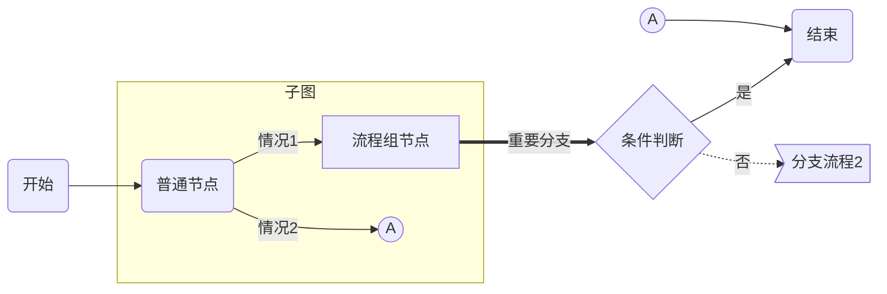

###### （如有需要可以在这写上小标题） （这里是封面，你文档大标题上封面了） ──  `+ 密级/版本/也可以什么都不写丨？？？ +`     **XXX作者** *COPYRIGHT © XXXXX. ALL RIGHTS RESERVED.*
[TOC]

# 一级章节名称

正文内容。

- 列表内容
- 列表内容
  - 列表内容
    - 列表内容

> 引用的正式内容样例
>
> - 引用内容列表1
> - 引用内容列表2
>
> [+] **默认==收起==的引用内容，点击可展开**
>
> > 嵌套的引用的正式内容样例
> >
> > - 引用内容列表1
> > - 引用内容列表2
>
> [-] **默认==展开==的引用内容，点击可收起**
>
> > - 引用内容列表1
> > - 引用内容列表2

## 二级章节名称

###### 表格

| 字段 | 必填 | 约束限制 | 默认值 | 说明 |
| ---- | :--: | -------- | :----: | ---- |
|      |      |          |        |      |
|      |      |          |        |      |
|      |      |          |        |      |
|      |      |          |        |      |
|      |      |          |        |      |

### 三级章节名称

###### 流程图

#### 四级章节名称 

##### 五级章节名称

`- 注意了 -`六级章节在 VLOOK 中一般是用来做图文、表格、封面、封底的特殊标识。

######         ── 文档结束 ──