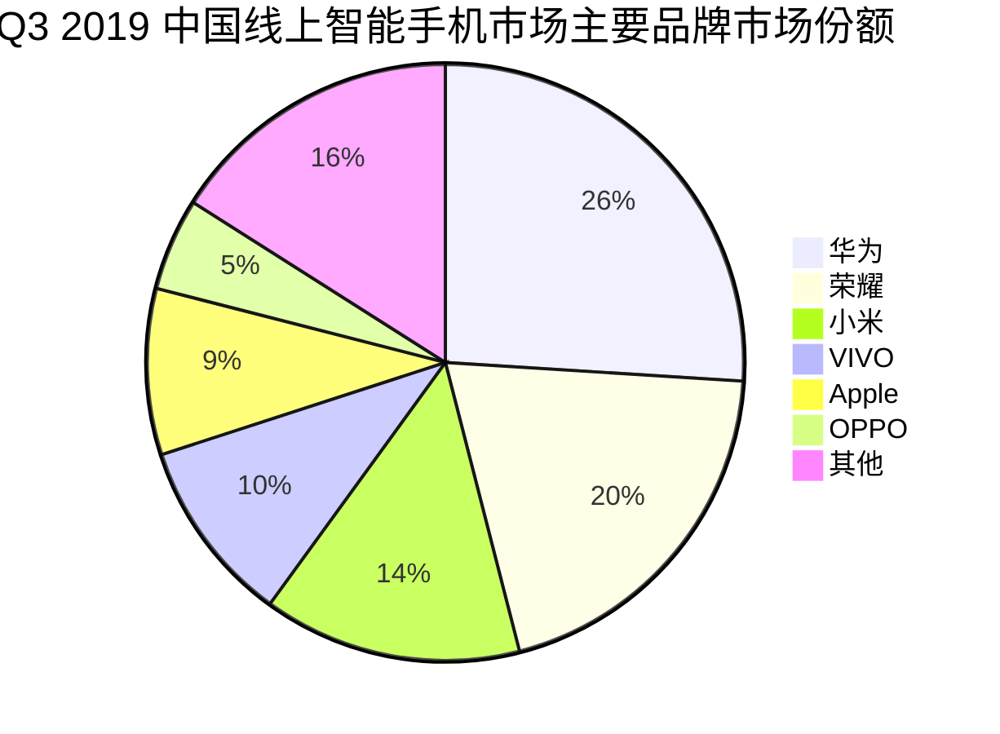
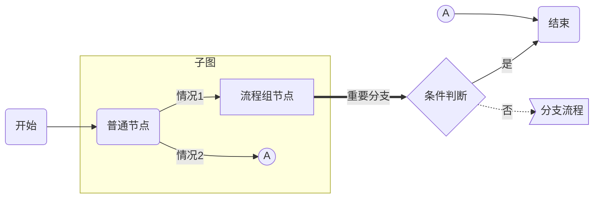
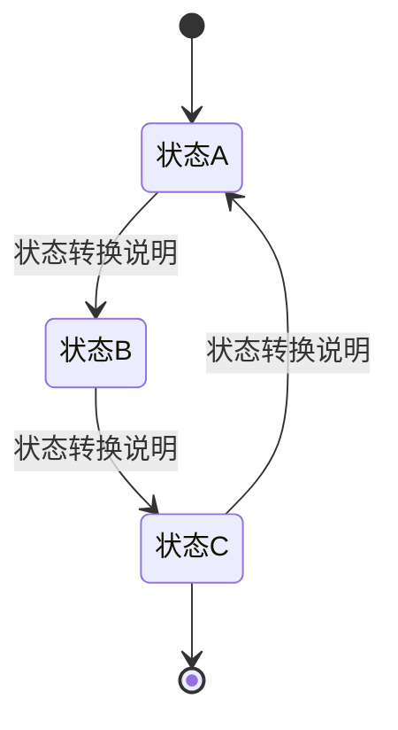
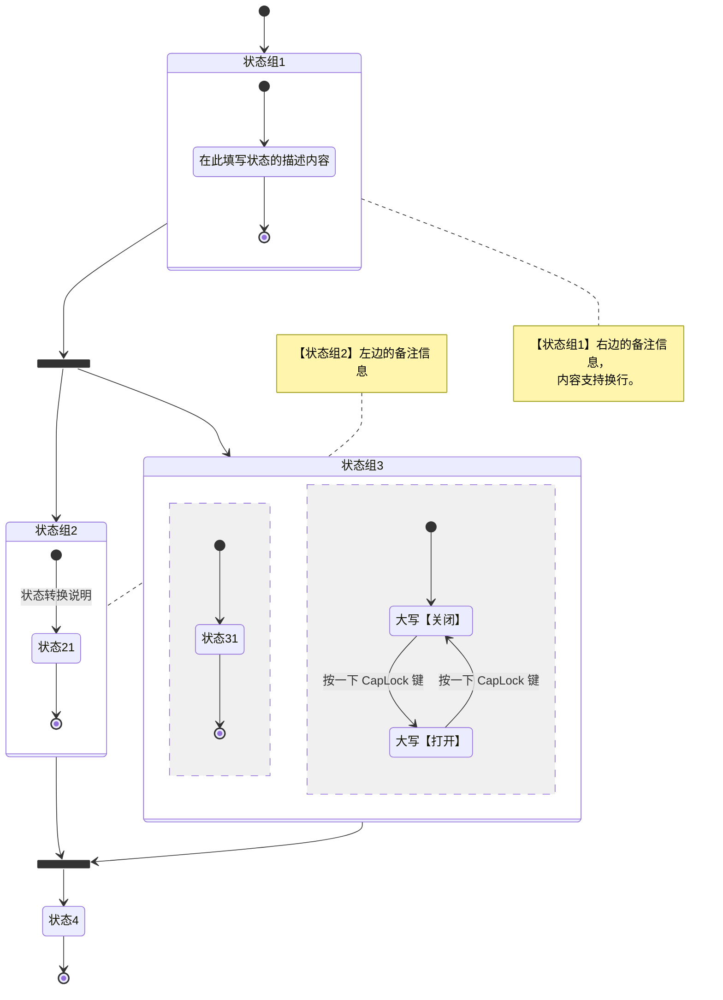
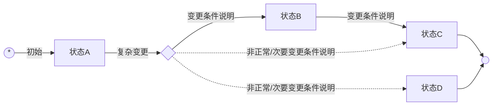
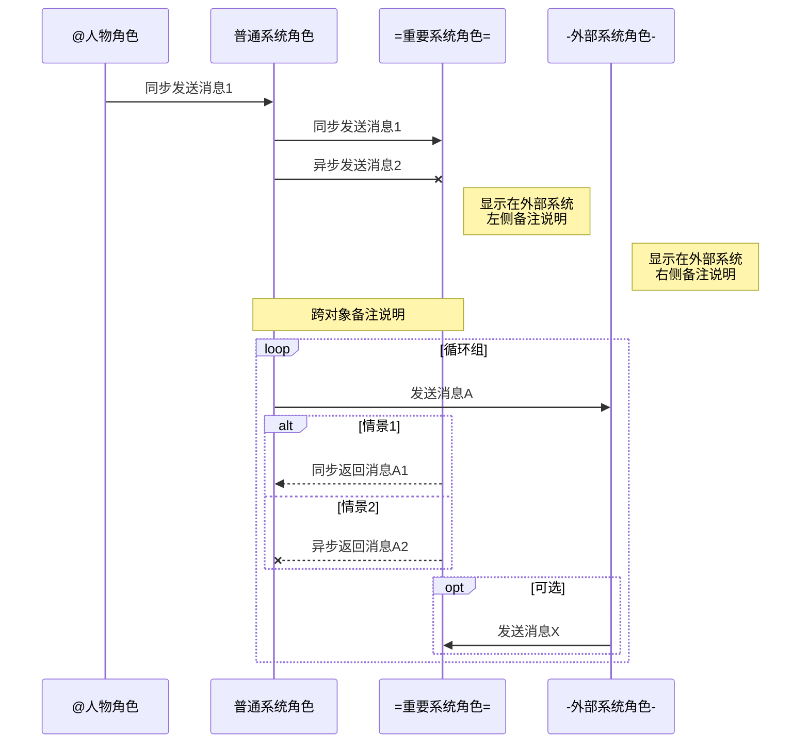
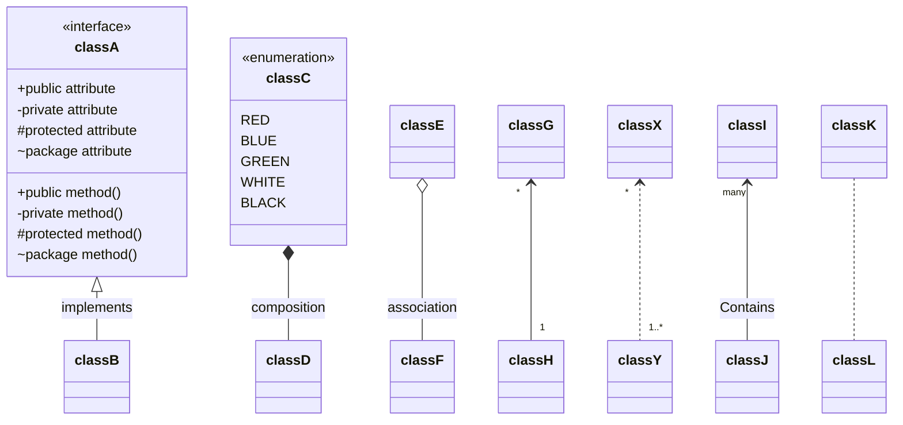
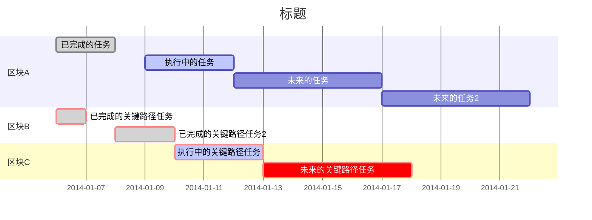

###### <sup>VLOOK™ Charts Demo</sup><br>脚本化图表 for Markdown<br>──<br><br>`+ 文档密级丨对外公开 +`<br><br><br><br>**MAX丨孟兆**<br>*COPYRIGHT © 2017-2019. MAX°DESIGN.*

[TOC]

# 关于 Markdown

###### Markdown 是什么？

十四年前，John Gruber 创造了 Markdown，一种专门针对网络写作的文本标记语言。使用 Markdown，你只需在写作过程中插入少量的标记符号，就能很轻松地进行排版（例如设置标题、加粗、列表、引用等）。

Markdown 文档以纯文本格式存储，这意味着，它们可以用几乎任一种文本编辑器打开。同时，又能通过 Markdown 编辑器导出为带排版的富文本文档、HTML 网页等等。纯粹、简洁、易用、灵活，都是人们喜欢 Markdown 的原因。目前 Markdown 的标准化项目是 [CommonMark](http://commonmark.org)。

###### Markdown 语法参考：

- 标准化 CommonMark 语法参考：[60秒学会 Markdown 语法](http://commonmark.org/help/)、[10分钟深入学习 Markdown](http://commonmark.org/help/tutorial/)
- GitHub 采用 Flavored Markdown 的语法参考：Typora 目前采用该标准  [详细](https://support.typora.io/Markdown-Reference/)

# 主推方案

## mermaid

`= 推荐方案 =`

mermaid 是一个用于画流程图、状态图、时序图、甘特图的库，使用 JS 进行本地渲染，广泛集成于许多 Markdown 编辑器中。详见 [mermaid 官网](https://mermaidjs.github.io)。

### 饼图

###### mermaid ─ 饼图

![Q3 2019 中国线上智能手机市场主要品牌市场份额]"数据来自：互联网"



###### 画图脚本

```
​```mermaid
pie title Q3 2019 中国线上智能手机市场主要品牌市场份额
"华为" : 26
"荣耀" : 20
"小米" : 14
"VIVO" : 10
"Apple" : 9
"OPPO" : 5
"其他" : 16
​```
```

### 流程图

###### mermaid－流程图

![流程图]"（以上的「分支流程」内容由下图进行接续）"



![分支流程（接续上图）]


###### 画图脚本

```
​```mermaid
graph LR
START(开始) --> node1(普通节点)
subgraph 子图
	node1 --> |情况1|groud1[流程组节点]
  node1 --> |情况2|A1((A))
end

%% this is a comment

groud1 ==> |重要分支|cond1{条件判断}
cond1 --> |是|END
cond1 -.-> |否|page2>分支流程B]
A2((A)) --> END
END(结束)
​```

​```mermaid
graph LR
page2>分支流程B] --> node2(普通节点)
node2 --> END
END(结束)
​```
```

###### 说明

1. 特定节点命名规范：

   - `START`：开始结点
   - `END`：结束结点

2. 支持节点形状/类型：

   | **节点形状** | 应用建议                   | 说明                                                         |
   | :----------: | :------------------------- | ------------------------------------------------------------ |
   |   圆角矩形   | 普通流程节点               | 结合别名（如：node1、page2 等，可自由定义），并通过`()`指定，举例：`node1(普通节点)` |
   |     菱形     | 条件判断节点               | 结合别名，并通过`{}`指定，举例：`node1{条件判断}`            |
   |   方角矩形   | 普通流程节点/子流程/状态图 | 不使用别名时的默认样式，也可以通过`[]`来强制指定，举例：`node1[流程组]` |
   |     圆形     | 同页标志                   | 结合别名，并通过`(())`指定，举例：`node1((圆形节点)`         |
   |     旗形     | 离页标志                   | 结合别名，并通过`>]`指定，举例：`node1>条件判断节点]`        |

3. 支持指定流程图方向：`LR`（从左到右）、`RL`（从右到左）、`TB`（从上到下）、`BT`（从下到上）；

4. 支持 FontAwesome [官网](http://fontawesome.com)。

### 状态图

#### 标准状态图

###### 环境要求

- Typora `macOS 版本丨0.9.9.30+` `Windows 版本丨0.9.80+`
- mermaid `Version丨8.4+` 

###### mermaid－状态图样式1



###### 画图脚本

```
stateDiagram
[*] --> 状态A
状态A --> 状态B : 状态转换说明
状态B --> 状态C : 状态转换说明
状态C --> 状态A : 状态转换说明
状态C --> [*]
```

###### mermaid－状态样式2



###### 画图脚本

```
​```mermaid
stateDiagram
state fork_state <<fork>>

[*] --> 状态组1
状态组1 --> fork_state
fork_state --> 状态组2
fork_state --> 状态组3

note right of 状态组1
    【状态组1】右边的备注信息，
    内容支持换行。
end note
state 状态组1 {
    状态11 : 在此填写状态的描述内容
    [*] --> 状态11
    状态11 --> [*]
}

note left of 状态组2 : 【状态组2】左边的备注信息
state 状态组2 {
    [*] --> 状态21: 状态转换说明
    状态21 --> [*]
}

%% 可以编写注释（以两个英文百分号开头)
state 状态组3 {
    [*] --> 状态31
    状态31 --> [*]
    --
    [*] --> 大写【关闭】
    大写【关闭】 --> 大写【打开】 : 按一下 CapLock 键
    大写【打开】 --> 大写【关闭】 : 按一下 CapLock 键
}

state join_state <<join>>

状态组2 --> join_state
状态组3 --> join_state
join_state --> 状态4
状态4 --> [*]
​```
```

#### 旧版状态图

###### 说明

1. 该样式的状态图是借用**流程图**脚本实现，是mermaid未支持[标准状态图](#标准状态图)时的变通方案；
2. 特定节点命名规范：
   - `INIT`：初始状态
   - `FINAL`：最终状态
3. 建议使用`方角矩形`节点来表示状态；
4. 根据情况适当使用别名（如：A、B、C 等，可自由定义）；
5. 可适当结合`菱形`节点用于表示**分支**和**聚合**。

###### mermaid－状态机图



###### 画图脚本

```
​```mermaid
graph LR
%% 流程图走方说明
%% LR：从左到图，RL：从右到左，TB：从上到下，BT：从下到上

INIT((*))
INIT --> 	|初始|A[状态A]
A --> |复杂变更|fork1(( ))
fork1(( )) --> |变更条件说明|B[状态B]
B --> |变更条件说明|C[状态C]
fork1{ } -.-> |非正常/次要变更条件说明|C
C --> FINAL
fork1{ } -.-> |非正常/次要变更条件说明|D[状态D]
D --> FINAL
FINAL(( ))
​```
```

### 时序图/分角色流程图/泳图

###### mermaid－时序图



###### 画图脚本

```
​```mermaid
sequenceDiagram
participant User as @人物角色
participant Client as 普通系统角色
participant Server as =重要系统角色=
participant Extend as -外部系统角色-

%% this is a comment

User ->> Client: 同步发送消息1
Client ->> Server: 同步发送消息1
Client -X Server: 异步发送消息2
Note left of Extend: 显示在外部系统<br>左侧备注说明
Note right of Extend: 显示在外部系统<br>右侧备注说明
Note over Client,Server: 跨对象备注说明
loop 循环组
	Client ->> Extend: 发送消息A
	alt 情景1
		Server -->> Client: 同步返回消息A1
	else 情景2
		Server --X Client: 异步返回消息A2
	end
	opt 可选
		Extend ->> Server: 发送消息X
	end
end
​```
```

###### 说明

1. 建议使用实体别名，以提高画图脚本的复用度和可维护性；
2. 支持三类消息线条：同步请求消息、异步请求消息、返回消息；
3. 角色支持三类扩展样式，在输出HTML后应用 [VLOOK™](https://github.com/madmaxchow/VLOOK) 插件后渲染为不同的样式：
   - **人物角色**：以at符号`@`开始的内容，如`@人物角色`
   - **重要系统角色**：含等号`=`包裹的内容，如`=后端支撑系统名称=`
   - **外部系统角色**：含用减号`-`包裹的内容，如`-外部系统名称-`
4. 支持三类标签分组，在输出HTML后应用 [VLOOK™](https://github.com/madmaxchow/VLOOK) 插件渲染为不同的样式：
   - `loop`：循环
   - `opt`：可选
   - `alt..else`：条件选择（alt = 情景1，else = 情景2）
5. 支持备注说明。

### 类图

须mermaid V8.4及更新版本支持。

###### mermaid－类图1



###### mermaid－类图2


###### 画图脚本

### 甘特图

###### mermaid－甘特图



###### 画图脚本

```
​```mermaid
gantt
dateFormat  YYYY-MM-DD
title 标题

%% this is a comment

section 区块A
已完成的任务:done, des1, 2014-01-06, 2014-01-08
执行中的任务:active, des2, 2014-01-09, 3d
未来的任务:des3, after des2, 5d
未来的任务2:des4, after des3, 5d

section 区块B
已完成的关键路径任务:crit, done, 2014-01-06, 24h
已完成的关键路径任务2:crit, done, after des1, 2d

section 区块C
执行中的关键路径任务:crit, active, 3d
未来的关键路径任务:crit, 5d
​```
```

# 备选方案

`- 注意 -`**（从 VLOOK 9.2 版本开始不再支持备选方案）**

## flowchart.js（流程图）

flowchart.js 基于 SVG 的流程图插件，它仅需几行代码即可在 Web 上完成流程图的构建。可以从文字表述中画出简单的 SVG 流程图，也可以画出彩色的图表。详见 [flowchart.js 官网](http://flowchart.js.org)。

## JS Sequence Diagrams（时序图）

JS sequence diagrams 是一个方便建立 UML 的时序图（序列图 or 循序图）在线工具，使用简单。详见 [JS Sequence Diagrams 官网](https://bramp.github.io/js-sequence-diagrams/)。

###### 