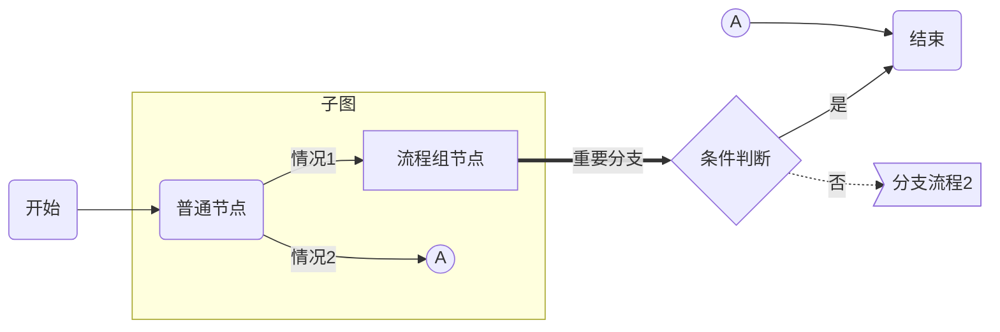

###### 文档小标题（可选） 文档大标题（封面） ──  `+ 标识性内容（可选） +`    **XXXXX** *COPYRIGHT © XXXXX.*
[TOC]

# 一级章节名称

正文内容。

- 列表内容
- 列表内容
  - 列表内容
    - 列表内容

## 二级章节名称

###### 表格

| 字段 | 必填 | 约束限制 | 默认值 | 说明 |
| ---- | :--: | -------- | :----: | ---- |
|      |      |          |        |      |

### 三级章节名称

###### 图表

###### 终了（封底） 