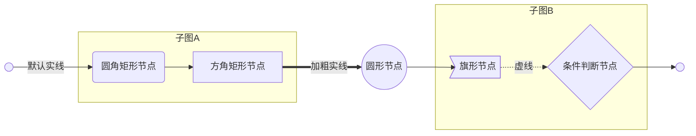
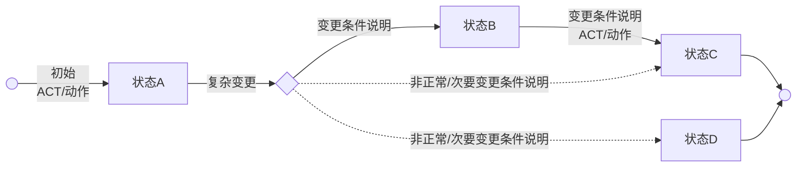
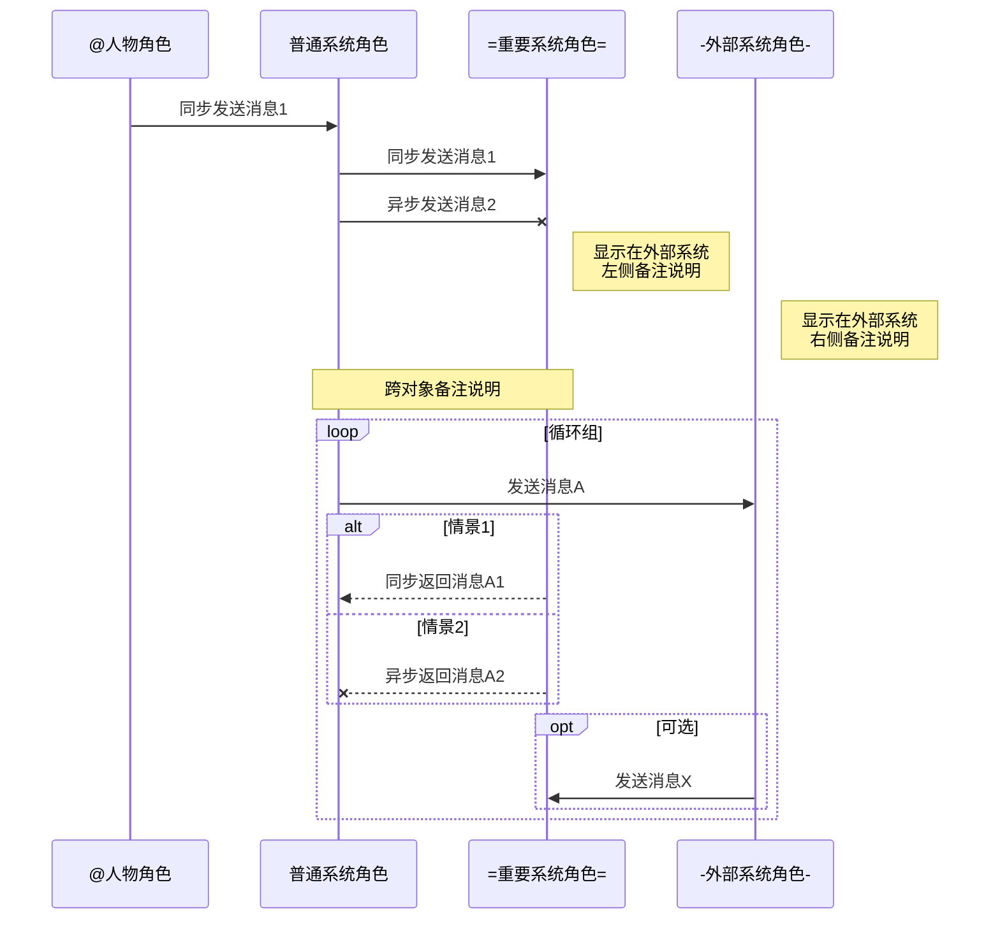
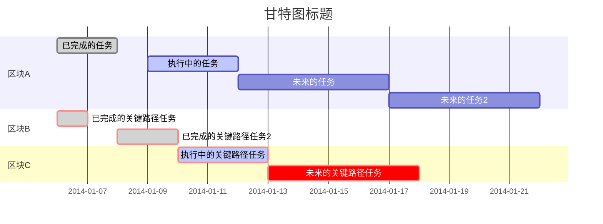

###### <sup>VLOOK™ Charts Demo</sup><br>脚本化图表 for Markdown<br>——<br><br><br>`+ 文档密级丨对外公开 +`<br><br><br><br>**Max**<br>*COPYRIGHT © 2017-2018. MAX°DESIGN.*

[TOC]

# 关于Markdown

###### Markdown是什么？

十四年前，John Gruber创造了Markdown，一种专门针对网络写作的文本标记语言。使用Markdown，你只需在写作过程中插入少量的标记符号，就能很轻松地进行排版（例如设置标题、加粗、列表、引用等）。

Markdown文档以纯文本格式存储，这意味着，它们可以用几乎任一种文本编辑器打开。同时，又能通过Markdown编辑器导出为带排版的富文本文档、HTML网页等等。纯粹、简洁、易用、灵活，都是人们喜欢Markdown的原因。目前Markdown的标准化项目是[CommonMark](http://commonmark.org)。

###### Markdown语法参考：

- 标准化CommonMark语法参考：[60秒学会Markdown语法](http://commonmark.org/help/)、[10分钟深入学习Markdown](http://commonmark.org/help/tutorial/)
- GitHub采用Flavored Markdown的语法参考：Typora目前采用该标准  [详细](https://support.typora.io/Markdown-Reference/)

# 主推方案

## mermaid

`= 推荐方案 =`

mermaid 是一个用于画流程图、状态图、时序图、甘特图的库，使用 JS 进行本地渲染，广泛集成于许多 Markdown 编辑器中。详见[mermaid 官网](https://mermaidjs.github.io)。

### 流程图

###### mermaid丨流程图



###### 画图脚本

```java
graph LR
START(( )) --> |默认实线|round_edges(fa:fa-twitter 圆角矩形节点)
subgraph 子图A
	round_edges --> text[方角矩形节点]
end

text ==> |加粗实线|circle((fa:fa-camera-retro<br>圆形节点))
circle --> asymetric>旗形节点]

subgraph 子图B
	asymetric -.-> |虚线|rhombus{条件判断节点}
end

rhombus --> END
END(( ))
```

###### 说明

1. 特定节点命名：

   - `START`：开始结点
   - `END`：结束结点

2. 支持节点形状/类型：

   | 节点形状 |          应用建议          | 说明                                                         |
   | -------- | :------------------------: | ------------------------------------------------------------ |
   | 圆角矩形 |        普通流程节点        | 结合别名，并通过`()`指定，举例：`node1(圆角节点)`            |
   | 菱形     |        条件判断节点        | 结合别名，并通过`{}`指定，举例：`node1{条件判断节点}`        |
   | 方角矩形 | 普通流程节点/子流程/状态图 | 不使用别名时的默认样式，也可以通过`[]`来强制指定，举例：`node1[方角节点]` |
   | 圆形     |        普通流程节点        | 结合别名，并通过`(())`指定，举例：`node1((圆形节点)`         |
   | 旗形     |         输入/输出          | 结合别名，并通过`>]`指定，举例：`node1>条件判断节点]`        |

3. 支持指定流程图方向：`LR`（从左到右）、`RL`（从右到左）、`TB`（从上到下）、`BT`（从下到上）；

4. 支持FontAwesome [官网](http://fontawesome.com)。

### 状态图

###### mermaid丨状态图



###### 画图脚本

```java
graph LR
INIT(( ))
INIT --> |初始<br>ACT/动作|状态A
状态A --> |复杂变更|trans(( ))
trans(( )) --> |变更条件说明|状态B
状态B --> |变更条件说明<br>ACT/动作|状态C
中转{ } -.-> |非正常/次要变更条件说明|状态C
状态C --> FINAL
中转{ } -.-> |非正常/次要变更条件说明|状态D
状态D --> FINAL
FINAL(( ))
```

###### 说明

1. 该样式的状态图是借用**流程图**脚本实现；
2. 特定节点命名：
   - `INIT`：初始状态
   - `FINAL`：最终状态
3. 建议使用`方角矩形`节点来表示状态；
4. 不建议使用别名，除非状态名称的重复度较高，便于维护时才适当使用；
5. 可适当结合`菱形`节点来对复杂状态关系进行更清晰的展示。

### 时序图/分角色流程图/泳图

###### mermaid 时序图



###### 画图脚本

```java
sequenceDiagram
participant User as @人物角色
participant Client as 普通系统角色
participant Server as =重要系统角色=
participant Extend as -外部系统角色-

User ->> Client: 同步发送消息1
Client ->> Server: 同步发送消息1
Client -X Server: 异步发送消息2
Note left of Extend: 显示在外部系统<br>左侧备注说明
Note right of Extend: 显示在外部系统<br>右侧备注说明
Note over Client,Server: 跨对象备注说明
loop 循环组
	Client ->> Extend: 发送消息A
	alt 情景1
		Server -->> Client: 同步返回消息A1
	else 情景2
		Server --X Client: 异步返回消息A2
	end
	opt 可选
		Extend ->> Server: 发送消息X
	end
end
```

###### 说明

1. 建议使用实体别名，以提高画图脚本的复用度和可维护性；
2. 支持三类消息线条：同步请求消息、异步请求消息、返回消息；
3. 角色支持三类扩展样式，在输出HTML后应用[VLOOK™](https://github.com/madmaxchow/VLOOK)插件后渲染为不同的样式：
   - **人物角色**：以at符号`@`开始的内容，如`@人物角色`
   - **重要系统角色**：含等号`=`包裹的内容，如`=后端支撑系统名称=`
   - **外部系统角色**：含用减号`-`包裹的内容，如`-外部系统名称-`
4. 支持三类标签分组，在输出HTML后应用[VLOOK™](https://github.com/madmaxchow/VLOOK)插件渲染为不同的样式：
   - `loop`：循环
   - `opt`：可选
   - `alt..else`：条件选择（alt=情景1，else=情景2）
5. 支持备注说明。

### 甘特图

###### mermaid 甘特图




# 备选方案

## flowchart.js（流程图）

flowchart.js基于SVG的流程图插件，它仅需几行代码即可在 Web 上完成流程图的构建。可以从文字表述中画出简单的 SVG 流程图，也可以画出彩色的图表。详见[flowchart.js 官网](http://flowchart.js.org)。

###### flowchart.js丨流程图

```flow
st=>start:  
e=>end:  
op1=>operation: 操作
op2=>operation: 材料
sub1=>subroutine: 子流程
cond=>condition: 是 / 否？
c2=>condition: 好主意
io=>inputoutput: 获得数据

st->op1(right)->cond
cond(yes, right)->c2
cond(no)->sub1(left)->op1
c2(yes)->io->e
c2(no)->op2->e
```

###### 画图脚本

```java
st=>start:  
e=>end:  
op1=>operation: 操作
op2=>operation: 材料
sub1=>subroutine: 子流程
cond=>condition: 是 / 否？
c2=>condition: 好主意
io=>inputoutput: 获得数据

st->op1(right)->cond
cond(yes, right)->c2
cond(no)->sub1(left)->op1
c2(yes)->io->e
c2(no)->op2->e
```

## JS Sequence Diagrams（时序图）

JS sequence diagrams是一个方便建立UML的时序图（序列图or循序图）在线工具，使用简单。详见[JS Sequence Diagrams 官网](https://bramp.github.io/js-sequence-diagrams/)。

###### JS Sequence Diagrams丨时序图

```sequence
Title: 在此填写流程图标题
participant 客服端 as CLIENT
participant 服务器 as SERVER
Note right of CLIENT: 通过角色、对象列表，\n您可以更改它们的顺序
CLIENT -> SERVER: 请求消息：实线+实箭头
SERVER --> CLIENT: 返回消息：虚线+实箭头
Note over CLIENT: 说明
Note over CLIENT, SERVER: 跨对象说明
CLIENT ->> SERVER: 请求消息：实线+虚箭头
SERVER -->> CLIENT: 返回消息：虚线+虚箭头
Note left of SERVER: 我在最后一位
```

###### 画图脚本

```java
Title: 在此填写流程图标题
participant 客服端 as CLIENT
participant 服务器 as SERVER
Note right of CLIENT: 通过角色、对象列表，\n您可以更改它们的顺序
CLIENT -> SERVER: 请求消息：实线+实箭头
SERVER --> CLIENT: 返回消息：虚线+实箭头
Note over CLIENT: 说明
Note over CLIENT, SERVER: 跨对象说明
CLIENT ->> SERVER: 请求消息：实线+虚箭头
SERVER -->> CLIENT: 返回消息：虚线+虚箭头
Note left of SERVER: 我在最后一位
```

###### 终了<br>