[TOC]

# 打赏

<u>**感谢打赏支持 VLOOK™ 的客官（部分名单）/ Thanks for donate VLOOK™ (partial donors)**</u>

＊魂、＊狗、＊R、＊Z、＊川、l＊n、＊朽、＊杰、A＊C、W＊l、＊山、＊星、＊丽、一＊秋、＊军、＊鹏、李＊6、＊无、H＊t、＊二、f＊y、＊宇、＊琛、＊辉、＊秋、＊笑、＊豫、l＊a、＊心、整＊9、＊国、＊拉、＊龙、＊应、＊销、＊哦、E＊y、…

---

> **若喜欢 VLOOK™ 的话，可以贡献一杯咖啡**
>
> 
>
> _~Gn~_

> **I like VLOOK™, I donate a cup of coffee**
>
> [](https://paypal.me/madmaxchow)
>
> _~Se~_

# °代码

## 复制代码内容

*Markdown 粉`Q`*「**用 Markdown 生成的文档中的代码、代码块，希望可以一键复制内容～**」

*VLOOK`A`*_~T2~_ 针对 Markdown 的代码块进行自动增强，支持高亮当前行、复制全部代码、适配 [Dark Mode](guide3.md#Dark-Mode)！

> **适用范围 ••• *`编辑时`× 不适用*_~Gy~_  *`导出 HTML`✓ 适用*_~Gn~_**

###### 复制代码示例

点击 `这个代码` 即可复制其内容

###### 复制代码块示例

_^tab^_

*==VLOOK™ 的代码块示例_程序语言：C++_==*

```C++
// ================================================== //
//            VLOOK™ 支持对长代码块进行自动折叠           //
// ================================================== //
/**
 * 快速排序
 * @param arr 排序的目标数据
 * @param left 排序范围左值
 * @param right 排序范围右值
 */
void quickSort(int arr[], int left, int right) {
  int i = left, j = right, tmp, pivot = arr[(left + right) / 2];
  /* partition */
  while (i <= j) {
    while (arr[i] < pivot)
      i++;
    while (arr[j]>pivot)
      j--;
    if (i <= j) {
      tmp = arr[i];
      arr[i] = arr[j];
      arr[j] = tmp;
      i++;
      j--;
    }
  };
  /* recursion */
  if (left < j)
    quickSort(arr, left, j);
  if (i < right)
    quickSort(arr, i, right);
}
// ================================================== //
```

> [!TIP]
>
> **建议启用 Typora 中的显示代码块行号配置，以获得更好的体验。**
>
> 启用方式：「Typora ▸ 偏好设置 ▸ Markdown ▸ 代码块 ▸ 显示行号」

## 代码块换行版式

> **适用范围 ••• *`编辑时`× 不适用*_~Gy~_  *`导出 HTML`✓ 适用*_~Gn~_**

代码块默认是自动换行，可以根据需要切换为不换行方式。

> [!TIP]
>
> 在导出 HTML 后，可通过代码块 [内容助手](guide3.md#换行版式) 的「换行版式」进行手工切换

## 题注与自动编号

<u>关于代码块的题注与自动编号</u>

[<kbd>相关内容详见这里 ❯❯</kbd>](#代码块题注与自动编号)


---

如果你对以上内容有更多需求或建议，欢迎随时反馈～ [](https://qm.qq.com/cgi-bin/qm/qr?k=oB8wpFG_4SEMf1CL9qVy-jMw0CMfSwff&jump_from=webapi "加入 QQ 群")  [](https://t.me/vlook_markdown "加入 Telegram 频道")

# °按钮

## 键盘按键

> **适用范围 ••• *`编辑时`✓ 适用*_~Gn~_  *`导出 HTML`✓ 适用*_~Gn~_**

<u>VLOOK™ 的主题支持将 `<kbd>` 标签，VLOOK™ 提供了更接近物理键盘的按钮样式，示例如下：</u>


---

> <kbd>Q</kbd>  <kbd>W</kbd>  <kbd>E</kbd>  <kbd>R</kbd>  <kbd>T</kbd>      <kbd>1</kbd>  <kbd>2</kbd>  <kbd>3</kbd>  <kbd>4</kbd>  <kbd>5</kbd>
>
> <kbd>ESC</kbd>    <kbd>Enter</kbd>
>
> <kbd>Ctrl</kbd>  <kbd>Alt</kbd>  <kbd>Shift</kbd>      <kbd>　　　　　　　　　</kbd>

> <kbd>Ctrl</kbd> + <kbd>C</kbd> 、<kbd>Ctrl</kbd> + <kbd>Shift</kbd> + <kbd>V</kbd>
>
> <kbd>Ctrl</kbd> + <kbd>P</kbd>
>
> <kbd>Ctrl</kbd> + <kbd>S</kbd>

> [!TIP]
>
> 适用于软件操作手册、培训类文档，对快捷键操作说明的排版会显得更直观、清晰。

## 按钮链接

*Markdown 粉`Q`*「**按钮是网络化文档的交互必备，希望 Markdown 文档也能跟上节奏**」

*VLOOK`A`*_~T2~_ 通过增强 Typora 已有的 `<kbd>` 特性，可以让你实现多种风格的按钮链接，一起上车吧～

> **适用范围 ••• *`编辑时`✓ 适用*_~Gn~_  *`导出 HTML`✓ 适用*_~Gn~_**

### 文字按钮

==VLOOK™ 除实现「文本链接」转换为「按钮链接」外，还提供了三种按钮样式～==

如目前有这样的文字链接：

- 对应的 Markdown 内容为： `[访问 GitHub](github.com)`
- 对应的文字链接效果为：[访问 GitHub](https://github.com/MadMaxChow/VLOOK)

---

---

> **■ 标准按钮**
>
> 用 `<kbd>` 将文字进行包裹即可～
>
> - `[<kbd>访问</kbd>](...)`
> - 示例：[<kbd>访问 GitHub</kbd>](https://github.com/MadMaxChow/VLOOK)
>

> **□ 次要按钮**
>
> 将「标准按钮」设置为 *斜体* 即可～
>
> - `*[<kbd>访问</kbd>](...)*`
> - 示例：*[<kbd>访问 GitHub</kbd>](https://github.com/MadMaxChow/VLOOK)*
>

> **🌈 超级按钮**
>
> 将「标准按钮」设置为 **粗体** 即可～
>
> - `**[<kbd>访问</kbd>](...)**`
> - 示例：**[<kbd>访问 GitHub</kbd>](https://github.com/MadMaxChow/VLOOK)**
>


> ###### 一行中只有按钮链接时居中显示
>
> [<kbd>独立一行时居中显示</kbd>](https://github.com/MadMaxChow/VLOOK)
>
> *[<kbd>独立一行时居中显示</kbd>](https://github.com/MadMaxChow/VLOOK)*
>
> **[<kbd>独立一行时居中显示</kbd>](https://github.com/MadMaxChow/VLOOK)**
>
> [<kbd>独立一行时居中显示</kbd>](https://github.com/MadMaxChow/VLOOK)    *[<kbd>独立一行时居中显示</kbd>](https://github.com/MadMaxChow/VLOOK)*
>
> [<kbd>独立一行时居中显示</kbd>](https://github.com/MadMaxChow/VLOOK)    *[<kbd>独立一行时居中显示</kbd>](https://github.com/MadMaxChow/VLOOK)*    **[<kbd>独立一行时居中显示</kbd>](https://github.com/MadMaxChow/VLOOK)**
>
> > [!TIP]
> >
> > 若不希望「居中对齐」，只须在前或后添加一个不带格式的空格即可～

### 图标与文字按钮

==除了纯文本的按钮外，还支持在按钮中添加图片作为按钮图标（任意尺寸），添加后图标会自动适配为 [icon 版式](guide.md#图片显示版式) 显示。==

_^tab^_

> **文字 + 图片/图标**
>
> 直接在以上「纯文字按钮」的 `<kbd>` 内插入「图片地址」即可，具体示例如下：
>
> - 对应 Markdown 内容为（ xxx.svg 是图片）： `[<kbd>访问 </kbd>]`
> - 效果如下：
>
> [<kbd>VLOOK </kbd>](https://github.com/MadMaxChow/VLOOK)    *[<kbd>VLOOK </kbd>](https://github.com/MadMaxChow/VLOOK)*    **[<kbd>VLOOK </kbd>](https://github.com/MadMaxChow/VLOOK)**

> **仅图片/图标**
>
> 直接将以上「纯文字按钮」中的文字内容替换为「图片地址」即可，具体示例如下：
>
> - 对应 Markdown 内容为（ xxx.svg 是图片）： `[<kbd></kbd>]` > - 效果如下：
>
> [<kbd></kbd>](https://github.com/MadMaxChow/VLOOK)    *[<kbd></kbd>](https://github.com/MadMaxChow/VLOOK)*    **[<kbd></kbd>](https://github.com/MadMaxChow/VLOOK)**


> [!IMPORTANT]
>
> 为能实现按钮中的图片颜色能自动适配按钮样式（导出 HTML 后生效），建议图片使用 `svg` 格式并设置为「[图片剪影](guide.md#图片剪影)」。

---

如果你对以上内容有更多需求或建议，欢迎随时反馈～ [](https://qm.qq.com/cgi-bin/qm/qr?k=oB8wpFG_4SEMf1CL9qVy-jMw0CMfSwff&jump_from=webapi "加入 QQ 群")  [](https://t.me/vlook_markdown "加入 Telegram 频道")

# °封面与封底

*Markdown 粉`Q`*「**如何让 Markdown 的文档支持封面、封底**（例如像本文档的封面、封底）？」
*VLOOK`A`*_~T2~_ 在应用了 VLOOK™ 的「[模板主题](guide3.md#模板主题)」后，使用 Markdown 的标准语法也能让文档支持封面、封底，通过遵从 VLOOK™ 约定的使用规范即可激活。

> **适用范围 ••• *`编辑时`✓ 适用*_~Gn~_  *`导出 HTML`✓ 适用*_~Gn~_**


---

> **激活「封面」**
>
> 在文档的**最开始位置**输入一个 `6 级` 标题
>
> 如： `###### 这是封面标题`
> 
> > ######  快捷键操作
> >
> > 选中作为封面内容的文字，然后按下 <kbd>Cmd / Control</kbd> + <kbd>6</kbd>
>
> > [!TIP]
> >
> > 若有 YAML 、[TOC] 等内容，则在其后添加。
>
> _~T1~_

> **激活「封底」**
>
> 在文档的**最后 1 行**输入一个 `1 级` 标题
>
> 如： `# 这是封底结语`
>
> > ###### 快捷键操作
> >
> > 选中作为封底内容的文字，然后按下 <kbd>Cmd / Control</kbd> + <kbd>1</kbd>
>
> _~T2~_

<u>根据以上操作成功激活封面、封底后，还可以在 Typora 的大纲面板中出现对应封面、封底条目，可进行一键定位到文档对应位置。<br>以下是「封面」中特定类型信息（如小标题、作者等）的自动排版规则：</u>

_^tab^_

> **标题**
>
> 默认格式就是标题格式，直接输入就可以了；
>
> 可结合下标和下划线格式延伸出「小标题、副标题」：
>
>  - 小标题：`<sub>带 空格 的小标题</sub>` 或 `~不带空格的小标题~`
>  - 副标题： `<u>这是对应大标题的副标题</u>` 

> **文档类型、密级**
>
> 可使用 VLOOK™ 的[多级标签](#多级标签)写法来实现，举例如下：
>
> - `` *文档密级`对外公开`*_~Gn~_ ``
>- `` *文档密级`内部公开`*_~Og~_ ``
> - `` *文档密级`机密资料`*_~Rd~_ ``

> **作者**
>
> 使用 Markdown 的「粗体」格式标记出「作者信息」即可，会自动添加前缀 `By` ，或通过 [定制主题](vip.md) 指定
>
> - 举例：`**我是作者**`

> **版权信息**
>
> 使用 Markdown 的「斜体」格式标记出「版权信息」即可（会自动缩小字号、加粗）
>
> - 举例：`*(C)2020. 版权所有*`


> [!TIP]
>
> **在封面、封底中如何换行？** 
>
> 直接输入 HTML 的换行标签 `<br>` 即可。

_^tab^_

###### 最小化的文档封面内容示例

```markdown
###### 在这填写文档标题<br>**在些填写作者**<br>*在这填版权归属方的信息*
```

###### 本文档的封面内容示例

```markdown
###### ~VLOOK™~<br>让你的 Markdown 有了新看_^wán^_法<br>──<br><u>快速参考手册<br>(Part.II)</u><br>*最新版本`V28.1`*<br><br>**MAX°孟兆**<br>*COPYRIGHT © 2016-2025. MAX°DESIGN.*
```

###### 本文档的封底内容示例

```markdown
# The End
```


---

如果你对以上内容有更多需求或建议，欢迎随时反馈～ [](https://qm.qq.com/cgi-bin/qm/qr?k=oB8wpFG_4SEMf1CL9qVy-jMw0CMfSwff&jump_from=webapi "加入 QQ 群")  [](https://t.me/vlook_markdown "加入 Telegram 频道")

# °分栏

<u>「分栏」与「页签组」是两个非常==实用==、==适用广==、==互补==的排版特性。<br>「**分栏**」排版能力满足在同一区域内==同时展示==多组信息，共享显示空间，适合内容不多的情况；<br>「**[页签组](#°页签组)**」排版能力能满足在同一区域==轮换展示==多组信息，独占显示空间，适合内容较多的情况。</u>

*Markdown 粉`Q`*「**Markdown 原生不支持分栏排版，有些用户将就着用表格来顶班，仍然也很难受～**」

*VLOOK`A`*_~T2~_ 有了 VLOOK 后，只需要 1 个动作，嗖一下就可以让你的「引用块、列表、[GitHub Style Alert](#github Style Alert)」瞬间实现分栏排列！

## 列表分栏

*Markdown 粉`Q`*「**希望可以对长列表以分栏方式进行显示，但 Markdown 标准中好像没有支持这种实用的排版方式～**」

*VLOOK`A`*_~T2~_ 通过对特定组合使用的 Markdown 语法进行扩展，就可以满足你的这个灵活的排版需求！

> **适用范围 ••• *`编辑时`✓ 适用*_~Gn~_  *`导出 HTML`✓ 适用*_~Gn~_**


主要适用于带小标题的分栏需求，排版内容适合通过列表方式进行组织，如：任务看板之类的。

> **语法**
>
> 在需要进行分栏排版的「列表」前一段落添加指定数量的「水平分割线」 `---` 
>
> - 添加 1 条水平分割线，启用「⬛︎ ⬛︎ 双栏」模式
> - 添加 2 条水平分割线，启用「⬛︎ ⬛︎ ⬛︎ 三栏」模式
> - 添加 3 条水平分割线，启用「⬛︎ ⬛︎ ⬛︎ ⬛︎ 四栏」模式
> - 添加 4 条水平分割线，启用「⬛︎ ⬛︎ ⬛︎ ⬛︎ ⬛︎ 五栏」模式

> **分栏语法示例**
>
> ```markdown
> --- 
> 
> - 列表 1
>   - 列表项 1-1
>   - 列表项 1-2
> - 列表 2
>   - 列表项 2-1
> ```

> [!TIP]
>
> 在正常添加后，会自动在水平分割线处显示对应分栏数量的提示，如「⬛︎ ⬛︎  2 Columns of List  ⬛︎ ⬛︎」

###### 双栏列表示例

---

1. 列表 1
   - 这是列表项 1-1
   - 这是列表项 1-2
   
2. 列表 2
   1. 这是列表项 2-1
   2. 这是列表项 2-2
   
3. 列表 3
   - 这是列表项 3-1
   - 这是列表项 3-2
   
   > 列表内的引用块
   
4. 列表 4
   - 这是列表项 4-1
   - 这是列表项 4-2


###### 三栏列表示例

---

---

- 列表 1
  - 这是列表项 1-1
  - 这是列表项 1-2
- 列表 2
  1. 这是列表项 2-1
  2. 这是列表项 2-2
- 列表 3
  - 这是列表项 3-1
  - 这是列表项 3-2
- 列表 4
  - 这是列表项 4-1
- 列表 5
  - 这是列表项 5-1

###### 四栏列表示例

---

---

---

- 列表 1
  - 这是列表项 1-1
  - 这是列表项 1-2
- 列表 2
  1. 这是列表项 2-1
  2. 这是列表项 2-2
- 列表 3
  - 这是列表项 3-1
  - 这是列表项 3-2
- 列表 4
  - 这是列表项 4-1
  - 这是列表项 4-2
- 列表 5
  - 这是列表项 5-1
- 列表 6
  - 这是列表项 6-1
- 列表 7
  - 这是列表项 7-1

###### 五栏列表示例

---

---

---

---

- 列表 1
  - 这是列表项 1-1
  - 这是列表项 1-2
- 列表 2
  1. 这是列表项 2-1
  2. 这是列表项 2-2
- 列表 3
  - 这是列表项 3-1
  - 这是列表项 3-2
- 列表 4
  - 这是列表项 4-1
  - 这是列表项 4-2
- 列表 5
  - 这是列表项 5-1
  - 这是列表项 5-2
- 列表 6
  - 这是列表项 6-1
- 列表 7
  - 这是列表项 7-1
- 列表 8
  - 这是列表项 8-1
- 列表 9
  - 这是列表项 9-1


###### 引用块分栏内嵌套的列表分栏示例

> ---
>
> - 列表 1
>   - 这是列表项 1-1
>   - 这是列表项 1-2
> - 列表 2
>   1. 这是列表项 2-1
>   2. 这是列表项 2-2

## 引用块分栏

*Markdown 粉`Q`*「**希望可以对引用块以分栏方式显示，但 Markdown 标准中好像没有支持这种实用的排版方式～**」

*VLOOK`A`*_~T2~_ 通过对特定组合使用的 Markdown 语法进行扩展，就可以满足你的这个灵活的排版需求！

> **适用范围 ••• *`编辑时`✓ 适用*_~Gn~_  *`导出 HTML`✓ 适用*_~Gn~_**


主要适用于对同类内容进行分块组织，且排版内容不适合通过列表方式进行组织的情况。

> **语法**
>
> 在需要进行分栏排版的「引用块」前一段落添加指定数量的「水平分割线」 `---` 
>
> - 添加 1 条水平分割线，启用「⬛︎ ⬛︎ 双栏」模式
> - 添加 2 条水平分割线，启用「⬛︎ ⬛︎ ⬛︎ 三栏」模式
> - 添加 3 条水平分割线，启用「⬛︎ ⬛︎ ⬛︎ ⬛︎ 四栏」模式

> **分栏引用块语法示例**
>
> ```markdown
> ---
> 
> > 引用块 1
> > 引用块 1 的内容
> 
> > 引用块 2
> > 引用块 2 的内容
> ```

> [!TIP]
>
> 在正常添加后，会自动在水平分割线处显示对应分栏数量的提示，如「⬛︎ ⬛︎  2 Columns of Quote  ⬛︎ ⬛︎

###### 单行双栏引用块示例（无小标题）

---

> 分栏 1
>
> 分栏 1 的内容

> 分栏 2
>
> 分栏 2 的内容

###### 单行双栏引用块示例

---

> **双栏小标题 1**
>
> 分栏 1

> **双栏小标题 2**
>
> 分栏 2
>
> 

###### 单行三栏引用块示例

---

---

> **三栏小标题 1**
>
> 第 1 行第 1 栏

> **三栏小标题 2**
>
> 第 1 行第 2 栏

> **三栏小标题 3**
>
> 第 1 行第 2 栏

---

---

> **三栏小标题 4**
>
> 第 1 行第 1 栏

> **三栏小标题 5**
>
> 第 1 行第 2 栏

> **三栏小标题 6**
>
> 第 1 行第 3 栏

###### 单行四栏引用块示例

---

---

---

> **四栏小标题 1**
>
> 第 1 行第 1 栏
>
> [<kbd>按钮</kbd>](#单行四栏引用块示例)
>
> _~Rd!~_

> **四栏小标题 2**
>
> 第 1 行第 2 栏
>
> [<kbd>按钮</kbd>](#单行四栏引用块示例)
>
> _~Gn!~_

> **四栏小标题 3**
>
> 第 1 行第 3 栏
>
> [<kbd>按钮</kbd>](#单行四栏引用块示例)
>
> _~Bu!~_

> **四栏小标题 4**
>
> 第 1 行第 4 栏
>
> [<kbd>按钮</kbd>](#单行四栏引用块示例)
>
> _~Pu!~_

###### 引用块内嵌套的引用块分栏示例

---

> **引用块分栏内嵌套引用块分栏**
>
> ---
>
> ---
>
> > **嵌套的分栏 1（非H6）**
> >
> > 第 1 行第 1 栏
> >
> > [<kbd>按钮</kbd>](#引用块内嵌套的引用块分栏示例)
> >
> > _~Rd!~_
>
> > **嵌套的分栏 2（非H6）**
> >
> > 第 1 行第 2 栏
> >
> > [<kbd>按钮</kbd>](#引用块内嵌套的引用块分栏示例)
> >
> > _~Gn!~_
>
> > **嵌套的分栏 3（非H6）**
> >
> > 第 1 行第 3 栏
> >
> > [<kbd>按钮</kbd>](#引用块内嵌套的引用块分栏示例)
> >
> > _~Bu!~_
>
> > **嵌套的分栏 4**
> >
> > 第 1 行第 4 栏
> >
> > [<kbd>按钮</kbd>](#引用块内嵌套的引用块分栏示例)
> >
> > _~Pu!~_
>
> _~Gy~_

## GitHub Style Alert 分栏

> **适用范围 ••• *`编辑时`✓ 适用*_~Gn~_  *`导出 HTML`✓ 适用*_~Gn~_**


==支持对 [GitHub Style Alert](#github Style Alert) 进行分栏的方式，还是熟悉的配方，与上面的「引用块分栏」方式保持一致～==


---

> [!NOTE]
>
> **备忘**。==突出==用户在浏览时也应考虑的信息

> [!TIP]
>
> **提示**。可选信息，帮助用户取得==更大成功==

---

---

> [!IMPORTANT]
>
> **重要的**。对用户成功==至关重要==的信息

> [!WARNING]
>
> **注意**。由于==潜在风险==，需要用户立即关注的关键内容

> [!CAUTION]
>
> **警告/禁止**。行动的潜在==负面后果==

---

如果你对以上内容有更多需求或建议，欢迎随时反馈～ [](https://qm.qq.com/cgi-bin/qm/qr?k=oB8wpFG_4SEMf1CL9qVy-jMw0CMfSwff&jump_from=webapi "加入 QQ 群")  [](https://t.me/vlook_markdown "加入 Telegram 频道")

# °题注

*Markdown 粉`Q`*「**文档中表格、插图、代码块等，怎么才能像 Word 那样添加题注和自动编号呢？**」

*VLOOK`A`*_~T2~_ 只需要简单的标记即可实现为表格、图片、代码块、公式等内容添加题注，并进行自动编号，编号举例： `表 1` `图 2.3-2` ，题注内容还会自动作为锚点实现文档的交叉引用和跳转～


> **适用范围 ••• *`编辑时`× 部分适用*_~Gy~_  *`导出 HTML`✓ 适用*_~Gn~_**

## 如何设置题注？

_^tab^_

> **设置题注：方式一（仅图片适用）**
>
> 对于图片，会优先根据 Markdown 标准语法中「图片标题」「可选子标题」生成题注。
>
> *`备忘`*_~Bu~_ 该方式支持设置「双题注」，「可选子标题」内容即为第 2 题注。

> **设置题注：方式二**
>
> - 作为题注的内容需要**独占一个段落**，并设置为格式组合：先「*斜体*」，后「==高亮==」
> - 对应的 Markdown 格式语法为：`*==这是题注内容==*`
>
> *`提示`*_~Gn~_ 该方式支持设置「双题注」。
>
> > ###### 快捷键操作
> >
> > 选中内容，然后先按下 <kbd>Cmd / Ctrl</kbd> + <kbd>i</kbd> 设置为斜体，再按下 <kbd>Cmd / Ctrl</kbd> + <kbd>⇧ Shift</kbd> + <kbd>h</kbd> 设置为高亮即可


> [!NOTE]
>
> - 在 Typora 编辑时正确设置格式后，会有可视化的提示
> - 默认对表格、插图、代码块等内容自动生成题注与自动编号，支持通过以下方式调整：
>
>   - 对于图片可指定为非插图的版式，如：图标、Logo、画框等，详见 [图片显示版式](guide.md#图片显示版式)；
>   - 可通过「[插件调校参数](guide3.md#插件调校参数)」 `capgroup` 调整题注的自动编号是否按所属章节进行分组编号；


_^tab^_

> **双题注**
>
> 第二个题注显示在表格下方，**设置方式如下：**
>
> - *==第1步==* 参考以上的单题注的「[方式二](#设置题注：方式二)」完成第一个题注内容；
> - *==第2步==* 在第一个题注内容后添加第二个题注的内容，并用英文下划线符号 `_` 包裹；
> - 对应的 Markdown 格式语法为：`*==这是第一个题注内容_这是第二个题注_==*` 。

> **交叉引用**
>
> 设置题注的方式二、方式二在导出 HTML 并生成的题注后，都能支持文档内、或文档间的**锚点跳转（交叉引用）**；
> - 当前文档交叉引用示例：
>   - [标签（常规风格）预置色号及示例](#标签（常规风格）预置色号及示例)
>   - [普通的图片示例（长图会自动折叠）](#普通的图片示例（长图会自动折叠）)
> - 外部文档交叉引用示例：[普通单元格的横向合并与纵向合并示例](guide.md#普通单元格的横向合并与纵向合并示例)

## 图片题注与自动编号

> 按 Markdown 的语法添加图片就可以实现，如： ``
>
> - **单题注：**以上 `图片标题` 部分即为「第 1 题注」的内容
> - **双题注：**以上 `可选子标题` 即为「第 2 题注」的内容（可选）
>
> （ 插件对于图片会优先使用以上方式的内容作为题注，如均无对应内容，也支持通过以上设置题注的「方式二」添加题注 ）


## 表格题注与自动编号

*==通过「方式二」生成的题注==*

| 列 A       | 列 B       | 列 C       | 列 D       | 列 E       |
| ---------- | ---------- | ---------- | ---------- | ---------- |
| 单元格内容 | 单元格内容 | 单元格内容 | 单元格内容 | 单元格内容 |

*==示例：这是第一个题注内容_这是第二个题注内容_==*

| 列 A       | 列 B       | 列 C       | 列 D       | 列 E       |
| ---------- | ---------- | ---------- | ---------- | ---------- |
| 单元格内容 | 单元格内容 | 单元格内容 | 单元格内容 | 单元格内容 |
| 单元格内容 | 单元格内容 | 单元格内容 | 单元格内容 | 单元格内容 |

## 代码块题注与自动编号

> - 使用以上设置题注的「方式二」添加题

*==（方式 3）斜体+高亮方式添加代码块题注_最优秀的程序语言 PASCAL ！不接受反驳！_==*

```pascal
Program HelloWorld(output);
begin
    writeln('Hello, world!')
end
```

## 多媒体题注与自动编号

> - 对于 [流媒体平台](#流媒体平台) 的多媒体内容，采用以上设置题注的「方式二」添加题注
> - 对于 [常规视频](#常规视频) 、 [音频](#音频) 的多媒体内容，添加题注的方式与给 [图片添加题注](图片题注与自动编号) 一致

## Mermaid 图表题注与自动编号

> - 使用以上设置题注的「方式二」添加题注
> - Mermaid 图表题注示例，[点这去看一看 ❯](#Mermaid 样式优化与扩展)
>

## 公式题注与自动编号

> - 使用以上设置题注的「方式二」添加题注
> - 公式题注示例，[点这去看一看 ❯](#更实用美观的公式)


---

如果你对以上内容有更多需求或建议，欢迎随时反馈～ [](https://qm.qq.com/cgi-bin/qm/qr?k=oB8wpFG_4SEMf1CL9qVy-jMw0CMfSwff&jump_from=webapi "加入 QQ 群")  [](https://t.me/vlook_markdown "加入 Telegram 频道")

# ~~°页签组~~

<u>「分栏」与「页签组」是两个非常==实用==、==适用广==、==互补==的排版特性。<br>「**[分栏](#°分栏)**」排版能力满足在同一区域内==同时展示==多组信息，共享显示空间，适合内容不多的情况；<br>「**页签组**」排版能力能满足在同一区域==轮换展示==多组信息，独占显示空间，适合内容较多的情况。</u>

*Markdown 粉`Q`*「**Markdown 原生不支持「页签组」排版，无法利用网页的交互特性～**」

*VLOOK`A`*_~T2~_ 有了 VLOOK 后，随心指定将连续的内容（表格/插图/引用块/代码块/[GitHub Style Alert](#github Style Alert) ）以页签组形式展示！

> **适用范围 ••• *`编辑时`× 不适用*_~Gy~_  *`导出 HTML`✓ 适用*_~Gn~_**


> **语法**
>
> - 在需要以页签组形式展示的连续内容中的首个内容前，添加一个空行，输入任意内容（如 `tab` ）后，将该内容设置为格式组合
>
>   先「_斜体_」，后「^上标^」（**独占一个段落**）
>
> - 对应的 Markdown 格式语法为：`_^tab^_` 或 `*^tab^*`
>
> > ###### 快捷键操作
> >
> > - 选中内容，然后先按下 <kbd>Cmd / Ctrl</kbd> + <kbd>i</kbd> 设置为斜体，再按下 <kbd>⇧ Shift</kbd> + <kbd>6</kbd> 设置为高亮即可；
> > - *`提示`*_~Gn~_ 在导出 HTML 后，支持通过 <kbd>tab</kbd> 、<kbd>⇧ Shift</kbd> + <kbd>tab</kbd> 切换不同的页签。

> [!IMPORTANT]
>
> - 在 Typora 编辑时正确设置格式后，会有可视化的提示；
> - 以上提到的「连续内容」是指这些内容之间不能被其他类型内容的段落分隔（如标题、列表、空行、分隔线等）；
> - 若希望在在页签项上显示对应的题注分类及编号信息，可通过调校参数 `captab` 开启，详见「[插件调校参数](guide3.md#插件调校参数)」；

## 多类型内容页签组

<u>以下是对不同类型（表格、插图、引用块、代码块、视频、音频、公式、GitHub Style Alert）的连续内容，<br>指定以「页签组」的形式进行呈现的效果：</u>

_^tab^_

> **题目**
>
> 给你一个下标从 0 开始的字符串 s ，这个字符串只包含 0 到 9 的数字字符。
> 如果一个字符串 t 中至多有一对相邻字符是相等的，那么称这个字符串是半重复的。
> 请你返回 s 中最长 **半重复** 子字符串的长度。

> [!TIP]
>
> Optional information to help a user be ==more successful==.  [ Learn More ](https://github.com/orgs/community/discussions/16925)

```Java
class Solution {
    public int longestSemiRepetitiveSubstring(String s) {
        int n = s.length();
        if (n <= 2)
            return n;
        int[] pre = new int[50];
        int ans = 0, k = 0;        // k记录pre的长度，方便后面遍历得到ans
        pre[0] = 1;                // 循环从1开始，需要补上第一个1
        for (int i = 1; i < n; i++) {
            if (s.charAt(i-1) == s.charAt(i))
                k++;
            pre[k]++;
        }

        ans = pre[0];
        for (int i = 1; i <= k; i++)
            ans = Math.max(ans, pre[i-1] + pre[i]);
        return ans;
    }
}
```

*==Python 示例==*

```Python
class Solution:
    def longestSemiRepetitiveSubstring(self, s: str) -> int:
        if len(s) <= 2:
            return len(s)
        pre = [1]                  # 循环从1开始，需要补上第一个1
        for i in range(1, len(s)):
            pre[len(pre)-1] += 1
            if s[i-1] == s[i]:
                pre.append(0)
        ans = pre[0]
        for i in range(1, len(pre)):
            ans = max(ans, pre[i-1] + pre[i])
        return ans
```




| 列 A | 列 B | 列 C | 列 E |
| ---- | ---- | ---- | ---- |
|      |      |      |      |
|      |      |      |      |

")

")

*==在线视频==*

<iframe loading="lazy" src="https://player.bilibili.com/player.html?isOutside=true&aid=113423643837219&bvid=BV1miDpY5ERh&cid=26611613913&p=1&autoplay=0" scrolling="no" border="0" frameborder="no" framespacing="0" allowfullscreen="true"></iframe>

$$
\begin{align*}
y = y(x,t) &= A e^{i\theta} \\
&= A (\cos \theta + i \sin \theta) \label{mymath-11}\tag{My Math - 11} \\
&= A (\cos(kx - \omega t) + i \sin(kx - \omega t)) \\
&= A\cos(kx - \omega t) + i A\sin(kx - \omega t)  \\
&= A\cos \Big(\frac{2\pi}{\lambda}x - \frac{2\pi v}{\lambda} t \Big) + i A\sin \Big(\frac{2\pi}{\lambda}x - \frac{2\pi v}{\lambda} t \Big) \label{mymath-12}\tag{My Math - 12} \\
&= A\cos \frac{2\pi}{\lambda} (x - v t) + i A\sin \frac{2\pi}{\lambda} (x - v t) \label{mymath-13}\tag{My Math - 13}
\end{align*}
$$

> [!NOTE]
>
> - ==Highlights== information that users should take into account, even when skimming.  [ Learn More ](https://github.com/orgs/community/discussions/16925)
>

## 引用块页签组

<u>对于页签项或内容过长时，可支持左右滚动（同时也支持键盘 <kbd>Tab</kbd> / <kbd>⇧ Shift + Tab</kbd> 切换显示）：</u>

_^tab^_

> ** Markdown 是什么？**
>
> - 2004 年，[John Gruber](https://en.wikipedia.org/wiki/John_Gruber) 创造了 [ Markdown](https://zh.wikipedia.org/wiki/Markdown)，一种专门针对网络写作的 *`文本标记语言`* 。使用 Markdown，你只需在写作过程中插入少量的标记符号，就能很轻松地进行排版（例如设置标题、加粗、列表、引用块等）；
> - Markdown 文档以 *`纯文本格式存储`* ，这意味着，它们可以用几乎任一种文本编辑器打开。同时，又能通过 Markdown 编辑器导出为带排版的富文本文档、HTML 网页等等。==纯粹、简洁、易用、灵活==，都是人们喜欢 Markdown 的原因。
>
> ###### Markdown Logo
>
> 

> **Markdown 的标准化项目 (CommonMark)**
>
> - 目前 Markdown 的标准化项目是 [CommonMark](http://commonmark.org) ；
> - 标准化 **CommonMark** 语法参考：[60 秒学会 Markdown 语法](http://commonmark.org/help/)、[10 分钟深入学习 Markdown](http://commonmark.org/help/tutorial/)

> **什么是 Github Flavored Markdown ？**
>
> - GitHub Flavored Markdown（**GFM**）是一种流行的标记语言，它在标准 Markdown 基础上添加了一些额外的功能，以更好地适应 GitHub 平台的需求。这些额外功能包括任务列表（Task List）、自动链接、表格等；
> - Typora 目前主要采用该标准 [详细 ❯](https://support.typora.io/Markdown-Reference/)

> **AsciiDoc 是什么？**
>
> - AsciiDoc 是一种文本格式规范，设计初衷是为了解决写书规模的问题，是一种作为 Markdown 升级或替代的方案；
> - 相对 Markdown 支持更多的格式，包括文档属性、设置作者、版本信息、语法高亮、表格、Include 功能等；
> - AsciiDoc 可以通过 AsciiDoctor 工具链转换为 HTML5、DocBook、EPUB、PDF 等多种格式；
> - AsciiDoctor 还提供了模板引擎和性能提升等功能，适合需要丰富格式和自定义输出的场景‌。
>
> ^（以上信息由百度AI生成）^

> **AsciiDoc 没有流行起来的原因是什么？**
>
> - 首先，‌**学习成本较高**‌。虽然 AsciiDoc 相比 Markdown 支持更多的格式，但这些特性也增加了其学习难度。对于简单的文档编写，AsciiDoc 的这些特性并不是必需的，而博 客等简单文档更倾向于使用学习成本较低的Markdown‌ ；
> - 其次，‌**功能相对有限**‌。尽管它支持更多的格式，但与 Markdown 相比，AsciiDoc 在特定场景下的灵活性稍显不足。Markdown 通过自行扩展语法或使用 HTML 可以实现类似的功能，而 AsciiDoc 则需要更多的自定义块语法和扩展性，这在某些情况下可能会带来不便‌；
> - 最后，‌**缺乏广泛的社区支持**‌。虽然 AsciiDoc 在特定领域（如电子书制作）中有一定的应用，但其整体社区和用户基础相对较小，这限制了其在更广泛的应用场景中的推广和使用‌。
>
> ^（以上信息由百度AI生成）^

## GitHub Style Alert 页签组

<u>对于 [GitHub Style Alert](#GitHub Style Alert) 以「页签组」形式进行呈现会保留突显对应样式：</u>

_^tab^_

> [!NOTE]
>
> - ==Highlights== information that users should take into account, even when skimming.  [ Learn More ](https://github.com/orgs/community/discussions/16925)
>
> （**备忘**。==突出==用户在浏览时也应考虑的信息）[<kbd> 了解更多 </kbd>](https://github.com/orgs/community/discussions/16925) [<kbd> 了解更多 </kbd>](https://github.com/orgs/community/discussions/16925?kbd=alt)

> [!TIP]
>
> 1. Optional information to help a user be ==more successful==.  [ Learn More ](https://github.com/orgs/community/discussions/16925)
>
> （**提示**。可选信息，帮助用户取得==更大成功==）[<kbd> 了解更多 </kbd>](https://github.com/orgs/community/discussions/16925) [<kbd> 了解更多 </kbd>](https://github.com/orgs/community/discussions/16925?kbd=alt)

> [!IMPORTANT]
>
> Crucial information ==necessary== for users to succeed.  [ Learn More ](https://github.com/orgs/community/discussions/16925)
>
> （**重要的**。对用户成功==至关重要==的信息）[<kbd> 了解更多 </kbd>](https://github.com/orgs/community/discussions/16925) [<kbd> 了解更多 </kbd>](https://github.com/orgs/community/discussions/16925?kbd=alt)

> [!WARNING]
>
> Critical content demanding immediate user attention due to ==potential risks==.  [ Learn More ](https://github.com/orgs/community/discussions/16925)
>
> （**注意**。由于==潜在风险==，需要用户立即关注的关键内容）[<kbd> 了解更多 </kbd>](https://github.com/orgs/community/discussions/16925) [<kbd> 了解更多 </kbd>](https://github.com/orgs/community/discussions/16925?kbd=alt)

> [!CAUTION]
>
> ==Negative potential== consequences of an action.  [ Learn More ](https://github.com/orgs/community/discussions/16925)
>
> （**警告/禁止**。行动的潜在==负面后果==）[<kbd> 了解更多 </kbd>](https://github.com/orgs/community/discussions/16925) [<kbd> 了解更多 </kbd>](https://github.com/orgs/community/discussions/16925?kbd=alt)

# °内容标记

## GitHub Style Alert

*Markdown 粉`Q`*「**VLOOK™ 的主题支持 [GitHub Style Alert](https://github.com/orgs/community/discussions/16925) 吗？**（需要 [*Typora`1.8.3+`*](https://typoraio.cn/releases/all) 或更高版本支持）」

*VLOOK`A`*_~T2~_ 在排版样式等方面进行适配和优化，同时支持「信息分类名称」自动匹配多语言环境。

> **适用范围 ••• *`编辑时`✓ 适用*_~Gn~_  *`导出 HTML`✓ 适用*_~Gn~_**

<u>GitHub Style Alert 在文档中主要用于提示、备忘或强调关键信息时使用的排版样式，由对应信息分类的图标、名称、内容等组成。</u>


---

> **VLOOK™ 对 GSA 的优化**
>
> - 提供了「**常规**、**扁平**、**强调**」多种样式风格，可通过 [定制主题](guide3.md#定制模板主题) 方式进行任意指定风格；
> - 对其内的「文本链接、按钮、高亮」的样式都适配为对应的信息分类的配色。
>
> ---
>
> 以下为「扁平」样式示例，更多样式的示例请通过 VLOOK™ 预置的 **[Hope](theme-hope.html#github-style-alert)**、**[Joint](theme-joint.html#github-style-alert)** 主题进行预览。

> **语法**
>
> 在「引用块」内的首行输入以下任一 GitHub Style Alert 的分类信息标识即可自动识别并渲染：
>
> `[!NOTE]` `[!TIP]` `[!IMPORTANT]` `[!WARNING]` `[!CAUTION]`
>
> > ###### 参考示例
> >
> > ```markdown
> > > [!NOTE]  
> > > Highlights information that users should take into account, even when skimming.
> > ```
>
> ---
>
> 更多 GitHub Style Alert 信息详见[ Typora 更新说明](https://support.typora.io/What's-New-1.8/)


> [!NOTE]
>
> - ==Highlights== information that users should take into account, even when skimming.  [ Learn More ](https://github.com/orgs/community/discussions/16925)
>
> （**备忘**。==突出==用户在浏览时也应考虑的信息）[<kbd> 了解更多 </kbd>](https://github.com/orgs/community/discussions/16925) [<kbd> 了解更多 </kbd>](https://github.com/orgs/community/discussions/16925?kbd=alt)


> [!TIP]
>
> 1. Optional information to help a user be ==more successful==.  [ Learn More ](https://github.com/orgs/community/discussions/16925)
>
> （**提示**。可选信息，帮助用户取得==更大成功==）[<kbd> 了解更多 </kbd>](https://github.com/orgs/community/discussions/16925) [<kbd> 了解更多 </kbd>](https://github.com/orgs/community/discussions/16925?kbd=alt)


> [!IMPORTANT]
>
> Crucial information ==necessary== for users to succeed.  [ Learn More ](https://github.com/orgs/community/discussions/16925)
>
> （**重要的**。对用户成功==至关重要==的信息）[<kbd> 了解更多 </kbd>](https://github.com/orgs/community/discussions/16925) [<kbd> 了解更多 </kbd>](https://github.com/orgs/community/discussions/16925?kbd=alt)


> [!WARNING]
>
> Critical content demanding immediate user attention due to ==potential risks==.  [ Learn More ](https://github.com/orgs/community/discussions/16925)
>
> （**注意**。由于==潜在风险==，需要用户立即关注的关键内容）[<kbd> 了解更多 </kbd>](https://github.com/orgs/community/discussions/16925) [<kbd> 了解更多 </kbd>](https://github.com/orgs/community/discussions/16925?kbd=alt)


> [!CAUTION]
>
> ==Negative potential== consequences of an action.  [ Learn More ](https://github.com/orgs/community/discussions/16925)
>
> （**警告/禁止**。行动的潜在==负面后果==）[<kbd> 了解更多 </kbd>](https://github.com/orgs/community/discussions/16925) [<kbd> 了解更多 </kbd>](https://github.com/orgs/community/discussions/16925?kbd=alt)


---

###### 以下为内嵌更丰富排版内容的示例


> [!NOTE]
>
> **备忘**。==突出==用户在浏览时也应考虑的信息。
>
> ---
>
> > **这是引用块小标题 1**
> >
> > - [x] 这是一个==任务==列表项
> >
> > - 这是==无序==列表项
> >
> > 1. 这是==有序==列表项
>
> > ###### 这是折叠分栏 1
> >
> > *==Note 代码块==*
> >
> > ```java
> > /* 代码块 */ public void hello()
> > ```
> >
> > 这是[文本链接](#GitHub Style Alert) ，这是 [<kbd>按钮链接 ❯</kbd>](#GitHub Style Alert)

> [!TIP]
>
> **提示**。可选信息，帮助用户取得==更大成功==。
>
> ---
>
> > **这是引用块小标题 2**
> >
> > - [x] 这是一个==任务==列表项
> >
> > - 这是==无序==列表项
> >
> > 1. 这是==有序==列表项
>
> > ###### 这是折叠分栏 2
> >
> > *==Tip 代码块==*
> >
> > ```java
> > /* 代码块 */ public void hello()
> > ```
> >
> > 这是 [文本链接](#GitHub Style Alert) ，这是 [<kbd>按钮链接 ❯</kbd>](#GitHub Style Alert)

> [!IMPORTANT]
>
> **重要的**。对用户成功==至关重要==的信息。
>
> ---
>
> > **这是引用块小标题 3**
> >
> > - [x] 这是一个==任务==列表项
> >
> > - 这是==无序==列表项
> >
> > 1. 这是==有序==列表项
>
> > ###### 这是折叠分栏 3
> >
> > *==Important 代码块==*
> >
> > ```java
> > /* 代码块 */ public void hello()
> > ```
> >
> > 这是 [文本链接](#GitHub Style Alert) ，这是 [<kbd>按钮链接 ❯</kbd>](#GitHub Style Alert)

> [!WARNING]
>
> **注意**。由于==潜在风险==，需要用户立即关注的关键内容。
>
> ---
>
> > **这是引用块小标题 4**
> >
> > - [x] 这是一个==任务==列表项
> > - 这是==无序==列表项
> >
> > 1. 这是==有序==列表项
>
> > ###### 这是折叠分栏 4
> >
> > *==Warning 代码块==*
> >
> > ```java
> > /* 代码块 */ public void hello()
> > ```
> >
> > 这是 [文本链接](#GitHub Style Alert) ，这是 [<kbd>按钮链接 ❯</kbd>](#GitHub Style Alert)

> [!CAUTION]
>
> **警告/禁止**。行动的潜在==负面后果==。
>
> ---
>
> > **这是引用块小标题 5**
> >
> > - [x] 这是一个==任务==列表项
> > - 这是==无序==列表项
> >
> > 1. 这是==有序==列表项
>
> > ###### 这是折叠分栏 5
> >
> > *==Caution 代码块==*
> >
> > ```java
> > /* 代码块 */ public void hello()
> > ```
> >
> > 这是 [文本链接](#GitHub Style Alert) ，这是 [<kbd>按钮链接 ❯</kbd>](#GitHub Style Alert)


> **引用块内嵌 GSA**
>
> > [!NOTE]
> >
> > NOTE
>
> > [!TIP]
> >
> > TIP
>
> > [!IMPORTANT]
> >
> > IMPORTANT
>
> > [!WARNING]
> >
> > WARNING
>
> > [!CAUTION]
> >
> > CAUTION


> **VLOOK™ 还支持对 GitHub Style Alert 进行分栏排版**
>
> [<kbd>内容详见 ❯ GitHub Style Alert 分栏</kbd>](#GitHub Style Alert 分栏)


---

如果你对以上内容有更多需求或建议，欢迎随时反馈～ [](https://qm.qq.com/cgi-bin/qm/qr?k=oB8wpFG_4SEMf1CL9qVy-jMw0CMfSwff&jump_from=webapi "加入 QQ 群")  [](https://t.me/vlook_markdown "加入 Telegram 频道")

## 标签

*Markdown 粉`Q`*「**用 Markdown 写文档，怎样才能通过「标签」这种比较现代的视觉元素来突出关键内容？**」

*VLOOK`A`*_~T2~_ 对 Markdown 的「行内代码」内容（如 `` `标签` `` ）设置为「斜体」，即可实现好看、实用的「标签」排的版！


> **适用范围 ••• *`编辑时`✓ 适用*_~Gn~_  *`导出 HTML`✓ 适用*_~Gn~_**


例如这样的「**单级标签**」：*`这样的标签`*_~Rd~_ 或  *`那样的标签`*_~Bu!~_ 还可以是 *`渐变的标签`*_~T1T2~_ 


例如这样的「**多级标签**」：*这是标题`这是内容`*_~Bn~_ *化学式`H₂O`是水💦*_~Se~_，还可以这样 *已开启`灯光`*_~Gn~_ *`灯光`已关闭*_~Gy~_


**继续往下看看就知道这是怎么做到的～**

### 单级标签

单级标签是最基础的标签形式，没有进一步的分类或结构化，简单、易于使用，通常用来标识特定常用的信息。


例如 *`VIP`*_~BnGd~_    *`待处理`*_~Rd~_    *`需要跟进`*_~Bu~_    *`重要`*_~Pu!~_

_^tab^_

> **语法**
>
> - 将需要设置为标签的文本，先设置用代码符号 `` ` `` 包裹 ，并设置为「*斜体*
>
> - 对应的 Markdown 格式语法为：`` *`这是标签`* ``
> 
> > ###### 快捷键操作
> >
> > 选中文本，然后先按下 <kbd>Cmd / Control</kbd> + <kbd>i</kbd> 设置为斜体，再按下 <kbd>`</kbd> 则会自动包裹

> [!TIP]
>
> - 支持在标签后添加 [预置色号](guide.md#预置色号) 来指定**颜色**（支持常规/强调风格），或**渐变色**，不指定则默认为 `T2` ；
> - 若须修改默认色号，可通过「[插件调校参数](guide3.md#插件调校参数)」 `tag` 指定。

_^tab^_

*==标签（常规风格）预置色号及示例==*

| **预置色号** | 应用场景建议               | 渲染效果              |
| :----------: | -------------------------- | --------------------- |
|      Wn      | 警告、危险、关键事项、删除 | *`Wn 常规风格`*_~Wn~_ |
|      Rd      | :                          | *`Rd 常规风格`*_~Rd~_ |
|      Og      | 提醒、注意、修复           | *`Og 常规风格`*_~Og~_ |
|      Ye      | 关注、优化、备忘、说明     | *`Ye 常规风格`*_~Ye~_ |
|      Lm      | 提示、参考、新增           | *`Lm 常规风格`*_~Lm~_ |
|      Gn      | :                          | *`Gn 常规风格`*_~Gn~_ |
|      Mn      | :                          | *`Mn 常规风格`*_~Mn~_ |
|      Ol      | :                          | *`Ol 常规风格`*_~Ol~_ |
|      Aq      | 引用块、公告               | *`Aq 常规风格`*_~Aq~_ |
|      Cy      | :                          | *`Cy 常规风格`*_~Cy~_ |
|      Bu      | 信息、资讯                 | *`Bu 常规风格`*_~Bu~_ |
|      Se      | :                          | *`Se 常规风格`*_~Se~_ |
|      La      | :                          | *`La 常规风格`*_~La~_ |
|      Vn      | :                          | *`Vn 常规风格`*_~Vn~_ |
|      Pu      | 延伸、扩展、保留、备用     | *`Pu 常规风格`*_~Pu~_ |
|      Ro      | 年轻、个性、女性           | *`Ro 常规风格`*_~Ro~_ |
|      Pk      | :                          | *`Pk 常规风格`*_~Pk~_ |
|      Gd      | VIP、金融、工程            | *`Gd 常规风格`*_~Gd~_ |
|      Bn      | :                          | *`Bn 常规风格`*_~Bn~_ |
|      Gy      | 无效、暂缓、停用、结束     | *`Gy 常规风格`*_~Gy~_ |
|      Wt      | 黑白                       | *`Wt 常规风格`*_~Wt~_ |
|      Bk      | :                          | *`Bk 常规风格`*_~Bk~_ |
|      T1      | 当前 VLOOK™ 主题的主色     | *`T1 常规风格`*_~T1~_ |
|      T2      | 当前 VLOOK™ 主题的辅助色   | *`T2 常规风格`*_~T2~_ |

*==标签（强调风格）预置色号及示例==*

| **预置色号** | 应用场景建议               | 渲染效果                                  |
| :----------: | -------------------------- | ----------------------------------------- |
|     Wn!      | 警告、危险、关键事项、删除 | *`Wn 强调风格`*_~Wn!~_  *`WnMn 渐变风格`*_~WnMn~_ |
|     Rd!      | :                          | *`Rd 强调风格`*_~Rd!~_  *`RdGn 渐变风格`*_~RdGn~_ |
|     Og!      | 提醒、注意、修复           | *`Og 强调风格`*_~Og!~_  *`OgCy 渐变风格`*_~OgBu~_ |
|     Ye!      | 关注、优化、备忘、说明     | *`Ye 强调风格`*_~Ye!~_  *`YeGd 渐变风格`*_~YeAq~_ |
|     Lm!      | 提示、参考、新增           | *`Lm 强调风格`*_~Lm!~_  *`LmAq 渐变风格`*_~LmYe~_ |
|     Gn!      | :                          | *`Gn 强调风格`*_~Gn!~_  *`GnRd 渐变风格`*_~GnRd~_ |
|     Mn!      | :                          | *`Mn 强调风格`*_~Mn!~_  *`MnWn 渐变风格`*_~MnAq~_ |
|     Ol!      | :                          | *`Ol 强调风格`*_~Ol!~_  *`OlCy 渐变风格`*_~OlOg~_ |
|     Aq!      | 引用块、公告                 | *`Aq 强调风格`*_~Aq!~_  *`AqLm 渐变风格`*_~AqLm~_ |
|     Cy!      | :                          | *`Cy 强调风格`*_~Cy!~_  *`CyYe 渐变风格`*_~CyYe~_ |
|     Bu!      | 信息、资讯                 | *`Bu 强调风格`*_~Bu!~_ *`BuOl 渐变风格`*_~BuOl~_ |
|     Se!      | :                          | *`Se 强调风格`*_~Se!~_  *`SeBn 渐变风格`*_~SeOg~_ |
|     La!      | :                          | *`La 强调风格`*_~La!~_  *`LaYe 渐变风格`*_~LaYe~_ |
|     Vn!      | :                          | *`Vn 强调风格`*_~Vn!~_  *`VnPu 渐变风格`*_~VnRo~_ |
|     Pu!      | 延伸、扩展、保留、备用     | *`Pu 强调风格`*_~Pu!~_  *`PuVn 渐变风格`*_~PuYe~_ |
|     Ro!      | 年轻、个性、女性           | *`Ro 强调风格`*_~Ro!~_  *`RoRd 渐变风格`*_~RoRd~_ |
|     Pk!      | :                          | *`Pk 强调风格`*_~Pk!~_  *`PkGd 渐变风格`*_~PkLm~_ |
|     Gd!      | VIP、金融、工程            | *`Gd 强调风格`*_~Gd!~_  *`GdYe 渐变风格`*_~GdYe~_ |
|     Bn!      | :                          | *`Bn 强调风格`*_~Bn!~_  *`BnSe 渐变风格`*_~BnGd~_ |
|     Gy!      | 无效、暂缓、停用、结束     | *`Gy 强调风格`*_~Gy!~_  *`GyCy 渐变风格`*_~GyCy~_ |
| Wt! | 黑白 | *`Wt 强调风格`*_~Wt!~_  *`WtOg 渐变风格`*_~WtOg~_ |
|     Bk!      | :               | *`Bk 强调风格`*_~Bk!~_  *`BkOg 渐变风格`*_~BkOg~_ |
|     T1!      | 当前 VLOOK™ 主题的主色     | *`T1 强调风格`*_~T1!~_  *`T1T2 渐变风格`*_~T1T2~_ |
|     T2!      | 当前 VLOOK™ 主题的辅助色   | *`T2 强调风格`*_~T2!~_  *`T2T1 渐变风格`*_~T2T1~_ |

### 多级标签

多级标签用于更复杂标签场景，一般可以将标签分为二级或三级结构。不同于单级标签的单一信息，多级标签可以体现多维度的信息。


二级结构举例 *客户等级`VIP`*_~BnGd~_    *客户等级`普通客户`*_~Gy~_    *`文档密级`公开*_~Bu~_    *`文档密级`机密*_~RoRd~_    *`互动类型`邮件*

三级结构举例 *项目阶段`需求分析`可行性报告*    *最新版本`V2.3`beta*_~BuOg~_

_^tab^_

> **语法**
>
> 1. 先按「[标签](#标签)」完成设置后；
> 2. 在代码符号 `` ` `` 包裹的内容前面，或后面添加对应的内容即可
>
> - 对应的 Markdown 格式语法为：`` *第1段内容`第2段内容`第3段内容* `` 
>

> **扩展玩法**
>
> - 只在单级标签的后面添加内容，则样式相当于二级多级标签的左右样式反转，举例：
>   *前`标签-A`*  *`标签-A`后*
>
> - 突出变量样式：对于「第 2 段内容」，支持的识别变量格式：
>   ` {{变量}}` ` %变量%`  ` $变量$` ` ${变量}` ` #{变量}` `var(变量)`


> [!TIP]
>
> - 支持在多级标签后添加 [预置色号](guide.md#预置色号) 来指定**颜色**（默认为强调风格），或**渐变色**，不指定则默认色号为 `T1`
> - 若须修改默认色号，可通过「[插件调校参数](guide3.md#插件调校参数)」 `badge` 指定。

_^tab^_

*==多级标签预置色号示例==*

| **预置色号** | 应用场景建议               | 渲染效果                            |
| :------: | -------------------------- | ----------------------------------- |
|    Wn    | 警告、危险、关键、删除 | *标题`内容 {{变量 1}}`*_~Wn~_  *标题`内容 {{变量 1}}`渐变色*_~WnMn~_ |
|    Rd    | :                          | *标题`内容 %变量 2%`*_~Rd~_  *标题`内容 %变量 2%`渐变色*_~RdGn~_ |
|    Og    | 提醒、注意、活力、修复       | *标题`内容 $变量 3$`*_~Og~_  *标题`内容 $变量 3$`渐变色*_~OgBu~_ |
|    Ye    | 关注、优化、备忘、说明     | *标题`内容 ${变量 4}`*_~Ye~_  *标题`内容 ${变量 4}`渐变色*_~YeAq~_ |
|    Lm    | 提示、备忘、参考、新增     | *标题`内容 #{变量 5}`*_~Lm~_  *标题`内容 #{变量 5}`渐变色*_~LmYe~_ |
|    Gn    | :                          | *标题`内容 var(变量 6)`*_~Gn~_  *标题`内容 var(变量 6)`渐变色*_~GnRd~_ |
|    Mn    | :                          | *标题`标签内容`*_~Mn~_  *标题`标签内容`渐变色*_~MnAq~_  |
|    Ol    | :                          | *标题`标签内容`*_~Ol~_  *标题`标签内容`渐变色*_~OlOg~_ |
|    Aq    | 引用块、冰凉、公告              | *标题`标签内容`*_~Aq~_  *标题`标签内容`渐变色*_~AqLm~_ |
|    Cy    | :                          | *标题`Value 1`*_~Cy~_  *标题`Value 1`渐变色*_~CyYe~_ |
|    Bu    | 信息、资讯、海洋              | *标题`Value 2`*_~Bu~_  *标题`Value 2`渐变色*_~BuOl~_ |
|    Se    | :                          | *标题`Value 3`*_~Se~_  *标题`Value 3`渐变色*_~SeOg~_ |
|    La    | :                          | *标题`Value 4`*_~La~_  *标题`Value 4`渐变色*_~LaYe~_ |
|    Vn    | :                          | *标题`Value 5`*_~Vn~_  *标题`Value 5`渐变色*_~VnRo~_ |
|    Pu    | 延伸、扩展、重要、保留  | *标题`标签内容`*_~Pu~_  *标题`标签内容`渐变色*_~PuYe~_ |
|    Ro    | 年轻、个性、女性        | *标题`标签内容`*_~Ro~_  *标题`标签内容`渐变色*_~RoRd~_ |
|    Pk    | :                          | *标题`标签内容`*_~Pk~_  *标题`标签内容`渐变色*_~PkLm~_ |
|    Gd    | VIP、金融、工程、奖励         | *标题`内容 {{变量 1}}`*_~Gd~_  *标题`内容 {{变量 1}}`渐变色*_~GdYe~_ |
|    Bn    | :                          | *标题`内容 %变量 2%`*_~Bn~_  *标题`内容 %变量 2%`渐变色*_~BnGd~_ |
|    Gy    | 常规、无效、暂缓、停用     | *标题`内容 $变量 3$`*_~Gy~_  *标题`内容 $变量 3$`渐变色*_~GyCy~_ |
| Wt | 黑白 | *标题`内容 ${变量 4}`*_~Wt~_  *标题`内容 ${变量 4}`渐变色*_~WtOg~_ |
|    Bk    | :               | *标题`内容 ${变量 4}`*_~Bk~_  *标题`内容 ${变量 4}`渐变色*_~BkOg~_ |
|    T1    | 所选用 [主题](guide3.md#模板主题) 的「主色」 | *标题`内容 #{变量 5}`*_~T1~_  *标题`内容 #{变量 5}`渐变色*_~T1T2~_ |
|    T2    | 所选用 [主题](guide3.md#模板主题) 的「辅助色」 | *标题`内容 var(变量 6)`*_~T2~_  *标题`内容 var(变量 6)`渐变色*_~T2T1~_ |

*==多级标签更多示例==*

| **格式** | 渲染效果                    | 更多渲染示例            |
| :------: | --------------------------- | --------------------------- |
|    三段式    | *标题`内容 1`内容 2*_~T1~_ | *H₂+O`=`H₂O*_~Bu~_  *圆周率`3.14`1592653*_~T2~_ |
|   :   | : | *化学式`H₂O`是水💦*_~Se~_  *圆的`内角和`180度*_~Ye~_ |
| 无标题（第1段） | *`内容 1`内容 2*_~Gy~_ | *` 灯光`OFF*_~Gy~_  *`国庆节`10月1日*_~Rd~_ |

### 标签链接

*Markdown 粉`Q`*「**希望能给标签添加超链接，方便关联与标签相关的其他文档或外部信息**」

*VLOOK`A`*_~T2~_  支持为标签添加超链接，只要选中标签后，直接按 Markdown 超链接语法进行设置即可。


> **适用范围 ••• *`编辑时`× 不适用*_~Gy~_  *`导出 HTML`✓ 适用*_~Gn~_**


<u>以下是添加了超链接的标签，来试试看吧～</u>

[*`VIP 定制主题`*_~BnGd~_](https://madmaxchow.github.io/VLOOK/vip.html)    [*VLOOK`@GitHub`*](https://github.com/MadMaxChow/VLOOK)    [*VLOOK`GitHub`@MadMaxChow*_~T1T2~_](https://github.com/MadMaxChow/VLOOK)    [*`🎁 VIP`提交我的定制需求*_~BnGdBnGdBn~_](https://wj.qq.com/s2/14818521/bd33/)


> [!TIP]
>
> 因点击「标签」是 [复制标签内容](guide3.md#复制内容)，所以在导出 HTML 文件后，鼠标悬停在标签后会显示独立的打开链接的入口。


---

如果你对以上内容有更多需求或建议，欢迎随时反馈～ [](https://qm.qq.com/cgi-bin/qm/qr?k=oB8wpFG_4SEMf1CL9qVy-jMw0CMfSwff&jump_from=webapi "加入 QQ 群")  [](https://t.me/vlook_markdown "加入 Telegram 频道")

## 进度条

*Markdown 粉`Q`*「**用 Markdown 制作文档时，希望可以将涉及进度的信息更直观体现出来**」

*VLOOK`A`*_~T2~_  这个对于 VLOOK™ 来说真的非常 Easy，组合 Markdown「==粗体、高亮==」这两个标准格式就可以轻松实现

> **适用范围 ••• *`编辑时`× 不适用*_~Gy~_  *`导出 HTML`✓ 适用*_~Gn~_**

_^tab^_

> **语法**
>
> - 将作为进度的数值内容，设置为以下格式组合：先「**粗体**」，后「==高亮==」
>
> - 对应的 Markdown 格式语法为：`**==进度数值==**`
> 
> > ###### 快捷键操作
> >
> > 选中文本，然后先按下 <kbd>Cmd / Control</kbd> + <kbd>B</kbd> 设置为粗体，再按下 <kbd>Cmd / Control</kbd> + <kbd>⇧ Shift</kbd> + <kbd>H</kbd> 设置为高亮即可
>
> 支持在进度条后添加[预置色号](guide.md#预置色号)来指定颜色，不指定则默认以具体数值自动适配颜色，如下表所示：

> **进度值的说明**
>
> 1. 为具体数值时，直接指定固定数值，示例如下：
>    - 常规：**==80.5==**
>    - 溢出：**==120==**    **==-35==**
>
> 2. 为 `?` 时，自动计算紧跟其后任务清单中所有子任务项完成进度。
>
> **（ 编辑时的进度为示意，实际进度以导出 HTML 后的渲染为准 ）**

---

> **静态进度条示例**
>
> *==静态进度条不同配色示例==*
>
> | 默认自适配色号 | **支持指定预置色号** | ==                |
> | -------------- | :------------------: | ----------------- |
> | **==-25==**    |          Wn          | **==5.5==**_~Wn~_ |
> | **==0==**      |          Rd          | **==10==**_~Rd~_  |
> | **==5==**      |          Og          | **==15==**_~Og~_  |
> | **==19==**     |          Ye          | **==20==**_~Ye~_  |
> | **==20==**     |          Lm          | **==25==**_~Lm~_  |
> | **==39==**     |          Gn          | **==30==**_~Gn~_  |
> | **==40==**     |          Mn          | **==35==**_~Mn~_  |
> | **==59==**     |          Ol          | **==40==**_~Ol~_  |
> | **==60==**     |          Aq          | **==45==**_~Aq~_  |
> | **==79==**     |          Cy          | **==50==**_~Cy~_  |
> | **==80==**     |          Bu          | **==55==**_~Bu~_  |
> | **==99==**     |          Se          | **==60==**_~Se~_  |
> | **==100==**    |          La          | **==65==**_~La~_  |
> | **==125==**    |          Vn          | **==70==**_~Vn~_  |
> | -              |          Gy          | **==75==**_~Gy~_  |
> | :              |          Bk          | **==80==**_~Bk~_  |
> | :              |          Pu          | **==85==**_~Pu~_  |
> | :              |          Ro          | **==90==**_~Ro~_  |
> | :              |          Pk          | **==95==**_~Pk~_  |
> | :              |          Gd          | **==100==**_~Gd~_ |
> | :              |          Bn          | **==120==**_~Bn~_ |
> | :              |          T1          | **==-35==**_~T1~_ |
> | :              |          T2          | **==0==**_~T2~_   |
>
> _~Gy~_

> **自动计算任务项的完成进度示例**
>
> **任务整体进度** **==?==**
>
> - [ ] **一、分析目标市场需求** **==?==**
>   - [ ] 调查目标客户群体 **==?==**
>     - [x] 制定问卷调查或面对面访谈计划
>     - [ ] 收集客户对产品或服务的需求和偏好信息
>   - [ ] 研究竞争对手 **==?==**
>     - [ ] 分析竞争对手的产品、定价策略和市场占有率
>     - [ ] 挖掘竞争对手的优势和劣势，并与自身进行比较
> - [ ] **二、收集市场数据** **==?==**
>   - [ ] 查阅行业报告和数据 **==?==**
>     - [x] 查阅行业协会发布的行业报告和统计数据
>     - [ ] 收集行业趋势和发展预测的相关信息
>   - [x] 分析市场趋势 **==?==**
>     - [x] 通过数据分析工具或软件处理市场数据
>     - [x] 发现并解释市场趋势，以指导项目决策
>
> _~Gy~_

---

如果你对以上内容有更多需求或建议，欢迎随时反馈～ [](https://qm.qq.com/cgi-bin/qm/qr?k=oB8wpFG_4SEMf1CL9qVy-jMw0CMfSwff&jump_from=webapi "加入 QQ 群")  [](https://t.me/vlook_markdown "加入 Telegram 频道")

## 面包屑

*Markdown 粉`Q`*「**写教程或指引类文档时，对于菜单顺序、分步操作、目录层级等内容，希望可以简单高效地进行排版**」

*VLOOK`A`*_~T2~_ 这个对于 VLOOK™ 来说真的非常 Easy，组合 Markdown「==斜体、高亮==」这两个标准格式就可以轻松实现。

> **适用范围 ••• *`编辑时`✓ 适用*_~Gn~_  *`导出 HTML`✓ 适用*_~Gn~_**


---

> **语法**
>
> - 将作为面包屑的内容，设置为以下格式组合：先「*斜体*」，后「==高亮==」
>
>   > ###### 快捷键操作
>   >
>   > 选中内容，然后先按下 <kbd>Cmd / Control</kbd> + <kbd>i</kbd> 设置为斜体，再按下 <kbd>Cmd / Control</kbd> + <kbd>⇧ Shift</kbd> + <kbd>h</kbd> 设置为高亮即可
>
> - 对应的 Markdown 格式语法为：`*==这是面包屑内容==*` 

> - 支持对面包屑内容进行分段的符号： `>` `/` `\` `->` `→` `▸` `▶︎`
> - 在编辑时预览主要样式，并在导出为 HTML 后支持：
>   - 自动将「分段符号」进行样式优化
>   - 点击复制其原始的信息

> [!CAUTION]
>
> - 整个段落内容只有面包屑的内容，则会优先被识别为「表格/插图/代码块/多媒体」等内容的[题注格式](guide.md#表格题注与自动编号)；
> - 面包屑的起始内容不能包含格式（如粗体、斜体）、文字链接。


1. 这是描述==菜单顺序==的示例：*==菜单 > 文件 > 导出 > [导出配置](index.html)==*，也可以根据需要为某个操作添加文字链接
2. 这是描述==分步操作==的示例：*==登录帐号 ▸ 偏好设置 ▶︎ 修改个人信息==*，可以用于展示目标操作的入口引导
3. 这是描述==目录层级==的示例：*==/根目录/子目录 1/子目录 1.1==*、*==C:\Program Files\Applications==*

*==表格内的面包屑示例==*

|     表格内的目录层级示例（非独占）      |              表格内的菜单序列（独占）              |
| :-------------------------------------: | :------------------------------------------------: |
| 目录：*==/根目录/子目录 1/子目录 1.1==* | *==菜单 -> 文件 → 导出 > [导出配置](index.html)==* |

---

如果你对以上内容有更多需求或建议，欢迎随时反馈～ [](https://qm.qq.com/cgi-bin/qm/qr?k=oB8wpFG_4SEMf1CL9qVy-jMw0CMfSwff&jump_from=webapi "加入 QQ 群")  [](https://t.me/vlook_markdown "加入 Telegram 频道")

## 刮刮卡

*Markdown 粉`Q`*「**用 Markdown 制作培训类文档时，希望像刮刮卡那样将『答案』先隐藏，点击才显示**」

*VLOOK`A`*_~T2~_  这个对于 VLOOK™ 来说真的非常 Easy，组合 Markdown「==斜体、粗体==」这两个标准格式就可以轻松实现。

> **适用范围 ••• *`编辑时`✓ 适用*_~Gn~_  *`导出 HTML`✓ 适用*_~Gn~_**


> **语法**
>
> 1. 将需要设置为隐藏的内容，设置为以下格式组合：先「*斜体*」，后「**粗体**」
>
>   > ###### 快捷键操作
>   >
>   > 选中内容，然后先按下 <kbd>Cmd / Control</kbd> + <kbd>i</kbd> 设置为斜体，再按下 <kbd>Cmd / Control</kbd> + <kbd>b</kbd> 设置为粗体即可
>
> 2. 提示说明默认为 *`••••`*_~Bk!~_ ，若要指定只需在粗体前直接添加即可
>
> - 对应的 Markdown 格式语法为：`` *提示说明**被隐藏的内容*** `` 
>
> （支持在刮刮卡后添加 [预置色号](guide.md#预置色号) 来指定颜色，不指定则默认为 `Gy` ）
>

> [!TIP]
>
> 若须修改默认色号，可通过「[插件调校参数](guide3.md#插件调校参数)」 `coating` 指定。

###### 刮刮卡示例

|       **预置色号**       | 渲染效果                                                     |
| :----------------------: | :----------------------------------------------------------- |
| （不指定时使用默认色号） | ***这是未指定提示的刮刮卡***                                 |
|            :             | *最爱吃竹子的动物？**熊猫***                                 |
|            Rd            | 坚 *␣**持***_~Rd~_ 不 *␣**懈***_~Rd~_                        |
|            Og            | *"Good night" in Cantonese?**早[zou2] 唞[tau5]***_~Og~_      |
|            Ye            | 「**水**」的英语 *Me???**Meter ❌***_~Ye~_ *Wa???**Water ✅***_~Ye~_ |
|            Lm            | *“谢谢”在英语中怎么说？**Thank you***_~Lm~_                  |
|            Gn            | *AppSecret 应用密钥**cf67c3839f0214dc***_~Gn~_               |
|            Aq            | *太阳系第三颗行星？**地球***_~Aq~_                           |
|            Cy            | *地球上最大洋？**太平洋***_~Cy~_                             |
|            Bu            | *7 大洲最大的？**亚洲***_~Bu~_                               |
|            Se            | *世界最高峰？**珠穆朗玛***_~Se~_                             |
|            Vn            | *人体最大器官？**皮肤***_~Vn~_                               |
|            Pu            | *最小的行星？**水星***_~Pu~_                                 |
|            Ro            | *最多岛屿的国家？**瑙鲁***_~Ro~_                             |
|            Pk            | *哪座城市以其斜塔而闻名？**比萨***_~Pk~_                     |
|            Gd            | *最长的河流是？**尼罗河***_~Gd~_                             |
|            Bn            | *太阳系中最大的行星？**木星***_~Bn~_                         |
|            Gy            | *世界上最深的海沟？**马里亚纳***_~Gy~_                       |
|            T1            | *地球上最大的淡水湖是？**贝加尔湖***_~T1~_                   |
|            T2            | *世界上最大的陆地哺乳动物是？**非洲象***_~T2~_               |

---

如果你对以上内容有更多需求或建议，欢迎随时反馈～ [](https://qm.qq.com/cgi-bin/qm/qr?k=oB8wpFG_4SEMf1CL9qVy-jMw0CMfSwff&jump_from=webapi "加入 QQ 群")  [](https://t.me/vlook_markdown "加入 Telegram 频道")

## 注音

### 上标式注音

*Markdown 粉`Q`*「**希望 Markdown 文档能方便添加注音（如：拼音、外文对照），这样我语言培训文档和电子书就可以更出彩了**」

*VLOOK`A`*_~T2~_ 通过对 Markdown 上标语法 `^ ^` 进行了扩展，轻松满足实用的「注音」排版需求！

> **适用范围 ••• *`编辑时`✓ 适用*_~Gn~_  *`导出 HTML`✓ 适用*_~Gn~_**


> **语法**
>
> - 在需要添加注音的任意一个字符后面进行添加对应的注音内容，并将该内容设置为以下格式组合：
>  先「_斜体_」，后「^上标^」
>   
>- 对应的 Markdown 格式语法为：`_^注音^_`
> 

_^tab^_

> [!IMPORTANT]
>
> 为区分 Typora 默认使用单星号 `*斜体*` 标记的斜体，色号中的斜体建议用 Markdown 的另一个斜体的标记语法：下划线 `_斜体_`

> [!NOTE]
>
>  导出 HTML 后的效果等价于 HTML 5 中 **[ruby](https://www.runoob.com/tags/tag-ruby.html)**、**[rp](https://www.runoob.com/tags/tag-rp.html)**、**[rt](https://www.runoob.com/tags/tag-rt.html)** 标签，并支持点击注音后进行在线释义或翻译。

###### 注音示例-1

「==道_^dào^_生一，一生二，二生_^shēng^_三，三生万_^wàn^_物_^wù^_==_~BuRoGn~_」── 道德经•老子

###### 注音示例-2

*==多语种的注音应用示例_中/日/韩/英_==*

|  分类  | 以下为 Markdown 格式的内容                        | 渲染效果                                |
| :----: | ------------------------------------------------- | --------------------------------------- |
|  注音  | `道_^ㄉㄠ^_ 德_^ㄉㄜ^_ 经_^ㄐㄧㄥˉ^_`     | 道_^ㄉㄠ^_德_^ㄉㄜ^_经_^ㄐㄧㄥˉ^_     |
| 普通话 | `道_^dào^_ 德_^dé^_ 经_^jīng^_`           | 道_^dào^_德_^dé^_经_^jīng^_           |
|  粤语  | `道_^dou^_ 德_^däk^_ 经_^gïng^_`         | 道_^dou^_德_^däk^_经_^gïng^_          |
|  日文  | `鳥_^とり^_山_^やま^_ 明_^あきら^_`          | 鳥_^とり^_山_^やま^_明_^あきら^_     |
|  韩文  | `대_^Dae^_ 한_^Han^_ 민_^Min^_ 국_^Gug^_` | 대_^Dae^_한_^Han^_민_^Min^_국_^Gug^_ |

---

> ###### 中文注音线上释义服务
>
> 被注音的文字内容为**中文**，由 [](https://www.zdic.net/) 提供服务
>
> - 点击注音后打开「汉典」官网，显示对应的「文字」释义
>
> _~Rd!~_

> ###### 非中文注音线上翻译服务
>
> 被注音的文字内容**不是中文**，由 [](https://www.bing.com/translator/) 提供服务
>
> - 点击注音后打开「Bing 翻译」官网，自动对注音为日文「假名」部分进行翻译
> - 其他情况，则是对被注音的「文字」进行翻译
>
> _~Bu!~_

### 代码式注音

> **适用范围 ••• *`编辑时`× 不适用*_~Gy~_  *`导出 HTML`✓ 适用*_~Gn~_**

> [!CAUTION]
>
> **代码式注音为旧注音语法，新建的文档不建议使用！**
>
> 该特性只作为对旧有文档，或需要同时对多个字添加同一注音的支持。后续版本可能会移除对该语法的支持。


---

> **语法：**`` `{text}(symbol)` ``
>
> - `text` ：要添加「注音、拼音、注释」的文字
> - `symbol` ：text 对应的注音、拼音符号，或注释内容

> 导出 HTML 后的效果等价于 HTML 5 中 **[ruby](https://www.runoob.com/tags/tag-ruby.html)**、**[rp](https://www.runoob.com/tags/tag-rp.html)**、**[rt](https://www.runoob.com/tags/tag-rt.html)** 标签，并支持点击注音后进行在线释义或翻译。
>
> _~Gy~_

###### 注音示例-1

「==`{道}(dào)`生一，一生二，二`{生}(shēng)`三，三生`{万物}(wàn wù)`==」── 道德经•老子

###### 注音示例-2

*==多语种的注音应用_中/日/韩/英_==*

|  分类  | 以下为 Markdown 格式的内容                                     | 渲染效果                                    |
| :----: | ------------------------------------------------------------ | ------------------------------------------- |
|  注音  | `` `{道}(ㄉㄠˋ)` `` `` `{德}(ㄉㄜˊ)` `` `` `{经}(ㄐㄧㄥˉ)` `` | `{道}(ㄉㄠˋ)` `{德}(ㄉㄜˊ)` `{经}(ㄐㄧㄥˉ)` |
| 普通话 | `` `{道}(dào)` `` `` `{德}(dé)` `` `` `{经}(jīng)` ``        | `{道}(dào)` `{德}(dé)` `{经}(jīng)`         |
|  粤语  | `` `{道德经}(dou däk gïng)` ``                               | `{道德经}(dou däk gïng)`                    |
|  日文  | `` `{鳥山}(とりやま)` `` `` `{明}(あきら)` ``                | `{鳥山}(とりやま)` `{明}(あきら)`           |
|  韩文  | `` `{대 한 민 국}(Dae Han Min Gug)` ``                       | `{대 한 민 국}(Dae Han Min Gug)`            |
|  中英  | `` `{道德经}(The Scripture of Ethics)` ``                    | `{道德经}(The Scripture of Ethics)`         |
| 英中 1 | `` `{The Scripture}(经)` `` of `` `{Ethics}(道德)` ``        | `{The Scripture}(经)` of `{Ethics}(道德)`   |
| 英中 2 | `` `{The Scripture of Ethics}(道德经)` ``                    | `{The Scripture of Ethics}(道德经)`         |

---

如果你对以上内容有更多需求或建议，欢迎随时反馈～ [](https://qm.qq.com/cgi-bin/qm/qr?k=oB8wpFG_4SEMf1CL9qVy-jMw0CMfSwff&jump_from=webapi "加入 QQ 群")  [](https://t.me/vlook_markdown "加入 Telegram 频道")

# °Mermaid

> [!NOTE]
>
> 更多脚本化图表样式，以及结合 VLOOK™ 相关的脚本编写规范内容详见《[脚本化图表 for Markdown](chart.md)》。

## Mermaid 样式优化与扩展

*Markdown 粉`Q`*「**如果不喜欢 Mermaid 默认的样式，还希望自动适配 Dark Mode，怎么办？**」

*VLOOK`A`*_~T2~_ 自动提供了深度的样式优化。

> **适用范围 ••• *`编辑时`✓ 适用*_~Gn~_  *`导出 HTML`✓ 适用*_~Gn~_**


> **统一和优化样式**
>
> - 自动针对 Mermaid 的各类图表进行样式优化，并支持 [Dark Mode](guide3.md#Dark Mode)
> - 以下为部分示例，更多的脚本化图表示例详见这里 [❯❯](chart.md)

###### Mermaid 的流程图

*==流程图示例_（以上的「分支流程」内容由下图进行接续）_==*

```mermaid
flowchart TB
%% 图的方向说明
%% LR：从左到图，RL：从右到左，TB：从上到下，BT：从下到上

%% 连续连接
START([开始]) --> pre1{{准备}} --> node2[节点]
pre1 --> node1(可选)

subgraph 子图
  subgraph 子图的子图
    %% 一对多
    node1 --> join1{ }
    join1 --> |分支|groud1[[子流程]] & database[(存档)] & inpage1(("A<br>(同页)"))
    %% click clickable "#Mermaid 的状态机图"
  end  	
node2 --> data1[/数据/]
node2 --> data2[\文件\]
node2 --> data3(((双圈圆<br>点击可访问<br>Github)))
click data3 "https://www.github.com" _blank
end

%% this is a comment

groud1 ==> |重要分支|cond1{"判断？"}
cond1 --> |条件1|END
cond1 --> |条件2|B[/手工输入\]
cond1 --> |条件3|B2[\手动操作/]
cond1 -.-> |条件4|outpage2>"B (离页)"]

inpage2(("A<br>(同页)")) --> END
END([结束])
```

*==分支流程示例（接续上图）==*

```mermaid
graph LR
outpage2>"B (离页)"] --> node2(节点) --> END([结束])
```



###### Mermaid 的类图

*==类图示例==*

```mermaid
classDiagram
classA <|-- classB : Inheritance<br>继承
classC *-- classD : Composition<br>组合
classE o-- classF : Aggregation<br>聚合
classG "*" <-- "1" classH : Association<br>关联
classI "*" -- classJ : Link (Solid)
classK ..> "n" classL : Dependency<br>依赖
classM <|.. classN : Realization<br>实现
classO .. classP : Link (Dashed)

class classA~Class~{
    <<interface>>
    +public attribute
    -private attribute
    #protected attribute
    ~package attribute
    +public method()
    -private method()
    #protected method()
    ~package method()
}

class classC{
    <<enumeration>>
    Rd
    Bu
    Gn
    WHITE
    BLACK
}
```


###### Mermaid 的思维导图

*==思维导航示例==*

```mermaid
mindmap
  root((Mindmap))
    Origins
      📓 Long history
      Popularisation
        (British popular psychology author Tony Buzan)
    Origins 2
      Popularisation 2
    Research
      ))🍺 On effectiveness<br/>and features((
      )On Automatic<br>creation(
        Uses
            Creative techniques
            {{Strategic planning}}
            Argument mapping
    Tools
      [Pen and paper]
      [Mermaid]
```



###### Mermaid 的顺序图

> **针对「顺序图」的标记扩展**
>
> + 支持标记不同类型的角色（重要系统、外部系统），以呈现出不同的样
> + 将 *`opt`*_~Pu~_ *`alt / else`*_~Rd~_ *`loop`*_~Cy~_ *`par`*_~Og~_ 标签优化不同的外观样式，并根据当前浏览器的语言进行自动翻译
> + 更多关于标记扩展的用法说明详见这里 [❯❯](chart.md#顺序图)

*==多种不同角色的顺序图，更清晰、更友好==*

```mermaid
sequenceDiagram
%% 设置显示消息的自动编号

actor User as 人物角色
actor Client as 前端触点
participant MP as 普通系统
participant Server as **重要系统角色
participant Extend as --外部系统角色

par 平行消息
	User ->> Client: 平行发送消息1
and
	User ->> Client: 平行发送消息2
and
  Client ->>+ Server: 平行发送消息3
  Server -->>- Client: 发送消息
end

%% 设置区域高亮
rect rgba(128, 128, 128, 0.3)
	Extend ->> Extend: 内部动作
end

Note left of Extend: 显示在外部系统<br>左侧备注说明
Note right of Extend: 显示在外部系统<br>右侧备注说明
Note over Client,Server: 跨对象备注说明
loop 循环
	Client ->>+ Extend: 发送消息A
	alt 抉择1
		Server -->> Client: 同步返回消息A1
	else 抉择2
		Server --X Client: 异步返回消息A2
	end
	opt 可选
		Extend ->>- Server: 发送消息X
	end
end
```



## 题注与自动编号

<u>关于 Mermaid 图表的题注与自动编号</u>


[<kbd>相关内容详见这里 ❯❯</kbd>](#Mermaid 图表题注与自动编号)


---

如果你对以上内容有更多需求或建议，欢迎随时反馈～ [](https://qm.qq.com/cgi-bin/qm/qr?k=oB8wpFG_4SEMf1CL9qVy-jMw0CMfSwff&jump_from=webapi "加入 QQ 群")  [](https://t.me/vlook_markdown "加入 Telegram 频道")

# °公式

## 更实用美观的公式

> **适用范围 ••• *`编辑时`✓ 适用*_~Gn~_  *`导出 HTML`✓ 适用*_~Gn~_**

###### 行内混排的公式

这是行内混排的「**公式**」$\boxed{\lim_{x \to \infty} \exp{-x} = 0}$，也可以是「**化学公式**」$\boxed{\ce{CH4 + 2 $\left( \ce{O2 + 79/21 N2} \right)$}}$

> ###### 看看以上行内公式的 LaTeX 代码
>
> 公式的代码：`$\lim_{x \to \infty} \exp{-x} = 0$`
>
> 化学公式的代码：`$\ce{CH4 + 2 $\left( \ce{O2 + 79/21 N2} \right)$}$`

*==独占一行的公式块（```math 语法）==*

```math
x = {-b \pm \sqrt{b^2-4ac} \over 2a}
```

> ###### 看看以上公式的 Gitlab / GitHub 风格代码
>
> ````Gitlab / GitHub style
> ```math
> x = {-b \pm \sqrt{b^2-4ac} \over 2a}
> ```
> ````
>
> 

*==独占一行的公式块（$$ 语法）_第二题注_==*
$$
\begin{align*}
y = y(x,t) &= A e^{i\theta} \\
&= A (\cos \theta + i \sin \theta) \label{mymath-1}\tag{My Math - 1} \\
&= A (\cos(kx - \omega t) + i \sin(kx - \omega t)) \\
&= A\cos(kx - \omega t) + i A\sin(kx - \omega t)  \\
&= A\cos \Big(\frac{2\pi}{\lambda}x - \frac{2\pi v}{\lambda} t \Big) + i A\sin \Big(\frac{2\pi}{\lambda}x - \frac{2\pi v}{\lambda} t \Big) \label{mymath-2}\tag{My Math - 2} \\
&= A\cos \frac{2\pi}{\lambda} (x - v t) + i A\sin \frac{2\pi}{\lambda} (x - v t) \label{mymath-3}\tag{My Math - 3}
\end{align*}
$$

还可以**引用块公式序号实现跳转**，例如参考公式：$\ref{mymath-1}$


> ###### 看看以上独占一行公式块的 LaTeX 代码
>
> ```latex
> $$
> \begin{align*}
> y = y(x,t) &= A e^{i\theta} \\
> &= A (\cos \theta + i \sin \theta) \label{mymath-1}\tag{My Math - 1} \\
> &= A (\cos(kx - \omega t) + i \sin(kx - \omega t)) \\
> &= A\cos(kx - \omega t) + i A\sin(kx - \omega t)  \\
> &= A\cos \Big(\frac{2\pi}{\lambda}x - \frac{2\pi v}{\lambda} t \Big) + i A\sin \Big(\frac{2\pi}{\lambda}x - \frac{2\pi v}{\lambda} t \Big) \label{mymath-2}\tag{My Math - 2} \\
> &= A\cos \frac{2\pi}{\lambda} (x - v t) + i A\sin \frac{2\pi}{\lambda} (x - v t) \label{mymath-3}\tag{My Math - 3}
> \end{align*}
> $$
> ```
>
> 

###### 表格内的公式

|            **标题**            | 公式                                                         | 说明                                                         |
| :----------------------------: | :----------------------------------------------------------- | ------------------------------------------------------------ |
|            欧拉公式            | $e^{i\theta}=cos\theta+isin\theta$                           |                                                              |
| 勾股定理<br>（毕达哥拉斯定理） | $a^2+b^2=c^2$                                                | 在平面上的一个直角三角形中，两个直角边边长的平方加起来等于斜边长的平方。<br>如果设直角三角形的两条直角边长度分别是 $a$ 和 $b$，斜边长度是 $c$ |
|            质能方程            | $E=mc^2$                                                     | 其中，<br>$E$ 是能量，单位是[焦耳](https://baike.baidu.com/item/焦耳/5489626)（$J$）<br>$m$ 是质量，单位是[千克](https://baike.baidu.com/item/千克)（$Kg$）<br>$c$ 是真空中[光速](https://baike.baidu.com/item/光速)（$m/s$），$c=299792458 m/s$ |
|         爱因斯坦场方程         | $R_{\mu\nu}-\cfrac{1}{2}g_{\mu\nu}R=8\pi GT_{\mu\nu}-\Lambda g_{\mu\nu}$ | 吸引你的，不是引力，而是扭曲的时空                           |
|         麦克斯韦方程组         | $\nabla \cdot \mathbf{E} = \cfrac{\rho}{\varepsilon_0}$<br>$\nabla \cdot \mathbf{B} = 0$<br>$\nabla \times \mathbf{E} = -\cfrac{\partial \mathbf{B}}{\partial t}$<br>$\nabla \cdot \mathbf{B} = \mu _0 \mathbf{J} + \mu _0 \varepsilon_0 \cfrac{\partial \mathbf{E}}{\partial t}$ | [麦克斯韦方程组](https://baike.baidu.com/item/%E9%BA%A6%E5%85%8B%E6%96%AF%E9%9F%A6%E6%96%B9%E7%A8%8B%E7%BB%84)（Maxwell's equations） |

## 题注与自动编号

<u>关于公式的题注与自动编号</u>


[<kbd>相关内容详见这里 ❯❯</kbd>](#公式题注与自动编号)


---

如果你对以上内容有更多需求或建议，欢迎随时反馈～ [](https://qm.qq.com/cgi-bin/qm/qr?k=oB8wpFG_4SEMf1CL9qVy-jMw0CMfSwff&jump_from=webapi "加入 QQ 群")  [](https://t.me/vlook_markdown "加入 Telegram 频道")

# °多媒体

## 流媒体平台

*Markdown 粉`Q`*「**希望 Markdown 可以嵌入主流流媒体平台的视频～**」

*VLOOK`A`*_~T2~_ 为更好发挥主流流媒体平台（如：[Bilibili](www.bilibili.com)、[西瓜](www.ixigua.com)、[YouTube](www.youtube.com)）上丰富的视频资源，提供了主题样式适配和优化支持～

> **适用范围 ••• *`编辑时`✓ 适用*_~Gn~_  *`导出 HTML`✓ 适用*_~Gn~_**


> [!TIP]
>
> 流媒体平台的嵌入视频也支持「**题注、自动编号**」，方式与为「表格」进行题注与自动编号一致 … [了解详情 ❯](guide.md#表格题注与自动编号)

### B站视频

*==内嵌 B 站视频（横屏）==*

<iframe loading="lazy" src="https://player.bilibili.com/player.html?isOutside=true&aid=113423643837219&bvid=BV1miDpY5ERh&cid=26611613913&p=1&autoplay=0" scrolling="no" border="0" frameborder="no" framespacing="0" allowfullscreen="true"></iframe>

> ###### 如何获取 B 站视频的「嵌入代码」？
>
> 
>
> （ 如发现导出 HTML 后无法播放，请检查嵌入代码中的 src 内容是否没有 `https:` 前缀，添加后再进行尝试 ）

> ###### 建议设置为不启用自动播放
>
> 由于B站视频默认是自动播放的，如果希望调整，可以在添加「嵌入代码」中 `src` 字段末尾添加 `autoplay=0` ，示例如下：
>
> *==添加「不自动播放」标识的示例==*
>
> ```html
> <iframe src="https://player.bilibili.com/player.html?bvid=BV1zhaiegE73&page=1&autoplay=0" scrolling="no" border="0" frameborder="no" framespacing="0" allowfullscreen="true"> </iframe>
> ```
>

### 抖音视频

*==内嵌抖音视频（竖屏）==*

<iframe loading="lazy" src="https://open.douyin.com/player/video?vid=7122698345268743431#pt" scrolling="no" border="0" frameborder="0" framespacing="0" allowfullscreen="true"></iframe>

> ###### 如何获取抖音视频的「嵌入代码」？
>
> 由于抖音官方没有提供像B站的「嵌入代码」的分享方式，但可以以B站嵌入代码为模板，将里面的 `src` 替换为抖音视频流播放链接即可。
>
> 抖音视频流播放链接中通过 `vid` 指定具体的视频标识，该标识可通过电脑的浏览器通过[抖音首页](https://www.douyin.com/discover)搜索打开视频后，从地址栏复制 `modal_id=` 后的内容。示例如下：
>
> *==浏览器打开抖音视频后地址栏内容==*
>
> ```http
> https://www.douyin.com/discover?modal_id=7365002781440085275
> ```
>
> *==抖音视频「嵌入代码」示例模板==*
>
> ```html
> <iframe src="https://open.douyin.com/player/video?vid=7122698345268743431#portrait" scrolling="no" border="0" frameborder="0" framespacing="0" allowfullscreen="true"></iframe>
> ```

> [!TIP]
>
> 对所有流媒体平台的视频默认都以「**横屏**」进行显示，如希望以「**竖屏**」显示，只需要在视频嵌入代码中 `src` 内容末尾添加 `#pt` 即可～

### 西瓜视频

*==内嵌西瓜视频==*

<iframe loading="lazy" width="720" height="405" frameborder="0" src="https://www.ixigua.com/iframe/7433350717030531622?autoplay=0" referrerpolicy="unsafe-url" allowfullscreen></iframe>

> ######  如何获取西瓜视频的「嵌入代码」？
>
> 

### 腾讯视频

*==内嵌腾讯视频==*

<iframe loading="lazy" frameborder="0" src="https://v.qq.com/txp/iframe/player.html?vid=w3533fllb37" allowFullScreen="true"></iframe>

> ###### 如何获取腾讯视频的「嵌入代码」？
>
> 

### YouTube视频

*==内嵌 YouTube 视频（横屏）==*

<iframe loading="lazy" width="560" height="315" src="https://www.youtube.com/embed/f49LJV1i-_w?si=2qOSWZJPArifLC7i" title="YouTube video player" frameborder="0" allow="accelerometer; autoplay; clipboard-write; encrypted-media; gyroscope; picture-in-picture; web-share" referrerpolicy="strict-origin-when-cross-origin" allowfullscreen></iframe>

*==内嵌 YouTube 视频（竖屏）==*

<iframe width="560" height="315" src="https://www.youtube.com/embed/9BRsFlo_-H8?si=tM7oRRoz6WZnVtgx#pt" title="YouTube video player" frameborder="0" allow="accelerometer; autoplay; clipboard-write; encrypted-media; gyroscope; picture-in-picture; web-share" referrerpolicy="strict-origin-when-cross-origin" allowfullscreen></iframe>

> ###### 如何获取 YouTube 视频的「嵌入代码」？
>
> 

## 常规视频

*Markdown 粉`Q`*「**希望 Markdown 可以支持视频，这样我就可以制作多媒体的文档了～**」

*VLOOK`A`*_~T2~_ 目前 Markdown 工具都还没有针对视频的支持，现在可以几乎「零」成本实现了！

> **适用范围 ••• *`编辑时`× 不适用*_~Gy~_  *`导出 HTML`✓ 适用*_~Gn~_**


> 语法与 Mardown 的插入图片完全一致！
>
> - **语法：**``
> - **语法示例：**``
> - **支持的音频格式：**Ogg (.ogv)、MPEG4 (.mp4)、WebM (.webm)

")

> **除视频基本的控制外，同样支持 W3C 标准的控制功能！**
>
> 通过在「视频 URL」中添加 VLOOK™ 规范的参数实现，具体如下：

*==视频控制高级应用说明==*

| **可定制特性** | URL 参数          | 示例                                                         |
| :------------: | ----------------- | ------------------------------------------------------------ |
|  开启自动播放  | `autoplay=true`   |                                                              |
|  开启循环播放  | `loop=true`       |                                                              |
|   开启预加载   | `preload=true`    | ") |
|  指定视频宽度  | `width=像素数值`  | 指定视频的宽度（单位：px）                                   |
|  指定视频高度  | `height=像素数值` | 指定视频的高度（单位：px）                                   |

> [!TIP]
>
> 因为是与图片的语法一样，所以在视频也支持「**题注、自动编号**」 … [了解详情 ❯](guide.md#图片题注与自动编号)

> [!NOTE]
>
> 如果对「URL 参数、URL 锚点」的使用有疑问，可以去「[图片地址扩展应用说明](guide3.md#图片地址扩展应用说明)」那深入再了解了解～

## 音频

*Markdown 粉`Q`*「**希望 Markdown 可以支持音频，这样我就可以制作电子有声书了～**」

*VLOOK`A`*_~T2~_ 目前 Markdown 工具都还没有针对音频的支持，但现在可以几乎「零」成本实现了！

> **适用范围 ••• *`编辑时`× 不适用*_~Gy~_  *`导出 HTML`✓ 适用*_~Gn~_**


> 语法与 Mardown 的插入图片完全一致！
>
> - **语法：**``
> - **语法示例：**``
> - **支持的音频格式：**MP3 (.mp3)、Ogg (.ogg)、Wav (.wav)、M4a (.m4a)

> ###### 想试试更换音频默认的界面吗？
>
> **音频默认显示为浏览器的「标准界面」，在 VLOOK™ 中还可以支持定制的「Mini 界面」，AMAZING!**
>
> 通过在「音频 URL」中添加 VLOOK™ 规范的参数实现：
>
> - URL 参数： `controls=mini`
> - 参数示例： `media/whistle.mp3?controls=mini`

###### 标准界面示例

")

###### Mini 界面示例

 **◄ 点击播放**

> **除音频基本的控制外，同样支持 W3C 标准的控制功能！**
>
> 通过在「音频 URL」中添加 VLOOK™ 规范的参数实现，具体如下：

*==音频控制高级应用说明==*

|                       **可定制特性**                       | VLOOK™ 规范的 URL 参数                                       | 示例                                                         |
| :--------------------------------------------------------: | ------------------------------------------------------------ | ------------------------------------------------------------ |
|                  启用 Mini 模式的播放控件                  | `controls=mini`                                              |                          |
| 启用 播放/暂时 模式<br><sub>**（默认为 播放/结束）**</sub> | `pause=true`<br><sub>*⚠️`注意`*_~Rd!~_ **仅 Mini 模式下有效**</sub> |               |
|                        显示音频时长                        | `duration=true`<br><sub>*⚠️`注意`*_~Rd!~_ **仅 Mini 模式下有效**</sub> |    |
|                        开启自动播放                        | `autoplay=true`                                              |            |
|                        开启循环播放                        | `loop=true`                                                  |              |
|                         开启预加载                         | `preload=true`                                               | ") |

> [!TIP]
>
> 因为是与图片的语法一样，所以在音频以「标准模式」显示时，也支持「**题注、自动编号**」 … [了解详情 ❯](guide.md#图片题注与自动编号)

> [!NOTE]
>
> 如果对「URL 参数、URL 锚点」的使用有疑问，可以去「[图片地址扩展应用说明](guide3.md#图片地址扩展应用说明)」那深入再了解了解～

## 题注与自动编号

<u>关于多媒体的题注与自动编号</u>


[<kbd>相关内容详见这里 ❯❯</kbd>](#多媒体题注与自动编号)


---

如果你对以上内容有更多需求或建议，欢迎随时反馈～ [](https://qm.qq.com/cgi-bin/qm/qr?k=oB8wpFG_4SEMf1CL9qVy-jMw0CMfSwff&jump_from=webapi "加入 QQ 群")  [](https://t.me/vlook_markdown "加入 Telegram 频道")
