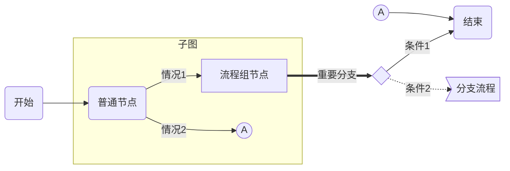
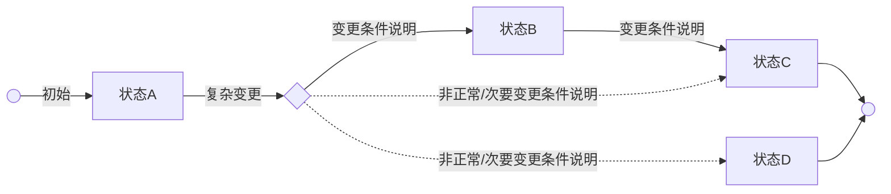
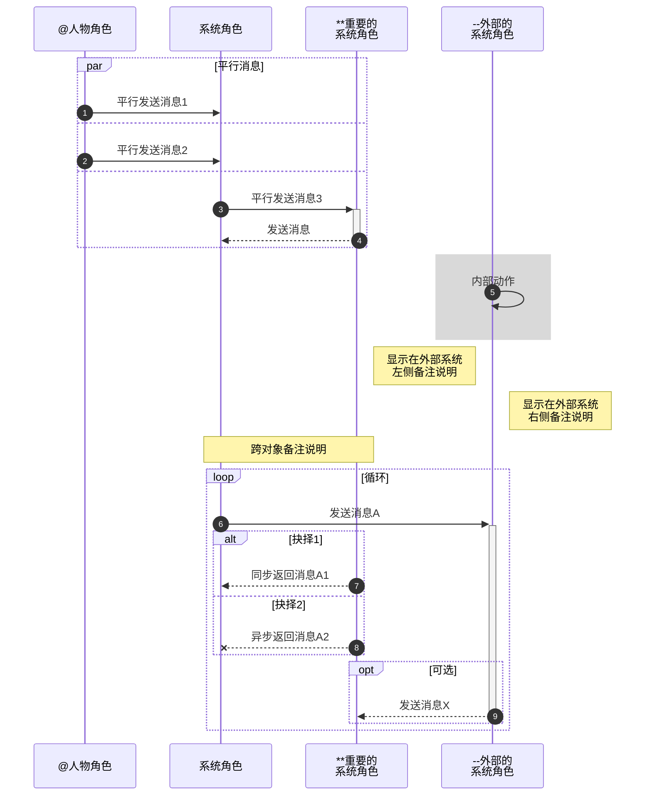

###### <sub>VLOOK™</sub><br />让你的 Markdown 有了新`{看}(wán)`法<br />──<br /><sup>快速参考手册</sup><br /><sup>( Version 9.31 )</sup><br /><br /><br />**MAX°孟兆**<br />*COPYRIGHT © 2016-2020. MAX°DESIGN.*

[TOC]

# VLOOK™ 是什么

`#最新版本|V9.31#(cyan)`　`#适用编辑器|Typora#(orange)`　`#开源协议|MIT#(blue)`　`#开发语言|JavaScript/HTML/CSS#(red)`

**VLOOK™** 是针对由 [Typora](https://www.typora.io)[^Typora]导出的 HTML 文件进行增强的插件，也许是目前最好的 Markdown 增强插件之一。<br />VLOOK™ 也是**[开源中国](https://www.oschina.net/p/vlook)**推荐的国产开源产品。

`#提示#(green)`<br />**你正在浏览在这个网页就是由 Typora 编辑并植入 VLOOK™ 插件生成的！AMAZING！**

---

VLOOK™ 属于开源软件，遵从 **[MIT 许可证](#许可协议)**。

项目代码托管：**[/madmaxchow/VLOOK](https://github.com/madmaxchow/VLOOK)　　[/madmaxchow/VLOOK](https://gitee.com/madmaxchow/VLOOK)**

`#扩展信息#`

> [+] **Markdown 是什么？**
>
> > 
> >
> > - 2004 年，[John Gruber](https://en.wikipedia.org/wiki/John_Gruber) 创造了 [Markdown](https://en.wikipedia.org/wiki/Markdown)，一种专门针对网络写作的`文本标记语言`。使用 Markdown，你只需在写作过程中插入少量的标记符号，就能很轻松地进行排版（例如设置标题、加粗、列表、引用等）；
> > - Markdown 文档以`纯文本格式存储`，这意味着，它们可以用几乎任一种文本编辑器打开。同时，又能通过 Markdown 编辑器导出为带排版的富文本文档、HTML 网页等等。==纯粹、简洁、易用、灵活==，都是人们喜欢 Markdown 的原因；
> > - 目前 Markdown 的标准化项目是 [CommonMark](http://commonmark.org)。
> 
> [+] **60 秒学会、10 分钟深入学习 Markdown 语法：**
> 
> > 1. `推荐` **Github Flavored Markdown** (GFM) 语法参考：Typora 目前采用该标准 [详细](https://support.typora.io/Markdown-Reference/)；
>> 2. 标准化 **CommonMark** 语法参考：[60 秒学会 Markdown 语法](http://commonmark.org/help/)、[10 分钟深入学习 Markdown](http://commonmark.org/help/tutorial/)。

[^Typora]: Typora 是跨平台的 Markdown 编辑器（也许是目前最好的编辑器，没有之一），支持直接预览与编辑，更详细的特性详见[官网](https://www.typora.io)。

# 适用场景

**如果你也有以下一个或多个需求或痛点，就可以放心地尝试基于 Markdown 的解决方案（如 Typora + VLOOK）进行文档的编辑、发布、管理：**

- 团队或项目的文档希望`*{统一模板与输出}(这样？)`，并且最好还能`*{随时切换不同模板}(这样？)`
- 希望只关注文档内容的撰写，排版这种繁琐工作希望能`*{自动化}(这样？)`完成
- ==以网络作为主要的发布渠道==，主要发布为 HTML 格式，同时能发布为 PDF 等其它常用格式
- ==减少==在文档（如：Word）、制图（如：Visio）等软件工具方面的==购买支出==
- 需要支持==跨平台==（Windows / macOS / Linux 等）进行文档的编辑的与输出的软件工具
- 文档排版、交互、个性化主题等功能方面，具备可持续升级的能力和开放性

# 特性清单

VLOOK™ 充分挖掘和扩展了 Markdown 和 Typora 的语法和功能……<br />并结合互联网化的文档编辑、出版中涉及的**格式排版**、**文档导航**、**演示辅助**、**内容交互**等方面的需求，为你提供基于 Markdown 的文档编辑、文档发布、文档阅读者提供**一致**、**简洁**、**友好**的体验。

###### ![VLOOK™ 特性清单]"环境要求：VLOOK™ V9.7+，Typora macOS版 V0.9.9.31+ / Win版 V0.9.83+"

| VLOOK™ 的特性及简介                                          |
| :----------------------------------------------------------- |
| ==**❶ 排版增强**==                                           |
| **[封面、封底](#封面、封底)**<br />配合主题样式，让你用 Markdown 写的文档也能焕发专业气质 |
| **[多主题样式](#多主题样式)**<br />让你的文档尽显个性，同时提供主题定制服务 |
| **[标题、插图、表格、表格行支持自动编号](#标题、插图、表格、表格行自动编号)**<br />“0” 配置，跟 Word 说 ByeBye 吧～ |
| **[自动生成插图、表格、代码块、音/视频的题注](#自动生成插图、表格、代码块、音/视频的题注)**<br />OMG! 配合插图、表格、代码块、音频、视频的自动编号，高效高颜值！还有独特的双题注～ |
| **[表格单元格合并](#表格单元格合并)**<br />这个是用 Markdown 人的真痛点，在这时为你提供了优雅的解决方法 |
| **[表格列格式化](#表格列格式化)**<br />Markdown 的表格也能快速优雅地设置列的格式（如加粗、高亮、斜体、下划线、数值、复选框等） |
| **[Mermaid 样式优化](#Mermaid 样式优化)**<br />全面深度优化 Mermaid 图表，并提供补丁修正其跨平台的兼容性问题 |
| **[图片排版增强](#图片排版增强)**<br />针对图片提供更多的排版控制，如 2x/3x 资源、反色、边缘空白、显示模式等，让图片的呈现方式更灵活、阅读体验更佳 |
| **[统一多级列表自动编号](#统一多级列表编号)**<br />将多级有序、无序列表的编号进行了统一，以更聚焦内容的结构化 |
| **[任务列表支持自动编号](#任务列表支持自动编号)**<br />让任务列表和多级列表的自动编号两者兼得 |
| ==**❷ 文档导航**==                                           |
| **[大纲导航](#大纲导航)**（适合于全局快速定位到文档内的目标章节）<br />最为熟悉和常用的文档导航方式，支持多级章节折叠 |
| **[逐章导航](#逐章导航)**（适合于在多章节间频繁切换，浏览相近章节的内容）<br />在长文档中特别好用，随时眯一眼就知道当前章节、前一章节、后一章节是什么了 |
| **[逐段导航](#逐段导航)**（适合于内容审核、讲解时，让演讲人与观众共同聚焦到同一段上）<br />这个很 GEEK，可以通过键盘逐段进行浏览，习惯用 VI/VIM 的人应该会欢呼！ |
| **[插图导航](#插图导航)**<br />让你快速在快速浏览文档的所有插图，并能直接跳到文档中对应的位置 |
| ==**❸ 酷°魔法**==                                            |
| **[彩虹标签](#彩虹标签)**<br />可自定义多个配色的单标签、双标签，让你的 Markdown 文档排版更专业、更标准化 |
| **[注音](#注音)**<br />                                      |
| **[黑幕](#黑幕)**<br />                                      |
| ==**❹ 演示辅助**==                                           |
| **[聚光灯](#聚光灯)**<br />太 COOL 了！在投影时可以让大家快速聚焦在关键内容上了 |
| **[表格十字光标、当前行游标](#表格十字光标、当前行游标)**<br />方便你与大家讨论长表格、大表格时，快速聚焦指定单元格，及对应的行和列 |
| **[在新标签打开插图、表格、代码块](#在新标签打开插图、表格、代码块)**<br />在长文档中的来回翻页查看插图、表格、代码示例是很崩溃的事，现在你可以让它们在浏览器的不同标签中显示了 |
| ==**❺ 内容互动**==                                           |
| **[表格行分组](#表格行分组)**<br />程序员、产品经理呼声最高的表格增强之一，从此你的表格就可以轻松实现分组和多级缩进了 |
| **[支持音频、视频](#支持音频、视频)**<br />你的 Markdown 文档从此可以看视频、听音频了，音频还支持迷你模式，应用的潜力等你来发挥～ |
| **[代码块增强](#代码块增强)**<br />在这你会发现连闷骚的代码都透着动感，高亮当行、复制～ |
| **[引用内容可设置为折叠](#引用内容可设置为折叠)**<br />引用内容很长很多？现在可以指定是否默认收起，读者点击才展示引用内容……在 VLOOK™ 的加持下，这里都不是事 |
| **[长内容自动折叠](#长内容自动折叠)**<br />长图、长表格、长代码会占用太多屏幕空间？现在可以统统自动折叠，静待你的二维展开指令 |
| **[文档内容检查与优化](#文档内容检查与优化)**<br />文档中的页内链接、图片链接失效了，现在 VLOOK™ 会悄悄告诉你的 |
| **[更友好的脚注](#更友好的脚注)**<br />用 Markdown 也可以像 Kindle 那样以弹窗方式来看脚注 |
| ==**❻ 视觉与交互**==                                         |
| **[Dark 模式](#Dark 模式)**<br />这个不用多说了，懂的人都会喜欢。也可手动切换回标准的 Light 模式 |
| **[字体风格选择](#字体风格选择)**<br />AMAZING! 不同的字体风格为你的文档带来不同的调性～ |
| **[更美观的公式](#更美观的公式)**<br />让你的各种公式长得与 VLOOK™ 的不同主题更搭 |
| **[打印样式适配](#打印样式适配)**<br />使用 VLOOK™ 提供的打印功能，确保文档样式适合商务办公场景下的打印输出 |
| **[快捷键操作](#快捷键操作)**<br />支持键盘快捷键操作，又可以再装个逼了～ |
| **跨平台支持**<br />能自适应在 PC 、平板、手机上进行浏览     |
| **自动识别超链接类型**<br />自动识别对超链接或资源的类型，并鼠标在链接上悬停时进行提示<br />超链接协议类型：[**#**](#)/[**http**](http://)/[**https**](https://)/[**mailto**](mailto:)/[**ftp**](ftp://)/[**ftps**](ftps://)/[**file**](file:///)/[**smb**](smb://)<br />文档资源：[**.doc**/**.xls**/**.ppt**/**.pdf**/**.txt**/**.csv**](file.doc)<br />归档资源：[**.zip**/**.rar**/**.7z**/**.gz**/**.tar**/**.dmg**/**.cab**](file.zip) |
| **9 种语言界面**<br />支持：**简**/**繁**/**英**/**法**/**德**/**西**/**俄**/**日**/**韩**（依赖于浏览器的当前语言设置） |

# 特性介绍

## 排版增强

**有了 VLOOK™ 主题及插件的支持，让你对 Markdown 编辑器（暂只支持 Typora）的自动化排版能力有了全新的理解。**

### 多主题样式

VLOOK™ 已为你内置了多套原创、独具风格的主题样式[^主题样式]，能满足日常大多不同的应用场景和视觉偏好：

1.**Hope 海洋之心**：[预览 ▷](https://madmaxchow.github.io/VLOOK/theme-hope.html)　　　2.**Joint 榫卯**：[预览 ▷](https://madmaxchow.github.io/VLOOK/theme-joint.html)　　　3.**Geek 极邃**：[预览 ▷](https://madmaxchow.github.io/VLOOK/theme-geek.html)

4.**Fancy 慕幻**：[预览 ▷](https://madmaxchow.github.io/VLOOK/theme-fancy.html)　　　5.**Thinking 静思**：[预览 ▷](https://madmaxchow.github.io/VLOOK/theme-thinking.html)　　　more...**[私人定制](#私人定制)**


> [+] **我要怎样才能使用这些内置的主题？**
>
> > 下载并添加主题文件（vlook-*.css）到 Typora 主题目录后，在导出 HTML 前通过 Typora 的「主题」菜单选择以「VLOOK」为前缀的主题，如：「Vlook hope」，更多使用指引详见《[如何使用](#如何使用)》
> >

###### 私人定制

目前 VLOOK™ 项目也现已开放了主题的 **私人定制** 服务 `#微信|MaxChow#(green)`，定制样品示例如下：


[^主题样式]: 可以根据通过修改`src\less\*.less`文件进行自定义扩展，访问 VLOOK™ 的[主页](http://github.com/madmaxchow/vlook)了解更多。

### 封面、封底

应用了 VLOOK™ 的主题后，即可通过 Markdown 的标准语法（须按 VLOOK™ 约定的使用规范）即可激活对应主题的封面、封底。

> [+] **这样就能激活封面！**
>
> > 在文档的第 1 行输入一个 6 级标题，如`###### 这是封面标题`即可激活，同时已内置对特定类型信息的自动排版，具体如下：
> >
> > [+] **标题**
> >
> > > - 默认格式就是标题格式，直接输入就可以了；
> >> - 可结合 HTML 的上标、下标方式进行「小标题、副标题」的延伸应用：
> > >   - 小标题：`<sub>文档大标题上的小标题</sub>`
> > >   - 副题：`<sup>文档大标题下的副标题</sup>`
> > 
> > [+] **文档类型、密级**
> >
> > > 可使用 VLOOK™ 的[双标签风格](#双标签风格)写法来实现，举例：
> >>
> > > - `` `#文档密级|对外公开#(green)` ``
> > > - `` `#文档密级|内部公开#(orange)` ``
> > > - `` `#文档密级|机密资料#(caution)` ``
> > 
> > [+] **作者**
> >
> > >  使用 Markdown 的「粗体」格式标记出「作者信息」即可（会自动添加前缀`By`、加粗），举例：`**我是作者**`
> > 
> > [+] **版权信息**
> >
> > >  使用 Markdown 的「斜体」格式标记出「版权信息」即可（会自动缩小字号、加粗），举例：`*(C)2020. 版权所有*`
> > 

**示例 1：**以下是一个最简化的文档封面 Markdown 语法示例内容：

```markdown
###### 在这填写文档标题<br />**在些填写作者**<br />*在这填版权归属方的信息*
```

**示例 2：**以下是本文档封面的完整 Markdown 语法示例内容：

```markdown
###### <sub>VLOOK™</sub><br />让你的 Markdown 有了新`{看}(wán)`法<br />──<br /><sup>快速参考手册</sup><br /><sup>( Version 9.31 )</sup><br /><br /><br />**MAX°孟兆**<br />*COPYRIGHT © 2016-2020. MAX°DESIGN.*
```


>  [+] **这样就能激活封底！**
>
> > 在文档的最后一行输入一个 6 级标题，如`###### 这是封底结语`即可激活，同时已内置对特定类型信息的自动排版。

以下是本文档封底的 Markdown 语法示例内容：

```markdown
###### The End
```

**~ SO EASY!**

`#提示#(green)` **如何换行？** <br />可直接输入 HTML 的换行标签`<br />`即可；若在表格内编辑，可直接使用快捷键 <kbd>⇧ Shift </kbd>＋<kbd> Enter ↵ </kbd>

### 标题、插图、表格、表格行自动编号

如果你使用过 Word 的标题、图表的自动编码功能，就会惊喜地发现，基于 Markdown 也能做到，甚至能做得更好～<br />既不需要进行额外的设置和语法支持，甚至还能对表格行进行自动行号编号，一起来看看吧。

> [+] **标题自动编号**
>
> > 所有 VLOOK™ 的主题都会自动对 `1 ~ 5级` 标题进行自动编号；
> >
> > 编号的格式就是你在本文各级章节标题所看到的那样；
> >
> > 因为`6级` 标题在 VLOOK™ 中应用于[封面和封底](#封面、封底)、段落小标题的排版等，所以不在自动编号范围内。
>
> [+] **插图自动编号**
>
> > 支持对文档内所有的插图，包括图片、Mermaid 图表进行统一的自动编号，编号格式为：`图 XX`；
> >
> > 正如你在前面看到的那些介绍[内置主题](#多主题样式)的图片那样。
>
> [+] **表格、表格行自动编号**
>
> > 支持对文档内所有表格进行统一的自动编号，编号格式为：`表 XX`；
> >
> > 要激活**表格行**的自动编号，须在表格前添加一个 6 级的标题，如：`###### 以下是一个表格`
> >
> > 或在有序、无序列表下的缩进表格。

###### 表格前添加 6 级标题会激活表格行的自动编号，效果如下

| 列1    | 列2    |   列3    |    列4 |
| --- | --- | :---: | ---: |
| 第一行 | 左对齐（长内容） | 居中对齐 | 右对齐（长内容） |
| 第二行（长内容） | 左对齐 | 居中对齐（长内容） | 右对齐 |

- **有序、无序列表下的缩进表格，会激活表格行的自动编号，效果如下：**

   | 列1    | 列2    |   列3    |    列4 |
   | --- | --- | :---: | ---: |
   | 第一行 | 左对齐（长内容） | 居中对齐 | 右对齐（长内容） |
   | 第二行（长内容） | 左对齐 | 居中对齐（长内容） | 右对齐 |

`#提示#(green)`<br />听说你还想给插图、表格添加题注？好消息是 VLOOK™ 也支持，接着看就能又甩你一个新技能～

### 自动生成插图、表格、代码块、音/视频的题注

你只需要按 GFM 添加图片的 Markdown 语法，VLOOK™ 就会自动为你的图片添加图注。<br />如果你要为表格、Mermaid 图表，甚至还要同时支持两个题注，这些都可以使用 VLOOK™ 扩展的类似添加图片的语法就能轻松实现～

> [+] **这样做，你就能为图片自动生成题注**
>
> > 以 GFM 添加图片的 Markdown 语法为基础：``
> >
> > - **图片标题：**即为默认题注，如：``
> > - **可选子标题：**若填写了可选子标题，该可选子标题就会自动生成为第 2 题注，如：``。
> >
> > `#注意#`以上语法中的「可选子标题」与「图片URL」间须以英文空格 <kbd>　　SPACE　　</kbd> 进行分隔
>
> [+] **这样做，也能为表格、Mermaid 图表、代码块添加题注**
>
> > - **懒人方案：**
> >   - 在表格、Mermaid 图表、代码块前直接编写题注内容；
> >   - 然后将内容设置为六级标题（例如：`###### 这条是表格题注`），同时该六级标题内容在生成题注后，不会被隐藏。
> > - **扩展语法、双题注方案：**
> >   - 在表格、Mermaid 图表、代码块前增加题注描述，使用语法是 VLOOK™ 扩展 GFM 的添加图片的 Markdown 语法；
> >   - 语法：`![默认题注]"第2题注"`，其中的「第 2 题注」内容为可选；
> >   - 该语法的所有内容由 VLOOK™ 转换后被隐藏，若要保留原始标题内容，可另起一行进行描述。

有关 **表格、Mermaid 图表** 的题注效果效果可以继续看下面[表格单元格合并](#表格单元格合并)的表格样例

### 表格单元格合并

表格是文档中最多见的元素，虽然 GFM 扩展了 Markdown 的语法实现了对表格的支持，但对排版上的支持还是比较弱。<br />目前 Markdown 粉们呼声最多的就是单元格合并了～

**现在 VLOOK™ 已为你带了简洁、优雅的单元格跨行、跨列合并的解决方案：**

> [+] **跨列合并（横向）语法**
>
> > 在单元格内输入`==`进行标识，该单元格将会与左邻的单元格进行合并，以此类推。
> >
> 
>[+] **跨行合并（纵向）语法**
> 
>> 在单元格内输入`:`进行标识，该单元格将会与上方的单元格进行合并，同时还支持表头的跨行合并。
> >

###### ![示例一：单元格并列合并、行合并]"注：须使用最新版的 Typora 和 VLOOK"

| **普通列头**      | `#标签|测试#`横向合并×2 | == | 普通列头 | 横向合并×3 | ==  | ==          |
| ----------------- | ----------------- | ----------------- | ------------- | ------------- | ---------- | ----------------- |
| 纵向合并×3 | 普通单元格        | 普通单元格        | 普通单元格 | 普通单元格    | 普通单元格 | **纵向（全合并）** |
| :         | 纵向合并×2`#标签|测试#` | 横向合并×4 | ==       | ==        | ==     | :                |
| :             | :             | 普通单元格        | 普通单元格    | 普通单元格    | 普通单元格 | :                |
| 普通单元格 | 纵向并×3 | 普通单元格        | 普通单元格    | 普通单元格    | 普通单元格 | :                |
| 普通单元格 | :               | `#标签|测试#`普通单元格 | 普通单元格    | 普通单元格    | 普通单元格 | :                |
| 普通单元格        | :               | 普通单元格        | 普通单元格    | 普通单元格    | 普通单元格 | :                |

###### 示例二：表头跨行合并1

| 纵向合并×2 | 横向合并×2 | == | 纵向合并×2 | 横向合并×3 | == | == |
| ----------------- | ------------- | ------------- | :-----------: | ------------- | ------------- | ------------- |
| : | 二级列头 | 二级列头 | :   | 二级列头      | 二级列头 | 二级列头 |
| 普通单元格 | 普通单元格     | 普通单元格     | 普通单元格     | 普通单元格          | 普通单元格    | 普通单元格 |
| 普通单元格 | 普通单元格 | 普通单元格 | 普通单元格 | 普通单元格 | 普通单元格 | 普通单元格 |

###### 示例三：表头跨行合并2

| 纵向合并×3 | 横向合并×3 | == | == | == | 纵向合并×3 | 纵向合并×3 |
| ----------------- | ------------- | ------------- | :-----------: | ------------- | ------------- | ------------- |
| : | 二级列头0 | 二级列头1 | 二级列头2 | 二级列头3     | : | : |
| : | 二级列头0 | 三级列头1 | 三级列头2 | 三级列头3     | :    | : |
| 普通单元格 | 普通单元格 | 普通单元格 | 普通单元格 | 普通单元格 | 普通单元格 | 普通单元格 |

`#注意#`<br />如果你还需要对表格的列格式进行设置（如整列加粗、斜体等），VLOOK™ 也提供了同样好的支持，详见以下的[表格列格式化](#表格列格式化)

### 表格列格式化

表格是文档中最多见的元素，虽然 GFM 扩展了 Markdown 的语法实现了对表格的支持，但对排版上的支持还是比较弱。

VLOOK™ 除了为你带来单元格合并的能力外，还支持设置表格整列格式的能力～具体详见下面的章节

#### 表格列常规格式化

**只须在表头按以标准的 Markdown 或 GFM 的格式设置语法设置对应的格式即可实现整列格式化。**

标准的 Markdown 或 GFM 支持的格式设置语法为：`**加粗**`、`*斜体*`、`~~删除线~~`、`==高亮==` 、`<u>下划线</u>`

###### 表格列常规格式化示例

| **加粗** | `#标签#`*斜体 afgiklo 10* | <u>下划线 afgiklo 10</u> | ==高亮==                | ~~删除线~~              |
| :-----------: | ------------------------ | ------------------------ | ------------------------ | ------------------------ |
| 单元格（横向合并） | == |    单元格 afgiklo 10    | 单元格`#标签#`单元格 | 单元格`#标签组|标签#`单元格 |
| 单元格  | 单元格 afgiklo 10 | 单元格 afgiklo 10 | 单元格内有**加粗**内容   | 单元格内有**加粗**内容   |
| 单元格   | 单元格 afgiklo 10 | 单元格 afgiklo 10 | 单元格内有`行内代码`内容 | 单元格内有`行内代码`内容 |

###### 表格列常规格式化_嵌套示例

| **普通列** | 横向合并×4              | ==                              | ==                       | ==                          |
| :--------: | :---------------------- | ------------------------------- | ------------------------ | --------------------------- |
|     :      | ==<u>高亮＋下划线</u>== | ***<u>加粗＋斜体＋下划线</u>*** | **==加粗＋高亮==**       | ~~**删除线+加粗列**~~       |
|     A      | 单元格 afgiklo 10       | 单元格 afgiklo 10               | 单元格`#标签#`单元格     | 单元格`#标签组|标签#`单元格 |
|     B      | 单元格 afgiklo 10       | 单元格 afgiklo 10               | 单元格内有**加粗**内容   | 单元格内有**加粗**内容      |
|     C      | 单元格 afgiklo 10       | 单元格 afgiklo 10               | 单元格内有`行内代码`内容 | 单元格内有`行内代码`内容    |

#### 表格列增强格式化

**结合 GFM 任务列表语法，以及对右对齐的列进行约定处理，以实现增强的表格的格式化。**

###### 复选框的列

表格列头内容以`[(空格)](空格)`为前缀（如`[ ] 复选框列`），就可以为该列增加样式为`未选择`的复选框：

- 表格单元格内可直接使用任务列表的语法，独立指定某单元格复选框样式：
  - 若单元格的内容以`[x]`开头时，为`已选择`样式；
  - 若单元格的内容以`[-]`开头时，为`不确定选择`样式。
- 举例如下：

  | **复选框样式** |    [ ] 复选框列     | 说明                     |
  | :------------: | :-----------------: | ------------------------ |
  |      留空      |                     | 默认为`未选择`的状态     |
  |     已选择     |         [x]         | 指定为`已选择`的状态     |
  |   不确定选择   | [-]<br />当值 ≥ 0 时 | 指定为`不确定选择`的状态 |

---

###### 数值格式列

表格列设置为「**右对齐**」，则针对数字内容自动进行「数值」格式化：

- 通用样式：
  - 千位符、小数部分小字号 
  - 支持通过正负号`+` `-`，突出正负数
- 对百分数、货币类的数值进行定向微调：
  - 百分率：以进度条样式显示；
  - 货币：对货币符号（如：`¥` `$`），或货币简写（如：`CNY` `USD` `HKD`等）进行特殊样式处理，货币符号或简写与金额值之间须添加空格。

###### 数值格式列_举例 1

| 原始内容     |  数值情况  | ==       |    ==    |     ==     |      数值列 |
| ------------ | :--------: | -------- | :------: | :--------: | ----------: |
| :            | [ ] 含小数 | [ ] 正数 | [ ] 负数 | [ ] 超三位 |           : |
| ==普通数值== |     ==     | ==       |    ==    |     ==     |          == |
| 123          |            |          |          |            |         123 |
| -12345       |            |          |   [x]    |    [x]     |      -12345 |
| +5678.00     |    [x]     | [x]      |          |    [x]     |    +5678.00 |
| -2345678.00  |    [x]     |          |   [x]    |    [x]     | -2345678.00 |
| ==百分数==   |     ==     | ==       |    ==    |     ==     |          == |
| 79%          |            |          |          |            |         79% |
| 88.88%       |    [x]     |          |          |            |      88.88% |
| +38%         |            | [x]      |          |            |        +38% |
| -57.30%      |    [x]     |          |   [x]    |            |     -57.30% |
| 100%         |            |          |          |            |        100% |

###### 数值格式列_举例 2

| **币种** | 原始内容       |  数值情况  |    ==    |    ==    |     ==     |     **数值列** |
| :------: | -------------- | :--------: | :------: | :------: | :--------: | -------------: |
|    :     | :              | [ ] 含小数 | [ ] 正数 | [ ] 负数 | [ ] 超三位 |              : |
|  人民币  | ￥ 123456.99   |    [x]     |          |          |    [x]     |   ￥ 123456.99 |
|    :     | CNY -987654.99 |    [x]     |          |   [x]    |    [x]     | CNY -987654.99 |
|    :     | ¥ +1024        |            |   [x]    |          |    [x]     |        ¥ +1024 |
|   港元   | HK$ 3456.78    |    [x]     |          |          |    [x]     |    HK$ 3456.78 |
|    :     | HKD 3456.78    |    [x]     |          |          |    [x]     |    HKD 3456.78 |
|   美元   | $ +555.38      |            |          |          |            |      $ +555.38 |
|    :     | USD 555        |            |          |          |            |        USD 555 |
|   澳元   | A$ 56789       |            |          |          |    [x]     |       A$ 56789 |
|    :     | AUD -56789     |            |          |   [x]    |    [x]     |     AUD -56789 |

### Mermaid 样式优化

VLOOK™ 针对比较受关注的 Mermaid 图表提供了样式的统一和优化，并提供跨平台、跨浏览器在不同 DPI 的兼容性补丁。

> [+] **统一和优化样式**
>
> > 支持 Mermaid 的 **饼图、流程图、状态图、顺序图、类图、甘特图**，同时还能自动适配 [Dark 模式](#Dark 模式)。
> >
> > 除了样式优化外，还对书写规范进行了统一，效果比其官网的要好上许多许多～
> >
> > + 基于流程图衍生出状态机图；
> > + 针对顺序图，支持不同角色类型（人、系统、重要系统、外部系统），重绘不同的外观样式；
> > + 针对顺序图的 `#opt#(gray)` `#alt/else#` `#loop#(orange)` 标签优化不同的外观样式，以及自动翻译为当前浏览器的语言。
>
> [+] **跨平台跨浏览器的兼容性补丁**
>
> > 操作系统涉及 Windows、macOS、Linux，分辨率涉及到普通和高清，浏览器涉及主流的 Chrome / Firefox / Edge。
> >
> > Mermaid 的图表在以上复杂情况下的一致性还是做得不够到位，所以 VLOOK™ 提供了一个非官方的兼容补丁，为大家提供一个更好的浏览体验。
> >
> > 
> >
> > **如何取消兼容性补丁？**
> >
> > 可通过 URL 参数`fix-mermaid=false`强制取消。

###### Mermaid 的流程图

![流程图]"（以上的「分支流程」内容由下图进行接续）"


![分支流程（接续上图）]


###### Mermaid 的状态图

![由 Mermaid 流程图语法衍生的状态图]



###### Mermaid 的顺序图

![多种不同角色的顺序图，更清晰、更友好]


`#参考#(green)`<br />更多脚本化图表样式，以及结合 VLOOK™ 相关的脚本编写规范内容详见《[脚本化图表 for Markdown](https://madmaxchow.github.io/VLOOK/chart.html)》。

### 图片排版增强

应用了 VLOOK™ 主题的文档，针对图片提供了更加多样的排版控制特性。

###### 支持 2x、3x 图片资源

- 目前高分屏的应用已非常广泛，VLOOK™ 可以让 Markdown 文档中的图片在不同的设备上获得最好的效果；
- 目前支持`2x` `3x`的高清图片资源；
- 对于对需要支持显示高清显示的图片，可在图片 URL 中增加启用高清图片资源的参数`srcset`，及`@2x` `@3x`后缀，具体示例如下：
  - 2x：``
  - 3x：``
  - 2x/3x：``
- `srcset`指定的 2x/3x 的图片与标准分辨率图片若在同一目录下（如以上示例中的`images/`），可只填写图片名称，而无需包含路径信息；
- 如果不指定任何`srcset`，VLOOK™ 也会自动将当前图片作为 2x 资源，这样在高分屏上也能确定图片显示清晰（但图片大小会相应缩小），可通过 URL 参数`imgx=false`来取消这个自动转换。

**（示例效果可以参考下面章节的插图▼）**

---

###### 支持指定图片在 Dark 模式时反色显示

- 图片默认在 Dark 模式时按原始颜色显示，可指定在 Dark 模式时以反色显示以获得更好的显示效果；
- 对需要在 Dark 模式中以反色显示的图片，可在图片 URL 增加启用 Dark 模式反色的参数`invert=dark`；
- 现在就试试按下键盘的<kbd>D</kbd>键，然后看看下面插图的变化～

　　

---

###### 支持在一行内显示多张插图

插图默认是独占一行，如需在一行内显示多张图片，可在图片 URL 增加启用不换行的参数`inline=true`，效果如上两图所示▲。

---

###### 支持指定图片添加边缘空白

- 对需要添加边缘空白的图片，可在图片 URL 中增加启用边缘空白的参数`padding=true`
- 语法：``
- ▲以上两张图片均已开启边缘空白，以适合图片内容过于贴边，无留白的情况。

---

###### 支持指定图片以不同的模式进行呈现

- 图片默认均以「插图」的模式进行呈现；

- 为满足多样的排版控制，可通过在图片 URL 中增加指定参数实现不同的显示模式：

  | 显示模式 | 应用说明                                                     | URL 参数    | 语法示例                           |
  | :------: | ------------------------------------------------------------ | ----------- | ---------------------------------- |
  |   icon   | 缩小显示为固定大小的小图标<br />主要用于与正文进行混排       | `mode=icon` | `` |
  |   logo   | 不调整图片大小<br />主要用于展示 Logo 或不是作为「插图」的图片 | `mode=logo` | `` |

- **icon 模式举例：**

  「**VLOOK™** 是**[开源中国](https://www.oschina.net/p/vlook)**推荐的国产开源项目，也许是目前最好的 Markdown 增强插件之一」

- **logo 模式举例：**

  对于深色的图片或图标，配合`invert=dark`能自动适应 Dark 模式，现在就试试按下键盘的<kbd>D</kbd>键，然后看看下图的变化～
  
  

---

`#扩展信息#`

>  [+] **图片 URL 参数语法说明**
>
> > - **图片 URL 无参数时：**先在 URL 后添加英文问号`?`后，再添加需要的 URL 参数： ``
> > - **图片 URL 已有参数时：**多个参数间用英文特殊符号`&`进行分隔： ``

### 统一多级列表编号

对所有**有序**、**无序**的多级列表编号进行了统一以有序编号为主，无序编号为辅，简化多级内容的编写。

> [+] **列表分级编号样式效果**
>
> > - 一级列表内容
> >
> > - 一级列表内容
> >   - 二级列表内容
> >     - 三级列表内容
> >       - 四级列表内容
> >         - 五级列表内容
> >           - 六级列表内容
> > - 三级列表内容


Markdown 原始内容参考如下：

```markdown
- 一级列表内容
   - 二级列表内容
     - 三级列表内容
       - 四级列表内容
         - 五级列表内容
           - 六级列表内容
1. 一级列表内容
   + 二级列表内容
     - 三级列表内容
```

### 任务列表支持自动编号

目前 GFM 标准的任务列表（to-do）默认会取消其列表编号。<br />**VLOOK™ 主题会保持任务列表特性基础上，恢复列表编号的显示，并与上面[统一多级列表编号](#统一多级列表编号)保持一致。<br />同时，完善了任务项样式，以及自动根据子任务项的完成状态，自动修正上级任务项的完成状态（未完成、已完成、部分完成）。**

###### 举例 1

- [ ] 这是`部分完成`的一级任务列表项 1
  - [ ] 这是二级任务列表项 1.1
  - [ ] 这是`部分完成`的二级任务列表项 1.2
    - [x] 这是`已完成`的三级任务列表项 1.2.1
          - [x] 这是`已完成`的四级任务列表项 1.2.1.1
              - [x] 这是`已完成`的四级任务列表项 1.2.1.2
            - [ ] 这是三级任务列表项 1.2.2
  - [x] 这是`已完成`的二级任务列表项 1.2
- [ ] 这是`部分完成`的一级任务列表项 2
  - [x] 这是二级任务列表项 2.1
  - [ ] 这是二级任务列表项 2.2
- [ ] 这是一级任务列表项 3

###### 举例 2

- [ ] 这是`部分完成`的一级任务列表项
  - [ ] 这是二级任务列表项
  - [x] 这是`已完成`的二级任务列表项
    - [x] 这是`已完成`的三级任务列表项
      - [ ] 这是四级任务列表项
  - [x] 这是`已完成`的二级任务列表项

## 酷°魔法

「==**酷°魔法**==」是基于 Markdown 行内代码（Code）语法`` ` ` `` 进行扩展，实现各种好玩、有趣的排版和交互的特性合集。

### 彩虹标签

###### 单标签风格

+ **语法：**`` `#tag#(style)` ``

  `tag`：标签内容由`#`包裹

  `style`：可选。指定标签以特定的样式显示，不指定则默认为 `(red)`

  + 举例：`` `#标签1#` `` `` `#标签2#(blue)` ``

+ **应用示例：**

  | 后缀标识 | 举例                    | 应用场景建议                 | 渲染效果          |
| :----------: | ----------------------- | ---------------------------- | ----------------- |
  |  (red)  | `` `#标签#(red)` `` | 警告、危险、关键事项、删除   | `#标签#(red)` |
  |   (orange)   | `` `#标签#(orange)` `` | 提醒、注意、修复 | `#标签#(orange)` |
  | (yellow) | `` `#标签#(yellow)` `` | 关注、优化、备忘、说明 | `#标签#(yellow)` |
  |    (green)    | `` `#标签#(green)` `` | 提示、参考、新增       | `#标签#(green)` |
  |    (cyan)    | `` `#标签#(cyan)` `` | 引用、公告 | `#标签#(cyan)` |
  |   (blue) | `` `#标签#(blue)` ``  | 信息、资讯             | `#标签#(blue)` |
  |   (purple)   | `` `#标签#(purple)` `` | 延伸、扩展、保留、备用       | `#标签#(purple)` |
  |   (magenta)   | `` `#标签#(magenta)` `` | 年轻、个性、女性           | `#标签#(magenta)` |
  |   (brown)   | `` `#标签#(brown)` `` | 稳定、金融、工程 | `#标签#(brown)` |
  |    (gray)    | `` `#标签#(gray)` `` | 无效、暂缓、停用、结束       | `#标签#(gray)` |

---

###### 双标签风格

- **语法：**`` `#tag1|tag2#(style) ``

  `tag1` `tag2`：两个标签的内容，由`#`包裹，并以英文竖线符号`|`作为分隔符

  `style`：可选。指定标签以特定的样式显示，不指定则默认为 `(red)`
- 应用于二元标签的场景，举例如下：

  - `#版本号|V1.0.2#(blue)`
  - `#变更 X 的取值|1234.00#(cyan)`
  - `#优先级|中#(orange)`
  - `#优先级|高#`

###### 更多应用示例

| 后缀标识 | 举例                           | 应用场景建议                 | 渲染效果                 |
| :----------: | ------------------------------ | ---------------------------- | ------------------------ |
|  (red)  | `` `#标签组|标签#(red)` `` | 警告、危险、关键事项、删除   | `#标签组|标签#(red)` |
|   (orange)   | `` `#标签组|标签#(orange)` `` | 提醒、注意、修复 | `#标签组|标签#(orange)` |
| (yellow) | `` `#标签#(yellow)` `` | 关注、优化、备忘、说明     | `#标签组|标签#(yellow)` |
|    (green)    | `` `#标签组|标签#(green)` `` | 提示、备忘、参考、新增       | `#标签组|标签#(green)` |
|    (cyan)    | `` `#标签组|标签#(cyan)` `` | 引用、公告                 | `#标签组|标签#(cyan)` |
|    (blue)    | `` `#标签组|标签#(blue)` `` | 信息、资讯             | `#标签组|标签#(blue)` |
|   (purple)   | `` `#标签组|标签#(purple)` `` | 延伸、扩展、保留、备用       | `#标签组|标签#(purple)` |
|   (magenta)   | `` `#标签组|标签#(magenta)` `` | 年轻、个性、女性           | `#标签组|标签#(magenta)` |
|   (brown)   | `` `#标签组|标签#(brown)` `` | 稳定、金融、工程           | `#标签组|标签#(brown)` |
|    (gray)    | `` `#标签组|标签#(gray)` `` | 无效、暂缓、停用、结束       | `#标签组|标签#(gray)` |

### 注音

VLOOK™ 通过延续 Markdown 语法风格，设计等价于 HTML 5 中 **[ruby](https://www.runoob.com/tags/tag-ruby.html)**、**[rp](https://www.runoob.com/tags/tag-rp.html)**、**[rt](https://www.runoob.com/tags/tag-rt.html)** 标签的 Markdown 化实现。主要用于对东亚字符的发音的标注，或是对文字的注释。

- **语法：**`` `{text}(symbol)` ``

  `text`：要添加「注音、拼音、注释」的文字

  `symbol`：text 对应的注音、拼音符号，或注释内容
- **应用示例：**「==`{道}(dào)`生一，一生二，二`{生}(shēng)`三，三生`{万物}(wàn wù)`==」── 道德经•老子

###### 更多的应用示例

| 语种 | 示例                                                  | 效果                                |
| :------: | ----------------------------------------------------- | ----------------------------------- |
|  普通话  | `` `{道}(dào)` `` `` `{德}(dé)` `` `` `{经}(jīng)` `` | `{道}(dào)` `{德}(dé)` `{经}(jīng)` |
|   粤语   | `` `{道德经}(dou däk gïng)` ``                        | `{道德经}(dou däk gïng)`            |
|   英语   | `` `{道德经}(The Scripture of Ethics)` ``             | `{道德经}(The Scripture of Ethics)` |


### 黑幕

目前 VLOOK™ 实现的是延续 Markdown 语法风格进行设计和简化的版本，可以应用于一些培训材料等涉及交互的场合。

> **[+] 什么是「黑幕」？**
>
> > 嘿嘿～这里说的「黑幕」是一种 WIKI 或论坛的恶搞文化，将指定文字涂黑（或其他任意颜色）的文字。
> >
> > 可添加「黑幕」打开前的提示信息。点击「黑幕」后，会打开并显示原始内容。
> >
> > `*{哈哈，这条信息就是「黑幕」的内容}(例如点击这里试试看)`

- **语法：**`` `*{text}(tips "color")` ``

  `text`：被黑幕遮盖的内容

  `tips`：可选，黑幕揭开前显示的提示信息

  `color`：可选，可自定义黑幕的颜色。与须先添加`tips`，以英文的双引号`""`包裹，颜色为 CSS 规范的颜色语法

  如：`*{Red}(标准颜色名称)`、`*{#DD0088}(# 十六进制格式)`、 `*{rgb(220,0,128)}(RGB 十进制格式)`、`*{var(--header-color)}(自定义 CSS 变量)`等

- **应用示例：**

  | 示例                                      | 效果（点击以下的「黑幕」显示原始内容） |
  | ----------------------------------------- | -------------------------------------- |
  | `` `*{这是黑幕的内容}` ``                 | `*{这是黑幕的内容}`                    |
  | `` `*{这是黑幕的内容}(提示信息)` ``       | `*{这是黑幕的内容}(提示信息)`          |
  | `` `*{这是黑幕的内容}("#DD8800")` ``      | `*{这是黑幕的内容}("#DD8800")`         |
  | `` `*{这是黑幕的内容}(提示信息 "Red")` `` | `*{这是黑幕的内容}(提示信息 "Red")`    |

- 打印输出前，可根据提示，选择 **显示** 或 **隐藏** 黑幕的内容。

## 文档导航

**VLOOK™ 提供了对文档章节、插图提供了多种形式的导航和快速定位的工具，全面改善和提高发布的 HTML 文件的浏览体验和效率。**
**敬请你根据需要和喜好随时、轻松享用～**

![文档导航工具及适用场景]

| 导航工具 | 适用场景                                                     |
| :----------: | ------------------------------------------------------------ |
|   大纲导航   | 适用于目标明确，跨多个章节的快速定位                         |
|   逐章导航   | 适用于前后章节相关度高，按章节顺序一章一章进行浏览           |
|   逐段导航   | 适用于文档评审或演示，按段落一段一段进行聚焦式浏览           |
|  插图导航  | 适用于按图索骥，通过浏览文档中的插图（图片、mermaid 图表）来直接跳到文档中对应的位置 |

### 大纲导航

在封面时，点击左上角的大纲按钮打开大纲导航面板。不在封面时，会自动贴在文档左侧固定显示大纲导航面板。支持对章节进行折叠、展开操作。

`#注意#`<br />编写 Markdown 文档时，须在封面后添加目录标记`[TOC]`才能在导出的 HTML 中生成大纲面板。

### 逐章导航

进入文档正文区后，会自动在顶部显示逐章导航条，在封面时会自动收起隐藏，支持对 1~5 级章节进行逐章浏览。

从左到右分别为：**前一章节**、**当前章节**、**后一章节**，正如你现在看到顶部的导航栏那样。<br />鼠标点击对应的章节直接跳转到对应的章节开始位置，也可通过左、右方向键进行操作。

`#注意#`<br />编写 Markdown 文档时，须在封面后添加目录标记`[TOC]`才能在导出的 HTML 中生成逐章导航面板。

### 逐段导航

在进行**文档评审或演示**时，可以激活逐段导航，对单段内容进行聚焦。<br />通过鼠标双击文档任意段落激活逐段导航模式，并通过快捷键进行上、下改变当前聚焦的段落。

![致敬 VI / VIM]

|             快捷键             | **功能**            |
| :---------------------------------: | :----------------- : |
|          <kbd>J</kbd>          | 下一个段落 |
| <kbd>K</kbd> | 上一个段落 |
| <kbd>H</kbd> | 往前跳十个段落 |
| <kbd>L</kbd> | 往后跳十个段落 |

### 插图导航

+ 点击任意插图可直接启动插图导航，或点击工具栏上的插图导航图标启动；
+ 点击插图导航内的插图，能直接跳转到文档中对应的位置。

[^Mermaid]: Mermaid 是一个用于画流程图、状态图、顺序图、甘特图的库，使用 JS 进行本地渲染，广泛集成于许多 Markdown 编辑器中。详见 [Mermaid官网](https://mermaidjs.github.io)，或 VLOOK™ 的示例文档《[脚本化图表 for Markdown](https://madmaxchow.github.io/VLOOK/chart.html)》
[^flowchart.js]: flowchart.js 基于 SVG 的流程图插件，它仅需几行代码即可在 Web 上完成流程图的构建。可以从文字表述中画出简单的 SVG 流程图，也可以画出彩色的图表。详见 [flowchart.js 官网](http://flowchart.js.org)，或 VLOOK™ 的示例文档《[脚本化图表 for Markdown](https://madmaxchow.github.io/VLOOK/chart.html)》。
[^JS Sequence Diagrams]: JS sequence diagrams 是一个方便建立UML的顺序图（序列图or循序图）在线工具，使用简单。详见 [JS Sequence Diagrams](https://bramp.github.io/js-sequence-diagrams/) 官网，或 VLOOK™ 的示例文档《[脚本化图表 for Markdown](https://madmaxchow.github.io/VLOOK/chart.html)》。

> [+] **支持的插图类型**
>
> > - 浏览器支持的所有图片（如：jpg / png / gif / bmp 等）
> > - 脚本化图表（Mermaid[^Mermaid]，从`VLOOK V9.0`开始移除对 flowchart.js[^flowchart.js]、JS Sequence Diagrams[^JS Sequence Diagrams]的支持）

###### 这是长图片示例：


## 演示辅助

**VLOOK™ 独创性地为 Markdown 导出的 HTML 提供了强大的演示辅助工具，让面向 Markdown 的 Typora + VLOOK 成为更具生产力的交互式文档出版工具。**

**非常适合现场和远程的演示辅助工具，敬请为你的 Markdown 开启 Turbo 模式～**

![演示辅助工具及适用场景]

|       **演示辅助工具**       | 适用场景                                                     |
| :--------------------------: | ------------------------------------------------------------ |
|            聚光灯            | 对局部内容进行聚焦，如：插图、多个段落内容                   |
|         表格十字光柱         | 针对表格内容，特别是行、列关联性强的表格，快速关联任意单元格的横向、纵向单元格序列 |
| 新标签打开插图、表格、代码块 | 针对须频繁在多个插图、表格、代码块间进行切换时使用，大大减少不必要的文档内跳转 |

### 聚光灯

在进行文档评审或演示时，可以通过激活聚光灯来让观众聚焦于文档的特定区域和内容。

通过工具栏上的「聚光灯」按钮打开、关闭，也可通过快捷键 <kbd>S</kbd> 进行切换。打开聚光灯后，可支持按通过 <kbd>⇧ Shift</kbd> 键调节灯的大小。

`#小提示#(green)`<br />聚光灯在新标签打开的页面中也可以使用喔～

### 表格十字光标、当前行游标

###### 十字光标

鼠标点击表格上的任意单元格后，会自动显示十字光标，高亮其横向、纵向关联对应的单元格序。

###### 当前行游标

除了前面提到的的特性外，鼠标滑过表格行时，在其左侧会通过突出的**游标**进行标识，便于在编辑和阅读时更容易辨识出当前行。

###### 试试点击表格的任意单元格，或让鼠标光标在以下表格行间进行移动

| 列1              | 列2              |        列3         |              列4 |
| ---------------- | ---------------- | :----------------: | ---------------: |
| 第一行           | 左对齐（长内容） |      居中对齐      | 右对齐（长内容） |
| 第二行（长内容） | 左对齐           | 居中对齐（长内容） |           右对齐 |

`#小提示#(green)`<br />表格十字光标在新标签打开的页面中也可以使用喔～

### 在新标签打开插图、表格、代码块

支持在新标签中打开文档中的 **插图**、**表格**、**代码块**，鼠标悬念在这些文档内容上时会在左上角显示「在新标签打开」的按钮，点击即可。

[查看示例效果](#表格单元格合并)。

## 内容互动

**得益于成熟的 Web 浏览器、HTML / CSS、JavaScript 技术，让静态的文档也能与你一起「动」起来。**

### 表格行分组

**为满足对于产品设计文档、技术文档（如 API 接口文档）都会在同一个表格内，对不同的表格行进行分组。VLOOK™ 结合了 GFM 的表格和引用的语法，扩展支持对表格行进行分组。**

在任意表格行的首列，使用 Markdown 的引用的语法`>(空格)`，即可表示该行缩进一级，其前一行即为上一级的分组；多个`>`表示缩进多级，如三级缩进`>>>(空格)`。

| 分组分级     | 写法举例         |
| ------------ | ---------------- |
| 一级缩进     | > 这是一级缩进   |
| 二级缩进     | >> 这是二级缩进  |
| 三级缩进     | >>> 这是三级缩进 |
| （以此类推） | <<               |

###### 表格行分组举例 1

| 列头1                                 | [ ] 勾选列 | 列头2            |
| ----------------------------------------- | :--------: | ---------------- |
| 普通行                                    |            |                  |
| 分组 1                                    |    [-]     |                  |
| > 这是属于分组 1 的内容 1.1               |    [x]     | 该行是被折叠的行 |
| > 这是属于分组 1 的内容 1.2               |            | 该行是被折叠的行 |
| ==普通行==                                |          |                |
| 分组 2                                    |    [-]     |                  |
| > 这是属于分组 2 的内容 2.1               |    [x]     | 该行为被折叠的行 |
| > 这是属于分组 2 的内容 2.2               |            | 该行为被折叠的行 |
| > 这是属于分组 2 的内容 2.3               |    [-]     | 该行为被折叠的行 |
| >> 这是属于二级分组 2.3 的内容 2.3.1      |    [x]     | 该行为被折叠的行 |
| >> 这是属于二级分组 2.3 的内容 2.3.2      |     <<     | <<               |
| >>> 这是属于三级分组 2.3.2 的内容 2.3.2.1 |    [x]     | 该行为被折叠的行 |
| > 这是属于分组 2 的内容 2.4               |            | 该行为被折叠的行 |
| 普通行                                    |            |                  |

| 列头1                                    | [ ] 勾选列 | 列头2            |
| -------------------------------------------- | :--------: | ---------------- |
| 普通行                                       |            |                  |
| 分组 1                                       |    [-]     |                  |
| > 这是属于分组 1 的内容 1.1                  |    [x]     | 该行是被折叠的行 |
| > 这是属于分组 1 的内容 1.2                  |            | 该行是被折叠的行 |
| 普通行                                       |            |                  |
| 分组 2                                       |    [-]     |                  |
| > 这是属于分组 2 的内容 2.1                  |    [x]     | 该行为被折叠的行 |
| > 这是属于分组 2 的内容 2.2                  |            | 该行为被折叠的行 |
| > 这是属于分组 2 的内容 2.3                  |    [-]     | 该行为被折叠的行 |
| >> 这是属于二级分组 2.3 的内容 2.3.1         |            | 该行为被折叠的行 |
| >> 这是属于二级分组 2.3 的内容 2.3.2         |    [-]     |                  |
| >>> 这是属于三级分组 2.3.2 的内容 2.3.2.1    |    [x]     | 该行为被折叠的行 |
| >>> 这是属于三级分组 2.3.2 的内容 2.3.2.2    |            | 该行为被折叠的行 |
| >>> 这是属于三级分组 2.3.2 的内容 2.3.2.3    |            | 该行为被折叠的行 |
| >>> 这是属于三级分组 2.3.2 的内容 2.3.2.4    |    [x]     | 该行为被折叠的行 |
| >>>> 这是属于三级分组 2.3.2 的内容 2.3.2.2.1 |    [x]     | 该行为被折叠的行 |
| >> 这是属于三级分组 2.3.2 的内容 2.3.3       |            | 该行为被折叠的行 |
| > 这是属于分组 2 的内容 2.4                  |            | 该行为被折叠的行 |
| > 这是属于分组 2 的内容 2.5                  |            | 该行为被折叠的行 |
| > 这是属于分组 2 的内容 2.6                  |    [x]     | 该行为被折叠的行 |
| > 这是属于分组 2 的内容 2.7                  |            | 该行为被折叠的行 |
| > 这是属于分组 2 的内容 2.8                  |            | 该行为被折叠的行 |
| > 这是属于分组 2 的内容 2.9                  |            | 该行为被折叠的行 |
| > 这是属于分组 2 的内容 2.10                 |            | 该行为被折叠的行 |
| > 这是属于分组 2 的内容 2.11                 |            | 该行为被折叠的行 |
| 普通行                                       |    [x]     | 单元格内容       |


### 支持音频、视频

#### 音频

**支持的音频格式：MP3 (.mp3)、Ogg (.ogg)、Wav (.wav)、M4a (.m4a)**

语法与 Mardown 的插入图片保持一致（在标准模式控件时可支持[自动题注](#自动生成插图、表格、代码块、音/视频的题注)）。<br />语法：``，如：``

###### 音频播放控件默认为：标准模式

")

###### 音频播放控件可指定为：Mini 模式

 **◀ 点击播放**

![音频内容支持定制的内容]

|                       **可定制特性**                        | URL 参数                                                     | 示例                                                         |
| :---------------------------------------------------------: | ------------------------------------------------------------ | ------------------------------------------------------------ |
|                  启用 Mini 模式的播放控件                   | `controls=mini`                                              |                          |
| 启用 播放/暂时 模式<br /><sub>**（默认为 播放/结束）**</sub> | `pause=true`<br /><sub>`#注意#`**仅 Mini 模式下有效**</sub>   |               |
|                        显示音频时长                         | `duration=true`<br /><sub>`#注意#`**仅 Mini 模式下有效**</sub> |    |
|                        开启自动播放                         | `autoplay=true`                                              |            |
|                        开启循环播放                         | `loop=true`                                                  |              |
|                         开启预加载                          | `preload=true`                                               | ") |

> [+] **音频 URL 参数语法说明**
>
> > - **音频 URL 无参数时：**先在 URL 后添加英文问号`?`后，再添加需要的 URL 参数： ``
> > - **音频 URL 已有参数时：**多个参数间用英文特殊符号`&`进行分隔： ``

#### 视频

**支持的格式：Ogg (.ogv)、MPEG4 (.mp4)、WebM (.webm)**

语法与 Mardown 的插入图片保持一致，可支持[自动题注](#自动生成插图、表格、代码块、音/视频的题注)。<br />语法：``，如：``

")

![视频内容支持定制的内容]

| 可定制特性 | URL 参数        | 示例                                                         |
| :------------: | --------------- | ------------------------------------------------------------ |
|  开启自动播放  | `autoplay=true` |                                                              |
|  开启循环播放  | `loop=true`     |                                                              |
|   开启预加载   | `preload=true`  | ") |
|  指定视频宽度  | `width=xxx`     | 指定视频的宽度（单位：px）                                   |
|  指定视频高度  | `height=xxx`    | 指定视频的高度（单位：px）                                   |

`#提示#(green)`<br />视频 URL 参数语法与音频一致

### 代码块增强

更实用、更美观的代码块样式，支持高亮当前行、一键复制代码，还能自动适配 [Dark 模式](#Dark 模式)。

`#注意#`<br />须先启用显示代码块行号配置。启用方式：「Typora ▸ 文件 ▸ 偏好设置 ▸ Markdown ▸ 代码块 - 显示行号」

![VLOOK™ 的代码块示例]"语法着色器: C++"

```c++
// ================================================== //
//            VLOOK™ 支持对长代码块进行自动折叠           //
// ================================================== //

/**
 * 快速排序
 * @param arr 排序的目标数据
 * @param left 排序范围左值
 * @param right 排序范围右值
 */
void quickSort(int arr[], int left, int right) {
    int i = left, j = right, tmp, pivot = arr[(left + right) / 2];
  
    /* partition */
    while (i <= j) {
        while (arr[i] < pivot)
            i++;
        while (arr[j] > pivot)
            j--;
        if (i <= j) {
            tmp = arr[i];
            arr[i] = arr[j];
            arr[j] = tmp;
            i++;
            j--;
        }
    };

    /* recursion */
    if (left < j)
        quickSort(arr, left, j);

    if (i < right)
        quickSort(arr, i, right);
}

// ================================================== //
```

### 引用内容可设置为折叠

对 Markdown 「引用」`> 引用内容`进行简单的扩展，实现对引用内容的动态的折叠、展开操作，还可以设置默认姿势是折叠，还是展开。

**举例如下：**

> [+] **以下是默认折叠的「引用」内容**
>
> > - 在作为折叠引子的内容前增加：`[+]<空格>`或`[-]<空格>`
> >    -  `[+]`指该标题下的引用内容默认为「收起」状态；
> >    - `[-]`指该标题下的引用内容默认为「展开」状态；
> >
> > - 然后换行后添加一个新的嵌套的引用块，该嵌套的引用块即为该引子对应要折叠、展开的内容。
> >
> > [+] **可支持多重引用的折叠**
> >
> > > [+] **这里是第三重引用折叠的内容**
> > >
> > > > 这是第三重引用的内容
> > > >
> 
> [-] **以下是是默认展开的「引用」内容**
> 
>> 默认为展示的引用内容

扩展的 Markdown 语法参考如下：

```markdown
> [+] 我是折叠的引子
> > 我是被折叠的内容
> > 我是被折叠的内容
```


### 长内容自动折叠

文档中的长插图、长表格、长代码会占用过多的屏幕空间，通过 VLOOK™ 可以实现对这些长内容的自动折叠；

**• 长图片**（[查看示例](#这是长图片示例：)）

**• 长的表格**（[查看示例](#特性清单)）

**• 长代码**（[查看示例](#代码块增强)）

### 文档内容检查与优化

###### 自动识别缺失的图片

识别出无法加载的图片，并替换为图片缺失提示图，示例如下：


###### 页内链接检查

自动检查页面内部链接的正确性，若存在无效的页内链接，则通过弹窗提示。

###### 重名章节标题检查

自动检查文档是否存在重名的标题，以提示作者检查是否会存在页内链接不能跳转到重名的标题位置的可能性。

`#注意#`重名章节标题的警告提示信息须启动浏览器的开发者工具或调试工具后，打开其控制台窗口进行查看。

###### 外部链接强制在新标签打开

为提高文档阅读与交互体验，对于外链（如：http、https、ftp等），自动强制设置为在新标签页中打开。

## 视觉与交互

「**人类从来都是视觉动物，自己或他人在阅读时，让眼睛感受愉悦和美好，是一种美德、一种力量、一种信仰。**」

　　　　　　　　　　　　　　　　　　　　　　　　　　　　　　　　　　　　　　　　── MAX°孟兆

### 欢迎屏

默认情况下，文档和插件加载过程中会**自动显示**欢迎屏，完成加载后，可**手动关闭**并显示文档。

若希望不显示，或希望在完成加载后自动关闭欢迎屏，可通过添加 URL 参数的方式进行指定，具体说明如下：

| URL 参数 | URL 参数取值 | 说明                                 | 举例                          |
| :----------: | :----------: | ------------------------------------ | ----------------------------- |
|     `ws`     |    `none`    | 不显示欢迎屏                         | 你的文档.html==**?ws=none**== |
|      :      |    `auto`    | 文档和插件加载完成后，自动关闭欢迎屏 | 你的文档.html==**?ws=auto**== |

### Dark 模式

所有 VLOOK™ 的主题，都会自动根据浏览器的配置，自动适配显示 Light / Dark 模式，也支持手动方式进行切换。


若希望文档显示后强制指定显示 Light / Dark 模式，可通过添加 URL 参数的方式进行指定，具体说明如下：

| URL 参数 | URL 参数取值 | 说明                  | 举例                           |
| :----------: | :----------: | --------------------- | ------------------------------ |
|      cs      |    light     | 强制显示为 Light 模式 | 你的文档.html==**?cs=light**== |
|      :      |     dark     | 强制显示为 Dark 模式  | 你的文档.html==**?cs=dark**==  |

`#提示#(green)`<br />如果你的图片在 Dark 模式下显得不够和谐，可以尝试选择[让图片在 Dark 模式时自动反色](#图片排版增强)。

### 字体风格选择

VLOOK™ 目前提供「**文艺范、小清新**」两套字体风格，可根据个人喜好进行选用。

###### 文•艺•范

整体视觉为「**优雅、韵动、个性**」，主要采用衬线、无衬线的免费或开源的东亚和拉丁字体，多种字重进行**混搭组合**。


###### 小•清•新

整体视觉为「**清新、简约、明快**」，主要采用无衬线的免费或开源的东亚和拉丁字体。


---

`#注意#`<br />因为 Windows / MacOS 系统默认都没有预装对应字体，建议通过以下渠道下载安装，以获得最佳的视觉体验。

>  **字体打包下载：**
>
>  - **蓝奏云：**[下载](https://wws.lanzous.com/iqTrJi2ok6f)
>  - **百度网盘：**[下载](https://pan.baidu.com/s/1uhM8xeHygAo7L9Z6iB6N1g) `密码：le10`

###### 文艺范_选用的字体及应用

| 应用                                           |              字体名称               | [ ] Regular | [ ] Medium | [ ] Bold | [ ] Black |
| :--------------------------------------------- | :---------------------------------: | :---------: | :--------: | :------: | :-------: |
| 封面、正文（东亚）等                           | Noto Serif CJK SC<br />（思源宋体） |             |    [x]     |          |    [x]    |
| 封面、标题、表头、题注、<br />彩虹、粗体标签等 | Noto Sans CJK SC<br />（思源黑体）  |     [x]     |            |   [x]    |    [x]    |
| 正文（拉丁）                                   |              Luxi Mono              |     [x]     |            |   [x]    |           |
| 链接、代码等                                   |           Noto Sans Mono            |     [x]     |    [x]     |   [x]    |    [x]    |
| 表格数值列 [?](#数值格式列)                    |                 DIN                 |     [x]     |            |   [x]    |           |

###### 小清新_选用的字体及应用

| 应用                                                         |              字体名称              | [ ] Regular | [ ] Medium | [ ] Bold | [ ] Black |
| :----------------------------------------------------------- | :--------------------------------: | :---------: | :--------: | :------: | :-------: |
| 封面、标题、正文（东亚）、<br />链接、表头、题注、彩虹标签等 | Noto Sans CJK SC<br />（思源黑体） |     [x]     |            |   [x]    |    [x]    |
| 正文（拉丁）、链接、代码等                                   |           Noto Sans Mono           |     [x]     |    [x]     |   [x]    |    [x]    |
| 表格数值列 [?](#数值格式列)                                  |                DIN                 |     [x]     |            |   [x]    |           |

### 更友好的脚注

默认情况下，Typora 导出的 HTML 在查看脚注时会在文档中来回跳转。

通过 VLOOK™ 插件优化后的脚注，可以直接在当前页面位置弹层的方式进行显示，可点击文末右上角的链接查看效果[^脚注1]

[^脚注1]: 这是 VLOOK™ 优化后的脚的信息

### 更美观的公式

###### 行内公式

$\lim_{x \to \infty} \exp{-x}=0$


###### 多行公式

$$
\mathbf{V}_1 \times \mathbf{V}_2 =  \begin{vmatrix} 
\mathbf{i} & \mathbf{j} & \mathbf{k} \\
\frac{\partial X}{\partial u} &  \frac{\partial Y}{\partial u} & 0 \\
\frac{\partial X}{\partial v} &  \frac{\partial Y}{\partial v} & 0 \\
\end{vmatrix}
$$

### 打印样式适配

使用 VLOOK™ 提供的定制打印功能，可以在打印输出时自动优化页面排版和样式，以适应用打印输出。

==现在就按下键盘的<kbd>P</kbd>键，看看文档的打印预览效果～==

### 快捷键操作

![全局快捷键]

|                       快捷键                        | 功能                                                         |
| :-------------------------------------------------: | ------------------------------------------------------------ |
|                    <kbd>D</kbd>                     | 开启、关闭 Dark 模式                                         |
|                    <kbd>O</kbd>                     | 显示、隐藏「[大纲导航](#大纲导航)」面板                      |
|                    <kbd>A</kbd>                     | 切换字体样式，详见[字体风格选择](#字体风格选择)              |
|                    <kbd>I</kbd>                     | 显示、关闭「[插图导航](#插图导航)」                          |
|                    <kbd>P</kbd>                     | 打印文档                                                     |
|                    <kbd>S</kbd>                     | 打开、关闭「[聚光灯](#聚光灯)」                              |
|              <kbd>◀</kbd> <kbd>▶</kbd>              | 「[逐章导航](#逐章导航)」的前一章节、后一章节                |
|              <kbd>,</kbd> <kbd>.</kbd>              | :                                                            |
| <kbd>J</kbd> <kbd>K</kbd> <kbd>H</kbd> <kbd>L</kbd> | 在内容块之间的浏览操作，详见[逐段导航](#逐段导航)            |
|                   <kbd>ESC</kbd>                    | 关闭弹出的界面，如：大纲导航面板、插图导航、逐段导航、聚光灯等 |

![插图导航快捷键]"注：打开插图导航后生效"

|          快捷键           | 功能                   |
| :-----------------------: | ---------------------- |
| <kbd>◀</kbd> <kbd>▶</kbd> | 前一张插图、后一张插图 |
| <kbd>,</kbd> <kbd>.</kbd> | :                      |

![聚光灯快捷键]"注：打开聚光灯后生效"

|         快捷键         | 功能       |
| :-------------------------: | ---------- |
| <kbd>⇧ Shift</kbd> | 扩大、缩放聚光灯的大小 |

# 打赏

**若喜欢 VLOOK™ 的话，可以请 MAX 喝杯咖啡～**


# 如何使用

## 第1步：下载、配置

- 访问 VLOOK™ 在 **[GitHub](https://github.com/MadMaxChow/VLOOK/releases)** 或 **[Gitee](https://gitee.com/madmaxchow/VLOOK/releases)** 的主页下载最新发布的版本；
- 下载并安装 VLOOK™ 主题配套字体包：**[蓝奏云](https://wws.lanzous.com/iA1tPics13c)**、**[百度网盘](https://pan.baidu.com/s/1QHW70I6QmFN7E_4iZeECPQ)**`密码：vjtu`；
- 下载并安装 [Typora](https://www.typora.io) ，启动后进入「偏好设置」，并开启以下选项，详见下图：


## 第2步：应用主题

+ 将`released\theme`下所有 CSS 文件复制至 Typora 的主题目录（ Typora「偏好设置」中点击「外观 - 打开主题目录」定位到该目录）；
+ 重启 Typora ，点击菜单`主题`，选择以`vlook-*`形式命名的主题，即可启用对应的 VLOOK™ 主题样式；
+ 可基于`released`下的`VLOOK-Document-Template.md` 为模板来创建你自己的 Markdown 文档。

## 第3步：植入插件

+ 在 Typora 中将 Markdown 文件导出为`HTML`文件；
+ 打开文件`released\VLOOK-plugin-for-Typora.txt`，全选所有内容，并复制；
+ 用纯文件编辑器，如：记事本、[Visual Studio Code](https://code.visualstudio.com/)，打开该导出的 HTML 文件；
+ 搜索`<body`，并将复制的内容粘贴到 body 标签的关闭符`>`之后：
  ```html
  <body ...>
  ◀ ◀ ◀ 将「VLOOK-plugin-for-Typora.txt」文件的内容粘贴于此！
  ...
  </body>
  ```
+ 保存，大吉大利。

> 强烈建议使用 Chrome、Firefox、Edge 浏览器访问

# 许可协议

```
MIT License

Copyright (c) 2016-2020 MAX°DESIGN | Max Chow

Permission is hereby granted, free of charge, to any person obtaining a copy of this software and associated documentation files (the "Software"), to deal in the Software without restriction, including without limitation the rights to use, copy, modify, merge, publish, distribute, sublicense, and/or sell copies of the Software, and to permit persons to whom the Software is furnished to do so, subject to the following conditions:

The above copyright notice and this permission notice shall be included in all copies or substantial portions of the Software.

THE SOFTWARE IS PROVIDED "AS IS", WITHOUT WARRANTY OF ANY KIND, EXPRESS OR IMPLIED, INCLUDING BUT NOT LIMITED TO THE WARRANTIES OF MERCHANTABILITY, FITNESS FOR A PARTICULAR PURPOSE AND NONINFRINGEMENT. IN NO EVENT SHALL THE AUTHORS OR COPYRIGHT HOLDERS BE LIABLE FOR ANY CLAIM, DAMAGES OR OTHER LIABILITY, WHETHER IN AN ACTION OF CONTRACT, TORT OR OTHERWISE, ARISING FROM, OUT OF OR IN CONNECTION WITH THE SOFTWARE OR THE USE OR OTHER DEALINGS IN THE SOFTWARE.


MIT许可证

版权所有 (c) 2016-2020 MAX°DESIGN | Max Chow

在此授予任何获得此软件和相关文档文件（“软件”）副本的人免费许可，以无限制地处理本软件，包括但不限于使用，复制，修改，合并，发布，分发，再授权和/或出售本软件的副本，并允许本软件的授予人员遵从以下情况：

上述版权声明和本许可声明应包含在本软件的所有副本或重要部分中。

本软件按“原样”提供，不提供任何以表达或暗示，包括但不限于销售，适用于特定用途和不侵权的保证。在任何情况下，作者或版权所有人不对因软件或软件的使用或其他事宜产生的任何索赔，损害或其他责任（无论是在合同，侵权或其他方面的诉讼中）负责。
```

###### The End
