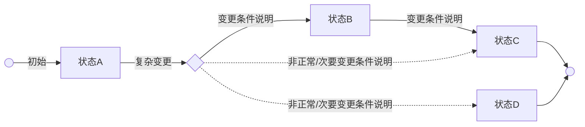
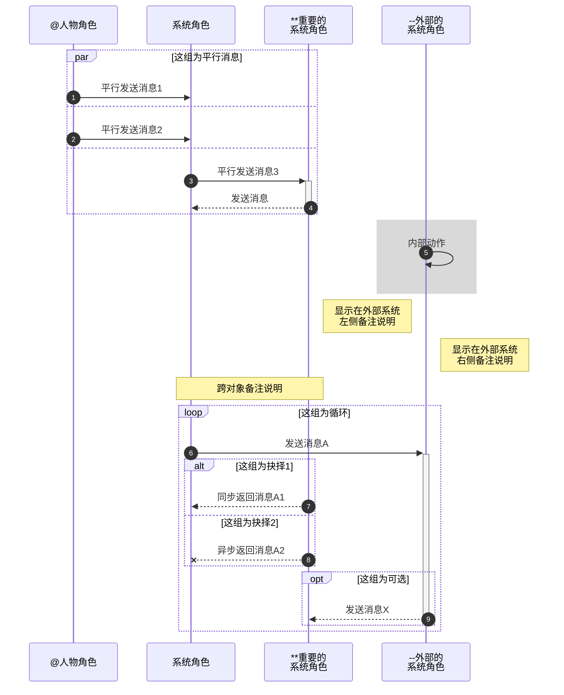

###### <sub>VLOOK™</sub><br />让你的 Markdown 有了新`{看}(wán)`法<br />──<br /><sup>快速参考手册</sup><br />`#最新版本|V10.0#(theme2)`<br /><br />**MAX°孟兆**<br />*COPYRIGHT © 2016-2021. MAX°DESIGN.*

[TOC]

# VLOOK™ 是什么

>
> 
>
> 
>
> VLOOK™ 是针对 [Typora](https://www.typora.io)[^Typora] （跨平台 Markdown 编辑器）的 **主题包** 和 **增强插件**（针对导出的 HTML 文件）。
>
> VLOOK™ 属于开源软件（遵从 **MIT License**），也是 **[开源中国](https://www.oschina.net/p/vlook)** 推荐的国产开源产品。
> 
> `>(theme1)`

> 代码托管：[](https://github.com/madmaxchow/VLOOK?lnkcss=none) & [](https://gitee.com/madmaxchow/VLOOK?lnkcss=none)　　　　CDN：[](https://www.jsdelivr.com/?lnkcss=none)　　　　图床：[](https://imgchr.com/?lnkcss=none)

> [+] **许可协议**
>
> > ```
> > MIT License
> > Copyright (c) 2016-2021 MAX°DESIGN | Max Chow
> > Permission is hereby granted, free of charge, to any person obtaining a copy of this software and associated documentation files (the "Software"), to deal in the Software without restriction, including without limitation the rights to use, copy, modify, merge, publish, distribute, sublicense, and/or sell copies of the Software, and to permit persons to whom the Software is furnished to do so, subject to the following conditions:
> > The above copyright notice and this permission notice shall be included in all copies or substantial portions of the Software.
> > THE SOFTWARE IS PROVIDED "AS IS", WITHOUT WARRANTY OF ANY KIND, EXPRESS OR IMPLIED, INCLUDING BUT NOT LIMITED TO THE WARRANTIES OF MERCHANTABILITY, FITNESS FOR A PARTICULAR PURPOSE AND NONINFRINGEMENT. IN NO EVENT SHALL THE AUTHORS OR COPYRIGHT HOLDERS BE LIABLE FOR ANY CLAIM, DAMAGES OR OTHER LIABILITY, WHETHER IN AN ACTION OF CONTRACT, TORT OR OTHERWISE, ARISING FROM, OUT OF OR IN CONNECTION WITH THE SOFTWARE OR THE USE OR OTHER DEALINGS IN THE SOFTWARE.
> > ```
>
> [+] **Markdown 是什么？**
>
> > - 2004 年，[John Gruber](https://en.wikipedia.org/wiki/John_Gruber) 创造了[Markdown](https://en.wikipedia.org/wiki/Markdown)，一种专门针对网络写作的`文本标记语言`。使用 Markdown，你只需在写作过程中插入少量的标记符号，就能很轻松地进行排版（例如设置标题、加粗、列表、引用等）；
> >- Markdown 文档以`纯文本格式存储`，这意味着，它们可以用几乎任一种文本编辑器打开。同时，又能通过 Markdown 编辑器导出为带排版的富文本文档、HTML 网页等等。==纯粹、简洁、易用、灵活==，都是人们喜欢 Markdown 的原因；
> > - 目前 Markdown 的标准化项目是 [CommonMark](http://commonmark.org)。
> > 
> > 
>
> [+] **60 秒学会、10 分钟深入学习 Markdown 语法**
>
> > 1. `#推荐#` **Github Flavored Markdown** (GFM) 语法参考：Typora 目前采用该标准 [详细](https://support.typora.io/Markdown-Reference/)；
> > 2. 标准化 **CommonMark** 语法参考：[60 秒学会 Markdown 语法](http://commonmark.org/help/)、[10 分钟深入学习 Markdown](http://commonmark.org/help/tutorial/)。

[^Typora]: Typora 是跨平台的 Markdown 编辑器（也许是目前最好的编辑器），支持直接预览与编辑，更详细的特性详见[官网](https://www.typora.io)。

# 为谁准备

**如果你也有以下一个或多个需求或痛点，就可以放心地尝试基于 Markdown 的文档解决方案进行文档的编辑、发布、管理，建议组合是 ==Typora + VLOOK™==：**

- 使用 Markdown 写文档，但对 Markdown 编辑器，或其输出的 HTML 的排版、交互有更多的需求
- 对于编写的文档，希望`*{ ??? }(统一模板与输出 "theme1")`，并且最好`*{ ??? }(随时切换不同模板 "theme1")`
- 希望只关注文档内容的撰写，排版这种繁琐工作希望能==自动化==完成
- ==减少==在文档（如：Word）、制图（如：Visio）等软件工具方面的==购买支出==，或是这些软件排版==操作感觉厌烦==
- 需要支持==跨平台==、==跨终端==进行文档浏览和文档发布方式
- 输出的文档能在阅读、评审、演示时，能提供交互辅助的工具（如导航、聚光灯、脚注等）

> 📌 **你知道吗？**
>
> 你正在浏览在这个 VLOOK™ 快速参考手册，就是由 Typora 编辑并应用 VLOOK™ 插件生成的！**AMAZING!!！**
>
> `>(brown)`

# 安装与使用

## Step 1•下载与配置

1. 访问 VLOOK™ 在 **[GitHub](https://github.com/MadMaxChow/VLOOK/releases)** 或 **[Gitee](https://gitee.com/madmaxchow/VLOOK/releases)** 的主页下载最新发布的版本；
2. （可选）下载并安装 VLOOK™ 主题配套字体包 •• 详见「[字体主题](#字体主题)」；
3. 下载并安装 [Typora](https://www.typora.io) 的最新版本，启动后进入「偏好设置」，并开启以下选项，详见下图：


## Step 2•安装并选择主题

1. 将`released\theme`下所有 CSS 文件复制至 Typora 的主题目录（ Typora「偏好设置」中点击「外观 - 打开主题目录」定位到该目录）；
2. 重启 Typora ，点击菜单`主题`，选择以`vlook-*`形式命名的主题，即可启用对应的 VLOOK™ 主题样式；
3. 可基于`released`下的`VLOOK-Document-Template.md` 为模板来创建你自己的 Markdown 文档。

## Step 3•应用插件

1. 在 Typora 中将 Markdown 文件导出为「**HTML**」文件；
2. 根据需要打开对应的「插件文件」，全选所有内容，并复制：
   1. 在线版插件（自动在线更新）：released\\**VLOOK-plugin.txt**
   2. 离线版插件（无网络场景）：released\\**VLOOK-plugin_standalone.txt**
3. 用纯文件编辑器，如：记事本、[Visual Studio Code](https://code.visualstudio.com/)，打开导出后的 HTML 文件；
4. 搜索`<body`，并将复制的内容粘贴到 body 标签所在行的关闭符`>`之后：

```html
<body ...>
◀ ◀ ◀ 将「插件内容」粘贴于此！
...
</body>
```

5. 保存，大吉大利。

> 强烈建议使用以下浏览器进行访问：
>
> Google **[Chrome](https://www.google.cn/chrome/)**　　Microsoft **[Edge](https://www.microsoft.com/zh-cn/edge)**^(Chromium)^　　Mozilla **[Firefox](https://www.mozilla.org/zh-CN/firefox/)**
>
> `>(brown)`

---

如有建议和需求，欢迎随时反馈～ [](https://qm.qq.com/cgi-bin/qm/qr?k=oB8wpFG_4SEMf1CL9qVy-jMw0CMfSwff&jump_from=webapi&lnkcss=none)

# 打赏

**若喜欢 VLOOK™ 的话，可以贡献一杯咖啡 :-)**


# 快速入坑

VLOOK™ 通过持续**挖掘和扩展** Markdown 和 CSS，并结合文档的互联网化应用场景，在 **文档排版**、**内容导航**、**演示辅助**、**交互体验** 等方面提供了 **一致**、**简洁**、**友好** 的体验。

## 快速入坑°文档排版

>　######  ° 文档排版
>
> ---
>
>**有了 VLOOK™ 主题及插件的支持，让你对 Markdown 编辑器（暂只支持 Typora）的自动化排版能力有了全新的理解。**
>
>得益于成熟的 Web 浏览器、HTML / CSS、JavaScript 技术，让静态的文档也能与你一起「动」起来。
>
>`>(theme1)`

![VLOOK™ 的「文档排版」特性]

| 分类与适用场景                                               |  ==  | ==                                                           |
| ------------------------------------------------------------ | :--: | :----------------------------------------------------------- |
| ==**表格**==                                                 |      | ==**图片、图标、插图**==                                     |
| - 横向、纵向**合并**指定单元格 [••](#表格单元格合并)         |  :   | - 为插图进行自动编号、**添加题注** [••](#插图自动编号与题注) |
| - 将**整列**设置为加粗、高亮、下划线、斜体格式 [••](#表格列格式：常规) |  :   | - 让图片在高分屏下自动适配显示**高清**的版本（2x、3x） [••](#图片适配高分屏) |
| - 将整列设置为**数值**、**百分比**、**货币格式** [••](#表格列格式：数值、百分数、货币) |  :   | - 让图片自动适配 **Dark Mode ** [••](#图片适配 Dark Mode)    |
| - 将整列设置为**复选框**格式，并能指定某单元格为「选中」 [••](#表格列格式：复选框) |  :   | - 添加的**小图标**、普通图片，不想以插图的形式显示 [••](#图片显示版式) |
| - 给每个表格进行自动编号、**添加题注** [••](#表格自动编号与题注) |  :   | - 让图标的颜色与周围的元素更搭更和谐 [••](#图片颜色替换)     |
| - 给表格的**每一行**都进行**自动编号** [••](#表格逐行自动编号) |  :   | - 为图片添加工程风的网格背景 [••](#图片网格背景)             |
| - 对同属一类内容的**表格行**进行分组、分类，并能**自动折叠** [••](#表格行分组折叠) |  :   | - 连续多张图片**不换行**，图片边缘能**留白** [••](#图片排版) |
|                                                              |  :   |                                                              |
| ==**流程图、状态机图、顺序图**==                             |  :   | ==**标签、标签组**==                                         |
| - **扩展** Mermaid 的**图表**，并优化了**样式** [••](#°Mermaid) |  :   | - 将特定关键字设置为**标签**样式 [••](#彩虹标签)             |
| - 解决 Mermaid 图表的**高分屏**的 **Bug** [••](#兼容性补丁)  |  :   | - 将特定的**二元组**内容设置为**标签组**样式 [••](#药丸标签) |
|                                                              |  :   |                                                              |
| ==**音频、视频、注音**==                                     |  :   | ==**引用、引用块**==                                         |
| - 为文档添加音频内容 [••](#音频)                             |  :   | - 重要的引用指定使用突出的样式（如：重要提示） [••](#彩虹引用) |
| - 为文档添加视频内容 [••](#视频)                             |  :   | - **引用**的内容支持**自定义折叠** [••](#折叠吧引用)         |
| - 要给生`{僻}(pì)`字，或东亚小语种**添加注音** [••](#注音)   |  :   |                                                              |
|                                                              |  :   | ==**任务列表**==                                             |
| ==**代码块**==                                               |  :   | - 任务列表的序号，给你找回来了 [••](#任务列表自动编号)       |
| - 给每个代码块进行自动编号、**添加题注** [••](#代码块自动编号与题注) |  :   | - 对于多级任务列表，「**任务组状态**」能自动识别了 [••](#任务组状态) |
| - 代码块高亮当前行、一键复制代码 [••](#代码块增强)           |  :   |                                                              |

## 快速入坑°内容导航

> ######  ° 内容导航
>
> ---
>
>**VLOOK™ 提供了对文档章节、插图提供了多种形式的导航和快速定位的工具，全面改善和提高发布的 HTML 文件的浏览体验和效率。**
>
>敬请你根据需要和喜好随时、轻松享用～
>
>`>(theme1)`

![VLOOK™ 的「内容导航」工具及适用场景]

| **内容导航工具** | 适用场景                                                     |
| :--------------: | ------------------------------------------------------------ |
|     大纲导航     | 适用于内容层次明确，**全文档**跨章节的快速定位 [••](#大纲导航) |
|     逐章导航     | 适用于前后章节相关度高，**按章节**顺序一章一章进行浏览 [••](#逐章导航) |
|     逐段导航     | 适用于文档评审或演示，**按段落**一段一段进行聚焦式浏览 [••](#逐段导航) |
|     插图导航     | 适用于**按图索骥**，快速浏览文档中的插图，以及快速**定位**到文档中对应的位置 [••](#插图导航) |

## 快速入坑°演示与出版辅助

>
> ######  ° 演示与出版辅助
>
> ---
>
> **VLOOK™ 独创性地为 Markdown 导出的 HTML 提供了强大的演示与出版辅助工具，让 Typora + VLOOK 成为更具生产力的 Markdown 文档解决方案。**
>
> 非常适合现场和远程的演示辅助工具，敬请为你的 Markdown 开启 Turbo 模式～
>
> `>(theme1)`

![VLOOK™ 的「演示辅助」工具及适用场景]

| **演示辅助工具** | 适用场景                                                     |
| :--------------: | ------------------------------------------------------------ |
|      聚光灯      | 对屏幕内容的局部进行视觉**聚焦** [••](#聚光灯)               |
|   表格十字光标   | 针对表格内容，特别是行、列关联性强的**表格**，快速识别**纵横关联**的单元格序列 [••](#表格十字光标) |
|      刮刮卡      | - 制作培训、猜迷互动类文档时，希望将预置的**答案隐藏**起来 [••](#刮刮卡) |
|    新标签打开    | 针对须**频繁**在多个插图、表格、代码块间进行**切换**时的场景，无须在文档内来回跳转 |

![VLOOK™ 的「出版辅助」工具及适用场景]

| **出版辅助工具** | 适用场景                                                     |
| :--------------: | ------------------------------------------------------------ |
| 章节标题自动编号 | 对文档内的章节标题进行**自动分级编号** [••](#章节标题自动编号) |
|   文档内容检查   | 对文档内的**链接**、**重名章节**检查及处理提示 [••](#文档内容检查) |
|  链接识别与优化  | **自动识别**并提示文档内的**链接**类型，并针对外链进行了**优化** [••](#链接识别与优化) |
|   适配打印输出   | 在打印前将文档的样式调整和简化，以**适配打印**输出的应用需要 [••](#适配打印输出) |

## 快速入坑°主题与不杂项

>
> ######  ° 主题与不杂项
>
> ---
>
> 「**人类从来都是视觉动物，自己或他人在阅读时，让眼睛感受愉悦和美好，是一种美德、一种力量、一种信仰。**」
>
> 　　　———— MAX°孟兆
>
> `>(theme1)`

![VLOOK™ 的「主题与不杂项」特性]

| VLOOK™ 的「用户体验」特性                          | ==   | ==                                                           |
| -------------------------------------------------- | ---- | ------------------------------------------------------------ |
| ==**模板主题、字体主题**==                         |      | ==**不杂项**==                                               |
| 为不同类型的文档设置不同的模板主题 [••](#模板主题) | :    | 长内容会自动折叠了，长插图、长表格、长代码 [••](#长内容自动折叠) |
| 为文档选择不同的字体主题 [••](#字体主题)           | :    | 更好友的脚注、更美观的公式 [••](#更友好的脚注)               |
| Dark Mode is NOW [••](#Dark Mode)                  | :    | 支持快捷键操作 [••](#快捷键操作)                             |
| 为文档添加封面、封底 [••](#封面、封底)             | :    | 支持跨平台、国际化 [••](#跨平台支持)                         |

# °文档排版

## °表格

### 表格单元格合并

「**Markdown 粉呼声最高的是什么？———— 表格单元格合并！**」

`#VLOOK:#(theme1)` 现在可以轻松让你实现 —— **Wow! Wow!**～Markdown 粉们的欢呼声！！！

> **← 跨列合并（横向合并）**
>
> 在要==被合并==的单元格内输入列合并标识`==`或`<<`，该单元格将会与==左侧相邻==的单元格进行合并，以此类推。

> **↑ 跨行合并（纵向合并）**
>
> 在要==被合并==的单元格内输入行合并标识`:`或`^^`，该单元格将会与==上方相邻==的单元格进行合并，以此类推。

###### 示例一：普通单元格的横向合并、纵向合并

| **列 A**             | 列 B                 | 列 C                 | 列 D       | 列 E       | 列 F       | 列 G                 |
| -------------------- | -------------------- | -------------------- | ---------- | ---------- | ---------- | -------------------- |
| 纵向合并`#×3#(gray)` | 普通单元格           | 普通单元格           | 普通单元格 | 普通单元格 | 普通单元格 | 纵向合并`#×5#(gray)` |
| :                    | 纵向合并`#×2#(gray)` | 横向合并`#×4#(gray)` | ==         | ==         | ==         | :                    |
| :                    | :                    | 普通单元格           | 普通单元格 | 普通单元格 | 普通单元格 | :                    |
| 普通单元格           | 纵向并`#×3#(gray)`   | 普通单元格           | 普通单元格 | 普通单元格 | 普通单元格 | :                    |
| 普通单元格           | :                    | 普通单元格           | 普通单元格 | 普通单元格 | 普通单元格 | :                    |
| 普通单元格           | :                    | 普通单元格           | 普通单元格 | 普通单元格 | 普通单元格 | :                    |

###### 示例二：列头纵向、横向合并

| 列 A 纵向合并`#×2#(gray)` | 列 B 横向合并`#×2#(gray)` | ==         | 列 D 纵向合并`#×3#(gray)` | 列 E 横向合并`#×3#(gray)` | <<         | <<         |
| ------------------------- | ------------------------- | ---------- | :-----------------------: | ------------------------- | ---------- | ---------- |
| :                         | 二级列头                  | 二级列头   |            ^^             | 二级列头                  | 二级列头   | 二级列头   |
| 普通单元格                | 普通单元格                | 普通单元格 |        普通单元格         | 普通单元格                | 普通单元格 | 普通单元格 |
| 普通单元格                | 普通单元格                | 普通单元格 |        普通单元格         | 普通单元格                | 普通单元格 | 普通单元格 |

###### 示例三：表头纵向、横向合并

| 列 A 纵向合并`#×3#(gray)` | 列 B 横向合并`#×4#(gray)` | ==         |     ==     | ==         | 列 F 纵向合并`#×3#(gray)` | 列 G 纵向合并`#×3#(gray)` |
| ------------------------- | ------------------------- | ---------- | :--------: | ---------- | ------------------------- | ------------------------- |
| :                         | 二级列头0                 | 二级列头1  | 二级列头2  | 二级列头3  | :                         | :                         |
| ^^                        | 二级列头0                 | 三级列头1  | 三级列头2  | 三级列头3  | :                         | :                         |
| 普通单元格                | 普通单元格                | 普通单元格 | 普通单元格 | 普通单元格 | 普通单元格                | 普通单元格                |
| 普通单元格                | 普通单元格                | 普通单元格 | 普通单元格 | 普通单元格 | 普通单元格                | 普通单元格                |

---

如果你对以上内容有更多需求或建议，欢迎随时反馈～ [](https://qm.qq.com/cgi-bin/qm/qr?k=oB8wpFG_4SEMf1CL9qVy-jMw0CMfSwff&jump_from=webapi&lnkcss=none)

[<kbd>◀ 我要回到 快速入坑°文档排版</kbd>](#快速入坑°文档排版)

### 表格列格式：常规

「**Markdown 表格如何快速设置整列的格式（加粗、高亮、下划线、斜体、删除线）？**」

`#VLOOK:#(theme1)` SO EASY～ 只须在表头按以标准的 Markdown 或 GFM 的格式设置语法设置对应的格式即可实现这样的格式化。

> 温故一下标准 Markdown 或 GFM 的格式语法：
>
> `**加粗**`、`*斜体*`、`~~删除线~~`、`==高亮==` 、`<u>下划线</u>`

###### 示例一：表格列格式：常规化

|      **加粗**      | *斜体*            | <u>下划线</u>     | ==高亮==               | ~~删除线~~             |
| :----------------: | ----------------- | ----------------- | ---------------------- | ---------------------- |
| 单元格（横向合并） | ==                | 单元格 afgiklo 10 | 单元格                 | 单元格`#标签组|标签#`  |
|       单元格       | 单元格 afgiklo 10 | 单元格 afgiklo 10 | 单元格内有**加粗**内容 | 单元格内容             |
|       单元格       | 单元格 afgiklo 10 | 单元格 afgiklo 10 | 单元格内容             | 单元格有`行内代码`内容 |

###### 示例二：表格列格式：常规化（格式嵌套）

| **普通列** | 嵌套的常规格式          | ==                              | ==                     | ==                     |
| :--------: | :---------------------- | ------------------------------- | ---------------------- | ---------------------- |
|     :      | ==<u>高亮＋下划线</u>== | ***<u>加粗＋斜体＋下划线</u>*** | **==加粗＋高亮==**     | ~~**删除线+加粗列**~~  |
|     A      | 单元格 afgiklo 10       | 单元格 afgiklo 10               | 单元格                 | 单元格`#标签组|标签#`  |
|     B      | 单元格 afgiklo 10       | 单元格 afgiklo 10               | 单元格内有**加粗**内容 | 单元格内有内容         |
|     C      | 单元格 afgiklo 10       | 单元格 afgiklo 10               | 单元格内容             | 单元格有`行内代码`内容 |

---

如果你对以上内容有更多需求或建议，欢迎随时反馈～ [](https://qm.qq.com/cgi-bin/qm/qr?k=oB8wpFG_4SEMf1CL9qVy-jMw0CMfSwff&jump_from=webapi&lnkcss=none)

[<kbd>◀ 我要回到 快速入坑°文档排版</kbd>](#快速入坑°文档排版)

### 表格列格式：数值、百分数、货币

「**除常规的格式外，还有更高级的格式要求？数字、百分数、货币……一个都不能少！**」

`#VLOOK:#(theme1)` 可以支持对「数值类」内容进行整列的自动格式设置了！方式依然的很优雅，很 VLOOK！

> 将表格列的对齐设置为「**右对齐**」，即可自动识别不同的数值内容进行自动进行格式化！

> **「普通数值」自动格式化：**
>
> - 添加千位符，并以更小字号显示小数部分
> - 通过在数字前增加「正号`+`」或「负号`-`」，会通过不同的颜色突出显示

> **「百分数」自动格式化：**
>
> - 自动继承「普通数字」的格式
> - 以更小字号和视觉弱化来显示百分号`%`，并以进度条比例显示对应的百分数值

> **「货币」自动格式：**
>
> - 自动继承「普通数字」的格式
> - 对货币符号（如：`¥` `$`），或货币简写（如：`CNY` `USD` `HKD`等）进行左侧对齐和视觉弱化
>
> `#注意#` *货币符号，或货币简写与金额数值之间须以空格分隔*

###### 示例一：普通数字

| 原始内容    |  数值情况  | ==       |    ==    |     ==     |      数值列 |
| ----------- | :--------: | -------- | :------: | :--------: | ----------: |
| :           | [ ] 含小数 | [ ] 正数 | [ ] 负数 | [ ] 超三位 |           : |
| 123         |            |          |          |            |         123 |
| -12345      |            |          |   [x]    |    [x]     |      -12345 |
| +5678.00    |    [x]     | [x]      |          |    [x]     |    +5678.00 |
| -2345678.00 |    [x]     |          |   [x]    |    [x]     | -2345678.00 |

###### 示例二：百分数

| 原始内容 |  数值情况  | ==       |    ==    |     ==     |  数值列 |
| -------- | :--------: | -------- | :------: | :--------: | ------: |
| :        | [ ] 含小数 | [ ] 正数 | [ ] 负数 | [ ] 超三位 |       : |
| 79%      |            |          |          |            |     79% |
| 88.88%   |    [x]     |          |          |            |  88.88% |
| +38%     |            | [x]      |          |            |    +38% |
| -57.30%  |    [x]     |          |   [x]    |            | -57.30% |
| 100%     |            |          |          |            |    100% |

###### 示例三：货币

| **币种** | 原始内容       |  数值情况  |    ==    |    ==    |     ==     |     **数值列** |
| :------: | -------------- | :--------: | :------: | :------: | :--------: | -------------: |
|    :     | :              | [ ] 含小数 | [ ] 正数 | [ ] 负数 | [ ] 超三位 |              : |
|  人民币  | ￥ 123456.99   |    [x]     |          |          |    [x]     |   ￥ 123456.99 |
|    :     | CNY -987654.99 |    [x]     |          |   [x]    |    [x]     | CNY -987654.99 |
|    :     | ¥ +1024        |            |   [x]    |          |    [x]     |        ¥ +1024 |
|   港元   | HK$ 3456.78    |    [x]     |          |          |    [x]     |    HK$ 3456.78 |
|    :     | HKD 3456.78    |    [x]     |          |          |    [x]     |    HKD 3456.78 |
|   美元   | $ +555.38      |            |          |          |            |      $ +555.38 |
|    :     | USD 555        |            |          |          |            |        USD 555 |
|   澳元   | A$ 56789       |            |          |          |    [x]     |       A$ 56789 |
|    :     | AUD -56789     |            |          |   [x]    |    [x]     |     AUD -56789 |

---

如果你对以上内容有更多需求或建议，欢迎随时反馈～ [](https://qm.qq.com/cgi-bin/qm/qr?k=oB8wpFG_4SEMf1CL9qVy-jMw0CMfSwff&jump_from=webapi&lnkcss=none)

[<kbd>◀ 我要回到 快速入坑°文档排版</kbd>](#快速入坑°文档排版)

### 表格列格式：复选框

「**表格的列格式，除了排版格式外，如果希望能支持复选框（勾选框）呢？**」

`#VLOOK:#(theme1)` 虽然要求有点高了，但也可以实现，将整列自动设置为「复选框」格式了！

> 表格列头内容前，添加`[(空格)](空格)`（如`[ ] 必填项`），就可以为该列自动设置为`未选择`的状态。
>
> 
>
> 若要独立指定某单元格的复选框选择状态，可以这样：
>
> - 单元格的内容以`[x]`开头，则会自动设置为`已选择`状态；
> - 单元格的内容以`[-]`开头，则会自动设置为`不确定选择`状态。

###### 示例：「复选框」列格式

| **复选框样式** |     [ ] 复选框列     | 说明                     |
| :------------: | :------------------: | ------------------------ |
|      留空      |                      | 默认为`未选择`的状态     |
|     已选择     |         [x]          | 指定为`已选择`的状态     |
|   不确定选择   | [-]<br />当值 ≥ 0 时 | 指定为`不确定选择`的状态 |

---

如果你对以上内容有更多需求或建议，欢迎随时反馈～ [](https://qm.qq.com/cgi-bin/qm/qr?k=oB8wpFG_4SEMf1CL9qVy-jMw0CMfSwff&jump_from=webapi&lnkcss=none)

[<kbd>◀ 我要回到 快速入坑°文档排版</kbd>](#快速入坑°文档排版)

### 表格自动编号与题注

「**文档中的表格很多，怎么才能像 Word 那样添加编号和题注呢？**」

`#VLOOK:#(theme1)` 无须任何设置，即可自动对文档内所有「表格」进行统一的自动编号，编号内容举例：`表 1` `表 2`

> 若希望为表格在自动编号之后，添加指定的题注，如：`表 1 - 2020 年全球经济体 GDP 排名`
>
> **单题注：**
>
> - 在表格前添加一个`6 级`标题（快捷键<kbd>Ctrl + 6</kbd>），并输入题注内容
> - 该条标题内容即为表格的题注

> VLOOK™ 通过模仿 Markdown 添加图片的语法，实现对双题注的支持。
>
> **双题注：**
>
> - 语法：`![默认题注]"第2题注"`，其中的「第 2 题注」内容为可选
> - 该内容可为一个`6 级标题`，也可以为单独一行文本
>
> `#注意#` *题注内容发布后会被隐藏，若要保留原始 6 级标题内容，可另起一行进行题注的编写*

###### 示例一：单题注

| 列 A       | 列 B       | 列 C       | 列 D       | 列 E       |
| ---------- | ---------- | ---------- | ---------- | ---------- |
| 单元格内容 | 单元格内容 | 单元格内容 | 单元格内容 | 单元格内容 |

###### ![示例二：双题注]"这是表格的第二题注"

| 列 A       | 列 B       | 列 C       | 列 D       | 列 E       |
| ---------- | ---------- | ---------- | ---------- | ---------- |
| 单元格内容 | 单元格内容 | 单元格内容 | 单元格内容 | 单元格内容 |
| 单元格内容 | 单元格内容 | 单元格内容 | 单元格内容 | 单元格内容 |

---

如果你对以上内容有更多需求或建议，欢迎随时反馈～ [](https://qm.qq.com/cgi-bin/qm/qr?k=oB8wpFG_4SEMf1CL9qVy-jMw0CMfSwff&jump_from=webapi&lnkcss=none)

[<kbd>◀ 我要回到 快速入坑°文档排版</kbd>](#快速入坑°文档排版)

### 表格逐行自动编号

「**表格有很多行，能像 Excel 一样有行号的话，那就更方便沟通和定位了……**」

`#VLOOK:#(theme1)` 可以一键实现对表格逐行进行自动编号！

> 通过以下两种试，都可以为表格的每一行进行自动编号：
>
> 1. 表格前添加一个`6 级`的标题（快捷键<kbd>Ctrl + 6</kbd>）
> 2. 在有序、无序列表下缩进的表格

###### 示例一：表格前添加 6 级标题

###### 示例一：表格前添加 6 级标题

| 列1              | 列2              |        列3         |              列4 |
| ---------------- | ---------------- | :----------------: | ---------------: |
| 第一行           | 左对齐（长内容） |      居中对齐      | 右对齐（长内容） |
| 第二行（长内容） | 左对齐           | 居中对齐（长内容） |           右对齐 |

- **示例二：在有序、无序列表下的缩进表格**

  | 列1              | 列2              |        列3         |              列4 |
  | ---------------- | ---------------- | :----------------: | ---------------: |
  | 第一行           | 左对齐（长内容） |      居中对齐      | 右对齐（长内容） |
  | 第二行（长内容） | 左对齐           | 居中对齐（长内容） |           右对齐 |

---

如果你对以上内容有更多需求或建议，欢迎随时反馈～ [](https://qm.qq.com/cgi-bin/qm/qr?k=oB8wpFG_4SEMf1CL9qVy-jMw0CMfSwff&jump_from=webapi&lnkcss=none)

[<kbd>◀ 我要回到 快速入坑°文档排版</kbd>](#快速入坑°文档排版)

### 表格行分组折叠

「**表格行都是一维的数据，但如果表格的数据有层次关系怎么办？**」

`#VLOOK:#(theme1)` 可以对文档（如 PRD、API 类文档）在同一个表格内，会对属于同一类或同一级的多行进行分组和折叠。

> 对于作为下级的行，在表格行的首列通过以下规则即可实现自动分组和折叠：
>
> - 使用 Markdown 的引用的语法`>(空格)`，即可表示该行缩进一级，其前一行即为上一级的分组
> - 多个`>`表示缩进多级，如三级缩进`>>>(空格)`
>

###### 写法如下第 2 列所示

| 分组分级     | 写法举例         |
| ------------ | ---------------- |
| 一级缩进     | > 这是一级缩进   |
| 二级缩进     | >> 这是二级缩进  |
| 三级缩进     | >>> 这是三级缩进 |
| （以此类推） | <<               |

###### 示例一：表格行分组折叠

| 列头1                                     | [ ] 勾选列 | 列头2            |
| ----------------------------------------- | :--------: | ---------------- |
| 普通行                                    |            |                  |
| 分组 1                                    |    [-]     |                  |
| > 这是属于分组 1 的内容 1.1               |    [x]     | 该行是被折叠的行 |
| > 这是属于分组 1 的内容 1.2               |            | 该行是被折叠的行 |
| 分组间间隔了普通行                        |            |                  |
| 分组 2                                    |    [-]     |                  |
| > 这是属于分组 2 的内容 2.1               |    [x]     | 该行为被折叠的行 |
| > 这是属于分组 2 的内容 2.2               |            | 该行为被折叠的行 |
| > 这是属于分组 2 的内容 2.3               |    [-]     | 该行为被折叠的行 |
| >> 这是属于二级分组 2.3 的内容 2.3.1      |    [x]     | 该行为被折叠的行 |
| >> 这是属于二级分组 2.3 的内容 2.3.2      |     <<     | <<               |
| >>> 这是属于三级分组 2.3.2 的内容 2.3.2.1 |    [x]     | 该行为被折叠的行 |
| > 这是属于分组 2 的内容 2.4               |            | 该行为被折叠的行 |
| 普通行                                    |            |                  |

###### 示例二：表格行分组折叠

| 列头1                                        | [ ] 勾选列 | 列头2            |
| -------------------------------------------- | :--------: | ---------------- |
| 普通行                                       |            |                  |
| 分组 1                                       |    [-]     |                  |
| > 这是属于分组 1 的内容 1.1                  |    [x]     | 该行是被折叠的行 |
| > 这是属于分组 1 的内容 1.2                  |            | 该行是被折叠的行 |
| 连续分组                                     |    [-]     |                  |
| > 这是属于分组 2 的内容 2.1                  |    [x]     | 该行为被折叠的行 |
| > 这是属于分组 2 的内容 2.2                  |            | 该行为被折叠的行 |
| > 这是属于分组 2 的内容 2.3                  |    [-]     | 该行为被折叠的行 |
| >> 这是属于二级分组 2.3 的内容 2.3.1         |            | 该行为被折叠的行 |
| >> 这是属于二级分组 2.3 的内容 2.3.2         |    [-]     |                  |
| >>> 这是属于三级分组 2.3.2 的内容 2.3.2.1    |    [x]     | 该行为被折叠的行 |
| >>> 这是属于三级分组 2.3.2 的内容 2.3.2.2    |            | 该行为被折叠的行 |
| >>> 这是属于三级分组 2.3.2 的内容 2.3.2.3    |            | 该行为被折叠的行 |
| >>> 这是属于三级分组 2.3.2 的内容 2.3.2.4    |    [x]     | 该行为被折叠的行 |
| >>>> 这是属于三级分组 2.3.2 的内容 2.3.2.2.1 |    [x]     | 该行为被折叠的行 |
| >> 这是属于三级分组 2.3.2 的内容 2.3.3       |            | 该行为被折叠的行 |
| > 这是属于分组 2 的内容 2.4                  |            | 该行为被折叠的行 |
| > 这是属于分组 2 的内容 2.5                  |            | 该行为被折叠的行 |
| > 这是属于分组 2 的内容 2.6                  |    [x]     | 该行为被折叠的行 |
| > 这是属于分组 2 的内容 2.7                  |            | 该行为被折叠的行 |
| > 这是属于分组 2 的内容 2.8                  |            | 该行为被折叠的行 |
| > 这是属于分组 2 的内容 2.9                  |            | 该行为被折叠的行 |
| > 这是属于分组 2 的内容 2.10                 |            | 该行为被折叠的行 |
| > 这是属于分组 2 的内容 2.11                 |            | 该行为被折叠的行 |
| 普通行                                       |    [x]     | 单元格内容       |

---

如果你对以上内容有更多需求或建议，欢迎随时反馈～ [](https://qm.qq.com/cgi-bin/qm/qr?k=oB8wpFG_4SEMf1CL9qVy-jMw0CMfSwff&jump_from=webapi&lnkcss=none)

[<kbd>◀ 我要回到 快速入坑°文档排版</kbd>](#快速入坑°文档排版)

### 表格当前行指标器

「**在编辑，或浏览表格内容时，希望能知道哪行是当前行～**」

`#VLOOK:#(theme1)` 这个可以有，锦上添花的，不赚多～

> - 使用了 VLOOK™ 的主题后，在 Typora 中编辑表格，或浏览 HTML 时能自动生效；
> - 鼠标滑过表格行时，在其左侧会通过突出的**游标**进行指标，便于辨识出当前行。

---

如果你对以上内容有更多需求或建议，欢迎随时反馈～ [](https://qm.qq.com/cgi-bin/qm/qr?k=oB8wpFG_4SEMf1CL9qVy-jMw0CMfSwff&jump_from=webapi&lnkcss=none)

[<kbd>◀ 我要回到 快速入坑°文档排版</kbd>](#快速入坑°文档排版)

## °图片

### 插图自动编号与题注

「**文档中的图片很多，怎么才能像 Word 那样添加编号和题注呢？**」

`#VLOOK:#(theme1)` 无须任何设置，即可自动对文档内所有插图进行统一的自动编号，编号内容举例：`图 1` `图 2`

插图主要是指图片（如：jpg、png 等），以及脚本化图表（如：Mermaid 的流程图、状态机图、顺序图、甘特图、类图等）

> **为「图片」添加题注：**
>
> 只要按以 Markdown 的语法添加图片就可以实现，即：``
>
> - **单题注：**以上`图片标题`即为题注的内容，如：``
> - **双题注：**以上`可选子标题`即为第 2 题注的内容，如：``。
>
> `#注意#`以上语法中的「可选子标题」与「图片URL」间须以英文空格 <kbd>　　SPACE　　</kbd> 进行分隔

> **为「Mermaid 图表」添加题注**
>
> 添加的方式与为「表格」添加题注方式是一致的 •• [马上去看看](#表格自动编号与题注)

- 图片题注示例：[去看一看](#示例：长图片、双题注)
- Mermaid 图片题注示例：[去看一看](#Mermaid 的流程图)

---

如果你对以上内容有更多需求或建议，欢迎随时反馈～ [](https://qm.qq.com/cgi-bin/qm/qr?k=oB8wpFG_4SEMf1CL9qVy-jMw0CMfSwff&jump_from=webapi&lnkcss=none)

[<kbd>◀ 我要回到 快速入坑°文档排版</kbd>](#快速入坑°文档排版)

### 图片适配高分屏

「**高分屏看到的图片会变得模糊，Markdown 的图片语法又不支持不同分辨率图片集，怎么办？**」

`#VLOOK:#(theme1)` 保持 Markdown 图片语法不变的情况下，轻松在高分辨率的屏幕上显示高清分辨率的图片！

> 支持显示高清分辨率的图片，可通过在「图片 URL」中添加 VLOOK™ 规范的参数中增加启用高清图片的参数`srcset`，并对图片添加对应的分辨率的后缀`@2x`或`@3x`
>
> **支持 2x 高清：**
>
> - ``
>
> **支持 3x 高清：**
>
> - ``
>
> **同时支持 2x/3x 高清**：
>
> - ``
>
> `#Tips 1#(orange)` 如果 2x/3x 的文件名是`图片@2x.png` `图片@3x.png`这类格式，则无须填写对应的图片名，如：`srcset=@2x,@3x`
>
> `#Tips 2#(orange)` `srcset`指定的 2x/3x 的图片与标准分辨率图片若在不在同一目录或 URL 下，则须填写完整的图片 URL

> **没有准备高清图片，也希望不模糊？**
>
> - 如果临时没有图片的高清分辨率，VLOOK™ 也可以将其转换 2x 资源，这样在高分屏上也能提高图片显示清晰度（但图片大小会相应缩小 50%）
>- 可通过在「**文档 URL**」中添加 VLOOK™ 规范的参数`srcset=auto`来启用这个特性
> 

> `#参考#(green)` *如果对 URL 参数的使用有疑问，可以去「[延伸内容](#延伸内容)」那深入再了解了解～*

###### 示例

　　　　

---

如果你对以上内容有更多需求或建议，欢迎随时反馈～ [](https://qm.qq.com/cgi-bin/qm/qr?k=oB8wpFG_4SEMf1CL9qVy-jMw0CMfSwff&jump_from=webapi&lnkcss=none)

[<kbd>◀ 我要回到 快速入坑°文档排版</kbd>](#快速入坑°文档排版)

### 图片适配 Dark Mode

「**系统开启 Dark Mode 后，图片显示得有点不太和谐，怎么办？**」

`#VLOOK:#(theme1)` 支持指定图片在 Dark Mode 时的适配方式，目前支持**反色**和**替换**，满足不同的需求！

#### 适配方式：反色

> **特别适合黑/白/灰类的图片。**
>
> 在「图片 URL」中添加 VLOOK™ 规范的参数的方式来启用这一特性：
>
> - URL 参数：`darksrc=invert`
>
> 你现在就可以试试按下键盘的<kbd>D</kbd>键，然后看看下面两个插图的变化～

> `#参考#(green)` *如果对 URL 参数的使用有疑问，可以去「[延伸内容](#延伸内容)」那深入再了解了解～*

###### 示例

　　

---

如果你对以上内容有更多需求或建议，欢迎随时反馈～ [](https://qm.qq.com/cgi-bin/qm/qr?k=oB8wpFG_4SEMf1CL9qVy-jMw0CMfSwff&jump_from=webapi&lnkcss=none)

[<kbd>◀ 我要回到 快速入坑°文档排版</kbd>](#快速入坑°文档排版)

#### 适配方式：替换

> 在「图片 URL」中添加 VLOOK™ 规范的参数的方式来启用这一特性：
>
> URL 参数：
>
> - 普通分辨率的图片：`darksrc=xxx.jpg`
> - 适配高分屏分辨率的图片（可选）：`darksrcset=...`，该参数的用法==适配高分屏==的`srcset`保持一致，详见「[图片适配高分屏](#图片适配高分屏)」
>
> 你现在就可以试试按下键盘的<kbd>D</kbd>键，然后看看下面两个插图的变化～
>
> 
>
> `#注意#(red)` **若高分辨率图片资源较大，切换为 Dark Mode 后须等待指定的图片资源加载完成后才会被替换**

> `#参考#(green)` *如果对 URL 参数的使用有疑问，可以去「[延伸内容](#延伸内容)」那深入再了解了解～*

###### 示例

　　

---

如果你对以上内容有更多需求或建议，欢迎随时反馈～ [](https://qm.qq.com/cgi-bin/qm/qr?k=oB8wpFG_4SEMf1CL9qVy-jMw0CMfSwff&jump_from=webapi&lnkcss=none)

[<kbd>◀ 我要回到 快速入坑°文档排版</kbd>](#快速入坑°文档排版)

### 图片显示版式

「**在 VLOOK™ 中图片默认均以「插图」的形式进行呈现，即自动编号、题注等～**

**希望添加一些小图标、小图片，但并不划文档的插图，该怎么操作呢？**」

`#VLOOK:#(theme1)` 在不影响 Markdown 的简洁和优雅的前提下，实现支持多种不同的显示版式。

> 在「图片 URL」中添加 VLOOK™ 规范的参数的方式来启用这一特性：
>
> - URL 参数：`mode=xxx`

###### 图片不同显示版式的 URL 参数（mode）的取值及用法

| 版式标识 | 应用说明                                                     | 完整语法参考                 |
| :------: | ------------------------------------------------------------ | ---------------------------- |
|   icon   | 缩小为与单行正文高度适配的小图标<br />主要用于与正文内容进行混排 | `` |
|   logo   | 不调整图片大小<br />主要用于展示 Logo 或不是作为「插图」的图片 | `` |

> `#参考#(green)` *如果对 URL 参数的使用有疑问，可以去「[延伸内容](#延伸内容)」那深入再了解了解～*

###### 示例一：icon 模式

**VLOOK™** 是 **[开源中国](https://www.oschina.net/p/vlook)** 推荐的国产开源项目，也许是目前最好的 Markdown 增强插件之一

###### 示例二：logo 模式

对于深色的图片或图标，可配合「[图片适配 Dark Mode](#图片适配 Dark Mode)」来自动更好适配 Dark Mode 下的显示，现在就试试按下键盘的<kbd>D</kbd>键，然后看看下图的变化～


---

如果你对以上内容有更多需求或建议，欢迎随时反馈～ [](https://qm.qq.com/cgi-bin/qm/qr?k=oB8wpFG_4SEMf1CL9qVy-jMw0CMfSwff&jump_from=webapi&lnkcss=none)

[<kbd>◀ 我要回到 快速入坑°文档排版</kbd>](#快速入坑°文档排版)

### 图片颜色替换

「**希望文档中的图片能自动跟随文档主题本色，或文字颜色，而不用重新制作多个版本的图片资源**」

`#VLOOK:#(theme1)` 可以针对[显示版式](#图片显示版式)为 icon、logo 的图片（透明背景的 png 或 svg 图片），按指定规则自动替换为指定的颜色。

> 在「图片 URL」中添加 VLOOK™ 规范的参数的方式来启用这一特性：
>
> - URL 参数：`fill=text`，替换为所在段落文字的颜色（会自动适配 Dark Mode 和链接的样式）
> - URL 参数：`fill=theme1`，替换为主题的主色
> - URL 参数：`fill=theme2`，替换为主题的辅助色

###### 示例：链接内图片

- 什么是[Markdown](https://en.wikipedia.org/wiki/Markdown)？

###### 示例：正文图文混排

- 替换为==文本的颜色==：Markdown 是一种专门针对网络写作的文本标记语言。
- 替换为==主题的主色==：Markdown 是一种专门针对网络写作的文本标记语言。
- 替换为==主题的辅助色==：Markdown 是一种专门针对网络写作的文本标记语言。

###### 示例：彩虹引用及标题

> ###### 这是Markdown 的 6 级标题
>
> 这里是正文内容。
>
> `>(pink)`

###### 示例：插图（实验性）

　　

---

如果你对以上内容有更多需求或建议，欢迎随时反馈～ [](https://qm.qq.com/cgi-bin/qm/qr?k=oB8wpFG_4SEMf1CL9qVy-jMw0CMfSwff&jump_from=webapi&lnkcss=none)

[<kbd>◀ 我要回到 快速入坑°文档排版</kbd>](#快速入坑°文档排版)

### 图片网格背景

「**在使用工程或设计类的图片时，希望能自动添加统一的网格作为背景**」

`#VLOOK:#(theme1)` 支持针对透明背景的图片（如 PNG、SVG 格式图片），添加指定的网格背景。

> 在「图片 URL」中添加 VLOOK™ 规范的参数的方式来启用这一特性：
>
> - URL 参数：`grid=line`，添加线条风格的网格背景
> - URL 参数：`grid=block`，添加方块风格的网格背景
>
> 该特性自动适配 [Dark Mode](#Dark Mode) 的应用场景。

###### 示例一：线条网格


###### 示例二：方块网格


　

---

如果你对以上内容有更多需求或建议，欢迎随时反馈～ [](https://qm.qq.com/cgi-bin/qm/qr?k=oB8wpFG_4SEMf1CL9qVy-jMw0CMfSwff&jump_from=webapi&lnkcss=none)

[<kbd>◀ 我要回到 快速入坑°文档排版</kbd>](#快速入坑°文档排版)

### 图片排版

「**我的插图宽度都比较窄，希望能在一行上显示多个插图，应该怎么操作？**

**我的插图边缘没有留白，视觉上看得比较挤，可以怎么调整？**」

`#VLOOK:#(theme1)` 在 Markdown 对图片千篇一律的排版的反馈中，悄悄尝试打开了一道小小的裂缝～

> **一行多图**
>
> 可在「图片 URL」中添加 VLOOK™ 规范的参数来启用这一特性：
>
> - 参数：`inline=true`
> - 参数示例：``
>
> 该特性示例可以回看之前面「图片适配高分屏」 •• [马上去看看](#图片适配高分屏)

> **图片四边留白**
>
> 可在「图片 URL」中添加 VLOOK™ 规范的参数来启用这一特性：
>
> - 参数：`padding=true`，默认给插图的四边添加 `20px` 的留白
> - 参数示例：``

> `#参考#(green)` *如果对 URL 参数的使用有疑问，可以去「[延伸内容](#延伸内容)」那深入再了解了解～*

###### 示例：一行多图＋边缘留白

　　

---

如果你对以上内容有更多需求或建议，欢迎随时反馈～ [](https://qm.qq.com/cgi-bin/qm/qr?k=oB8wpFG_4SEMf1CL9qVy-jMw0CMfSwff&jump_from=webapi&lnkcss=none)

[<kbd>◀ 我要回到 快速入坑°文档排版</kbd>](#快速入坑°文档排版)

## °标签

「**用 Markdown 写文档，想通过「标签」来区分或突出内容，这个想法会不会不现实呢？**」

`#VLOOK:#(theme1)` 对 Markdown 行内代码（Code）语法`` ` ` `` 进行了扩展，满足实用的「标签」排版需求！

例如：可以单个`#标签#(orange)`，还可以是标签组`#我是|药丸标签#(pink)`，继续往下看看就知道这是怎么做到的～

### 彩虹标签

> **语法：**`` `#tag#(color)` ``
>
> 其中：
>
> `tag`：标签内容前后由`#`符号包裹
>
> `color`：可选。指定标签显示对应的预置颜色标识，不指定则默认为 `red`

###### 彩虹标签预置颜色标识及示例

| 预置颜色标识 | 语法示例               | 应用场景建议                 | 渲染效果         |
| :----------: | ---------------------- | ---------------------------- | ---------------- |
|     red      | `` `#标签#(red)` ``    | 警告、危险、关键事项、删除   | `#标签#(red)`    |
|    orange    | `` `#标签#(orange)` `` | 提醒、注意、修复             | `#标签#(orange)` |
|    yellow    | `` `#标签#(yellow)` `` | 关注、优化、备忘、说明       | `#标签#(yellow)` |
|    green     | `` `#标签#(green)` ``  | 提示、参考、新增             | `#标签#(green)`  |
|     cyan     | `` `#标签#(cyan)` ``   | 引用、公告                   | `#标签#(cyan)`   |
|     blue     | `` `#标签#(blue)` ``   | 信息、资讯                   | `#标签#(blue)`   |
|    purple    | `` `#标签#(purple)` `` | 延伸、扩展、保留、备用       | `#标签#(purple)` |
|     pink     | `` `#标签#(pink)` ``   | 年轻、个性、女性             | `#标签#(pink)`   |
|    brown     | `` `#标签#(brown)` ``  | 稳定、金融、工程             | `#标签#(brown)`  |
|     gray     | `` `#标签#(gray)` ``   | 无效、暂缓、停用、结束       | `#标签#(gray)`   |
|    theme1    | `` `#标签#(theme1)` `` | 使用当前 VLOOK™ 主题的主色   | `#标签#(theme1)` |
|    theme2    | `` `#标签#(theme2)` `` | 使用当前 VLOOK™ 主题的辅助色 | `#标签#(theme2)` |

---

如果你对以上内容有更多需求或建议，欢迎随时反馈～ [](https://qm.qq.com/cgi-bin/qm/qr?k=oB8wpFG_4SEMf1CL9qVy-jMw0CMfSwff&jump_from=webapi&lnkcss=none)

[<kbd>◀ 我要回到 快速入坑°文档排版</kbd>](#快速入坑°文档排版)

### 药丸标签

> **语法：**`` `#tag1|tag2#(color)` ``
>
> 其中：
>
> `tag1` `tag2`：为两个标签的内容，由`#`包裹，并以英文竖线符号`|`作为分隔
>
> `color`：可选。指定标签显示对应的预置颜色标识，不指定则默认为 `(red)`

###### 药丸标签预置颜色及示例

| 预置颜色标识 | 语法示例                      | 应用场景建议                 | 渲染效果                |
| :----------: | ----------------------------- | ---------------------------- | ----------------------- |
|     red      | `` `#标签组|标签#(red)` ``    | 警告、危险、关键事项、删除   | `#标签组|标签#(red)`    |
|    orange    | `` `#标签组|标签#(orange)` `` | 提醒、注意、修复             | `#标签组|标签#(orange)` |
|    yellow    | `` `#标签组|标签#(yellow)` `` | 关注、优化、备忘、说明       | `#标签组|标签#(yellow)` |
|    green     | `` `#标签组|标签#(green)` ``  | 提示、备忘、参考、新增       | `#标签组|标签#(green)`  |
|     cyan     | `` `#标签组|标签#(cyan)` ``   | 引用、公告                   | `#标签组|标签#(cyan)`   |
|     blue     | `` `#标签组|标签#(blue)` ``   | 信息、资讯                   | `#标签组|标签#(blue)`   |
|    purple    | `` `#标签组|标签#(purple)` `` | 延伸、扩展、保留、备用       | `#标签组|标签#(purple)` |
|     pink     | `` `#标签组|标签#(pink)` ``   | 年轻、个性、女性             | `#标签组|标签#(pink)`   |
|    brown     | `` `#标签组|标签#(brown)` ``  | 稳定、金融、工程             | `#标签组|标签#(brown)`  |
|     gray     | `` `#标签组|标签#(gray)` ``   | 无效、暂缓、停用、结束       | `#标签组|标签#(gray)`   |
|    theme1    | `` `#标签组|标签#(theme1)` `` | 使用当前 VLOOK™ 主题的主色   | `#标签组|标签#(theme1)` |
|    theme2    | `` `#标签组|标签#(theme2)` `` | 使用当前 VLOOK™ 主题的辅助色 | `#标签组|标签#(theme2)` |

---

如果你对以上内容有更多需求或建议，欢迎随时反馈～ [](https://qm.qq.com/cgi-bin/qm/qr?k=oB8wpFG_4SEMf1CL9qVy-jMw0CMfSwff&jump_from=webapi&lnkcss=none)

[<kbd>◀ 我要回到 快速入坑°文档排版</kbd>](#快速入坑°文档排版)

## °引用

### 彩虹引用

「**希望可以在 Markdown 文档中能拉个横幅或板子，在上面写上一些重要的事～**」

`#VLOOK:#(theme1)` 通过对 Markdown 行内代码（Code）语法`` ` ` `` 进行了扩展，满足实用的多色彩「引用」的排版需求！

> **语法：** `` `>(color)` ``，==须添加到引用中，具体位置不限（如：首行、末尾）==
>
> 其中：
>
> `color`：指定标签显示对应的预置颜色标识，预置颜色标识与「[彩虹标签](#彩虹标签)」的颜色标识保持一致

###### 示例

> ######  彩虹引用 6 级标题
>
> 这是一个彩虹引用，使用的颜色标识为：red
>
> `>(red)`

> ######  彩虹引用 6 级标题
>
> 这是一个彩虹引用，使用的颜色标识为：orange
>
> `>(orange)`

> ######  彩虹引用 6 级标题
>
> 这是一个彩虹引用，使用的颜色标识为：yellow
>
> `>(yellow)`

> ######  彩虹引用 6 级标题
>
> 这是一个彩虹引用，使用的颜色标识为：green
>
> `>(green)`

> ######  彩虹引用 6 级标题
>
> 这是一个彩虹引用，使用的颜色标识为：cyan
>
> `>(cyan)`

> ######  彩虹引用 6 级标题
>
> 这是一个彩虹引用，使用的颜色标识为：blue
>
> `>(blue)`

> ######  彩虹引用 6 级标题
>
> 这是一个彩虹引用，使用的颜色标识为：purple
>
> `>(purple)`

> ######  彩虹引用 6 级标题
>
> 这是一个彩虹引用，使用的颜色标识为：pink
>
> `>(pink)`

> ######  彩虹引用 6 级标题
>
> 这是一个彩虹引用，使用的颜色标识为：brown
>
> `>(brown)`

> ######  彩虹引用 6 级标题
>
> 这是一个彩虹引用，使用的颜色标识为：gray
>
> `>(gray)`

> ######  彩虹引用 6 级标题
>
> 这是一个彩虹引用，使用的颜色标识为：theme1
>
> `>(theme1)`

> ######  彩虹引用 6 级标题
>
> 这是一个彩虹引用，使用的颜色标识为：theme2
>
> `>(theme2)`

---

如果你对以上内容有更多需求或建议，欢迎随时反馈～ [](https://qm.qq.com/cgi-bin/qm/qr?k=oB8wpFG_4SEMf1CL9qVy-jMw0CMfSwff&jump_from=webapi&lnkcss=none)

[<kbd>◀ 我要回到 快速入坑°文档排版</kbd>](#快速入坑°文档排版)

### 折叠吧引用

「**在编写 Markdown 文档时，对于部分内容较长的引用内容，希望在默认时能以折叠的形式存在，需要阅读时再点击打开。**」

`#VLOOK:#(theme1)` 通过对 Markdown 「引用」`> `语法进行了扩展，实现对引用内容的动态的折叠、展开操作！

> 语法：`> [folder] title`，即在正常的引用语法的首行内容前，添加折叠引子
>
> 其中：
>
> `[folder]`：折叠引子，`[+]` - 默认为折叠，`[-]` - 默认为展开
>
> `title`：折叠引子的标题，与折叠引子以英文空格 <kbd>　　SPACE　　</kbd> 进行分隔
>
> 
>
> **使用了该语法后，该行下方的二级引用块即可进行折叠/展开**

###### 示例一：实际应用效果

> [+] **以下是默认折叠的「引用」内容**
>
> > - 这里默认为==折叠==的引用内容。
> >   
> > 
> >[+] **可支持多重引用的折叠**
> > 
> >> [+] 这里是第三重引用折叠的内容
> > >
> >> > 这是第三重引用的内容
>
> [-] 以下是是默认展开的「引用」内容
>
> > 这里默认为==展开==的引用内容。

###### 示例二：默认为折叠的引用编写实例

```markdown
> [+] 默认为折叠的引用的标题
> > 这是被折叠的第 1 行的引用内容
> > 这是被折叠的第 2 行的引用内容
```

---

如果你对以上内容有更多需求或建议，欢迎随时反馈～ [](https://qm.qq.com/cgi-bin/qm/qr?k=oB8wpFG_4SEMf1CL9qVy-jMw0CMfSwff&jump_from=webapi&lnkcss=none)

[<kbd>◀ 我要回到 快速入坑°文档排版</kbd>](#快速入坑°文档排版)

## °Mermaid

「**如果不喜欢 Mermaid 默认的样式，还希望自动适配 Dark Mode，怎么办？**」

`#VLOOK:#(theme1)` 自动提供了深度的样式优化，以及适配 Dark Mode，还了针对高分屏、跨平台的兼容性补丁。

### 样式优化

> **统一和优化样式：**
>
> 自动针对 Mermaid 的 **饼图、流程图、状态机图、顺序图、类图、甘特图** 进行样式优化，并支持 [Dark Mode](#Dark Mode)

###### Mermaid 的流程图

![流程图]"（以上的「分支流程」内容由下图进行接续）"


![分支流程（接续上图）]


### 扩展图表应用

> **标记扩展：**
>
> 除了样式优化外，还做了一些简单而实用的标记扩展！
>
> + 基于「流程图」的语法，通过规范使用方式衍生出「状态机图」（PS：官方的状态机图还不够成熟）
> + 针对「顺序图」，支持标记不同类型的角色（人、重要系统、外部系统），以呈现出不同的样式
> + 针对「顺序图」的 `#opt#(gray)` `#alt/else#` `#loop#(orange)` 标签优化不同的外观样式，并根据当前浏览器的语言进行自动翻译

###### Mermaid 的状态图

![由 Mermaid 流程图语法衍生的状态图]



###### Mermaid 的顺序图

![多种不同角色的顺序图，更清晰、更友好]



`#参考#(green)` 更多脚本化图表样式，以及结合 VLOOK™ 相关的脚本编写规范内容详见《[脚本化图表 for Markdown](https://madmaxchow.github.io/VLOOK/chart.html)》。

### 兼容性补丁

> **跨平台跨浏览器的兼容性补丁**
>
> 操作系统涉及 Windows、macOS、Linux，分辨率涉及到普通和高清，浏览器涉及主流的 Chrome / Firefox / Edge。
>
> Mermaid 的图表在以上复杂情况下的一致性还是做得不够到位，所以 VLOOK™ 提供了一个非官方的兼容补丁，为大家提供一个更好的浏览体验。
>
> 
>
> `#Tips#(orange) `如需要禁用兼容性补丁，可通过在 URL 中添加添加参数`fix-mermaid=false`实现。

---

如果你对以上内容有更多需求或建议，欢迎随时反馈～ [](https://qm.qq.com/cgi-bin/qm/qr?k=oB8wpFG_4SEMf1CL9qVy-jMw0CMfSwff&jump_from=webapi&lnkcss=none)

[<kbd>◀ 我要回到 快速入坑°文档排版</kbd>](#快速入坑°文档排版)

## °音频、视频、注音

### 音频

「**希望 Markdown 可以支持音频，这样我就可以制作电子有声书了～**」

`#VLOOK:#(theme1)` 目前 Markdown 工具都还没有针对音频的支持，但现在可以几乎「零」成本实现了！

> 语法与 Mardown 的插入图片完全一致！
>
> - **语法：**``
> - **语法示例：**``
> - **支持的音频格式：**MP3 (.mp3)、Ogg (.ogg)、Wav (.wav)、M4a (.m4a)
>

> 因为是与图片的语法一样，所以在音频以「标准模式」显示时，也完美支持「**自动编号、题注**」 •• [去看看怎么给「图片」添加题注](#插图自动编号与题注)

> **音频的界面默认为「标准控件」，支持指定使用 VLOOK™ 定制的「Mini 控件」，AMAZING!**
>
> 通过在「音频 URL」中添加 VLOOK™ 规范的参数实现：
>
> - URL 参数：`controls=mini`
> - 参数示例：`media/whistle.mp3?controls=mini`

###### 示例一：标准模式（默认）

")

###### 示例二：Mini 模式

 **◀ 点击播放**

> **除音频基本的控制外，同样支持 W3C 标准的控制功能！**
>
> 通过在「音频 URL」中添加 VLOOK™ 规范的参数实现，具体如下：

###### 音频控制高级应用说明

|                        **可定制特性**                        | VLOOK™ 规范的 URL 参数                                       | 示例                                                         |
| :----------------------------------------------------------: | ------------------------------------------------------------ | ------------------------------------------------------------ |
|                   启用 Mini 模式的播放控件                   | `controls=mini`                                              |                          |
| 启用 播放/暂时 模式<br /><sub>**（默认为 播放/结束）**</sub> | `pause=true`<br /><sub>`#注意#`**仅 Mini 模式下有效**</sub>  |               |
|                         显示音频时长                         | `duration=true`<br /><sub>`#注意#`**仅 Mini 模式下有效**</sub> |    |
|                         开启自动播放                         | `autoplay=true`                                              |            |
|                         开启循环播放                         | `loop=true`                                                  |              |
|                          开启预加载                          | `preload=true`                                               | ") |

> `#参考#(green)` *如果对 URL 参数的使用有疑问，可以去「[延伸内容](#延伸内容)」那深入再了解了解～*

---

如果你对以上内容有更多需求或建议，欢迎随时反馈～ [](https://qm.qq.com/cgi-bin/qm/qr?k=oB8wpFG_4SEMf1CL9qVy-jMw0CMfSwff&jump_from=webapi&lnkcss=none)

[<kbd>◀ 我要回到 快速入坑°文档排版</kbd>](#快速入坑°文档排版)

### 视频

「**希望 Markdown 可以支持视频，这样我就可以制作多媒体的文档了～**」

`#VLOOK:#(theme1)` 目前 Markdown 工具都还没有针对视频的支持，现在可以几乎「零」成本实现了！

> 语法与 Mardown 的插入图片完全一致！
>
> - **语法：**``
> - **语法示例：**``
> - **支持的音频格式：**Ogg (.ogv)、MPEG4 (.mp4)、WebM (.webm)
>

> 因为是与图片的语法一样，所以视频也完美支持「**自动编号、题注**」 •• [去看看怎么给「图片」添加题注](#插图自动编号与题注)

###### 示例

")

> **除视频基本的控制外，同样支持 W3C 标准的控制功能！**
>
> 通过在「视频 URL」中添加 VLOOK™ 规范的参数实现，具体如下：

###### 视频控制高级应用说明

|  可定制特性  | URL 参数        | 示例                                                         |
| :----------: | --------------- | ------------------------------------------------------------ |
| 开启自动播放 | `autoplay=true` |                                                              |
| 开启循环播放 | `loop=true`     |                                                              |
|  开启预加载  | `preload=true`  | ") |
| 指定视频宽度 | `width=xxx`     | 指定视频的宽度（单位：px）                                   |
| 指定视频高度 | `height=xxx`    | 指定视频的高度（单位：px）                                   |

---

如果你对以上内容有更多需求或建议，欢迎随时反馈～ [](https://qm.qq.com/cgi-bin/qm/qr?k=oB8wpFG_4SEMf1CL9qVy-jMw0CMfSwff&jump_from=webapi&lnkcss=none)

[<kbd>◀ 我要回到 快速入坑°文档排版</kbd>](#快速入坑°文档排版)

### 注音

「**希望 Markdown 文档能方便添加注音（如：拼音、外文对照），这样我语言培训文档和电子书就可以更出彩了**」

`#VLOOK:#(theme1)` 通过对 Markdown 行内代码（Code）语法`` ` ` `` 进行了扩展，轻松满足实用的「注音」排版需求！

> 效果等价于 HTML 5 中 **[ruby](https://www.runoob.com/tags/tag-ruby.html)**、**[rp](https://www.runoob.com/tags/tag-rp.html)**、**[rt](https://www.runoob.com/tags/tag-rt.html)** 标签，并支持点击进行释义或翻译:
>
> - 被注音的文字内容为中文（由[](https://www.zdic.net/?lnkcss=none)提供服务）：
>   - 对「文字内容」进行**释义**
>
> - 被注音的文字内容不是中文（由[](https://translate.google.cn/?lnkcss=none)提供服务）：
>   - 注音为日文假名的，则对「假名」部分进行**翻译**
>   - 其他情况，则对「文字内容」进行**翻译**
>
> 
>
> **语法：**`` `{text}(symbol)` ``
>
> - `text`：要添加「注音、拼音、注释」的文字
> - `symbol`：text 对应的注音、拼音符号，或注释内容

###### 示例一

「==`{道}(dào)`生一，一生二，二`{生}(shēng)`三，三生`{万物}(wàn wù)`==」── 道德经•老子

###### 示例二

![多语种的注音应用]"中/日/韩/英"

|      语种      | 语法示例                                              | 应用效果                                  |
| :------------: | ----------------------------------------------------- | ----------------------------------------- |
|   普通话发音   | `` `{道}(dào)` `` `` `{德}(dé)` `` `` `{经}(jīng)` `` | `{道}(dào)` `{德}(dé)` `{经}(jīng)`       |
|    粤语发音    | `` `{道德经}(dou däk gïng)` ``                        | `{道德经}(dou däk gïng)`                  |
| 日文片假名注音 | `` `{鳥山}(とりやま)` `` `` `{明}(あきら)` ``         | `{鳥山}(とりやま)` `{明}(あきら)`         |
|    韩文注音    | `` `{대 한 민 국}(Dae Han Min Gug)` ``                | `{대 한 민 국}(Dae Han Min Gug)`          |
|    中英对照    | `` `{道德经}(The Scripture of Ethics)` ``             | `{道德经}(The Scripture of Ethics)`       |
|   英中对照 1   | `` `{The Scripture}(经)` `` of `` `{Ethics}(道德)` `` | `{The Scripture}(经)` of `{Ethics}(道德)` |
|   英中对照 2   | `` `{The Scripture of Ethics}(道德经)` ``             | `{The Scripture of Ethics}(道德经)`       |

---

如果你对以上内容有更多需求或建议，欢迎随时反馈～ [](https://qm.qq.com/cgi-bin/qm/qr?k=oB8wpFG_4SEMf1CL9qVy-jMw0CMfSwff&jump_from=webapi&lnkcss=none)

[<kbd>◀ 我要回到 快速入坑°文档排版</kbd>](#快速入坑°文档排版)

## °代码块

### 代码块自动编号与题注

「**文档中的代码块（代码示例、片断）很多，怎么才能像 Word 那样添加编号和题注呢？**」

`#VLOOK:#(theme1)` 无须任何设置，即可自动对文档内所有「代码块」进行统一的自动编号，编号内容举例：`代码块 1` `代码块 2`

> 给「代码块」添加题注的方式，与给「表格」添加题注的方式是一致的
>
> •• [去看看怎么给「表格」添加题注](#表格自动编号与题注)

###### 示例

![VLOOK™ 的代码块自动编号与题注示例]"程序语言：PASCAL"

```pascal
Program HelloWorld(output);
begin
    writeln('Hello, world!')
end.
```

---

如果你对以上内容有更多需求或建议，欢迎随时反馈～ [](https://qm.qq.com/cgi-bin/qm/qr?k=oB8wpFG_4SEMf1CL9qVy-jMw0CMfSwff&jump_from=webapi&lnkcss=none)

[<kbd>◀ 我要回到 快速入坑°文档排版</kbd>](#快速入坑°文档排版)

### 代码块增强

「**用 Markdown 生成的文档中的代码块，希望可以一键复制代码～**」

`#VLOOK:#(theme1)` 针对 Markdown 的代码块进行自动增强，支持高亮当前行、一键复制代码、适配 [Dark Mode](#Dark Mode)！

###### 示例

![VLOOK™ 的代码块示例]"程序语言：C++"

```C++
// ================================================== //
//            VLOOK™ 支持对长代码块进行自动折叠           //
// ================================================== //

/**
 * 快速排序
 * @param arr 排序的目标数据
 * @param left 排序范围左值
 * @param right 排序范围右值
 */
void quickSort(int arr[], int left, int right) {
    int i = left, j = right, tmp, pivot = arr[(left + right) / 2];
  
    /* partition */
    while (i <= j) {
        while (arr[i] < pivot)
            i++;
        while (arr[j] > pivot)
            j--;
        if (i <= j) {
            tmp = arr[i];
            arr[i] = arr[j];
            arr[j] = tmp;
            i++;
            j--;
        }
    };

    /* recursion */
    if (left < j)
        quickSort(arr, left, j);

    if (i < right)
        quickSort(arr, i, right);
}

// ================================================== //
```

> 建议启用 Typora 中的显示代码块行号配置，以获得更好的体验。
>
> 启用方式：「文件 ▸ 偏好设置 ▸ Markdown ▸ 代码块 - 显示行号」

---

如果你对以上内容有更多需求或建议，欢迎随时反馈～ [](https://qm.qq.com/cgi-bin/qm/qr?k=oB8wpFG_4SEMf1CL9qVy-jMw0CMfSwff&jump_from=webapi&lnkcss=none)

[<kbd>◀ 我要回到 快速入坑°文档排版</kbd>](#快速入坑°文档排版)

## °任务列表

### 任务列表自动编号

「**目前 GFM 标准的任务列表（to-do）默认会取消其列表编号，这真不太友好～**」

`#VLOOK:#(theme1)` 只要使用了 VLOOK™ 的主题，这都不是问题。

▿▿▿ 示例效果详见下面的章节介绍 ▿▿▿

### 任务组状态

「**多级任务组的情况下，如果子任务中部分完成，部分未完成，这部分状态 GFM 标准做不到啊～**」

`#VLOOK:#(theme1)` 子任务，甚至是子任务的子任务，都可以自动根据其完成状态，自动标识其上级任务组的状态。

> - 激活插件后，自动根据「子任务项」的完成状态调整「上级任务项」的「任务组状态」
> - 任务组状态支持：**未完成**、**已完成**、**部分完成**。

###### 示例 1

- [ ] 这是`部分完成`的一级任务列表项 1
  - [ ] 这是二级任务列表项 1.1
  - [ ] 这是`部分完成`的二级任务列表项 1.2
    - [x] 这是`已完成`的三级任务列表项 1.2.1
  - [x] 这是`已完成`的四级任务列表项 1.2.1.1
  - [x] 这是`已完成`的四级任务列表项 1.2.1.2
    - [ ] 这是三级任务列表项 1.2.2
  - [x] 这是`已完成`的二级任务列表项 1.2
- [ ] 这是`部分完成`的一级任务列表项 2
  - [x] 这是二级任务列表项 2.1
  - [ ] 这是二级任务列表项 2.2
- [ ] 这是一级任务列表项 3

###### 示例 2

- [ ] 这是`部分完成`的一级任务列表项
  - [ ] 这是二级任务列表项
  - [x] 这是`已完成`的二级任务列表项
    - [x] 这是`已完成`的三级任务列表项
  - [ ] 这是四级任务列表项
  - [x] 这是`已完成`的二级任务列表项

---

如果你对以上内容有更多需求或建议，欢迎随时反馈～ [](https://qm.qq.com/cgi-bin/qm/qr?k=oB8wpFG_4SEMf1CL9qVy-jMw0CMfSwff&jump_from=webapi&lnkcss=none)

[<kbd>◀ 我要回到 快速入坑°文档排版</kbd>](#快速入坑°文档排版)

# °主题

## 模板主题

「**你的 Markdown 文档能一键换肤吗？！**」

`#VLOOK:#(theme1)` 内置了多套原创、独具风格的模板主题，能满足多种应用场景需要，完全超越你对 Markdown 主题的印象！

|                       VLOOK™ 内置主题                        |                              ==                              |                              ==                              |
| :----------------------------------------------------------: | :----------------------------------------------------------: | :----------------------------------------------------------: |
| [](https://madmaxchow.github.io/VLOOK/theme-hope.html?lnkcss=none) | [](https://madmaxchow.github.io/VLOOK/theme-joint.html?lnkcss=none) | [](https://madmaxchow.github.io/VLOOK/theme-geek.html?lnkcss=none) |
| [](https://madmaxchow.github.io/VLOOK/theme-fancy.html?lnkcss=none) | [](https://madmaxchow.github.io/VLOOK/theme-thinking.html?lnkcss=none) |  |

> **私人定制**
>
> 目前 VLOOK™ 项目也现已开放主题的 **私人定制** 服务 `#微信|MaxChow#(green)`，定制样品示意如下：


---

如果你对以上内容有更多需求或建议，欢迎随时反馈～ [](https://qm.qq.com/cgi-bin/qm/qr?k=oB8wpFG_4SEMf1CL9qVy-jMw0CMfSwff&jump_from=webapi&lnkcss=none)

[<kbd>◀ 我要回到 快速入坑°主题与不杂项</kbd>](#快速入坑°主题与不杂项)

## 字体主题

「**模板主题让文档颜值倍增，而字体则是文档气质担当！**」

`#VLOOK:#(theme1)` 提供了两套字体风格，可根据个人喜好进行选用。

> **小•清•新**
>
> 整体视觉为「**清新、简约、明快**」，主要采用无衬线的免费或开源的东亚和拉丁字体。
>
> 

> **文•艺•范**
>
> 整体视觉为「**优雅、韵动、个性**」，主要采用衬线、无衬线的免费或开源的东亚和拉丁字体，多种字重进行**混搭组合**。
>
> 

`#注意#`<br />**因为 Windows / MacOS 系统默认不预装字体主题配套的字体包，VLOOK™ 目前可同时支持在线和本地两种使用方式。**
**若你的工作环境无法访问互联网，建议直接下载字体包并安装到本地，以获得最佳的视觉体验。**

 •• [下载字体▾](https://wws.lanzous.com/ieVDhj1aokj)

 ••`密码：11ta`•• [下载字体▾](https://pan.baidu.com/s/1gH5Hj-X3-LCaOLtN0AxLLw)

---

###### 文艺范_选用的字体及应用

| 字体在 VLOOK™ 主题的应用                         |              字体名称               | 使用的字重  |     ==     |    ==    |    ==     |
| :----------------------------------------------- | :---------------------------------: | :---------: | :--------: | :------: | :-------: |
| :                                                |                  :                  | [ ] Regular | [ ] Medium | [ ] Bold | [ ] Black |
| 封面、正文（东亚）等                             | Noto Serif CJK SC<br />（思源宋体） |             |    [x]     |          |    [x]    |
| 封面、标题、表头、题注、<br />彩虹、粗体标签等   | Noto Sans CJK SC<br />（思源黑体）  |     [x]     |            |   [x]    |    [x]    |
| 正文（拉丁）                                     |              Luxi Mono              |     [x]     |            |   [x]    |           |
| 链接、代码等                                     |           Noto Sans Mono            |     [x]     |    [x]     |   [x]    |    [x]    |
| 表格列格式 [••](#表格列格式：数值、百分数、货币) |                 DIN                 |     [x]     |            |   [x]    |           |

###### 小清新_选用的字体及应用

| 字体在 VLOOK™ 主题的应用                                     |              字体名称              |    字重     |     ==     |    ==    |    ==     |
| :----------------------------------------------------------- | :--------------------------------: | :---------: | :--------: | :------: | :-------: |
| :                                                            |                 :                  | [ ] Regular | [ ] Medium | [ ] Bold | [ ] Black |
| 封面、标题、正文（东亚）、<br />链接、表头、题注、彩虹标签等 | Noto Sans CJK SC<br />（思源黑体） |     [x]     |            |   [x]    |    [x]    |
| 正文（拉丁）、链接、代码等                                   |           Noto Sans Mono           |     [x]     |    [x]     |   [x]    |    [x]    |
| 表格列格式 [••](#表格列格式：数值、百分数、货币)             |                DIN                 |     [x]     |            |   [x]    |           |

---

如果你对以上内容有更多需求或建议，欢迎随时反馈～ [](https://qm.qq.com/cgi-bin/qm/qr?k=oB8wpFG_4SEMf1CL9qVy-jMw0CMfSwff&jump_from=webapi&lnkcss=none)

[<kbd>◀ 我要回到 快速入坑°主题与不杂项</kbd>](#快速入坑°主题与不杂项)

## Dark Mode 

「**希望 Markdown 的文档能适配系统的深色模式，保持良好、一致的体验～**」

`#VLOOK:#(theme1)` 所有 VLOOK™ 的主题都会自动根据浏览器或系统的 Dark Mode（深色模式）的设置进行自动适配，也支持手动方式进行切换。

若希望文档在显示后强制指定为 Light / Dark Mode ，可通过添加 VLOOK™ 规范的参数的方式进行指定，具体说明如下：

| URL 参数 | URL 参数取值 | 说明                  | 参数应用示例                   |
| :------: | :----------: | --------------------- | ------------------------------ |
|   `cs`   |   `light`    | 强制显示为 Light 模式 | 你的文档.html==**?cs=light**== |
|    :     |    `dark`    | 强制显示为 Dark Mode  | 你的文档.html==**?cs=dark**==  |

> `#小提示#(green)` *如果你的图片在 Dark Mode 下显得不够和谐，可以尝试选择让[图片适配 Dark Mode](#图片适配 Dark Mode)。*


---

如果你对以上内容有更多需求或建议，欢迎随时反馈～ [](https://qm.qq.com/cgi-bin/qm/qr?k=oB8wpFG_4SEMf1CL9qVy-jMw0CMfSwff&jump_from=webapi&lnkcss=none)

[<kbd>◀ 我要回到 快速入坑°主题与不杂项</kbd>](#快速入坑°主题与不杂项)

## 封面、封底

「**如何让 Markdown 的文档支持封面、封底**（例如像本文档的封面、封底）？」
`#VLOOK:#(theme1)` 在应用了 VLOOK™ 的「[模板主题](#模板主题)」后，使用 Markdown 的标准语法也能让文档支持封面、封底，通过遵从 VLOOK™ 约定的使用规范即可激活。

> **激活「封面」：**
>
> 在文档的**第 1 行**输入一个`6 级`标题（快捷键<kbd>Ctrl + 6</kbd>），如：`###### 这是封面标题`
> 
> 
> 
> **激活「封底」：**
> 
> 在文档的**最后 1 行**输入一个`6 级`标题（快捷键<kbd>Ctrl + 6</kbd>），如：`###### 这是封底结语`

> **要进一步了解「封面」中特定类型信息（如小标题、作者等）的自动排版规则？**
>
> ▿▿▿ 点击查看以下相关内容 ▿▿▿
> 
> [+] **标题**
> 
> > - 默认格式就是标题格式，直接输入就可以了；
> >- 可结合 HTML 的上标、下标方式进行「小标题、副标题」的延伸应用：
> >   - 小标题：`<sub>文档大标题上的小标题</sub>`
> >  - 副题：`<sup>文档大标题下的副标题</sup>`
> 
> [+] **文档类型、密级**
> 
> > 可使用 VLOOK™ 的[药丸标签](#药丸标签)写法来实现，举例：
> >
> > - `` `#文档密级|对外公开#(green)` ``
> >- `` `#文档密级|内部公开#(orange)` ``
> > - `` `#文档密级|机密资料#(caution)` ``
> 
> [+] **作者**
> 
> > 使用 Markdown 的「粗体」格式标记出「作者信息」即可（会自动添加前缀`By`、加粗），举例：`**我是作者**`
> 
> [+] **版权信息**
> 
> > 使用 Markdown 的「斜体」格式标记出「版权信息」即可（会自动缩小字号、加粗），举例：`*(C)2020. 版权所有*`

###### 示例一：最小化的文档封面内容

```markdown
###### 在这填写文档标题<br />**在些填写作者**<br />*在这填版权归属方的信息*
```

###### 示例二：本文档的封面内容

```markdown
###### <sub>VLOOK™</sub><br />让你的 Markdown 有了新`{看}(wán)`法<br />──<br /><sup>快速参考手册</sup><br /><sup>( Version 2021 )</sup><br /><br /><br />**MAX°孟兆**<br />*COPYRIGHT © 2016-2021. MAX°DESIGN.*
```

> **在封面、封底中如何换行？** 
>
> 直接输入 HTML 的换行标签`<br />`即可

---

如果你对以上内容有更多需求或建议，欢迎随时反馈～ [](https://qm.qq.com/cgi-bin/qm/qr?k=oB8wpFG_4SEMf1CL9qVy-jMw0CMfSwff&jump_from=webapi&lnkcss=none)

[<kbd>◀ 我要回到 快速入坑°主题与不杂项</kbd>](#快速入坑°主题与不杂项)

# °内容导航

## 大纲导航

「**大纲导航是文档中最常用的导航方式，适用于内容层次明确，全文档跨章节的快速定位**」

`#VLOOK:#(theme1)` Typora 支持 GFM 标准，其导出的 HTML 后会自动生成大纲，VLOOK™ 可自动接管并优化大纲的使用体验。

> 按 VLOOK™ 文档模板规范，建议在「[封面](#封面、封底)」后添加目录标记`[TOC]`
>

由 VLOOK™ 自动接管后，提供以下==专属特性==：

- 支持对章节进行折叠、展开；
- 支持章节搜索、过滤（后续版本规划）；
- 文档当前位置在「封面」时，点击左上角的大纲按钮打开大纲导航面板；
- 不在封面时，会以占位方式在文档左侧固定显示大纲导航面板；
- 支持移动端、PC 端。

---

如果你对以上内容有更多需求或建议，欢迎随时反馈～ [](https://qm.qq.com/cgi-bin/qm/qr?k=oB8wpFG_4SEMf1CL9qVy-jMw0CMfSwff&jump_from=webapi&lnkcss=none)

[<kbd>◀ 我要回到 快速入坑°内容导航</kbd>](#快速入坑°内容导航)

## 逐章导航

「**除了大纲外，希望可以按章节顺序一章一章进行浏览。**」

`#VLOOK:#(theme1)` 由 VLOOK™ 接管后，会自动扩展提供「逐章导航栏」，正如你现在看到顶部的导航栏那样。

当滚动至文档正文区后，会自动在顶部显示逐章导航条，在封面时会自动收起隐藏，支持对 1~5 级章节进行逐章浏览。

支持鼠标和键盘操作：

![逐章导航的快捷键操作]

|            快捷键            | 功能           |
| :--------------------------: | -------------- |
| <kbd>◀</kbd> 或 <kbd>,</kbd> | **前一个**章节 |
| <kbd>▶</kbd> 或 <kbd>.</kbd> | **后一个**章节 |

---

如果你对以上内容有更多需求或建议，欢迎随时反馈～ [](https://qm.qq.com/cgi-bin/qm/qr?k=oB8wpFG_4SEMf1CL9qVy-jMw0CMfSwff&jump_from=webapi&lnkcss=none)

[<kbd>◀ 我要回到 快速入坑°内容导航</kbd>](#快速入坑°内容导航)

## 逐段导航

「**希望在进行文档评审或演示时，按段落一段一段地突出，进行聚焦式浏览。**」

`#VLOOK:#(theme1)` 直接双击文档任意段落就可以进入「逐段导航」模式了。

支持鼠标和键盘操作：

![逐段导航的快捷键操作]"致敬 VI"

|    快捷键    | 功能               |
| :----------: | ------------------ |
| <kbd>J</kbd> | 跳到**下一个**段落 |
| <kbd>K</kbd> | 跳到**上一个**段落 |
| <kbd>H</kbd> | 往前跳**十个**段落 |
| <kbd>L</kbd> | 往后跳**十个**段落 |

---

如果你对以上内容有更多需求或建议，欢迎随时反馈～ [](https://qm.qq.com/cgi-bin/qm/qr?k=oB8wpFG_4SEMf1CL9qVy-jMw0CMfSwff&jump_from=webapi&lnkcss=none)

[<kbd>◀ 我要回到 快速入坑°内容导航</kbd>](#快速入坑°内容导航)

## 插图导航

「**希望能按图索骥，快速浏览文档中的插图，以及快速定位到文档中对应的位置。**」

`#VLOOK:#(theme1)` 文档中的所有图片、Mermaid[^Mermaid] 图表都支持快速浏览，一键跳转到对应位置。

> - 点击任意插图可直接启动插图导航，或点击工具栏上的插图导航图标启动；
> - 点击插图导航内的插图，能直接跳转到文档中对应的位置。

[^Mermaid]: Mermaid 是一个用于画流程图、状态图、顺序图、甘特图的库，使用 JS 进行本地渲染，广泛集成于许多 Markdown 编辑器中。详见 [Mermaid 官网](https://mermaidjs.github.io)，或 VLOOK™ 的示例文档《[脚本化图表 for Markdown](https://madmaxchow.github.io/VLOOK/chart.html)》
> [+] **支持的插图类型**
>
> > - 浏览器支持的所有图片（如：jpg / png / gif / bmp 等）
> > - 脚本化图表（如：Mermaid[^Mermaid]）

![插图导航快捷键]"注：打开插图导航后生效"

|            快捷键            | 功能       |
| :--------------------------: | ---------- |
| <kbd>◀</kbd> 或 <kbd>,</kbd> | 前一张插图 |
| <kbd>▶</kbd> 或 <kbd>.</kbd> | 后一张插图 |

###### 示例：长图片、双题注


---

如果你对以上内容有更多需求或建议，欢迎随时反馈～ [](https://qm.qq.com/cgi-bin/qm/qr?k=oB8wpFG_4SEMf1CL9qVy-jMw0CMfSwff&jump_from=webapi&lnkcss=none)

[<kbd>◀ 我要回到 快速入坑°内容导航</kbd>](#快速入坑°内容导航)

# °演示与出版辅助

## 聚光灯

「**在进行文档评审或演示时，可以通过激活聚光灯来让观众聚焦于文档的特定区域和内容。**」

`#VLOOK:#(theme1)` 无须高大上的设备或方式，VLOOK™ 激活后开箱即用～

> - 通过工具栏上的「聚光灯」按钮打开、关闭，也可通过快捷键 <kbd>S</kbd> 进行切换；
> - 打开聚光灯后，可支持按通过 <kbd>⇧ Shift</kbd> 键调节聚光灯的大小。

`#小提示#(green)` *聚光灯在新标签打开的页面中也可以使用喔～*

---

如果你对以上内容有更多需求或建议，欢迎随时反馈～ [](https://qm.qq.com/cgi-bin/qm/qr?k=oB8wpFG_4SEMf1CL9qVy-jMw0CMfSwff&jump_from=webapi&lnkcss=none)

[<kbd>◀ 我要回到 快速入坑°演示与出版辅助</kbd>](#快速入坑°演示与出版辅助)

## 表格十字光标

「**表格行、列很多时，希望能快速显示任意单元格相关的行、列都有哪些？**」

`#VLOOK:#(theme1)` 无须高大上的设备或方式，VLOOK™ 激活后开箱即用～

> - 鼠标点击表格上的任意单元格后，会自动显示十字光标，高亮其横向、纵向关联对应的单元格；
> - 点击文档空白位置，或按下<kbd>ESC</kbd>取消显示。

###### 试试点击表格的任意单元格，或让鼠标光标在以下表格行间进行移动

| 列1              | 列2              |        列3         |              列4 |
| ---------------- | ---------------- | :----------------: | ---------------: |
| 第一行           | 左对齐（长内容） |      居中对齐      | 右对齐（长内容） |
| 第二行（长内容） | 左对齐           | 居中对齐（长内容） |           右对齐 |

`#小提示#(green)` *表格十字光标在新标签打开的页面中也可以使用喔～*

---

如果你对以上内容有更多需求或建议，欢迎随时反馈～ [](https://qm.qq.com/cgi-bin/qm/qr?k=oB8wpFG_4SEMf1CL9qVy-jMw0CMfSwff&jump_from=webapi&lnkcss=none)

[<kbd>◀ 我要回到 快速入坑°演示与出版辅助</kbd>](#快速入坑°演示与出版辅助)

## 刮刮卡

「**用 Markdown 制作交互式的培训文档时，希望能将一些关键信息（如：答案）先隐藏，点击再显示**」

`#VLOOK:#(theme1)` 通过对 Markdown 行内代码（Code）语法`` ` ` `` 进行了扩展，轻松满足「培训、猜迷互动」等场景的排版需求！

> **语法：**`` `*{tips}(text "color")` ``
>
> - `tips`：可选，刮刮卡打开前显示的提示信息，默认为`***`
> - `text`：被刮刮卡遮盖的原始信息
> - `color`：可选，刮刮卡打开前的预置颜色标识。预置颜色标识与「[彩虹标签](#彩虹标签)」的颜色标识保持一致
>
> `#小提示#(green)` 打印输出前，可根据提示选择 **显示** 或 **隐藏** 刮刮卡的内容。

###### 示例

| 语法示例                                                     |           效果（点击以下的「刮刮卡」显示原始内容）           |
| ------------------------------------------------------------ | :----------------------------------------------------------: |
| `` `*{}(这是刮刮卡的内容)` ``                                |                   `*{}(这是刮刮卡的内容)`                    |
| `` `*{ 提示信息 }(这是刮刮卡的内容)` ``                      |              `*{ 提示信息 }(这是刮刮卡的内容)`               |
| `` `*{}(这是刮刮卡的内容 "purple")` ``                       |               `*{}(这是刮刮卡的内容 "purple")`               |
| `` `*{    }(这是刮刮卡的内容 "red")` ``                      |              `*{    }(这是刮刮卡的内容 "red")`               |
| `` `*{    }(这是刮刮卡的内容 "orange")` ``                   |             `*{    }(这是刮刮卡的内容 "orange")`             |
| `` `*{    }(这是刮刮卡的内容 "yellow")` ``                   |             `*{    }(这是刮刮卡的内容 "yellow")`             |
| `` `*{    }(这是刮刮卡的内容 "green")` ``                    |             `*{    }(这是刮刮卡的内容 "green")`              |
| `` `*{    }(这是刮刮卡的内容 "cyan")` ``                     |              `*{    }(这是刮刮卡的内容 "cyan")`              |
| `` `*{    }(这是刮刮卡的内容 "blue")` ``                     |              `*{    }(这是刮刮卡的内容 "blue")`              |
| `` `*{    }(这是刮刮卡的内容 "purple")` ``                   |             `*{    }(这是刮刮卡的内容 "purple")`             |
| `` `*{    }(这是刮刮卡的内容 "pink")` ``                     |              `*{    }(这是刮刮卡的内容 "pink")`              |
| `` `*{    }(这是刮刮卡的内容 "brown")` ``                    |             `*{    }(这是刮刮卡的内容 "brown")`              |
| `` `*{ 点开•刮刮卡 }(这是刮刮卡的内容 "gray")` ``            |         `*{ 点开•刮刮卡 }(这是刮刮卡的内容 "gray")`          |
| `` `*{ 这是一条长长的刮刮卡 }(这是刮刮卡的内容 "theme1")` `` |    `*{ 这是一条长长的刮刮卡 }(这是刮刮卡的内容 "theme1")`    |
| `` `*{ 点开•这一条很长很长的刮刮卡 }(这是刮刮卡的内容 "theme2")` `` | `*{ 点开•这一条很长很长的刮刮卡 }(这是刮刮卡的内容 "theme2")` |

---

如果你对以上内容有更多需求或建议，欢迎随时反馈～ [](https://qm.qq.com/cgi-bin/qm/qr?k=oB8wpFG_4SEMf1CL9qVy-jMw0CMfSwff&jump_from=webapi&lnkcss=none)

[<kbd>◀ 我要回到 快速入坑°文档排版</kbd>](#快速入坑°文档排版)

## 在新标签打开插图、表格、代码块

「**要看内容比较多的文档时，希望能在多个插图、表格、代码块间快速切换查看。**」

`#VLOOK:#(theme1)` 无须高大上的设备或方式，VLOOK™ 激活后开箱即用～

> - 支持在新标签中打开文档中的 **插图**、**表格**、**代码块**；
> - 鼠标悬念在这些文档内容上时会在左上角显示「在新标签打开」的按钮，点击即可。

---

如果你对以上内容有更多需求或建议，欢迎随时反馈～ [](https://qm.qq.com/cgi-bin/qm/qr?k=oB8wpFG_4SEMf1CL9qVy-jMw0CMfSwff&jump_from=webapi&lnkcss=none)

[<kbd>◀ 我要回到 快速入坑°演示与出版辅助</kbd>](#快速入坑°演示与出版辅助)

## 章节标题自动编号

**如果你使用过 Word 的标题、图表的自动编码功能，就会惊喜地发现，基于 Markdown 也能做到，甚至能做得更好～**

既不需要进行额外的设置和语法支持，甚至还能对表格行进行自动行号编号，一起来看看吧。

> **标题自动分级编号**
>
> - 所有 VLOOK™ 的主题都会自动对 `1 ~ 5级` 标题进行自动的分级编号；
> - 编号的格式就是你在本文各级章节标题所看到的那样；
> - 因为`6级` 标题在 VLOOK™ 中应用于[封面和封底](#封面、封底)、段落小标题的排版等，所以不在自动编号范围内。

---

如果你对以上内容有更多需求或建议，欢迎随时反馈～ [](https://qm.qq.com/cgi-bin/qm/qr?k=oB8wpFG_4SEMf1CL9qVy-jMw0CMfSwff&jump_from=webapi&lnkcss=none)

[<kbd>◀ 我要回到 快速入坑°演示与出版辅助</kbd>](#快速入坑°演示与出版辅助)

## 文档内容检查

> **自动识别缺失的图片**
>
> 识别出无法加载的图片，并替换为图片缺失提示图，示例如下：


> **页内链接检查**
>
> 自动检查页面内部链接的正确性，若存在无效的页内链接，则通过弹窗提示。

> **重名章节标题检查**
>
> 自动检查文档是否存在重名的标题，以提示作者检查是否会存在页内链接不能跳转到重名的标题位置的可能性。
>
> `#注意#` 重名章节标题的警告提示信息须启动浏览器的开发者工具或调试工具后，打开其控制台窗口进行查看。

---

如果你对以上内容有更多需求或建议，欢迎随时反馈～ [](https://qm.qq.com/cgi-bin/qm/qr?k=oB8wpFG_4SEMf1CL9qVy-jMw0CMfSwff&jump_from=webapi&lnkcss=none)

[<kbd>◀ 我要回到 快速入坑°演示与出版辅助</kbd>](#快速入坑°演示与出版辅助)

## 链接识别与优化

**VLOOK™ 会自动识别并优化文档中的超链接，提高用户体验～**

> **外部链接强制在新标签打开**
>
> 为提高文档阅读与交互体验，对于外链（如：http、https、ftp等），自动强制设置为在新标签页中打开。
>

> **识别链接类型**（鼠标悬停看看效果）：
>
> - 超链接协议类型：[**#**](#) / [**http**](http://) / [**https**](https://) / [**mailto**](mailto:) / [**ftp**](ftp://) / [**ftps**](ftps://) / [**file**](file:///) / [**smb**](smb://)
> - 文档资源：[**.doc** / **.xls** / **.ppt** / **.pdf** / **.txt** / **.csv**](file.doc)
> - 归档资源：[**.zip** / **.rar** / **.7z** / **.gz** / **.tar** / **.dmg** / **.cab**](file.zip)
> - 高风险资源：[**.exe** / **.sh**](file.exe)

---

如果你对以上内容有更多需求或建议，欢迎随时反馈～ [](https://qm.qq.com/cgi-bin/qm/qr?k=oB8wpFG_4SEMf1CL9qVy-jMw0CMfSwff&jump_from=webapi&lnkcss=none)

[<kbd>◀ 我要回到 快速入坑°演示与出版辅助</kbd>](#快速入坑°演示与出版辅助)

## 适配打印输出

**使用 VLOOK™ 提供的定制打印功能，可以在打印输出时自动调整、简化页面排版和样式，以适应用打印输出的需要。**

> 现在就按下键盘的<kbd>P</kbd>键，或文档顶部工具栏的<kbd>打印</kbd>按钮，看看文档的打印预览效果～

---

如果你对以上内容有更多需求或建议，欢迎随时反馈～ [](https://qm.qq.com/cgi-bin/qm/qr?k=oB8wpFG_4SEMf1CL9qVy-jMw0CMfSwff&jump_from=webapi&lnkcss=none)

[<kbd>◀ 我要回到 快速入坑°演示与出版辅助</kbd>](#快速入坑°演示与出版辅助)

# °不杂项

## 欢迎屏

**应用了 VLOOK™ 插件的文档在加载处理过程中会显示欢迎屏，提示插件加载过程。**

完成加载处理后会自动关闭并显示文档，也可以通过在「文档 URL」中添加 VLOOK™ 规范的参数指定不同的行为：

| 参数 | 参数取值 | 说明                                 | 参数应用示例                  |
| :--: | :------: | ------------------------------------ | ----------------------------- |
|  ws  |  `none`  | 不显示欢迎屏                         | 你的文档.html==**?ws=none**== |
|  :   |  `wait`  | 文档和插件加载完成后，手动关闭欢迎屏 | 你的文档.html==**?ws=wait**== |

> `#参考#(green)` *如果对 URL 参数的使用有疑问，可以去「[延伸内容](#延伸内容)」那深入再了解了解～*

---

如果你对以上内容有更多需求或建议，欢迎随时反馈～ [](https://qm.qq.com/cgi-bin/qm/qr?k=oB8wpFG_4SEMf1CL9qVy-jMw0CMfSwff&jump_from=webapi&lnkcss=none)

[<kbd>◀ 我要回到 快速入坑°主题与不杂项</kbd>](#快速入坑°主题与不杂项)

## 长内容自动折叠

**VLOOK™ 会自动对文档中的长插图、长表格、长代码进行自动折叠，节省文档的屏幕显示空间～**

> - 长长的**图片** •• [查看示例](#示例：长图片、双题注)
>- 长长的**表格** •• [查看示例](#快捷键操作)
> - 长长的**代码** •• [查看示例](#代码块增强)


## 更友好的脚注

**VLOOK™ 可以直接在当前页面位置弹层的方式进行显示，避免在文档中来回跳转。**

###### 示例

点击文末右上角的链接查看效果[^脚注1]

[^脚注1]: 这是 VLOOK™ 优化后的脚的信息

## 更美观的公式

###### 行内公式

$\lim_{x \to \infty} \exp{-x}=0$

## 快捷键操作

**VLOOK™ 的功能和特性支持快捷键操作，效率再上一个台阶。**

![快捷键操作汇总]

|            快捷键            | 功能                                    |
| :--------------------------: | --------------------------------------- |
|           ==全局==           | ==                                      |
|         <kbd>D</kbd>         | 开启、关闭 Dark Mode                    |
|         <kbd>O</kbd>         | 显示、隐藏「[大纲导航](#大纲导航)」面板 |
|         <kbd>A</kbd>         | 选择字体风格，详见[字体主题](#字体主题) |
|         <kbd>I</kbd>         | 显示、关闭「[插图导航](#插图导航)」     |
|         <kbd>P</kbd>         | 打印文档                                |
|         <kbd>S</kbd>         | 打开、关闭「[聚光灯](#聚光灯)」         |
|  ==[字体主题](#字体主题)==   | ==                                      |
|        <kbd>ESC</kbd>        | 退出「字体主题」选择                    |
|  ==[逐章导航](#逐章导航)==   | ==                                      |
| <kbd>◀</kbd> 或 <kbd>,</kbd> | 前一章节                                |
| <kbd>▶</kbd> 或 <kbd>.</kbd> | 后一章节                                |
|  ==[逐段导航](#逐段导航)==   | ==                                      |
|         <kbd>J</kbd>         | 跳到**下一个**段落                      |
|         <kbd>K</kbd>         | 跳到**上一个**段落                      |
|         <kbd>H</kbd>         | 往前跳**十个**段落                      |
|         <kbd>L</kbd>         | 往后跳**十个**段落                      |
|  ==[插图导航](#插图导航)==   | ==                                      |
| <kbd>◀</kbd> 或 <kbd>,</kbd> | 前一张插图                              |
| <kbd>▶</kbd> 或 <kbd>.</kbd> | 后一张插图                              |
|        <kbd>ESC</kbd>        | 退出「插图导航」模式                    |
|    ==[聚光灯](#聚光灯)==     | ==                                      |
|      <kbd>⇧ Shift</kbd>      | 调节聚光灯的大小                        |
|        <kbd>ESC</kbd>        | 退出「聚光灯」模式                      |

## 跨平台支持

- 应用 VLOOK™ 插件的文档能自适应在 PC、平板、手机端访问；

- 推荐使用以下浏览器及最新版本：

   Google **Chrome** `#Version|87+#(gray)` [••](https://www.google.cn/chrome/)

   Microsoft **Edge**^(Chromium)^ `#Version|87+#(gray)` [••](https://www.microsoft.com/zh-cn/edge)

   Mozilla **Firefox** `#Version|84+#(gray)` [••](https://www.mozilla.org/zh-CN/firefox/)

## i18n 支持

- VLOOK™ 插件的界面语言，自动适配浏览器的语言设置；

- 目前支持以下语言：

  🇨🇳 简体中文 (Simplified Chinese)

  🇭🇰 繁体中文 (Traditional Chinese)

  🇬🇧 英文 (English)

  🇫🇷 法文 (French)

  🇩🇪 德文 (German)

  🇪🇸 西班牙文 (Spanish)

  🇷🇺 俄文 (Russian)

  🇯🇵 日文 (Japanese)

  🇰🇷 韩文 (Korean)

# 延伸内容

## 图片 URL 参数语法说明

>  [+] **图片 URL 无参数时**
>
>  > 先在 URL 后添加英文问号`?`后，再添加需要的 URL 参数。
>  >
>  > 示例：``
>
>  [+] **图片 URL 已有参数时**
>
>  > 多个参数间用英文特殊符号`&`进行分隔。
>  >
>  > 示例：``

###### The End
