###### <sub>VLOOK™</sub><br>让你的 Markdown 有了新`{看}(wán)`法<br>──<br><sup>脚本化图表参考指南</sup><br>`#最新版本|V16.0#`<br><br><br>**MAX°孟兆**<br>*COPYRIGHT © 2016-2023. MAX°DESIGN.*

[TOC]

# 关于 Mermaid

Mermaid 是一个用于画流程图、状态机图、顺序图、甘特图的库，使用 JS 进行本地渲染，广泛集成于许多 Markdown 编辑器中。详见 [Mermaid 官网](https://mermaidjs.github.io)。

**目前 Typora + VLOOK™ 的最新版本，可支持下脚本化图表的制作和生成：**

[](#流程图)　　[](#顺序图)　　[](#状态机图)　　[](#类图)　　[](#实体关系图)　　[](#用户旅程地图)　　[](#甘特图)　　[](#饼图)　　[](#Gitgraph 图)　　[](#思维导图)　　[](#需求图)　　[](#时间线)

# 关于 Markdown

###### Markdown 是什么？

- 2004 年，[John Gruber](https://en.wikipedia.org/wiki/John_Gruber) 创造了 [ Markdown](https://zh.wikipedia.org/wiki/Markdown)，一种专门针对网络写作的 `文本标记语言`。使用 Markdown，你只需在写作过程中插入少量的标记符号，就能很轻松地进行排版（例如设置标题、加粗、列表、引用等）；
- Markdown 文档以 `纯文本格式存储`，这意味着，它们可以用几乎任一种文本编辑器打开。同时，又能通过 Markdown 编辑器导出为带排版的富文本文档、HTML 网页等等。==纯粹、简洁、易用、灵活==，都是人们喜欢 Markdown 的原因；
- 目前 Markdown 的标准化项目是 [CommonMark](http://commonmark.org)。

###### Markdown 语法参考：

- `#推荐#` **Github Flavored Markdown** (GFM) 语法参考：Typora 目前采用该标准 - [详情](https://support.typora.io/Markdown-Reference/)；
- 标准化 **CommonMark** 语法参考：[60 秒学会 Markdown 语法](http://commonmark.org/help/)、[10 分钟深入学习 Markdown](http://commonmark.org/help/tutorial/)。

# Mermaid 图表

## 流程图

*==流程图_以上的「分支流程」内容由下图进行接续）_==*

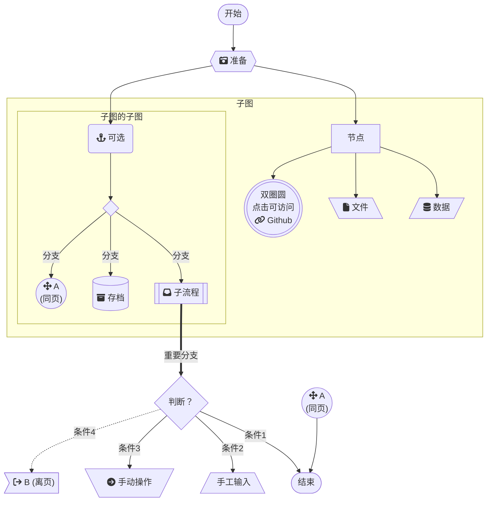
```mermaid
flowchart TB
%% 图的方向说明
%% LR：从左到图，RL：从右到左，TB：从上到下，BT：从下到上

%% 连续连接
START([开始]) --> pre1{{fa:fa-camera-retro 准备}} --> node2[节点]
pre1 --> node1(fa:fa-anchor 可选)

subgraph 子图
  subgraph 子图的子图
    %% 一对多
    node1 --> join1{ }
    join1 --> |分支|groud1[[fa:fa-inbox 子流程]] & database[(fa:fa-archive 存档)] & inpage1(("fa:fa-arrows-alt A<br>(同页)"))
    %% click clickable "#Mermaid 的状态机图"
  end  	
node2 --> data1[/fa:fa-database 数据/]
node2 --> data2[\fa:fa-file 文件\]
node2 --> data3(((双圈圆<br>点击可访问<br>fa:fa-link Github)))
click data3 "https://www.github.com" _blank
end

%% this is a comment

groud1 ==> |重要分支|cond1{"判断？"}
cond1 --> |条件1|END
cond1 --> |条件2|B[/fa:fa-keyboard-o 手工输入\]
cond1 --> |条件3|B2[\fa:fa-arrow-circle-right 手动操作/]
cond1 -.-> |条件4|outpage2>"fa:fa-sign-out B (离页)"]

inpage2(("fa:fa-arrows-alt A<br>(同页)")) --> END
END([结束])
```

*==分支流程（接续上图）==*


```mermaid
flowchart LR
outpage2>"fa:fa-sign-in B (离页)"] --> node2(节点) --> END([结束])
```

> [+] **查看完整画图脚本示例**
>
> > *==流程图的画图脚本示例==*
> >
> > ````
> > ```mermaid
> > flowchart TB
> > %% 图的方向说明
> > %% LR：从左到图，RL：从右到左，TB：从上到下，BT：从下到上
> > 
> > %% 连续连接
> > START([开始]) --> pre1{{fa:fa-camera-retro 准备}} --> node2[节点]
> > pre1 --> node1(fa:fa-anchor 可选)
> > 
> > subgraph 子图
> >   subgraph 子图的子图
> >     %% 一对多
> >     node1 --> join1{ }
> >     join1 --> |分支|groud1[[fa:fa-inbox 子流程]] & database[(fa:fa-archive 存档)] & inpage1(("fa:fa-arrows-alt A<br>(同页)"))
> >     %% click clickable "#Mermaid 的状态机图"
> >   end  	
> > node2 --> data1[/fa:fa-database 数据/]
> > node2 --> data2[\fa:fa-file 文件\]
> > node2 --> data3(((双圈圆<br>点击可访问<br>fa:fa-link Github)))
> > click data3 "https://www.github.com" _blank
> > end
> > 
> > %% this is a comment
> > 
> > groud1 ==> |重要分支|cond1{"判断？"}
> > cond1 --> |条件1|END
> > cond1 --> |条件2|B[/fa:fa-keyboard-o 手工输入\]
> > cond1 --> |条件3|B2[\fa:fa-arrow-circle-right 手动操作/]
> > cond1 -.-> |条件4|outpage2>"fa:fa-sign-out B (离页)"]
> > 
> > inpage2(("fa:fa-arrows-alt A<br>(同页)")) --> END
> > END([结束])
> > ```
> > ````

###### 关于所支持的 FontAwesome 版本

更多 FontAwesome 图标库及标识代码参考 - [详情](https://fontawesome.com.cn/v5)

###### 扩展应用说明

VLOOK™ 针对流程图中特定的节点类型进行扩展，实现重绘为不同的样式，具体如下：

| **应用建议** |    节点形状    | 说明                                                         |
| :----------: | :------------: | ------------------------------------------------------------ |
|  开始、结束  | 体育场（药丸） | 节点别名使用以下 VLOOK™ 的命名规范，会呈现出特定的样式（具体呈现效果见上图）：<br>- **开始**：命名为 `START` ，如：`START([开始])`<br>- **结束**：命名为 `END` ，如：`END([结束])` |
|   同页符号   |      圆形      | 节点别名使用以下 VLOOK™ 的命名规范，会呈现出特定的样式（具体呈现效果见上图）：<br>以 `inpage` 为前缀，如：`inpageA1((A))` |
|   离页符号   |      旗形      | 节点别名使用以下 VLOOK™ 的命名规范，会呈现出特定的样式（具体呈现效果见上图）：<br>以 `outpage` 为前缀，如：`inpageB1((B))` |

## 分角色流程图

*==用流程图模的泳道图==*

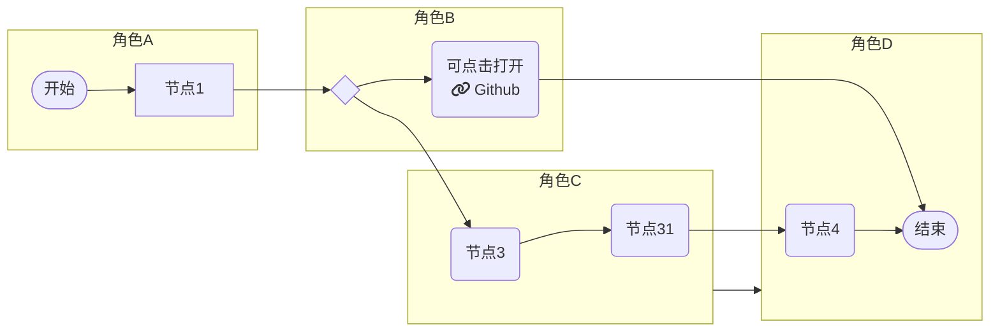
```mermaid
flowchart LR
%% 图的方向说明
%% LR：从左到图，RL：从右到左，TB：从上到下，BT：从下到上

%% 角色A 相关的流程节点
subgraph 角色A
  START([开始]) --> node1[节点1]
end

%% 角色B 相关的流程节点
subgraph 角色B
  node1 --> join1{ } --> node2("可点击打开<br>fa:fa-link Github")
  click node2 "https://www.github.com" _blank
end
node2 --> END

%% 角色C 相关的流程节点
subgraph 角色C
	direction BT
  join1 --> node3(节点3) --> node31(节点31)
end

%% 角色D 相关的流程节点
subgraph 角色D
  node31 --> node4(节点4) --> END
end

角色C --> 角色D

END([结束])
```

> [+] **查看完整画图脚本示例**
>
> > *==分角色流程图的画图脚本示例==*
> >
> > ````
> > ```mermaid
> > flowchart LR
> > %% 图的方向说明
> > %% LR：从左到图，RL：从右到左，TB：从上到下，BT：从下到上
> > 
> > %% 角色A 相关的流程节点
> > subgraph 角色A
> >   START([开始]) --> node1[节点1]
> > end
> > 
> > %% 角色B 相关的流程节点
> > subgraph 角色B
> >   node1 --> join1{ } --> node2("可点击打开<br>fa:fa-link Github")
> >   click node2 "https://www.github.com" _blank
> > end
> > node2 --> END
> > 
> > %% 角色C 相关的流程节点
> > subgraph 角色C
> > 	direction BT
> >   join1 --> node3(节点3) --> node31(节点31)
> > end
> > 
> > %% 角色D 相关的流程节点
> > subgraph 角色D
> >   node31 --> node4(节点4) --> END
> > end
> > 
> > 角色C --> 角色D
> > 
> > END([结束])
> > ```
> > ````

## 顺序图

*==顺序图（也称：时序图）==*

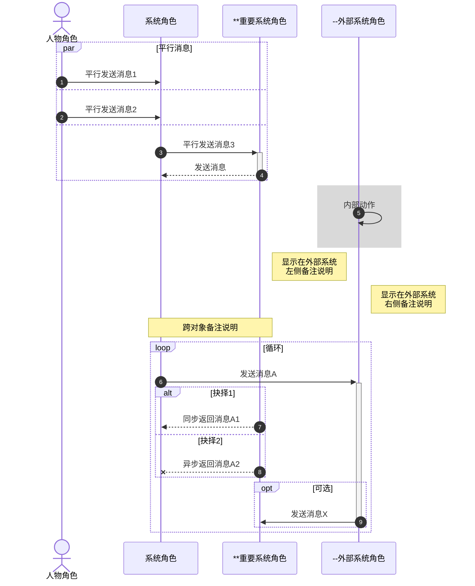
```mermaid
sequenceDiagram
%% 设置显示消息的自动编号
autonumber

actor User as 人物角色
participant Client as 系统角色
participant Server as **重要系统角色
participant Extend as --外部系统角色

par 平行消息
	User ->> Client: 平行发送消息1
and
	User ->> Client: 平行发送消息2
and
  Client ->>+ Server: 平行发送消息3
  Server -->>- Client: 发送消息
end

%% 设置区域高亮
rect rgba(128, 128, 128, 0.3)
	Extend ->> Extend: 内部动作
end

Note left of Extend: 显示在外部系统<br>左侧备注说明
Note right of Extend: 显示在外部系统<br>右侧备注说明
Note over Client,Server: 跨对象备注说明
loop 循环
	Client ->>+ Extend: 发送消息A
	alt 抉择1
		Server -->> Client: 同步返回消息A1
	else 抉择2
		Server --X Client: 异步返回消息A2
	end
	opt 可选
		Extend ->>- Server: 发送消息X
	end
end
```

> [+] **查看完整画图脚本示例**
>
> > *==顺序图的画图脚本示例==*
> >
> > ````
> > ```mermaid
> > sequenceDiagram
> > %% 设置显示消息的自动编号
> > autonumber
> > 
> > actor User as 人物角色
> > participant Client as 系统角色
> > participant Server as **重要系统角色
> > participant Extend as --外部系统角色
> > 
> > par 平行消息
> > 	User ->> Client: 平行发送消息1
> > and
> > 	User ->> Client: 平行发送消息2
> > and
> >   Client ->>+ Server: 平行发送消息3
> >   Server -->>- Client: 发送消息
> > end
> > 
> > %% 设置区域高亮
> > rect rgba(128, 128, 128, 0.3)
> > 	Extend ->> Extend: 内部动作
> > end
> > 
> > Note left of Extend: 显示在外部系统<br>左侧备注说明
> > Note right of Extend: 显示在外部系统<br>右侧备注说明
> > Note over Client,Server: 跨对象备注说明
> > loop 循环
> > 	Client ->>+ Extend: 发送消息A
> > 	alt 抉择1
> > 		Server -->> Client: 同步返回消息A1
> > 	else 抉择2
> > 		Server --X Client: 异步返回消息A2
> > 	end
> > 	opt 可选
> > 		Extend ->>- Server: 发送消息X
> > 	end
> > end
> > ```
> > ````

###### 说明

1. 针对顺序图的不同图元应用，重绘不同的外观、形状；
2. 针对 `opt` / `alt` / `loop` / `par` 标签设置不同的外观、标题位置。
3. 建议使用实体别名，以提高画图脚本的复用度和可维护性；
4. 支持三类消息线条：同步请求消息、异步请求消息、返回消息；
5. 角色在标准的一类样式的基础上，增加三类扩展的样式，在输出HTML后应用 [VLOOK™](https://github.com/madmaxchow/VLOOK) 插件后渲染为不同的样式：
   - **人物角色**：在角色名称前添加 at 符号 `@`，如 `@人物角色`
   - **重要系统角色**：在角色名称前添加两个星号 `**`，如 `**后端支撑系统名称`
   - **外部系统角色**：在角色名称前添加两个减号 `--`，如 `--外部系统名称`
6. 支持对三类标签分组在输出 HTML 后应用 [VLOOK™](https://github.com/madmaxchow/VLOOK) 插件渲染为不同的样式：
   - `loop...end`：循环
   - `opt...end`：可选
   - `alt..else...end`：条件选择（alt = 情景1，else = 情景2）
   - `par...end`：平行
7. 支持备注说明。

## 状态机图

### 流程图扩展的状态机图

*==流程图扩展的状态机图（兼容性较高）==*

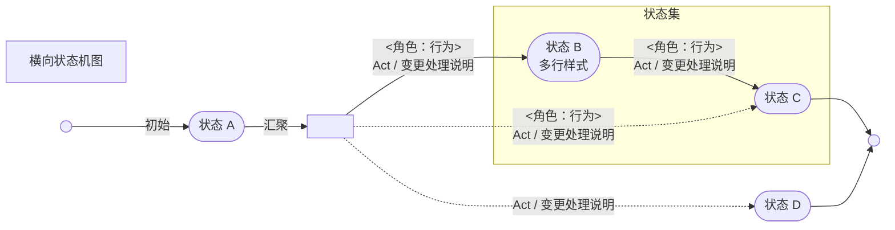
```mermaid
flowchart LR
横向状态机图
%% 图的方向说明
%% LR：从左到图，RL：从右到左，TB：从上到下，BT：从下到上

%% 正常情况
INIT(( )) -->	|初始|A([状态 A])
%% joinv 表示汇聚为竖向样式，join 表示汇聚为横向样式
A --> |汇聚|joinv1[ ]
joinv1 --> |"<角色：行为>"<br>Act / 变更处理说明|B([状态 B\n多行样式])
subgraph 状态集
	B --> |"<角色：行为>"<br>Act / 变更处理说明|C([状态 C])
end
C --> FINAL

%% 异常情况
joinv1 -.-> |"<角色：行为>"<br>Act / 变更处理说明|C
joinv1 -.-> |Act / 变更处理说明|D([状态 D])
D --> FINAL
FINAL(( ))
```

*==竖向样式==*

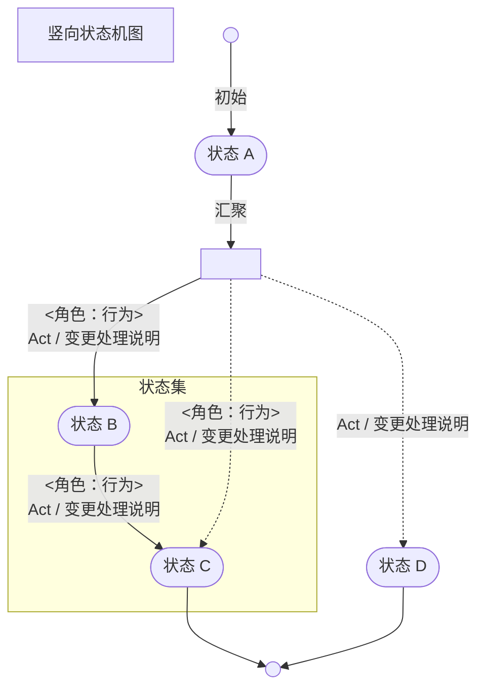
```mermaid
flowchart TB
竖向状态机图
%% 图的方向说明
%% LR：从左到图，RL：从右到左，TB：从上到下，BT：从下到上

%% 正常情况
INIT(( )) -->	|初始|A([状态 A])
%% joinv 表示汇聚为竖向样式，join 表示汇聚为横向样式
A --> |汇聚|join1[ ]
join1 --> |"<角色：行为>"<br>Act / 变更处理说明|B([状态 B])
subgraph 状态集
	B --> |"<角色：行为>"<br>Act / 变更处理说明|C([状态 C])
end
C --> FINAL

%% 异常情况
join1 -.-> |"<角色：行为>"<br>Act / 变更处理说明|C
join1 -.-> |Act / 变更处理说明|D([状态 D])
D --> FINAL
FINAL(( ))
```

> [+] **查看完整画图脚本示例**
>
> > *==流程图扩展的状态机图的画图脚本示例==*
> >
> > ````
> > ```mermaid
> > flowchart LR
> > 横向状态机图
> > %% 图的方向说明
> > %% LR：从左到图，RL：从右到左，TB：从上到下，BT：从下到上
> > 
> > %% 正常情况
> > INIT(( )) -->	|初始|A([状态 A])
> > %% joinv 表示汇聚为竖向样式，join 表示汇聚为横向样式
> > A --> |汇聚|joinv1[ ]
> > joinv1 --> |"<角色：行为>"<br>Act / 变更处理说明|B([状态 B\n多行样式])
> > subgraph 状态集
> > 	B --> |"<角色：行为>"<br>Act / 变更处理说明|C([状态 C])
> > end
> > C --> FINAL
> > 
> > %% 异常情况
> > joinv1 -.-> |"<角色：行为>"<br>Act / 变更处理说明|C
> > joinv1 -.-> |Act / 变更处理说明|D([状态 D])
> > D --> FINAL
> > FINAL(( ))
> > ```
> > ````

###### 扩展应用说明

VLOOK™ 针对流程图中特定的节点类型进行扩展，实现重绘为不同的样式，具体如下：

| **应用建议** | 节点形状 | 说明                                                         |
| :----------: | :------: | ------------------------------------------------------------ |
|  初始、终止  |   圆形   | 节点别名使用以下 VLOOK™ 的命名规范，会呈现出特定的样式（具体呈现效果见上图）：<br>- **初始**：命名为 `INIT` ，如：`INIT([ ])`<br>- **结束**：命名为 `FINAL` ，如：`FINAL([ ])` |
|  汇聚、转换  |   圆形   | 节点别名使用以下 VLOOK™ 的命名规范，会呈现出特定的样式（具体呈现效果见上图）：<br>以 `join` 为前缀，如：`join1(( ))` |
|      :       |   菱形   | 以 `join` 为前缀，如：`join1{ }`                             |
|      :       |   矩形   | 以 `join` 或 `joinv` 为前缀，一般用于状态机图中，<br>如：`join1[ ]`（默认横向），`joinv1[ ]` （竖向） |
|   同页符号   |    :     | 节点别名使用以下 VLOOK™ 的命名规范，会呈现出特定的样式（具体呈现效果见上图）：<br>以 `inpage` 为前缀，如：`inpageA1((A))` |
|   离页符号   |   旗形   | 节点别名使用以下 VLOOK™ 的命名规范，会呈现出特定的样式（具体呈现效果见上图）：<br>以 `outpage` 为前缀，如：`inpageB1((B))` |

### 标准状态机图

*==新版标准状态机图 (1)==*

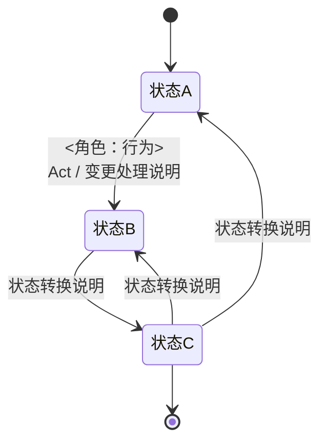
```mermaid
stateDiagram
[*] --> 状态A
状态A --> 状态B : <角色：行为><br>Act / 变更处理说明
状态B --> 状态C : 状态转换说明
状态C --> 状态B : 状态转换说明
状态C --> 状态A : 状态转换说明
状态C --> [*]
```

> [+] **查看完整画图脚本示例**
>
> > *==状态机图（1）的画图脚本示例==*
> >
> > ````
> > ```mermaid
> > stateDiagram
> > [*] --> 状态A
> > 状态A --> 状态B : <角色：行为><br>Act / 变更处理说明
> > 状态B --> 状态C : 状态转换说明
> > 状态C --> 状态B : 状态转换说明
> > 状态C --> 状态A : 状态转换说明
> > 状态C --> [*]
> > ```
> > ````


*==新版标准状态机图 (2)==*

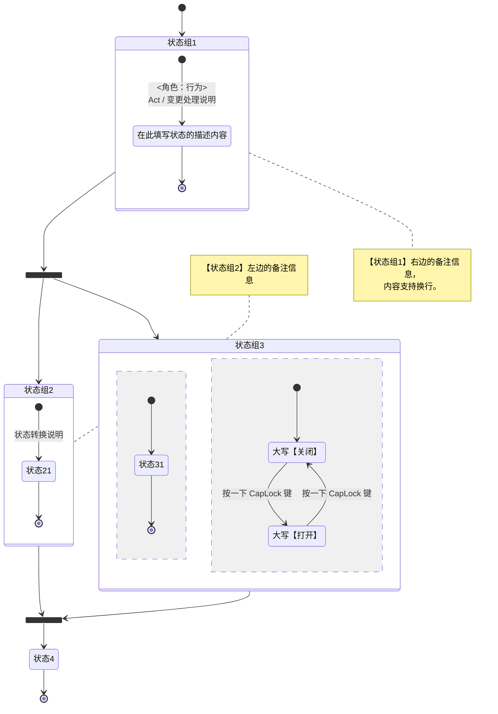
```mermaid
stateDiagram
state fork_state <<fork>>

[*] --> 状态组1
状态组1 --> fork_state
fork_state --> 状态组2
fork_state --> 状态组3

note right of 状态组1
    【状态组1】右边的备注信息，
    内容支持换行。
end note
state 状态组1 {
    状态11 : 在此填写状态的描述内容
    [*] --> 状态11 : <角色：行为><br>Act / 变更处理说明
    状态11 --> [*]
}

note left of 状态组2 : 【状态组2】左边的备注信息
state 状态组2 {
    [*] --> 状态21: 状态转换说明
    状态21 --> [*]
}

%% 可以编写注释（以两个英文百分号开头)
state 状态组3 {
    [*] --> 状态31
    状态31 --> [*]
    --
    [*] --> 大写【关闭】
    大写【关闭】 --> 大写【打开】 : 按一下 CapLock 键
    大写【打开】 --> 大写【关闭】 : 按一下 CapLock 键
}

state join_state <<join>>

状态组2 --> join_state
状态组3 --> join_state
join_state --> 状态4
状态4 --> [*]
```

> [+] **查看完整画图脚本示例**
>
> > *==状态机图（2）的画图脚本示例==*
> >
> > ````
> > ```mermaid
> > stateDiagram
> > state fork_state <<fork>>
> > 
> > [*] --> 状态组1
> > 状态组1 --> fork_state
> > fork_state --> 状态组2
> > fork_state --> 状态组3
> > 
> > note right of 状态组1
> >     【状态组1】右边的备注信息，
> >     内容支持换行。
> > end note
> > state 状态组1 {
> >     状态11 : 在此填写状态的描述内容
> >     [*] --> 状态11 : <角色：行为><br>Act / 变更处理说明
> >     状态11 --> [*]
> > }
> > 
> > note left of 状态组2 : 【状态组2】左边的备注信息
> > state 状态组2 {
> >     [*] --> 状态21: 状态转换说明
> >     状态21 --> [*]
> > }
> > 
> > %% 可以编写注释（以两个英文百分号开头)
> > state 状态组3 {
> >     [*] --> 状态31
> >     状态31 --> [*]
> >     --
> >     [*] --> 大写【关闭】
> >     大写【关闭】 --> 大写【打开】 : 按一下 CapLock 键
> >     大写【打开】 --> 大写【关闭】 : 按一下 CapLock 键
> > }
> > 
> > state join_state <<join>>
> > 
> > 状态组2 --> join_state
> > 状态组3 --> join_state
> > join_state --> 状态4
> > 状态4 --> [*]
> > ```
> > ````

## 类图

*==类图示例 1==*

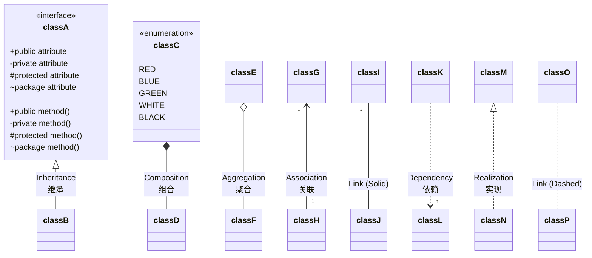
```mermaid
classDiagram
classA <|-- classB : Inheritance<br>继承
classC *-- classD : Composition<br>组合
classE o-- classF : Aggregation<br>聚合
classG "*" <-- "1" classH : Association<br>关联
classI "*" -- classJ : Link (Solid)
classK ..> "n" classL : Dependency<br>依赖
classM <|.. classN : Realization<br>实现
classO .. classP : Link (Dashed)

class classA~Class~{
    <<interface>>
    +public attribute
    -private attribute
    #protected attribute
    ~package attribute
    +public method()
    -private method()
    #protected method()
    ~package method()
}

class classC{
    <<enumeration>>
    RED
    BLUE
    GREEN
    WHITE
    BLACK
}
```

> [+] **查看完整画图脚本示例**
>
> > *==类图（1）的画图脚本示例==*
> >
> > ````
> > ```mermaid
> > classDiagram
> > classA <|-- classB : Inheritance<br>继承
> > classC *-- classD : Composition<br>组合
> > classE o-- classF : Aggregation<br>聚合
> > classG "*" <-- "1" classH : Association<br>关联
> > classI "*" -- classJ : Link (Solid)
> > classK ..> "n" classL : Dependency<br>依赖
> > classM <|.. classN : Realization<br>实现
> > classO .. classP : Link (Dashed)
> > 
> > class classA~Class~{
> >     <<interface>>
> >     +public attribute
> >     -private attribute
> >     #protected attribute
> >     ~package attribute
> >     +public method()
> >     -private method()
> >     #protected method()
> >     ~package method()
> > }
> > 
> > class classC{
> >     <<enumeration>>
> >     RED
> >     BLUE
> >     GREEN
> >     WHITE
> >     BLACK
> > }
> > ```
> > ````


*==类图示例 2==*

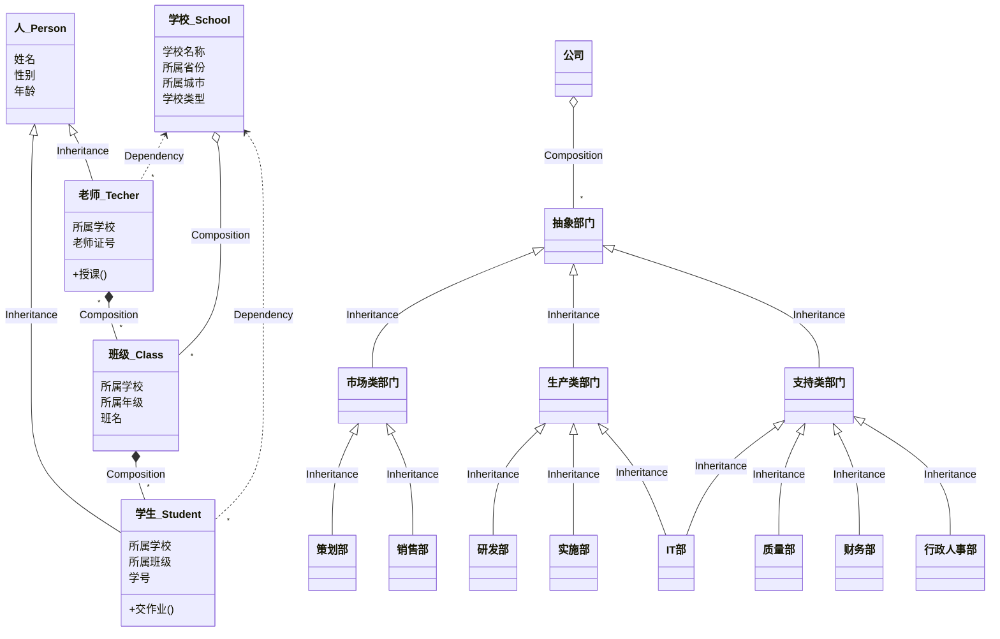
```mermaid
classDiagram

人_Person <|-- 学生_Student : Inheritance
人_Person <|-- 老师_Techer : Inheritance
老师_Techer "*" *-- "*" 班级_Class : Composition
班级_Class *-- "*" 学生_Student : Composition
学校_School <.. "*" 老师_Techer : Dependency
学校_School o-- "*" 班级_Class : Composition
学校_School <.. "*" 学生_Student : Dependency

class 人_Person {
  姓名
  性别
  年龄
}
class 学校_School {
  学校名称
  所属省份
  所属城市
  学校类型
}
class 学生_Student {
  所属学校
  所属班级
  学号
  +交作业()
}
class 老师_Techer {
  所属学校
  老师证号
  +授课()
}
class 班级_Class {
  所属学校
  所属年级
  班名
}

公司 o-- "*" 抽象部门 : Composition
抽象部门 <|-- 市场类部门 : Inheritance
市场类部门 <|-- 策划部 : Inheritance
市场类部门 <|-- 销售部 : Inheritance
抽象部门 <|-- 生产类部门 : Inheritance
生产类部门 <|-- 研发部 : Inheritance
生产类部门 <|-- 实施部 : Inheritance
生产类部门 <|-- IT部 : Inheritance
抽象部门 <|-- 支持类部门 : Inheritance
支持类部门 <|-- 质量部 : Inheritance
支持类部门 <|-- 财务部 : Inheritance
支持类部门 <|-- 行政人事部 : Inheritance
支持类部门 <|-- IT部 : Inheritance
```

> [+] **查看完整画图脚本示例**
>
> > *==类图（2）的画图脚本示例==*
> >
> > ````
> > ```mermaid
> > classDiagram
> > 
> > 人_Person <|-- 学生_Student : Inheritance
> > 人_Person <|-- 老师_Techer : Inheritance
> > 老师_Techer "*" *-- "*" 班级_Class : Composition
> > 班级_Class *-- "*" 学生_Student : Composition
> > 学校_School <.. "*" 老师_Techer : Dependency
> > 学校_School o-- "*" 班级_Class : Composition
> > 学校_School <.. "*" 学生_Student : Dependency
> > 
> > class 人_Person {
> >   姓名
> >   性别
> >   年龄
> > }
> > class 学校_School {
> >   学校名称
> >   所属省份
> >   所属城市
> >   学校类型
> > }
> > class 学生_Student {
> >   所属学校
> >   所属班级
> >   学号
> >   +交作业()
> > }
> > class 老师_Techer {
> >   所属学校
> >   老师证号
> >   +授课()
> > }
> > class 班级_Class {
> >   所属学校
> >   所属年级
> >   班名
> > }
> > 
> > 公司 o-- "*" 抽象部门 : Composition
> > 抽象部门 <|-- 市场类部门 : Inheritance
> > 市场类部门 <|-- 策划部 : Inheritance
> > 市场类部门 <|-- 销售部 : Inheritance
> > 抽象部门 <|-- 生产类部门 : Inheritance
> > 生产类部门 <|-- 研发部 : Inheritance
> > 生产类部门 <|-- 实施部 : Inheritance
> > 生产类部门 <|-- IT部 : Inheritance
> > 抽象部门 <|-- 支持类部门 : Inheritance
> > 支持类部门 <|-- 质量部 : Inheritance
> > 支持类部门 <|-- 财务部 : Inheritance
> > 支持类部门 <|-- 行政人事部 : Inheritance
> > 支持类部门 <|-- IT部 : Inheritance
> > ```
> > ````

## 实体关系图

*==实体关系图（ER图）==*

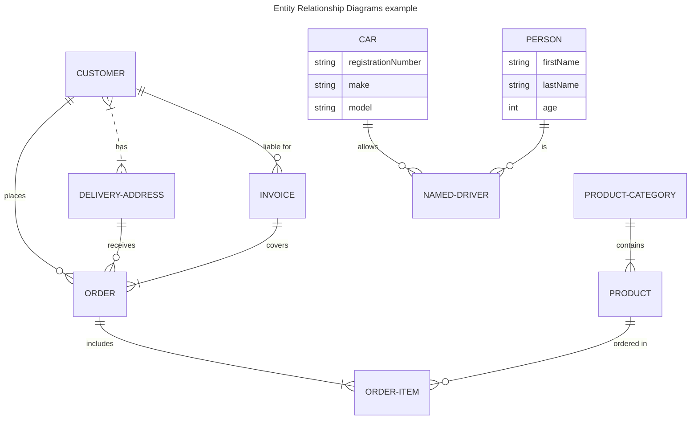
```mermaid
---
title: Entity Relationship Diagrams example
---
erDiagram
    CUSTOMER }|..|{ DELIVERY-ADDRESS : has
    CUSTOMER ||--o{ ORDER : places
    CUSTOMER ||--o{ INVOICE : "liable for"
    DELIVERY-ADDRESS ||--o{ ORDER : receives
    INVOICE ||--|{ ORDER : covers
    ORDER ||--|{ ORDER-ITEM : includes
    PRODUCT-CATEGORY ||--|{ PRODUCT : contains
    PRODUCT ||--o{ ORDER-ITEM : "ordered in"
    
    CAR ||--o{ NAMED-DRIVER : allows
    CAR {
        string registrationNumber
        string make
        string model
    }
    PERSON ||--o{ NAMED-DRIVER : is
    PERSON {
        string firstName
        string lastName
        int age
    }
```

> [+] **查看完整画图脚本示例**
>
> > *==实体关系图（ER图）的画图脚本示例==*
> >
> > ````
> > ```mermaid
> > ---
> > title: Entity Relationship Diagrams example
> > ---
> > erDiagram
> >     CUSTOMER }|..|{ DELIVERY-ADDRESS : has
> >     CUSTOMER ||--o{ ORDER : places
> >     CUSTOMER ||--o{ INVOICE : "liable for"
> >     DELIVERY-ADDRESS ||--o{ ORDER : receives
> >     INVOICE ||--|{ ORDER : covers
> >     ORDER ||--|{ ORDER-ITEM : includes
> >     PRODUCT-CATEGORY ||--|{ PRODUCT : contains
> >     PRODUCT ||--o{ ORDER-ITEM : "ordered in"
> >     
> >     CAR ||--o{ NAMED-DRIVER : allows
> >     CAR {
> >         string registrationNumber
> >         string make
> >         string model
> >     }
> >     PERSON ||--o{ NAMED-DRIVER : is
> >     PERSON {
> >         string firstName
> >         string lastName
> >         int age
> >     }
> > ```
> > ````

## 需求图

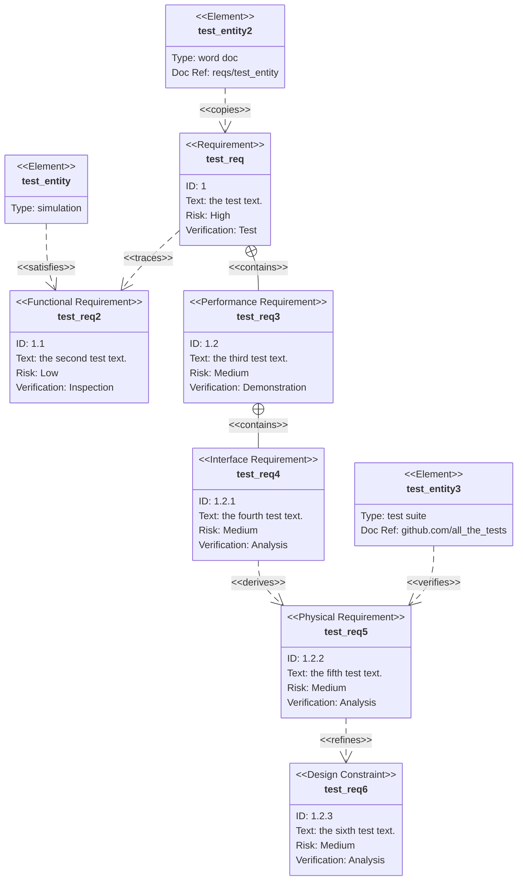
```mermaid
requirementDiagram

requirement test_req {
  id: 1
  text: the test text.
  risk: high
  verifymethod: test
}

functionalRequirement test_req2 {
  id: 1.1
  text: the second test text.
  risk: low
  verifymethod: inspection
}

performanceRequirement test_req3 {
  id: 1.2
  text: the third test text.
  risk: medium
  verifymethod: demonstration
}

interfaceRequirement test_req4 {
  id: 1.2.1
  text: the fourth test text.
  risk: medium
  verifymethod: analysis
}

physicalRequirement test_req5 {
  id: 1.2.2
  text: the fifth test text.
  risk: medium
  verifymethod: analysis
}

designConstraint test_req6 {
  id: 1.2.3
  text: the sixth test text.
  risk: medium
  verifymethod: analysis
}

element test_entity {
  type: simulation
}

element test_entity2 {
  type: word doc
  docRef: reqs/test_entity
}

element test_entity3 {
  type: "test suite"
  docRef: github.com/all_the_tests
}

test_entity - satisfies -> test_req2
test_req - traces -> test_req2
test_req - contains -> test_req3
test_req3 - contains -> test_req4
test_req4 - derives -> test_req5
test_req5 - refines -> test_req6
test_entity3 - verifies -> test_req5
test_req <- copies - test_entity2
```

> [+] **查看完整画图脚本示例**
>
> > *==需求图的画图脚本示例==*
> >
> > ````
> > ```mermaid
> > requirementDiagram
> > 
> > requirement test_req {
> >   id: 1
> >   text: the test text.
> >   risk: high
> >   verifymethod: test
> > }
> > 
> > functionalRequirement test_req2 {
> >   id: 1.1
> >   text: the second test text.
> >   risk: low
> >   verifymethod: inspection
> > }
> > 
> > performanceRequirement test_req3 {
> >   id: 1.2
> >   text: the third test text.
> >   risk: medium
> >   verifymethod: demonstration
> > }
> > 
> > interfaceRequirement test_req4 {
> >   id: 1.2.1
> >   text: the fourth test text.
> >   risk: medium
> >   verifymethod: analysis
> > }
> > 
> > physicalRequirement test_req5 {
> >   id: 1.2.2
> >   text: the fifth test text.
> >   risk: medium
> >   verifymethod: analysis
> > }
> > 
> > designConstraint test_req6 {
> >   id: 1.2.3
> >   text: the sixth test text.
> >   risk: medium
> >   verifymethod: analysis
> > }
> > 
> > element test_entity {
> >   type: simulation
> > }
> > 
> > element test_entity2 {
> >   type: word doc
> >   docRef: reqs/test_entity
> > }
> > 
> > element test_entity3 {
> >   type: "test suite"
> >   docRef: github.com/all_the_tests
> > }
> > 
> > test_entity - satisfies -> test_req2
> > test_req - traces -> test_req2
> > test_req - contains -> test_req3
> > test_req3 - contains -> test_req4
> > test_req4 - derives -> test_req5
> > test_req5 - refines -> test_req6
> > test_entity3 - verifies -> test_req5
> > test_req <- copies - test_entity2
> > ```
> > ````

## Gitgraph 图

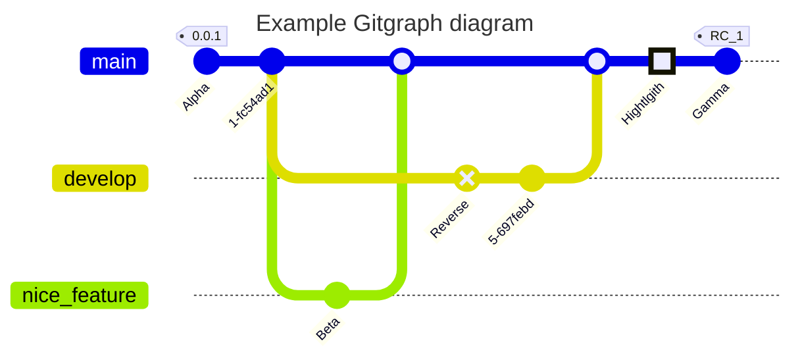
```mermaid
---
title: Example Gitgraph diagram
---
gitGraph
  commit id: "Alpha" tag: "0.0.1"
  
  commit
  branch develop
    branch nice_feature
    checkout nice_feature
    commit id: "Beta"
    checkout main
    merge nice_feature
  checkout develop
  
  commit id: "Reverse" type: REVERSE
  commit
  	
  checkout main
  merge develop
  commit id: "Hightlgith" type: HIGHLIGHT
  
  commit id: "Gamma" tag: "RC_1"

```

> [+] **查看完整画图脚本示例**
>
> > *==Gitgraph 图（1）的画图脚本示例==*
> >
> > ````
> > ```mermaid
> > ---
> > title: Example Gitgraph diagram
> > ---
> > gitGraph
> >   commit id: "Alpha" tag: "0.0.1"
> >   
> >   commit
> >   branch develop
> >     branch nice_feature
> >     checkout nice_feature
> >     commit id: "Beta"
> >     checkout main
> >     merge nice_feature
> >   checkout develop
> >   
> >   commit id: "Reverse" type: REVERSE
> >   commit
> >   	
> >   checkout main
> >   merge develop
> >   commit id: "Hightlgith" type: HIGHLIGHT
> >   
> >   commit id: "Gamma" tag: "RC_1"
> > ```
> > ````


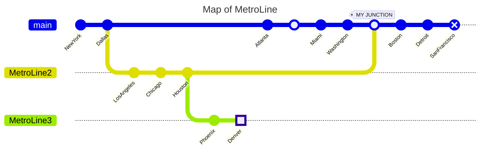
```mermaid
---
title: Map of MetroLine
---
%%{init: {'mainBranchName': 'MetroLine1'}} }%%
gitGraph
  commit id:"NewYork"
  commit id:"Dallas"
  branch MetroLine2
  commit id:"LosAngeles"
  commit id:"Chicago"
  commit id:"Houston"
  branch MetroLine3
  commit id:"Phoenix"
  commit type: HIGHLIGHT id:"Denver"
  commit id:"Boston"
  checkout main
  commit id:"Atlanta"
  merge MetroLine3
  commit id:"Miami"
  commit id:"Washington"
  merge MetroLine2 tag:"MY JUNCTION"
  commit id:"Boston"
  commit id:"Detroit"
  commit type:REVERSE id:"SanFrancisco"
```

> [+] **查看完整画图脚本示例**
>
> > *==Gitgraph 图（2）的画图脚本示例==*
> >
> > ````
> > ```mermaid
> > ---
> > title: Map of MetroLine
> > ---
> > %%{init: {'mainBranchName': 'MetroLine1'}} }%%
> > gitGraph
> >   commit id:"NewYork"
> >   commit id:"Dallas"
> >   branch MetroLine2
> >   commit id:"LosAngeles"
> >   commit id:"Chicago"
> >   commit id:"Houston"
> >   branch MetroLine3
> >   commit id:"Phoenix"
> >   commit type: HIGHLIGHT id:"Denver"
> >   commit id:"Boston"
> >   checkout main
> >   commit id:"Atlanta"
> >   merge MetroLine3
> >   commit id:"Miami"
> >   commit id:"Washington"
> >   merge MetroLine2 tag:"MY JUNCTION"
> >   commit id:"Boston"
> >   commit id:"Detroit"
> >   commit type:REVERSE id:"SanFrancisco"
> > ```
> > ````

## 饼图

*==Q3 2019 中国线上智能手机市场主要品牌市场份额_数据来自：互联网_==*

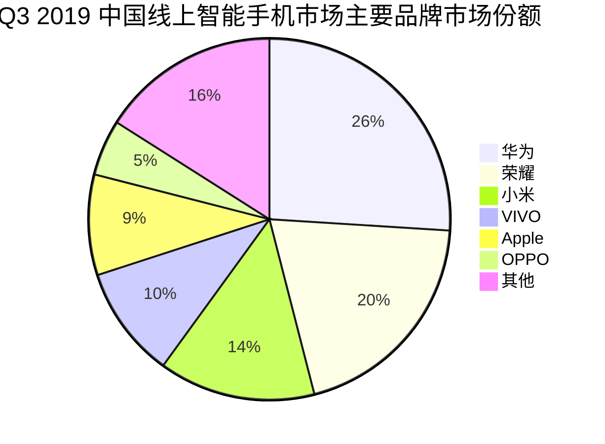
```mermaid
pie title Q3 2019 中国线上智能手机市场主要品牌市场份额
"华为" : 26
"荣耀" : 20
"小米" : 14
"VIVO" : 10
"Apple" : 9
"OPPO" : 5
"其他" : 16
```

> [+] **查看完整画图脚本示例**
>
> > *==饼图的画图脚本示例==*
> >
> > ````
> > ```mermaid
> > pie title Q3 2019 中国线上智能手机市场主要品牌市场份额
> > "华为" : 26
> > "荣耀" : 20
> > "小米" : 14
> > "VIVO" : 10
> > "Apple" : 9
> > "OPPO" : 5
> > "其他" : 16
> > ```
> > ````

## 甘特图

*==甘特图示例==*

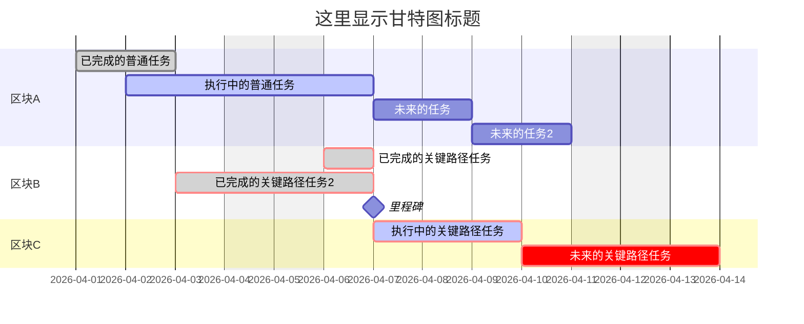
```mermaid
gantt
dateFormat  MM-DD
title 这里显示甘特图标题
%% 排除的日期：monday...saturday, sunday, weekends
excludes weekends

section 区块A
已完成的普通任务	:done, des1, 04-01, 04-03
执行中的普通任务	:active, des2, 04-02, 3d
未来的任务				:des3, after des2, 2d
未来的任务2			:des4, after des3, 2d

section 区块B
已完成的关键路径任务		:crit, done, 04-06, 24h
已完成的关键路径任务2		:crit, done, after des1, 2d
里程碑								:milestone, after des2, 0d

section 区块C
执行中的关键路径任务		:crit, active, 3d
未来的关键路径任务			:crit, 2d
```

> [+] **查看完整画图脚本示例**
>
> > *==甘特图的画图脚本示例==*
> >
> > ````
> > ```mermaid
> > gantt
> > dateFormat  MM-DD
> > title 这里显示甘特图标题
> > %% 排除的日期：monday...saturday, sunday, weekends
> > excludes weekends
> > 
> > section 区块A
> > 已完成的普通任务	:done, des1, 04-01, 04-03
> > 执行中的普通任务	:active, des2, 04-02, 3d
> > 未来的任务				:des3, after des2, 2d
> > 未来的任务2			:des4, after des3, 2d
> > 
> > section 区块B
> > 已完成的关键路径任务		:crit, done, 04-06, 24h
> > 已完成的关键路径任务2		:crit, done, after des1, 2d
> > 里程碑								:milestone, after des2, 0d
> > 
> > section 区块C
> > 执行中的关键路径任务		:crit, active, 3d
> > 未来的关键路径任务			:crit, 2d
> > ```
> > ````

## 时间线

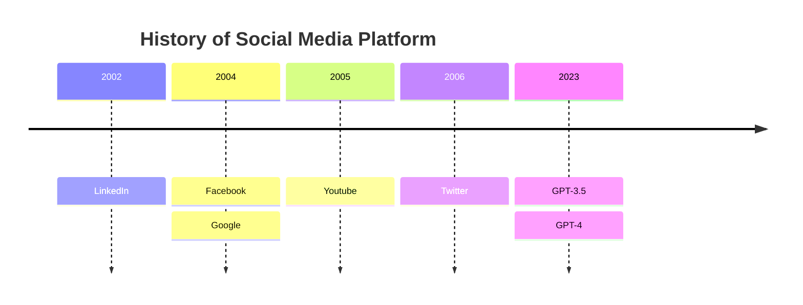
```mermaid
timeline
    title History of Social Media Platform
    2002 : LinkedIn
    2004 : Facebook
         : Google
    2005 : Youtube
    2006 : Twitter
    2023 : GPT-3.5
         : GPT-4
```

> [+] **查看完整画图脚本示例**
>
> > *==时间线（1）图的画图脚本示例==*
> >
> > ````
> > ```mermaid
> > timeline
> >     title History of Social Media Platform
> >     2002 : LinkedIn
> >     2004 : Facebook
> >          : Google
> >     2005 : Youtube
> >     2006 : Twitter
> >     2023 : GPT-3.5
> >          : GPT-4
> > ```
> > ````


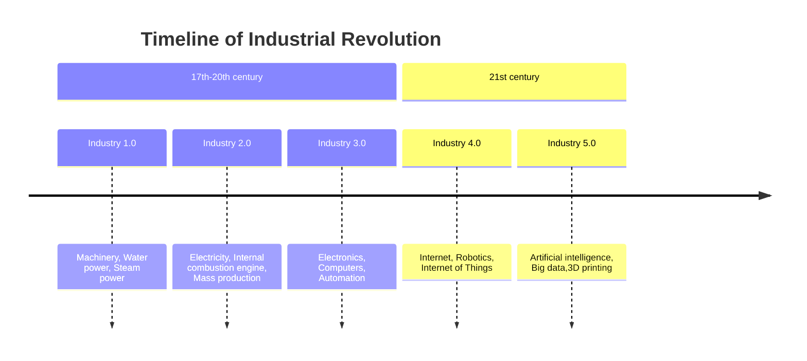
```mermaid
timeline
    title Timeline of Industrial Revolution
    section 17th-20th century
        Industry 1.0 : Machinery, Water power, Steam <br>power
        Industry 2.0 : Electricity, Internal combustion engine, Mass production
        Industry 3.0 : Electronics, Computers, Automation
    section 21st century
        Industry 4.0 : Internet, Robotics, Internet of Things
        Industry 5.0 : Artificial intelligence, Big data,3D printing
```

> [+] **查看完整画图脚本示例**
>
> > *==时间线（2）图的画图脚本示例==*
> >
> > ````
> > ```mermaid
> > timeline
> >     title Timeline of Industrial Revolution
> >     section 17th-20th century
> >         Industry 1.0 : Machinery, Water power, Steam <br>power
> >         Industry 2.0 : Electricity, Internal combustion engine, Mass production
> >         Industry 3.0 : Electronics, Computers, Automation
> >     section 21st century
> >         Industry 4.0 : Internet, Robotics, Internet of Things
> >         Industry 5.0 : Artificial intelligence, Big data,3D printing
> > ```
> > ````

## 思维导图

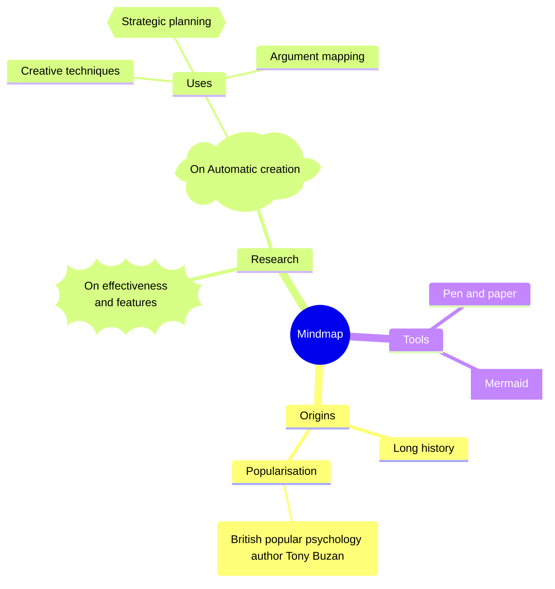
```mermaid
mindmap
  root((Mindmap))
    Origins
      Long history
      ::icon(fa fa-book)
      Popularisation
        (British popular psychology author Tony Buzan)
    Research
      ))On effectiveness<br/>and features((
      ::icon(fa fa-beer)
      )On Automatic creation(
        Uses
            Creative techniques
            {{Strategic planning}}
            Argument mapping
    Tools
      Pen and paper
      [Mermaid]
```

> [+] **查看完整画图脚本示例**
>
> > *==思维导图的画图脚本示例==*
> >
> > ````
> > ```mermaid
> > mindmap
> >   root((Mindmap))
> >     Origins
> >       Long history
> >       ::icon(fa fa-book)
> >       Popularisation
> >         (British popular psychology author Tony Buzan)
> >     Research
> >       ))On effectiveness<br/>and features((
> >       ::icon(fa fa-beer)
> >       )On Automatic creation(
> >         Uses
> >             Creative techniques
> >             {{Strategic planning}}
> >             Argument mapping
> >     Tools
> >       Pen and paper
> >       [Mermaid]
> > ```
> > ````

###### 关于所支持的 FontAwesome 版本

更多 FontAwesome 图标库及标识代码参考 - [详情](https://fontawesome.com.cn/v5)

## 用户旅程地图

*==用户旅程地图（也称：用户体验地图）==*

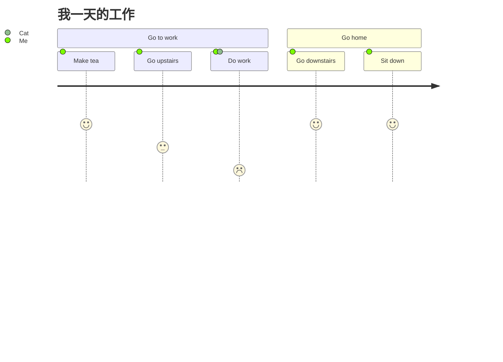
```mermaid
journey
    title 我一天的工作
    section Go to work
      Make tea: 5: Me
      Go upstairs: 3: Me
      Do work: 1: Me, Cat
    section Go home
      Go downstairs: 5: Me
      Sit down: 5: Me
```

> [+] **查看完整画图脚本示例**
>
> > *==用户旅程地图的画图脚本示例==*
> >
> > ````
> > ```mermaid
> > journey
> >     title 我一天的工作
> >     section Go to work
> >       Make tea: 5: Me
> >       Go upstairs: 3: Me
> >       Do work: 1: Me, Cat
> >     section Go home
> >       Go downstairs: 5: Me
> >       Sit down: 5: Me
> > ```
> > ````

#The End 