###### <sub>VLOOK™</sub><br />让你的 Markdown 有了新`{看}(wán)`法<br />──<br /><sup>脚本化图表参考指南</sup><br /><br /><br />**MAX°孟兆**<br />*COPYRIGHT © 2017-2021. MAX°DESIGN.*

[TOC]

# 关于 Markdown

###### Markdown 是什么？

- 2004 年，[John Gruber](https://en.wikipedia.org/wiki/John_Gruber) 创造了 [ Markdown](https://zh.wikipedia.org/wiki/Markdown)，一种专门针对网络写作的 `文本标记语言`。使用 Markdown，你只需在写作过程中插入少量的标记符号，就能很轻松地进行排版（例如设置标题、加粗、列表、引用等）；
- Markdown 文档以 `纯文本格式存储`，这意味着，它们可以用几乎任一种文本编辑器打开。同时，又能通过 Markdown 编辑器导出为带排版的富文本文档、HTML 网页等等。==纯粹、简洁、易用、灵活==，都是人们喜欢 Markdown 的原因；
- 目前 Markdown 的标准化项目是 [CommonMark](http://commonmark.org)。

###### Markdown 语法参考：

- `#推荐#` **Github Flavored Markdown** (GFM) 语法参考：Typora 目前采用该标准 [详细](https://support.typora.io/Markdown-Reference/)；
- 标准化 **CommonMark** 语法参考：[60 秒学会 Markdown 语法](http://commonmark.org/help/)、[10 分钟深入学习 Markdown](http://commonmark.org/help/tutorial/)。

# 主推方案 (Mermaid)

Mermaid 是一个用于画流程图、状态图、顺序图、甘特图的库，使用 JS 进行本地渲染，广泛集成于许多 Markdown 编辑器中。详见 [Mermaid 官网](https://mermaidjs.github.io)。

**目前 Typora + VLOOK™ 的最新版本，可支持下脚本化图表的制作和生成：**

[](#流程图)　　[](#顺序图)　　[](#状态图)　　[](#类图)　　[](#实体关系图)　　[](#客户旅程地图)　　[](#甘特图)　　[](#饼图)

## 流程图

###### ![流程图]"（以上的「分支流程」内容由下图进行接续）"

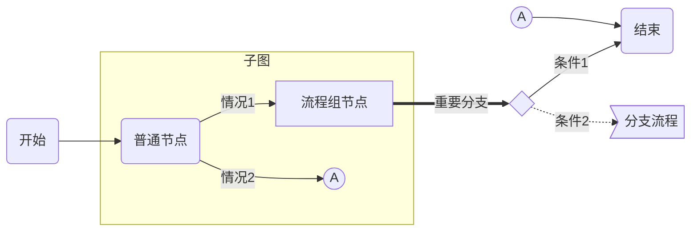

###### 分支流程（接续上图）


###### 以上「流程图」的画图脚本示例

```
graph LR
START(开始) --> node1(普通节点)
subgraph 子图
	node1 --> |情况1|groud1[流程组节点]
  node1 --> |情况2|A1((A))
end

%% this is a comment

groud1 ==> |重要分支|cond1{条件判断}
cond1 --> |是|END
cond1 -.-> |否|page2>分支流程]
A2((A)) --> END
END(结束)
```

###### 说明

1. 针对流程图及不同图元的应用，重绘为不同的外观、形状；

2. 特定节点命名规范：

   - `START`：开始结点
   - `END`：结束结点

3. 支持节点形状/类型：

   | **节点形状** | 应用建议                   | 说明                                                         |
   | :----------: | :------------------------- | ------------------------------------------------------------ |
   |   圆角矩形   | 普通流程节点               | 结合别名（如：node1、page2 等，可自由定义），并通过`()`指定，举例：`node1(普通节点)` |
   |     菱形     | 条件判断节点               | 结合别名，并通过`{}`指定，举例：`cond1{条件判断}`<br />`#注意#`「条件判断节点」的别名建议统一以`cond`为前缀 |
   |   方角矩形   | 普通流程节点/子流程/状态图 | 不使用别名时的默认样式，也可以通过`[]`来强制指定，举例：`node1[流程组]` |
   |     圆形     | 同页标志                   | 结合别名，并通过`(())`指定，举例：`node1((圆形节点)`         |
   |     旗形     | 离页标志                   | 结合别名，并通过`>]`指定，举例：`page1>条件判断节点]`<br />`#注意#`「离页标志节点」的别名必须以`page`为前缀，否则样式会与「菱形」条件判断节点冲突 |

4. 支持指定流程图方向：`LR`（从左到右）、`RL`（从右到左）、`TB`（从上到下）、`BT`（从下到上）；

5. 支持 FontAwesome [官网](http://fontawesome.com)。

## 顺序图

###### 顺序图（也称：时序图 / 泳道图）

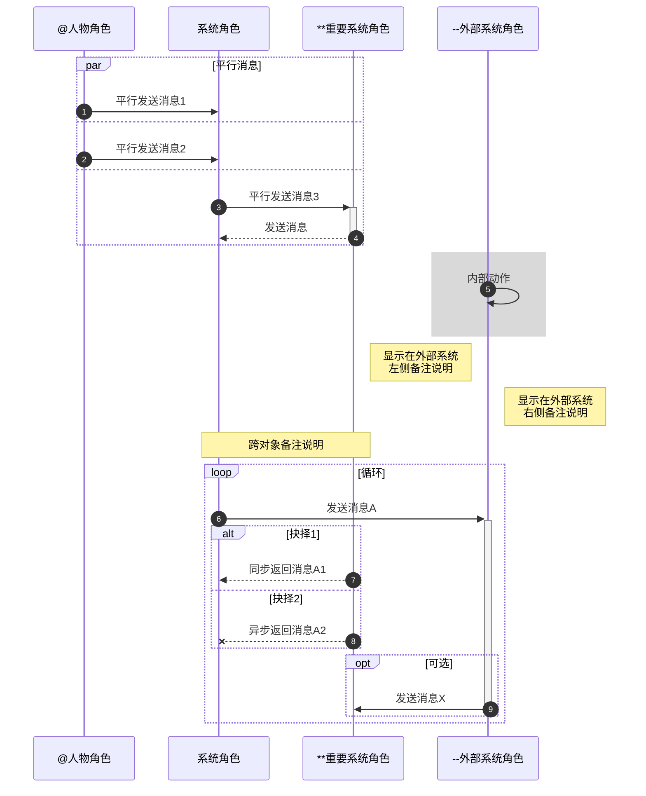

###### 以上「顺序图」的画图脚本示例

```
sequenceDiagram
%% 设置显示消息的自动编号
autonumber

participant User as @人物角色
participant Client as 系统角色
participant Server as **重要系统角色
participant Extend as --外部系统角色

par 平行消息
	User ->> Client: 平行发送消息1
and
	User ->> Client: 平行发送消息2
and
  Client ->>+ Server: 平行发送消息3
  Server -->>- Client: 发送消息
end

%% 设置区域高亮
rect rgba(128, 128, 128, 0.3)
	Extend ->> Extend: 内部动作
end

Note left of Extend: 显示在外部系统<br />左侧备注说明
Note right of Extend: 显示在外部系统<br />右侧备注说明
Note over Client,Server: 跨对象备注说明
loop 循环组
	Client ->>+ Extend: 发送消息A
	alt 情景1
		Server -->> Client: 同步返回消息A1
	else 情景2
		Server --X Client: 异步返回消息A2
	end
	opt 可选
		Extend ->>- Server: 发送消息X
	end
end
```

###### 说明

1. 针对顺序图的不同图元应用，重绘不同的外观、形状；
2. 针对 `opt` / `alt` / `loop` / `par` 标签设置不同的外观、标题位置。
3. 建议使用实体别名，以提高画图脚本的复用度和可维护性；
4. 支持三类消息线条：同步请求消息、异步请求消息、返回消息；
5. 角色在标准的一类样式的基础上，增加三类扩展的样式，在输出HTML后应用 [VLOOK™](https://github.com/madmaxchow/VLOOK) 插件后渲染为不同的样式：
   - **人物角色**：在角色名称前添加 at 符号`@`，如`@人物角色`
   - **重要系统角色**：在角色名称前添加两个星号`**`，如`**后端支撑系统名称`
   - **外部系统角色**：在角色名称前添加两个减号`--`，如`--外部系统名称`
6. 支持对三类标签分组在输出 HTML 后应用 [VLOOK™](https://github.com/madmaxchow/VLOOK) 插件渲染为不同的样式：
   - `loop...end`：循环
   - `opt...end`：可选
   - `alt..else...end`：条件选择（alt = 情景1，else = 情景2）
   - `par...end`：平行
7. 支持备注说明。

## 类图

须mermaid V8.4及更新版本支持。

###### 标准类图 (1)

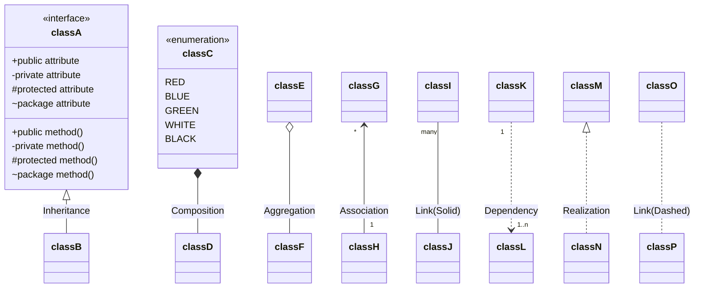

###### 标准类图 (2)


###### 以上「类图」的画图脚本示例

```
classDiagram
classA <|-- classB : Inheritance
classC *-- classD : Composition
classE o-- classF : Aggregation
classG "*" <-- "1" classH : Association
classI "many" -- classJ : Link(Solid)
classK "1" ..> "1..n" classL : Dependency
classM <|.. classN : Realization
classO .. classP : Link(Dashed)

class classA~Class~{
    <<interface>>
    +public attribute
    -private attribute
    #protected attribute
    ~package attribute
    +public method()
    -private method()
    #protected method()
    ~package method()
}

class classC{
    <<enumeration>>
    RED
    BLUE
    GREEN
    WHITE
    BLACK
}
```

## 状态图

### 标准状态机图

###### 环境要求

- Typora `#macOS 版本|0.9.9.30+#(gray)` `#Windows 版本|0.9.80+#(blue)`
- mermaid `#Version|8.4+#` 

###### 新版标准状态机图 (1)

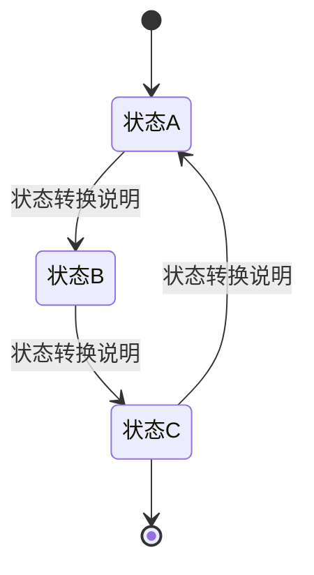

###### 以上「状态机图」的画图脚本示例

```
stateDiagram
[*] --> 状态A
状态A --> 状态B : 状态转换说明
状态B --> 状态C : 状态转换说明
状态C --> 状态A : 状态转换说明
状态C --> [*]
```

###### 新版标准状态机图 (2)

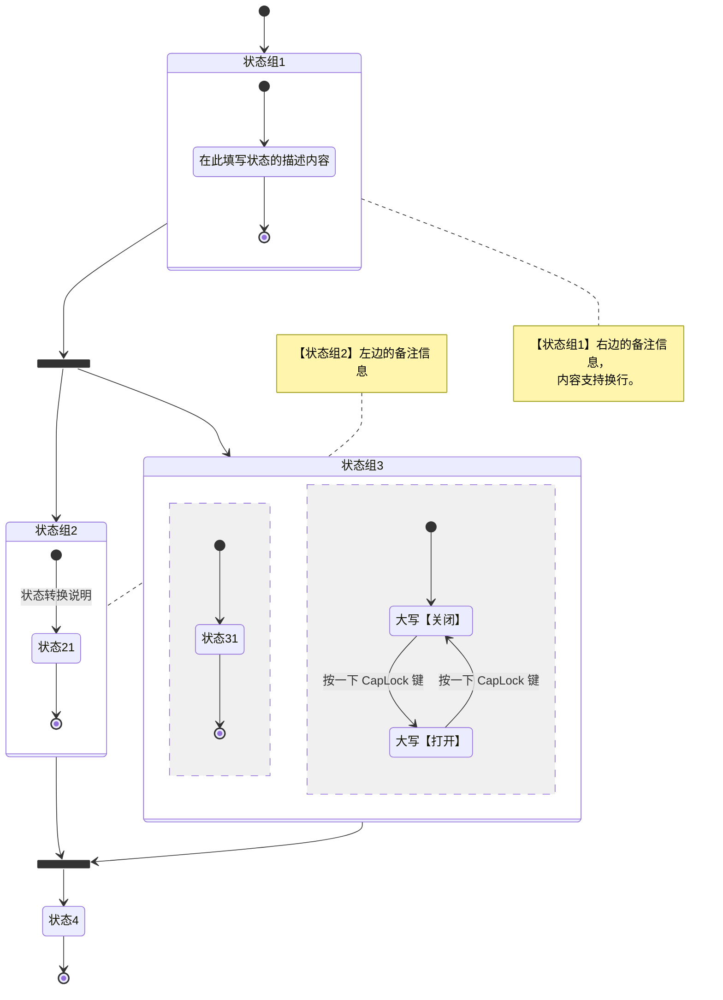

###### 以上「状态机图」的画图脚本示例

```
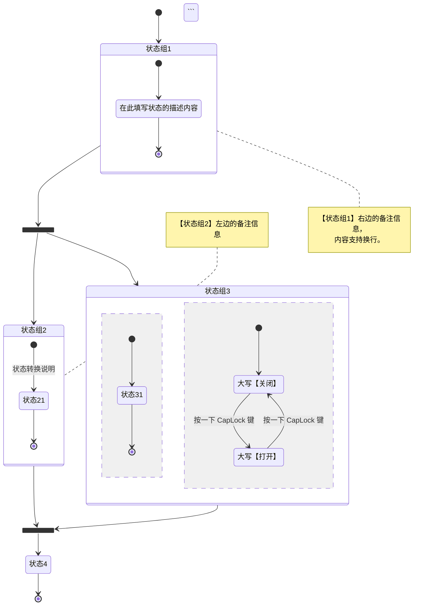

### 旧版状态图

###### 说明

1. 该样式的状态图是借用**流程图**脚本实现，是mermaid未支持[标准状态图](#标准状态机图)时的变通方案；
2. 针对该类状态图及不同图元的应用，重绘不同的外观、形状；
3. 特定节点命名规范：
   - `INIT`：初始状态
   - `FINAL`：最终状态
4. 建议使用`方角矩形`节点来表示状态；
5. 根据情况适当使用别名（如：A、B、C 等，可自由定义）；
6. 可适当结合`菱形`节点用于表示**分支**和**聚合**。

###### 旧版状态机图（兼容性较高）

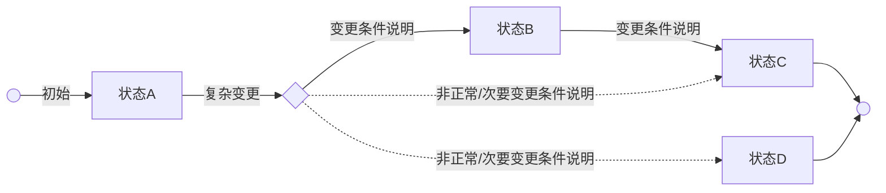

###### 以上「状态机图」的画图脚本示例

```
```mermaid
graph LR
%% 流程图走方说明
%% LR：从左到图，RL：从右到左，TB：从上到下，BT：从下到上

INIT(( )) --> |初始|A[状态A]
A --> |复杂变更|fork1(( ))
fork1(( )) --> |变更条件说明|B[状态B]
B --> |变更条件说明|C[状态C]
fork1{ } -.-> |非正常/次要变更条件说明|C
C --> FINAL
fork1{ } -.-> |非正常/次要变更条件说明|D[状态D]
D --> FINAL
FINAL(( ))
​```
```

## 甘特图

###### 甘特图示例

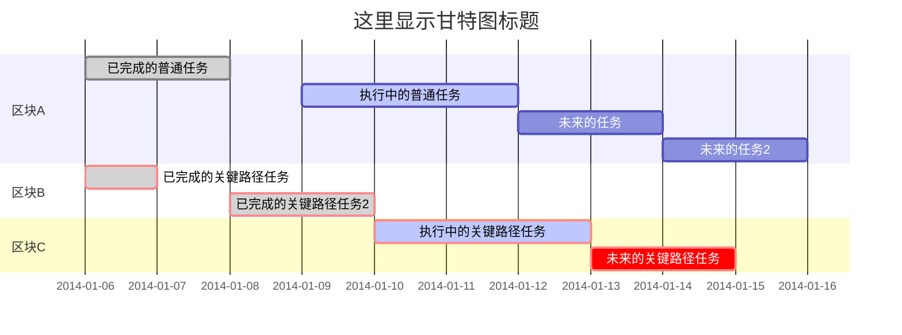

###### ![以上「甘特图」的画图脚本示例]

```
```mermaid
gantt
dateFormat  YYYY-MM-DD
title 这里显示甘特图标题

%% this is a comment

section 区块A
已完成的任务:done, des1, 2014-01-06, 2014-01-08
执行中的任务:active, des2, 2014-01-09, 3d
未来的任务:des3, after des2, 5d
未来的任务2:des4, after des3, 5d

section 区块B
已完成的关键路径任务:crit, done, 2014-01-06, 24h
已完成的关键路径任务2:crit, done, after des1, 2d

section 区块C
执行中的关键路径任务:crit, active, 3d
未来的关键路径任务:crit, 5d
​```
```

## 饼图

###### ![Q3 2019 中国线上智能手机市场主要品牌市场份额]"数据来自：互联网"

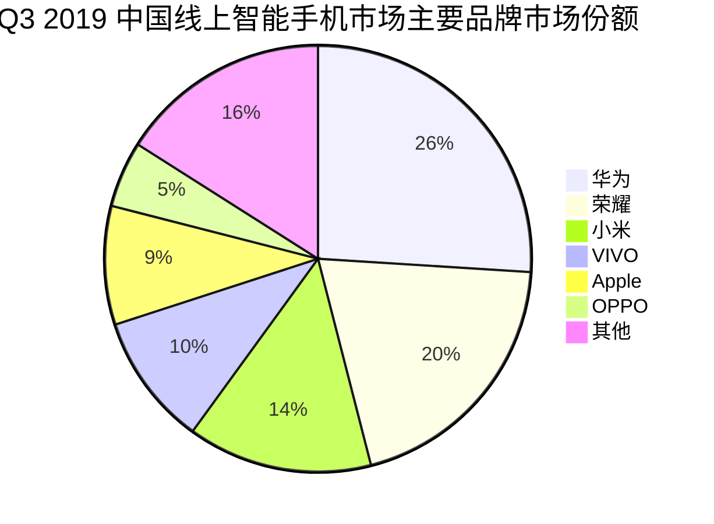

###### 以上「饼图」的画图脚本示例

```


## 实体关系图

###### 实体关系图（也称为：ER图）

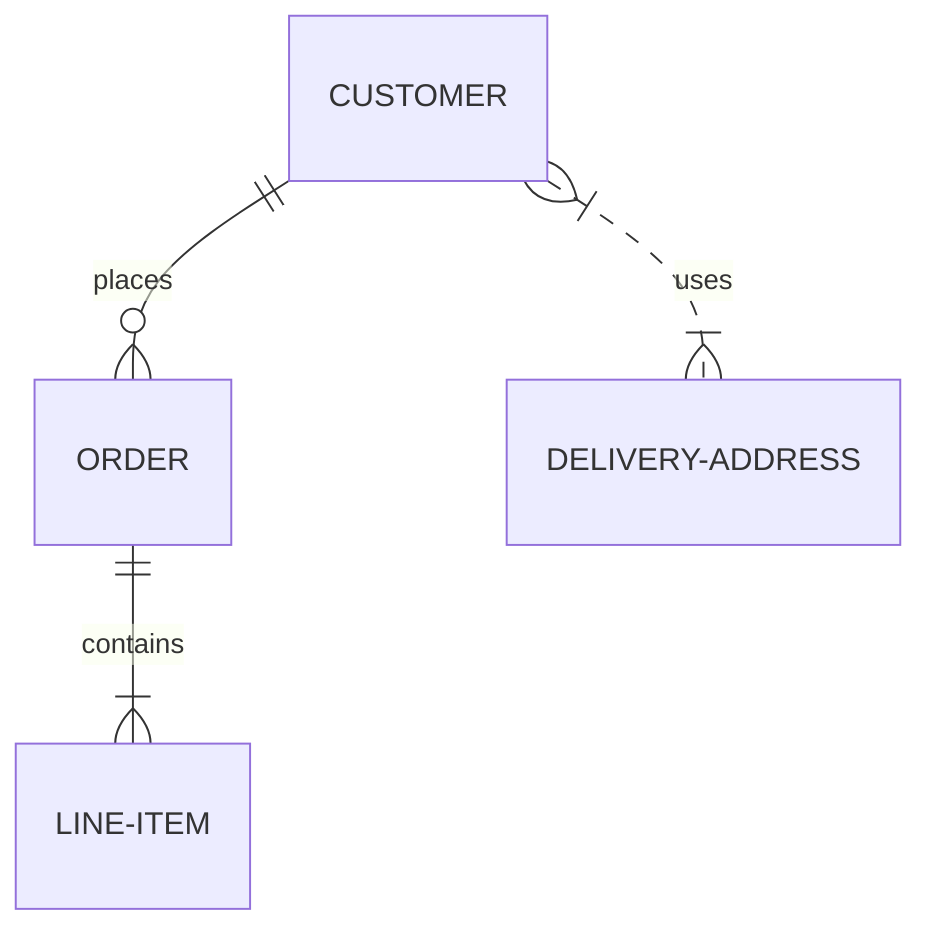

## 客户旅程地图

###### 客户旅程地图（也称：用户体验地图）

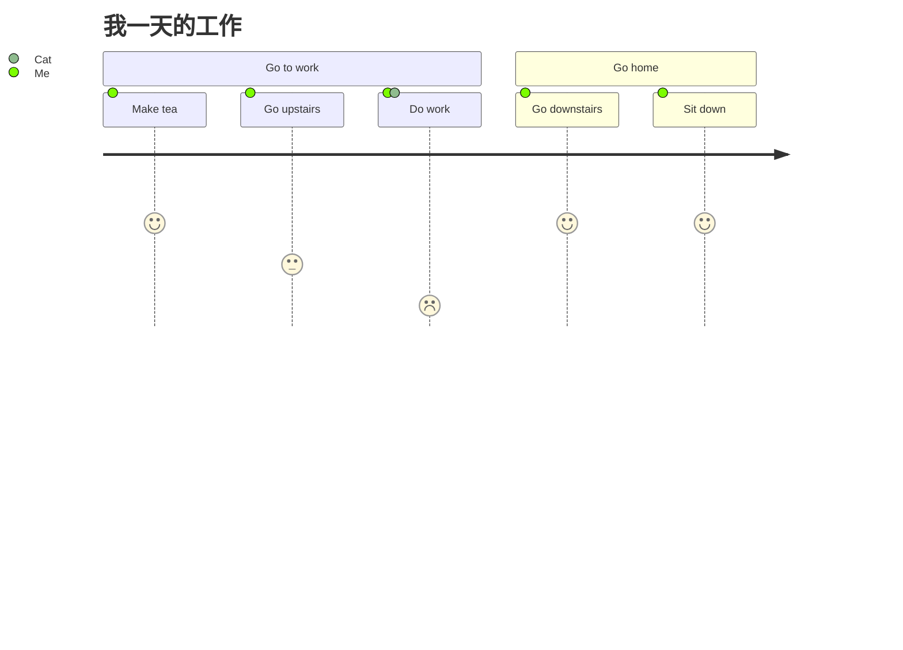

# 备选方案

`#注意#`**（从 VLOOK 9.2 版本开始不再支持备选方案）**

## flowchart.js (流程图)

flowchart.js 基于 SVG 的流程图插件，它仅需几行代码即可在 Web 上完成流程图的构建。可以从文字表述中画出简单的 SVG 流程图，也可以画出彩色的图表。详见 [flowchart.js 官网](http://flowchart.js.org)。

## JS Sequence Diagrams (顺序图)

JS sequence diagrams 是一个方便建立 UML 的顺序图（序列图 or 循序图）在线工具，使用简单。详见 [JS Sequence Diagrams 官网](https://bramp.github.io/js-sequence-diagrams/)。

######The End 