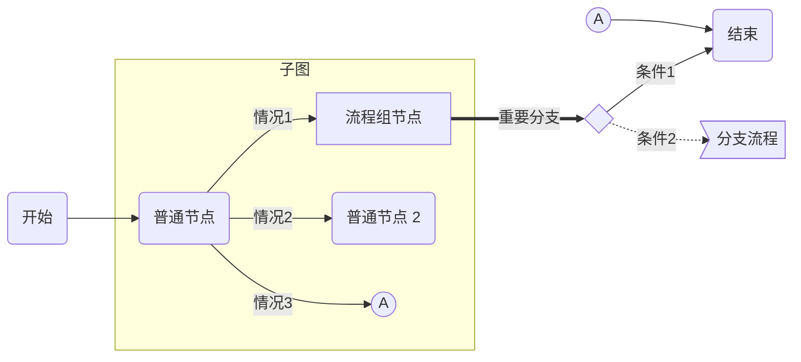
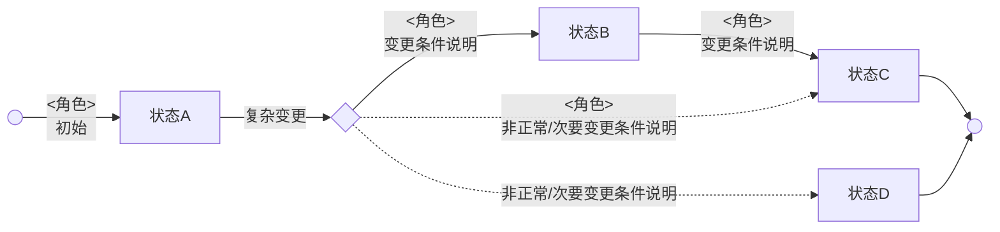
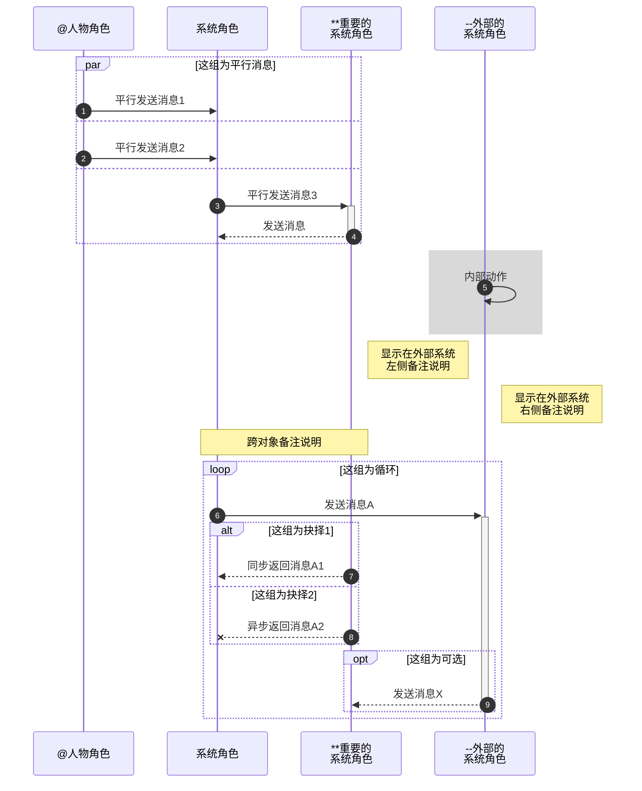

###### <sub>VLOOK™</sub><br />让你的 Markdown 有了新`{看}(wán)`法<br />──<br /><sup>快速参考手册</sup><br />`#最新版本|V11.0#(theme2)`<br /><br />**MAX°孟兆**<br />*COPYRIGHT © 2016-2021. MAX°DESIGN.*

[TOC]

# 打赏

**若喜欢 VLOOK™ 的话，可以贡献一杯咖啡 :-)**


# 快速入坑

VLOOK™ 通过持续**挖掘和扩展** Markdown 和 CSS，同时结合了文档的互联网化应用场景～

在 **文档排版**、**内容导航**、**演示辅助**、**交互体验** 等方面提供了 **一致**、**简洁**、**友好** 的体验。

## 快速入坑°文档排版

> ######  ° 文档排版
>
> ------
>
> **有了 VLOOK™ 主题及插件的支持，让你对 Markdown 编辑器（暂只支持 Typora）的自动化排版能力有了全新的理解。**
>
> 得益于成熟的 Web 浏览器、HTML / CSS、JavaScript 技术，让静态的文档也能与你一起「动」起来。
>
> `>(blue)`

![VLOOK™ 的「文档排版」特性]

| 分类与适用场景                                               |  ==  | ==                                                           |
| ------------------------------------------------------------ | :--: | :----------------------------------------------------------- |
| **表格**                                                     |      | **图片、图标、插图**                                         |
| - 横向、纵向**合并**指定单元格 […](#表格单元格合并)          |  :   | - 为插图进行自动编号、**添加题注** […](#插图自动编号与题注)  |
| - 将**整列**设置为加粗、高亮、下划线、斜体格式 […](#表格列格式：常规) |  :   | - 指定插图的**对齐方式** […](#插图对齐方式)                  |
| - 将整列设置为**数值**、**百分比**、**货币格式** […](#表格列格式：数值、百分数、货币) |  :   | - 让图片在高分屏下自动适配显示**高清**的版本（2x、3x） […](#图片适配高分屏) |
| - 将整列设置为**复选框**格式，并能指定某单元格为「选中」 […](#表格列格式：复选框) |  :   | - 让图片自动适配 **Dark Mode**  […](#图片适配 Dark Mode)     |
| - 给每个表格进行自动编号、**添加题注** […](#表格自动编号与题注) |  :   | - 添加的**小图标**、普通图片，不想以插图的形式显示 […](#图片显示版式) |
| - 给表格的**每一行**都进行**自动编号** […](#表格逐行自动编号) |  :   | - **一行多图**自动换行后样式**适配** […](#一行多图适配)      |
| - 对同属一类内容的**表格行**进行分组、分类，并能**自动折叠** […](#表格行分组折叠) |  :   | - 让图标的颜色与周围的元素更搭更和谐 […](#图片颜色替换)      |
| - 指定表格可**重复显示表头** […](#表格重复显示表头)          |  :   | - 为图片添加工程风的网格背景 […](#图片网格背景)              |
| - 在表格中指示当前行 […](#表格当前行指标器)                  |  :   | - 图片边缘能**留白** […](#图片边缘留白)                      |
|                                                              |  ==  | ==                                                           |
| **标签、标签组**                                             |      | **流程图、状态机图、顺序图**                                 |
| - 将特定关键字设置为**标签**样式 […](#彩虹标签)              |  :   | - **扩展** Mermaid 的**图表**，并优化了**样式** […](#°Mermaid) |
| - 将特定的**二元组**内容设置为**标签组**样式 […](#药丸标签)  |  :   |                                                              |
|                                                              |  ==  | ==                                                           |
| **音频、视频、注音**                                         |      | **引用、引用块**                                             |
| - 为文档添加音频内容 […](#°音频)                             |  :   | - **重要**的引用指定使用**突出**的样式（如：重要提示） […](#彩虹引用) |
| - 为文档添加视频内容 […](#°视频)                             |  :   | - **分栏**（双栏 / 三栏 / 四栏）方式显示引用块 […](#分栏引用) |
| - 要给生`{僻}(pì)`字，或东亚小语种**添加注音** […](#°注音)   |  :   | - **引用**的内容支持**自定义折叠** […](#折叠吧引用)          |
|                                                              |  ==  | ==                                                           |
| **代码块**                                                   |      | **任务列表**                                                 |
| - 给每个代码块进行自动编号、**添加题注** […](#代码块自动编号与题注) |  :   | - 任务列表的序号，给你找回来了 […](#任务列表自动编号)        |
| - 代码块高亮当前行、一键复制代码 […](#代码块增强)            |  :   | - 对于多级任务列表，「**任务组完成状态**」能自动识别了 […](#任务组完成状态) |

## 快速入坑°内容导航

> ######  ° 内容导航
>
> ------
>
> **VLOOK™ 提供了对文档章节、插图、表格、多媒体提供了多种形式的导航、快速定位和内容组织的工具，全面改善和提高发布的 HTML 文件的浏览体验和效率。**
>
> 敬请你根据需要和喜好随时、轻松享用～
>
> `>(cyan)`

![VLOOK™ 的「内容导航」工具及适用场景]

| **内容导航工具** | 适用场景                                                     |
| :--------------: | ------------------------------------------------------------ |
|     导航中心     | 适用于按目录、分类内容索引（目录/插图/表格/多媒体/代码块）进行**全文档**跨章节的快速定位 […](#导航中心) |
|     逐章导航     | 适用于前后章节相关度高，**按章节**顺序一章一章进行浏览 […](#逐章导航) |
|     逐段导航     | 适用于文档评审或演示，**按段落**一段一段进行聚焦式浏览 […](#段落导航) |
|     插图导航     | 适用于**按图索骥**，快速浏览文档中的插图，以及快速**定位**到文档中对应的位置 […](#插图导航) |
|     文库导航     | 适用于将相关话题、内容的文档简介、链接，通过一个独立页面进行快速浏览和跳转 […](#文库导航) |
|     脚注导航     | 直接在当面位置进行显示脚注，避免来回跳转 […](#脚注导航)      |

## 快速入坑°演示与出版辅助

> ######  ° 演示与出版辅助
>
> ------
>
> **VLOOK™ 独创性地为 Markdown 导出的 HTML 提供了强大的演示与出版辅助工具，让 Typora + VLOOK 成为更具生产力的 Markdown 文档解决方案。**
>
> 非常适合现场和远程的演示辅助工具，敬请为你的 Markdown 开启 Turbo 模式～
>
> `>(orange)`

![VLOOK™ 的「演示辅助」工具及适用场景]

| **演示辅助工具** | 适用场景                                                     |
| :--------------: | ------------------------------------------------------------ |
|      聚光灯      | 对屏幕内容的局部进行视觉**聚焦** […](#聚光灯)                |
|      激光笔      | 对文档内容进行**精确指向** […](#激光笔)                      |
|   表格阅读模式   | 针对表格内容，特别是行、列关联性强的**表格**，快速识别**纵横关联**的单元格序列 […](#表格阅读模式) |
|      画中画      | 插图/表格/代码块 一键开启「画中画」浮动显示，方便在文档相关内容间对比 […](#画中画) |
|      刮刮卡      | - 制作培训、猜迷互动类文档时，希望将预置的**答案隐藏**起来 […](#刮刮卡) |

![VLOOK™ 的「出版辅助」工具及适用场景]

| **出版辅助工具** | 适用场景                                                     |
| :--------------: | ------------------------------------------------------------ |
| 章节标题自动编号 | 对文档内的章节标题进行**自动分级编号** […](#章节标题自动编号) |
| 自定义欢迎页内容 | 对文档在加载过程中显示欢迎语内容 […](#自定义欢迎页内容)      |
|   文档内容检查   | 对文档的**图片、音频、视频、页内链接**等内容进行检查并提示 […](#内容失效检查) |
|  链接识别与优化  | **自动识别**并提示文档内的**链接**类型，并针对外链进行了**优化** […](#链接识别与优化) |
|   适配打印输出   | 在打印前将文档的样式调整和简化，以**适配打印**输出的应用需要 […](#适配打印输出) |

## 快速入坑°主题与不杂项

> ######  ° 主题与不杂项
>
> ------
>
> 「**人类从来都是视觉动物，自己或他人在阅读时，让眼睛感受愉悦和美好，是一种美德、一种力量、一种信仰。**」
>
> 　　　———— MAX°孟兆
>
> `>(green)`

![VLOOK™ 的「主题与不杂项」特性]

| VLOOK™ 的「用户体验」特性                         | ==   | ==                                                           |
| ------------------------------------------------- | ---- | ------------------------------------------------------------ |
| **模板主题、字体主题**                            |      | **不杂项**                                                   |
| 为不同类型的文档设置不同的模板主题 […](#模板主题) | :    | 通过启动参数，自定义你的文档表现 […](#启动参数)              |
| 为文档选择不同的字体主题 […](#字体主题)           | :    | 长内容会自动折叠了，长插图、长表格、长代码 […](#长内容自动折叠) |
| Dark Mode is NOW […](#Dark Mode)                  | :    | 支持快捷键操作 […](#快捷键操作汇总)                          |
| 为文档添加封面、封底 […](#封面、封底)             | :    | 支持跨平台、国际化、动效（如：毛玻璃） […](#跨平台、动效支持) |
| 更美观的公式 […](#更美观的公式)                   | :    |                                                              |

# °文档排版

## °表格

### 表格单元格合并

「**Markdown 粉呼声最高的是什么？———— 表格单元格合并！**」

`#VLOOK|say#(theme1)` 现在可以轻松让你实现 —— **Wow! Wow!**～Markdown 粉们的欢呼声！！！

> ######  跨列合并（横向合并）
>
> 在要==被合并==的单元格内输入列合并标识 `==` 或 `<<`，该单元格将会与==左侧相邻==的单元格进行合并，以此类推。
>
> `>(theme1)`

> ######  跨行合并（纵向合并）
>
> 在要==被合并==的单元格内输入行合并标识 `:` 或 `^^`，该单元格将会与==上方相邻==的单元格进行合并，以此类推。
>
> `>(theme2)`

###### 示例 1－普通单元格的横向合并、纵向合并

| **列 A**             | 列 B                 | 列 C                 | ==列== D   | 列 E       | 列 F       | 列 G                 |
| -------------------- | -------------------- | -------------------- | ---------- | ---------- | ---------- | -------------------- |
| 纵向合并`#×3#(gray)` | 普通单元格           | 普通单元格           | 普通单元格 | 普通单元格 | 普通单元格 | 纵向合并`#×5#(gray)` |
| :                    | 纵向合并`#×2#(gray)` | 横向合并`#×4#(gray)` | ==         | ==         | ==         | :                    |
| :                    | :                    | 普通单元格           | 普通单元格 | 普通单元格 | 普通单元格 | :                    |
| 普通单元格           | 纵向并`#×3#(gray)`   | 普通单元格           | 普通单元格 | 普通单元格 | 普通单元格 | :                    |
| 普通单元格           | :                    | 普通单元格           | 普通单元格 | 普通单元格 | 普通单元格 | :                    |
| 普通单元格           | :                    | 普通单元格           | 普通单元格 | 普通单元格 | 普通单元格 | :                    |

###### 示例 2－表头纵向、横向合并

| 列 A 纵向合并`#×2#(gray)` | 列 B 横向合并`#×2#(gray)` | ==         | 列 D 纵向合并`#×3#(gray)` | 列 E 横向合并`#×3#(gray)` | <<         | <<         |
| ------------------------- | ------------------------- | ---------- | :-----------------------: | ------------------------- | ---------- | ---------- |
| :                         | 二级列头                  | 二级列头   |            ^^             | 这是二级列头<br />E1.1    | 二级列头   | 二级列头   |
| 普通单元格                | 普通单元格                | 普通单元格 |        普通单元格         | 普通单元格                | 普通单元格 | 普通单元格 |
| 普通单元格                | 普通单元格                | 普通单元格 |        普通单元格         | 普通单元格                | 普通单元格 | 普通单元格 |

###### 示例 3－表头纵向、横向合并

| 列 A 纵向合并`#×3#(gray)` | 列 B 横向合并`#×4#(gray)` | ==           |      ==      | ==           | 列 F 纵向合并`#×3#(gray)` | 列 G 纵向合并`#×3#(gray)` |
| ------------------------- | ------------------------- | ------------ | :----------: | ------------ | ------------------------- | ------------------------- |
| :                         | 二级列头 B1               | ==           | 二级列头 B2  | ==           | :                         | :                         |
| ^^                        | 二级列头 B11              | 三级列头 B12 | 三级列头 B21 | 三级列头 B21 | :                         | :                         |
| 普通单元格                | 普通单元格                | 普通单元格   |  普通单元格  | 普通单元格   | 普通单元格                | 普通单元格                |
| 普通单元格                | 普通单元格                | 普通单元格   |  普通单元格  | 普通单元格   | 普通单元格                | 普通单元格                |

---

如果你对以上内容有更多需求或建议，欢迎随时反馈～ [](https://qm.qq.com/cgi-bin/qm/qr?k=oB8wpFG_4SEMf1CL9qVy-jMw0CMfSwff&jump_from=webapi&lnkcss=none)

[<kbd> 我要回到 快速入坑°文档排版</kbd>](#快速入坑°文档排版)

### 表格列格式：常规

「**Markdown 表格如何快速设置整列的格式（加粗、高亮、下划线、斜体、删除线）？**」

`#VLOOK|say#(theme1)` SO EASY～ 只须在表头按以标准的 Markdown 或 GFM 的格式设置语法设置对应的格式即可实现这样的格式化。

> 温故一下标准 Markdown 或 GFM 的格式语法：
>
> `**加粗**`、`*斜体*`、`~~删除线~~`、`==高亮==` 、`<u>下划线</u>`

###### 示例 1－表格列格式：常规化

|      **加粗**      | *斜体*            | <u>下划线</u>     | ==高亮==               | ~~删除线~~             |
| :----------------: | ----------------- | ----------------- | ---------------------- | ---------------------- |
| 单元格（横向合并） | ==                | 单元格 afgiklo 10 | 单元格                 | 单元格`#标签组|标签#`  |
|       单元格       | 单元格 afgiklo 10 | 单元格 afgiklo 10 | 单元格内有**加粗**内容 | 单元格内容             |
|       单元格       | 单元格 afgiklo 10 | 单元格 afgiklo 10 | 单元格内容             | 单元格有`行内代码`内容 |

###### 示例 2－表格列格式：常规化（格式嵌套）

| **普通列** | 嵌套的常规格式          | ==                              | ==                     | ==                     |
| :--------: | :---------------------- | ------------------------------- | ---------------------- | ---------------------- |
|     :      | ==<u>高亮＋下划线</u>== | ***<u>加粗＋斜体＋下划线</u>*** | ==**加粗＋高亮**==     | ~~**删除线+加粗列**~~  |
|     A      | 单元格 afgiklo 10       | 单元格 afgiklo 10               | 单元格                 | 单元格`#标签组|标签#`  |
|     B      | 单元格 afgiklo 10       | 单元格 afgiklo 10               | 单元格内有**加粗**内容 | 单元格内有内容         |
|     C      | 单元格 afgiklo 10       | 单元格 afgiklo 10               | 单元格内容             | 单元格有`行内代码`内容 |

---

如果你对以上内容有更多需求或建议，欢迎随时反馈～ [](https://qm.qq.com/cgi-bin/qm/qr?k=oB8wpFG_4SEMf1CL9qVy-jMw0CMfSwff&jump_from=webapi&lnkcss=none)

[<kbd> 我要回到 快速入坑°文档排版</kbd>](#快速入坑°文档排版)

### 表格列格式：数值、百分数、货币

「**除常规的格式外，还有更高级的格式要求？数字、百分数、货币……一个都不能少！**」

`#VLOOK|say#(theme1)` 可以支持对「数值类」内容进行整列的自动格式设置了！方式依然的很优雅，很 VLOOK！

> 将表格列的对齐设置为「**右对齐**」，即可自动识别不同的数值内容进行自动进行格式化！

> ###### 「普通数值」自动格式化
>
> - 添加千位符，并以更小字号显示小数部分
> - 通过在数字前增加「正号 `+`」或「负号 `-`」，会通过不同的颜色突出显示
>
> `>(red)`

###### 示例－普通数字

| 原始内容    |  数值情况  |    ==    |    ==    |     ==     |      |      数值列 |
| ----------- | :--------: | :------: | :------: | :--------: | ---- | ----------: |
| :           | [ ] 含小数 | [ ] 正数 | [ ] 负数 | [ ] 超三位 | :    |           : |
| 123         |            |          |          |            |      |         123 |
| -12345      |            |          |   [x]    |    [x]     | :    |      -12345 |
| +5678.00    |    [x]     |   [x]    |          |    [x]     | :    |    +5678.00 |
| -2345678.00 |    [x]     |          |   [x]    |    [x]     | :    | -2345678.00 |

> [+] 表格列头说明
>
> > **原始内容**：被 VLOOK™ 自动格式化前的样式
> >
> > **数值列**：被 VLOOK™ 自动格式化后的样式

> ###### 「百分数」自动格式化
>
> - 自动继承「普通数字」的格式
> - 以更小字号和视觉弱化来显示百分号 `%`，并以进度条比例显示对应的百分数值
>
> `>(blue)`

###### 示例－百分数

| 原始内容 |  数值情况  |    ==    |    ==    |     ==     |      |  数值列 |
| -------- | :--------: | :------: | :------: | :--------: | ---- | ------: |
| :        | [ ] 含小数 | [ ] 正数 | [ ] 负数 | [ ] 超三位 | :    |       : |
| 79%      |            |          |          |            |      |     79% |
| 88.88%   |    [x]     |          |          |            | :    |  88.88% |
| +38%     |            |   [x]    |          |            | :    |    +38% |
| -57.30%  |    [x]     |          |   [x]    |            | :    | -57.30% |
| 100%     |            |          |          |            | :    |    100% |

> ###### 「货币」自动格式
>
> - 自动继承「普通数字」的格式
> - 对货币符号（如：`¥` `$`），或货币简写（如：`CNY` `USD` `HKD`等）进行左侧对齐和视觉弱化
>
> `#注意#(red)` 货币符号，或货币简写与金额数值之间须以空格分隔
>
> `>(brown)`

###### 示例－货币

| **币种** | 原始内容      |  数值情况  |    ==    |    ==    |     ==     |      |    **数值列** |
| :------: | ------------- | :--------: | :------: | :------: | :--------: | ---- | ------------: |
|    :     | :             | [ ] 含小数 | [ ] 正数 | [ ] 负数 | [ ] 超三位 | :    |             : |
|  人民币  | ￥ +123456.99 |    [x]     |   [x]    |          |    [x]     |      | ￥ +123456.99 |
|    :     | CNY 987654.99 |    [x]     |          |   [x]    |    [x]     | :    | CNY 987654.99 |
|          | ==            |     ==     |    ==    |    ==    |     ==     | ==   |            == |
|   港元   | HK$ 3456.78 ||||||HK$ 3456.78|
|    :     | HKD 3456.78   |    [x]     |          |          |    [x]     | :    |   HKD 3456.78 |
|          | ==            |     ==     |    ==    |    ==    |     ==     | ==   |            == |
|   美元   | $ +555.38 ||||||$ +555.38|
|    :     | USD 555       |            |          |          |            | :    |       USD 555 |
|          | ==            |     ==     |    ==    |    ==    |     ==     | ==   |            == |
|   澳元   | AU$ 56789 ||||||AU$ 56789|
|    :     | AUD -56789    |            |          |   [x]    |    [x]     | :    |    AUD -56789 |

---

如果你对以上内容有更多需求或建议，欢迎随时反馈～ [](https://qm.qq.com/cgi-bin/qm/qr?k=oB8wpFG_4SEMf1CL9qVy-jMw0CMfSwff&jump_from=webapi&lnkcss=none)

[<kbd> 我要回到 快速入坑°文档排版</kbd>](#快速入坑°文档排版)

### 表格列格式：复选框

「**表格的列格式，除了排版格式外，如果希望能支持复选框（勾选框）呢？**」

`#VLOOK|say#(theme1)` 虽然要求有点高了，但也可以实现，将整列自动设置为「复选框」格式了！

> 表格列头内容前，添加 `[(空格)](空格)`（如 `[ ] 必填项` ），就可以为该列自动设置为 `未选择` 的状态。
>
> 
>
> 若要独立指定某单元格的复选框选择状态，可以这样：
>
> - 单元格的内容以 `[x]` 开头，则会自动设置为 `已选择` 状态；
> - 单元格的内容以 `[-]` 开头，则会自动设置为 `不确定选择` 状态。

###### 示例－「复选框」列格式

| **复选框样式** |     [ ] 复选框列     | 说明                     |
| :------------: | :------------------: | ------------------------ |
|      留空      |                      | 默认为`未选择`的状态     |
|     已选择     |         [x]          | 指定为`已选择`的状态     |
|   不确定选择   | [-]<br />当值 ≥ 0 时 | 指定为`不确定选择`的状态 |

---

如果你对以上内容有更多需求或建议，欢迎随时反馈～ [](https://qm.qq.com/cgi-bin/qm/qr?k=oB8wpFG_4SEMf1CL9qVy-jMw0CMfSwff&jump_from=webapi&lnkcss=none)

[<kbd> 我要回到 快速入坑°文档排版</kbd>](#快速入坑°文档排版)

### 表格自动编号与题注

「**文档中的表格很多，怎么才能像 Word 那样添加编号和题注呢？**」

`#VLOOK|say#(theme1)` 无须任何设置，即可自动对文档内所有「表格」进行统一的自动编号，编号内容举例：`表 1` `表 2`

> ###### 单题注
>
> 若希望为表格在自动编号之后，添加指定的题注，如：`表 1. 2020 年全球经济体 GDP 排名`
>
> - 在表格前添加 `1～6 级` 任间一级标题（快捷键<kbd>Ctrl</kbd>+<kbd>1～6</kbd>，或<kbd>Command</kbd>+<kbd>1～6</kbd>）
> - 输入期望作为题注的内容
>
> > 若没有指定题注，VLOOK™ 会自动以表格文字内容（头尾片断）作为题注
>
> `>(theme1)`

###### 示例－单题注

| 列 A       | 列 B       | 列 C       | 列 D       | 列 E       |
| ---------- | ---------- | ---------- | ---------- | ---------- |
| 单元格内容 | 单元格内容 | 单元格内容 | 单元格内容 | 单元格内容 |

> ###### 双题注
>
> VLOOK™ 通过模仿 Markdown 添加图片的语法，实现对双题注的支持。
>
> - 语法：`![默认题注]"第2题注"`，其中的「第 2 题注」内容为可选
> - 该内容可为一个 `6 级标题`，也可以为单独一行文本
>
> `#注意#(red)` 题注内容发布后会被隐藏，若要保留原始 6 级标题内容，可另起一行进行题注的编写
>
> `>(theme2)`

###### ![示例－双题注]"这是表格的第二题注"

| 列 A       | 列 B       | 列 C       | 列 D       | 列 E       |
| ---------- | ---------- | ---------- | ---------- | ---------- |
| 单元格内容 | 单元格内容 | 单元格内容 | 单元格内容 | 单元格内容 |
| 单元格内容 | 单元格内容 | 单元格内容 | 单元格内容 | 单元格内容 |

---

如果你对以上内容有更多需求或建议，欢迎随时反馈～ [](https://qm.qq.com/cgi-bin/qm/qr?k=oB8wpFG_4SEMf1CL9qVy-jMw0CMfSwff&jump_from=webapi&lnkcss=none)

[<kbd> 我要回到 快速入坑°文档排版</kbd>](#快速入坑°文档排版)

### 表格逐行自动编号

「**表格有很多行，能像 Excel 一样有行号的话，那就更方便沟通和定位了……**」

`#VLOOK|say#(theme1)` 可以一键实现对表格逐行进行自动编号！

> 通过以下两种试，都可以为表格的每一行进行自动编号：
>
> 1. 表格前添加一个 `6 级` 的标题（快捷键<kbd>Ctrl</kbd>+<kbd>6</kbd>，或<kbd>Command</kbd>+<kbd>6</kbd>）
> 2. 在有序、无序列表下缩进的表格

###### 示例 1－表格前添加 6 级标题

###### 示例 1－表格前添加 6 级标题

| 列 A             | 列 B             |        列 C        |             列 D |
| ---------------- | ---------------- | :----------------: | ---------------: |
| 第一行           | 左对齐（长内容） |      居中对齐      | 右对齐（长内容） |
| 第二行（长内容） | 左对齐           | 居中对齐（长内容） |           右对齐 |

- **示例 2－在有序、无序列表下的缩进表格**

  ![示例 2－在有序、无序列表下的缩进表格]
  
  | 列 A             | 列 B             |        列 C        |             列 D |
  | ---------------- | ---------------- | :----------------: | ---------------: |
  | 第一行           | 左对齐（长内容） |      居中对齐      | 右对齐（长内容） |
  | 第二行（长内容） | 左对齐           | 居中对齐（长内容） |           右对齐 |

---

如果你对以上内容有更多需求或建议，欢迎随时反馈～ [](https://qm.qq.com/cgi-bin/qm/qr?k=oB8wpFG_4SEMf1CL9qVy-jMw0CMfSwff&jump_from=webapi&lnkcss=none)

[<kbd> 我要回到 快速入坑°文档排版</kbd>](#快速入坑°文档排版)

### 表格行分组折叠

「**表格行都是一维的数据，但如果表格的数据有层次关系怎么办？**」

`#VLOOK|say#(theme1)` 可以对文档（如 PRD、API 类文档）在同一个表格内，会对属于同一类或同一级的多行进行分组和折叠。

> 对于作为下级的行，在表格行的首列通过以下规则即可实现自动分组和折叠：
>
> - 使用 Markdown 的引用的语法 `>(空格)`，即可表示该行缩进一级，其前一行即为上一级的分组
> - 多个 `>` 表示缩进多级，如三级缩进 `>>>(空格)`
>
> `#注意#` 该单元格的内容不能独立设置部分内容的格式，如：部分文字加粗、高亮、换行等

###### 写法如下第 2 列所示

| 分组分级     | 写法举例         |
| ------------ | ---------------- |
| 一级缩进     | > 这是一级缩进   |
| 二级缩进     | >> 这是二级缩进  |
| 三级缩进     | >>> 这是三级缩进 |
| （以此类推） | <<               |

###### 示例 1－表格行分组折叠

| 列 A                                      | [ ] 勾选列 | 列 B             | 列 C             |
| ----------------------------------------- | :--------: | ---------------- | ---------------- |
| 普通行                                    |            |                  |                  |
| 分组 1                                    |    [-]     |                  |                  |
| > 这是属于分组 1 的内容 1.1               |    [x]     | 该行是被折叠的行 | 该行是被折叠的行 |
| > 这是属于分组 1 的内容 1.2               |            | 该行是被折叠的行 | 该行是被折叠的行 |
| 间隔了普通行                              |            |                  |                  |
| **==带格式的分组 2==**                    |    [-]     |                  |                  |
| > 这是属于**分组 2** 的内容 2.1           |    [x]     | 该行为被折叠的行 | 该行是被折叠的行 |
| > 这是属于**分组 2** 的内容 2.2           |            | 该行为被折叠的行 | 该行是被折叠的行 |
| > 这是属于**分组 2** 的内容 2.3           |    [-]     | 该行为被折叠的行 | 该行是被折叠的行 |
| >> 这是属于二级分组 2.3 的内容 2.3.1      |    [x]     | 该行为被折叠的行 | 该行是被折叠的行 |
| >> 这是属于二级分组 2.3 的内容 2.3.2      |     ==     | ==               | ==               |
| >>> 这是属于三级分组 2.3.2 的内容 2.3.2.1 |    [x]     | 该行为被折叠的行 | 该行是被折叠的行 |
| > 这是属于分组 2 的内容 2.4               |            | 该行为被折叠的行 | 该行是被折叠的行 |
| 普通行                                    |            |                  |                  |
| 空白内容的分组 3                          |            |                  |                  |
| >&nbsp;　&nbsp;                           |            | 数据项 1         | 数据项 A         |
| >&nbsp;　&nbsp;                           |            | 数据项 2         | 数据项 B         |
| >&nbsp;　&nbsp;                           |            | 数据项 3         | 数据项 C         |

###### 示例 2－表格行分组折叠

| 列 A                                          | [ ] 勾选列 | 列 B             |
| --------------------------------------------- | :--------: | ---------------- |
| 普通行                                        |            |                  |
| 分组 1                                        |    [-]     |                  |
| > 这是属于分组 1 的内容 1.1                   |    [x]     | 该行是被折叠的行 |
| > 这是属于分组 1 的内容 1.2                   |            | 该行是被折叠的行 |
| 连续分组                                      |    [-]     |                  |
| > 这是属于**连续分组**的内容 2.1              |    [x]     | 该行为被折叠的行 |
| > 这是属于连续分组的内容 2.2                  |            | 该行为被折叠的行 |
| > 这是属于**==连续分组==**的内容 2.3          |    [-]     | 该行为被折叠的行 |
| >> 这是属于二级**分组 2.3** 的内容 2.3.1      |            | 该行为被折叠的行 |
| >> 这是属于二级**分组 2.3** 的内容 2.3.2      |    [-]     |                  |
| >>> 这是属于三级**分组 2.3.2** 的内容 2.3.2.1 |    [x]     | 该行为被折叠的行 |
| >>> 这是属于三级分组 2.3.2 的内容 2.3.2.2     |            | 该行为被折叠的行 |
| >>> 这是属于三级分组 2.3.2 的内容 2.3.2.3     |            | 该行为被折叠的行 |
| >>> 这是属于三级分组 2.3.2 的内容 **2.3.2.4** |    [x]     | 该行为被折叠的行 |
| >>>> 这是属于分组 **2.3.2.4** 的内容 2.3.4.1  |    [x]     | 该行为被折叠的行 |
| >>> 这是属于三级分组 2.3.2 的内容 2.3.2.5     |            | 该行为被折叠的行 |
| > 这是属于分组 2 的内容 2.4                   |            | 该行为被折叠的行 |
| > 这是属于分组 2 的内容 2.5                   |            | 该行为被折叠的行 |
| > 这是属于分组 2 的内容 2.6                   |    [x]     | 该行为被折叠的行 |
| > 这是属于分组 2 的内容 2.7                   |            | 该行为被折叠的行 |
| > 这是属于分组 2 的内容 2.8                   |            | 该行为被折叠的行 |
| > 这是属于分组 2 的内容 2.9                   |            | 该行为被折叠的行 |
| > 这是属于分组 2 的内容 2.10                  |            | 该行为被折叠的行 |
| > 这是属于分组 2 的内容 2.11                  |            | 该行为被折叠的行 |
| 普通行                                        |    [x]     | 单元格内容       |

---

如果你对以上内容有更多需求或建议，欢迎随时反馈～ [](https://qm.qq.com/cgi-bin/qm/qr?k=oB8wpFG_4SEMf1CL9qVy-jMw0CMfSwff&jump_from=webapi&lnkcss=none)

[<kbd> 我要回到 快速入坑°文档排版</kbd>](#快速入坑°文档排版)

### 表格重复显示表头

「**表格太长了，看着看着都分不清哪列是哪列了，希望能在设置重复显示表头，该怎么办？**」

`#VLOOK|say#(theme1)` 这可算是表格中的高阶应用了，现在 VLOOK™ 也可以轻松实现了～

> 只需要在表头第一个单元格内容的末尾输入表头重复标识 `(空格)##`，则该表格的表头就会自动根据预置的规则进行重复显示。
>
> 
>
> **预置规则：**
>
> - 对于没有[行分组](#表格行分组折叠)的表格，自动以「表格页」为单位进行重复显示（每表格页为 15 行）
> - 对于带[行分组](#表格行分组折叠)的表格，默认在行分组展开后在分组行上显示对应的列头（前提是对应的单元格无内容），收起后则自动隐藏
>
> `#注意#`
>
> 1. 重复表头会根据表头行数、表体行数情况进行自动适配；
> 2. 若每「表格页」尾行刚才好有跨行合并的单元格，或为表格的最后一行，会延伸到没有合并单元格的行时才显示，或跳过不显示。

![示例 1－按分组重复表头]

| 列 A ##    | 列 B               | ==                 | ==                 | 列 C       |
| ---------- | ------------------ | ------------------ | ------------------ | ---------- |
| :          | 列 B.1             | 列 B.2             | 列 B.3             | :          |
| 分组 1     |                    |                    |                    |            |
| >  1.1     | 【列 2.1】的内容 1 | 【列 2.2】的内容 2 | 【列 2.3】的内容 3 | 普通单元格 |
| >  1.2     | 【列 2.1】的内容 2 | 【列 2.2】的内容 2 | 【列 2.3】的内容 3 | 普通单元格 |
| 分组 2     |                    |                    |                    |            |
| >  2.1     | 【列 2.1】的内容 1 | 【列 2.2】的内容 2 | 【列 2.3】的内容 3 | 普通单元格 |
| 普通单元格 | 普通单元格         | 普通单元格         | 普通单元格         | 普通单元格 |

###### 示例 2－按页重复表头（单行表头）

| 列 A ##   | 列 B   | 列 C      | ==        | 列 D     |
| --------- | ------ | --------- | --------- | -------- |
| 单元格 1  | 单元格 | 单元格 C1 | 单元格 C2 | 单元格 D |
| 单元格 2  | 单元格 | 单元格 C1 | 单元格 C2 | 单元格 D |
| 单元格 3  | 单元格 | 单元格 C1 | 单元格 C2 |          |
| 单元格 4  | 单元格 | 单元格 C1 | 单元格 C2 |          |
| 单元格 5  | 单元格 | 单元格 C1 | 单元格 C2 |          |
| 单元格 6  | 单元格 | 单元格 C1 | 单元格 C2 |          |
| 单元格 7  | 单元格 | 单元格 C1 | 单元格 C2 |          |
| 单元格 8  | 单元格 | 单元格 C1 | 单元格 C2 |          |
| 单元格 9  | 单元格 | 单元格 C1 | 单元格 C2 |          |
| 单元格 10 | 单元格 | 单元格 C1 | 单元格 C2 |          |
| 单元格 11 | :      | 单元格 C1 | 单元格 C2 |          |
| 单元格 12 | :      | 单元格 C1 | 单元格 C2 |          |
| 单元格 13 | :      | 单元格 C1 | 单元格 C2 |          |
| 单元格 14 | 单元格 | 单元格 C1 | 单元格 C2 | 单元格 D |
| 单元格 15 | 单元格 | 单元格 C1 | 单元格 C2 | :        |
| 单元格 16 | 单元格 | 单元格 C1 | 单元格 C2 | :        |
| 单元格 17 | 单元格 | 单元格 C1 | 单元格 C2 | :        |
| 单元格 18 | 单元格 | 单元格 C1 | 单元格 C2 |          |

###### 示例 3－按页重复表头（多行表头）

| 列 A ##   | 列 B   | 列 C      | ==        | 列 D     |
| --------- | ------ | --------- | --------- | -------- |
| :         | :      | 列 C.1    | 列 C.2    | :        |
| 单元格 1  | 单元格 | 单元格 C1 | 单元格 C2 | 单元格 D |
| 单元格 2  | 单元格 | 单元格 C1 | 单元格 C2 | 单元格 D |
| 单元格 3  | 单元格 | 单元格 C1 | 单元格 C2 |          |
| 单元格 4  | 单元格 | 单元格 C1 | 单元格 C2 |          |
| 单元格 5  | 单元格 | 单元格 C1 | 单元格 C2 |          |
| 单元格 6  | 单元格 | 单元格 C1 | 单元格 C2 |          |
| 单元格 7  | 单元格 | 单元格 C1 | 单元格 C2 |          |
| 单元格 8  | :      | 单元格 C1 | 单元格 C2 |          |
| 单元格 9  | :      | 单元格 C1 | 单元格 C2 |          |
| 单元格 10 | 单元格 | 单元格 C1 | 单元格 C2 | 单元格 D |
| 单元格 11 | 单元格 | 单元格 C1 | 单元格 C2 | :        |
| 单元格 12 | 单元格 | 单元格 C1 | 单元格 C2 | :        |
| 单元格 13 | 单元格 | 单元格 C1 | 单元格 C2 |          |
| 单元格 14 | 单元格 | 单元格 C1 | 单元格 C2 |          |
| 单元格 15 | 单元格 | 单元格 C1 | 单元格 C2 |          |
| 单元格 16 | 单元格 | 单元格 C1 | 单元格 C2 |          |
| 单元格 17 | 单元格 | 单元格 C1 | 单元格 C2 |          |
| 单元格 18 | 单元格 | 单元格 C1 | 单元格 C2 |          |

### 表格当前行指标器

「**在编辑，或浏览表格内容时，希望能知道哪行是当前行～**」

`#VLOOK|say#(theme1)` 这个可以有，锦上添花的事不嫌多～

> - 使用了 VLOOK™ 的主题后，在 Typora 中编辑表格，或浏览 HTML 时能自动生效；
> - 鼠标滑过表格行时，在其左侧会通过突出的**游标**进行指标，便于辨识出当前行。

---

如果你对以上内容有更多需求或建议，欢迎随时反馈～ [](https://qm.qq.com/cgi-bin/qm/qr?k=oB8wpFG_4SEMf1CL9qVy-jMw0CMfSwff&jump_from=webapi&lnkcss=none)

[<kbd> 我要回到 快速入坑°文档排版</kbd>](#快速入坑°文档排版)

## °图片

### 插图自动编号与题注

「**文档中的图片很多，怎么才能像 Word 那样添加编号和题注呢？**」

`#VLOOK|say#(theme1)` 对于独占一行的图片，或强制指定[显示版式](#图片显示版式)为插图的，VLOOK™ 会将以其「插图[^插图]」的形式处理，如统一自动编号和题注，编号内容举例：`图 1` `图 2`

[^插图]: 主要是指图片（如：jpg、png 等），以及脚本化图表（如：Mermaid 的流程图、状态机图、顺序图、甘特图、类图等）

> ###### 🖼 为「图片」添加题注
>
> 只要按以 Markdown 的语法添加图片就可以实现，即：``
>
> - **单题注：**以上 `图片标题` 即为题注的内容，如：``
> - **双题注：**以上 `可选子标题` 即为第 2 题注的内容，如：``。
>
> > 若没有指定或可用的题注内容，VLOOK™ 会自动以图片文件名作为题注
>
> `#注意#(red)` 以上语法中的「可选子标题」与「图片URL」间须以「英文空格」进行分隔
>
> ---
>
> **示例：**图片题注，[去看一看 ❯](#示例－长图片、双题注)

> ###### 🔀 为「Mermaid 图表」添加题注
>
> 添加的方式与为「表格」添加题注方式是一致的 … [了解详情 ❯](#表格自动编号与题注)
>
> > 若没有指定题注，VLOOK™ 会自动以 Mermaid 图表中的文字内容作为题注
>
> ---
>
> **示例：**Mermaid 题注，[去看一看 ❯](#Mermaid 的流程图)

---

如果你对以上内容有更多需求或建议，欢迎随时反馈～ [](https://qm.qq.com/cgi-bin/qm/qr?k=oB8wpFG_4SEMf1CL9qVy-jMw0CMfSwff&jump_from=webapi&lnkcss=none)

[<kbd> 我要回到 快速入坑°文档排版</kbd>](#快速入坑°文档排版)

### 插图对齐方式

「**希望可以自由设置插图的对齐式，同时保持 Markdown 的简洁性？**」

`#VLOOK|say#(theme1)` 在 Markdown 对图片千篇一律的排版的反馈中，尝试打开了一道小小的裂缝～

> ###### 图片对齐
>
> 可在「图片 URL」中添加 VLOOK™ 规范的参数来启用这一特性（只针对插图）：
>
> - 参数：`align=xxx`

###### 图片不同对齐方式的 URL 参数（align）的取值及用法

| 对齐方式 | 说明                     | 完整语法参考                    |
| :------: | ------------------------ | ------------------------------- |
|   left   | 左对齐（默认的对齐方式） | ``   |
|  center  | 居中对齐                 | `` |
|  right   | 右对齐                   | ``  |

> `#参考#(green)` *如果对 URL 参数的使用有疑问，可以去「[图片 URL 参数语法说明](#图片 URL 参数语法说明)」那深入再了解了解～*

###### 示例


如果你对以上内容有更多需求或建议，欢迎随时反馈～ [](https://qm.qq.com/cgi-bin/qm/qr?k=oB8wpFG_4SEMf1CL9qVy-jMw0CMfSwff&jump_from=webapi&lnkcss=none)

[<kbd> 我要回到 快速入坑°文档排版</kbd>](#快速入坑°文档排版)

### 图片适配高分屏

「**高分屏看到的图片会变得模糊，Markdown 的图片语法又不支持不同分辨率图片集，怎么办？**」

`#VLOOK|say#(theme1)` 保持 Markdown 图片语法不变的情况下，轻松在高分辨率的屏幕上显示高清分辨率的图片！

> 在「图片 URL」中添加 VLOOK™ 规范的参数来启用这一特性：
>
> - 图片 URL 参数：`srcset=@2x,@3x`

###### 图片不同分辨率的 URL 参数（srcset）的取值及用法

| 高清类型 | URL 参数                                                     | 完整语法参考                                                 |
| :------: | ------------------------------------------------------------ | ------------------------------------------------------------ |
|  仅 2x   | srcset=`2x图片路径`@2x<br />或 srcset=@2x                    | ``       |
|  仅 3x   | srcset=`3x图片路径`@3x<br />或 srcset=@3x                    | ``       |
| 同时适配 | srcset=`2x图片路径`@2x,`3x图片路径`@3x<br />或 srcset=@2x,@3x | `` |

> `#Tips 1#(orange)` 如果高清图片名称是 `图片@2x.png` `图片@3x.png` 这类格式，则无须填写对应的图片名，如：`srcset=@2x,@3x`
>
> `#Tips 2#(orange)` 高清图片与标准分辨率图片若在同一目录或 URL 下，可只写文件名部分，否则须填写完整的图片 URL
>
> `#参考#(green)` *如果对 URL 参数的使用有疑问，可以去「[图片 URL 参数语法说明](#图片 URL 参数语法说明)」那深入再了解了解～*

###### 示例

　　　　

> 💡 **没有准备高清图片，也希望不模糊？**
>
> - 如果临时没有图片的高清分辨率，VLOOK™ 也可以将其转换 2x 资源，这样在高分屏上也能提高图片显示清晰度（但图片大小会相应缩小 50%）
>- 可通过「[启动参数](#启动参数)」来启用这一特性。

---

如果你对以上内容有更多需求或建议，欢迎随时反馈～ [](https://qm.qq.com/cgi-bin/qm/qr?k=oB8wpFG_4SEMf1CL9qVy-jMw0CMfSwff&jump_from=webapi&lnkcss=none)

[<kbd> 我要回到 快速入坑°文档排版</kbd>](#快速入坑°文档排版)

### 图片适配 Dark Mode

「**系统开启 Dark Mode 后，图片显示得有点不太和谐，怎么办？**」

`#VLOOK|say#(theme1)` 支持指定图片在 Dark Mode 时的适配方式，目前支持**反色**和**替换**，满足不同的需求！

#### 适配方式：反色

> **特别适合「黑/白/灰」类型的图片**
>
> 在「图片 URL」中添加 VLOOK™ 规范的参数的方式来启用这一特性：
>
> - URL 参数：`darksrc=invert`
>
> 你现在就可以试试按下键盘的<kbd>D</kbd>键，然后看看下面两个插图的变化～

> `#参考#(green)` *如果对 URL 参数的使用有疑问，可以去「[图片 URL 参数语法说明](#图片 URL 参数语法说明)」那深入再了解了解～*

###### 示例

　　

---

如果你对以上内容有更多需求或建议，欢迎随时反馈～ [](https://qm.qq.com/cgi-bin/qm/qr?k=oB8wpFG_4SEMf1CL9qVy-jMw0CMfSwff&jump_from=webapi&lnkcss=none)

[<kbd> 我要回到 快速入坑°文档排版</kbd>](#快速入坑°文档排版)

#### 适配方式：替换

> 在「图片 URL」中添加 VLOOK™ 规范的参数的方式来启用这一特性：
>
> URL 参数：
>
> - 普通分辨率的图片：`darksrc=xxx.jpg`
> - 适配高分屏分辨率的图片（可选）：`darksrcset=...`，该参数的用法==适配高分屏==的 `srcset` 保持一致，详见「[图片适配高分屏](#图片适配高分屏)」
>
> 你现在就可以试试按下键盘的<kbd>D</kbd>键，然后看看下面两个插图的变化～
>
> 
>
> `#注意#(red)` **若高分辨率图片资源较大，切换为 Dark Mode 后须等待指定的图片资源加载完成后才会被替换**

> `#参考#(green)` *如果对 URL 参数的使用有疑问，可以去「[图片 URL 参数语法说明](#图片 URL 参数语法说明)」那深入再了解了解～*

###### 示例

　　

---

如果你对以上内容有更多需求或建议，欢迎随时反馈～ [](https://qm.qq.com/cgi-bin/qm/qr?k=oB8wpFG_4SEMf1CL9qVy-jMw0CMfSwff&jump_from=webapi&lnkcss=none)

[<kbd> 我要回到 快速入坑°文档排版</kbd>](#快速入坑°文档排版)

### 图片显示版式

「**希望统一图文混排的图标大小，以及指定图片不以「插图」形式被处理，该怎么操作呢？**」

`#VLOOK|say#(theme1)` 在 VLOOK™ 中图片是默认以「插图」或「混排」形式进行呈现，同时可在不影响 Markdown 的简洁和优雅的前提下，实现支持多种不同的显示版式。

> 在「图片 URL」中添加 VLOOK™ 规范的参数的方式来启用这一特性：
>
> - URL 参数：`mode=xxx`

###### 图片不同显示版式的 URL 参数（mode）的取值及用法

| 版式类型  |    版式标识    | 应用说明                                                     | 完整语法参考                   |
| --------- | :------------: | ------------------------------------------------------------ | ------------------------------ |
| 图标版式  |      icon      | 缩小为与单行正文高度适配的小图标<br />主要用于与正文内容进行混排 | ``   |
| :         | icon**==2x==** | 比 `icon` 尺寸增大 60%                                       | `` |
|           |       ==       | ==                                                           | ==                             |
| logo 版式 |      logo      | 不调整图片大小，且不为作「插图」<br />主要用于展示图片的原始大小和样式 | ``   |
| :         | logo**==l==**  | 在 `logo` 基础上，支持文字环绕排版（图片**左**对齐）         | ``  |
| :         | logo**==r==**  | 在 `logo` 基础上，支持文字环绕排版（图片**右**对齐）         | ``  |
|           |       ==       | ==                                                           | ==                             |
| 画框版式  |     frame      | 与 `logo` 模式类似，但增加了边框                             | ``  |
| :         |   framel==**   | 在 `frame` 基础上，支持文字环绕排版（图片**左**对齐）        | `` |
| :         | frame**==r==** | 在 `frame` 基础上，支持文字环绕排版（图片**右**对齐）        | `` |
|           |       ==       | ==                                                           | ==                             |
| 插图版式  |     figure     | 强制指定为插图，主要用于一行多图的情况，<br />对于独占一行的图片默认为插图，无须指定 | `` |

> `#参考#(green)` *如果对 URL 参数的使用有疑问，可以去「[图片 URL 参数语法说明](#图片 URL 参数语法说明)」那深入再了解了解～*

#### 图片版式示例：icon

-  **VLOOK™** 是  **[开源中国](https://www.oschina.net/p/vlook)** 推荐的国产开源项目，也许是目前最好的 Markdown 增强插件之一
-  **VLOOK™** 是  **[开源中国](https://www.oschina.net/p/vlook)** 推荐的国产开源项目，也许是目前最好的 Markdown 增强插件之一

#### 图片版式示例：logo

###### 指定为 `logo` 模式

- 对于深色的图片或图标，可配合「[图片适配 Dark Mode](#图片适配 Dark Mode)」来自动更好适配 Dark Mode 下的显示，现在就试试按下键盘的<kbd>D</kbd>键，然后看看下图的变化～

 

---

###### 指定为 `logol` 模式

　　**设置为 logol 模式后，实现图片左对齐＋文字环绕的排版效果**。我来凑些字数 Hello VLOOK，我来凑些字数 Hello VLOOK，我来凑些字数 Hello VLOOK，我来凑些字数 Hello VLOOK，我来凑些字数 Hello VLOOK，我来凑些字数 Hello VLOOK，我来凑些字数 Hello VLOOK，我来凑些字数 Hello VLOOK，我来凑些字数 Hello VLOOK，我来凑些字数 Hello VLOOK，我来凑些字数 Hello VLOOK，我来凑些字数 Hello VLOOK，我来凑些字数 Hello VLOOK，我来凑些字数 Hello VLOOK，我来凑些字数 Hello VLOOK，我来凑些字数 Hello VLOOK，我来凑些字数 Hello VLOOK，我来凑些字数 Hello VLOOK，我来凑些字数 Hello VLOOK，我来凑些字数 Hello VLOOK，我来凑些字数 Hello VLOOK，我来凑些字数 Hello VLOOK，我来凑些字数 Hello VLOOK。

---

###### 指定为 `logor` 模式

　　**设置为 logor 模式后，实现图片右对齐＋文字环绕的排版效果**。我来凑些字数 Hello VLOOK，我来凑些字数 Hello VLOOK，我来凑些字数 Hello VLOOK，我来凑些字数 Hello VLOOK，我来凑些字数 Hello VLOOK，我来凑些字数 Hello VLOOK，我来凑些字数 Hello VLOOK，我来凑些字数 Hello VLOOK，我来凑些字数 Hello VLOOK，我来凑些字数 Hello VLOOK，我来凑些字数 Hello VLOOK，我来凑些字数 Hello VLOOK，我来凑些字数 Hello VLOOK，我来凑些字数 Hello VLOOK，我来凑些字数 Hello VLOOK，我来凑些字数 Hello VLOOK，我来凑些字数 Hello VLOOK，我来凑些字数 Hello VLOOK，我来凑些字数 Hello VLOOK，我来凑些字数 Hello VLOOK，我来凑些字数 Hello VLOOK，我来凑些字数 Hello VLOOK，我来凑些字数 Hello VLOOK。

---

如果你对以上内容有更多需求或建议，欢迎随时反馈～ [](https://qm.qq.com/cgi-bin/qm/qr?k=oB8wpFG_4SEMf1CL9qVy-jMw0CMfSwff&jump_from=webapi&lnkcss=none)

[<kbd> 我要回到 快速入坑°文档排版</kbd>](#快速入坑°文档排版)

### 一行多图适配

「**在指定图片版式为 logo / frame 等情况，在一行内编排多个图片后，自动换行后两行图片间没有间隔，怎么办？**」

`#VLOOK|say#(theme1)` 这个可以有，相关图片可以添加针对多组内容自动换行后的适配样式～

> 在「图片 URL」中添加 VLOOK™ 规范的参数的方式来启用这一特性：
>
> - URL 参数：`inline=true`

###### 示例－一行多图适配

[详见这里 ❯](#模板主题)

### 图片颜色替换

「**希望文档中的图片能自动跟随文档主题本色，或文字颜色，而不用重新制作多个版本的图片资源**」

`#VLOOK|say#(theme1)` 可以针对[显示版式](#图片显示版式)为 icon、logo 的图片（建议为透明背景的 png 或 svg 图片），按指定规则自动替换为指定的颜色。

> 在「图片 URL」中添加 VLOOK™ 规范的参数的方式来启用这一特性：
>
> - URL 参数：`fill=xxx`

###### 图片颜色替换的 URL 参数（fill）的取值及用法

| 对齐方式 | 说明                                                         | 完整语法参考                   |
| :------: | ------------------------------------------------------------ | ------------------------------ |
|   text   | 替换为所在段落文字的颜色（会自动适配 Dark Mode 和链接的样式） | ``   |
|  theme1  | 替换为主题的主色                                             | `` |
|  theme2  | 替换为主题的辅助色                                           | `` |

###### 示例－链接内图片

- 什么是 [ Markdown](https://en.wikipedia.org/wiki/Markdown)？

###### 示例－正文图文混排

- 替换为==文本的颜色==： Markdown 是一种专门针对网络写作的文本标记语言。
- 替换为==主题的主色==： Markdown 是一种专门针对网络写作的文本标记语言。
- 替换为==主题的辅助色==： Markdown 是一种专门针对网络写作的文本标记语言。

###### 示例－彩虹引用及标题

> ###### 这是Markdown 的 6 级标题
>
> 这里是正文内容。
>
> `>(pink)`

###### 示例－插图（实验性）

　　

---

如果你对以上内容有更多需求或建议，欢迎随时反馈～ [](https://qm.qq.com/cgi-bin/qm/qr?k=oB8wpFG_4SEMf1CL9qVy-jMw0CMfSwff&jump_from=webapi&lnkcss=none)

[<kbd> 我要回到 快速入坑°文档排版</kbd>](#快速入坑°文档排版)

### 图片网格背景

「**在使用工程或设计类的图片时，希望能自动添加统一的网格作为背景**」

`#VLOOK|say#(theme1)` 支持针对透明背景的图片（如 PNG、SVG 格式图片），添加指定的网格背景。

> 在「图片 URL」中添加 VLOOK™ 规范的参数的方式来启用这一特性：
>
> - 参数：`grid=xxx`
> 
>该特性自动适配 [Dark Mode](#Dark Mode) 的应用场景。

###### 图片网格背景的 URL 参数（grid）的取值及用法

| 网络背景风格 | 说明                   | 完整语法参考                  |
| :----------: | ---------------------- | ----------------------------- |
|     line     | 添加线条风格的网格背景 | ``  |
|    block     | 添加方块风格的网格背景 | `` |

###### 示例 1－线条网格


###### 示例 2－方块网格


　

---

如果你对以上内容有更多需求或建议，欢迎随时反馈～ [](https://qm.qq.com/cgi-bin/qm/qr?k=oB8wpFG_4SEMf1CL9qVy-jMw0CMfSwff&jump_from=webapi&lnkcss=none)

[<kbd> 我要回到 快速入坑°文档排版</kbd>](#快速入坑°文档排版)

### 图片边缘留白

「**我的插图边缘没有留白，视觉上看得比较挤，可以怎么调整？**」

`#VLOOK|say#(theme1)` 在 Markdown 对图片千篇一律的排版的反馈中，叕尝试打开了一道小小的裂缝～

> ###### 图片四边留白
>
> 可在「图片 URL」中添加 VLOOK™ 规范的参数来启用这一特性：
>
> - 参数：`padding=true`，默认给插图的四边添加 `20px` 的留白
> - 参数示例：``

> `#参考#(green)` *如果对 URL 参数的使用有疑问，可以去「[图片 URL 参数语法说明](#图片 URL 参数语法说明)」那深入再了解了解～*

###### 示例

　　

---

如果你对以上内容有更多需求或建议，欢迎随时反馈～ [](https://qm.qq.com/cgi-bin/qm/qr?k=oB8wpFG_4SEMf1CL9qVy-jMw0CMfSwff&jump_from=webapi&lnkcss=none)

[<kbd> 我要回到 快速入坑°文档排版</kbd>](#快速入坑°文档排版)

## °标签

「**用 Markdown 写文档，想通过「标签」来区分或突出内容，这个想法会不会不现实呢？**」

`#VLOOK|say#(theme1)` 对 Markdown 行内代码（Code）语法 `` ` ` `` 进行了扩展，满足实用的「标签」排版需求！

例如：可以单个 `#标签#(orange)`，还可以是标签组 `#我是|药丸标签#(pink)`，继续往下看看就知道这是怎么做到的～

### 彩虹标签

> **语法：**`` `#tag#(color)` ``
>
> 其中，
>
> `tag`：标签内容前后由 `#` 符号包裹
>
> `color`：可选。指定标签显示对应的预置颜色标识，不指定则默认为 `red`

###### 彩虹标签预置颜色标识及示例

| 预置颜色标识 | 语法示例               | 应用场景建议                 | 渲染效果         |
| :----------: | ---------------------- | ---------------------------- | ---------------- |
|     red      | `` `#标签#(red)` ``    | 警告、危险、关键事项、删除   | `#标签#(red)`    |
|    orange    | `` `#标签#(orange)` `` | 提醒、注意、修复             | `#标签#(orange)` |
|    yellow    | `` `#标签#(yellow)` `` | 关注、优化、备忘、说明       | `#标签#(yellow)` |
|    green     | `` `#标签#(green)` ``  | 提示、参考、新增             | `#标签#(green)`  |
|     cyan     | `` `#标签#(cyan)` ``   | 引用、公告                   | `#标签#(cyan)`   |
|     blue     | `` `#标签#(blue)` ``   | 信息、资讯                   | `#标签#(blue)`   |
|    purple    | `` `#标签#(purple)` `` | 延伸、扩展、保留、备用       | `#标签#(purple)` |
|     pink     | `` `#标签#(pink)` ``   | 年轻、个性、女性             | `#标签#(pink)`   |
|    brown     | `` `#标签#(brown)` ``  | 稳定、金融、工程             | `#标签#(brown)`  |
|     gray     | `` `#标签#(gray)` ``   | 无效、暂缓、停用、结束       | `#标签#(gray)`   |
|    theme1    | `` `#标签#(theme1)` `` | 使用当前 VLOOK™ 主题的主色   | `#标签#(theme1)` |
|    theme2    | `` `#标签#(theme2)` `` | 使用当前 VLOOK™ 主题的辅助色 | `#标签#(theme2)` |

---

如果你对以上内容有更多需求或建议，欢迎随时反馈～ [](https://qm.qq.com/cgi-bin/qm/qr?k=oB8wpFG_4SEMf1CL9qVy-jMw0CMfSwff&jump_from=webapi&lnkcss=none)

[<kbd> 我要回到 快速入坑°文档排版</kbd>](#快速入坑°文档排版)

### 药丸标签

> **语法：**`` `#tag1|tag2#(color)` ``
>
> 其中，
>
> `tag1` `tag2`：为两个标签的内容，由 `#` 包裹，并以英文竖线符号 `|` 作为分隔
>
> `color`：可选。指定标签显示对应的预置颜色标识，不指定则默认为 `(red)`

###### 药丸标签预置颜色及示例

| 预置颜色标识 | 语法示例                      | 应用场景建议                 | 渲染效果                |
| :----------: | ----------------------------- | ---------------------------- | ----------------------- |
|     red      | `` `#标签组|标签#(red)` ``    | 警告、危险、关键事项、删除   | `#标签组|标签#(red)`    |
|    orange    | `` `#标签组|标签#(orange)` `` | 提醒、注意、修复             | `#标签组|标签#(orange)` |
|    yellow    | `` `#标签组|标签#(yellow)` `` | 关注、优化、备忘、说明       | `#标签组|标签#(yellow)` |
|    green     | `` `#标签组|标签#(green)` ``  | 提示、备忘、参考、新增       | `#标签组|标签#(green)`  |
|     cyan     | `` `#标签组|标签#(cyan)` ``   | 引用、公告                   | `#标签组|标签#(cyan)`   |
|     blue     | `` `#标签组|标签#(blue)` ``   | 信息、资讯                   | `#标签组|标签#(blue)`   |
|    purple    | `` `#标签组|标签#(purple)` `` | 延伸、扩展、保留、备用       | `#标签组|标签#(purple)` |
|     pink     | `` `#标签组|标签#(pink)` ``   | 年轻、个性、女性             | `#标签组|标签#(pink)`   |
|    brown     | `` `#标签组|标签#(brown)` ``  | 稳定、金融、工程             | `#标签组|标签#(brown)`  |
|     gray     | `` `#标签组|标签#(gray)` ``   | 无效、暂缓、停用、结束       | `#标签组|标签#(gray)`   |
|    theme1    | `` `#标签组|标签#(theme1)` `` | 使用当前 VLOOK™ 主题的主色   | `#标签组|标签#(theme1)` |
|    theme2    | `` `#标签组|标签#(theme2)` `` | 使用当前 VLOOK™ 主题的辅助色 | `#标签组|标签#(theme2)` |

---

如果你对以上内容有更多需求或建议，欢迎随时反馈～ [](https://qm.qq.com/cgi-bin/qm/qr?k=oB8wpFG_4SEMf1CL9qVy-jMw0CMfSwff&jump_from=webapi&lnkcss=none)

[<kbd> 我要回到 快速入坑°文档排版</kbd>](#快速入坑°文档排版)

## °引用

### 彩虹引用

「**希望可以在 Markdown 文档中能拉个横幅或板子，在上面写上一些重要的事～**」

`#VLOOK|say#(theme1)` 通过对 Markdown 行内代码（Code）语法 `` ` ` `` 进行了扩展，满足实用的多色彩「引用」的排版需求！

> **语法：** `` `>(color)` ``，==须添加到引用中，具体位置不限（如：首行、末尾）==
>
> 其中：
>
> `color`：指定标签显示对应的预置颜色标识，预置颜色标识与「[彩虹标签](#彩虹标签)」的颜色标识保持一致

###### 示例 1－正文内的彩虹标签

> ######  彩虹引用 6 级标题
>
> 这是一个彩虹引用，使用的颜色标识为：`red`　　　🛈 进一步了解[颜色标识](#彩虹标签)
>
> `>(red)`

> ######  彩虹引用 6 级标题
>
> 这是一个彩虹引用，使用的颜色标识为：`orange`　　　🛈 进一步了解[颜色标识](#彩虹标签)
>
> `>(orange)`

> ######  彩虹引用 6 级标题
>
> 这是一个彩虹引用，使用的颜色标识为：`yellow`　　　🛈 进一步了解[颜色标识](#彩虹标签)
>
> `>(yellow)`

> ######  彩虹引用 6 级标题
>
> 这是一个彩虹引用，使用的颜色标识为：`green`　　　🛈 进一步了解[颜色标识](#彩虹标签)
>
> `>(green)`

> ######  彩虹引用 6 级标题
>
> 这是一个彩虹引用，使用的颜色标识为：`cyan`　　　🛈 进一步了解[颜色标识](#彩虹标签)
>
> `>(cyan)`

> ######  彩虹引用 6 级标题
>
> 这是一个彩虹引用，使用的颜色标识为：`blue`　　　🛈 进一步了解[颜色标识](#彩虹标签)
>
> `>(blue)`

> ######  彩虹引用 6 级标题
>
> 这是一个彩虹引用，使用的颜色标识为：`purple`　　　🛈进一步了解[颜色标识](#彩虹标签)
>
> `>(purple)`

> ######  彩虹引用 6 级标题
>
> 这是一个彩虹引用，使用的颜色标识为：`pink`　　　🛈 进一步了解[颜色标识](#彩虹标签)
>
> `>(pink)`

> ######  彩虹引用 6 级标题
>
> 这是一个彩虹引用，使用的颜色标识为：`brown`　　　🛈 进一步了解[颜色标识](#彩虹标签)
>
> `>(brown)`

> ######  彩虹引用 6 级标题
>
> 这是一个彩虹引用，使用的颜色标识为：`gray`　　　🛈 进一步了解[颜色标识](#彩虹标签)
>
> `>(gray)`

> ######  彩虹引用 6 级标题
>
> 这是一个彩虹引用，使用的颜色标识为：`theme1`　　　🛈 进一步了解[颜色标识](#彩虹标签)
>
> `>(theme1)`

> ######  彩虹引用 6 级标题
>
> 这是一个彩虹引用，使用的颜色标识为：`theme2`　　　🛈 进一步了解[颜色标识](#彩虹标签)
>
> `>(theme2)`

###### 示例 2－列表内的彩虹标签

- 这是列表项，以下为列表项内的彩虹标签：

  > ######  彩虹引用 6 级标题
  >
  > 这是一个彩虹引用，使用的颜色标识为：`theme2`　　　🛈 进一步了解[颜色标识](#彩虹标签)
  >
  > `>(theme2)`

---

如果你对以上内容有更多需求或建议，欢迎随时反馈～ [](https://qm.qq.com/cgi-bin/qm/qr?k=oB8wpFG_4SEMf1CL9qVy-jMw0CMfSwff&jump_from=webapi&lnkcss=none)

[<kbd> 我要回到 快速入坑°文档排版</kbd>](#快速入坑°文档排版)

### 分栏引用

「**希望可以横块分块（或分栏）方式显示同类内容，但 Markdown 标准中好像没有这样的灵活的排版方式～**」

`#VLOOK|say#(theme1)` 通过对特定组合使用的 Markdown 语法进行扩展，就可以满足你的这个灵活的排版需求！

> **语法：**在「引用」前一段落添加「水平分割线」`---` 
>
> 其中，添加**一条**水平分割表示双栏，**两条**表示三栏，**三条**表示四栏

![双栏引用的 Markdown 语法示例]

```markdown
---

> 分栏 1

> 分栏 2
```

###### 示例－双栏引用

---

> ###### 双栏显示：
>
> 分栏 1

> ###### 双栏显示：
>
> 分栏 2

###### 示例－三栏引用

---

---

> ###### 三栏显示：
>
> 第 1 行第 1 栏

> ###### 三栏显示：
>
> 第 1 行第 2 栏

> ###### 三栏显示：
>
> 第 1 行第 3 栏

###### 示例－四栏引用

---

---

---

> ###### 四栏显示：
>
> 第 1 行第 1 栏

> ###### 四栏显示：
>
> 第 1 行第 2 栏

> ###### 四栏显示：
>
> 第 1 行第 3 栏

> ###### 四栏显示：
>
> 第 1 行第 4 栏

###### 示例－多行分栏引用

---

> ###### 多行分栏显示
>
> 第 1 行第 1 栏
>
> [<kbd>超链接按钮 ❯</kbd>]()
>
> `>(orange)`

> ###### 多行分栏显示
>
> 第 1 行第 2 栏
>
> [<kbd>超链接按钮 ❯</kbd>]()
>
> `>(green)`

---

> ###### 多行分栏显示
>
> 第 2 行第 1 栏
>
> [<kbd>超链接按钮 ❯</kbd>]()
>
> `>(blue)`

> ###### 多行分栏显示
>
> 第 2 行第 2 栏
>
> [<kbd>超链接按钮 ❯</kbd>]()
>
> `>(brown)`

---

---

> ###### 多行三栏显示：
>
> 第 1 行第 1 栏

> ###### 多行三栏显示：
>
> 第 1 行第 2 栏

> ###### 多行三栏显示：
>
> 第 1 行第 3 栏

---

---

> ###### 多行三栏显示：
>
> 第 2 行第 1 栏

> ###### 多行三栏显示：
>
> 第 2 行第 2 栏

> ###### 多行三栏显示：
>
> 第 2 行第 3 栏

---

---

---

> ###### 多行四栏显示：
>
> 第 1 行第 1 栏

> ###### 多行四栏显示：
>
> 第 1 行第 2 栏

> ###### 多行四栏显示：
>
> 第 1 行第 3 栏

> ###### 多行四栏显示：
>
> 第 1行第 4 栏

---

---

---

> ###### 多行四栏显示：
>
> 第 2 行第 1 栏

> ###### 多行四栏显示：
>
> 第 2 行第 2 栏

> ###### 多行四栏显示：
>
> 第 2 行第 3 栏

> ###### 多行四栏显示：
>
> 第 2 行第 4 栏

---

如果你对以上内容有更多需求或建议，欢迎随时反馈～ [](https://qm.qq.com/cgi-bin/qm/qr?k=oB8wpFG_4SEMf1CL9qVy-jMw0CMfSwff&jump_from=webapi&lnkcss=none)

[<kbd> 我要回到 快速入坑°内容导航</kbd>](#快速入坑°内容导航)

### 折叠吧引用

「**在编写 Markdown 文档时，对于部分内容较长的引用内容，希望在默认时能以折叠的形式存在，需要阅读时再点击打开。**」

`#VLOOK|say#(theme1)` 通过对 Markdown 「引用」`> ` 语法进行了扩展，实现对引用内容的动态的折叠、展开操作！

> 语法：`> [folder] title`，即在正常的引用语法的首行内容前，添加折叠引子
>
> 其中，
>
> `[folder]`：折叠引子，`[+]` - 默认为折叠，`[-]` - 默认为展开
>
> `title`：折叠引子的标题，与折叠引子以「英文空格」进行分隔
>
> 
>
> **使用了该语法后，该行下方的二级引用块即可进行折叠/展开**

###### 示例 1－实际应用效果

> [+] **以下是默认折叠的「引用」内容**
>
> > - 这里默认为==折叠==的引用内容。
> >   
> > 
> >[+] **可支持多重引用的折叠**
> > 
> >> [+] 这里是第三重引用折叠的内容
> > >
> >> > 这是第三重引用的内容
>
> [-] 以下是是默认展开的「引用」内容
>
> > 这里默认为==展开==的引用内容。

###### 示例 1 对应的 Markdown 源码内容

```markdown
> [+] 默认为折叠的引用的标题
> > 这是被折叠的第 1 行的引用内容
> > 这是被折叠的第 2 行的引用内容
```

---

如果你对以上内容有更多需求或建议，欢迎随时反馈～ [](https://qm.qq.com/cgi-bin/qm/qr?k=oB8wpFG_4SEMf1CL9qVy-jMw0CMfSwff&jump_from=webapi&lnkcss=none)

[<kbd> 我要回到 快速入坑°文档排版</kbd>](#快速入坑°文档排版)

## °Mermaid

### Mermaid 图表自动编号与题注

「**文档中的 Mermaid 图表，也希望可以像插图那样添加编号和题注**」

`#VLOOK|say#(theme1)` 无须任何设置，即可自动对文档内所有「Mermaid 图表」进行统一的自动编号，编号内容举例：`插图 1` `插图 2`，命名和编号与[插图](#插图自动编号与题注)一致。

> 给「Mermaid 图表」添加题注的方式，与给「表格」添加题注的方式是一致的 … [了解详情 ❯](#表格自动编号与题注)
>
> > 若没有指定题注，VLOOK™ 会自动创建带有以 Mermaid 图表内文字内容为关键信息的自动题注

---

如果你对以上内容有更多需求或建议，欢迎随时反馈～ [](https://qm.qq.com/cgi-bin/qm/qr?k=oB8wpFG_4SEMf1CL9qVy-jMw0CMfSwff&jump_from=webapi&lnkcss=none)

[<kbd> 我要回到 快速入坑°文档排版</kbd>](#快速入坑°文档排版)

### 样式优化

「**如果不喜欢 Mermaid 默认的样式，还希望自动适配 Dark Mode，怎么办？**」

`#VLOOK|say#(theme1)` 自动提供了深度的样式优化。

> **统一和优化样式：**
>
> 自动针对 Mermaid 的 **饼图、流程图、状态机图、顺序图、类图、甘特图** 进行样式优化，并支持 [Dark Mode](#Dark Mode)

###### Mermaid 的流程图

![流程图]"（以上的「分支流程」内容由下图进行接续）"



![分支流程（接续上图）]


---

如果你对以上内容有更多需求或建议，欢迎随时反馈～ [](https://qm.qq.com/cgi-bin/qm/qr?k=oB8wpFG_4SEMf1CL9qVy-jMw0CMfSwff&jump_from=webapi&lnkcss=none)

[<kbd> 我要回到 快速入坑°文档排版</kbd>](#快速入坑°文档排版)

### 扩展图表应用

除了样式优化外，还做了一些简单而实用的标记扩展！

#### Mermaid 的状态图

> **针对「流程图」标记扩展：**通过特定命名规范衍生出「状态机图」（PS：因为官方的状态机图还不够成熟）

![由 Mermaid 流程图语法衍生的状态图]



#### Mermaid 的顺序图

> **针对「顺序图」的标记扩展：**
>
>+ 支持标记不同类型的角色（人、重要系统、外部系统），以呈现出不同的样式；
> + 将 `#opt#(purple)` `#alt/else#` `#loop#(orange)` `#par#(orange)` 标签优化不同的外观样式，并根据当前浏览器的语言进行自动翻译。

![多种不同角色的顺序图，更清晰、更友好]



`#参考#(green)` 更多脚本化图表样式，以及结合 VLOOK™ 相关的脚本编写规范内容详见《[脚本化图表 for Markdown](https://madmaxchow.github.io/VLOOK/chart.html)》。

---

如果你对以上内容有更多需求或建议，欢迎随时反馈～ [](https://qm.qq.com/cgi-bin/qm/qr?k=oB8wpFG_4SEMf1CL9qVy-jMw0CMfSwff&jump_from=webapi&lnkcss=none)

[<kbd> 我要回到 快速入坑°文档排版</kbd>](#快速入坑°文档排版)

## °音频

「**希望 Markdown 可以支持音频，这样我就可以制作电子有声书了～**」

`#VLOOK|say#(theme1)` 目前 Markdown 工具都还没有针对音频的支持，但现在可以几乎「零」成本实现了！

> 语法与 Mardown 的插入图片完全一致！
>
> - **语法：**``
> - **语法示例：**``
> - **支持的音频格式：**MP3 (.mp3)、Ogg (.ogg)、Wav (.wav)、M4a (.m4a)

> **音频的界面默认为「标准控件」，支持指定使用 VLOOK™ 定制的「Mini 控件」，AMAZING!**
>
> 通过在「音频 URL」中添加 VLOOK™ 规范的参数实现：
>
> - URL 参数：`controls=mini`
> - 参数示例：`media/whistle.mp3?controls=mini`

###### 示例 1－标准模式（默认）

")

###### 示例 2－Mini 模式

 **◄ 点击播放**

> **除音频基本的控制外，同样支持 W3C 标准的控制功能！**
>
> 通过在「音频 URL」中添加 VLOOK™ 规范的参数实现，具体如下：

###### 音频控制高级应用说明

|                        **可定制特性**                        | VLOOK™ 规范的 URL 参数                                       | 示例                                                         |
| :----------------------------------------------------------: | ------------------------------------------------------------ | ------------------------------------------------------------ |
|                   启用 Mini 模式的播放控件                   | `controls=mini`                                              |                          |
| 启用 播放/暂时 模式<br /><sub>**（默认为 播放/结束）**</sub> | `pause=true`<br /><sub>`#注意#(red)`**仅 Mini 模式下有效**</sub> |               |
|                         显示音频时长                         | `duration=true`<br /><sub>`#注意#(red)`**仅 Mini 模式下有效**</sub> |    |
|                         开启自动播放                         | `autoplay=true`                                              |            |
|                         开启循环播放                         | `loop=true`                                                  |              |
|                          开启预加载                          | `preload=true`                                               | ") |

---

> `#小提示#(green)`
>
> 因为是与图片的语法一样，所以在音频以「标准模式」显示时，也支持「**自动编号、题注**」 … [了解详情 ❯](#插图自动编号与题注)

> `#参考#(green)`
>
> 如果对 URL 参数的使用有疑问，可以去「[图片 URL 参数语法说明](#图片 URL 参数语法说明)」那深入再了解了解～

---

如果你对以上内容有更多需求或建议，欢迎随时反馈～ [](https://qm.qq.com/cgi-bin/qm/qr?k=oB8wpFG_4SEMf1CL9qVy-jMw0CMfSwff&jump_from=webapi&lnkcss=none)

[<kbd> 我要回到 快速入坑°文档排版</kbd>](#快速入坑°文档排版)

## °视频

「**希望 Markdown 可以支持视频，这样我就可以制作多媒体的文档了～**」

`#VLOOK|say#(theme1)` 目前 Markdown 工具都还没有针对视频的支持，现在可以几乎「零」成本实现了！

> 语法与 Mardown 的插入图片完全一致！
>
> - **语法：**``
> - **语法示例：**``
> - **支持的音频格式：**Ogg (.ogv)、MPEG4 (.mp4)、WebM (.webm)

###### 示例

")

> **除视频基本的控制外，同样支持 W3C 标准的控制功能！**
>
> 通过在「视频 URL」中添加 VLOOK™ 规范的参数实现，具体如下：

###### 视频控制高级应用说明

|  可定制特性  | URL 参数        | 示例                                                         |
| :----------: | --------------- | ------------------------------------------------------------ |
| 开启自动播放 | `autoplay=true` |                                                              |
| 开启循环播放 | `loop=true`     |                                                              |
|  开启预加载  | `preload=true`  | ") |
| 指定视频宽度 | `width=xxx`     | 指定视频的宽度（单位：px）                                   |
| 指定视频高度 | `height=xxx`    | 指定视频的高度（单位：px）                                   |

---

> `#小提示#(green)`
>
> 因为是与图片的语法一样，所以在视频也支持「**自动编号、题注**」 … [了解详情 ❯](#插图自动编号与题注)

> `#参考#(green)`
>
> 如果对 URL 参数的使用有疑问，可以去「[图片 URL 参数语法说明](#图片 URL 参数语法说明)」那深入再了解了解～

---

如果你对以上内容有更多需求或建议，欢迎随时反馈～ [](https://qm.qq.com/cgi-bin/qm/qr?k=oB8wpFG_4SEMf1CL9qVy-jMw0CMfSwff&jump_from=webapi&lnkcss=none)

[<kbd> 我要回到 快速入坑°文档排版</kbd>](#快速入坑°文档排版)

## °注音

「**希望 Markdown 文档能方便添加注音（如：拼音、外文对照），这样我语言培训文档和电子书就可以更出彩了**」

`#VLOOK|say#(theme1)` 通过对 Markdown 行内代码（Code）语法 `` ` ` `` 进行了扩展，轻松满足实用的「注音」排版需求！

> 效果等价于 HTML 5 中 **[ruby](https://www.runoob.com/tags/tag-ruby.html)**、**[rp](https://www.runoob.com/tags/tag-rp.html)**、**[rt](https://www.runoob.com/tags/tag-rt.html)** 标签，并支持点击进行释义或翻译:
>
> **语法：**`` `{text}(symbol)` ``
>
> - `text`：要添加「注音、拼音、注释」的文字
> - `symbol`：text 对应的注音、拼音符号，或注释内容

###### 示例 1

「==`{道}(dào)`生一，一生二，二`{生}(shēng)`三，三生`{万物}(wàn wù)`==」── 道德经•老子

###### 示例 2

![多语种的注音应用]"中/日/韩/英"

|    分类    | 语法示例                                                     | 应用效果                                    |
| :--------: | ------------------------------------------------------------ | ------------------------------------------- |
|    注音    | `` `{道}(ㄉㄠˋ)` `` `` `{德}(ㄉㄜˊ)` `` `` `{经}(ㄐㄧㄥˉ)` `` | `{道}(ㄉㄠˋ)` `{德}(ㄉㄜˊ)` `{经}(ㄐㄧㄥˉ)` |
|   普通话   | `` `{道}(dào)` `` `` `{德}(dé)` `` `` `{经}(jīng)` ``        | `{道}(dào)` `{德}(dé)` `{经}(jīng)`         |
|    粤语    | `` `{道德经}(dou däk gïng)` ``                               | `{道德经}(dou däk gïng)`                    |
| 日文片假名 | `` `{鳥山}(とりやま)` `` `` `{明}(あきら)` ``                | `{鳥山}(とりやま)` `{明}(あきら)`           |
|    韩文    | `` `{대 한 민 국}(Dae Han Min Gug)` ``                       | `{대 한 민 국}(Dae Han Min Gug)`            |
|    中英    | `` `{道德经}(The Scripture of Ethics)` ``                    | `{道德经}(The Scripture of Ethics)`         |
|   英中 1   | `` `{The Scripture}(经)` `` of `` `{Ethics}(道德)` ``        | `{The Scripture}(经)` of `{Ethics}(道德)`   |
|   英中 2   | `` `{The Scripture of Ethics}(道德经)` ``                    | `{The Scripture of Ethics}(道德经)`         |

> ###### 所有注音均支持线上的扩展服务
>
> [+] 被注音的文字内容为**中文**，由 [](https://www.zdic.net/?lnkcss=none) 提供服务
>
> > - 点击可打开「汉典」官网，显示对应的「文字内容」释义
>
> [+] 被注音的文字内容**不是中文**，由 [•](https://translate.google.cn/?lnkcss=none) 提供服务
>
> > - 点击可打开「谷歌翻译」官网，自动对注音为日文「假名」部分进行**翻译**
> > - 其他情况，则自动对「文字内容」进行翻译
>
> `>(gray)`

---

如果你对以上内容有更多需求或建议，欢迎随时反馈～ [](https://qm.qq.com/cgi-bin/qm/qr?k=oB8wpFG_4SEMf1CL9qVy-jMw0CMfSwff&jump_from=webapi&lnkcss=none)

[<kbd> 我要回到 快速入坑°文档排版</kbd>](#快速入坑°文档排版)

## °代码块

### 代码块自动编号与题注

「**文档中的代码块（代码示例、片断）很多，怎么才能像 Word 那样添加编号和题注呢？**」

`#VLOOK|say#(theme1)` 无须任何设置，即可自动对文档内所有「代码块」进行统一的自动编号，编号内容举例：`代码块 1` `代码块 2`

> 给「代码块」添加题注的方式，与给「表格」添加题注的方式是一致的 … [了解详情 ❯](#表格自动编号与题注)
>
> > 若没有指定题注，VLOOK™ 会自动以代码块内容（头尾片断）作为题注

> 默认只对行数超过 1 行的代码块自动编号和添加题注。
>
> 若希望调整该行数规则，可通过为 HTML 的 URL 添加 VLOOK™ 规范的参数来启用这一特性：

![指定自动添加代码块题注的行为限制的文档 URL 参数（lmc）说明]

| 文档 URL 参数 | URL 参数取值 | 说明                                   | 参数应用示例                |
| :-----------: | :----------: | -------------------------------------- | --------------------------- |
|     `lmc`     |     整数     | 大于该行数的才会进行自动编号与生成题注 | 你的文档.html==**?lmc=3**== |

###### 示例 1

```sh
 ps -ef|grep zypper|grep -v ar|awk '{print $2,$3,$8,$9}'
```

###### 示例 2

![VLOOK™ 的代码块自动编号与题注示例]"程序语言：PASCAL"

```pascal
Program HelloWorld(output);
begin
    writeln('Hello, world!')
end.
```

---

如果你对以上内容有更多需求或建议，欢迎随时反馈～ [](https://qm.qq.com/cgi-bin/qm/qr?k=oB8wpFG_4SEMf1CL9qVy-jMw0CMfSwff&jump_from=webapi&lnkcss=none)

[<kbd> 我要回到 快速入坑°文档排版</kbd>](#快速入坑°文档排版)

### 代码块增强

「**用 Markdown 生成的文档中的代码块，希望可以一键复制代码～**」

`#VLOOK|say#(theme1)` 针对 Markdown 的代码块进行自动增强，支持高亮当前行、一键复制代码、适配 [Dark Mode](#Dark Mode)！

###### 示例

![VLOOK™ 的代码块示例]"程序语言：C++"

```C++
// ================================================== //
//            VLOOK™ 支持对长代码块进行自动折叠           //
// ================================================== //

/**
 * 快速排序
 * @param arr 排序的目标数据
 * @param left 排序范围左值
 * @param right 排序范围右值
 */
void quickSort(int arr[], int left, int right) {
    int i = left, j = right, tmp, pivot = arr[(left + right) / 2];
  
    /* partition */
    while (i <= j) {
        while (arr[i] < pivot)
            i++;
        while (arr[j] > pivot)
            j--;
        if (i <= j) {
            tmp = arr[i];
            arr[i] = arr[j];
            arr[j] = tmp;
            i++;
            j--;
        }
    };

    /* recursion */
    if (left < j)
        quickSort(arr, left, j);

    if (i < right)
        quickSort(arr, i, right);
}

// ================================================== //
```

> **建议启用 Typora 中的显示代码块行号配置，以获得更好的体验。**
>
> 启用方式：「Typora▸偏好设置▸Markdown▸代码块▸显示行号」
>
> `>(theme1)`

---

如果你对以上内容有更多需求或建议，欢迎随时反馈～ [](https://qm.qq.com/cgi-bin/qm/qr?k=oB8wpFG_4SEMf1CL9qVy-jMw0CMfSwff&jump_from=webapi&lnkcss=none)

[<kbd> 我要回到 快速入坑°文档排版</kbd>](#快速入坑°文档排版)

## °任务列表

### 任务列表自动编号

「**目前 GFM 标准的任务列表（to-do）默认会取消其列表编号，这真不太友好～**」

`#VLOOK|say#(theme1)` 只要使用了 VLOOK™ 的主题，这都不是问题。

▿▿▿ 示例效果详见下面的章节介绍 ▿▿▿

### 任务组完成状态

「**多级任务组的情况下，如果子任务中部分完成，部分未完成，这个任务组的状态 GFM 标准做不到啊～**」

`#VLOOK|say#(theme1)` 子任务，甚至是子任务的子任务，都可以自动根据其完成状态，自动标识其上级任务组的状态。

> - 激活插件后，自动根据「子任务项」的完成状态调整「上级任务项」的「任务组状态」
> - 任务组状态支持：**未完成**、**已完成**、**部分完成**。

###### 示例 1

- [ ] 这是`部分完成`的一级任务列表项 1
  - [ ] 这是二级任务列表项 1.1
  - [ ] 这是`部分完成`的二级任务列表项 1.2
    - [x] 这是`已完成`的三级任务列表项 1.2.1
  - [x] 这是`已完成`的四级任务列表项 1.2.1.1
  - [x] 这是`已完成`的四级任务列表项 1.2.1.2
    - [ ] 这是三级任务列表项 1.2.2
  - [x] 这是`已完成`的二级任务列表项 1.2
- [ ] 这是`部分完成`的一级任务列表项 2
  - [x] 这是二级任务列表项 2.1
  - [ ] 这是二级任务列表项 2.2
- [ ] 这是一级任务列表项 3

###### 示例 2

- [ ] 这是`部分完成`的一级任务列表项
  - [ ] 这是二级任务列表项
  - [x] 这是`已完成`的二级任务列表项
    - [x] 这是`已完成`的三级任务列表项
  - [ ] 这是四级任务列表项
  - [x] 这是`已完成`的二级任务列表项

---

如果你对以上内容有更多需求或建议，欢迎随时反馈～ [](https://qm.qq.com/cgi-bin/qm/qr?k=oB8wpFG_4SEMf1CL9qVy-jMw0CMfSwff&jump_from=webapi&lnkcss=none)

[<kbd> 我要回到 快速入坑°文档排版</kbd>](#快速入坑°文档排版)

# °主题

## 模板主题

「**你的 Markdown 文档能一键换肤吗？！**」

`#VLOOK|say#(theme1)` 内置了多套原创、独具风格的模板主题，能满足多种应用场景需要，完全超越你对 Markdown 主题的印象！

以下是 VLOOK™ 内置的 5 套免费主题（可点击进行效果预览）～

[](theme-hope.html?lnkcss=none)　　[](theme-joint.html?lnkcss=none)　　[](theme-geek.html?lnkcss=none)　　[](theme-fancy.html?lnkcss=none)　　[](theme-thinking.html?lnkcss=none)　　

**若你使用在[线插件方式](install.html#在线版插件)，可通过「[启动参数](#启动参数)」来动态指定任意 VLOOK 主题。**

> **私人定制**
>
> 目前 VLOOK™ 项目也现已开放主题的 **私人定制** 服务 `#微信|MaxChow#(green)`，定制样品示意如下：
>
> `>(theme2)`


---

如果你对以上内容有更多需求或建议，欢迎随时反馈～ [](https://qm.qq.com/cgi-bin/qm/qr?k=oB8wpFG_4SEMf1CL9qVy-jMw0CMfSwff&jump_from=webapi&lnkcss=none)

[<kbd> 我要回到 快速入坑°主题与不杂项</kbd>](#快速入坑°主题与不杂项)

## 字体主题

「**模板主题让文档颜值倍增，而字体则是文档气质担当！**」

`#VLOOK|say#(theme1)` 提供了两套字体风格，可根据个人喜好进行选用。

> 通过工具栏上的  按钮进行选择

> ###### 小•清•新
>
> 整体视觉为「**清新、简约、明快**」，主要采用无衬线的免费或开源的东亚和拉丁字体。
>
> 
>
> `>(gray)`

> ###### 文•艺•范
>
> 整体视觉为「**优雅、韵动、个性**」，主要采用衬线、无衬线的免费或开源的东亚和拉丁字体，多种字重进行**混搭组合**。
>
> 
>
> `>(gray)`

>###### ⚠ 注意
>
>因为 Windows / MacOS 系统默认不预装字体主题配套的字体包，VLOOK™ 目前可同时支持在线和本地两种使用方式。
>若你的工作环境无法访问互联网，建议直接下载字体包并安装到本地，以获得最佳的视觉体验。
>
>`>(red)`

 … [下载字体▾](https://wwe.lanzoui.com/ieVDhj1aokj)

 … [下载字体▾](https://pan.baidu.com/s/1gH5Hj-X3-LCaOLtN0AxLLw)（提取码`11ta`)

---

###### 文艺范_选用的字体及应用

| 字体在 VLOOK™ 主题的应用                                     |              字体名称               | 使用的字重  |     ==     |    ==    |    ==     |
| :----------------------------------------------------------- | :---------------------------------: | :---------: | :--------: | :------: | :-------: |
| :                                                            |                  :                  | [ ] Regular | [ ] Medium | [ ] Bold | [ ] Black |
| 封面大标题、章节标题、<br />正文(CJK)等                      | Noto Serif CJK SC<br />（思源宋体） |             |    [x]     |          |    [x]    |
| 封面小标题、表头、题注、<br />彩虹标签、加粗文本等           | Noto Sans CJK SC<br />（思源黑体）  |     [x]     |            |   [x]    |    [x]    |
| 正文（非CJK）                                                |              Luxi Mono              |     [x]     |            |   [x]    |           |
| 链接、代码等                                                 |           Noto Sans Mono            |     [x]     |    [x]     |   [x]    |    [x]    |
| 表格列格式(数值/百分数/货币) […](#表格列格式：数值、百分数、货币) |                 DIN                 |     [x]     |            |   [x]    |           |

###### 小清新_选用的字体及应用

| 字体在 VLOOK™ 主题的应用                                     |              字体名称              |    字重     |     ==     |    ==    |    ==     |
| :----------------------------------------------------------- | :--------------------------------: | :---------: | :--------: | :------: | :-------: |
| :                                                            |                 :                  | [ ] Regular | [ ] Medium | [ ] Bold | [ ] Black |
| 封面、标题、正文(CJK)、<br />链接、表头、题注、彩虹、标签等  | Noto Sans CJK SC<br />（思源黑体） |     [x]     |            |   [x]    |    [x]    |
| 正文(非CJK)、链接、代码等                                    |           Noto Sans Mono           |     [x]     |    [x]     |   [x]    |    [x]    |
| 表格列格式(数值/百分数/货币) […](#表格列格式：数值、百分数、货币) |                DIN                 |     [x]     |            |   [x]    |           |

---

如果你对以上内容有更多需求或建议，欢迎随时反馈～ [](https://qm.qq.com/cgi-bin/qm/qr?k=oB8wpFG_4SEMf1CL9qVy-jMw0CMfSwff&jump_from=webapi&lnkcss=none)

[<kbd> 我要回到 快速入坑°主题与不杂项</kbd>](#快速入坑°主题与不杂项)

## Dark Mode 

「**希望 Markdown 的文档能适配系统的深色模式，保持良好、一致的体验～**」

`#VLOOK|say#(theme1)` 所有 VLOOK™ 的主题都会自动根据浏览器或系统的 Dark Mode（深色模式）的设置进行自动适配。

> 可通过工具栏上的  /  按钮进行手动切换。
>
> 若希望文档在显示后强制指定为 Light / Dark Mode ，可通过「[启动参数](#启动参数)」来启用这一特性。

> `#小提示#(green)` *如果你的图片在 Dark Mode 下显得不够和谐，可以尝试选择让[图片适配 Dark Mode](#图片适配 Dark Mode)。*


---

如果你对以上内容有更多需求或建议，欢迎随时反馈～ [](https://qm.qq.com/cgi-bin/qm/qr?k=oB8wpFG_4SEMf1CL9qVy-jMw0CMfSwff&jump_from=webapi&lnkcss=none)

[<kbd> 我要回到 快速入坑°主题与不杂项</kbd>](#快速入坑°主题与不杂项)

## 封面、封底

「**如何让 Markdown 的文档支持封面、封底**（例如像本文档的封面、封底）？」
`#VLOOK|say#(theme1)` 在应用了 VLOOK™ 的「[模板主题](#模板主题)」后，使用 Markdown 的标准语法也能让文档支持封面、封底，通过遵从 VLOOK™ 约定的使用规范即可激活。

> ###### 激活「封面」
>
> 在文档的**第 1 行**输入一个 `6 级` 标题（快捷键<kbd>Ctrl</kbd>+<kbd>6</kbd>，或<kbd>Command</kbd>+<kbd>6</kbd>），如：`###### 这是封面标题`
> 
> `#注意#(red)` 如文档使用 YAML Front Matter，则添加到其后则可
> 
> `>(theme1)`

> ###### 激活「封底」
>
> 在文档的**最后 1 行**输入一个 `6 级` 标题（快捷键<kbd>Ctrl</kbd>+<kbd>6</kbd>，或<kbd>Command</kbd>+<kbd>6</kbd>），如：`###### 这是封底结语`
> 
> `>(theme2)`

> **要进一步了解「封面」中特定类型信息（如小标题、作者等）的自动排版规则？**
>
> ▿▿▿ 点击查看以下相关内容 ▿▿▿
>
> [+] **标题**
>
> > - 默认格式就是标题格式，直接输入就可以了；
> >- 可结合 HTML 的上标、下标方式进行「小标题、副标题」的延伸应用：
> >   - 小标题：`<sub>文档大标题上的小标题</sub>`
> >  - 副题：`<sup>文档大标题下的副标题</sup>`
>
> [+] **文档类型、密级**
>
> > 可使用 VLOOK™ 的[药丸标签](#药丸标签)写法来实现，举例：
> >
> > - `` `#文档密级|对外公开#(green)` ``
> >- `` `#文档密级|内部公开#(orange)` ``
> > - `` `#文档密级|机密资料#(caution)` ``
>
> [+] **作者**
>
> > 使用 Markdown 的「粗体」格式标记出「作者信息」即可（会自动添加前缀 `By`、加粗），举例：`**我是作者**`
>
> [+] **版权信息**
>
> > 使用 Markdown 的「斜体」格式标记出「版权信息」即可（会自动缩小字号、加粗），举例：`*(C)2020. 版权所有*`
>
> [+] **在封面、封底中如何换行？** 
>
> > 直接输入 HTML 的换行标签`<br />`即可

###### 示例 1－最小化的文档封面内容

```markdown
###### 在这填写文档标题<br />**在些填写作者**<br />*在这填版权归属方的信息*
```

###### 示例 2－本文档的封面内容

```markdown
###### <sub>VLOOK™</sub><br />让你的 Markdown 有了新`{看}(wán)`法<br />──<br /><sup>快速参考手册</sup><br /><sup>( Version 2021 )</sup><br /><br /><br />**MAX°孟兆**<br />*COPYRIGHT © 2016-2021. MAX°DESIGN.*
```

---

如果你对以上内容有更多需求或建议，欢迎随时反馈～ [](https://qm.qq.com/cgi-bin/qm/qr?k=oB8wpFG_4SEMf1CL9qVy-jMw0CMfSwff&jump_from=webapi&lnkcss=none)

[<kbd> 我要回到 快速入坑°主题与不杂项</kbd>](#快速入坑°主题与不杂项)

## 更美观的公式

###### 段落内混排的公式

这是行内混排的「**数学公式**」$\boxed{\lim_{x \to \infty} \exp{-x} = 0}$，也可以是「**化学公式**」$\boxed{\ce{CH4 + 2 $\left( \ce{O2 + 79/21 N2} \right)$}}$

> [+] **看看以上公式的代码**
>
> > 数学公式的代码：`$\lim_{x \to \infty} \exp{-x} = 0$`
> >
> > 化学公式的代码：`$\ce{CH4 + 2 $\left( \ce{O2 + 79/21 N2} \right)$}$`

###### 独占一行的公式块

$$
\begin{align*}
y = y(x,t) &= A e^{i\theta} \\
&= A (\cos \theta + i \sin \theta) \label{mymath-1}\tag{My Math - 1} \\
&= A (\cos(kx - \omega t) + i \sin(kx - \omega t)) \\
&= A\cos(kx - \omega t) + i A\sin(kx - \omega t)  \\
&= A\cos \Big(\frac{2\pi}{\lambda}x - \frac{2\pi v}{\lambda} t \Big) + i A\sin \Big(\frac{2\pi}{\lambda}x - \frac{2\pi v}{\lambda} t \Big) \label{mymath-2}\tag{My Math - 2} \\
&= A\cos \frac{2\pi}{\lambda} (x - v t) + i A\sin \frac{2\pi}{\lambda} (x - v t) \label{mymath-3}\tag{My Math - 3}
\end{align*}
$$

还可以引用公式序号，例如参考公式：$\ref{mymath-1}$

###### 表格内的公式

|               标题               | 公式                                                         | 说明                                                         |
| :------------------------------: | :----------------------------------------------------------- | ------------------------------------------------------------ |
| 勾股定理<br />（毕达哥拉斯定理） | $a^2+b^2=c^2$                                                | 在平面上的一个直角三角形中，两个直角边边长的平方加起来等于斜边长的平方。<br />如果设直角三角形的两条直角边长度分别是 $a$ 和 $b$，斜边长度是 $c$ |
|             质能方程             | $E=mc^2$                                                     | 其中，<br />$E$ 是能量，单位是[焦耳](https://baike.baidu.com/item/焦耳/5489626)（$J$）<br />$m$ 是质量，单位是[千克](https://baike.baidu.com/item/千克)（$Kg$）<br />$c$ 是真空中[光速](https://baike.baidu.com/item/光速)（$m/s$），$c=299792458 m/s$ |
|          麦克斯韦方程组          | $\nabla \cdot \mathbf{E} = \cfrac{\rho}{\varepsilon_0}$<br />$\nabla \cdot \mathbf{B} = 0$<br />$\nabla \times \mathbf{E} = -\cfrac{\partial \mathbf{B}}{\partial t}$<br />$\nabla \cdot \mathbf{B} = \mu _0 \mathbf{J} + \mu _0 \varepsilon_0 \cfrac{\partial \mathbf{E}}{\partial t}$ | [麦克斯韦方程组](https://baike.baidu.com/item/%E9%BA%A6%E5%85%8B%E6%96%AF%E9%9F%A6%E6%96%B9%E7%A8%8B%E7%BB%84)（英语：Maxwell's equations） |

# °内容导航

## 导航中心

「**按大纲/索引进行导航是文档中最常用的导航方式，适用于内容层次明确，全文档跨章节的快速定位**」

`#VLOOK|say#(theme1)` Typora 支持 GFM 标准，其导出的 HTML 后会自动生成各类内容的索引大纲，VLOOK™ 可自动接管并提供更强大的导航特性。

> 按 VLOOK™ 文档模板规范，建议在「[封面](#封面、封底)」后添加目录标记 `[TOC]`

**由 VLOOK™ 自动接管后，提供以下增强特性：**

- 支持丰富的分类内容索引：==目录==、==插图==、==表格==、==多媒体==、==代码块==
- 所有类型的索引均支持按关键进行快速过滤筛选
- 支持自动记录访问历史，随时一键回跳

---

如果你对以上内容有更多需求或建议，欢迎随时反馈～ [](https://qm.qq.com/cgi-bin/qm/qr?k=oB8wpFG_4SEMf1CL9qVy-jMw0CMfSwff&jump_from=webapi&lnkcss=none)

[<kbd> 我要回到 快速入坑°内容导航</kbd>](#快速入坑°内容导航)

## 逐章导航

「**除了大纲外，希望可以按章节顺序一章一章进行浏览。**」

`#VLOOK|say#(theme1)` 由 VLOOK™ 接管后，会自动扩展提供「逐章导航栏」，正如你现在看到顶部的导航栏那样。

当滚动至文档正文区后，会自动在顶部显示逐章导航条，在封面时会自动收起隐藏，支持对 1~5 级章节进行逐章浏览。

支持鼠标和键盘操作：

![逐章导航的快捷键操作]

|            快捷键            | 功能           |
| :--------------------------: | -------------- |
| <kbd>◀</kbd> 或 <kbd>,</kbd> | **前一个**章节 |
| <kbd>▶</kbd> 或 <kbd>.</kbd> | **后一个**章节 |

---

如果你对以上内容有更多需求或建议，欢迎随时反馈～ [](https://qm.qq.com/cgi-bin/qm/qr?k=oB8wpFG_4SEMf1CL9qVy-jMw0CMfSwff&jump_from=webapi&lnkcss=none)

[<kbd> 我要回到 快速入坑°内容导航</kbd>](#快速入坑°内容导航)

## 段落导航

「**希望在进行文档评审或演示时，按段落一段一段地突出，进行聚焦式浏览。**」

`#VLOOK|say#(theme1)` 直接用鼠标「三击」文档任意段落就可以进入「段落导航」模式了。

支持鼠标和键盘操作：

![段落导航快捷键]"致敬 VI"

|    快捷键    | 功能               |
| :----------: | ------------------ |
| <kbd>J</kbd> | 跳到**下一个**段落 |
| <kbd>K</kbd> | 跳到**上一个**段落 |
| <kbd>H</kbd> | 往前跳**十个**段落 |
| <kbd>L</kbd> | 往后跳**十个**段落 |

---

如果你对以上内容有更多需求或建议，欢迎随时反馈～ [](https://qm.qq.com/cgi-bin/qm/qr?k=oB8wpFG_4SEMf1CL9qVy-jMw0CMfSwff&jump_from=webapi&lnkcss=none)

[<kbd> 我要回到 快速入坑°内容导航</kbd>](#快速入坑°内容导航)

## 插图导航

「**希望能按图索骥，快速浏览文档中的插图，以及快速定位到文档中对应的位置。**」

`#VLOOK|say#(theme1)` 文档中的所有图片、Mermaid[^Mermaid] 图表都支持快速浏览，一键跳转到对应位置。

> - 所有插图可支持通过在插图浏览器中打开，并进行前后插图的导航；
> - 鼠标悬停在插图后，通过右上角内容助手上的  按钮打开，点击插图浏览器中的插图，也能直接跳转到文档中对应的位置。

[^Mermaid]: Mermaid 是一个用于画流程图、状态图、顺序图、甘特图的库，使用 JS 进行本地渲染，广泛集成于许多 Markdown 编辑器中。详见 [Mermaid 官网](https://mermaidjs.github.io)，或 VLOOK™ 的示例文档《[脚本化图表 for Markdown](https://madmaxchow.github.io/VLOOK/chart.html)》
> [+] **支持的插图类型**
>
> > - 浏览器支持的所有图片（如：jpg / png / gif / bmp 等）
> > - 脚本化图表（如：Mermaid[^Mermaid]）

![插图导航快捷键]"注：打开插图导航后生效"

|            快捷键            | 功能       |
| :--------------------------: | ---------- |
| <kbd>◄</kbd> 或 <kbd>,</kbd> | 前一张插图 |
| <kbd>►</kbd> 或 <kbd>.</kbd> | 后一张插图 |

###### 示例－长图片、双题注


---

如果你对以上内容有更多需求或建议，欢迎随时反馈～ [](https://qm.qq.com/cgi-bin/qm/qr?k=oB8wpFG_4SEMf1CL9qVy-jMw0CMfSwff&jump_from=webapi&lnkcss=none)

[<kbd> 我要回到 快速入坑°内容导航</kbd>](#快速入坑°内容导航)

## 文库导航

「**同一类话题或项目有很多 Markdown 文档，希望发布 HTML 后还能方便统一进行组织和访问。**」

`#VLOOK|say#(theme1)` 为每个文档指定作为「文库」索引页的 HTML，这样就可以随时一键直达你「文档宇宙」中的任意文档了。

> - 启用了「文库导航」的文档，在导航中心下方会显示对应的「文库」按钮，显示的名称为文库索引页的标题；
> - 点击即可打开，也支持通过快捷键 <kbd>L</kbd> 打开。

**作为「文库」的 HTML 文档，可以是任意一篇使用「Typora＋VLOOK™」生成并导出的 HTML，能直接延用 VLOOK™ 绝大部分排版特性。**

> [+] **如何让文档支持「文库导航」？**
>
> > 1. 先为文档添加 YAML 内容（菜单：Typora ▸ 段落 ▸ YAML Front Matter）；
> > 
> > 2. 添加以下内容：
> > 
> >    ```yaml
> >    vlook-doc-lib: 你的文库.html
> >    ```
> > 
> > 3. 将以下内容粘贴到 VLOOK 的导出配置的 `在 <head /> 中添加` 选项内：
> > 
> >    ```html
> >    <meta name="vlook-doc-lib" content="${vlook-doc-lib}"> 
> >    ```
>
> [+] **如何关闭已发布文档中的「文库导航」？**
>
> > 在 HTML 文档访问路径后添加 URL 参数 `dl=none` 即关闭对当前文档的文库导航功能，示例如下：
> >
> > ```
> > 我的文档.html?dl=none
> > ```

---

如果你对以上内容有更多需求或建议，欢迎随时反馈～ [](https://qm.qq.com/cgi-bin/qm/qr?k=oB8wpFG_4SEMf1CL9qVy-jMw0CMfSwff&jump_from=webapi&lnkcss=none)

[<kbd> 我要回到 快速入坑°内容导航</kbd>](#快速入坑°内容导航)

## 脚注导航

**VLOOK™ 可以直接在当前页面位置弹层的方式进行显示，避免在文档中来回跳转。**

###### 示例

点击文末右上角的链接查看效果[^脚注1]

[^脚注1]: 这是 VLOOK™ 优化后的脚的信息

---

如果你对以上内容有更多需求或建议，欢迎随时反馈～ [](https://qm.qq.com/cgi-bin/qm/qr?k=oB8wpFG_4SEMf1CL9qVy-jMw0CMfSwff&jump_from=webapi&lnkcss=none)

[<kbd> 我要回到 快速入坑°内容导航</kbd>](#快速入坑°内容导航)

# °演示与出版辅助

## 聚光灯

「**在进行文档评审或演示时，可以通过 聚光灯 来让观众聚焦于文档的特定区域和内容。**」

`#VLOOK|say#(theme1)` 无须高大上的设备或方式，VLOOK™ 激活后开箱即用～

> - 通过工具栏上的  按钮打开、关闭，也可通过快捷键 <kbd>S</kbd> 快速打开；
> - 打开聚光灯后，可支持按通过 <kbd>⇧Shift</kbd> 键调节聚光灯的大小。

---

如果你对以上内容有更多需求或建议，欢迎随时反馈～ [](https://qm.qq.com/cgi-bin/qm/qr?k=oB8wpFG_4SEMf1CL9qVy-jMw0CMfSwff&jump_from=webapi&lnkcss=none)

[<kbd> 我要回到 快速入坑°演示与出版辅助</kbd>](#快速入坑°演示与出版辅助)

## 激光笔

「**在进行文档评审或演示时，可以通过 激光笔 来让观众注意力精确跟随演讲者指向的内容。**」

`#VLOOK|say#(theme1)` 无须高大上的设备或方式，VLOOK™ 激活后开箱即用～

> - 通过工具栏上的  按钮打开「聚光灯」，也可通过快捷键 <kbd>P</kbd> 快速打开。

---

如果你对以上内容有更多需求或建议，欢迎随时反馈～ [](https://qm.qq.com/cgi-bin/qm/qr?k=oB8wpFG_4SEMf1CL9qVy-jMw0CMfSwff&jump_from=webapi&lnkcss=none)

[<kbd> 我要回到 快速入坑°演示与出版辅助</kbd>](#快速入坑°演示与出版辅助)

## 表格阅读模式

「**表格行、列很多时，希望能快速显示任意单元格相关的行、列都有哪些？**」

`#VLOOK|say#(theme1)` 无须高大上的设备或方式，VLOOK™ 激活后开箱即用～

> - 鼠标悬停在表格后，通过右上角内容助手上的  按钮打开、关闭，也可通过快捷键 <kbd>X</kbd> 进行操作；
> - 鼠标点击表格上的任意单元格后，会自动高亮其同一行、同一列的相关信息；
> - 点击文档空白位置，或按下<kbd>ESC</kbd>临时取消显示。

###### 试试点击表格的任意单元格，或让鼠标光标在以下表格行间进行移动

| 列 A             | 列 B             |        列 C        |             列 D |
| ---------------- | ---------------- | :----------------: | ---------------: |
| 第一行           | 左对齐（长内容） |      居中对齐      | 右对齐（长内容） |
| 第二行（长内容） | 左对齐           | 居中对齐（长内容） |           右对齐 |

---

如果你对以上内容有更多需求或建议，欢迎随时反馈～ [](https://qm.qq.com/cgi-bin/qm/qr?k=oB8wpFG_4SEMf1CL9qVy-jMw0CMfSwff&jump_from=webapi&lnkcss=none)

[<kbd> 我要回到 快速入坑°演示与出版辅助</kbd>](#快速入坑°演示与出版辅助)

## 画中画

「**希望插图、表格、代码块也能像视频那样，可以设置为「画中画」的浮动显示模式，方便在文档相关内容间对比**」

`#VLOOK|say#(theme1)` 这个可以有，VLOOK™ 激活后开箱即用～

> - 鼠标悬停在插图、表格、代码块后，通过右上角内容助手上的  按钮一键开启；
> - 开启后默认缩小为 75% 大小进行显示，也可通过缩放按钮调整为原始大小进行显示。

快去文档中的任意插图、表格、代码块上试试吧～

---

如果你对以上内容有更多需求或建议，欢迎随时反馈～ [](https://qm.qq.com/cgi-bin/qm/qr?k=oB8wpFG_4SEMf1CL9qVy-jMw0CMfSwff&jump_from=webapi&lnkcss=none)

[<kbd> 我要回到 快速入坑°演示与出版辅助</kbd>](#快速入坑°演示与出版辅助)

## 刮刮卡

「**用 Markdown 制作交互式的培训文档时，希望能将一些关键信息（如：答案）先隐藏，点击再显示**」

`#VLOOK|say#(theme1)` 通过对 Markdown 行内代码（Code）语法 `` ` ` `` 进行了扩展，轻松满足「培训、猜迷互动」等场景的排版需求！

> **语法：**`` `*{tips}(text "color")` ``
>
> - `tips`：可选，刮刮卡打开前显示的提示信息，默认为 `***`
> - `text`：被刮刮卡遮盖的原始信息
> - `color`：可选，刮刮卡打开前的预置颜色标识。预置颜色标识与「[彩虹标签](#彩虹标签)」的颜色标识保持一致
>
> `#小提示#(green)` 打印输出前，可根据提示选择 **显示** 或 **隐藏** 刮刮卡的内容。

###### 示例－刮刮卡

| 语法示例                                                     |           效果（点击以下的「刮刮卡」显示原始内容）           |
| ------------------------------------------------------------ | :----------------------------------------------------------: |
| `` `*{}(这是刮刮卡的内容)` ``                                |                   `*{}(这是刮刮卡的内容)`                    |
| `` `*{ 提示信息 }(这是刮刮卡的内容)` ``                      |              `*{ 提示信息 }(这是刮刮卡的内容)`               |
| `` `*{}(这是刮刮卡的内容 "purple")` ``                       |               `*{}(这是刮刮卡的内容 "purple")`               |
| `` `*{    }(这是刮刮卡的内容 "red")` ``                      |              `*{    }(这是刮刮卡的内容 "red")`               |
| `` `*{    }(这是刮刮卡的内容 "orange")` ``                   |             `*{    }(这是刮刮卡的内容 "orange")`             |
| `` `*{    }(这是刮刮卡的内容 "yellow")` ``                   |             `*{    }(这是刮刮卡的内容 "yellow")`             |
| `` `*{    }(这是刮刮卡的内容 "green")` ``                    |             `*{    }(这是刮刮卡的内容 "green")`              |
| `` `*{    }(这是刮刮卡的内容 "cyan")` ``                     |              `*{    }(这是刮刮卡的内容 "cyan")`              |
| `` `*{    }(这是刮刮卡的内容 "blue")` ``                     |              `*{    }(这是刮刮卡的内容 "blue")`              |
| `` `*{    }(这是刮刮卡的内容 "purple")` ``                   |             `*{    }(这是刮刮卡的内容 "purple")`             |
| `` `*{    }(这是刮刮卡的内容 "pink")` ``                     |              `*{    }(这是刮刮卡的内容 "pink")`              |
| `` `*{    }(这是刮刮卡的内容 "brown")` ``                    |             `*{    }(这是刮刮卡的内容 "brown")`              |
| `` `*{ 点开•刮刮卡 }(这是刮刮卡的内容 "gray")` ``            |         `*{ 点开•刮刮卡 }(这是刮刮卡的内容 "gray")`          |
| `` `*{ 这是一条长长的刮刮卡 }(这是刮刮卡的内容 "theme1")` `` |    `*{ 这是一条长长的刮刮卡 }(这是刮刮卡的内容 "theme1")`    |
| `` `*{ 点开•这一条很长很长的刮刮卡 }(这是刮刮卡的内容 "theme2")` `` | `*{ 点开•这一条很长很长的刮刮卡 }(这是刮刮卡的内容 "theme2")` |

---

如果你对以上内容有更多需求或建议，欢迎随时反馈～ [](https://qm.qq.com/cgi-bin/qm/qr?k=oB8wpFG_4SEMf1CL9qVy-jMw0CMfSwff&jump_from=webapi&lnkcss=none)

[<kbd> 我要回到 快速入坑°文档排版</kbd>](#快速入坑°文档排版)

## 章节标题自动编号

**如果你使用过 Word 的标题、图表的自动编码功能，就会惊喜地发现，基于 Markdown 也能做到，甚至能做得更好～**

既不需要进行额外的设置和语法支持，甚至还能对表格行进行自动行号编号，一起来看看吧。

> **标题自动分级编号**
>
> - 所有 VLOOK™ 的主题都会自动对 `1 ~ 5级` 标题进行自动的分级编号；
> - 编号的格式就是你在本文各级章节标题所看到的那样；
> - 因为 `6级` 标题在 VLOOK™ 中应用于[封面和封底](#封面、封底)、段落小标题的排版等，所以不在自动编号范围内。

---

如果你对以上内容有更多需求或建议，欢迎随时反馈～ [](https://qm.qq.com/cgi-bin/qm/qr?k=oB8wpFG_4SEMf1CL9qVy-jMw0CMfSwff&jump_from=webapi&lnkcss=none)

[<kbd> 我要回到 快速入坑°演示与出版辅助</kbd>](#快速入坑°演示与出版辅助)

## 自定义欢迎页内容

**应用了 VLOOK™ 插件的文档在加载处理过程中会显示欢迎页，提示插件加载过程。**

完成加载处理后会自动关闭并显示文档，若希望自定义欢迎页的显示行为，可通过「[启动参数](#启动参数)」来指定。

若希望自定义欢迎页的显示内容，可以这样：

> 通过在文档最开始位置添加 [YAML Front Matter](install.html#进阶应用之-yamlL) 内容，并添加指定的变量 `vlook-welcome`，举例如下：
>
> ![自定义欢迎页的 YAML Front Matter 示例]
>
> ```yaml
> ---
> vlook-welcome: 在这里添加欢迎页的自定义内容，可包括 HTML 标记，如：<strong>欢迎页信息</strong>
> ---
> ```

> `#参考#(green)` *如果对 URL 参数的使用有疑问，可以去「[图片 URL 参数语法说明](#图片 URL 参数语法说明)」那深入再了解了解～*

---

如果你对以上内容有更多需求或建议，欢迎随时反馈～ [](https://qm.qq.com/cgi-bin/qm/qr?k=oB8wpFG_4SEMf1CL9qVy-jMw0CMfSwff&jump_from=webapi&lnkcss=none)

[<kbd> 我要回到 快速入坑°演示与出版辅助</kbd>](#快速入坑°演示与出版辅助)

## 内容失效检查

> ###### 无效的图片
>
> 在编辑时、发布后识别出无法加载的图片，并进行提示，示例如下：
>
> 
>
> `>(yellow)`

> ###### 无效的页内链接
>
> 自动检查页面内部链接的正确性，是否存在[无效的页内链接](#这是无效页内链接)。
>
> `>(orange)`

> ###### 无效的音频、视频
>
> 自动检查音频源、视频源链接的有效性。
>
> `>(red)`

`#注意#` **存在以上异常结果时，都会在文档的右下角显示  图标，点击可查看详细信息。**

---

如果你对以上内容有更多需求或建议，欢迎随时反馈～ [](https://qm.qq.com/cgi-bin/qm/qr?k=oB8wpFG_4SEMf1CL9qVy-jMw0CMfSwff&jump_from=webapi&lnkcss=none)

[<kbd> 我要回到 快速入坑°演示与出版辅助</kbd>](#快速入坑°演示与出版辅助)

## 链接识别与优化

**VLOOK™ 会自动识别并优化文档中的超链接，提高用户体验～**

> **外部链接强制在新标签打开**
>
> 为提高文档阅读与交互体验，对于外链（如：http、https、ftp等），自动强制设置为在新标签页中打开。

> **识别链接类型**（鼠标悬停看看效果）：
>
> - 超链接协议类型：[**#**](#) / [**http**](http://) / [**https**](https://) / [**mailto**](mailto:) / [**ftp**](ftp://) / [**ftps**](ftps://) / [**file**](file:///) / [**smb**](smb://)
> - 文档资源：[**.doc** / **.xls** / **.ppt** / **.pdf** / **.txt** / **.csv**](file.doc)
> - 归档资源：[**.zip** / **.rar** / **.7z** / **.gz** / **.tar** / **.dmg** / **.cab**](file.zip)
> - 高风险资源：[**.exe** / **.sh**](file.exe)

---

如果你对以上内容有更多需求或建议，欢迎随时反馈～ [](https://qm.qq.com/cgi-bin/qm/qr?k=oB8wpFG_4SEMf1CL9qVy-jMw0CMfSwff&jump_from=webapi&lnkcss=none)

[<kbd> 我要回到 快速入坑°演示与出版辅助</kbd>](#快速入坑°演示与出版辅助)

## 适配打印输出

**使用 VLOOK™ 提供的定制打印功能，可以在打印输出时自动调整、简化页面排版和样式，以适应用打印输出的需要。**

> 通过点击顶部工具栏的  按钮，看看文档的打印预览效果～

---

如果你对以上内容有更多需求或建议，欢迎随时反馈～ [](https://qm.qq.com/cgi-bin/qm/qr?k=oB8wpFG_4SEMf1CL9qVy-jMw0CMfSwff&jump_from=webapi&lnkcss=none)

[<kbd> 我要回到 快速入坑°演示与出版辅助</kbd>](#快速入坑°演示与出版辅助)

# °不杂项

## 启动参数

通过 VLOOK™ 的启动参数可以对插件功能的默认选项进行调整，目前支持的启动参数如下：

![VLOOK™ 启动参数说明]

| **启动参数** | 简介                                                         | 取值及说明                                                   |
| :----------: | ------------------------------------------------------------ | ------------------------------------------------------------ |
|      cs      | 指定使用固定的颜色方案<br />默认为「自动跟随系统配置」       | `light` - 强制显示为 Light Mode<br />`dark` - 强制显示为 Dark Mode |
|   effects    | 调整文档的动效级别<br />默认为`2`                            | `0` - 关闭动效<br />`1` - 标准动效<br />`2` - 增强动效（毛玻璃等） |
|     lmc      | 对代码块自动生成题注并编号的行数下限<br />默认为`1`          | `{行数下限}` - 大于该行数的代码才会自动生成题注和编号<br />如：`3` |
|    reset     | 强制重置浏览器存储的 VLOOK 相关数据                          | `true`                                                       |
|    srcset    | 对于没有高清分辨率的图片，在高分屏上强制以高清形式显示<br />默认为「不开启」 | `auto` - 对未指定 srcset 的图片强制以高清形式显示            |
|      ws      | 指定文档的「欢迎页」显示模式<br />默认为`auto`               | `auto` - 文档和插件加载完成后，延时（5秒）自动关闭欢迎页<br />`wait` - 文档和插件加载完成后，手动关闭欢迎页<br />`none` - 不显示欢迎页 |
|    theme     | 使用在[线插件方式](install.html#在线版插件)时动态指定任意 VLOOK 主题 | `{具体的主题名称}`，如`vlook-hope`                           |

> **以上的「启动参数」可通过文档的 URL 参数指定，也可以通过 Markdown 文档的 YAML Front Matter 来指定（若同时存在则以 URL 参数指定的为优先）。**

###### 方式一：通过 URL 参数指定（多个参数间用`&`进行分隔）

```
我的文档.html?{参数1=取值}&{参数2=取值}...&{参数n=取值}
```

```
举例-我的文档.html?ws=none&lmc=2
```

###### 方式二：通过 YAML Front Matter 指定（多个参数间用`&`进行分隔）

![启动参数的 YAML Front Matter 示例]

```yaml
---
vlook-query: {参数1=取值}&{参数2=取值}...&{参数n=取值}
---
```

最后，须将 vlook 的 YAML 字段指定在导出 HTML 时输出，即在「[VLOOK 的导出配置界面](install.html##step-3配置导出选项)」中的 `在<head />中添加` 内设置导出的 meta 内容，举例如下：

![导出 HTML 时输出 YAML Front Matter 示例]

```html
<meta name="vlook-query" content="${vlook-query}">
<meta name="vlook-welcome" content="${vlook-welcome}">
```

---

如果你对以上内容有更多需求或建议，欢迎随时反馈～ [](https://qm.qq.com/cgi-bin/qm/qr?k=oB8wpFG_4SEMf1CL9qVy-jMw0CMfSwff&jump_from=webapi&lnkcss=none)

[<kbd> 我要回到 快速入坑°演示与出版辅助</kbd>](#快速入坑°演示与出版辅助)

## 长内容自动折叠

**VLOOK™ 会自动对文档中的长插图、长表格、长代码进行自动折叠，节省文档的屏幕显示空间～**

> - 长长的**图片** … [查看示例](#示例－长图片、双题注)
>- 长长的**表格** … [查看示例](#快捷键操作汇总)
> - 长长的**代码** … [查看示例](#代码块增强)


## 快捷键操作汇总

**VLOOK™ 的功能和特性支持快捷键操作，效率再上一个台阶。**

|            快捷键            | 功能                                        |
| :--------------------------: | ------------------------------------------- |
|           ==全局==           | ==                                          |
|         <kbd>D</kbd>         | 开启、关闭 Dark Mode                        |
|         <kbd>O</kbd>         | 显示、隐藏「[导航中心](#导航中心)」面板     |
|         <kbd>A</kbd>         | 选择字体风格，详见[字体主题](#字体主题)     |
|         <kbd>I</kbd>         | 显示「[插图导航](#插图导航)」               |
|         <kbd>X</kbd>         | 打开、关闭「[表格阅读模式](#表格阅读模式)」 |
|         <kbd>P</kbd>         | 打开「[激活笔](#激光笔)」                   |
|         <kbd>S</kbd>         | 打开「[聚光灯](#聚光灯)」                   |
|         <kbd>L</kbd>         | 打开「[文库](#文库导航)」                   |
|  ==[字体主题](#字体主题)==   | ==                                          |
|        <kbd>ESC</kbd>        | 退出「字体主题」选择                        |
|  ==[逐章导航](#逐章导航)==   | ==                                          |
| <kbd>◀</kbd> 或 <kbd>,</kbd> | 前一章节                                    |
| <kbd>▶</kbd> 或 <kbd>.</kbd> | 后一章节                                    |
|  ==[段落导航](#段落导航)==   | ==                                          |
|         <kbd>J</kbd>         | 跳到**下一个**段落                          |
|         <kbd>K</kbd>         | 跳到**上一个**段落                          |
|         <kbd>H</kbd>         | 往前跳**十个**段落                          |
|         <kbd>L</kbd>         | 往后跳**十个**段落                          |
|  ==[插图导航](#插图导航)==   | ==                                          |
| <kbd>◀</kbd> 或 <kbd>,</kbd> | 前一张插图                                  |
| <kbd>▶</kbd> 或 <kbd>.</kbd> | 后一张插图                                  |
|        <kbd>ESC</kbd>        | 退出「插图导航」模式                        |
|    ==[聚光灯](#聚光灯)==     | ==                                          |
|      <kbd>⇧Shift</kbd>       | 调节聚光灯的大小                            |
|        <kbd>ESC</kbd>        | 退出「聚光灯」模式                          |
|    ==[激光笔](#激光笔)==     | ==                                          |
|        <kbd>ESC</kbd>        | 退出「激光笔」模式                          |

## 跨平台、动效支持

###### 跨平台

- 应用 VLOOK™ 插件的文档能自适应在 PC、平板、手机端访问；

- 推荐使用以下浏览器及最新版本：

   Google **Chrome**  […](https://www.google.cn/chrome/)

   Microsoft **Edge**^(Chromium)^  […](https://www.microsoft.com/zh-cn/edge)

   Mozilla **Firefox**  […](https://www.mozilla.org/zh-CN/firefox/)

###### 动效

默认会启增强动效（包括毛玻璃），可以根据实际降低动效级别，可通过「[启动参数](#启动参数)」来进行调整

> 其中 Firefox 目前须手工开启配置后才能启用毛玻璃动效，具体如下：
>
> - 在地址栏输入：`about:config`
> - 搜索配置项：`layout.css.backdrop-filter.enabled`，并设置为 `true`

## i18n 支持

- VLOOK™ 插件的界面语言，自动适配浏览器的语言设置；

- 目前支持以下语言：
  🇨🇳 简体中文 (Simplified Chinese)
  🇭🇰 繁体中文 (Traditional Chinese)
  🇬🇧 英文 (English)
  🇫🇷 法文 (French)
  🇩🇪 德文 (German)
  🇪🇸 西班牙文 (Spanish)
  🇷🇺 俄文 (Russian)
  🇯🇵 日文 (Japanese)
  🇰🇷 韩文 (Korean)

# 延伸内容

## 图片 URL 参数语法说明

>  [+] **图片 URL 无参数时**
>
>  > 先在 URL 后添加英文问号 `?` 后，再添加需要的 URL 参数。
>  >
>  > 示例：``
>
>  [+] **图片 URL 已有参数时**
>
>  > 多个参数间用英文特殊符号 `&` 进行分隔。
>  >
>  > 示例：``

## 基于色轮的配色方案

| 配色示例                                                     | 说明                                                         |
| ------------------------------------------------------------ | ------------------------------------------------------------ |
|  | **==单色方案==**<br />由一个颜色的暗/中/明色调组成（如：暗绿、绿、粉绿）<br /><br />单色搭配上并没有形成颜色的层次，但形成了明暗的层次。<br />这种搭配在设计中应用时，出来的效果永远不错，其重要性也可见一斑。 |
|  | **==类比色方案==**<br />色轮上某个颜色的相邻的颜色（如：橙黄色、黄色、橙色）<br /><br />类比色都拥有共同的三原色颜色（在上图中，是黄色及红色）。<br />这种颜色搭配产生了一种令人悦目、低对比度的和谐美感。<br />类比色非常丰富，在设计时应用这种搭配同样让你轻易产生不错的视觉效果。 |
|  | **==补色方案==**<br />色轮上直线相对的两种颜色（如：红、绿）<br /><br />补色形成强列的对比效果，传达出活力、能量、兴奋等意义。<br />补色要达到最佳的效果，最好是其中一种面积比较小，另一种比较大。<br />比如在一个蓝色的区域里搭配橙色的小圆点。 |
|  | **==分裂补色方案==**<br />色轮上某颜色（如：红色）及其补色的类比色（如：绿、青）<br /><br />这种颜色搭配既具有类比色的低对比度的美感，又具有补色的力量感。<br />形成了一种既和谐又有重点的颜色关系。<br />如在上面三种颜色中，红色就显得更加突出。 |
|  | **==二次色方案==**<br />二次色容易构成协调的搭配（如：绿、橙、紫）<br /><br />任意两个二次色之间都拥有一种共同的颜色，所以它们轻易能够形成协调的搭配。<br />如果三种二次色同时使用，则显得很舒适、吸引，具有丰富的色调，以及深度和广度。 |
|  | **==原色方案==**<br />三原色同时使用是比较少<br /><br />红黄搭配较受欢迎。从快餐店到加油站，我们都可以看见这两种颜色同时在一起。<br />蓝红搭配也很常见，但只有当两者的区域是分离时，才会显得吸引人。<br />注意：如果是紧邻在一起，则会产生冲突感，需进行分离。 |

###### The End