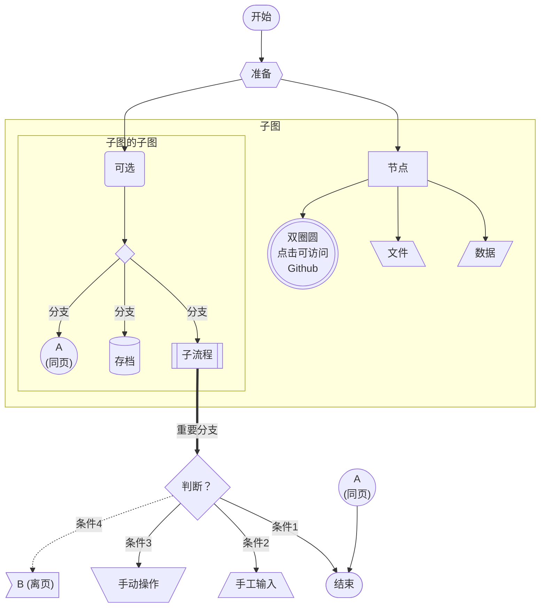
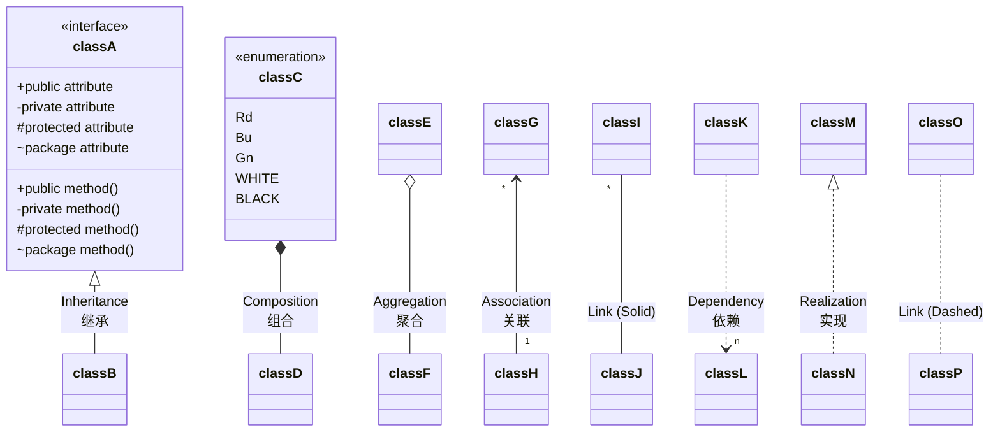
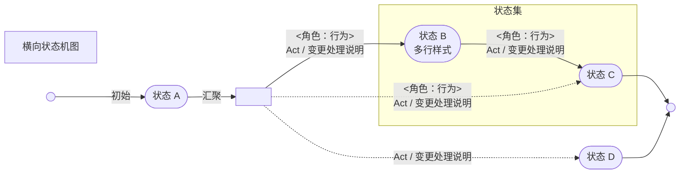
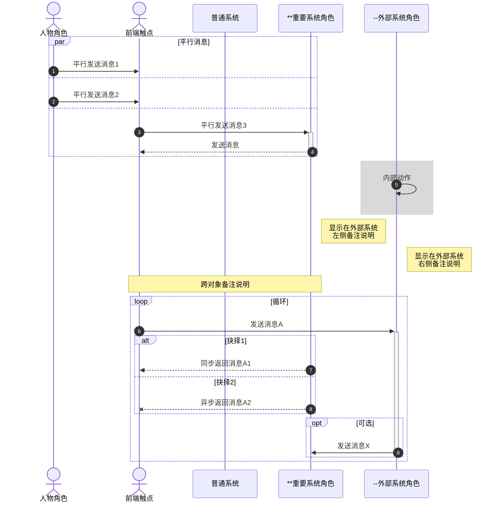

[TOC]

# 打赏

**若喜欢 VLOOK™ 的话，可以贡献一杯咖啡 :-) **

`#微信支付|MaxChow#`~(Gn!)~


**感谢打赏支持 VLOOK™ 的客官（部分名单）：**

一＊秋、＊＊军、＊＊鹏、李＊6、＊＊无、H＊t、＊＊二、f＊y、＊＊宇、＊＊琛、＊＊辉、＊＊秋、＊＊笑、＊＊豫、l＊a、＊＊心、整＊9、＊＊国、＊＊拉、＊＊龙、＊＊应、＊＊销、＊＊哦、E＊y、……

# 快速入坑

VLOOK™ 通过结合 Typora 持续 **挖掘和扩展** Markdown 和 CSS 的应用潜力，同时结合了文档的互联网化应用场景～

在 **文档排版、内容导航、演示辅助、交互体验**~(T1T2)~ 等方面提供了 ==一致、简洁、友好== 的体验。

## 快速入坑°文档排版

> ** ° 文档排版**
>
> **有了 VLOOK™ 主题及插件的支持，让你对 Markdown 编辑器（暂只支持 Typora）的自动化排版能力有了全新的理解。**
>
> S得益于成熟的 Web 浏览器、HTML / CSS、JavaScript 技术，让静态的文档也能与你一起「动」起来。
>
> ~(Vn!)~

###### 表格

---

---

> ###### 内容组织
>
> - 横向 / 纵向**合并单元格** [❯❯](guide.md#表格单元格合并)
> - 自动编号、添加题注 [❯❯](guide.md#表格自动编号与题注)
> - 设置**重复显示表头** [❯❯](guide.md#表格重复显示表头)
> - 自动适配换行版式 [❯❯](#表格换行版式)
>
> ~(Vn)~

> ###### 行格式
>
> - 给每个表格进行**自动编号**、**添加题注** [❯❯](guide.md#表格自动编号与题注)
> - 给表格的**每一行**都进行**自动编号** [❯❯](guide.md#表格行自动编号)
> - 对多个行进行**分组**、**分类**，并能**自动折叠** [❯❯](guide.md#表格行分组折叠)
> - 在表格中指示当前行 [❯❯](guide.md#表格当前行指标器)
>
> ~(Vn)~

> ###### 列格式
>
> - 设置为加粗、高亮、下划线、斜体 [❯❯](guide.md#表格列格式：基础)
> - 设置为**数值**、**百分比**、**货币** [❯❯](guide.md#表格列格式：数值、百分数、货币)
> - 设置为**复选框** [❯❯](guide.md#表格列格式：复选框)
>
> ~(Vn)~

###### 图片 • 图标 • 图表

---

---

> ###### 图片与图表
>
> - 自动编号、添加题注 [❯❯](guide.md#插图自动编号与题注)
> - 对 Mermaid 的支持 [❯❯](#更美观的 Mermaid)
>
> ~(Vn)~

> ###### 版式
>
> - 调整**对齐方式** [❯❯](guide.md#插图对齐方式)
> - 设置以**小图标**方式显示 [❯❯](guide.md#图片显示版式)
> - 设置为普通图片，不以插图的形式显示 [❯❯](guide.md#图片显示版式)
> - 图片边缘能**留白** [❯❯](guide.md#图片边缘留白)
> - **一行多图**自动换行后样式适配 [❯❯](guide.md#一行多图适配)
>
> ~(Vn)~

> ###### 外观
>
> - 在高分屏下自动适配显示**高清**的版本（2x、3x） [❯❯](guide.md#图片适配高分屏)
> - 自动适配 **Dark Mode**  [❯❯](guide.md#图片适配 Dark Mode)
> - 让图标的颜色与周围的元素更搭更和谐 [❯❯](guide.md#图片彩虹剪影)
> - 为图片添加工程风的网格背景 [❯❯](guide.md#图片网格背景)
>
> ~(Vn)~

###### 引用 • 分栏

---

> ###### 对内容分级、分栏/看板、分类展示
>
> - 为引用添加小标题 [❯❯](guide.md#引用小标题)
> - 以**分栏/看板**方式组织内容 [❯❯](guide.md#°分栏与看板)
> - 将内容以分级、分类**折叠**的方式进行组 [❯❯](guide.md#折叠引用)
>
> ~(Vn)~

> ###### 引用多样化的自动排版
>
> - 引用内嵌普通引用 [❯❯](guide.md#示例_引用内嵌普通引用)
> - 引用内嵌分栏引用 [❯❯](guide.md#示例 2_引用内嵌引用分栏)
> - 列表内嵌引用 [❯❯](guide.md#示例 3_列表内嵌引用)
>
> ~(Vn)~

###### 代码块 • 多媒体 **•** 任务

---

---

> ###### 代码块
>
> - 给每个代码块进行自动编号、**添加题注** [❯❯](guide.md#代码块自动编号与题注)
> - 代码块高亮当前行、一键复制代码 [❯❯](guide.md#代码块增强)
> 
> ~(Vn)~

> ###### 音频、视频
>
> - 为文档添加**音频**内容 [❯❯](guide.md##音频)
> - 为文档添加**视频**内容 [❯❯](guide.md#视频)
> 
> ~(Vn)~

> ###### 任务列表
>
> - 任务列表的序号，给你找回来了 [❯❯](guide.md#任务列表自动编号)
> - 对于多级任务列表，「**任务组完成状态**」能自动识别了 [❯❯](guide.md#任务组完成状态)
>
> ~(Vn)~

###### 标签 • 徽章 • 注音 • 刮刮卡

---

> ###### 标记、突出关键信息与内容
>
> - 添加**标签**突出关键字信息 [❯❯](#彩虹标签)
> - 将两项内容以**徽章**形式组织 [❯❯](#彩虹徽章)
>
> ~(Vn)~

> ###### 注音、拼音、刮刮卡
>
> - 给生僻^[pì]^字，或东亚小语种添加**注音** [❯❯](#注音)
> - 制作培训、猜迷互动类文档时，希望将**答案先隐藏**  [❯❯](#刮刮卡)
>
> ~(Vn)~

## 快速入坑°内容导航

> ** ° 内容导航**
>
> **VLOOK™ 提供了对文档章节、插图、表格、多媒体提供了多种形式的导航、快速定位和内容组织的工具，全面改善和提高发布的 HTML 文件的浏览体验和效率。**
>
> 敬请你根据需要和喜好随时、轻松享用～
>
> ~(Bu!)~

---

---

> **° 导航中心**
>
> 适用于按目录、分类内容索引（目录/插图/表格/多媒体/代码块）进行**全文档**跨章节的快速定位 [❯❯](#导航中心)
>
> ~(Bu)~

> **° 逐章导航**
>
> 适用于前后章节相关度高，**按章节**顺序一章一章进行浏览 [❯❯](#逐章导航)
>
> ~(Bu)~

> **° 逐段导航**
>
> 适用于文档评审或演示，**按段落**一段一段进行聚焦式浏览 [❯❯](#逐段导航)
>
> ~(Bu)~

---

---

> **° 插图导航**
>
> 适用于**按图索骥**，快速浏览文档中的插图，以及快速**定位**到文档中对应的位置 [❯❯](#插图导航)
>
> ~(Bu)~

> **° 文库导航**
>
> 适用于将相关话题、内容的文档简介、链接，通过一个独立页面进行快速浏览和跳转 [❯❯](#文库导航)
>
> ~(Bu)~

> **° 脚注导航**
>
> 直接在当面位置进行显示脚注，避免来回跳转 [❯❯](#脚注导航)
>
> ~(Bu)~

## 快速入坑°演示与出版辅助

> ** ° 演示与出版辅助**
>
> **VLOOK™ 独创性地为 Markdown 导出的 HTML 提供了强大的演示与出版辅助工具，让 Typora + VLOOK 成为更具生产力的 Markdown 文档解决方案。**
>
> 非常适合现场和远程的演示辅助工具，敬请为你的 Markdown 开启 Turbo 模式～
>
> ~(Og!)~

> **内容助手**
>
> ---
>
> > **° 复制内容**
> >
> > 支持图片、代码、代码块内容的一键复制，并支持「复制为 Markdown 格式」  [❯❯](#复制内容)
> >
> > ~(Og)~
> 
> > **° 插图放大显示**
> >
> > 支持将插图一键放大显示，及前后浏览  [❯❯](#插图放大显示)
> >
> > ~(Og)~
> 
> ---
>
> > **° 表格阅读模式**
> >
> > 针对表格内容，特别是行、列关联性强的**表格**，快速识别**纵横关联**的单元格序列 [❯❯](#表格阅读模式)
> >
> > ~(Og)~
>
> > **° 画中画**
> >
> > 插图/表格/代码块 一键开启「画中画」浮动显示，方便在文档相关内容间对比 [❯❯](#画中画)
> >
> > ~(Og)~
>
> ~(Gy!)~

> **演示辅助**
>
> ---
>
> ---
>
> > **° 激光笔**
> >
> > 对文档内容进行**精确指向** [❯❯](#激光笔)
> >
> > ~(Og)~
>
> > **° 聚光灯**
> >
> > 对屏幕内容的局部进行视觉**聚焦** [❯❯](#聚光灯)
> >
> > ~(Og)~
>
> > **° 图表元素高亮**
> >
> > 支持鼠标对 Mermaid 图元悬停高亮显示 [❯❯](#Mermaid 图表元素高亮)
> >
> > ~(Og)~
>
> ~(Gy!)~

> **出版辅助**
>
> ---
> 
> ---
> 
> > **° 长内容自动折叠**
> >
> > 插图、表格、代码内容过高的情况下会自动进行折叠 [❯❯](#长内容自动折叠)
> >
> > ~(Og)~
> 
> > **° 章节标题自动编号**
> >
> > 对文档内的章节标题进行**自动分级编号** [❯❯](#章节自动编号)
> >
> > ~(Og)~
> 
> > **° 自定义欢迎页内容**
> >
> > 对文档在加载过程中显示欢迎语内容 [❯❯](#自定义欢迎页内容)
> >
> > ~(Og)~
>
> ---
> 
> ---
> 
> > **° 内容失效检查**
> >
> > 对文档的**图片、音频、视频、页内链接**等内容进行检查并提示 [❯❯](#内容失效检查)
> >
> > ~(Og)~
> 
> > **° 链接内容识别**
> >
> > **自动识别**并提示文档内的**链接类型**，并针对外链进行了优化 [❯❯](#链接内容识别)
> >
> > ~(Og)~
> 
> > **° 链接内容转换**
> >
> > 自动 md 链接、外部链接获得更好友的体验  [❯❯](#链接内容转换)
> >
> > ~(Og)~
>
> ~(Gy!)~

## 快速入坑°主题与不杂项

> ** ° 主题与不杂项**
>
> 「**人类从来都是视觉动物，自己或他人在阅读时，让眼睛感受愉悦和美好，是一种美德、一种力量、一种信仰。**」
>
> 　　　———— MAX°孟兆
>
> ~(Lm!)~

---

---

> ###### 模板主题、字体主题
>
> - 为不同类型的文档设置不同的「模板主题」 [❯❯](#模板主题)
> - 为文档选择不同的「字体主题」 [❯❯](#字体主题)
> - **Dark Mode** is **NOW** [❯❯](#Dark Mode)
> - 为文档添加「封面、封底」 [❯❯](#封面、封底)
> - 更美观的公式 [❯❯](#更美观的公式)
>
> ~(Lm)~

> ###### 第三方集成的适配
>
> 对于主流的脚本化图表 **Mermaid**~(RdRo)~：
>
> - 支持插图化的题注、自动编号特性  [❯❯](#Mermaid 图表自动编号与题注)
> 
> - 结合 VLOOK 针对提供更适配、更美观的样式 [❯❯](#更美观的 Mermaid)
> 
> 数字公式：
> 
> - 结合 VLOOK 针对提供更适配、更美观的样式 [❯❯](#更美观的公式)
>
> ~(Lm)~

> ###### 不「杂」项
>
> - 支持 Typora 编辑时的特性增强 [❯❯](#Typora 编辑时特性增强)
> - 预置插件参数，自定义你的文档表现 [❯❯](#插件预置选项)
> - 支持[跨平台、动效](#跨平台、动效支持)（如：毛玻璃）
> - 支持 [emoji](#emoji 支持)、[国际化](#国际化支持)
> - 支持快捷键操作 [❯❯](#快捷键操作汇总)
>
> ~(Lm)~

# °内容标记

## 标签与徽章

`#Markdown 粉|⬇️#`「**用 Markdown 写文档，想通过「标签」或「徽章」突出或组织相关性较强的内容，这个想法会不会不现实呢？**」

`#VLOOK|👀#`~(T2)~ 对 Markdown 行内代码（Code）语法 `` ` ` `` 和下标语法 `~ ~` 进行了扩展，满足实用的「标签」和「徽章」排的版需求！

例如：可以这样 `#标签#`~(Og)~ ，还可以这样 `#这是徽章标题|这是徽章内容#`~(Pk)~ ，继续往下看看就知道这是怎么做到的～

> `#💡|小提示#`~(Og!)~ 所有的标签、徽章标题/内容，都支持点击复制内容，在限时内第 2 次点击可复制为 Markdown 格式。

### 彩虹标签

> **语法：**`` `#标签#`~(色号)~ `` 
>
> 其中，
>
> `标签`：徽章内容，前后由 `#` 符号包裹
>
> `色号`：可选。指定该标签使用的[预置色号](guide.md#预置色号)（强调风格时可支持渐变），不指定则默认为 `T2`

> `#💡|小提示#`~(Og!)~ 若须修改默认色号，可通过「[插件调校参数](#插件调校参数)」`tag` 指定。

*==彩虹标签（强调风格）预置色号及示例==*

| **预置色号** | 语法示例                  | 应用场景建议               | 渲染效果                                  |
| :----------: | ------------------------- | -------------------------- | ----------------------------------------- |
|     Wn!      | `` `#标签 Wn!#`~(Wn!)~ `` | 警告、危险、关键事项、删除 | `#标签 Wn!#`~(Wn!)~ `#标签 Wn!#`~(WnMn!)~ |
|     Rd!      | `` `#标签 Rd!#`~(Rd!)~ `` | :                          | `#标签 Rd!#`~(Rd!)~ `#标签 Rd!#`~(RdGn!)~ |
|     Og!      | `` `#标签 Og!#`~(Og!)~ `` | 提醒、注意、修复           | `#标签 Og!#`~(Og!)~ `#标签 Og!#`~(OgCy!)~ |
|     Ye!      | `` `#标签 Ye!#`~(Ye!)~ `` | 关注、优化、备忘、说明     | `#标签 Ye!#`~(Ye!)~ `#标签 Ye!#`~(YeLa!)~ |
|     Lm!      | `` `#标签 Lm!#`~(Lm!)~ `` | 提示、参考、新增           | `#标签 Lm!#`~(Lm!)~ `#标签 Lm!#`~(LmAq!)~ |
|     Gn!      | `` `#标签 Gn!#`~(Gn!)~ `` | :                          | `#标签 Gn!#`~(Gn!)~ `#标签 Gn!#`~(GnRd!)~ |
|     Mn!      | `` `#标签 Mn!#`~(Mn!)~ `` | :                          | `#标签 Mn!#`~(Mn!)~ `#标签 Mn!#`~(MnWn!)~ |
|     Ol!      | `` `#标签 Ol!#`~(Ol!)~ `` | :                          | `#标签 Ol!#`~(Ol!)~ `#标签 Ol!#`~(OlCy!)~ |
|     Aq!      | `` `#标签 Aq!#`~(Aq!)~ `` | 引用、公告                 | `#标签 Aq!#`~(Aq!)~ `#标签 Aq!#`~(AqLm!)~ |
|     Cy!      | `` `#标签 Cy!#`~(Cy!)~ `` | :                          | `#标签 Cy!#`~(Cy!)~ `#标签 Cy!#`~(CyYe!)~ |
|     Bu!      | `` `#标签 Bu!#`~(Bu!)~ `` | 信息、资讯                 | `#标签 Bu!#`~(Bu!)~ `#标签 Bu!#`~(BuOl!)~ |
|     Se!      | `` `#标签 Se!#`~(Se!)~ `` | :                          | `#标签 Se!#`~(Se!)~ `#标签 Se!#`~(SeBn!)~ |
|     La!      | `` `#标签 La!#`~(La!)~ `` | :                          | `#标签 La!#`~(La!)~ `#标签 La!#`~(LaYe!)~ |
|     Vn!      | `` `#标签 Vn!#`~(Vn!)~ `` | :                          | `#标签 Vn!#`~(Vn!)~ `#标签 Vn!#`~(VnPu!)~ |
|     Pu!      | `` `#标签 Pu!#`~(Pu!)~ `` | 延伸、扩展、保留、备用     | `#标签 Pu!#`~(Pu!)~ `#标签 Pu!#`~(PuVn!)~ |
|     Ro!      | `` `#标签 Ro!#`~(Ro!)~ `` | 年轻、个性、女性           | `#标签 Ro!#`~(Ro!)~ `#标签 Ro!#`~(RoRd!)~ |
|     Pk!      | `` `#标签 Pk!#`~(Pk!)~ `` | :                          | `#标签 Pk!#`~(Pk!)~ `#标签 Pk!#`~(PkGd!)~ |
|     Gd!      | `` `#标签 Gd!#`~(Gd!)~ `` | VIP、金融、工程            | `#标签 Gd!#`~(Gd!)~ `#标签 Gd!#`~(GdPk!)~ |
|     Bn!      | `` `#标签 Bn!#`~(Bn!)~ `` | :                          | `#标签 Bn!#`~(Bn!)~ `#标签 Bn!#`~(BnSe!)~ |
|     Gy!      | `` `#标签 Gy!#`~(Gy!)~ `` | 无效、暂缓、停用、结束     | `#标签 Gy!#`~(Gy!)~ `#标签 Gy!#`~(GyCy!)~ |
|     Bk!      | `` `#标签 Bk!#`~(Bk!)~ `` | 黑白、高对比               | `#标签 Bk!#`~(Bk!)~ `#标签 Bk!#`~(BkOg!)~ |
|     T1!      | `` `#标签 T1!#`~(T1!)~ `` | 当前 VLOOK™ 主题的主色     | `#标签 T1!#`~(T1!)~ `#标签 T1!#`~(T1T2!)~ |
|     T2!      | `` `#标签 T2#`~(T2!)~ ``  | 当前 VLOOK™ 主题的辅助色   | `#标签 T2!#`~(T2!)~ `#标签 T2!#`~(T2T1!)~ |

*==彩虹标签（常规风格）预置色号及示例==*

| **预置色号** | 语法示例                | 应用场景建议               | 渲染效果          |
| :----------: | ----------------------- | -------------------------- | ----------------- |
|      Wn      | `` `#标签 Wn#`~(Wn)~ `` | 警告、危险、关键事项、删除 | `#标签 Wn#`~(Wn)~ |
|      Rd      | `` `#标签 Rd#`~(Rd)~ `` | :                          | `#标签 Rd#`~(Rd)~ |
|      Og      | `` `#标签 Og#`~(Og)~ `` | 提醒、注意、修复           | `#标签 Og#`~(Og)~ |
|      Ye      | `` `#标签 Ye#`~(Ye)~ `` | 关注、优化、备忘、说明     | `#标签 Ye#`~(Ye)~ |
|      Lm      | `` `#标签 Lm#`~(Lm)~ `` | 提示、参考、新增           | `#标签 Lm#`~(Lm)~ |
|      Gn      | `` `#标签 Gn#`~(Gn)~ `` | :                          | `#标签 Gn#`~(Gn)~ |
|      Mn      | `` `#标签 Mn#`~(Mn)~ `` | :                          | `#标签 Mn#`~(Mn)~ |
|      Ol      | `` `#标签 Ol#`~(Ol)~ `` | :                          | `#标签 Ol#`~(Ol)~ |
|      Aq      | `` `#标签 Aq#`~(Aq)~ `` | 引用、公告                 | `#标签 Aq#`~(Aq)~ |
|      Cy      | `` `#标签 Cy#`~(Cy)~ `` | :                          | `#标签 Cy#`~(Cy)~ |
|      Bu      | `` `#标签 Bu#`~(Bu)~ `` | 信息、资讯                 | `#标签 Bu#`~(Bu)~ |
|      Se      | `` `#标签 Se#`~(Se)~ `` | :                          | `#标签 Se#`~(Se)~ |
|      La      | `` `#标签 La#`~(La)~ `` | :                          | `#标签 La#`~(La)~ |
|      Vn      | `` `#标签 Vn#`~(Vn)~ `` | :                          | `#标签 Vn#`~(Vn)~ |
|      Pu      | `` `#标签 Pu#`~(Pu)~ `` | 延伸、扩展、保留、备用     | `#标签 Pu#`~(Pu)~ |
|      Ro      | `` `#标签 Ro#`~(Ro)~ `` | 年轻、个性、女性           | `#标签 Ro#`~(Ro)~ |
|      Pk      | `` `#标签 Pk#`~(Pk)~ `` | :                          | `#标签 Pk#`~(Pk)~ |
|      Gd      | `` `#标签 Gd#`~(Gd)~ `` | VIP、金融、工程            | `#标签 Gd#`~(Gd)~ |
|      Bn      | `` `#标签 Bn#`~(Bn)~ `` | :                          | `#标签 Bn#`~(Bn)~ |
|      Gy      | `` `#标签 Gy#`~(Gy)~ `` | 无效、暂缓、停用、结束     | `#标签 Gy#`~(Gy)~ |
|      Bk      | `` `#标签 Bk#`~(Bk)~ `` | 黑白、高对比               | `#标签 Bk#`~(Bk)~ |
|      T1      | `` `#标签 T1#`~(T1)~ `` | 当前 VLOOK™ 主题的主色     | `#标签 T1#`~(T1)~ |
|      T2      | `` `#标签 T2#`~(T2)~ `` | 当前 VLOOK™ 主题的辅助色   | `#标签 T2#`~(T2)~ |

###### 旧语法适配参考

> ###### 如何将彩虹标签的色号由「旧语法」批量更新为「新语法」
>
> 使用 Typora 的查找替换功能，或任意支持正则表达式进行查找替换的工具（如：VS Code / UltraEdit 等）进行操作。
>
> 1. 在查找内容中输入 ``#(\([a-z!12]+\))` `` ，并指定查找选项为 `正则表达式`
> 2. 查找匹配到内容后，替换内容为 `` #`~COLOR-CODE~`` ；
> 3. 注意其中 `COLOR-CODE` 为实际新色号，如：`Rd` `Gn` 等。

---

如果你对以上内容有更多需求或建议，欢迎随时反馈～ [](https://qm.qq.com/cgi-bin/qm/qr?k=oB8wpFG_4SEMf1CL9qVy-jMw0CMfSwff&jump_from=webapi)  [](https://t.me/vlook_markdown)

[<kbd> 我要回到 快速入坑°文档排版</kbd>](#快速入坑°文档排版)

### 彩虹徽章

> **语法：**`` `#标题|徽章内容#`~(色号)~ ``
>
> 与彩虹标签名语法基本一致，徽章标题与内容由 `#` 包裹，并以英文竖线符号 `|` 进行分隔，==支持三段式（即两项徽章内容）==，两项徽章内容同样以英文竖线符号 `|` 进行分隔。其中，
>
> `标题`：为徽章标题
>
> `徽章内容`：为徽章内容。内容支持识别变量格式 ` {{变量}}` ` %变量%`  ` $变量$` ` ${变量}` ` #{变量}` `var(变量)` ，对这些内容以 突出的样式显示。
>
> `色号`：可选。指定该徽章使用的[预置色号](guide.md#预置色号)，不指定则默认为 `(Gy)` 。色号后添加 `!` 则使用强调样式

> `#💡|小提示#`~(Og!)~ 若须修改默认色号，可通过「[插件调校参数](#插件调校参数)」`badge` 指定。

*==彩虹徽章预置色号（常规风格）示例==*

| 预置色号 | 语法示例                                  | 应用场景建议               | 渲染效果                            |
| :------: | ----------------------------------------- | -------------------------- | ----------------------------------- |
|    Wn    | `` `#标题|徽章内容 {{变量 1}}#`~(Wn)~ ``  | 警告、危险、关键事项、删除 | `#标题|徽章内容 {{变量 1}}#`~(Wn)~  |
|    Rd    | `` `#标题|徽章内容 {{变量 1}}#`~(Rd)~ ``  | :                          | `#标题|徽章内容 {{变量 1}}#`~(Rd)~  |
|    Og    | `` `#标题|徽章内容 %变量 2%#`~(Og)~ ``    | 提醒、注意、修复           | `#标题|徽章内容 %变量 2%#`~(Og)~    |
|    Ye    | `` `#标题|徽章内容 $变量 3$#`~(Ye)~ ``    | 关注、优化、备忘、说明     | `#标题|徽章内容 $变量 3$#`~(Ye)~    |
|    Lm    | `` `#标题|徽章内容 ${变量 4}#`~(Lm)~ ``   | 提示、备忘、参考、新增     | `#标题|徽章内容 ${变量 4}#`~(Lm)~   |
|    Gn    | `` `#标题|徽章内容 #{变量 5}#`~(Gn)~ ``   | :                          | `#标题|徽章内容 #{变量 5}#`~(Gn)~   |
|    Mn    | `` `#标题|徽章内容 #{变量 5}#`~(Mn)~ ``   | :                          | `#标题|徽章内容 #{变量 5}#`~(Mn)~   |
|    Ol    | `` `#标题|徽章内容 #{变量 5}#`~(Ol)~ ``   | :                          | `#标题|徽章内容 #{变量 5}#`~(Ol)~   |
|    Aq    | `` `#标题|徽章内容 var(变量 6)#`~(Aq)~ `` | 引用、公告                 | `#标题|徽章内容 var(变量 6)#`~(Aq)~ |
|    Cy    | `` `#标题|徽章内容#`~(Cy)~ ``             | :                          | `#标题|Badge Value#`~(Cy)~          |
|    Bu    | `` `#标题|徽章内容#`~(Bu)~ ``             | 信息、资讯                 | `#标题|Badge Value#`~(Bu)~          |
|    Se    | `` `#标题|徽章内容#`~(Se)~ ``             | :                          | `#标题|Badge Value#`~(Se)~          |
|    La    | `` `#标题|徽章内容#`~(La)~ ``             | :                          | `#标题|Badge Value#`~(La)~          |
|    Vn    | `` `#标题|徽章内容#`~(Vn)~ ``             | :                          | `#标题|Badge Value#`~(Vn)~          |
|    Pu    | `` `#标题|徽章内容 {{变量 1}}#`~(Pu)~ ``  | 延伸、扩展、保留、备用     | `#标题|徽章内容 {{变量 1}}#`~(Pu)~  |
|    Ro    | `` `#标题|徽章内容 {{变量 1}}#`~(Ro)~ ``  | 年轻、个性、女性           | `#标题|徽章内容 {{变量 1}}#`~(Ro)~  |
|    Pk    | `` `#标题|徽章内容 {{变量 1}}#`~(Pk)~ ``  | :                          | `#标题|徽章内容 {{变量 1}}#`~(Pk)~  |
|    Gd    | `` `#标题|徽章内容 {{变量 1}}#`~(Gd)~ ``  | VIP、金融、工程            | `#标题|徽章内容 {{变量 1}}#`~(Gd)~  |
|    Bn    | `` `#标题|徽章内容 {{变量 1}}#`~(Bn)~ ``  | :                          | `#标题|徽章内容 {{变量 1}}#`~(Bn)~  |
|    Gy    | `` `#标题|徽章内容 {{变量 1}}#`~(Gy)~ ``  | 常规、无效、暂缓、停用     | `#标题|徽章内容 {{变量 1}}#`~(Gy)~  |
|    Bk    | `` `#标题|徽章内容 {{变量 1}}#`~(Bk)~ ``  | 黑白、高对比               | `#标题|徽章内容 {{变量 1}}#`~(Bk)~  |
|    T1    | `` `#标题|徽章内容 {{变量 1}}#`~(T1)~ ``  | 当前 VLOOK™ 主题的主色     | `#标题|徽章内容 {{变量 1}}#`~(T1)~  |
|    T2    | `` `#标题|徽章内容 {{变量 1}}#`~(T2)~ ``  | 当前 VLOOK™ 主题的辅助色   | `#标题|徽章内容 {{变量 1}}#`~(T2)~  |

*==彩虹徽章预置色号（强调风格）示例==*

| 预置色号 | 语法示例                       | 应用场景建议               | 渲染效果                 |
| :------: | ------------------------------ | -------------------------- | ------------------------ |
|   Wn!    | `` `#标题|强调样式#`~(Wn!)~ `` | 警告、危险、关键事项、删除 | `#标题|强调样式#`~(Wn!)~ |
|   Rd!    | `` `#标题|强调样式#`~(Rd!)~ `` | :                          | `#标题|强调样式#`~(Rd!)~ |
|   Og!    | `` `#标题|强调样式#`~(Og!)~ `` | 提醒、注意、修复           | `#标题|强调样式#`~(Og!)~ |
|   Ye!    | `` `#标题|强调样式#`~(Ye!)~ `` | 关注、优化、备忘、说明     | `#标题|强调样式#`~(Ye!)~ |
|   Lm!    | `` `#标题|强调样式#`~(Lm!)~ `` | 提示、备忘、参考、新增     | `#标题|强调样式#`~(Lm!)~ |
|   Gn!    | `` `#标题|强调样式#`~(Gn!)~ `` | :                          | `#标题|强调样式#`~(Gn!)~ |
|   Mn!    | `` `#标题|强调样式#`~(Mn!)~ `` | :                          | `#标题|强调样式#`~(Mn!)~ |
|   Ol!    | `` `#标题|强调样式#`~(Ol!)~ `` | :                          | `#标题|强调样式#`~(Ol!)~ |
|   Aq!    | `` `#标题|强调样式#`~(Aq!)~ `` | 引用、公告                 | `#标题|强调样式#`~(Aq!)~ |
|   Cy!    | `` `#标题|强调样式#`~(Cy!)~ `` | :                          | `#标题|强调样式#`~(Cy!)~ |
|   Bu!    | `` `#标题|强调样式#`~(Bu!)~ `` | 信息、资讯                 | `#标题|强调样式#`~(Bu!)~ |
|   Se!    | `` `#标题|强调样式#`~(Se!)~ `` | :                          | `#标题|强调样式#`~(Se!)~ |
|   La!    | `` `#标题|强调样式#`~(La!)~ `` | :                          | `#标题|强调样式#`~(La!)~ |
|   Vn!    | `` `#标题|强调样式#`~(Vn!)~ `` | :                          | `#标题|强调样式#`~(Vn!)~ |
|   Pu!    | `` `#标题|强调样式#`~(Pu!)~ `` | 延伸、扩展、保留、备用     | `#标题|强调样式#`~(Pu!)~ |
|   Ro!    | `` `#标题|强调样式#`~(Ro!)~ `` | 年轻、个性、女性           | `#标题|强调样式#`~(Ro!)~ |
|   Pk!    | `` `#标题|强调样式#`~(Pk!)~ `` | :                          | `#标题|强调样式#`~(Pk!)~ |
|   Gd!    | `` `#标题|强调样式#`~(Gd!)~ `` | VIP、金融、工程            | `#标题|强调样式#`~(Gd!)~ |
|   Bn!    | `` `#标题|强调样式#`~(Bn!)~ `` | :                          | `#标题|强调样式#`~(Bn!)~ |
|   Gy!    | `` `#标题|强调样式#`~(Gy!)~ `` | 常规、无效、暂缓、停用     | `#标题|强调样式#`~(Gy!)~ |
|   Bk!    | `` `#标题|强调样式#`~(Bk!)~ `` | 黑白、高对比               | `#标题|强调样式#`~(Bk!)~ |
|   T1!    | `` `#标题|强调样式#`~(T1!)~ `` | 当前 VLOOK™ 主题的主色     | `#标题|强调样式#`~(T1!)~ |
|   T2!    | `` `#标题|强调样式#`~(T2!)~ `` | 当前 VLOOK™ 主题的辅助色   | `#标题|强调样式#`~(T2!)~ |

*==彩虹徽章预置色号（三段式）示例==*

| 预置色号 | 语法示例                          | 渲染效果                    |
| :------: | --------------------------------- | --------------------------- |
|    Ye    | `` `#标题|内容1|内容2#`~(Ye)~ ``  | `#标题|内容1|内容2#`~(T1)~  |
|    Bu    | `` `#标题|内容1|内容2#`~(Bu)~ ``  | `#标题|内容1|内容2#`~(T2)~  |
|   Ye!    | `` `#标题|内容1|内容2#`~(Ye!)~ `` | `#标题|内容1|内容2#`~(T1!)~ |
|   Bu!    | `` `#标题|内容1|内容2#`~(Bu!)~ `` | `#标题|内容1|内容2#`~(T2!)~ |


> ###### 如何将彩虹徽章的色号由「旧语法」批量更新为「新语法」
>
> 请直接参考[彩虹标签](#旧语法适配参考)的相关内容。

---

如果你对以上内容有更多需求或建议，欢迎随时反馈～ [](https://qm.qq.com/cgi-bin/qm/qr?k=oB8wpFG_4SEMf1CL9qVy-jMw0CMfSwff&jump_from=webapi)  [](https://t.me/vlook_markdown)

[<kbd> 我要回到 快速入坑°文档排版</kbd>](#快速入坑°文档排版)

## 注音

### 上标式注音 `#新语法#`

`#Markdown 粉|⬇️#`「**希望 Markdown 文档能方便添加注音（如：拼音、外文对照），这样我语言培训文档和电子书就可以更出彩了**」

`#VLOOK|👀#`~(T2)~ 通过对 Markdown 上标语法 `^ ^` 进行了扩展，轻松满足实用的「注音」排版需求！

> 效果等价于 HTML 5 中 **[ruby](https://www.runoob.com/tags/tag-ruby.html)**、**[rp](https://www.runoob.com/tags/tag-rp.html)**、**[rt](https://www.runoob.com/tags/tag-rt.html)** 标签，并支持点击进行释义或翻译:
>
> **语法：**`^[symbol]^`
>
> - `symbol`：注音、拼音符号，或注释内容
>
> 添加了该语法内容前的 1 个中文字或英文单词会自动将该内容作为注音显示。
>
> `#⚠️|注意#`~(Rd!)~ 若注音内容间带空格，请使用下划线符号代替

###### 示例_注音 1

「==道^[dào]^生一，一生二，二生^[shēng]^三，三生万物^[wàn_wù]^==~(BuRoGn)~」── 道德经•老子

###### 示例_注音 2

*==多语种的注音应用_中/日/韩/英_==*

|  分类  | 语法示例                                        | 应用效果                                |
| :----: | ----------------------------------------------- | --------------------------------------- |
|  注音  | 道`^[ㄉㄠ]^`德`^[ㄉㄜ]^`经`^[ㄐㄧㄥˉ]^`         | 道^[ㄉㄠ]^德^[ㄉㄜ]^经^[ㄐㄧㄥˉ]^       |
| 普通话 | 道`^[dào]^`德`^[dé]^`经`^[jīng]^`               | 道^[dào]^德^[dé]^经^[jīng]^             |
|  粤语  | 道`^[dou]^`德`^[däk]^`经`^[gïng]^`              | 道^[dou]^德^[däk]^经^[gïng]^            |
|  日文  | 鳥山`^[とり_やま]^`明`^[あきら]^`               | 鳥山^[とり_やま]^明^[あきら]^           |
|  韩文  | 대`^[Dae]^` 한`^[Han]^` 민`^[Min]^` 국`^[Gug]^` | 대^[Dae]^ 한^[Han]^ 민^[Min]^ 국^[Gug]^ |

---

> ###### 中文注音线上扩展服务
>
> 被注音的文字内容为**中文**，由 [](https://www.zdic.net/) 提供服务
>
> - 点击可打开「汉典」官网，显示对应的「文字内容」释义
>
> ~(Rd!)~

> ###### 非中文注音线上扩展服务
>
> 被注音的文字内容**不是中文**，由 [](https://www.bing.com/translator/) 提供服务
>
> - 点击可打开「Bing 翻译」官网，自动对注音为日文「假名」部分进行**翻译**
> - 其他情况，则自动对「文字内容」进行翻译
>
> ~(Bu!)~

### 代码式注音 `#旧语法#`~(Gy!)~

==**（新文档不建议使用！该特性只作为对旧有文档，或封面中添加注音的支持）**==

> 效果等价于 HTML 5 中 **[ruby](https://www.runoob.com/tags/tag-ruby.html)**、**[rp](https://www.runoob.com/tags/tag-rp.html)**、**[rt](https://www.runoob.com/tags/tag-rt.html)** 标签，并支持点击进行释义或翻译:
>
> **语法：**`` `{text}(symbol)` ``
>
> - `text`：要添加「注音、拼音、注释」的文字
> - `symbol`：text 对应的注音、拼音符号，或注释内容

###### 示例_注音 1

「==`{道}(dào)`生一，一生二，二`{生}(shēng)`三，三生`{万物}(wàn wù)`==」── 道德经•老子

###### 示例_注音 2

*==多语种的注音应用_中/日/韩/英_==*

|  分类  | 语法示例                                                     | 应用效果                                    |
| :----: | ------------------------------------------------------------ | ------------------------------------------- |
|  注音  | `` `{道}(ㄉㄠˋ)` `` `` `{德}(ㄉㄜˊ)` `` `` `{经}(ㄐㄧㄥˉ)` `` | `{道}(ㄉㄠˋ)` `{德}(ㄉㄜˊ)` `{经}(ㄐㄧㄥˉ)` |
| 普通话 | `` `{道}(dào)` `` `` `{德}(dé)` `` `` `{经}(jīng)` ``        | `{道}(dào)` `{德}(dé)` `{经}(jīng)`         |
|  粤语  | `` `{道德经}(dou däk gïng)` ``                               | `{道德经}(dou däk gïng)`                    |
|  日文  | `` `{鳥山}(とりやま)` `` `` `{明}(あきら)` ``                | `{鳥山}(とりやま)` `{明}(あきら)`           |
|  韩文  | `` `{대 한 민 국}(Dae Han Min Gug)` ``                       | `{대 한 민 국}(Dae Han Min Gug)`            |
|  中英  | `` `{道德经}(The Scripture of Ethics)` ``                    | `{道德经}(The Scripture of Ethics)`         |
| 英中 1 | `` `{The Scripture}(经)` `` of `` `{Ethics}(道德)` ``        | `{The Scripture}(经)` of `{Ethics}(道德)`   |
| 英中 2 | `` `{The Scripture of Ethics}(道德经)` ``                    | `{The Scripture of Ethics}(道德经)`         |

---

如果你对以上内容有更多需求或建议，欢迎随时反馈～ [](https://qm.qq.com/cgi-bin/qm/qr?k=oB8wpFG_4SEMf1CL9qVy-jMw0CMfSwff&jump_from=webapi)  [](https://t.me/vlook_markdown)

[<kbd> 我要回到 快速入坑°文档排版</kbd>](#快速入坑°文档排版)

## 刮刮卡

`#Markdown 粉|⬇️#`「**用 Markdown 制作交互式的培训文档时，希望能将一些关键信息（如：答案）先隐藏，点击再显示**」

`#VLOOK|👀#`~(T2)~ 通过对 Markdown 行内代码（Code）语法 `` ` ` `` 进行了扩展，轻松满足「培训、猜迷互动」等场景的排版需求！

> **语法：**`` `/提示文本|隐藏文本/`~(色号)~ ``
>
> - `提示文本`：可选，刮刮卡打开前显示的提示信息，默认为 `***`
> - `隐藏文本`：被刮刮卡遮盖的原始信息
> - `色号`：可选。`~ ~` 为 Typora 的下标格式。通过该方式指定刮刮卡使用的[预置色号](guide.md#预置色号)，不指定则默认为 `(Gy)` 。预置色号与「[彩虹标签](#彩虹标签)」的色号基本保持一致（无 `Bk` ，且不支持强调风格标识 ）
>
> `#💡|小提示#`~(Og!)~ 若须修改默认色号，可通过「[插件调校参数](#插件调校参数)」`coat` 指定。

###### 示例_刮刮卡

| 语法示例                                                     | 效果（点击以下的「刮刮卡」显示原始内容）                 |
| ------------------------------------------------------------ | :------------------------------------------------------- |
| `` `/|这是刮刮卡的内容/` ``                                  | `/|这是刮刮卡的内容/`                                    |
| `` `/ 提示信息 |这是刮刮卡的内容/` ``                        | `/ 提示信息 |这是刮刮卡的内容/`                          |
| `` `/|这是刮刮卡的内容/`~(Rd)~ ``                            | `/|这是刮刮卡的内容/`~(Rd)~                              |
| `` `/    |这是刮刮卡的内容/`~(Og)~ ``                        | `/    |这是刮刮卡的内容/`~(Og)~                          |
| `` `/    |这是刮刮卡的内容/`~(Ye)~ ``                        | `/    |这是刮刮卡的内容/`~(Ye)~                          |
| `` `/    |这是刮刮卡的内容/`~(Lm)~ ``                        | `/    |这是刮刮卡的内容/`~(Lm)~                          |
| `` `/    |这是刮刮卡的内容/`~(Gn)~ ``                        | `/    |这是刮刮卡的内容/`~(Gn)~                          |
| `` `/    |这是刮刮卡的内容/`~(Aq)~ ``                        | `/    |这是刮刮卡的内容/`~(Aq)~                          |
| `` `/    |这是刮刮卡的内容/`~(Cy)~ ``                        | `/    |这是刮刮卡的内容/`~(Cy)~                          |
| `` `/    |这是刮刮卡的内容/`~(Bu)~ ``                        | `/    |这是刮刮卡的内容/`~(Bu)~                          |
| `` `/    |这是刮刮卡的内容/`~(Se)~ ``                        | `/    |这是刮刮卡的内容/`~(Se)~                          |
| `` `/    |这是刮刮卡的内容/`~(Vn)~ ``                        | `/    |这是刮刮卡的内容/`~(Vn)~                          |
| `` `/    |这是刮刮卡的内容/`~(Pu)~ ``                        | `/    |这是刮刮卡的内容/`~(Pu)~                          |
| `` `/    |这是刮刮卡的内容/`~(Ro)~ ``                        | `/    |这是刮刮卡的内容/`~(Ro)~                          |
| `` `/    |这是刮刮卡的内容/`~(Pk)~ ``                        | `/    |这是刮刮卡的内容/`~(Pk)~                          |
| `` `/    |这是刮刮卡的内容/`~(Gd)~ ``                        | `/    |这是刮刮卡的内容/`~(Gd)~                          |
| `` `/    |这是刮刮卡的内容/`~(Bn)~ ``                        | `/    |这是刮刮卡的内容/`~(Bn)~                          |
| `` `/ 点开•刮刮卡 |这是刮刮卡的内容/`~(Gy)~ ``               | `/ 点开•刮刮卡 |这是刮刮卡的内容/`~(Gy)~                 |
| `` `/ 这是一条长长的刮刮卡 |这是刮刮卡的内容/`~(T1)~ ``      | `/ 这是一条长长的刮刮卡 |这是刮刮卡的内容/`~(T1)~        |
| `` `/ 点开•这一条很长很长的刮刮卡 |这是刮刮卡的内容/`~(T2)~ `` | `/ 点开•这一条很长很长的刮刮卡 |这是刮刮卡的内容/`~(T2)~ |

---

如果你对以上内容有更多需求或建议，欢迎随时反馈～ [](https://qm.qq.com/cgi-bin/qm/qr?k=oB8wpFG_4SEMf1CL9qVy-jMw0CMfSwff&jump_from=webapi)  [](https://t.me/vlook_markdown)

[<kbd> 我要回到 快速入坑°文档排版</kbd>](#快速入坑°文档排版)

# °主题

## 模板主题

`#Markdown 粉|⬇️#`「**你的 Markdown 文档能一键换肤吗？！**」

`#VLOOK|👀#`~(T2)~ 内置了多套原创、独具气质的模板主题，能满足多种应用场景需要，完全超越你对 Markdown 主题的印象！

**主题会应用到 Typora 的应用程序 UI，以及文档内各类可编辑的元素，尽可能达到从整体到细节的视觉一致性！**

以下是 VLOOK™ 内置的 6 套免费主题（可点击进行效果预览）～

---

---

> [](theme-hope.html)
>
> ~(Lm)~

> [](theme-joint.html)
>
> ~(Vn)~

> [](theme-geek.html)
>
> ~(Gd)~

---

---

> [](theme-fancy.html)
>
> ~(Rd)~

> [](theme-thinking.html)
>
> ~(Mn)~

> [](theme-solaris.html)
>
> ~(Wn)~

**若你使用在[线插件方式](index.html#在线版插件)，可通过「[插件调校参数](#插件调校参数)」`theme` 来动态指定任意 VLOOK 主题。**

---


---

---

> ###### 入门级定制
>
> - 封面、封底：不配套图片、商标 / Logo
> - 或基于 VLOOK™ 配套的标准主题基础上进行微调
>
> ~(T1!)~

> ###### 进阶级定制
>
> - 自定义商标 / Logo（建议提供原始文件，或高清晰度版本）
> - 应用企业 VI 规范（或提供希望的主色、辅助色）
> - 自定义封面、封底（建议图片素材，或参考）
> - 对主题其他可定制选项的需求
>
> ~(T2!)~

> ###### 可定制的范围选择
>
> - 封面、封底：可选图片、logo、装饰文本
> - 文稿字体、底纹、颜色、圆角大小/直角
> - 分级标题
>   - 默认自动编号格式
>   - 颜色/背景/对齐方式/前缀符号/轮廓/阴影等
>   - 间距/字距
> - 正文、粗体、超链接、code、按钮、选中等（颜色/字体等）
> - 表格（标准/论文风格、奇偶行、自动换行等）
> - 题注的背景/文字颜色
> - 代码块背景图
> - 对 Light / Dark 模式的支持（自动适配、强制指定）
> - 欢迎页延时自动关闭倒计时秒数
>
> ~(Gy!)~

---

如果你对以上内容有更多需求或建议，欢迎随时反馈～ [](https://qm.qq.com/cgi-bin/qm/qr?k=oB8wpFG_4SEMf1CL9qVy-jMw0CMfSwff&jump_from=webapi)  [](https://t.me/vlook_markdown)

[<kbd> 我要回到 快速入坑°主题与不杂项</kbd>](#快速入坑°主题与不杂项)

## 字体主题

`#Markdown 粉|⬇️#`「**模板主题让文档颜值倍增，而字体则是文档气质担当！**」

`#VLOOK|👀#`~(T2)~ 提供了两套自定义的字体主题，可根据个人喜好进行选用。

> 通过右下角状态栏上的    按钮进行选择（快捷键操作：<kbd>A</kbd> )

---

> **系统默认**
>
> 直接使用系统本地的默认字体（非衬线、等宽字体等），在不同的系统（Windows、macOS 等）上会有不同的表现效果
>
> ~(Gy!)~

> **Book**
>
> 直接使用系统本地的默认字体（黑体、宋体、等宽字体等）进行地**混搭**
>
> ~(Bn!)~

---

> 
>
> > 整体表现为「**清新、简约、明快**~(AqYe)~」，主要采用无衬线的东亚和拉丁字体
>
> ~(Cy)~

> 
>
> > 整体表现为「**优雅、韵动、个性**~(GdOg)~」，主要采用衬线＋无衬线的东亚和拉丁字体组合进行**混搭**
>
> ~(Vn)~

> ###### ℹ️ 「小清新、文艺范」配套的字体下载
>
> 因为 Windows / MacOS 系统默认不预装部分字体主题配套的字体包，VLOOK™ 目前可同时支持在线和本地两种使用方式。
> 若你的工作环境无法访问互联网，建议直接下载字体包并安装到本地，以获得最佳的视觉体验。
>
> ---
>
>  … [下载字体▾](https://wwe.lanzoui.com/ieVDhj1aokj)　　　　　 … [下载字体▾](https://pan.baidu.com/s/1gH5Hj-X3-LCaOLtN0AxLLw)（提取码`11ta`)
>
> ~(Gy)~

---

###### 小清新_选用的字体及应用

| 字体的应用                                                   |              **字体名称**              |    风格   |    ==    |    字重     |     ==     |    ==    |    ==     |
| :----------------------------------------------------------- | :--------------------------------: | :---------: | :--------: | :------: | :-------: | :-------: | :-------: |
| :                                                            |                 :                  | [] 正常 | [] 斜体 | [] Regular | [] Medium | [] Bold | [] Black |
| 封面、标题、正文(CJK)、<br>链接、表头、题注、彩虹标签等    | Noto Sans CJK SC<br>（思源黑体） |     Y     |          |     Y     |            |   Y    |    Y    |
| 正文(非CJK)、链接、代码等                                    |           Noto Sans Mono           |     Y     |          |     Y     |    Y     |   Y    |    Y    |
| 表格列格式(数值/百分数/货币) [❯❯](guide.md#表格列格式：数值、百分数、货币) |      Altinn DIN       |     Y     |     Y     |     Y     |            |   Y    |           |

###### 文艺范_选用的字体及应用

| 字体的应用                                                   |              **字体名称**           |    风格   |    ==    |    字重     |     ==     |    ==    |    ==     |
| :----------------------------------------------------------- | :---------------------------------: | :---------: | :--------: | :------: | :-------: | :-------: | :-------: |
| :                                                            |                  :                  | [] 正常 | [] 斜体 | [] Regular | [] Medium | [] Bold | [] Black |
| 封面大标题、章节标题、<br>正文(CJK)等                      | Noto Serif CJK SC<br>（思源宋体） | Y |             |             |    Y     |          |    Y    |
| 封面小标题、表头、题注、<br>彩虹标签、加粗文本等           | Noto Sans CJK SC<br>（思源黑体）  |     Y     |          |     Y     |            |   Y    |    Y    |
| 正文（非CJK）                                                |              Luxi Mono              |     Y     |     Y     |     Y     |            |   Y    |           |
| 链接、代码等                                                 |           Noto Sans Mono            |     Y     |          |     Y     |    Y     |   Y    |    Y    |
| 表格列格式(数值/百分数/货币) [❯❯](guide.md#表格列格式：数值、百分数、货币) |                 Altinn DIN                 |     Y     |     Y     |     Y     |            |   Y    |           |

---

如果你对以上内容有更多需求或建议，欢迎随时反馈～ [](https://qm.qq.com/cgi-bin/qm/qr?k=oB8wpFG_4SEMf1CL9qVy-jMw0CMfSwff&jump_from=webapi)  [](https://t.me/vlook_markdown)

[<kbd> 我要回到 快速入坑°主题与不杂项</kbd>](#快速入坑°主题与不杂项)

## 封面、封底

`#Markdown 粉|⬇️#`「**如何让 Markdown 的文档支持封面、封底**（例如像本文档的封面、封底）？」
`#VLOOK|👀#`~(T2)~ 在应用了 VLOOK™ 的「[模板主题](#模板主题)」后，使用 Markdown 的标准语法也能让文档支持封面、封底，通过遵从 VLOOK™ 约定的使用规范即可激活。

---

> **激活「封面」**
>
> 在文档的**最开始位置**输入一个 `6 级` 标题
>
> （快捷键操作：<kbd>⌃ Ctrl</kbd> ＋ <kbd>6</kbd> ，或 <kbd>⌘ command</kbd> ＋ <kbd>6</kbd> ）
>
> 如：`###### 这是封面标题`
>
> `#⚠️|注意#`~(Rd!)~ 若有 YAML 、[TOC] 等内容，则在其后添加
>
> ~(T1)~

> **激活「封底」**
>
> 在文档的**最后 1 行**输入一个 `1 级` 标题
>
> （快捷键操作：<kbd>⌃ Ctrl</kbd> ＋ <kbd>1</kbd> ，或 <kbd>⌘ command</kbd> ＋ <kbd>1</kbd> ）
>
> 如：`# 这是封底结语`
>
> ~(T2)~

根据以上操作成功激活封面、封底后，还可以在 Typora 的大纲面板中出现对应封面、封底条目，可进行一键定位到文档对应位置。

> ****以下是「封面」中特定类型信息（如小标题、作者等）的自动排版规则：****
>
> > ###### 标题
> >
> > - 默认格式就是标题格式，直接输入就可以了；
> > - 可结合 HTML 的上标、下标方式进行「小标题、副标题」的延伸应用：
> >  - 小标题：`<sub>带 空格 的小标题</sub>` 或 `~不带空格的小标题~`
> >  - 副标题：`<u>这是对应大标题的副标题</u>`
> 
> > ###### 文档类型、密级
> >
> > 可使用 VLOOK™ 的[彩虹徽章](guide.md#彩虹徽章)写法来实现，举例：
> >
> > - `` `#文档密级|对外公开#`~(Gn)~ ``
> > - `` `#文档密级|内部公开#`~(Og)~ ``
> > - `` `#文档密级|机密资料#`~(Rd)~ ``
> 
> > ###### 作者
> >
> > 使用 Markdown 的「粗体」格式标记出「作者信息」即可（会自动添加前缀 `By`、加粗），举例：`**我是作者**`
>
> > ###### 版权信息
> >
> > 使用 Markdown 的「斜体」格式标记出「版权信息」即可（会自动缩小字号、加粗），举例：`*(C)2020. 版权所有*`
>
> > ###### 在封面、封底中如何换行？ 
> >
> > 直接输入 HTML 的换行标签 `<br>` 即可

###### 示例_最小化的文档封面内容

```markdown
###### 在这填写文档标题<br>**在些填写作者**<br>*在这填版权归属方的信息*
```

###### 示例_本文档的封面内容

```markdown
###### ~VLOOK™~<br>让你的 Markdown 有了新看^[wán]^法<br>──<br><u>快速参考手册<br>(Part.II)</u><br>`#最新版本|V21.1#`<br><br><br>**MAX°孟兆**<br>*COPYRIGHT © 2016-2023. MAX°DESIGN.*
```

###### 示例_本文档的封底内容

```markdown
# The End
```


> ###### 如何将封面中旧的上标格式语法替换为新的下划线格式语法？
>
> 主要针对在封面中使用了上标语法 `<sup>...</sup>` 的情况。
>
> 使用 Typora 的查找替换功能，或任意支持正则表达式进行查找替换的工具（如：VS Code / UltraEdit 等）进行操作。
>
> 1. 在查找内容中输入 `(###### .+)<sup>(.+)<sup>(.+)<\/sup><\/sup>(.+)` ，并指定查找选项为 `正则表达式`
> 2. 在替换内容中输入 `$1<u>$2$3</u>$4`
> 3. 进行全部替换，或查找到要替换的进行部分替换即可。

---

如果你对以上内容有更多需求或建议，欢迎随时反馈～ [](https://qm.qq.com/cgi-bin/qm/qr?k=oB8wpFG_4SEMf1CL9qVy-jMw0CMfSwff&jump_from=webapi)  [](https://t.me/vlook_markdown)

[<kbd> 我要回到 快速入坑°主题与不杂项</kbd>](#快速入坑°主题与不杂项)

## Dark Mode 

`#Markdown 粉|⬇️#`「**希望 Markdown 的文档能适配系统的深色模式，保持良好、一致的体验～**」

`#VLOOK|👀#`~(T2)~ 所有 VLOOK™ 的主题都会自动根据浏览器或系统的 Dark Mode（深色模式）的设置进行自动适配。

> - 可通过右下角状态栏上的  /  按钮进行手动切换（快捷键操作：<kbd>D</kbd> )；
>- 若希望文档在显示后强制指定为 Light / Dark Mode ，可通过「[插件调校参数](#插件调校参数)」`cs` 来启用这一特性。
> 
> `#💡|小提示#`~(Og!)~ *如果你的图片在 Dark Mode 下显得不够和谐，可以尝试选择让[图片适配 Dark Mode](guide.md#图片适配 Dark Mode)。*


---

如果你对以上内容有更多需求或建议，欢迎随时反馈～ [](https://qm.qq.com/cgi-bin/qm/qr?k=oB8wpFG_4SEMf1CL9qVy-jMw0CMfSwff&jump_from=webapi)  [](https://t.me/vlook_markdown)

[<kbd> 我要回到 快速入坑°主题与不杂项</kbd>](#快速入坑°主题与不杂项)

# °内容导航

## 章节自动编号

使用 VLOOK™ 插件后，默认支持对文档内的章节标题进行自动编号，默认的自动编号格式均为阿拉伯数字，如 `1. 一级章节名称` `3.2.5 三级章节名称` 。

> - 所有 VLOOK™ 的主题都会自动对 `1 ~ 5级` 标题进行自动的分级编号；
> - 因为 `6 级` 标题在 VLOOK™ 中应用于[封面和封底](#封面、封底)、段落小标题的排版等，所以不在自动编号范围内。

`#Markdown 粉|⬇️#`「**希望对文档中章节自动编号根据进行自定义，以适应具体文档的风格、标题内容的组织方式**」

`#VLOOK|👀#`~(T2)~ VLOOK™ 开放了非常实用和丰富自定义章节编号格式，轻松实现对章节编号的自动格式化。

可通过「[插件预置选项](#插件预置选项)」`vlook-chp-autonum` 来指定，在导出 HTML 后生效，具体的格式化示例如下：

*==自定义章节自动编号格式示例==*

```yaml
---
vlook-chp-autonum: 层级1{{前缀#格式#后缀}},层级2{{前缀#格式#后缀}},...,层级5{{前缀#格式#后缀}}
---
```

> `#💡|小提示#`~(Og!)~ 若使用的 VLOOK 主题不包括自动编号样式，也可以通过该参数强制指定在导出 HTML 后启用自动编号及对应格式。

*==自定义章节自动编号格式的选项说明==*

| **编号选项** |         取值         | 说明                                                         | 选项参考                                      | 效果预览            |
| :----------: | :------------------: | ------------------------------------------------------------ | --------------------------------------------- | ------------------- |
|     层级     |     `h1` ～ `h5`     | 表示 1 级 ～ 5 级目录                                        | `h3{{### }}`                                  | 1.2.3 xxxxx         |
|     前缀     |     任意内容文本     | 如：第、Chapter                                              | `h1{{Chapter ###. }}`                         | Chapter 5. xxxxx    |
|     格式     |        `none`        | 不进行自动编号                                               | `h2{{#none#}}`                                | xxxxx               |
|      :       |         `#`          | 阿拉伯数字。如：1、2、3、4、5                                | `h2{{Chapter ### }}`                          | Chapter 3.2 xxxxx   |
|      :       |         `zh`         | 中文。如：一、二、三、四、五<br><sub>**（只对 h1 生效）**</sub> | `h1{{第#zh#章}}`                              | 第一章 xxxxx        |
|      :       |         `ZH`         | 中文大写。如：壹、贰、叁、肆、伍<br><sub>**（只对 h1 生效）**</sub> | `h1{{第 #ZH# 回 }}`                           | 第 伍 回 xxxxx      |
|      :       |       `alpha`        | 英文小写。如：a、b、c、d、E<br><sub>**（只对 h1 或 -min 生效）**</sub> | `h2{{#alpha# }}`                              | 2.a xxxxx           |
|      :       |       `ALPHA`        | 英文大写。如：A、B、C、D、E<br><sub>**（只对 h1 或 -min 生效）**</sub> | `h2{{#ALPHA#}}`                               | 3.A xxxxx           |
|      :       |       `roman`        | 罗马数字小写。如：i、ii、iii、 iv、v<br><sub>**（只对 h1 或 -min 生效）**</sub> | `h3{{#roman# • }}`                            | 1.2.i • xxxxx       |
|      :       |       `ROMAN`        | 罗马数字大写。如：I、 II、III、IV、V<br><sub>**（只对 h1 或 -min 生效）**</sub> | `h3{{#ROMAN#}`                                | 1.2.IV • xxxxx      |
|   格式扩展   | `00`<br>`000`<br>... | 固定长度占位，不足则左侧补 0                                 | `h1{{Chapter #00## / }}`                      | Chapter 002 / xxxxx |
|      :       |        `-min`        | 以单级方式显示编号<br><sub>**（与 `-sup` 互斥）**</sub>      | `h3{{步骤 #0#-min# - }}`                      | 步骤 01 - xxxxx     |
|      :       |        `-sup`        | 以双级方式显示编号<br><sub>**（与 `-min` 互斥）**</sub>      | `h2{{附录 #ALPHA-min#. }},h3{{#00#-sup# - }}` | 附录 A.01 - xxx     |
|     后缀     |     任意内容文本     | 如：章、.                                                    | `h2{{##-min#）}}`                             | 1）xxxxx            |

>  更多关于通过 YAML Front Matter 设置插件预置选项的说明，详见：[插件预置选项](#插件预置选项)

---

如果你对以上内容有更多需求或建议，欢迎随时反馈～ [](https://qm.qq.com/cgi-bin/qm/qr?k=oB8wpFG_4SEMf1CL9qVy-jMw0CMfSwff&jump_from=webapi)  [](https://t.me/vlook_markdown)

[<kbd> 我要回到 快速入坑°内容导航</kbd>](#快速入坑°内容导航)

## 导航中心

`#Markdown 粉|⬇️#`「**按大纲 / 索引进行导航是文档中最常用的导航方式，适用于内容层次明确，全文档跨章节的快速定位**」

`#VLOOK|👀#`~(T2)~ Typora 支持 GFM 标准，其导出的 HTML 后会自动生成各类内容的索引大纲，VLOOK™ 可自动接管并提供更强大的导航特性。

> 按 VLOOK™ 文档模板规范，建议在「[封面](#封面、封底)」后添加目录标记 `[TOC]`

**由 VLOOK™ 自动接管后，提供以下增强特性：**

- 支持丰富的分类内容索引：==目录==、==插图==、==表格==、==多媒体==、==代码块==
- 所有类型的索引（包括[文库](#文库导航)）均支持按关键进行快速过滤筛选
- 支持自动记录访问历史，随时一键回跳
- 支持通过快捷键 <kbd>O</kbd> 显示或隐藏导航中心

（若文档无以上可索引的内容，则导航中心会默认收起，须手动打开）

---

如果你对以上内容有更多需求或建议，欢迎随时反馈～ [](https://qm.qq.com/cgi-bin/qm/qr?k=oB8wpFG_4SEMf1CL9qVy-jMw0CMfSwff&jump_from=webapi)  [](https://t.me/vlook_markdown)

[<kbd> 我要回到 快速入坑°内容导航</kbd>](#快速入坑°内容导航)

## 逐章导航

`#Markdown 粉|⬇️#`「**除了大纲外，希望可以按章节顺序一章一章进行浏览。**」

`#VLOOK|👀#`~(T2)~ 由 VLOOK™ 接管后，会自动扩展提供「逐章导航栏」，正如你现在看到顶部的导航栏那样。

当滚动至文档正文区后，会自动在顶部显示逐章导航条，在封面时会自动收起隐藏，支持对 1~5 级章节进行逐章浏览。

支持鼠标和键盘操作：

|       逐章导航的快捷键        | 功能（逐章导航模式激活后生效） |
| :---------------------------: | ------------------------------ |
| <kbd>◀</kbd> 或 <kbd> , </kbd> | **前一个**章节                 |
| <kbd>▶</kbd> 或 <kbd> . </kbd>  | **后一个**章节                 |

---

如果你对以上内容有更多需求或建议，欢迎随时反馈～ [](https://qm.qq.com/cgi-bin/qm/qr?k=oB8wpFG_4SEMf1CL9qVy-jMw0CMfSwff&jump_from=webapi)  [](https://t.me/vlook_markdown)

[<kbd> 我要回到 快速入坑°内容导航</kbd>](#快速入坑°内容导航)

## 逐段导航

`#Markdown 粉|⬇️#`「**希望在进行文档评审或演示时，按段落一段一段地突出，进行聚焦式浏览。**」

`#VLOOK|👀#`~(T2)~ 直接用鼠标「三击」文档任意段落就可以进入「段落导航」模式了。

支持鼠标和键盘操作：

==*段落导航快捷键（致敬 VI）*==

|    快捷键    | 功能               |
| :----------: | ------------------ |
| <kbd>J</kbd> | 跳到**下一个**段落 |
| <kbd>K</kbd> | 跳到**上一个**段落 |

---

如果你对以上内容有更多需求或建议，欢迎随时反馈～ [](https://qm.qq.com/cgi-bin/qm/qr?k=oB8wpFG_4SEMf1CL9qVy-jMw0CMfSwff&jump_from=webapi)  [](https://t.me/vlook_markdown)

[<kbd> 我要回到 快速入坑°内容导航</kbd>](#快速入坑°内容导航)

## 插图导航

`#Markdown 粉|⬇️#`「**希望能按图索骥，快速浏览文档中的所有插图，以及快速定位到文档中对应的位置。**」

`#VLOOK|👀#`~(T2)~ 文档中的所有图片、Mermaid[^Mermaid] 图表都支持快速浏览，一键跳转到对应位置。

> - 所有插图可支持通过在插图浏览器中打开，并进行前后插图的导航；
> - 鼠标悬停在插图后，通过右上角内容助手上的  按钮打开，点击插图浏览器中的插图，也能直接跳转到文档中对应的位置。

[^Mermaid]: Mermaid 是一个用于画流程图、状态图、顺序图、甘特图的库，使用 JS 进行本地渲染，广泛集成于许多 Markdown 编辑器中。详见 [Mermaid 官网](https://mermaidjs.github.io)，或 VLOOK™ 的示例文档《[脚本化图表 for Markdown](https://madmaxchow.github.io/VLOOK/chart.md)》

> ###### 支持的插图类型
>
> - 浏览器支持的所有图片（如：jpg / png / gif / bmp 等）
> - 脚本化图表（如：Mermaid[^Mermaid]）

|         插图导航快捷键         | 功能（打开插图导航后生效） |
| :----------------------------: | -------------------------- |
| <kbd>◀</kbd> 或 <kbd> , </kbd> | **前一张**插图                 |
|  <kbd>▶</kbd> 或 <kbd> . </kbd>  | **后一张**插图                 |

###### 示例_长图片、双题注


---

如果你对以上内容有更多需求或建议，欢迎随时反馈～ [](https://qm.qq.com/cgi-bin/qm/qr?k=oB8wpFG_4SEMf1CL9qVy-jMw0CMfSwff&jump_from=webapi)  [](https://t.me/vlook_markdown)

[<kbd> 我要回到 快速入坑°内容导航</kbd>](#快速入坑°内容导航)

## 文库导航

`#Markdown 粉|⬇️#`「**同一类话题或项目有很多 Markdown 文档，希望发布 HTML 后还能方便统一进行组织和访问。**」

`#VLOOK|👀#`~(T2)~ 为每个文档指定作为「文库」索引页的 HTML，这样就可以随时一键直达你「文档宇宙」中的任意文档了。

> - 文档中配置了「文库」，或在文档中含有文库链接时，在工具栏、目录大纲下方都会显示「文库」入口；
> - 指定的文库文件默认是会在当前文档的「文库视图」中显示，也可以指定在新标签中显示；
> - 点击任意文库入口即可打开对应的文档，也支持直接通过快捷键 <kbd>L</kbd> 打开。

**作为「文库」的 HTML 文档，可以是任意一篇使用「Typora＋VLOOK™」生成并导出的 HTML（也可以是任意可访问的网页链接），能直接延用 VLOOK™ 绝大部分排版特性。**

> ###### 如何让文档支持「文库导航」？
>
> 1. 首先先确认已按《安装与使用》中的 [Step 3•配置导出选项](index.md#配置导出选项) 完成了「元标签」的安装；
> 2. 然后在文档的 YAML Front Matter 区域内添加 `vlook-doc-lib` 配置项及对应的内容，根据需要选择以下任意一种方式进行使用：
>
> ---
>
> ---
>
> > **【方式一】最简化用法**
> >
> > ```yaml
> > vlook-doc-lib: 文库.html
> > ```
>
> > **【方式二】自定义标题、搜索关键字**
> >
> > ```yaml
> > vlook-doc-lib: [你的文库标题](文库.html "可在导航中心搜索的内容")
> > ```
>
> > **【方式三】在新标签中打开**
> >
> > ```yaml
> > vlook-doc-lib: 文库.html?target=_blank
> > ```
> >
> >
>
> 若文档需要配置多个文库，可以参考以下分段的配置方式：
>
> ```yaml
> vlook-doc-lib: 
> - 文库1.html
> - [你的文库标题2](文库2.html "可在导航中心搜索的内容")
> - [你的文库标题3](文库3.html?target=_blank)
> ```
>
> 更多关于通过 YAML Front Matter 设置插件预置选项的说明，详见：[插件预置选项](#插件预置选项)

---

> ###### 如何让文档中的普通文本链接也能在「文库」中打开？
>
> 只须设置文本链接是添加 URL 参数 `target=vdl` 即可，示例如下：
>
> ```markdown
> [点击这里打开默认文库](?target=vdl)
> [点击这里打开指定文库2](文库2.html?target=vdl)
> ```
>
> 更多示例效果，详见：[链接内容识别](#链接内容识别)

> ###### 如何隐藏已发布文档中指定的「文库导航」入口？
>
> 在 HTML 文档访问路径后添加 URL 参数 `vdl=none` 即关闭对当前文档的文库导航功能，示例如下：
> 
> ```
> 我的文档.html?vdl=none
> ```

---

如果你对以上内容有更多需求或建议，欢迎随时反馈～ [](https://qm.qq.com/cgi-bin/qm/qr?k=oB8wpFG_4SEMf1CL9qVy-jMw0CMfSwff&jump_from=webapi)  [](https://t.me/vlook_markdown)

[<kbd> 我要回到 快速入坑°内容导航</kbd>](#快速入坑°内容导航)

## 脚注导航

**VLOOK™ 可以直接在当前页面位置弹层的方式进行显示，避免在文档中来回跳转。**

###### 示例

点击文末右上角的链接查看效果[^脚注1]

[^脚注1]: 这是 VLOOK™ 优化后的脚的信息

---

如果你对以上内容有更多需求或建议，欢迎随时反馈～ [](https://qm.qq.com/cgi-bin/qm/qr?k=oB8wpFG_4SEMf1CL9qVy-jMw0CMfSwff&jump_from=webapi)  [](https://t.me/vlook_markdown)

[<kbd> 我要回到 快速入坑°内容导航</kbd>](#快速入坑°内容导航)

# °演示与出版辅助

## °内容助手

针对不同形式的内容，提供自适应的快捷辅助功能。目前支持的内容形式包括：[表格](guide.md#°表格)、[插图](guide.md#°图片)、[标签](guide.md#彩虹标签)、[徽章](guide.md#彩虹徽章)、代码、代码块。鼠标悬停在对应的内容即可激活，并在右上角出现。

### 复制内容

> 以下的内容复制功能均支持「**复制为 Markdown 格式**~(T1T2)~」，可通过以下两种方式触发：
>
> - **方式一：**先按下 <kbd>Alt</kbd>  或  <kbd>⌥ option</kbd> ，并点击  按钮即可。
> - **方式二：**直接点击  按钮后，复制功能会自动切换到「复制为 Markdown」 ，在 2 秒内再点击一次即可（主要满足在移动设备上访问时使用)。

---

---

- 复制「标签」
  - 点击即复制对应的标签内容，如：`#这是标签，点击复制#`~(T2!)~

- 复制「徽章」
  - 支持点击徽章内容/内容2，即复制对应的内容，点击徽章标题复制整个简的内容，如：`#徽章标题|内容|内容2#`

- 复制「表格」
  - 一键复制表格全部内容，[点这里找个表格试试 ❯](#表格阅读模式)

- 复制「插图」
  - 复制图片的链接，[点这里找张插图试试 ❯](#示例_长图片、双题注)

- 复制「代码」
  - 点击即复制对应的代码内容，如：`这是代码，点击复制`

- **复制「**代码块」
  - 一键复制全部代码行内容，如：
  
    ```
    /* 这是代码块，点击右上角【复制】按钮，复制所有代码内容 */
    Hello World!
    ```

### 插图放大显示

支持通过内容助手，直接将当前图片插图、Mermaid 图表放大显示，[点这里去找张图片试试 ❯

### 表格阅读模式

`#Markdown 粉|⬇️#`「**表格行、列很多时，希望能快速显示任意单元格相关的行、列都有哪些？**」

`#VLOOK|👀#`~(T2)~ 无须高大上的设备或方式，VLOOK™ 激活后开箱即用～

> - 鼠标悬停在表格后，通过右上角内容助手上的  按钮打开、关闭（快捷键操作：<kbd>X</kbd> )；
> - 鼠标点击表格上的任意单元格后，会自动高亮其同一行、同一列的相关信息（类似于十字光标）；
> - 点击文档空白位置，或按下 <kbd>ESC</kbd> 临时取消显示。

###### 试试点击表格的任意单元格，或让鼠标光标在以下表格行间进行移动

| 列 A             | 列 B             |        列 C        |             列 D |
| ---------------- | ---------------- | :----------------: | ---------------: |
| 第一行           | 左对齐（长内容） |      居中对齐      | 右对齐（长内容） |
| 第二行（长内容） | 左对齐           | 居中对齐（长内容） |           右对齐 |

### 表格换行版式

`#Markdown 粉|⬇️#`「**在实际文档中会有不同宽度和内容的表格，希望在阅读时可以根据需要指定不同表格换行版式便于阅读表格内容**」

`#VLOOK|👀#`~(T2)~ 安排！VLOOK™ 激活后开箱即用～

> - 不同的表格，根据其内容和当前屏幕宽度，其默认的换行版式会有不同，具体详见[这里 ❯❯](guide.md#表格换行版式)
> - 可单独对不同的表格指定不同的换行版式，通过右上角内容助手上的  手工切换为「自动换行」或「不换行」。


### 画中画

`#Markdown 粉|⬇️#`「**希望插图、表格、代码块也能像视频那样，可以设置为「画中画」的浮动显示模式，方便在文档相关内容间对比**」

`#VLOOK|👀#`~(T2)~ 这个可以有，VLOOK™ 激活后开箱即用～

> - 鼠标悬停在插图、表格、代码块后，通过右上角内容助手上的  按钮一键开启；
> - 开启后默认缩小为 75% 大小进行显示，也可通过缩放按钮调整为原始大小进行显示。

快去文档中的任意插图、表格、代码块上试试吧～

---

如果你对以上内容有更多需求或建议，欢迎随时反馈～ [](https://qm.qq.com/cgi-bin/qm/qr?k=oB8wpFG_4SEMf1CL9qVy-jMw0CMfSwff&jump_from=webapi)  [](https://t.me/vlook_markdown)

[<kbd> 我要回到 快速入坑°演示与出版辅助</kbd>](#快速入坑°演示与出版辅助)

## °演示辅助

### 聚光灯

`#Markdown 粉|⬇️#`「**在进行文档评审或演示时，可以通过 聚光灯 来让观众聚焦于文档的特定区域和内容。**」

`#VLOOK|👀#`~(T2)~ 无须高大上的设备或方式，VLOOK™ 激活后开箱即用～

> - 通过工具栏上的  按钮打开、关闭（快捷键操作：<kbd>S</kbd> )；
> - 打开聚光灯后，可支持按通过 <kbd>⇧ Shift</kbd> 键调节聚光灯的大小。

### 激光笔

`#Markdown 粉|⬇️#`「**在进行文档评审或演示时，可以通过 激光笔 来让观众注意力精确跟随演讲者指向的内容。**」

`#VLOOK|👀#`~(T2)~ 无须高大上的设备或方式，VLOOK™ 激活后开箱即用～

> 通过工具栏上的  按钮打开「聚光灯」（快捷键操作：<kbd>P</kbd> )。

### Mermaid 图表元素高亮

支持通过鼠标悬停的方式，对 Mermaid 图表中的关键元素（节点、子图、文本等）高亮显示，方便在演示场景下更聚焦说明的内容，[点这里去找个 Mermaid 的图表试试 ❯](guide.md#°Mermaid)

---

如果你对以上内容有更多需求或建议，欢迎随时反馈～ [](https://qm.qq.com/cgi-bin/qm/qr?k=oB8wpFG_4SEMf1CL9qVy-jMw0CMfSwff&jump_from=webapi)  [](https://t.me/vlook_markdown)

[<kbd> 我要回到 快速入坑°演示与出版辅助</kbd>](#快速入坑°演示与出版辅助)


## °出版辅助

### 长内容自动折叠

**VLOOK™ 会自动对文档中的长插图、长表格、长代码进行自动折叠，节省文档的屏幕显示空间～**

> - 长长的**图片** … [查看示例 ❯](#示例_长图片、双题注)
> - 长长的**表格** … [查看示例 ❯](#快捷键操作汇总)
> - 长长的**代码** … [查看示例 ❯](guide.md#代码块增强)

### 自定义欢迎页内容

`#Markdown 粉|⬇️#` 「**应用了 VLOOK™ 插件的文档在加载处理过程中会显示欢迎页，提示插件加载过程。但我希望能修改默认的欢迎信息。**」

`#VLOOK|👀#`~(T2)~  完成加载处理后会自动关闭并显示文档，若希望自定义欢迎页的显示行为，可通过「[插件预置选项](#插件预置选项)」`vlook-welcome` 来指定。

在文档的 YAML Front Matter 区域添加以下内容：

*==自定义欢迎页内容示例==*

```yaml
---
vlook-welcome: 在这里添加欢迎页的自定义内容，可包括 HTML 标记，如：<strong>欢迎页信息</strong>
---
```

> 更多关于通过 YAML Front Matter 设置插件预置选项的说明，详见：[插件预置选项](#插件预置选项)

### 内容失效检查

---

---

> **无效的图片**
>
> 在编辑时、发布后识别出无法加载的图片，并进行提示，示例如下：
>
> 
>
> ~(Ye)~

> **无效的页内链接**
>
> 自动检查页面内部链接的正确性，是否存在[无效的页内链接](#这是无效页内链接)。
>
> ~(Og)~

> **无效的音频、视频**
>
> 自动检查音频源、视频源链接的有效性。
>
> ~(Rd)~

`#注意#` **存在以上异常结果时，都会在文档的右下角显示  图标，点击可查看详细信息。**

### 链接内容识别

**VLOOK™ 会自动识别并优化文档中的超链接，提高用户体验～**

---

> **VLOOK™ 文库专属链接**
>
> - 打开[**默认文库**](?target=vdl)（有多个文库是指第 1 个文库）
> - 打开[**默认文库，并跳到指定锚点**](?target=vdl#📊-脚-本-化-图-表)
> - 以文库方式打开：[**Document Library**](vlook-lib-en.md?target=vdl#📊-脚-本-化-图-表)
>
> ~(T1)~

> **识别主流超链接资源**
>
> [**#页内链接**](#打赏) / [**md 文件**](index.md?mdx=off) / [**站内链接**](xxx.html) / [**站外 http**](http://xxx) / [**站外 https**](https://xxx) / [**mailto**](mailto:)
>
> （鼠标悬停看看效果）
>
> ~(Gy!)~

---

---

> **文档资源**
>
> [**.doc** / **.xls** / **.ppt** / **.pdf** / **.txt** / **.csv**](file.doc)
>
> （鼠标悬停看看效果）
>
> ~(Cy!)~

> **归档资源**
>
> [**.zip** / **.rar** / **.7z** / **.gz** / **.tar** / **.dmg** / **.cab**](file.zip)
>
> （鼠标悬停看看效果）
>
> ~(Og!)~

> **高风险资源**
>
> [**.exe** / **.sh**](file.exe)
>
> （鼠标悬停看看效果）
>
> ~(Rd!)~

### 链接内容转换

---

> **自动转换 md 链接**
>
> > 在 Typora 支持在编辑时指定为任意 md 文档（或带锚点的 md 文件），方便在多文档维护时随时跳转，但导出 HTML 后不会自动转为 html，这对不适用于基于 HTML 发布的场景。
>
> 默认支持将文档中的 `*.md` 链接转换为 `html` ，也可以指定为任意的扩展名。
>
> 若希望关闭该自动转换，或指定转换的扩展名，可通过「[插件调校参数](#插件调校参数)」`mdx` 进行调整。
>
> ~(Bu!)~

> **外部链接强制在新标签打开**
>
> 为提高文档阅读与交互体验，对于外链（如：http、https等），自动强制设置为在新标签页中打开。
>
> ~(Vn!)~

---

如果你对以上内容有更多需求或建议，欢迎随时反馈～ [](https://qm.qq.com/cgi-bin/qm/qr?k=oB8wpFG_4SEMf1CL9qVy-jMw0CMfSwff&jump_from=webapi)  [](https://t.me/vlook_markdown)

[<kbd> 我要回到 快速入坑°演示与出版辅助</kbd>](#快速入坑°演示与出版辅助)

# °第三方集成的适配

## 更美观的 Mermaid

`#📒|参考#`~(Gn!)~ 更多脚本化图表样式，以及结合 VLOOK™ 相关的脚本编写规范内容详见《[脚本化图表 for Markdown](https://madmaxchow.github.io/VLOOK/chart.md)》。

### Mermaid 图表自动编号与题注

`#Markdown 粉|⬇️#`「**文档中的 Mermaid 图表，也希望可以像插图那样添加编号和题注**」

`#VLOOK|👀#`~(T2)~ 无须任何设置，即可自动对文档内所有「Mermaid 图表」进行统一的自动编号，编号内容举例：`插图 1` `插图 2` ，命名和编号与[插图](guide.md#插图自动编号与题注)一致。同时，还增强了在演示时的辅助特性 … [了解详情 ❯](#Mermaid 样式优化与扩展)

> 给「Mermaid 图表」添加题注的方式，与给「表格」添加题注的方式是一致的 … [了解详情 ❯](guide.md#表格自动编号与题注)
>
> > 若没有指定题注，VLOOK™ 会自动创建带有以 Mermaid 图表内文字内容为关键信息的自动题注

---

如果你对以上内容有更多需求或建议，欢迎随时反馈～ [](https://qm.qq.com/cgi-bin/qm/qr?k=oB8wpFG_4SEMf1CL9qVy-jMw0CMfSwff&jump_from=webapi)  [](https://t.me/vlook_markdown)

[<kbd> 我要回到 快速入坑°文档排版</kbd>](#快速入坑°文档排版)

### Mermaid 样式优化与扩展

`#Markdown 粉|⬇️#`「**如果不喜欢 Mermaid 默认的样式，还希望自动适配 Dark Mode，怎么办？**」

`#VLOOK|👀#`~(T2)~ 自动提供了深度的样式优化。

> **统一和优化样式：**
>
> 自动针对 Mermaid 的 **饼图、流程图、状态机图、顺序图、类图、甘特图** 进行样式优化，并支持 [Dark Mode](#Dark Mode)

###### Mermaid 的流程图

*==流程图示例_（以上的「分支流程」内容由下图进行接续）_==*



*==分支流程示例（接续上图）==*


###### Mermaid 的类图

*==类图示例==*



###### Mermaid 的状态图

> **针对「流程图」标记扩展：**通过特定命名规范衍生出「状态机图」（PS：因为官方的状态机图还不够成熟）

*==由 Mermaid 流程图语法衍生的状态图==*



###### Mermaid 的顺序图

> **针对「顺序图」的标记扩展：**
>
> + 支持标记不同类型的角色（人、重要系统、外部系统），以呈现出不同的样式；
> + 将 `#opt#`~(Pu)~ `#alt / else#`~(Rd)~ `#loop#`~(Cy)~ `#par#`~(Og)~ 标签优化不同的外观样式，并根据当前浏览器的语言进行自动翻译。

*==多种不同角色的顺序图，更清晰、更友好==*



---

如果你对以上内容有更多需求或建议，欢迎随时反馈～ [](https://qm.qq.com/cgi-bin/qm/qr?k=oB8wpFG_4SEMf1CL9qVy-jMw0CMfSwff&jump_from=webapi)  [](https://t.me/vlook_markdown)

[<kbd> 我要回到 快速入坑°文档排版</kbd>](#快速入坑°文档排版)

## 更美观的公式

###### 段落内混排的公式

这是行内混排的「**数学公式**」$\boxed{\lim_{x \to \infty} \exp{-x} = 0}$，也可以是「**化学公式**」$\boxed{\ce{CH4 + 2 $\left( \ce{O2 + 79/21 N2} \right)$}}$

> ###### 看看以上公式的代码
>
> 数学公式的代码：`$\lim_{x \to \infty} \exp{-x} = 0$`
>
> 化学公式的代码：`$\ce{CH4 + 2 $\left( \ce{O2 + 79/21 N2} \right)$}$`

###### 独占一行的公式块

$$
\begin{align*}
y = y(x,t) &= A e^{i\theta} \\
&= A (\cos \theta + i \sin \theta) \label{mymath-1}\tag{My Math - 1} \\
&= A (\cos(kx - \omega t) + i \sin(kx - \omega t)) \\
&= A\cos(kx - \omega t) + i A\sin(kx - \omega t)  \\
&= A\cos \Big(\frac{2\pi}{\lambda}x - \frac{2\pi v}{\lambda} t \Big) + i A\sin \Big(\frac{2\pi}{\lambda}x - \frac{2\pi v}{\lambda} t \Big) \label{mymath-2}\tag{My Math - 2} \\
&= A\cos \frac{2\pi}{\lambda} (x - v t) + i A\sin \frac{2\pi}{\lambda} (x - v t) \label{mymath-3}\tag{My Math - 3}
\end{align*}
$$

还可以引用公式序号，例如参考公式：$\ref{mymath-1}$

###### 表格内的公式

|            **标题**            | 公式                                                         | 说明                                                         |
| :----------------------------: | :----------------------------------------------------------- | ------------------------------------------------------------ |
|            欧拉公式            | $e^{i\theta}=cos\theta+isin\theta$                           |                                                              |
| 勾股定理<br>（毕达哥拉斯定理） | $a^2+b^2=c^2$                                                | 在平面上的一个直角三角形中，两个直角边边长的平方加起来等于斜边长的平方。<br>如果设直角三角形的两条直角边长度分别是 $a$ 和 $b$，斜边长度是 $c$ |
|            质能方程            | $E=mc^2$                                                     | 其中，<br>$E$ 是能量，单位是[焦耳](https://baike.baidu.com/item/焦耳/5489626)（$J$）<br>$m$ 是质量，单位是[千克](https://baike.baidu.com/item/千克)（$Kg$）<br>$c$ 是真空中[光速](https://baike.baidu.com/item/光速)（$m/s$），$c=299792458 m/s$ |
|         爱因斯坦场方程         | $R_{\mu\nu}-\cfrac{1}{2}g_{\mu\nu}R=8\pi GT_{\mu\nu}-\Lambda g_{\mu\nu}$ | 吸引你的，不是引力，而是扭曲的时空                           |
|         麦克斯韦方程组         | $\nabla \cdot \mathbf{E} = \cfrac{\rho}{\varepsilon_0}$<br>$\nabla \cdot \mathbf{B} = 0$<br>$\nabla \times \mathbf{E} = -\cfrac{\partial \mathbf{B}}{\partial t}$<br>$\nabla \cdot \mathbf{B} = \mu _0 \mathbf{J} + \mu _0 \varepsilon_0 \cfrac{\partial \mathbf{E}}{\partial t}$ | [麦克斯韦方程组](https://baike.baidu.com/item/%E9%BA%A6%E5%85%8B%E6%96%AF%E9%9F%A6%E6%96%B9%E7%A8%8B%E7%BB%84)（Maxwell's equations） |

# °不杂项

## Typora 编辑时特性增强

**VLOOK™ 主题包针对 Typora 编辑时，让不同的主题的样式与 Typora 的 UI 有更好的兼容和一致性，并提供尽可能多的交互特性。**

目前涉及比较主要的特性具体如下：

> **📖 侧边栏**
>
> > **左侧、浮动大纲**
> >
> > 不同显示模式（自动收起 / 全部展开 / 无大纲）的样式优化
> >
> 
> > **大纲封面、封底**
> >
> > 大纲面板中标识中符合 VLOOK™ 标准的「封面、封底」条目
> >
> 
> > **侧边栏标题**
> >
> > 大纲面板、文件面板标题栏支持显示当前 VLOOK™ 主题名称
> 
> ~(Cy!)~

> **✏️ 编辑时交互**
>
> > **输入态提示**
> >
> > 标识出段落、表格行的当前行，以及链接 / code / kbd 内嵌图片 / YAML
> >
> 
> > **图片资源异常**
> >
> > 通过不同样式，明显地标识出无效、无法加载的图片资源，便于及时进行修正
> >
> 
> > ###### 表格行增强
> > >
> > 鼠标在表格上悬停时，能标识出对应悬停的表格行
> 
> ~(Bu!)~

> **🖥 全局 UI 交互**
>
> > **全局 UI • 1**
> >
> > 统一将编辑器关键的 UI、字体、图标样式与当前 VLOOK™ 主题保持一致
> >
> 
> > **全局 UI • 2**
> >
> > 在「源代码模式」下统一显示同一等宽字体，并提供了更宽阔的可视空间
> >
> 
> > ###### 融合菜单、快速打开
> > >
> > 针对「融合菜单 ( Win 版 )」、「快速打开」适配主题，并提供好友的样式
> 
> ~(Se!)~

**对于 Windows 版本，建议启用一体化窗口样式（启用方式：偏好设置 ▸ 外观 ▸ 窗口样式：一体化）。**

---

如果你对以上内容有更多需求或建议，欢迎随时反馈～ [](https://qm.qq.com/cgi-bin/qm/qr?k=oB8wpFG_4SEMf1CL9qVy-jMw0CMfSwff&jump_from=webapi)  [](https://t.me/vlook_markdown)

[<kbd> 我要回到 快速入坑°主题与不杂项</kbd>](#快速入坑°主题与不杂项)

## 插件预置选项

> 通过 **YAML Front Matter** 对 **VLOOK™** 预置选项进行设置：
>
> 1. 首先，为文档添加 YAML 内容（菜单：Typora ▸ 段落 ▸ YAML Front Matter）；
> 2. 然后对指定预置选项进行设置，格式举例如下：
>
> *==通过 YAML 设置 VLOOK™ 插件预置选项==*
>
> ```yaml
> ---
> <插件预置选项 1>: <选项内容 1>
> <插件预置选项 2>: <选项内容 2>
> ...
> <插件预置选项 n>: <选项内容 n>
> ---
> ```

|   **插件预置选项**    | 简介                                           | 内容取值及说明                                               |
| :-------------------: | ---------------------------------------------- | ------------------------------------------------------------ |
|         title         | 属于 YAML Front Matter 的标准选项              | 指定导出 HTML 后的文档标题                                   |
|        author         | :                                              | 指定导出 HTML 后的作者信息                                   |
|       keywords        | :                                              | 指定导出 HTML 后的文档关键字，便于搜索引擎收录               |
| vlook-chapter-autonum | 自定义章节自动编号的格式、前缀、后缀等内容     | 详见：[章节自动编号](#章节自动编号)<br><sub>**支持设置为多个值，以两个英文井号「##」进行分隔**</sub> |
|     vlook-doc-lib     | 启用并指定当前文档的文库 URL                   | 详见：[文库导航](#文库导航)                                  |
|      vlook-query      | 自定义文档 URL 中的 VLOOK™ 规范的插件调校参数  | 详见以下章节：[插件调校参数](#插件调校参数)                  |
|     vlook-welcome     | 自定义文档在加载时欢迎页信息                   | 详见：[自定义欢迎页内容](#自定义欢迎页内容)                  |
|   vlook-image-host    | 默认图床地址，如：`https://xxx.abc.com/images` | 目前主要针对 Safari 打开本地 HTML 的文件，且指定[图片彩虹剪影](guide.md#图片彩虹剪影)时使用 |

---

如果你对以上内容有更多需求或建议，欢迎随时反馈～ [](https://qm.qq.com/cgi-bin/qm/qr?k=oB8wpFG_4SEMf1CL9qVy-jMw0CMfSwff&jump_from=webapi)  [](https://t.me/vlook_markdown)

[<kbd> 我要回到 快速入坑°主题与不杂项</kbd>](#快速入坑°主题与不杂项)

## 插件调校参数

通过 VLOOK™ 的「插件调校参数」可以对插件功能或文档的样式、交互方式进行开关和调整，支持以下方式进行调校（若同时存在则以 URL 参数指定的为优先）：

- **方式一：**通过文档的 URL 参数（即 Query）指定
- **方式二：**通过 Markdown 文档的 YAML Front Matter 来指定

*==VLOOK™ 插件调校参数说明==*

| **调校参数** | 说明                                                         |  默认值  | 取值及说明                                                   |
| :----------: | ------------------------------------------------------------ | :------: | ------------------------------------------------------------ |
|    badge     | 调整[彩虹徽章](guide.md#彩虹徽章)未指定色号时默认使用的色号  |   `Gy`   | 对应的预置色号，[详见这里](guide.md#彩虹徽章)                |
|   capauto    | 指定在内容索引无题注内容时，是否以索引对象的内容自动生成<br>（如：表格、图片、代码块等） |  `off`   | `off` - 不开启<br>`on` - 开启                                |
|    capnum    | 指定==不要启用==自动生成内容索引与编号的范围<br>不启用的情况下，对应内容的超长后的[自动折叠](#长内容自动折叠)也会不启用<br>（如有多项间可，用英文逗号分隔） | 全部开启 | `table` - 表格<br>`figure` - 插图<br>`audio` - 音频<br>`video` - 视频<br>`codeblock` - 代码块 |
|      cf      | 控制使用长内容自动折叠的开关<br>若有多个指定范围要开启，可用英文逗号「,」进行分隔 |   `on`   | `off` - 全不开启<br>`on` - 全开启<br><br>指定范围开启：<br>`table` - 指定「表格」<br>`figure` - 指定「插图」<br>`codeblock` - 指定「代码块」 |
|     coat     | 调整[刮刮卡](guide.md#°刮刮卡)未指定色号时默认使用的色号     |   `Gy`   | 对应的预置色号，[详见这里](guide.md#°刮刮卡)                 |
|      cs      | 指定使用固定的颜色方案                                       |  `auto`  | `light` - 强制显示为 Light Mode<br>`dark` - 强制显示为 Dark Mode<br>`auto` - 自动跟随系统配置 |
|    effect    | 调整文档的动效级别                                           |   `2`    | `0` - 关闭动效<br>`1` - 标准动效<br>`2` - 增强动效（毛玻璃等） |
|     lmc      | 对代码块自动生成题注并编号的行数下限                         |   `1`    | `{行数下限}` - 大于该行数的代码才会自动生成题注和编号<br>如：`3` |
|     mdx      | 指定将扩展名为「*.md」的链接转换为指定的新扩展名<br>（默认对全局生效，也支持在广西链接中单独指定） |  `html`  | `off` - 关闭，不转换<br>`{扩展名}` - 指定的扩展名，如 `php` `htm` 等 |
|      nc      | 指定导航中心初始的运行模式                                   |  `auto`  | `auto` - 在封面时自动关闭、在正文时自动展开<br>`closed` - 始终关闭，须鼠标悬停在左侧，或通过工具栏打开 |
|    quote     | 调整普通「引用」默认自动转换为指定色号的[彩虹引用](guide.md#彩虹引用) |   `T1`   | 对应的预置色号，[详见这里](guide.md#彩虹引用)                |
|    radius    | 使用指定的圆角样式，忽略 VLOOK 主题自带的样式                |          | `none` - 不使用圆角<br>`small` - 使用小号圆角<br>`big` - 使用大号圆角 |
|    reset     | 强制重置浏览器存储的 VLOOK 相关数据                          |          | `true`                                                       |
|    srcset    | 对于没有高清分辨率的图片，在高分屏上强制以高清形式显示       |  不开启  | `auto` - 对未指定 srcset 的图片强制以高清形式显示            |
|    stsbar    | 指定文档底部状态栏内==不要启用==的内容项（多项间可用英文逗号分隔） |   全部   | `doc-info` - 阅读时长、字数<br>`font-theme` - 字体主题<br>`color-scheme` - 颜色主题<br/>`link-checker` - 错误链接检查 |
|     tag      | 调整[彩虹标签](guide.md#彩虹标签)未指定色号时默认使用的色号  |   `T2`   | 对应的预置色号，[详见这里](guide.md#彩虹标签)                |
|    target    | 配合[文库导航](#文库导航)使用：<br>应用-1. 指定在 YAML 中[文库预置选项](#插件预置选项) `vlook-doc-lib` 中链接在新标签中打开<br>应用-2. 文档内指定链接在「文库」中打开 |          | 针对「应用-1」：`_blank`<br>针对「应用-2」：`vdl`            |
|     toc      | 指定目录大纲初始自动折叠的层级                               |   `1`    | `0` - 不折叠，全部展开<br>`1~5` - 折叠指定的层级             |
|      tr      | 指定表格阅读模式（十字光标）默认开关                         |  `off`   | `off` - 不开启<br>`on` - 开启                                |
|     vdl      | 控制文库功能的开关                                           |   `on`   | `off` - 不开启<br>`on` - 开启                                |
|      wf      | 强制指定使用的字体主题<br>指定该参数后则忽略 VLOOK 主题配套的字体主题 | 主题配套 | `local` - 强制使用「系统默认」<br>`sans` - 强制使用「小清新」<br>`serif` - 强制使用「文艺范」 |
|      ws      | 指定文档的「欢迎页」显示模式                                 |  `auto`  | `auto` - 文档和插件加载完成后，延时秒数由主题指定<br>`wait` - 文档和插件加载完成后，手动关闭欢迎页<br>`none` - 不显示欢迎页<br>`1~60` - 指定延时的秒数（优先级最高） |

###### 方式一：通过 URL 参数指定（多个参数间用「&」进行分隔）

```
我的文档.html?参数1=取值&参数2=取值...&参数n=取值

举例-我的文档.html?ws=none&lmc=2
```

###### 方式二：通过 YAML Front Matter 指定（多个参数间用「&」进行分隔）

*==示例_插件调校参数的 YAML Front Matter==*

```yaml
---
vlook-query: 参数1=取值&参数2=取值...&参数n=取值
---
```

最后，须将 vlook 的 YAML 字段指定在导出 HTML 时输出，即在「[VLOOK 的导出配置界面](index.md#配置导出选项)」中的 `在<head />中添加` 内设置导出的 meta 内容，举例如下：

*==示例_导出 HTML 时输出 YAML Front Matter==*

```html
<meta name="vlook-query" content="${vlook-query}">
<meta name="vlook-welcome" content="${vlook-welcome}">
```

---

如果你对以上内容有更多需求或建议，欢迎随时反馈～ [](https://qm.qq.com/cgi-bin/qm/qr?k=oB8wpFG_4SEMf1CL9qVy-jMw0CMfSwff&jump_from=webapi)  [](https://t.me/vlook_markdown)

[<kbd> 我要回到 快速入坑°主题与不杂项</kbd>](#快速入坑°主题与不杂项)

## 快捷键操作汇总

**VLOOK™ 的功能和特性支持快捷键操作，效率再上一个台阶。**

*==快捷键操作汇总==*

|            快捷键            | 功能                                        |
| :--------------------------: | ------------------------------------------- |
|           **全局**           | ==                                          |
|         <kbd>D</kbd>         | 开启、关闭 Dark Mode                        |
|         <kbd>O</kbd>         | 显示、隐藏「[导航中心](#导航中心)」面板     |
|         <kbd>A</kbd>         | 选择字体风格，详见[字体主题](#字体主题)     |
|         <kbd>I</kbd>         | 显示「[插图导航](#插图导航)」               |
|         <kbd>X</kbd>         | 打开、关闭「[表格阅读模式](#表格阅读模式)」 |
|         <kbd>P</kbd>         | 打开「[激活笔](#激光笔)」                   |
|         <kbd>S</kbd>         | 打开「[聚光灯](#聚光灯)」                   |
|         <kbd>L</kbd>         | 打开「[文库](#文库导航)」                   |
| **[字体主题](#字体主题)** | ==                                          |
|        <kbd>ESC</kbd>        | 退出「字体主题」选择                        |
| **[逐章导航](#逐章导航)** | ==                                          |
| <kbd>◀</kbd> 或 <kbd> , </kbd> | **前一个**章节                                    |
| <kbd>▶</kbd> 或 <kbd> . </kbd> | **后一个**章节                                    |
| **[段落导航](#逐段导航)** | ==                                          |
|         <kbd>J</kbd>         | 跳到**下一个**段落                          |
|         <kbd>K</kbd>         | 跳到**上一个**段落                          |
| **[插图导航](#插图导航)** | ==                                          |
| <kbd>◀</kbd> 或 <kbd> , </kbd> | **前一张**插图                                  |
| <kbd>▶</kbd> 或 <kbd> . </kbd> | **后一张**插图                                  |
|        <kbd>ESC</kbd>        | 退出「插图导航」模式                        |
|    **[聚光灯](#聚光灯)** | ==                                          |
|      <kbd>⇧ Shift</kbd>      | 调节聚光灯的大小                            |
|        <kbd>ESC</kbd>        | 退出「聚光灯」模式                          |
|    **[激光笔](#激光笔)** | ==                                          |
|        <kbd>ESC</kbd>        | 退出「激光笔」模式                          |

## 跨平台、动效支持

###### 跨平台

- 应用 VLOOK™ 插件的文档能自适应在 PC、平板、手机端访问；

- 推荐使用以下浏览器及最新版本：

   **Google** [**Chrome**](https://www.google.cn/chrome/)

   **Microsoft** [**Edge**](https://www.microsoft.com/zh-cn/edge)

   **Mozilla** [**Firefox**](https://www.mozilla.org/zh-CN/firefox/)

###### 动效

默认会启增强动效（包括毛玻璃），可以根据实际降低动效级别，可通过「[插件调校参数](#插件调校参数)」`lmc` 来进行调整

> 针对 **Firefox** 目前须手工开启配置后才能启用毛玻璃动效，具体如下：
>
> - 在地址栏输入：`about:config`
> - 搜索配置项：`layout.css.backdrop-filter.enabled` ，并设置为 `true`

## emoji 支持

> ---
>
> ---
>
> ---
>
> > **表情**
> >
> > 😀 😁 😂 😃 😄 😅 😆 😉 😊 😋 😎 😍 😘 😗 😙 😚 ☺ 🙂 🤗 😇 🤓 🤔 😐 😑 😶 🙄 😏 😣 😥 😮 🤐 😯 😪 😫 😴 😌 😛 😜 😝 😒 😓 😔 😕 🙃 🤑 😲 😷 🤒 🤕 🙁 😖 😞 😟 😤 😢 😭 😦 😧 😨 😩 😬 😰 😱 😳 😡 😠
> >
> > ~(Og)~
>
> > **动物**
> >
> > 🐱 😺 😸 😹 😻 😼 😽 🙀 😿 😾 🙈 🙉 🙊 🐵 🐒 🐕 🐩 🐺 🐱 🐈 🦁 🐯 🦄 🐂 🐃 🐄 🐷 🐖 🐗 🐽 🐏 🐑 🐐 🐪 🐫 🐘 🐭 🐁 🐀 🐹 🐰 🐇 🐿 🐨 🐼 🐾 🦃 🐓 🐣 🐤 🐥 🐦 🐧 🕊 🐸 🐊 🐍 🐲 🐉 🐳 🐋 🐬 🐟 🐡 🐙 🐚 🦀 🐌 🐜 🐝 🐞 🕷 🦂 🕸
> >
> > ~(Cy)~
>
> > **办公**
> >
> > 📱 📲 ☎ 📞 📟 📠 🔋 🔌 💻 💽 💾 💿 📀 🎥 📺 📷 📹 📼 🔍 🔎 🔬 🔭 📡 📔 📕 📖 📗 📘 📙 📚 📓 📃 📜 📄 📰 📑 🔖 💳 ✉ 📧 📨 📩 📤 📥 📦 📫 📪 📬 📭 📮 ✏ ✒ 📝 📁 📂 📅 📆 📇 📈 📉 📊 📋 📍 📎 📏 📐 ✂ 🔒 🔓 🔏 🔐 🔑
> >
> > ~(Gy)~
>
> > **饮食**
> >
> > 🍇 🍈 🍉 🍊 🍋 🍌 🍍 🍎 🍏 🍑 🍒 🍓 🍅 🍆 🌽 🍄 🌰 🍞 🍖 🍗 🍔 🍟 🍕 🍳 🍲 🍱 🍘 🍙 🍚 🍛 🍜 🍝 🍠 🍢 🍣 🍤 🍥 🍡 🍦 🍧 🍨 🍩 🍪 🎂 🍰 🍫 🍬 🍭 🍮 🍯 🍼 ☕ 🍵 🍶 🍷 🍸 🍹 🍴
> >
> > ~(Rd)~
>
> ---
>
> ---
>
> ---
>
> > **身体**
> >
> > 👂 👣 👀 👁 👁 🗨 👅 👄
> >
> > ~(Pk)~
>
> > **手机**
> >
> > 📱 📲 📶 📳 📴 ☎ 📞 📟 📠
> >
> > ~(Bu)~
>
> > **恐怖**
> >
> > 😈 👿 👹 👺 💀 ☠ 👻 👽 👾 💣
> >
> > ~(Gy)~
>
> > **星座**
> >
> > ♈ ♉ ♊ ♋ ♌ ♍ ♎ ♏ ♐ ♑ ♒ ♓ ⛎
> >
> > ~(Pu)~
>
> ---
>
> ---
>
> ---
>
> > **公共**
> >
> > ♻ 🏧 🚮 🚰 ♿ 🚹 🚺 🚻 🚼 🚾 ⚠ 🚸 ⛔ 🚫 🚳 🚭 🚯 🚱 🚷 🔞 💈
> >
> > ~(Bn)~
>
> > **建筑**
> >
> > 🏠 🏡 🏢 🏣 🏤 🏥 🏦 🏨 🏩 🏪 🏫 🏬 🏭 🏯 🏰 💒 🗽 ⛪ 🌆 🌇 🌉
> >
> > ~(Gy)~
>
> > **植物**
> >
> > 💐 🌸 💮 🏵 🌹 🌺 🌻 🌼 🌷 🌱 🌲 🌳 🌴 🌵 🌾 🌿 ☘ 🍀 🍁 🍂 🍃
> >
> > ~(Gn)~
>
> > **心形**
> >
> > 💘 ❤ 💓 💔 💕 💖 💗 💙 💚 💛 💜 💝 💞 💟 ❣
> >
> > ~(Pk)~
>
> ---
>
> ---
>
> ---
>
> > **自然**
> >
> > 🌍 🌎 🌏 🌐 🌑 🌒 🌓 🌔 🌕 🌖 🌗 🌘 🌙 🌚 🌛 🌜 ☀ 🌝 🌞 ⭐ 🌟 🌠 ☁ ⛅ ☔ ⚡ ❄ 💧 🌊
> >
> > ~(Cy)~
>
> > **文体**
> >
> > 🎪 🎭 🎨 🎰 🚣 🛀 🎫 🏆 ⚾ 🏈 🏉 🎾 🎱 🎳 ⛳ 🎣 🎽 🎿 🏂 🏄 🏇 🏊 🚴 🚵 🎯 🎮 🎲 🎷 🎸 🎺 🎻 🎬
> >
> > ~(Rd)~
>
> > **时钟**
> >
> > 🕛 🕧 🕐 🕜 🕑 🕝 🕒 🕞 🕓 🕟 🕔 🕠 🕕 🕡 🕖 🕢 🕗 🕣 🕘 🕤 🕙 🕥 🕚 🕦 ⌛ ⏳ ⌚ ⏰ ⏱ ⏲ 🕰
> >
> > ~(Gy)~
>
> > **手势**
> >
> > 💪 👈 👉 ☝ 👆 🖕 👇 ✌ 🖖 🤘 🖐 ✋ 👌 👍 👎 ✊ 👊 👏 👐 ✍ 💅
> >
> > ~(Ye)~
>
> ---
>
> ---
>
> ---
>
> > **标志**
> >
> > ♠ ♥ ♦ ♣ 🀄 🎴 🔇 🔈 🔉 🔊 📢 📣 💤 💢 💬 💭 ♨ 🌀 🔔 🔕 ✡ ✝ 🔯 📛 🔰 🔱 ⭕ ✅ ☑ ✔ ✖ ❌ ❎ ➕ ➖ ➗ ➰ ➿ 〽 ✳ ✴ ❇ ‼ ⁉ ❓ ❔ ❕ ❗ © ® ™ 🎦 🔅 🔆 💯 🔠 🔡 🔢 🔣 🔤 🅰 🆎 🅱 🆑 🆒 🆓 ℹ 🆔 Ⓜ 🆕 🆖 🅾 🆗 🅿 🆘 🆙 🆚 🈁 🈂 🈷 🈶 🈯 🉐 🈹 🈚 🈲 🉑 🈸 🈴 🈳 ㊗ ㊙ 🈺 🈵 ▪ ▫ ◻ ◼ ◽ ◾ ⬛ ⬜ 🔶 🔷 🔸 🔹 🔺 🔻 💠 🔲 🔳 ⚪ ⚫ 🔴 🔵 ▶ ◀ ⬆ ↗ ➡ ↘ ⬇ ↙ ⬅ ↖ ↕ ↔ ↩ ↪ ⤴ ⤵ 🔃 🔄 🔙 🔚 🔛 🔜 🔝
> >
> > ~(Rd)~
>
> > **物品**
> >
> > 💌 💎 🔪 💈 🚪 🚽 🚿 🛁 ⌛ ⏳ ⌚ ⏰ 🎈 🎉 🎊 🎎 🎏 🎐 🎀 🎁 📯 📻 📱 📲 ☎ 📞 📟 📠 🔋 🔌 💻 💽 💾 💿 📀 🎥 📺 📷 📹 📼 🔍 🔎 🔬 🔭 📡 💡 🔦 🏮 📔 📕 📖 📗 📘 📙 📚 📓 📃 📜 📄 📰 📑 🔖 💰 💴 💵 💶 💷 💸 💳 ✉ 📧 📨 📩 📤 📥 📦 📫 📪 📬 📭 📮 ✏ ✒ 📝 📁 📂 📅 📆 📇 📈 📉 📊 📋 📍 📎 📏 📐 ✂ 🔒 🔓 🔏 🔐 🔑 🔫 🔧 🔩 🔗 💊 🚬 🔮 🚩 🎌 💦 💨
> >
> > ~(Gy)~
>
> > **人物**
> >
> > 👦 👧 👨 👩 👴 👵 👶 👱 👮 👲 👳 👷 ⛑ 👸 💂 🕵 🎅 👰 👼 💆 💇 🙍 🙎 🙅 🙆 💁 🙋 🙇 🙌 🙏 🗣 👤 👥 🚶 🏃 👯 💃 🕴 👫 👬 👭 💏 💑 👪 👨‍ 👩‍ 👧 👨‍ 👩‍ 👧‍ 👦 👨‍ 👩‍ 👦‍ 👦 👨‍ 👩‍ 👧‍ 👧 👩‍ 👩‍ 👦 👩‍ 👩‍ 👧 👨 👩 👦 👨 👩 👧 👨 👩 👧 👦 👨 👩 👦 👦 👨 👩 👧 👧 👨 👨 👦 👨 👨 👧 👨 👨 👧 👦 👨 👨 👦 👦 👨 👨 👧 👧 👩 👩 👦 👩 👩 👧 👩 👩 👧 👦 👩 👩 👦 👦 👩 👩 👧 👧
> >
> > ~(Og)~
>
> > **交通**
> >
> > 🚂 🚃 🚄 🚅 🚆 🚇 🚈 🚉 🚊 🚝 🚞 🚋 🚌 🚍 🚎 🚏 🚐 🚑 🚒 🚓 🚔 🚕 🚖 🚗 🚘 🚚 🚛 🚜 🚲 ⛽ 🚨 🚥 🚦 🚧 ⚓ ⛵ 🚣 🚤 🚢 ✈ 💺 🚁 🚟 🚠 🚡 🚀
> >
> > ~(Bu)~
>
> ~(Gy!)~

## 国际化支持

VLOOK™ 插件的界面语言，自动适配浏览器的语言设置。

目前支持以下语言：

- **CJK（中日韩）：**
  
  🇨🇳 简体中文 (Simplified Chinese)
  
  *以下语言可根据需求个性进行定制：*
  
  ￮ 🇭🇰 繁体中文 (Traditional Chinese)
  
  ￮ 🇯🇵 日文 (Japanese)
  
  ￮ 🇰🇷 韩文 (Korean)
  
- **非 CJK（拉丁语系）：**
  
  🇬🇧 英文 (English)
  
  *以下语言可根据需求个性进行定制：*
  
  ￮ 🇫🇷 法文 (French
  
  ￮ 🇩🇪 德文 (German)
  
  ￮ 🇪🇸 西班牙文 (Spanish)
  
  ￮ 🇷🇺 俄文 (Russian)

# 延伸内容

## 图片 URL 扩展应用说明

> > ###### 图片 URL 无 Query 参数时
> >
> > 先在 URL 后添加英文问号 `?` 后，再添加需要的 URL Query 参数。
> >
> > 示例：``
> >
> >
> >
> > `#⚠️|注意#`~(Rd)~ 若图片 URL 中含有锚点内容，如 `xxx.png#icon2x` ，请在锚点前添加 URL Query 参数。
> >
> > 示例：``
>
> > ###### 图片 URL 锚点
> >
> > 图片 URL 支持添加锚点实现快速图片排版，目前支持通过锚点排版的特性包括：
> >
> > - 插图对齐方式 [❯❯](guide.md#插图对齐方式)
> > - 图片显示版式 [❯❯](guide.md#图片显示版式)
> > - 一行多图适配 [❯❯](guide.md#一行多图适配)
> > - 图片边缘留白 [❯❯](guide.md#图片边缘留白)
> >
> > 当需要同时应用以上多个排版，可添加多个锚点，如：`#center#padding#icon2x`
>
> > ###### 图片 URL 已有 Query 参数时
> >
> > 多个参数间用英文特殊符号 `&` 进行分隔。
> >
> > 示例：``

## 基于色轮的配色方案

| 配色示例                                                     | 说明                                                         |
| ------------------------------------------------------------ | ------------------------------------------------------------ |
|  | **==单色方案==**<br>由一个颜色的暗/中/明色调组成（如：暗绿、绿、粉绿）<br><br>单色搭配上并没有形成颜色的层次，但形成了明暗的层次。<br>这种搭配在设计中应用时，出来的效果永远不错，其重要性也可见一斑。 |
|  | **==类比色方案==**<br>色轮上某个颜色的相邻的颜色（如：橙黄色、黄色、橙色）<br><br>类比色都拥有共同的三原色颜色（在上图中，是黄色及红色）。<br>这种颜色搭配产生了一种令人悦目、低对比度的和谐美感。<br>类比色非常丰富，在设计时应用这种搭配同样让你轻易产生不错的视觉效果。 |
|  | **==补色方案==**<br>色轮上直线相对的两种颜色（如：红、绿）<br><br>补色形成强列的对比效果，传达出活力、能量、兴奋等意义。<br>补色要达到最佳的效果，最好是其中一种面积比较小，另一种比较大。<br>比如在一个蓝色的区域里搭配橙色的小圆点。 |
|  | **==分裂补色方案==**<br>色轮上某颜色（如：红色）及其补色的类比色（如：绿、青）<br><br>这种颜色搭配既具有类比色的低对比度的美感，又具有补色的力量感。<br>形成了一种既和谐又有重点的颜色关系。<br>如在上面三种颜色中，红色就显得更加突出。 |
|  | **==二次色方案==**<br>二次色容易构成协调的搭配（如：绿、橙、紫）<br><br>任意两个二次色之间都拥有一种共同的颜色，所以它们轻易能够形成协调的搭配。<br>如果三种二次色同时使用，则显得很舒适、吸引，具有丰富的色调，以及深度和广度。 |
|  | **==原色方案==**<br>三原色同时使用是比较少<br><br>红黄搭配较受欢迎。从快餐店到加油站，我们都可以看见这两种颜色同时在一起。<br>蓝红搭配也很常见，但只有当两者的区域是分离时，才会显得吸引人。<br>注意：如果是紧邻在一起，则会产生冲突感，需进行分离。 |

