###### ~VLOOK™~<br>让你的 Markdown 有了新看_^wán^_法<br>──<br><u>脚本化图表参考指南</u><br>*最新版本`V2025.10`2025-10-18*<br><br>**MAX°孟兆**<br>*COPYRIGHT © 2016-2025. MAX°DESIGN.*

[TOC]

# 关于脚本化

## 关于 Mermaid

Mermaid 是一个用于画流程图、状态机图、顺序图、甘特图的库，使用 JS 进行本地渲染，广泛集成于许多 Markdown 编辑器中。


**[<kbd>前往 Mermaid 官网了解更多内容 ❯</kbd>](https://mermaid.js.org)**


## 关于 Markdown

---

> ** Markdown 是什么？**
>
> - 2004 年，[John Gruber](https://en.wikipedia.org/wiki/John_Gruber) 创造了 [ Markdown](https://zh.wikipedia.org/wiki/Markdown)，一种专门针对网络写作的 `文本标记语言` 。使用 Markdown，你只需在写作过程中插入少量的标记符号，就能很轻松地进行排版（例如设置标题、加粗、列表、引用块等）；
> - Markdown 文档以 `纯文本格式存储` ，这意味着，它们可以用几乎任一种文本编辑器打开。同时，又能通过 Markdown 编辑器导出为带排版的富文本文档、HTML 网页等等。==纯粹、简洁、易用、灵活==，都是人们喜欢 Markdown 的原因；
> - 目前 Markdown 的标准化项目是 [CommonMark](http://commonmark.org) 。
> 
> 

> **60 秒学会、10 分钟深入学习 Markdown 语法**
>
> 1. *`推荐`* **Github Flavored Markdown** (GFM) 语法参考：Typora 目前采用该标准 [详细](https://support.typora.io/Markdown-Reference/)；
> 2. 标准化 **CommonMark** 语法参考：[60 秒学会 Markdown 语法](http://commonmark.org/help/)、[10 分钟深入学习 Markdown](http://commonmark.org/help/tutorial/) 。

# 建模类图表

## 流程图

*==流程图_以上的「分支流程」内容由下图进行接续）_==*

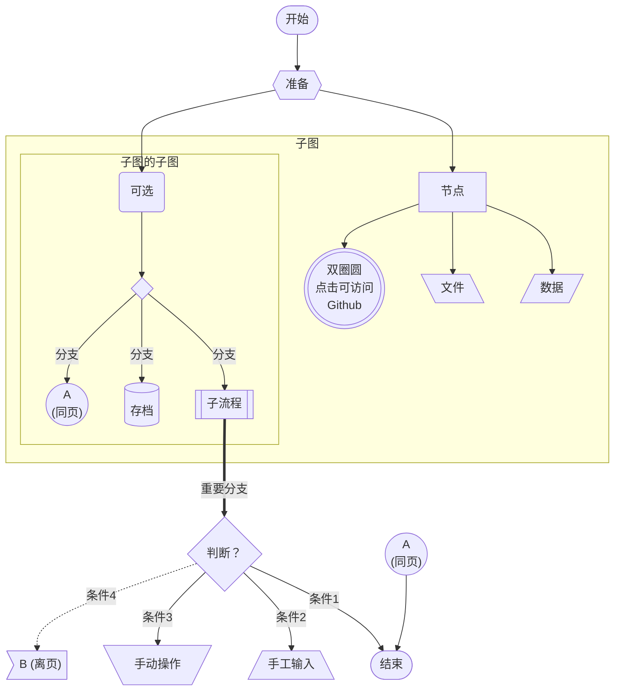
```mermaid
flowchart TB
%% 图的方向说明
%% LR：从左到图，RL：从右到左，TB：从上到下，BT：从下到上

%% 连续连接
START([开始])
START --> pre1{{准备}} --> node2[节点]
pre1 --> node1(可选)

subgraph 子图
  subgraph 子图的子图
    %% 一对多
    node1 --> join1{ }
    join1 --> |分支|groud1[[子流程]] & database[(存档)] & inpage1(("A<br>(同页)"))
    %% click clickable "#Mermaid 的状态机图"
  end  	
node2 --> data1[/数据/]
node2 --> data2[\文件\]
node2 --> data3(((双圈圆<br>点击可访问<br>Github)))
click data3 "https://www.github.com" _blank
end

%% this is a comment

groud1 ==> |重要分支|cond1{"判断？"}
cond1 --> |条件1|END
cond1 --> |条件2|B[/手工输入\]
cond1 --> |条件3|B2[\手动操作/]
cond1 -.-> |条件4|outpage2>"B (离页)"]

inpage2(("A<br>(同页)")) --> END
END([结束])
```

*==分支流程（接续上图）==*

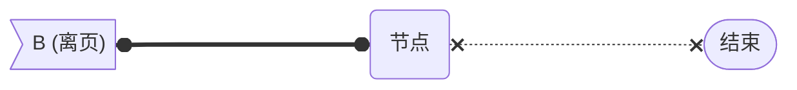
```mermaid
flowchart LR
outpage2>"B (离页)"] o=====o node2(节点) x-....-x END([结束])
```

> ###### 查看完整画图脚本示例
>
> ````流程图的画图脚本示例
> ```mermaid
> flowchart TB
> %% 图的方向说明
> %% LR：从左到图，RL：从右到左，TB：从上到下，BT：从下到上
> 
> %% 连续连接
> START([开始])
> START--> pre1{{准备}} --> node2[节点]
> pre1 --> node1(可选)
> 
> subgraph 子图
> subgraph 子图的子图
> %% 一对多
> node1 --> join1{ }
>  join1 --> |分支|groud1[[子流程]] & database[(存档)] & inpage1(("A<br>(同页)"))
>  %% click clickable "#Mermaid 的状态机图"
> end  	
> node2 --> data1[/数据/]
> node2 --> data2[\文件\]
> node2 --> data3(((双圈圆<br>点击可访问<br>Github)))
> click data3 "https://www.github.com" _blank
> end
> 
> %% this is a comment
> 
> groud1 ==> |重要分支|cond1{"判断？"}
> cond1 --> |条件1|END
> cond1 --> |条件2|B[/手工输入\]
> cond1 --> |条件3|B2[\手动操作/]
> cond1 -.-> |条件4|outpage2>"B (离页)"]
> 
> inpage2(("A<br>(同页)")) --> END
> END([结束])
> ```
> ````
> [<kbd>更多官方教程 </kbd>](https://mermaid.js.org/syntax/flowchart.html)

###### 关于所支持的 FontAwesome 版本

更多 FontAwesome 图标库及标识代码参考 - [详情](https://fontawesome.com.cn/v5)

###### 流程图扩展应用说明

VLOOK™ 针对流程图中特定的节点类型进行扩展，实现重绘为不同的样式，具体如下：

*==流程图特定标识应用说明==*

| **应用建议** |    节点形状    | 说明                                                         |
| :----------: | :------------: | ------------------------------------------------------------ |
|  开始、结束  | 体育场（药丸） | 节点别名使用以下 VLOOK™ 的命名规范，会呈现出特定的样式（具体呈现效果见上图）：<br>- **开始**：命名为 `START` ，如：`START([开始])`<br>- **结束**：命名为 `END` ，如： `END([结束])` |
|   同页符号   |      圆形      | 节点别名使用以下 VLOOK™ 的命名规范，会呈现出特定的样式（具体呈现效果见上图）：<br>以 `inpage` 为前缀，如： `inpageA1((A))` |
|   离页符号   |      旗形      | 节点别名使用以下 VLOOK™ 的命名规范，会呈现出特定的样式（具体呈现效果见上图）：<br>以 `outpage` 为前缀，如： `inpageB1((B))` |

## 分角色流程图

*==用流程图模的泳道图==*

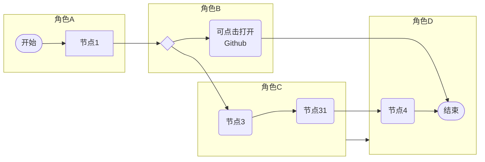
```mermaid
flowchart LR
%% 图的方向说明
%% LR：从左到图，RL：从右到左，TB：从上到下，BT：从下到上

%% 角色A 相关的流程节点
subgraph 角色A
  START([开始]) --> node1[节点1]
end

%% 角色B 相关的流程节点
subgraph 角色B
  node1 --> join1{ } --> node2("可点击打开<br>Github")
  click node2 "https://www.github.com" _blank
end
node2 --> END

%% 角色C 相关的流程节点
subgraph 角色C
	direction BT
  join1 --> node3(节点3) --> node31(节点31)
end

%% 角色D 相关的流程节点
subgraph 角色D
  node31 --> node4(节点4) --> END
end

角色C --> 角色D

END([结束])
```

> ###### 查看完整画图脚本示例
>
> ````分角色流程图的画图脚本示例
>```mermaid
> flowchart LR
> %% 图的方向说明
> %% LR：从左到图，RL：从右到左，TB：从上到下，BT：从下到上
> 
> %% 角色A 相关的流程节点
> subgraph 角色A
> START([开始]) --> node1[节点1]
> end
> 
> %% 角色B 相关的流程节点
> subgraph 角色B
> node1 --> join1{ } --> node2("可点击打开<br>Github")
> click node2 "https://www.github.com" _blank
> end
> node2 --> END
> 
> %% 角色C 相关的流程节点
> subgraph 角色C
> 	direction BT
> join1 --> node3(节点3) --> node31(节点31)
> end
> 
> %% 角色D 相关的流程节点
> subgraph 角色D
> node31 --> node4(节点4) --> END
> end
> 
> 角色C --> 角色D
> 
> END([结束])
> ```
> ````
> [<kbd>更多官方教程 </kbd>](https://mermaid.js.org/syntax/flowchart.html)

## 顺序图

*==顺序图（也称：时序图）==*

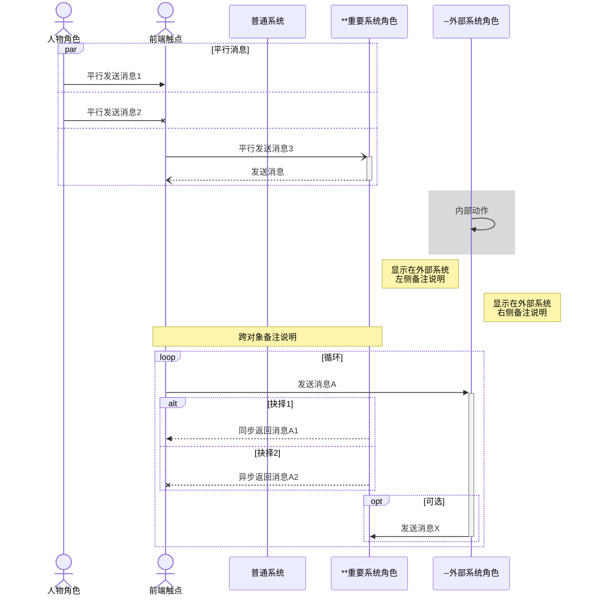
```mermaid
sequenceDiagram
%% 设置显示消息的自动编号

actor User as 人物角色
actor Client as 前端触点
participant MP as 普通系统
participant Server as **重要系统角色
participant Extend as --外部系统角色

par 平行消息
	User ->> Client: 平行发送消息1
and
	User -x Client: 平行发送消息2
and
  Client -)+ Server: 平行发送消息3
  Server --)- Client: 发送消息
end

%% 设置区域高亮
rect rgba(128, 128, 128, 0.3)
	Extend ->> Extend: 内部动作
end

Note left of Extend: 显示在外部系统<br>左侧备注说明
Note right of Extend: 显示在外部系统<br>右侧备注说明
Note over Client,Server: 跨对象备注说明
loop 循环
	Client ->>+ Extend: 发送消息A
	alt 抉择1
		Server -->> Client: 同步返回消息A1
	else 抉择2
		Server --X Client: 异步返回消息A2
	end
	opt 可选
		Extend ->>- Server: 发送消息X
	end
end
```

> ###### 查看完整画图脚本示例
>
> ````顺序图的画图脚本示例
>```mermaid
> sequenceDiagram
> %% 设置显示消息的自动编号
> 
> actor User as 人物角色
> actor Client as 前端触点
> participant MP as 普通系统
> participant Server as **重要系统角色
> participant Extend as --外部系统角色
> 
> par 平行消息
> 	User ->> Client: 平行发送消息1
> and
> 	User -x Client: 平行发送消息2
> and
> Client -)+ Server: 平行发送消息3
> Server --)- Client: 发送消息
> end
>   
>   %% 设置区域高亮
> rect rgba(128, 128, 128, 0.3)
> 	Extend ->> Extend: 内部动作
> end
> 
> Note left of Extend: 显示在外部系统<br>左侧备注说明
> Note right of Extend: 显示在外部系统<br>右侧备注说明
> Note over Client,Server: 跨对象备注说明
> loop 循环
> 	Client ->>+ Extend: 发送消息A
> 	alt 抉择1
> 		Server -->> Client: 同步返回消息A1
> 	else 抉择2
> 		Server --X Client: 异步返回消息A2
> 	end
> 	opt 可选
> 		Extend ->>- Server: 发送消息X
> 	end
> end
> ```
> ````
> [<kbd>更多官方教程 </kbd>](https://mermaid.js.org/syntax/sequenceDiagram.html)

###### 说明

1. 针对顺序图的不同图元应用，重绘不同的外观、形状；
2. 针对 `opt` / `alt` / `loop` / `par` 标签设置不同的外观、标题位置。
3. 建议使用实体别名，以提高画图脚本的复用度和可维护性；
4. 支持三类消息线条：同步请求消息、异步请求消息、返回消息；
5. 角色在标准的一类样式的基础上，增加三类扩展的样式，在输出HTML后应用 [VLOOK™](https://github.com/madmaxchow/VLOOK) 插件后渲染为不同的样式：
   - **重要系统/角色**：在角色名称前添加两个星号 `**` ，如 `**后端支撑系统名称`
   - **外部系统/角色**：在角色名称前添加两个减号 `--` ，如 `--外部系统名称`
   - **前端触点/角色**：在角色名称前添加 at 符号 `@` ，如 `@小程序名称`
   
     > *`推荐`*_~Gn~_ 从 Typora 1.7.x 版本后建议使用 Mermaid 建议的 `actor` 代替 `participant`
6. 支持对三类标签分组在输出 HTML 后应用 [VLOOK™](https://github.com/madmaxchow/VLOOK) 插件渲染为不同的样式：
   - `loop...end` ：循环
   - `opt...end` ：可选
   - `alt..else...end` ：条件选择（alt = 情景1，else = 情景2）
   - `par...end` ：平行
7. 支持备注说明。

## 状态机图

### 流程图扩展的状态机图

*==流程图扩展的状态机图（兼容性较高）==*

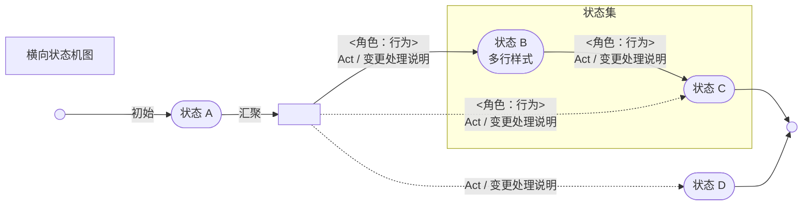
```mermaid
flowchart LR
横向状态机图
%% 图的方向说明
%% LR：从左到图，RL：从右到左，TB：从上到下，BT：从下到上

%% 正常情况
INIT(( )) -->	|初始|A([状态 A])
%% joinv 表示汇聚为竖向样式，join 表示汇聚为横向样式
A --> |汇聚|joinv1[ ]
joinv1 --> |"<角色：行为>"<br>Act / 变更处理说明|B([状态 B\n多行样式])
subgraph 状态集
	B --> |"<角色：行为>"<br>Act / 变更处理说明|C([状态 C])
end
C --> FINAL

%% 异常情况
joinv1 -.-> |"<角色：行为>"<br>Act / 变更处理说明|C
joinv1 -.-> |Act / 变更处理说明|D([状态 D])
D --> FINAL
FINAL(( ))
```

*==竖向样式==*

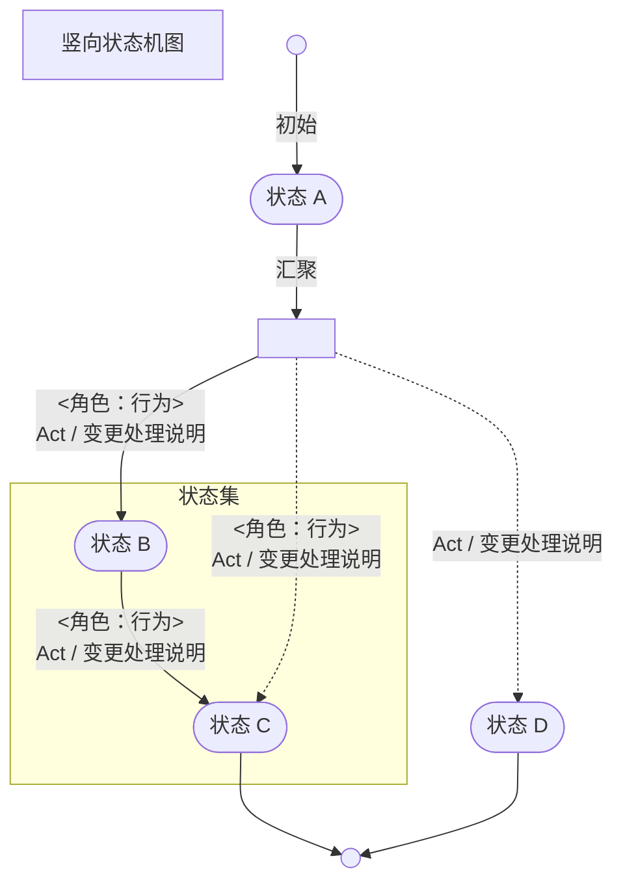
```mermaid
flowchart TB
竖向状态机图
%% 图的方向说明
%% LR：从左到图，RL：从右到左，TB：从上到下，BT：从下到上

%% 正常情况
INIT(( )) -->	|初始|A([状态 A])
%% joinv 表示汇聚为竖向样式，join 表示汇聚为横向样式
A --> |汇聚|join1[ ]
join1 --> |"<角色：行为>"<br>Act / 变更处理说明|B([状态 B])
subgraph 状态集
	B --> |"<角色：行为>"<br>Act / 变更处理说明|C([状态 C])
end
C --> FINAL

%% 异常情况
join1 -.-> |"<角色：行为>"<br>Act / 变更处理说明|C
join1 -.-> |Act / 变更处理说明|D([状态 D])
D --> FINAL
FINAL(( ))
```

> ###### 查看完整画图脚本示例
>
> ````流程图扩展的状态机图的画图脚本示例
>```mermaid
> flowchart LR
> 横向状态机图
> %% 图的方向说明
> %% LR：从左到图，RL：从右到左，TB：从上到下，BT：从下到上
> 
> %% 正常情况
> INIT(( )) -->	|初始|A([状态 A])
> %% joinv 表示汇聚为竖向样式，join 表示汇聚为横向样式
> A --> |汇聚|joinv1[ ]
> joinv1 --> |"<角色：行为>"<br>Act / 变更处理说明|B([状态 B\n多行样式])
> subgraph 状态集
> 	B --> |"<角色：行为>"<br>Act / 变更处理说明|C([状态 C])
> end
> C --> FINAL
> 
> %% 异常情况
> joinv1 -.-> |"<角色：行为>"<br>Act / 变更处理说明|C
> joinv1 -.-> |Act / 变更处理说明|D([状态 D])
> D --> FINAL
> FINAL(( ))
> ```
> ````
> [<kbd>更多官方教程 </kbd>](https://mermaid.js.org/syntax/flowchart.html)

###### 状态机图扩展应用说明

VLOOK™ 针对流程图中特定的节点类型进行扩展，实现以流程图为基础的状态机图能渲染为不同的样式，具体如下：

*==状态图特定标识应用说明==*

| **应用建议** | 节点形状 | 说明                                                         |
| :----------: | :------: | ------------------------------------------------------------ |
|  初始、终止  |   圆形   | 节点别名使用以下 VLOOK™ 的命名规范，会呈现出特定的样式（具体呈现效果见上图）：<br>- **初始**：命名为 `INIT` ，如：`INIT(( ))`<br>- **结束**：命名为 `FINAL` ，如： `FINAL(( ))` |
|  汇聚、转换  |   圆形   | 节点别名使用以下 VLOOK™ 的命名规范，会呈现出特定的样式（具体呈现效果见上图）：<br>以 `join` 为前缀，如： `join1(( ))` |
|      :       |   菱形   | 以 `join` 为前缀，如： `join1{ }`                            |
|      :       |   矩形   | 以 `join` 或 `joinv` 为前缀，一般用于状态机图中，<br>如： `join1[ ]` （默认横向）， `joinv1[ ]` （竖向） |
|   同页符号   |    :     | 节点别名使用以下 VLOOK™ 的命名规范，会呈现出特定的样式（具体呈现效果见上图）：<br>以 `inpage` 为前缀，如： `inpageA1((A))` |
|   离页符号   |   旗形   | 节点别名使用以下 VLOOK™ 的命名规范，会呈现出特定的样式（具体呈现效果见上图）：<br>以 `outpage` 为前缀，如： `inpageB1((B))` |

### 标准状态机图

*==新版标准状态机图 (1)==*

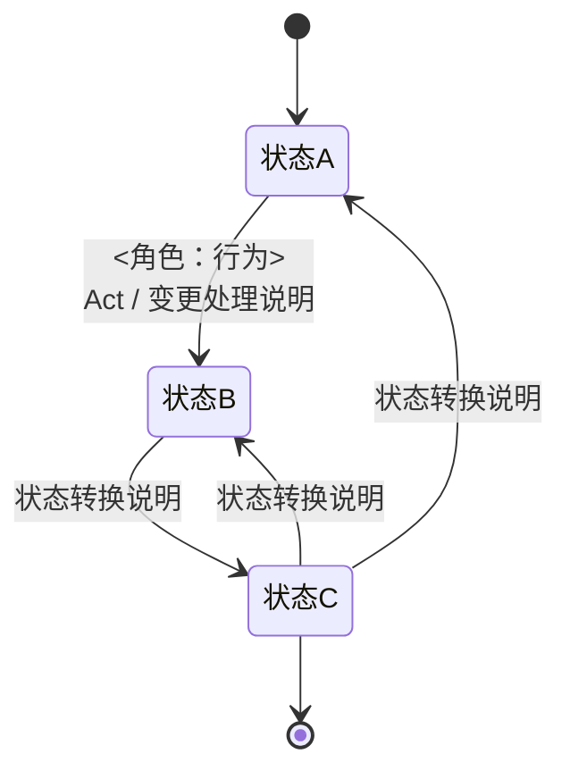
```mermaid
stateDiagram
[*] --> 状态A
状态A --> 状态B : <角色：行为><br>Act / 变更处理说明
状态B --> 状态C : 状态转换说明
状态C --> 状态B : 状态转换说明
状态C --> 状态A : 状态转换说明
状态C --> [*]
```

> ###### 查看完整画图脚本示例
>
> ````状态机图（1）的画图脚本示例
>```mermaid
> stateDiagram
> [*] --> 状态A
> 状态A --> 状态B : <角色：行为><br>Act / 变更处理说明
> 状态B --> 状态C : 状态转换说明
> 状态C --> 状态B : 状态转换说明
> 状态C --> 状态A : 状态转换说明
> 状态C --> [*]
> ```
> ````
> [<kbd>更多官方教程 </kbd>](https://mermaid.js.org/syntax/stateDiagram.html)


*==新版标准状态机图 (2)==*

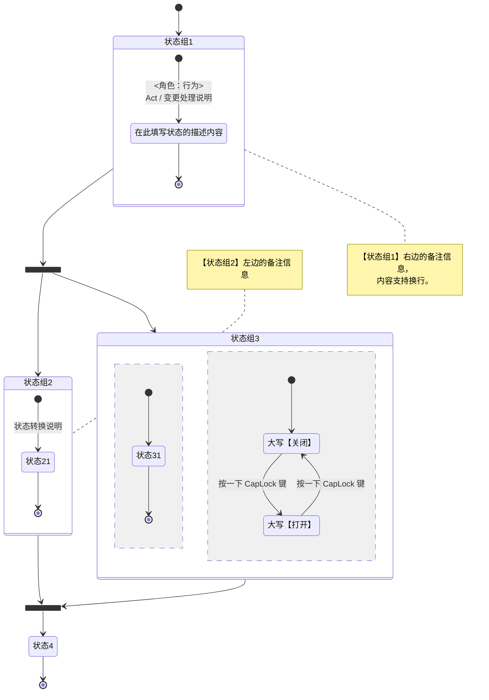
```mermaid
stateDiagram
state fork_state <<fork>>

[*] --> 状态组1
状态组1 --> fork_state
fork_state --> 状态组2
fork_state --> 状态组3

note right of 状态组1
    【状态组1】右边的备注信息，
    内容支持换行。
end note
state 状态组1 {
    状态11 : 在此填写状态的描述内容
    [*] --> 状态11 : <角色：行为><br>Act / 变更处理说明
    状态11 --> [*]
}

note left of 状态组2 : 【状态组2】左边的备注信息
state 状态组2 {
    [*] --> 状态21: 状态转换说明
    状态21 --> [*]
}

%% 可以编写注释（以两个英文百分号开头)
state 状态组3 {
    [*] --> 状态31
    状态31 --> [*]
    --
    [*] --> 大写【关闭】
    大写【关闭】 --> 大写【打开】 : 按一下 CapLock 键
    大写【打开】 --> 大写【关闭】 : 按一下 CapLock 键
}

state join_state <<join>>

状态组2 --> join_state
状态组3 --> join_state
join_state --> 状态4
状态4 --> [*]
```

> ###### 查看完整画图脚本示例
>
> ````状态机图（2）的画图脚本示例
> ```mermaid
> stateDiagram
> state fork_state <<fork>>
> 
> [*] --> 状态组1
> 状态组1 --> fork_state
> fork_state --> 状态组2
> fork_state --> 状态组3
> 
> note right of 状态组1
> 【状态组1】右边的备注信息，
> 内容支持换行。
>  end note
>  state 状态组1 {
> 状态11 : 在此填写状态的描述内容
> [*] --> 状态11 : <角色：行为><br>Act / 变更处理说明
>  状态11 --> [*]
>  }
>  
> note left of 状态组2 : 【状态组2】左边的备注信息
> state 状态组2 {
> [*] --> 状态21: 状态转换说明
> 状态21 --> [*]
>  }
>  
> %% 可以编写注释（以两个英文百分号开头)
> state 状态组3 {
> [*] --> 状态31
> 状态31 --> [*]
>  --
>  [*] --> 大写【关闭】
>  大写【关闭】 --> 大写【打开】 : 按一下 CapLock 键
>  大写【打开】 --> 大写【关闭】 : 按一下 CapLock 键
>  }
>  
> state join_state <<join>>
> 
> 状态组2 --> join_state
> 状态组3 --> join_state
> join_state --> 状态4
> 状态4 --> [*]
> ```
> ````

## 类图

*==类图示例 (1)==*

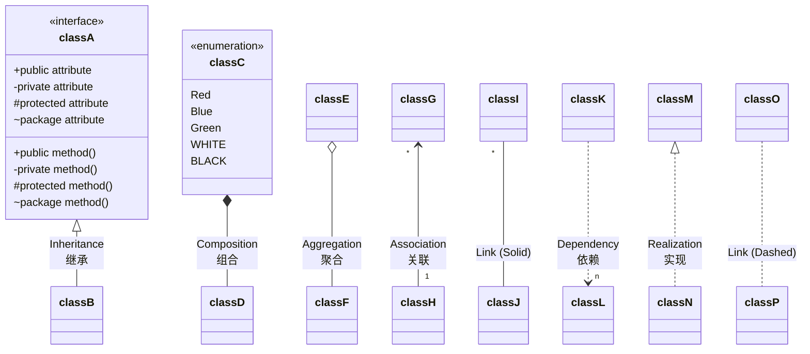
```mermaid
classDiagram
classA <|-- classB : Inheritance<br>继承
classC *-- classD : Composition<br>组合
classE o-- classF : Aggregation<br>聚合
classG "*" <-- "1" classH : Association<br>关联
classI "*" -- classJ : Link (Solid)
classK ..> "n" classL : Dependency<br>依赖
classM <|.. classN : Realization<br>实现
classO .. classP : Link (Dashed)

class classA~Class~{
    <<interface>>
    +public attribute
    -private attribute
    #protected attribute
    ~package attribute
    +public method()
    -private method()
    #protected method()
    ~package method()
}

class classC{
    <<enumeration>>
    Red
    Blue
    Green
    WHITE
    BLACK
}
```

> ###### 查看完整画图脚本示例
>
> ````类图示例 (1) 的画图脚本示例
>```mermaid
> classDiagram
> classA <|-- classB : Inheritance<br>继承
> classC *-- classD : Composition<br>组合
> classE o-- classF : Aggregation<br>聚合
> classG "*" <-- "1" classH : Association<br>关联
> classI "*" -- classJ : Link (Solid)
> classK ..> "n" classL : Dependency<br>依赖
> classM <|.. classN : Realization<br>实现
> classO .. classP : Link (Dashed)
> 
> class classA~Class~{
>     <<interface>>
>     +public attribute
>      -private attribute
>      #protected attribute
>      ~package attribute
>      +public method()
>      -private method()
>      #protected method()
>      ~package method()
>  }
>  
> class classC{
>     <<enumeration>>
>     Red
>      Blue
>      Green
>      WHITE
>      BLACK
>  }
>  ```
> ````
> [<kbd>更多官方教程 </kbd>](https://mermaid.js.org/syntax/classDiagram.html)


*==类图示例 (2)==*

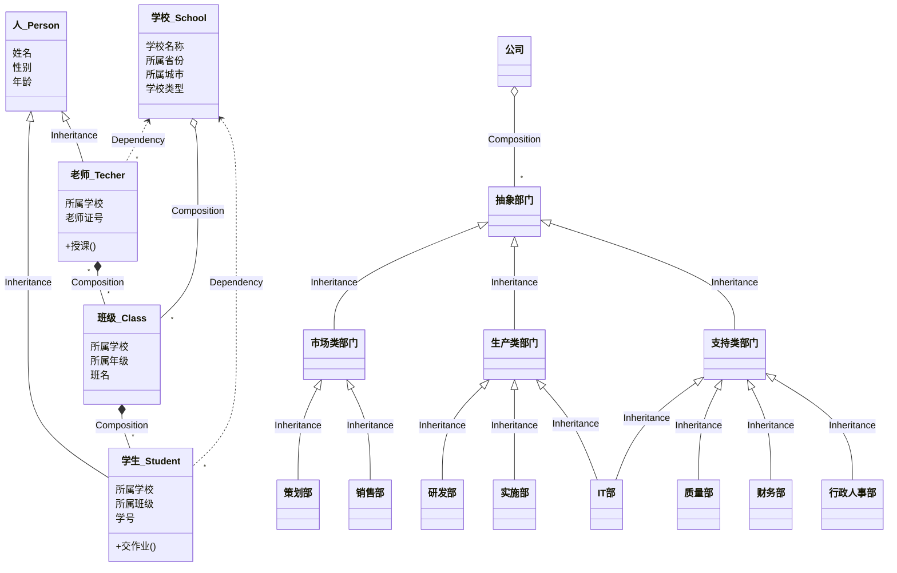
```mermaid
classDiagram

人_Person <|-- 学生_Student : Inheritance
人_Person <|-- 老师_Techer : Inheritance
老师_Techer "*" *-- "*" 班级_Class : Composition
班级_Class *-- "*" 学生_Student : Composition
学校_School <.. "*" 老师_Techer : Dependency
学校_School o-- "*" 班级_Class : Composition
学校_School <.. "*" 学生_Student : Dependency

class 人_Person {
  姓名
  性别
  年龄
}
class 学校_School {
  学校名称
  所属省份
  所属城市
  学校类型
}
class 学生_Student {
  所属学校
  所属班级
  学号
  +交作业()
}
class 老师_Techer {
  所属学校
  老师证号
  +授课()
}
class 班级_Class {
  所属学校
  所属年级
  班名
}

公司 o-- "*" 抽象部门 : Composition
抽象部门 <|-- 市场类部门 : Inheritance
市场类部门 <|-- 策划部 : Inheritance
市场类部门 <|-- 销售部 : Inheritance
抽象部门 <|-- 生产类部门 : Inheritance
生产类部门 <|-- 研发部 : Inheritance
生产类部门 <|-- 实施部 : Inheritance
生产类部门 <|-- IT部 : Inheritance
抽象部门 <|-- 支持类部门 : Inheritance
支持类部门 <|-- 质量部 : Inheritance
支持类部门 <|-- 财务部 : Inheritance
支持类部门 <|-- 行政人事部 : Inheritance
支持类部门 <|-- IT部 : Inheritance
```

> ###### 查看完整画图脚本示例
>
> ````类图示例 (2) 的画图脚本示例
> ```mermaid
> classDiagram
> 
> 人_Person <|-- 学生_Student : Inheritance
> 人_Person <|-- 老师_Techer : Inheritance
> 老师_Techer "*" *-- "*" 班级_Class : Composition
> 班级_Class *-- "*" 学生_Student : Composition
> 学校_School <.. "*" 老师_Techer : Dependency
> 学校_School o-- "*" 班级_Class : Composition
> 学校_School <.. "*" 学生_Student : Dependency
> 
> class 人_Person {
>   姓名
>   性别
>   年龄
> }
> class 学校_School {
>   学校名称
>   所属省份
>   所属城市
>   学校类型
> }
> class 学生_Student {
>   所属学校
>   所属班级
>   学号
>   +交作业()
> }
> class 老师_Techer {
>   所属学校
>   老师证号
>   +授课()
> }
> class 班级_Class {
>   所属学校
>   所属年级
>   班名
> }
> 
> 公司 o-- "*" 抽象部门 : Composition
> 抽象部门 <|-- 市场类部门 : Inheritance
> 市场类部门 <|-- 策划部 : Inheritance
> 市场类部门 <|-- 销售部 : Inheritance
> 抽象部门 <|-- 生产类部门 : Inheritance
> 生产类部门 <|-- 研发部 : Inheritance
> 生产类部门 <|-- 实施部 : Inheritance
> 生产类部门 <|-- IT部 : Inheritance
> 抽象部门 <|-- 支持类部门 : Inheritance
> 支持类部门 <|-- 质量部 : Inheritance
> 支持类部门 <|-- 财务部 : Inheritance
> 支持类部门 <|-- 行政人事部 : Inheritance
> 支持类部门 <|-- IT部 : Inheritance
> ```
> ````

## 实体关系图

*==实体关系图（ER图）==*

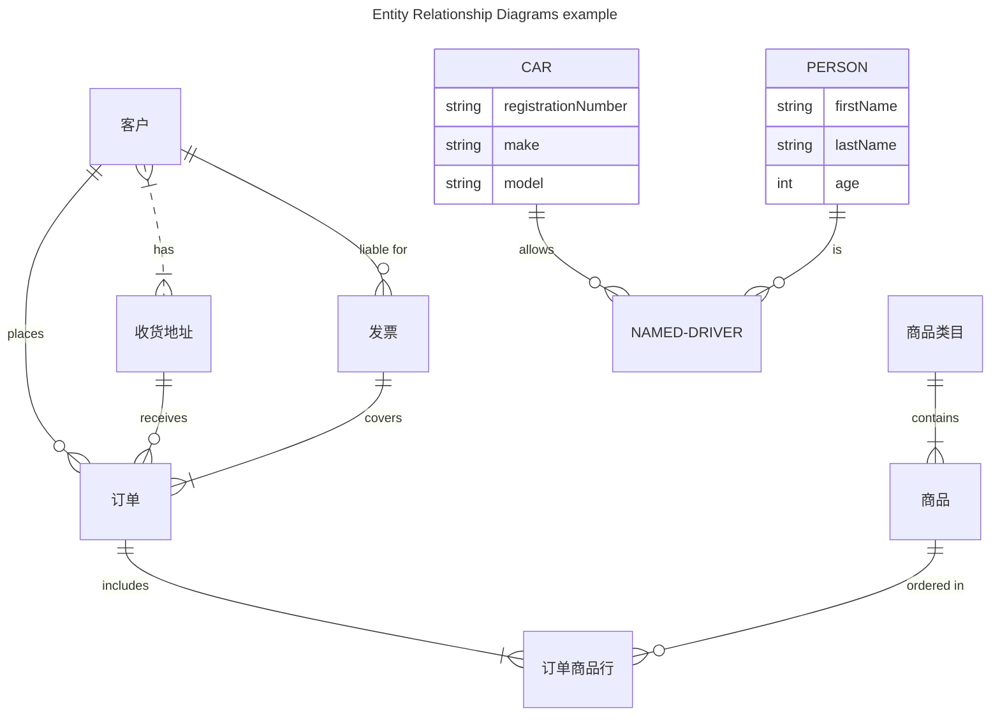
```mermaid
---
title: Entity Relationship Diagrams example
---
erDiagram
	CUSTOMER["客户"]
	ORDER["订单"]
	DELIVERY-ADDRESS["收货地址"]
	INVOICE["发票"]
	DELIVERY-ADDRESS["收货地址"]
	PRODUCT-CATEGORY["商品类目"]
	PRODUCT["商品"]
	ORDER-ITEM["订单商品行"]
	
    CUSTOMER }|..|{ DELIVERY-ADDRESS : has
    CUSTOMER ||--o{ ORDER : places
    CUSTOMER ||--o{ INVOICE : "liable for"
    DELIVERY-ADDRESS ||--o{ ORDER : receives
    INVOICE ||--|{ ORDER : covers
    ORDER ||--|{ ORDER-ITEM : includes
    PRODUCT-CATEGORY ||--|{ PRODUCT : contains
    PRODUCT ||--o{ ORDER-ITEM : "ordered in"
    
    CAR ||--o{ NAMED-DRIVER : allows
    CAR {
        string registrationNumber
        string make
        string model
    }
    PERSON ||--o{ NAMED-DRIVER : is
    PERSON {
        string firstName
        string lastName
        int age
    }
```

> ###### 查看完整画图脚本示例
>
> ````实体关系图（ER图）的画图脚本示例
> ```mermaid
> ---
> title: Entity Relationship Diagrams example
> ---
> erDiagram
> 	CUSTOMER["客户"]
> 	ORDER["订单"]
> 	DELIVERY-ADDRESS["收货地址"]
> 	
>     CUSTOMER }|..|{ DELIVERY-ADDRESS : has
>     CUSTOMER ||--o{ ORDER : places
>     CUSTOMER ||--o{ INVOICE : "liable for"
>     DELIVERY-ADDRESS ||--o{ ORDER : receives
>     INVOICE ||--|{ ORDER : covers
>     ORDER ||--|{ ORDER-ITEM : includes
>     PRODUCT-CATEGORY ||--|{ PRODUCT : contains
>     PRODUCT ||--o{ ORDER-ITEM : "ordered in"
>     
>     CAR ||--o{ NAMED-DRIVER : allows
>     CAR {
>         string registrationNumber
>         string make
>         string model
>     }
>     PERSON ||--o{ NAMED-DRIVER : is
>     PERSON {
>         string firstName
>         string lastName
>         int age
>     }
> ```
> ````
>
> [<kbd>更多官方教程 </kbd>](https://mermaid.js.org/syntax/entityRelationshipDiagram.html)

## 方块图

*==方块图示例==*

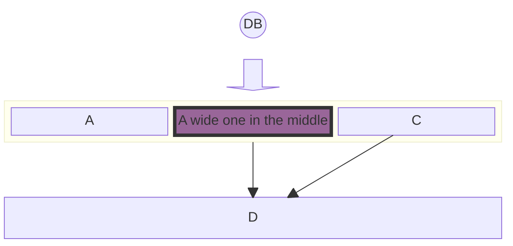
```mermaid
block-beta
columns 1
  db(("DB"))
  blockArrowId6<["&nbsp;&nbsp;&nbsp;"]>(down)
  block:ID
    A
    B["A wide one in the middle"]
    C
  end
  space
  D
  ID --> D
  C --> D
  style B fill:#969,stroke:#333,stroke-width:4px

```

> ###### 查看完整画图脚本示例
>
> ````方块图脚本示例
> ```mermaid
> block-beta
> columns 1
>   db(("DB"))
>   blockArrowId6<["&nbsp;&nbsp;&nbsp;"]>(down)
>   block:ID
>     A
>     B["A wide one in the middle"]
>     C
>   end
>   space
>   D
>   ID --> D
>   C --> D
>   style B fill:#969,stroke:#333,stroke-width:4px
> ```
> ````
>
> [<kbd>更多官方教程 </kbd>](https://mermaid.js.org/syntax/block.html)

## 四象限图

*==四象限图示例==*

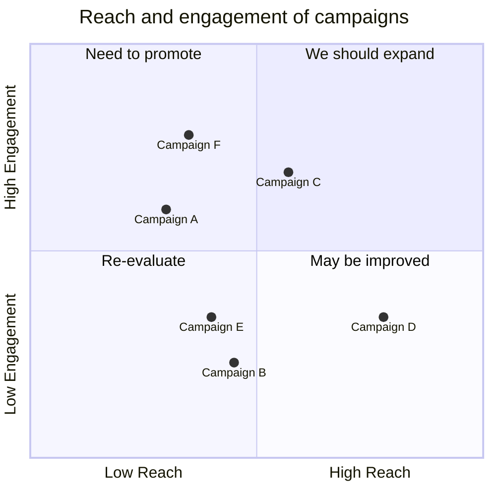
```mermaid
quadrantChart
    title Reach and engagement of campaigns
    x-axis Low Reach --> High Reach
    y-axis Low Engagement --> High Engagement
    quadrant-1 We should expand
    quadrant-2 Need to promote
    quadrant-3 Re-evaluate
    quadrant-4 May be improved
    Campaign A: [0.3, 0.6]
    Campaign B: [0.45, 0.23]
    Campaign C: [0.57, 0.69]
    Campaign D: [0.78, 0.34]
    Campaign E: [0.40, 0.34]
    Campaign F: [0.35, 0.78]
```

> ###### 查看完整画图脚本示例
>
> ````四象限图脚本示例
>```mermaid
> quadrantChart
>  title Reach and engagement of campaigns
>  x-axis Low Reach --> High Reach
>     y-axis Low Engagement --> High Engagement
>     quadrant-1 We should expand
>     quadrant-2 Need to promote
>     quadrant-3 Re-evaluate
>     quadrant-4 May be improved
>     Campaign A: [0.3, 0.6]
>     Campaign B: [0.45, 0.23]
>     Campaign C: [0.57, 0.69]
>     Campaign D: [0.78, 0.34]
>     Campaign E: [0.40, 0.34]
>     Campaign F: [0.35, 0.78]
>    ```
>    ````
> [<kbd>更多官方教程 </kbd>](https://mermaid.js.org/syntax/quadrantChart.html)

## 数据包图

*==数据包图示例==*

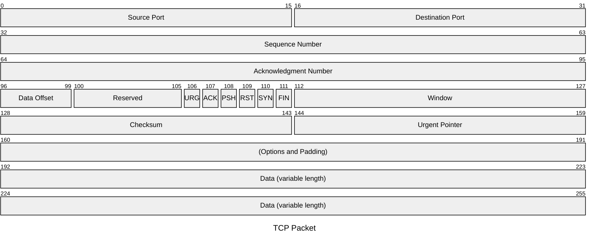
```mermaid
---
title: "TCP Packet"
---
packet-beta
0-15: "Source Port"
16-31: "Destination Port"
32-63: "Sequence Number"
64-95: "Acknowledgment Number"
96-99: "Data Offset"
100-105: "Reserved"
106: "URG"
107: "ACK"
108: "PSH"
109: "RST"
110: "SYN"
111: "FIN"
112-127: "Window"
128-143: "Checksum"
144-159: "Urgent Pointer"
160-191: "(Options and Padding)"
192-255: "Data (variable length)"

```

> ###### 查看完整画图脚本示例
>
> ```数据包图脚本示例
> ---
> title: "TCP Packet"
> ---
> packet-beta
> 0-15: "Source Port"
> 16-31: "Destination Port"
> 32-63: "Sequence Number"
> 64-95: "Acknowledgment Number"
> 96-99: "Data Offset"
> 100-105: "Reserved"
> 106: "URG"
> 107: "ACK"
> 108: "PSH"
> 109: "RST"
> 110: "SYN"
> 111: "FIN"
> 112-127: "Window"
> 128-143: "Checksum"
> 144-159: "Urgent Pointer"
> 160-191: "(Options and Padding)"
> 192-255: "Data (variable length)"
> ```
>
> [<kbd>更多官方教程 </kbd>](https://mermaid.js.org/syntax/packet.html)

## 需求图

*==需求图示例==*

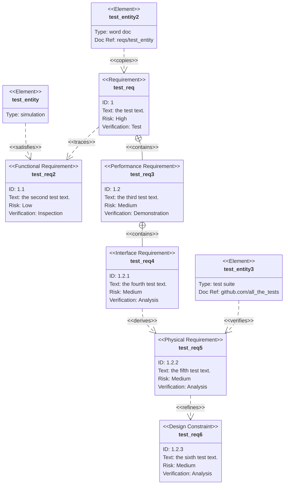
```mermaid
requirementDiagram

requirement test_req {
  id: 1
  text: the test text.
  risk: high
  verifymethod: test
}

functionalRequirement test_req2 {
  id: 1.1
  text: the second test text.
  risk: low
  verifymethod: inspection
}

performanceRequirement test_req3 {
  id: 1.2
  text: the third test text.
  risk: medium
  verifymethod: demonstration
}

interfaceRequirement test_req4 {
  id: 1.2.1
  text: the fourth test text.
  risk: medium
  verifymethod: analysis
}

physicalRequirement test_req5 {
  id: 1.2.2
  text: the fifth test text.
  risk: medium
  verifymethod: analysis
}

designConstraint test_req6 {
  id: 1.2.3
  text: the sixth test text.
  risk: medium
  verifymethod: analysis
}

element test_entity {
  type: simulation
}

element test_entity2 {
  type: word doc
  docRef: reqs/test_entity
}

element test_entity3 {
  type: "test suite"
  docRef: github.com/all_the_tests
}

test_entity - satisfies -> test_req2
test_req - traces -> test_req2
test_req - contains -> test_req3
test_req3 - contains -> test_req4
test_req4 - derives -> test_req5
test_req5 - refines -> test_req6
test_entity3 - verifies -> test_req5
test_req <- copies - test_entity2
```

> ###### 查看完整画图脚本示例
>
> ````需求图的画图脚本示例
>```mermaid
> requirementDiagram
> 
> requirement test_req {
> id: 1
> text: the test text.
> risk: high
> verifymethod: test
> }
> 
> functionalRequirement test_req2 {
> id: 1.1
> text: the second test text.
> risk: low
> verifymethod: inspection
> }
> 
> performanceRequirement test_req3 {
> id: 1.2
> text: the third test text.
> risk: medium
> verifymethod: demonstration
> }
> 
> interfaceRequirement test_req4 {
> id: 1.2.1
> text: the fourth test text.
> risk: medium
> verifymethod: analysis
> }
> 
> physicalRequirement test_req5 {
> id: 1.2.2
> text: the fifth test text.
> risk: medium
> verifymethod: analysis
> }
> 
> designConstraint test_req6 {
> id: 1.2.3
> text: the sixth test text.
> risk: medium
> verifymethod: analysis
> }
> 
> element test_entity {
> type: simulation
> }
> 
> element test_entity2 {
> type: word doc
> docRef: reqs/test_entity
> }
> 
> element test_entity3 {
> type: "test suite"
> docRef: github.com/all_the_tests
> }
> 
> test_entity - satisfies -> test_req2
> test_req - traces -> test_req2
> test_req - contains -> test_req3
> test_req3 - contains -> test_req4
> test_req4 - derives -> test_req5
> test_req5 - refines -> test_req6
> test_entity3 - verifies -> test_req5
> test_req <- copies - test_entity2
> ```
> ````
> [<kbd>更多官方教程 </kbd>](https://mermaid.js.org/syntax/requirementDiagram.html)

## 架构图

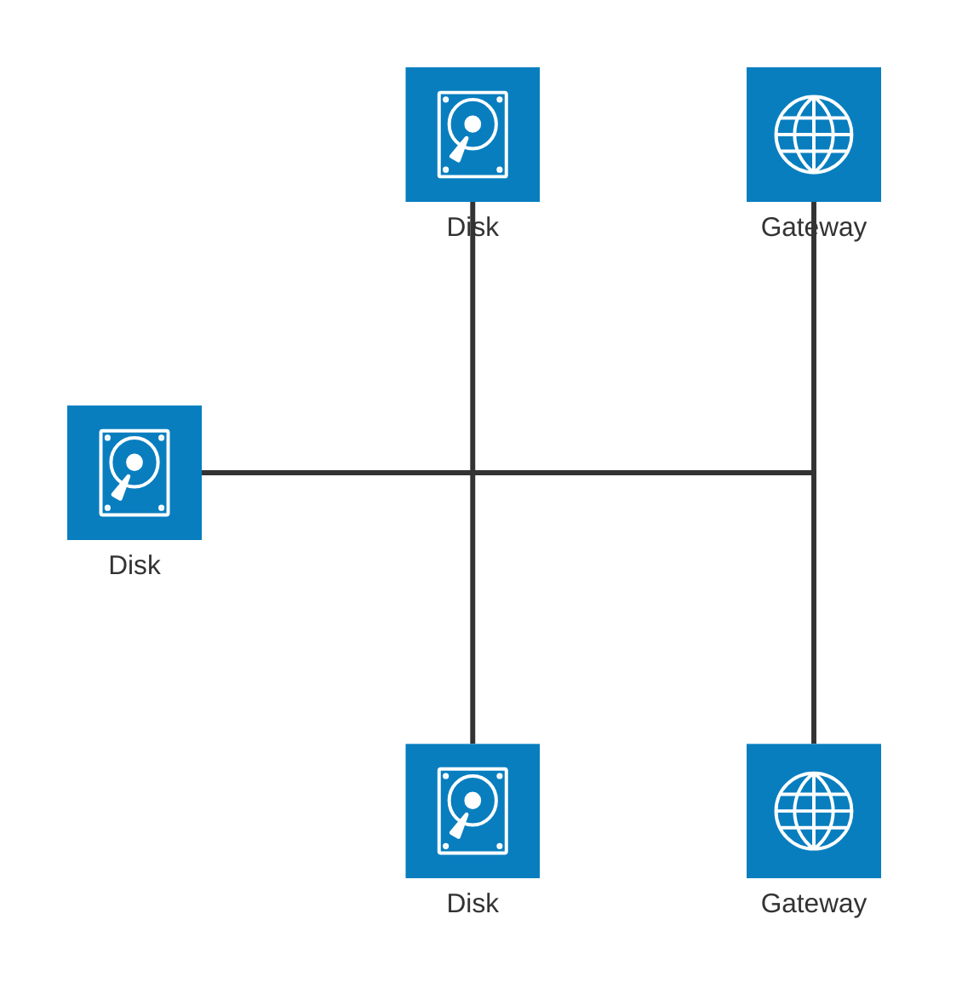
```mermaid
architecture-beta
    service left_disk(disk)[Disk]
    service top_disk(disk)[Disk]
    service bottom_disk(disk)[Disk]
    service top_gateway(internet)[Gateway]
    service bottom_gateway(internet)[Gateway]
    junction junctionCenter
    junction junctionRight

    left_disk:R -- L:junctionCenter
    top_disk:B -- T:junctionCenter
    bottom_disk:T -- B:junctionCenter
    junctionCenter:R -- L:junctionRight
    top_gateway:B -- T:junctionRight
    bottom_gateway:T -- B:junctionRight

```

> ###### 查看完整画图脚本示例
>
> ```架构图示例脚本
> architecture-beta
>     service left_disk(disk)[Disk]
>     service top_disk(disk)[Disk]
>     service bottom_disk(disk)[Disk]
>     service top_gateway(internet)[Gateway]
>     service bottom_gateway(internet)[Gateway]
>     junction junctionCenter
>     junction junctionRight
> 
>     left_disk:R -- L:junctionCenter
>     top_disk:B -- T:junctionCenter
>     bottom_disk:T -- B:junctionCenter
>     junctionCenter:R -- L:junctionRight
>     top_gateway:B -- T:junctionRight
>     bottom_gateway:T -- B:junctionRight
> 
> ```
>
> [<kbd>更多官方教程 </kbd>](https://mermaid.js.org/syntax/architecture.html)

## C4 图

### C4 Context

###### C4 图示例_Context

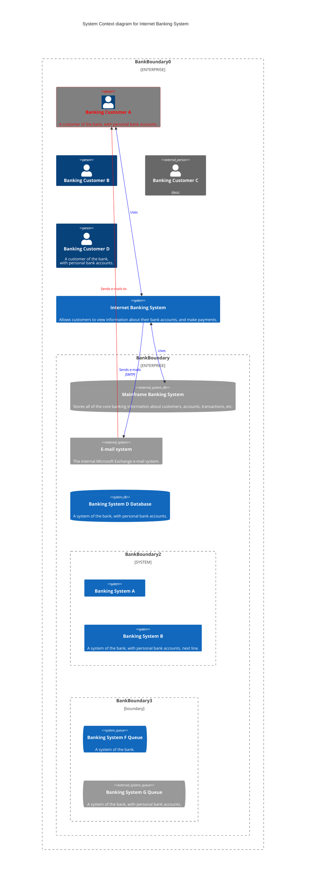
```mermaid
C4Context
      title System Context diagram for Internet Banking System
      Enterprise_Boundary(b0, "BankBoundary0") {
        Person(customerA, "Banking Customer A", "A customer of the bank, with personal bank accounts.")
        Person(customerB, "Banking Customer B")
        Person_Ext(customerC, "Banking Customer C", "desc")

        Person(customerD, "Banking Customer D", "A customer of the bank, <br/> with personal bank accounts.")

        System(SystemAA, "Internet Banking System", "Allows customers to view information about their bank accounts, and make payments.")

        Enterprise_Boundary(b1, "BankBoundary") {

          SystemDb_Ext(SystemE, "Mainframe Banking System", "Stores all of the core banking information about customers, accounts, transactions, etc.")

          System_Boundary(b2, "BankBoundary2") {
            System(SystemA, "Banking System A")
            System(SystemB, "Banking System B", "A system of the bank, with personal bank accounts. next line.")
          }

          System_Ext(SystemC, "E-mail system", "The internal Microsoft Exchange e-mail system.")
          SystemDb(SystemD, "Banking System D Database", "A system of the bank, with personal bank accounts.")

          Boundary(b3, "BankBoundary3", "boundary") {
            SystemQueue(SystemF, "Banking System F Queue", "A system of the bank.")
            SystemQueue_Ext(SystemG, "Banking System G Queue", "A system of the bank, with personal bank accounts.")
          }
        }
      }

      BiRel(customerA, SystemAA, "Uses")
      BiRel(SystemAA, SystemE, "Uses")
      Rel(SystemAA, SystemC, "Sends e-mails", "SMTP")
      Rel(SystemC, customerA, "Sends e-mails to")

      UpdateElementStyle(customerA, $fontColor="red", $bgColor="grey", $borderColor="red")
      UpdateRelStyle(customerA, SystemAA, $textColor="blue", $lineColor="blue", $offsetX="5")
      UpdateRelStyle(SystemAA, SystemE, $textColor="blue", $lineColor="blue", $offsetY="-10")
      UpdateRelStyle(SystemAA, SystemC, $textColor="blue", $lineColor="blue", $offsetY="-40", $offsetX="-50")
      UpdateRelStyle(SystemC, customerA, $textColor="red", $lineColor="red", $offsetX="-50", $offsetY="20")

      UpdateLayoutConfig($c4ShapeInRow="3", $c4BoundaryInRow="1")
```


### C4 Container

###### C4 图示例_Container

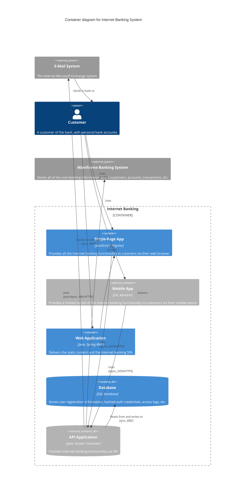
```mermaid
C4Container
    title Container diagram for Internet Banking System

    System_Ext(email_system, "E-Mail System", "The internal Microsoft Exchange system", $tags="v1.0")
    Person(customer, Customer, "A customer of the bank, with personal bank accounts", $tags="v1.0")

    Container_Boundary(c1, "Internet Banking") {
        Container(spa, "Single-Page App", "JavaScript, Angular", "Provides all the Internet banking functionality to cutomers via their web browser")
        Container_Ext(mobile_app, "Mobile App", "C#, Xamarin", "Provides a limited subset of the Internet banking functionality to customers via their mobile device")
        Container(web_app, "Web Application", "Java, Spring MVC", "Delivers the static content and the Internet banking SPA")
        ContainerDb(database, "Database", "SQL Database", "Stores user registration information, hashed auth credentials, access logs, etc.")
        ContainerDb_Ext(backend_api, "API Application", "Java, Docker Container", "Provides Internet banking functionality via API")

    }

    System_Ext(banking_system, "Mainframe Banking System", "Stores all of the core banking information about customers, accounts, transactions, etc.")

    Rel(customer, web_app, "Uses", "HTTPS")
    UpdateRelStyle(customer, web_app, $offsetY="60", $offsetX="90")
    Rel(customer, spa, "Uses", "HTTPS")
    UpdateRelStyle(customer, spa, $offsetY="-40")
    Rel(customer, mobile_app, "Uses")
    UpdateRelStyle(customer, mobile_app, $offsetY="-30")

    Rel(web_app, spa, "Delivers")
    UpdateRelStyle(web_app, spa, $offsetX="130")
    Rel(spa, backend_api, "Uses", "async, JSON/HTTPS")
    Rel(mobile_app, backend_api, "Uses", "async, JSON/HTTPS")
    Rel_Back(database, backend_api, "Reads from and writes to", "sync, JDBC")

    Rel(email_system, customer, "Sends e-mails to")
    UpdateRelStyle(email_system, customer, $offsetX="-45")
    Rel(backend_api, email_system, "Sends e-mails using", "sync, SMTP")
    UpdateRelStyle(backend_api, email_system, $offsetY="-60")
    Rel(backend_api, banking_system, "Uses", "sync/async, XML/HTTPS")
    UpdateRelStyle(backend_api, banking_system, $offsetY="-50", $offsetX="-140")
```


### C4 Component

###### C4 图示例_Component

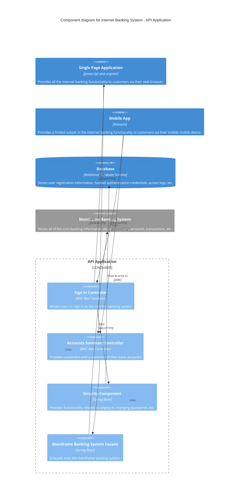
```mermaid
C4Component
    title Component diagram for Internet Banking System - API Application

    Container(spa, "Single Page Application", "javascript and angular", "Provides all the internet banking functionality to customers via their web browser.")
    Container(ma, "Mobile App", "Xamarin", "Provides a limited subset ot the internet banking functionality to customers via their mobile mobile device.")
    ContainerDb(db, "Database", "Relational Database Schema", "Stores user registration information, hashed authentication credentials, access logs, etc.")
    System_Ext(mbs, "Mainframe Banking System", "Stores all of the core banking information about customers, accounts, transactions, etc.")

    Container_Boundary(api, "API Application") {
        Component(sign, "Sign In Controller", "MVC Rest Controller", "Allows users to sign in to the internet banking system")
        Component(accounts, "Accounts Summary Controller", "MVC Rest Controller", "Provides customers with a summary of their bank accounts")
        Component(security, "Security Component", "Spring Bean", "Provides functionality related to singing in, changing passwords, etc.")
        Component(mbsfacade, "Mainframe Banking System Facade", "Spring Bean", "A facade onto the mainframe banking system.")

        Rel(sign, security, "Uses")
        Rel(accounts, mbsfacade, "Uses")
        Rel(security, db, "Read & write to", "JDBC")
        Rel(mbsfacade, mbs, "Uses", "XML/HTTPS")
    }

    Rel_Back(spa, sign, "Uses", "JSON/HTTPS")
    Rel(spa, accounts, "Uses", "JSON/HTTPS")

    Rel(ma, sign, "Uses", "JSON/HTTPS")
    Rel(ma, accounts, "Uses", "JSON/HTTPS")

    UpdateRelStyle(spa, sign, $offsetY="-40")
    UpdateRelStyle(spa, accounts, $offsetX="40", $offsetY="40")

    UpdateRelStyle(ma, sign, $offsetX="-90", $offsetY="40")
    UpdateRelStyle(ma, accounts, $offsetY="-40")

        UpdateRelStyle(sign, security, $offsetX="-160", $offsetY="10")
        UpdateRelStyle(accounts, mbsfacade, $offsetX="140", $offsetY="10")
        UpdateRelStyle(security, db, $offsetY="-40")
        UpdateRelStyle(mbsfacade, mbs, $offsetY="-40")
```

### C4 Dynamic

###### C4 图示例_Dynamic

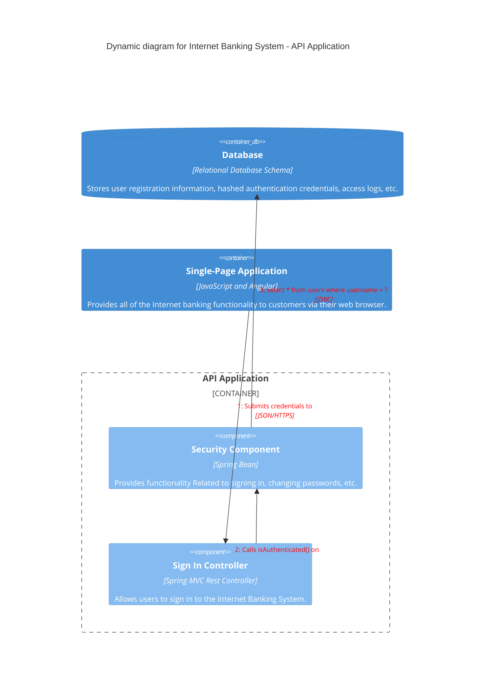
```mermaid
C4Dynamic
    title Dynamic diagram for Internet Banking System - API Application

    ContainerDb(c4, "Database", "Relational Database Schema", "Stores user registration information, hashed authentication credentials, access logs, etc.")
    Container(c1, "Single-Page Application", "JavaScript and Angular", "Provides all of the Internet banking functionality to customers via their web browser.")
    Container_Boundary(b, "API Application") {
      Component(c3, "Security Component", "Spring Bean", "Provides functionality Related to signing in, changing passwords, etc.")
      Component(c2, "Sign In Controller", "Spring MVC Rest Controller", "Allows users to sign in to the Internet Banking System.")
    }
    Rel(c1, c2, "Submits credentials to", "JSON/HTTPS")
    Rel(c2, c3, "Calls isAuthenticated() on")
    Rel(c3, c4, "select * from users where username = ?", "JDBC")

    UpdateRelStyle(c1, c2, $textColor="red", $offsetY="-40")
    UpdateRelStyle(c2, c3, $textColor="red", $offsetX="-40", $offsetY="60")
    UpdateRelStyle(c3, c4, $textColor="red", $offsetY="-40", $offsetX="10")
```

### C4 Deployment

###### C4 图示例_Deployment

```mermaid
C4Deployment
    title Deployment Diagram for Internet Banking System - Live

    Deployment_Node(mob, "Customer's mobile device", "Apple IOS or Android"){
        Container(mobile, "Mobile App", "Xamarin", "Provides a limited subset of the Internet Banking functionality to customers via their mobile device.")
    }

    Deployment_Node(comp, "Customer's computer", "Microsoft Windows or Apple macOS"){
        Deployment_Node(browser, "Web Browser", "Google Chrome, Mozilla Firefox,<br/> Apple Safari or Microsoft Edge"){
            Container(spa, "Single Page Application", "JavaScript and Angular", "Provides all of the Internet Banking functionality to customers via their web browser.")
        }
    }

    Deployment_Node(plc, "Big Bank plc", "Big Bank plc data center"){
        Deployment_Node(dn, "bigbank-api*** x8", "Ubuntu 16.04 LTS"){
            Deployment_Node(apache, "Apache Tomcat", "Apache Tomcat 8.x"){
                Container(api, "API Application", "Java and Spring MVC", "Provides Internet Banking functionality via a JSON/HTTPS API.")
            }
        }
        Deployment_Node(bb2, "bigbank-web*** x4", "Ubuntu 16.04 LTS"){
            Deployment_Node(apache2, "Apache Tomcat", "Apache Tomcat 8.x"){
                Container(web, "Web Application", "Java and Spring MVC", "Delivers the static content and the Internet Banking single page application.")
            }
        }
        Deployment_Node(bigbankdb01, "bigbank-db01", "Ubuntu 16.04 LTS"){
            Deployment_Node(oracle, "Oracle - Primary", "Oracle 12c"){
                ContainerDb(db, "Database", "Relational Database Schema", "Stores user registration information, hashed authentication credentials, access logs, etc.")
            }
        }
        Deployment_Node(bigbankdb02, "bigbank-db02", "Ubuntu 16.04 LTS") {
            Deployment_Node(oracle2, "Oracle - Secondary", "Oracle 12c") {
                ContainerDb(db2, "Database", "Relational Database Schema", "Stores user registration information, hashed authentication credentials, access logs, etc.")
            }
        }
    }

    Rel(mobile, api, "Makes API calls to", "json/HTTPS")
    Rel(spa, api, "Makes API calls to", "json/HTTPS")
    Rel_U(web, spa, "Delivers to the customer's web browser")
    Rel(api, db, "Reads from and writes to", "JDBC")
    Rel(api, db2, "Reads from and writes to", "JDBC")
    Rel_R(db, db2, "Replicates data to")

    UpdateRelStyle(spa, api, $offsetY="-40")
    UpdateRelStyle(web, spa, $offsetY="-40")
    UpdateRelStyle(api, db, $offsetY="-20", $offsetX="5")
    UpdateRelStyle(api, db2, $offsetX="-40", $offsetY="-20")
    UpdateRelStyle(db, db2, $offsetY="-10")
```

[<kbd>更多官方教程 </kbd>](https://mermaid.js.org/syntax/c4.html)

## ZenUML 图

*==ZenUML 图示例 1==*

```mermaid
zenuml
    title Annotators
    @Actor Alice
    @Database Bob
    @Boundary Boundary
    @Control Control
    @Entity Entity
    while(true) {
      Alice->Bob: Hi Bob
      Bob->Alice: Hi Alice
    }
```

*==ZenUML 图示例 2==*

```mermaid
zenuml
    title Reply message
    @VirtualMachine Client
    @GoogleIam A
    @CloudFront B
    @Cognito Cognito
    @ECS ECS
    @EFS EFS
    Client->A.method() {
      B.method() {
        if(condition) {
          return x1
          // return early
          @return
          A->Client: x11
        }
      }
      return x2
    }
```

[<kbd>更多官方教程 </kbd>](https://mermaid.js.org/syntax/zenuml.html)

# 应用类图表

## 思维导图

*==思维导图示例==*

```mermaid
mindmap
  root((Mindmap))
    Origins
      📓 Long history
      Popularisation
        (British popular psychology author Tony Buzan)
    Origins 2
      Popularisation 2
    Research
      ))🍺 On effectiveness<br/>and features((
      )On Automatic<br>creation(
        Uses
            Creative techniques
            {{Strategic planning}}
            Argument mapping
    Research 2
    Tools
      [Pen and paper]
      [Mermaid]
    Tools 2
      Pen and paper 2
    Tools 3
```

> ###### 查看完整画图脚本示例
>
> ````思维导图的画图脚本示例
>```mermaid
> mindmap
> root((Mindmap))
>  Origins
>      📓 Long history
>       Popularisation
>         (British popular psychology author Tony Buzan)
>     Origins 2
>       Popularisation 2
>     Research
>       ))🍺 On effectiveness<br/>and features((
>       )On Automatic<br>creation(
>         Uses
>             Creative techniques
>             {{Strategic planning}}
>             Argument mapping
>     Research 2
>     Tools
>       [Pen and paper]
>       [Mermaid]
>     Tools 2
>       Pen and paper 2
>     Tools 3
>    ```
>    ````
> [<kbd>更多官方教程 </kbd>](https://mermaid.js.org/syntax/mindmap.html)

###### 关于对 FontAwesome 的支持

不建议使用 FontAwesome 图标库特性，除非你独立构建相关资源的环境

## Gitgraph 图

*==Gitgraph 图示例 1==*

```mermaid
---
title: Example Gitgraph diagram
---
gitGraph
  commit id: "Alpha" tag: "0.0.1"
  
  commit
  branch develop
    branch nice_feature
    checkout nice_feature
    commit id: "Beta"
    checkout main
    merge nice_feature
  checkout develop
  
  commit id: "Reverse" type: REVERSE
  commit
  	
  checkout main
  merge develop
  commit id: "Hightlgith" type: HIGHLIGHT
  
  commit id: "Gamma" tag: "RC_1"

```

> ###### 查看完整画图脚本示例
>
> ````Gitgraph 图（1）的画图脚本示例
>```mermaid
> ---
> title: Example Gitgraph diagram
> ---
> gitGraph
> commit id: "Alpha" tag: "0.0.1"
> 
> commit
> branch develop
> branch nice_feature
> checkout nice_feature
>  commit id: "Beta"
>  checkout main
>  merge nice_feature
>  checkout develop
>  
> commit id: "Reverse" type: REVERSE
> commit
> 
> checkout main
> merge develop
> commit id: "Hightlgith" type: HIGHLIGHT
> 
> commit id: "Gamma" tag: "RC_1"
> ```
> ````
> [<kbd>更多官方教程 </kbd>](https://mermaid.js.org/syntax/gitgraph.html)

*==Gitgraph 图示例 2==*

```mermaid
---
title: Map of MetroLine
---
%%{init: {'mainBranchName': 'MetroLine1'}} }%%
gitGraph
  commit id:"NewYork"
  commit id:"Dallas"
  branch MetroLine2
  commit id:"LosAngeles"
  commit id:"Chicago"
  commit id:"Houston"
  branch MetroLine3
  commit id:"Phoenix"
  commit type: HIGHLIGHT id:"Denver"
  commit id:"Boston"
  checkout main
  commit id:"Atlanta"
  merge MetroLine3
  commit id:"Miami"
  commit id:"Washington"
  merge MetroLine2 tag:"MY JUNCTION"
  commit id:"Boston"
  commit id:"Detroit"
  commit type:REVERSE id:"SanFrancisco"
```

> ###### 查看完整画图脚本示例
>
> ````Gitgraph 图（2）的画图脚本示例
>```mermaid
> ---
> title: Map of MetroLine
> ---
> %%{init: {'mainBranchName': 'MetroLine1'}} }%%
> gitGraph
> commit id:"NewYork"
> commit id:"Dallas"
> branch MetroLine2
> commit id:"LosAngeles"
> commit id:"Chicago"
> commit id:"Houston"
> branch MetroLine3
> commit id:"Phoenix"
> commit type: HIGHLIGHT id:"Denver"
> commit id:"Boston"
> checkout main
> commit id:"Atlanta"
> merge MetroLine3
> commit id:"Miami"
> commit id:"Washington"
> merge MetroLine2 tag:"MY JUNCTION"
> commit id:"Boston"
> commit id:"Detroit"
> commit type:REVERSE id:"SanFrancisco"
> ```
> ````
> [<kbd>更多官方教程 </kbd>](https://mermaid.js.org/syntax/gitgraph.html)


*==Gitgraph 图示例 3==*

```mermaid
  gitGraph
    commit
    branch hotfix
    checkout hotfix
    commit
    branch develop
    checkout develop
    commit id:"ash" tag:"abc"
    branch featureB
    checkout featureB
    commit type:HIGHLIGHT
    checkout main
    checkout hotfix
    commit type:NORMAL
    checkout develop
    commit type:REVERSE
    checkout featureB
    commit
    checkout main
    merge hotfix
    checkout featureB
    commit
    checkout develop
    branch featureA
    commit
    checkout develop
    merge hotfix
    checkout featureA
    commit
    checkout featureB
    commit
    checkout develop
    merge featureA
    branch release
    checkout release
    commit
    checkout main
    commit
    checkout release
    merge main
    checkout develop
    merge release
    branch featureC
    commit
    branch featureD
    commit

```

## 桑基图

*==桑基图示例==*

```mermaid
---
config:
  sankey:
    showValues: false
---
sankey-beta

Agricultural 'waste',Bio-conversion,124.729
Bio-conversion,Liquid,0.597
Bio-conversion,Losses,26.862
Bio-conversion,Solid,280.322
Bio-conversion,Gas,81.144
Biofuel imports,Liquid,35
Biomass imports,Solid,35
Coal imports,Coal,11.606
Coal reserves,Coal,63.965
Coal,Solid,75.571
District heating,Industry,10.639
District heating,Heating and cooling - commercial,22.505
District heating,Heating and cooling - homes,46.184
Electricity grid,Over generation / exports,104.453
Electricity grid,Heating and cooling - homes,113.726
Electricity grid,H2 conversion,27.14
Electricity grid,Industry,342.165
Electricity grid,Road transport,37.797
Electricity grid,Agriculture,4.412
Electricity grid,Heating and cooling - commercial,40.858
Electricity grid,Losses,56.691
Electricity grid,Rail transport,7.863
Electricity grid,Lighting & appliances - commercial,90.008
Electricity grid,Lighting & appliances - homes,93.494
Gas imports,Ngas,40.719
Gas reserves,Ngas,82.233
Gas,Heating and cooling - commercial,0.129
Gas,Losses,1.401
Gas,Thermal generation,151.891
Gas,Agriculture,2.096
Gas,Industry,48.58
Geothermal,Electricity grid,7.013
H2 conversion,H2,20.897
H2 conversion,Losses,6.242
H2,Road transport,20.897
Hydro,Electricity grid,6.995
Liquid,Industry,121.066
Liquid,International shipping,128.69
Liquid,Road transport,135.835
Liquid,Domestic aviation,14.458
Liquid,International aviation,206.267
Liquid,Agriculture,3.64
Liquid,National navigation,33.218
Liquid,Rail transport,4.413
Marine algae,Bio-conversion,4.375
Ngas,Gas,122.952
Nuclear,Thermal generation,839.978
Oil imports,Oil,504.287
Oil reserves,Oil,107.703
Oil,Liquid,611.99
Other waste,Solid,56.587
Other waste,Bio-conversion,77.81
Pumped heat,Heating and cooling - homes,193.026
Pumped heat,Heating and cooling - commercial,70.672
Solar PV,Electricity grid,59.901
Solar Thermal,Heating and cooling - homes,19.263
Solar,Solar Thermal,19.263
Solar,Solar PV,59.901
Solid,Agriculture,0.882
Solid,Thermal generation,400.12
Solid,Industry,46.477
Thermal generation,Electricity grid,525.531
Thermal generation,Losses,787.129
Thermal generation,District heating,79.329
Tidal,Electricity grid,9.452
UK land based bioenergy,Bio-conversion,182.01
Wave,Electricity grid,19.013
Wind,Electricity grid,289.366
```

> ###### 查看完整画图脚本示例
>
> ````桑基图示例
>```mermaid
> ---
> config:
> sankey:
>  showValues: false
>   ---
>    sankey-beta
> 
> Agricultural 'waste',Bio-conversion,124.729
> Bio-conversion,Liquid,0.597
> Bio-conversion,Losses,26.862
> Bio-conversion,Solid,280.322
> Bio-conversion,Gas,81.144
> Biofuel imports,Liquid,35
> Biomass imports,Solid,35
> Coal imports,Coal,11.606
> Coal reserves,Coal,63.965
> Coal,Solid,75.571
> District heating,Industry,10.639
> District heating,Heating and cooling - commercial,22.505
> District heating,Heating and cooling - homes,46.184
> Electricity grid,Over generation / exports,104.453
> Electricity grid,Heating and cooling - homes,113.726
> Electricity grid,H2 conversion,27.14
> Electricity grid,Industry,342.165
> Electricity grid,Road transport,37.797
> Electricity grid,Agriculture,4.412
> Electricity grid,Heating and cooling - commercial,40.858
> Electricity grid,Losses,56.691
> Electricity grid,Rail transport,7.863
> Electricity grid,Lighting & appliances - commercial,90.008
> Electricity grid,Lighting & appliances - homes,93.494
> Gas imports,Ngas,40.719
> Gas reserves,Ngas,82.233
> Gas,Heating and cooling - commercial,0.129
> Gas,Losses,1.401
> Gas,Thermal generation,151.891
> Gas,Agriculture,2.096
> Gas,Industry,48.58
> Geothermal,Electricity grid,7.013
> H2 conversion,H2,20.897
> H2 conversion,Losses,6.242
> H2,Road transport,20.897
> Hydro,Electricity grid,6.995
> Liquid,Industry,121.066
> Liquid,International shipping,128.69
> Liquid,Road transport,135.835
> Liquid,Domestic aviation,14.458
> Liquid,International aviation,206.267
> Liquid,Agriculture,3.64
> Liquid,National navigation,33.218
> Liquid,Rail transport,4.413
> Marine algae,Bio-conversion,4.375
> Ngas,Gas,122.952
> Nuclear,Thermal generation,839.978
> Oil imports,Oil,504.287
> Oil reserves,Oil,107.703
> Oil,Liquid,611.99
> Other waste,Solid,56.587
> Other waste,Bio-conversion,77.81
> Pumped heat,Heating and cooling - homes,193.026
> Pumped heat,Heating and cooling - commercial,70.672
> Solar PV,Electricity grid,59.901
> Solar Thermal,Heating and cooling - homes,19.263
> Solar,Solar Thermal,19.263
> Solar,Solar PV,59.901
> Solid,Agriculture,0.882
> Solid,Thermal generation,400.12
> Solid,Industry,46.477
> Thermal generation,Electricity grid,525.531
> Thermal generation,Losses,787.129
> Thermal generation,District heating,79.329
> Tidal,Electricity grid,9.452
> UK land based bioenergy,Bio-conversion,182.01
> Wave,Electricity grid,19.013
> Wind,Electricity grid,289.366
> ```
> ````
> [<kbd>更多官方教程 </kbd>](https://mermaid.js.org/syntax/sankey.html)

## 时间线

*==时间线示例==*

```mermaid
timeline
    title History of Social Media Platform
    2002 : LinkedIn
    2004 : Facebook
         : Google
    2005 : Youtube
    2006 : Twitter
    2023 : GPT-3.5
         : GPT-4
```

> ###### 查看完整画图脚本示例
>
> ````时间线（1）图的画图脚本示例
>```mermaid
> timeline
> title History of Social Media Platform
> 2002 : LinkedIn
>  2004 : Facebook
>     : Google
>  2005 : Youtube
>    2006 : Twitter
>  2023 : GPT-3.5
>     : GPT-4
>  ```
>    ````
> [<kbd>更多官方教程 </kbd>](https://mermaid.js.org/syntax/timeline.html)


*==时间线示例（分段）==*

```mermaid
timeline
    title Timeline of Industrial Revolution
    section 17th-20th century
        Industry 1.0 : Machinery, Water power, Steam <br>power
        Industry 2.0 : Electricity, Internal combustion engine, Mass production
        Industry 3.0 : Electronics, Computers, Automation
    section 21st century
        Industry 4.0 : Internet, Robotics, Internet of Things
        Industry 5.0 : Artificial intelligence, Big data,3D printing
```

> ###### 查看完整画图脚本示例
>
> ````时间线（2）图的画图脚本示例
>```mermaid
> timeline
> title Timeline of Industrial Revolution
> section 17th-20th century
>    Industry 1.0 : Machinery, Water power, Steam <br>power
>    Industry 2.0 : Electricity, Internal combustion engine, Mass production
>      Industry 3.0 : Electronics, Computers, Automation
>    section 21st century
>      Industry 4.0 : Internet, Robotics, Internet of Things
>    Industry 5.0 : Artificial intelligence, Big data,3D printing
>    ```
>    ````
> [<kbd>更多官方教程 </kbd>](https://mermaid.js.org/syntax/timeline.html)


*==时间线示例（二级分类列表）==*

```mermaid
timeline
    STEP 01 : Action 1.1
    	: Action 1.2
    STEP 02 : Action 2.1
         : Action 2.2
         : Action 2.3
    STEP 03 : Action 3.1
```


## XY 图

*==XY 图示例==*

```mermaid
xychart-beta
    title "Sales Revenue"
    x-axis [jan, feb, mar, apr, may, jun, jul, aug, sep, oct, nov, dec]
    y-axis "Revenue (in $)" 4000 --> 11000
    bar [5000, 6000, 7500, 8200, 9500, 10500, 11000, 10200, 9200, 8500, 7000, 6000]
    line [5000, 6000, 7500, 8200, 9500, 10500, 11000, 10200, 9200, 8500, 7000, 6000]
```

> ###### 查看完整画图脚本示例
>
> ````XY 图脚本示例
> ```mermaid
> xychart-beta
>     title "Sales Revenue"
>     x-axis [jan, feb, mar, apr, may, jun, jul, aug, sep, oct, nov, dec]
>     y-axis "Revenue (in $)" 4000 --> 11000
>     bar [5000, 6000, 7500, 8200, 9500, 10500, 11000, 10200, 9200, 8500, 7000, 6000]
>     line [5000, 6000, 7500, 8200, 9500, 10500, 11000, 10200, 9200, 8500, 7000, 6000]
> ```
> ````
>
> [<kbd>更多官方教程 </kbd>](https://mermaid.js.org/syntax/xyChart.html)

## 饼图

*==Q3 2019 中国线上智能手机市场主要品牌市场份额_数据来自：互联网_==*

```mermaid
pie title Q3 2019 中国线上智能手机市场主要品牌市场份额
"华为" : 26
"荣耀" : 20
"小米" : 14
"VIVO" : 10
"Apple" : 9
"OPPO" : 5
"其他" : 16
```

> ###### 查看完整画图脚本示例
>
> ````饼图的画图脚本示例
>```mermaid
> pie title Q3 2019 中国线上智能手机市场主要品牌市场份额
> "华为" : 26
> "荣耀" : 20
> "小米" : 14
> "VIVO" : 10
> "Apple" : 9
> "OPPO" : 5
> "其他" : 16
> ```
> ````
> [<kbd>更多官方教程 </kbd>](https://mermaid.js.org/syntax/pie.html)

## 看板图

*==看板图示例==*

```mermaid
---
config:
  kanban:
    ticketBaseUrl: 'https://mermaidchart.atlassian.net/browse/#TICKET#'
---
kanban
  Todo
    [Create Documentation]
    docs[Create Blog about the new diagram]
  [In progress]
    id6[Create renderer so that it works in all cases. We also add som extra text here for testing purposes. And some more just for the extra flare.]
  id9[Ready for deploy]
    id8[Design grammar]@{ assigned: 'knsv' }
  id10[Ready for test]
    id4[Create parsing tests]@{ ticket: MC-2038, assigned: 'K.Sveidqvist', priority: 'High' }
    id66[last item]@{ priority: 'Very Low', assigned: 'knsv' }
  id11[Done]
    id5[define getData]
    id2[Title of diagram is more than 100 chars when user duplicates diagram with 100 char]@{ ticket: MC-2036, priority: 'Very High'}
    id3[Update DB function]@{ ticket: MC-2037, assigned: knsv, priority: 'High' }

  id12[Can't reproduce]
    id3[Weird flickering in Firefox]

```

> ###### 查看完整画图脚本示例
>
> ```看板图示例
> ---
> config:
>   kanban:
>     ticketBaseUrl: 'https://mermaidchart.atlassian.net/browse/#TICKET#'
> ---
> kanban
>   Todo
>     [Create Documentation]
>     docs[Create Blog about the new diagram]
>   [In progress]
>     id6[Create renderer so that it works in all cases. We also add som extra text here for testing purposes. And some more just for the extra flare.]
>   id9[Ready for deploy]
>     id8[Design grammar]@{ assigned: 'knsv' }
>   id10[Ready for test]
>     id4[Create parsing tests]@{ ticket: MC-2038, assigned: 'K.Sveidqvist', priority: 'High' }
>     id66[last item]@{ priority: 'Very Low', assigned: 'knsv' }
>   id11[Done]
>     id5[define getData]
>     id2[Title of diagram is more than 100 chars when user duplicates diagram with 100 char]@{ ticket: MC-2036, priority: 'Very High'}
>     id3[Update DB function]@{ ticket: MC-2037, assigned: knsv, priority: 'High' }
> 
>   id12[Can't reproduce]
>     id3[Weird flickering in Firefox]
> 
> ```
>
> [<kbd>更多官方教程 </kbd>](https://mermaid.js.org/syntax/kanban.html)

## 甘特图

*==甘特图示例==*

```mermaid
gantt
dateFormat  MM-DD
title 这里显示甘特图标题
%% 排除的日期：monday...saturday, sunday, weekends
excludes weekends

section 区块A
已完成的普通任务	:done, des1, 04-01, 04-03
执行中的普通任务	:active, des2, 04-02, 3d
未来的任务				:des3, after des2, 2d
未来的任务2			:des4, after des3, 2d

section 区块B
已完成的关键路径任务		:crit, done, 04-06, 24h
已完成的关键路径任务2		:crit, done, after des1, 2d
里程碑								:milestone, after des2, 0d

section 区块C
执行中的关键路径任务		:crit, active, 3d
未来的关键路径任务			:crit, 2d
```

> ###### 查看完整画图脚本示例
>
> ````甘特图的画图脚本示例
>```mermaid
> gantt
> dateFormat  MM-DD
> title 这里显示甘特图标题
> %% 排除的日期：monday...saturday, sunday, weekends
> excludes weekends
> 
> section 区块A
> 已完成的普通任务	:done, des1, 04-01, 04-03
> 执行中的普通任务	:active, des2, 04-02, 3d
> 未来的任务				:des3, after des2, 2d
> 未来的任务2			:des4, after des3, 2d
> 
> section 区块B
> 已完成的关键路径任务		:crit, done, 04-06, 24h
> 已完成的关键路径任务2		:crit, done, after des1, 2d
> 里程碑								:milestone, after des2, 0d
> 
> section 区块C
> 执行中的关键路径任务		:crit, active, 3d
> 未来的关键路径任务			:crit, 2d
> ```
> ````
> [<kbd>更多官方教程 </kbd>](https://mermaid.js.org/syntax/gantt.html)

## 用户旅程地图

*==用户旅程地图（也称：用户体验地图）==*

```mermaid
journey
    title 我一天的工作
    section Go to work
      Make tea: 5: Me
      Go upstairs: 3: Me
      Do work: 1: Me, Cat
    section Go home
      Go downstairs: 5: Me
      Sit down: 5: Me
```

> ###### 查看完整画图脚本示例
>
> ````用户旅程地图的画图脚本示例
>```mermaid
> journey
> title 我一天的工作
> section Go to work
>  Make tea: 5: Me
>  Go upstairs: 3: Me
>    Do work: 1: Me, Cat
>    section Go home
>    Go downstairs: 5: Me
>  Sit down: 5: Me
>    ```
>    ````
> [<kbd>更多官方教程 </kbd>](https://mermaid.js.org/syntax/userJourney.html)

#The End 