[TOC]

> Select language ❯ *[<kbd>🇨🇳 简体中文</kbd>](guide2.md)*

# ==Donation==

<u>**Thanks to donors who supported VLOOK™ (partial list) / Thanks for donate VLOOK™ (partial donors)**</u>

==**Peter**_~PuOgRd~_、**绿邃清幽**_~CyBuAq~_、**李导996**_~CyBuAq~_、**fanky**_~CyBuAq~_、**＊丽**_~CyBuAq~_、**杨琛**_~CyBuAq~_、**＊哦**_~GnBn~_、**＊豫**_~GnBn~_、**l＊a**_~GnBn~_、**＊o**_~GnBn~_、K＊y、行川、＊药、＊山、＊魂、＊士、＊狗、＊R、＊Z、＊川、l＊n、＊朽、＊杰、A＊C、W＊l、＊山、J＊o、韩宗辉、＊星、一叶知秋、d＊、＊军、＊鹏、＊无、H＊t、＊二、＊宇、＊辉、＊秋、＊笑、＊心、整＊9、＊国、＊哥、乌拉、＊龙、远方眼前、＊雩、＊应、＊销、E＊y、…==

---

> **Your coffee keeps VLOOK™ running ☕️**
>
> [](https://paypal.me/madmaxchow)
>
> _~Se~_

> **Your coffee keeps VLOOK™ running ☕️**
>
> 
>
> _~Gn~_

# °Code

## Copy Code Content

*Markdown Fans`Q`*「**For code and code blocks generated by Markdown, hope to copy content with one click～**」

*VLOOK`A`*_~T2~_ VLOOK™ automatically enhances Markdown code blocks, supporting current line highlighting, copying all code, and adapting to [Dark Mode](guide3-en.md#Dark-Mode)!

> **Applicable Scope ••• *`Editing`× Not Supported*_~Gy~_  *`Export HTML`✓ Supported*_~Gn~_**

###### Copy Code Example

Click `this code` to copy its content

###### Copy Code Block Example

_^tab^_

*==VLOOK™ Code Block Example_Programming Language: C++_==*

```C++
// ================================================== //
//           VLOOK™ supports auto-folding for long code blocks          //
// ================================================== //
/**
 * Quick Sort
 * @param arr Target data to sort
 * @param left Left value of sort range
 * @param right Right value of sort range
 */
void quickSort(int arr[], int left, int right) {
  int i = left, j = right, tmp, pivot = arr[(left + right) / 2];
  /* partition */
  while (i <= j) {
    while (arr[i] < pivot)
      i++;
    while (arr[j]>pivot)
      j--;
    if (i <= j) {
      tmp = arr[i];
      arr[i] = arr[j];
      arr[j] = tmp;
      i++;
      j--;
    }
  };
  /* recursion */
  if (left < j)
    quickSort(arr, left, j);
  if (i < right)
    quickSort(arr, i, right);
}
// ================================================== //
```

> [!TIP]
>
> **It is recommended to enable line numbers for code blocks in Typora for a better experience.**
>
> Enable method: 「Typora ▸ Preferences ▸ Markdown ▸ Code Blocks ▸ Show line numbers」

## Code Block Wrapping Layout

> **Applicable Scope ••• *`Editing`× Not Supported*_~Gy~_  *`Export HTML`✓ Supported*_~Gn~_**

Code blocks wrap automatically by default, and can be switched to non-wrapping mode as needed.

> [!TIP]
>
> After exporting to HTML, you can manually switch the "Wrapping Layout" via the code block [Content Assistant](guide3-en.md#Line Wrap Layout).

## Caption & Auto-numbering

<u>About code block caption and auto-numbering</u>

[<kbd>Relevant content see here ❯❯</kbd>](#Code Block Caption & Auto-numbering)


---

For feedback: [](mailto:67870144@qq.com?subject=Feedback%20about%20VLOOK™&body=Hi, "Feedback via Email")  [](https://qm.qq.com/q/O0tNC6WBWe "QQ Group (805502564)")  [](https://t.me/vlook_markdown "Join Telegram Channel")

# °Button

## Keyboard Keys

> **Applicable Scope ••• *`Editing`✓ Supported*_~Gn~_  *`Export HTML`✓ Supported*_~Gn~_**

<u>VLOOK™ theme supports `<kbd>` tag, and VLOOK™ provides button styles closer to physical keyboards, examples:</u>


---

> <kbd>Q</kbd>  <kbd>W</kbd>  <kbd>E</kbd>  <kbd>R</kbd>  <kbd>T</kbd>      <kbd>1</kbd>  <kbd>2</kbd>  <kbd>3</kbd>  <kbd>4</kbd>  <kbd>5</kbd>
>
> <kbd>ESC</kbd>    <kbd>Enter</kbd>
>
> <kbd>Ctrl</kbd>  <kbd>Alt</kbd>  <kbd>Shift</kbd>      <kbd>　　　　　　　　　</kbd>

> <kbd>Ctrl</kbd> + <kbd>C</kbd> 、<kbd>Ctrl</kbd> + <kbd>Shift</kbd> + <kbd>V</kbd>
>
> <kbd>Ctrl</kbd> + <kbd>P</kbd>
>
> <kbd>Ctrl</kbd> + <kbd>S</kbd>

> [!TIP]
>
> Suitable for software manuals, training documents, making shortcut key instructions more intuitive and clear.

## Button Link

*Markdown Fans`Q`*「**Button are essential for interactive web documents, hope Markdown documents can keep up**」

*VLOOK`A`*_~T2~_ By enhancing Typora's existing `<kbd>` feature, you can implement various styles of button links - let's get started!

> **Applicable Scope ••• *`Editing`✓ Supported*_~Gn~_  *`Export HTML`✓ Supported*_~Gn~_**

### Text Button

==VLOOK™ implements "text links" to "button links" conversion, and provides three button styles～==

For example with this text link:
- Markdown content: `[Visit GitHub](github.com)`
- Text link effect: [Visit GitHub](https://github.com/MadMaxChow/VLOOK)

---

---

> **■ Standard Button**
>
> Just wrap the text with `<kbd>`～
>
> - `[<kbd>Visit</kbd>](...)`
> - Example: [<kbd>Visit GitHub</kbd>](https://github.com/MadMaxChow/VLOOK)
>

> **□ Secondary Button**
>
> Set the "standard button" to *italic*～
>
> - `*[<kbd>Visit</kbd>](...)*`
> - Example: *[<kbd>Visit GitHub</kbd>](https://github.com/MadMaxChow/VLOOK)*
>

> **🌈 Super Button**
>
> Set the "standard button" to index-en.md**bold**～
>
> - `**[<kbd>Visit</kbd>](...)**`
> - Example: index-en.md**[<kbd>Visit GitHub</kbd>](https://github.com/MadMaxChow/VLOOK)**
>


> ###### Centered display when button link is alone in a line
>
> [<kbd>Centered when standalone</kbd>](https://github.com/MadMaxChow/VLOOK)
>
> *[<kbd>Centered when standalone</kbd>](https://github.com/MadMaxChow/VLOOK)*
>
> **[<kbd>Centered when standalone</kbd>](https://github.com/MadMaxChow/VLOOK)**
>
> [<kbd>Centered when standalone</kbd>](https://github.com/MadMaxChow/VLOOK)    *[<kbd>Centered when standalone</kbd>](https://github.com/MadMaxChow/VLOOK)*
>
> [<kbd>Centered when standalone</kbd>](https://github.com/MadMaxChow/VLOOK)    *[<kbd>Centered when standalone</kbd>](https://github.com/MadMaxChow/VLOOK)*    Centered when standalone</kbd>](https://github.com/MadMaxChow/VLOOK)**
>
> > [!TIP]
> >
> > To avoid "center alignment", just add a plain space before or after～

### Icon + Text Button

==Besides text-only buttons, images of any size can be added as button icons.  
You can then set the desired [icon layout](guide-en.md#Image Display Layout) for display.==

_^tab^_

> **Text + Image/Icon**
>
> Directly insert "image URL" inside `<kbd>` of above "text button":
>
> - Markdown: `[<kbd>VLOOK </kbd>]`
> - Effect:
>
> [<kbd>VLOOK </kbd>](https://github.com/MadMaxChow/VLOOK)    *[<kbd>VLOOK </kbd>](https://github.com/MadMaxChow/VLOOK)*    **[<kbd>VLOOK </kbd>](https://github.com/MadMaxChow/VLOOK)**

> **Icon Only**
>
> Replace text content in "text button" with "image URL":
>
> - Markdown: `[<kbd></kbd>]`
> - Effect:
>
> [<kbd></kbd>](https://github.com/MadMaxChow/VLOOK)    *[<kbd></kbd>](https://github.com/MadMaxChow/VLOOK)*    **[<kbd></kbd>](https://github.com/MadMaxChow/VLOOK)**


> [!IMPORTANT]
>
> For images in button to automatically adapt colors to button styles (effective after HTML export), recommend using `svg` format and set as "[Image Silhouette](guide-en.md#Image Silhouette)".

## Card-Style Link

> **Availability ••• *`While Editing` ✓ Supported*_~Gn~_  *`Exported HTML` ✓ Supported*_~Gn~_**

*Markdown Fan `Q`* 「**Wants to present multiple different links, brief descriptions, and icons in a clean and elegant card layout within Markdown documents**」

*VLOOK `A`*_~T2~_ Just flexibly combine the previously mentioned [Blockquote Subtitles](guide-en.md#Blockquote Subtitle) / [Columns](#Blockquote Columns), [Paragraph Underline](guide.md#Paragraph Underline), [Image Icon Styles](guide.md#Image Display Layout), and [Button Links](#Button Links) as needed～


Here’s an example of a three-column link card layout:

---

---

>  
>
> **This is a simple description of the link**  
>
> [This is a text link ](#donate)

>  
>
> **This is a simple description of the link**  
>
> [This is a text link ](#donate)

>  
>
> **This is a simple description of the link**  
>
> [This is a text link ](#donate)


---

> 
>
> **Card Subtitle 1**
>
> This is a summary description of the link target. This is a summary description of the link target.  
>
> [<kbd>Standard Button link </kbd>](#donate)

> 
>
> **Card Subtitle 2**
>
> This is a summary description of the link target. This is a summary description of the link target.  
>
> *[<kbd>Secondary Button link </kbd>](#donate)*


---

> 
>
> **Card Subtitle**
>
> <u>This is a summary description of the link target with emphasis style</u>
>
> **[<kbd>Super Button link </kbd>](#donate)**

---

For feedback: [](mailto:67870144@qq.com?subject=Feedback%20about%20VLOOK™&body=Hi, "Feedback via Email")  [](https://qm.qq.com/q/O0tNC6WBWe "QQ Group (805502564)")  [](https://t.me/vlook_markdown "Join Telegram Channel")

# °Cover & Back Cover

*Markdown Fans`Q`*「**How to make Markdown documents support covers and back covers (like this document's cover and back cover)?**」
*VLOOK`A`*_~T2~_ After applying VLOOK™'s "[Template Theme](guide3-en.md#Template Themes)", using standard Markdown syntax can make documents support covers and back covers by following VLOOK™ conventions.

> **Applicable Scope ••• *`Editing`✓ Supported*_~Gn~_  *`Export HTML`✓ Supported*_~Gn~_**


---

> **Activate "Cover"**
>
> Input a `Level 6` heading at the index-en.md**very beginning** of the document
>
> Example: `###### This is the cover title`
> 
> > ###### Shortcut
> >
> > Select text for cover content, then press <kbd>Cmd / Control</kbd> + <kbd>6</kbd>
>
> > [!TIP]
> >
> > If there's YAML or [TOC] content, add it after them.
>
> _~T1~_

> **Activate "Back Cover"**
>
> Input a `Level 1` heading at the index-en.md**last line** of the document
>
> Example: `# This is the back cover message`
>
> > ###### Shortcut
> >
> > Select text for back cover content, then press <kbd>Cmd / Control</kbd> + <kbd>1</kbd>
>
> _~T2~_

<u>After successfully activating cover and back cover, corresponding entries will appear in Typora's outline panel for quick navigation.<br>Below are automatic formatting rules for specific information in "Cover":</u>

_^tab^_

> **Title**
>
> Default format is title format, just input directly;
>
> Can combine subscript and underline formats for "subtitle, secondary title":
>
>  - Subtitle: `<sub>Subtitle with spaces</sub>` or `~Subtitle without spaces~`
>  - Secondary title: `<u>This is the secondary title</u>` 

> **Document Type, Security Level**
>
> Use VLOOK™'s [multi-level tag](#Multi-level Tag) syntax:
>
> - `` *Security Level`Public*_~Gn~_ ``
>- `` *Security Level`Internal*_~Og~_ ``
> - `` *Security Level`Confidential*_~Rd~_ ``

> **Author**
>
> Use Markdown "bold" format for "author info", automatically prefixed with `By`, or specify via [Custom Theme](vip-en.md)
>
> - Example: `**Author Name**`

> **Copyright Info**
>
> Use Markdown "italic" format for "copyright info" (automatically reduces font size and bold)
>
> - Example: `*(C)2020. All Rights Reserved*`


> [!TIP]
>
> **How to add line breaks in cover/back cover?** 
>
> Directly input HTML line break tag `<br>`.

_^tab^_

###### Minimal Document Cover Example

```markdown
###### Fill document title here<br>**Fill author here**<br>*Fill copyright owner info here*
```

###### Example of this document's cover content

```markdown
###### ~VLOOK™~<br>Give your Markdown a new way to _^play^_<br>──<br><u>Quick Reference Manual<br>(Part.II)</u><br>*Latest version`V2025.10`*<br><br>**MAX°Mengzhao**<br>*COPYRIGHT © 2016-2025. MAX°DESIGN.*
```

###### Example of this document's back cover content

```markdown
# The End
```


<u>If you want a more personalized cover and back cover design, you can subscribe to VLOOK™’s ==Custom Theme Service== .</u>

**[<kbd>Explore More About Custom Themes</kbd>](vip-en.md)**

---

For feedback: [](mailto:67870144@qq.com?subject=Feedback%20about%20VLOOK™&body=Hi, "Feedback via Email")  [](https://qm.qq.com/q/O0tNC6WBWe "QQ Group (805502564)")  [](https://t.me/vlook_markdown "Join Telegram Channel")

# °Columns

<u>"Columns" and "Tab Groups" are two very ==practical==, ==widely applicable==, and ==complementary== typesetting features.<br>"**Columns**" meet the need to ==simultaneously display== multiple sets of information in the same area, sharing display space, suitable when content is limited;<br>"**[Tab Groups](#°Tab Group)**" meet the need to ==alternately display== multiple sets of information in the same area, occupying display space exclusively, suitable when content is abundant.</u>

*Markdown Fans`Q`*「**Markdown natively doesn't support column typesetting. Some users reluctantly use tables as substitutes, which remains uncomfortable～**」

*VLOOK`A`*_~T2~_ With VLOOK, you only need 1 action to instantly make your "blockquotes, lists, [GitHub Style Alert](#GitHub-Style-Alert)" achieve column arrangement!

## List Columns

*Markdown Fans`Q`*「**Hope to display long lists in columns, but Markdown standards don't seem to support this practical typesetting method～**」

*VLOOK`A`*_~T2~_ By extending specific combinations of Markdown syntax, we can meet your flexible typesetting needs!

> **Applicable Scope ••• *`Editing`✓ Supported*_~Gn~_  *`Export HTML`✓ Supported*_~Gn~_**


Mainly suitable for column needs with subtitles, where content is organized via lists, e.g.: task boards, etc.

> **Syntax**
>
> Add a specified number of "horizontal dividers" `---` before the "list" that needs column typesetting
>
> - Add 1 horizontal divider to enable "⬛︎ ⬛︎ Two-column" mode
> - Add 2 horizontal dividers to enable "⬛︎ ⬛︎ ⬛︎ Three-column" mode
> - Add 3 horizontal dividers to enable "⬛︎ ⬛︎ ⬛︎ ⬛︎ Four-column" mode
> - Add 4 horizontal dividers to enable "⬛︎ ⬛︎ ⬛︎ ⬛︎ ⬛︎ Five-column" mode

> **Column Syntax Example**
>
> ```markdown
> --- 
> 
> - List 1
>   - List item 1-1
>   - List item 1-2
> - List 2
>   - List item 2-1
> ```

> [!TIP]
>
> After normal addition, corresponding column count prompts will automatically appear at the horizontal divider, e.g. "⬛︎ ⬛︎  2 Columns of List  ⬛︎ ⬛︎"

###### Two-column List Example

---

1. List 1
   - This is list item 1-1
   - This is list item 1-2
   
2. List 2
   1. This is list item 2-1
   2. This is list item 2-2
   
3. List 3
   - This is list item 3-1
   - This is list item 3-2
   
   > Blockquote within list
   
4. List 4
   - This is list item 4-1
   - This is list item 4-2


###### Three-column List Example

---

---

- List 1
  - This is list item 1-1
  - This is list item 1-2
- List 2
  1. This is list item 2-1
  2. This is list item 2-2
- List 3
  - This is list item 3-1
  - This is list item 3-2
- List 4
  - This is list item 4-1
- List 5
  - This is list item 5-1

###### Four-column List Example

---

---

---

- List 1
  - This is list item 1-1
  - This is list item 1-2
- List 2
  1. This is list item 2-1
  2. This is list item 2-2
- List 3
  - This is list item 3-1
  - This is list item 3-2
- List 4
  - This is list item 4-1
  - This is list item 4-2
- List 5
  - This is list item 5-1
- List 6
  - This is list item 6-1
- List 7
  - This is list item 7-1

###### Five-column List Example

---

---

---

---

- List 1
  - This is list item 1-1
  - This is list item 1-2
- List 2
  1. This is list item 2-1
  2. This is list item 2-2
- List 3
  - This is list item 3-1
  - This is list item 3-2
- List 4
  - This is list item 4-1
  - This is list item 4-2
- List 5
  - This is list item 5-1
  - This is list item 5-2
- List 6
  - This is list item 6-1
- List 7
  - This is list item 7-1
- List 8
  - This is list item 8-1
- List 9
  - This is list item 9-1


###### List Columns Nested Within Blockquote Columns Example

> ---
>
> - List 1
>   - This is list item 1-1
>   - This is list item 1-2
> - List 2
>   1. This is list item 2-1
>   2. This is list item 2-2

## Blockquote Columns

*Markdown Fans`Q`*「**Hope to display blockquotes in columns, but Markdown standards don't seem to support this practical typesetting method～**」

*VLOOK`A`*_~T2~_ By extending specific combinations of Markdown syntax, we can meet your flexible typesetting needs!

> **Applicable Scope ••• *`Editing`✓ Supported*_~Gn~_  *`Export HTML`✓ Supported*_~Gn~_**


Mainly suitable for organizing similar content in blocks, where content isn't suitable for list-based organization.

> **Syntax**
>
> Add a specified number of "horizontal dividers" `---` before the "blockquotes" that need column typesetting
>
> - Add 1 horizontal divider to enable "⬛︎ ⬛︎ Two-column" mode
> - Add 2 horizontal dividers to enable "⬛︎ ⬛︎ ⬛︎ Three-column" mode
> - Add 3 horizontal dividers to enable "⬛︎ ⬛︎ ⬛︎ ⬛︎ Four-column" mode
> - Add 4 horizontal dividers to enable "⬛︎ ⬛︎ ⬛︎ ⬛︎ ⬛︎ Five-column" mode

> **Column Blockquote Syntax Example**
>
> ```markdown
> ---
> 
> > Blockquote 1
> > Content of blockquote 1
> 
> > Blockquote 2
> > Content of blockquote 2
> ```

> [!TIP]
>
> After normal addition, corresponding column count prompts will automatically appear at the horizontal divider, e.g. "⬛︎ ⬛︎  2 Columns of Quote  ⬛︎ ⬛︎

###### Single-line Two-column Blockquote Example (No Subtitles)

---

> Column 1
>
> Content of column 1

> Column 2
>
> Content of column 2

###### Single-line Two-column Blockquote Example

---

> **Two-column Subtitle 1**
>
> Column 1

> **Two-column Subtitle 2**
>
> Column 2
>
> 

###### Single-line Three-column Blockquote Example

---

---

> **Three-column Subtitle 1**
>
> Row 1 Column 1

> **Three-column Subtitle 2**
>
> Row 1 Column 2

> **Three-column Subtitle 3**
>
> Row 1 Column 2

---

---

> **Three-column Subtitle 4**
>
> Row 1 Column 1

> **Three-column Subtitle 5**
>
> Row 1 Column 2

> **Three-column Subtitle 6**
>
> Row 1 Column 3

###### Single-line Four-column Blockquote Example

---

---

---

> **Four-column Subtitle 1**
>
> Row 1 Column 1
>
> [<kbd>Button</kbd>](#Single-line-Four-column-Blockquote-Example)
>
> _~Rd!~_

> **Four-column Subtitle 2**
>
> Row 1 Column 2
>
> [<kbd>Button</kbd>](#Single-line-Four-column-Blockquote-Example)
>
> _~Gn!~_

> **Four-column Subtitle 3**
>
> Row 1 Column 3
>
> [<kbd>Button</kbd>](#Single-line-Four-column-Blockquote-Example)
>
> _~Bu!~_

> **Four-column Subtitle 4**
>
> Row 1 Column 4
>
> [<kbd>Button</kbd>](#Single-line-Four-column-Blockquote-Example)
>
> _~Pu!~_

###### Single-line Five-column Blockquote Example

---

---

---

---

> **Five-column Subtitle 1**
>
> Row 1 Column 1
>
> [Button](#Single-line-Four-column-Blockquote-Example)
>
> _~Rd!~_

> **Five-column Subtitle 2**
>
> Row 1 Column 2
>
> [Button](#Single-line-Four-column-Blockquote-Example)
>
> _~Gn!~_

> **Five-column Subtitle 3**
>
> Row 1 Column 3
>
> [Button](#Single-line-Four-column-Blockquote-Example)
>
> _~Bu!~_

> **Five-column Subtitle 4**
>
> Row 1 Column 4
>
> [Button](#Single-line-Four-column-Blockquote-Example)
>
> _~Pu!~_

> **Five-column Subtitle 5**
>
> Row 1 Column 5
>
> [Button](#Single-line-Four-column-Blockquote-Example)
>
> _~Bn!~_

###### Blockquote Columns Nested Within Blockquotes Example

---

> **Blockquote Columns Nested Within Blockquotes**
>
> ---
>
> ---
>
> > **Nested Column 1 (Non-H6)**
> >
> > Row 1 Column 1
> >
> > [<kbd>Button</kbd>](#Blockquote-Columns-Nested-Within-Blockquotes-Example)
> >
> > _~Rd!~_
>
> > **Nested Column 2 (Non-H6)**
> >
> > Row 1 Column 2
> >
> > [<kbd>Button</kbd>](#Blockquote-Columns-Nested-Within-Blockquotes-Example)
> >
> > _~Gn!~_
>
> > **Nested Column 3 (Non-H6)**
> >
> > Row 1 Column 3
> >
> > [<kbd>Button</kbd>](#Blockquote-Columns-Nested-Within-Blockquotes-Example)
> >
> > _~Bu!~_
>
> > **Nested Column 4**
> >
> > Row 1 Column 4
> >
> > [<kbd>Button</kbd>](#Blockquote-Columns-Nested-Within-Blockquotes-Example)
> >
> > _~Pu!~_
>
> _~Gy~_

## Blockquote Columns (Within Lists)

*Markdown Fan `Q`* "**I’d like to display blockquotes in columns within a list, so the layout can be more flexible for column formatting.**"

*VLOOK `A`*_~T2~_ Just use the "[Blockquote Columns](#Blockquote Columns)" feature inside the list items!

> **Applicable Scope ••• *`Editing` ✓ Supported*_~Gn~_  *`Export to HTML` ✓ Supported*_~Gn~_**


(Before creating blockquote columns, remove the numbering from the list items.)

1. List 1

   ---

   > Blockquote Column (List) 1-1

   > Blockquote Column (List) 1-2

2. List 2

   ---

   ---

   > Blockquote Column (List) 2-1

   > Blockquote Column (List) 2-2

   > Blockquote Column (List) 2-3

3. List 3

   ---

   ---

   ---

   > Blockquote Column (List) 3-1

   > Blockquote Column (List) 3-2

   > Blockquote Column (List) 3-3

   > Blockquote Column (List) 3-4

## GitHub Style Alert Columns

> **Applicable Scope ••• *`Editing`✓ Supported*_~Gn~_  *`Export HTML`✓ Supported*_~Gn~_**


==Supports displaying [GitHub Style Alert](#GitHub-Style-Alert) in columns, following the same familiar approach as "Blockquote Columns" above～==


---

> [!NOTE]
>
> **Memo**. ==Highlight== information users should consider even when skimming

> [!TIP]
>
> **Tip**. Optional information to help users achieve ==greater success==

---

---

> [!IMPORTANT]
>
> **Important**. Information ==crucial== for user success

> [!WARNING]
>
> **Caution**. Key content requiring immediate user attention due to ==potential risks==

> [!CAUTION]
>
> **Warning/Prohibition**. Potential ==negative consequences== of an action


###### Example of GSA Nested in Blockquotes

> Below is [GitHub Style Alert](guide2-en.md#GitHub-Style-Alert):
>
> > [!NOTE]
> >
> > ==Highlights== information that users should take into account, even when skimming. [GitHub Style Alert](https://github.com/orgs/community/discussions/16925)


---

For feedback: [](mailto:67870144@qq.com?subject=Feedback%20about%20VLOOK™&body=Hi, "Feedback via Email")  [](https://qm.qq.com/q/O0tNC6WBWe "QQ Group (805502564)")  [](https://t.me/vlook_markdown "Join Telegram Channel")

# °Caption

*Markdown Fans`Q`*「**How to add caption and auto-numbering to tables, illustrations, code blocks, etc. in documents like Word?**」

*VLOOK`A`*_~T2~_ With simple markup, you can add caption to tables, images, code blocks, formulas, etc., with auto-numbering like `Table 1` `Figure 2.3-2`. Caption content also automatically serves as anchors for cross-referencing and jumping within documents～


> **Applicable Scope ••• *`Editing`× Not Supported*_~Gy~_  *`Export HTML`✓ Supported*_~Gn~_**

## How to Set Caption?

_^tab^_

> **Set Caption: Method 1 (Images only)**
>
> For images, caption are primarily generated based on "image title" and "optional subtitle" in Markdown standard syntax.
>
> *`Memo`*_~Bu~_ This method supports "dual captions", where "optional subtitle" content serves as the second caption.

> **Set Caption: Method 2**
>
> - Caption content needs to index-en.md**occupy a standalone paragraph**, formatted as: first "*italic*", then "==highlight=="
> - Corresponding Markdown syntax: `*==This is caption content==*`
>
> *`Tip`*_~Gn~_ This method supports "dual captions".
>
> > ###### Shortcut
> >
> > Select content, then press <kbd>Cmd/Ctrl</kbd> + <kbd>i</kbd> for italic, then <kbd>Cmd/Ctrl</kbd> + <kbd>⇧ Shift</kbd> + <kbd>h</kbd> for highlight


> [!NOTE]
>
> - When correctly formatted in Typora, visual prompts appear
> - By default, auto-generates caption and numbering for tables, illustrations, code blocks, etc. Adjust via:
>
>   - For images, specify non-illustration layouts like: icon, Logo, frame, etc. (see [Image Display Layouts](guide-en.md#Image Display Layout));
>   - Adjust auto-numbering grouping by chapter via plugin parameter `capgroup` (see [Plugin Tuning Parameters](guide3-en.md#Plugin-Tuning-Parameters));


_^tab^_

> **Dual Captions**
>
> The second caption appears below tables. index-en.md**Setting method:**
>
> - *==Step 1==* Complete first caption content via "Method 2" above;
> - *==Step 2==* Add second caption content after first, wrapped in underscores `_` ;
> - Corresponding Markdown syntax: `*==First caption content_Second caption_==*` .

> **Cross-referencing**
>
> Both caption methods support index-en.md**anchor jumps (cross-referencing)** within or between documents after exporting HTML;
> - Current doc cross-ref example:
>   - [Tag (regular style) preset color codes & examples](#Tag (Regular Style) Preset Color Codes and Examples)
>   - [Normal image example (long images auto-fold)](#Normal-image-example-(long-images-auto-fold))
> - External doc cross-ref example: [Normal cell horizontal & vertical merging example](guide-en.md#Example of Normal Cell Horizontal and Vertical Merging)

## Image Caption & Auto-numbering

> Follow Markdown syntax for adding images: ``
>
> - **Single caption:** `Image title` serves as "Caption 1" content
> - **Dual captions:** `Optional subtitle` serves as "Caption 2" content (optional)
>
> (Plugin prioritizes using above content as caption. If none, supports adding via "Method 2")


")

## Table Caption & Auto-numbering

*==Caption generated via "Method 2"==*

| Column A       | Column B       | Column C       | Column D       | Column E       |
| -------------- | -------------- | -------------- | -------------- | -------------- |
| Cell content | Cell content | Cell content | Cell content | Cell content |

*==Example: This is first caption content_This is second caption content_==*

| Column A       | Column B       | Column C       | Column D       | Column E       |
| -------------- | -------------- | -------------- | -------------- | -------------- |
| Cell content | Cell content | Cell content | Cell content | Cell content |
| Cell content | Cell content | Cell content | Cell content | Cell content |

## Code Block Caption & Auto-numbering

> - Add caption via "Method 2" above

*==(Method 3) Italic+highlight code block caption_The best programming language PASCAL! No rebuttals accepted!_==*

```pascal
Program HelloWorld(output);
begin
    writeln('Hello, world!')
end
```

## Multimedia Caption & Auto-numbering

> - For [streaming platforms](#Streaming-Platforms) multimedia, use "Method 2" above
> - For [Video](#Video), [audio](#Audio), caption method matches [image caption](#Image Caption & Auto-numbering)

## Mermaid Chart Caption & Auto-numbering

> - Add caption via "Method 2" above
> - Mermaid chart caption example, [click here to see ❯](#Mermaid Style Optimization & Extension)
>

## Math Formula Caption & Auto-numbering

> - Add caption via "Method 2" above
> - Formula caption example, [click here to see ❯](#More Practical & Beautiful Formula)


---

For feedback: [](mailto:67870144@qq.com?subject=Feedback%20about%20VLOOK™&body=Hi, "Feedback via Email")  [](https://qm.qq.com/q/O0tNC6WBWe "QQ Group (805502564)")  [](https://t.me/vlook_markdown "Join Telegram Channel")

# °Tab Group

<u>"Columns" and "Tab Groups" are two very ==practical==, ==widely applicable==, and ==complementary== typesetting features.<br>"**[Columns](#°Columns)**" meet the need to ==simultaneously display== multiple sets of information in the same area, sharing display space, suitable when content is limited;<br>"**Tab Groups**" meet the need to ==alternately display== multiple sets of information in the same area, occupying display space exclusively, suitable when content is abundant.</u>

*Markdown Fans`Q`*「**Markdown natively doesn't support "Tab Group" typesetting, unable to leverage web interactivity～**」

*VLOOK`A`*_~T2~_ With VLOOK, freely specify continuous content (tables/illustrations/blockquotes/code blocks/[GitHub Style Alert](#GitHub-Style-Alert)) to display as tab groups!

> **Applicable Scope ••• *`Editing`× Not Supported*_~Gy~_  *`Export HTML`✓ Supported*_~Gn~_**


> **Syntax**
>
> - Before the first content in continuous content to be displayed as tab groups, add an empty line, input any content (e.g. `tab`), then format as:
>
>   First "_italic_", then "^superscript^" (**standalone paragraph**)
>
> - Corresponding Markdown syntax: `_^tab^_` or `*^tab^*`
>
> > ###### Shortcut
> >
> > - Select content, then press <kbd>Cmd/Ctrl</kbd> + <kbd>i</kbd> for italic, then <kbd>⇧ Shift</kbd> + <kbd>6</kbd> for highlight;
> > - *`Tip`*_~Gn~_ After exporting HTML, supports switching tabs via <kbd>tab</kbd>, <kbd>⇧ Shift</kbd> + <kbd>tab</kbd>.

> [!IMPORTANT]
>
> - When correctly formatted in Typora, visual prompts appear;
> - "Continuous content" refers to content uninterrupted by other types (e.g. headings, lists, empty lines, dividers);
> - To display caption category & numbering info on tabs, enable via parameter `captab` (see [Plugin Tuning Parameters](guide3-en.md#Plugin-Tuning-Parameters));

## ~~Simple Example~~

_^tab^_

> **Current Tab**
>
> This is the content corresponding to the current tab.

> **On Hover**
>
> This is the content corresponding to the tab when hovered.

> **Other Tabs**
>
> This is the content corresponding to other tabs.

> [!CAUTION]
>
> This is the content of a GitHub Style Alert.

## Multi-type Content Tab Groups

<u>The following demonstrates how consecutive tables, illustrations, blockquotes, code blocks, videos, audio, formulas, and GitHub Style Alerts are presented in the form of "Tab Groups":</u>

_^tab^_

> **Problem**
>
> Given a 0-indexed string s containing only digits 0-9.
> A string t is semi-repetitive if it has at most one pair of adjacent equal characters.
> Return the length of the longest semi-repetitive substring in s.

> [!TIP]
>
> Optional information to help a user be ==more successful==.  [ Learn More ](https://github.com/orgs/community/discussions/16925)

```Java
class Solution {
    public int longestSemiRepetitiveSubstring(String s) {
        int n = s.length();
        if (n <= 2)
            return n;
        int[] pre = new int[50];
        int ans = 0, k = 0;        // k records pre length for traversal
        pre[0] = 1;                // Loop starts from 1, need to add first 1
        for (int i = 1; i < n; i++) {
            if (s.charAt(i-1) == s.charAt(i))
                k++;
            pre[k]++;
        }

        ans = pre[0];
        for (int i = 1; i <= k; i++)
            ans = Math.max(ans, pre[i-1] + pre[i]);
        return ans;
    }
}
```

*==Python Example==*

```Python
class Solution:
    def longestSemiRepetitiveSubstring(self, s: str) -> int:
        if len(s) <= 2:
            return len(s)
        pre = [1]                  # Loop starts from 1, need to add first 1
        for i in range(1, len(s)):
            pre[len(pre)-1] += 1
            if s[i-1] == s[i]:
                pre.append(0)
        ans = pre[0]
        for i in range(1, len(pre)):
            ans = max(ans, pre[i-1] + pre[i])
        return ans
```


| Column A | Column B | Column C | Column E |
| -------- | -------- | -------- | -------- |
|          |          |          |          |
|          |          |          |          |

")

")

$$
\begin{align*}
y = y(x,t) &= A e^{i\theta} \\
&= A (\cos \theta + i \sin \theta) \label{mymath-11}\tag{My Math - 11} \\
&= A (\cos(kx - \omega t) + i \sin(kx - \omega t)) \\
&= A\cos(kx - \omega t) + i A\sin(kx - \omega t)  \\
&= A\cos \Big(\frac{2\pi}{\lambda}x - \frac{2\pi v}{\lambda} t \Big) + i A\sin \Big(\frac{2\pi}{\lambda}x - \frac{2\pi v}{\lambda} t \Big) \label{mymath-12}\tag{My Math - 12} \\
&= A\cos \frac{2\pi}{\lambda} (x - v t) + i A\sin \frac{2\pi}{\lambda} (x - v t) \label{mymath-13}\tag{My Math - 13}
\end{align*}
$$

> [!NOTE]
>
> - ==Highlights== information that users should take into account, even when skimming.  [ Learn More ](https://github.com/orgs/community/discussions/16925)
>

*==Online Video==*

<iframe loading="lazy" src="https://player.bilibili.com/player.html?isOutside=true&aid=113423643837219&bvid=BV1miDpY5ERh&cid=26611613913&p=1&autoplay=0" scrolling="no" border="0" frameborder="no" framespacing="0" allowfullscreen="true"></iframe>

## Blockquote Tab Groups

<u>When tab items or content are too long, horizontal scrolling is supported (also supports keyboard <kbd>Tab</kbd> / <kbd>⇧ Shift + Tab</kbd> for switching):</u>

_^tab^_

> ** What is Markdown?**
>
> - In 2004, [John Gruber](https://en.wikipedia.org/wiki/John_Gruber) created [ Markdown](https://zh.wikipedia.org/wiki/Markdown), a *`text markup language`* specifically designed for web writing. Using Markdown, you only need to insert a small number of markup symbols during writing to easily format text (such as setting headings, bold, lists, blockquotes, etc.);
> - Markdown documents are stored in *`plain text format`*, which means they can be opened with almost any text editor. At the same time, they can be exported as formatted rich text documents, HTML web pages, etc. through Markdown editors. ==Pure, concise, easy to use, flexible== are all reasons why people love Markdown.
>
> ###### Markdown Logo
>
> 

> **Markdown Standardization Project (CommonMark)**
>
> - The current Markdown standardization project is [CommonMark](http://commonmark.org);
> - Standardized index-en.md**CommonMark** syntax reference: [Learn Markdown in 60 Seconds](http://commonmark.org/help/), [Dive Deeper into Markdown in 10 Minutes](http://commonmark.org/help/tutorial/)

> **What is Github Flavored Markdown?**
>
> - GitHub Flavored Markdown (**GFM**) is a popular markup language that adds some additional features to standard Markdown to better adapt to GitHub platform needs. These additional features include task list, automatic links, tables, etc.;
> - Typora currently mainly adopts this standard [Details ❯](https://support.typora.io/Markdown-Reference/)

> **What is AsciiDoc?**
>
> - AsciiDoc is a text format specification designed to solve the problem of book-scale writing, serving as an upgrade or alternative to Markdown;
> - Compared to Markdown, it supports more formats, including document attributes, setting authors, version information, syntax highlighting, tables, Include functionality, etc.;
> - AsciiDoc can be converted to various formats such as HTML5, DocBook, EPUB, PDF, etc. through the AsciiDoctor toolchain;
> - AsciiDoctor also provides template engines and performance improvements, making it suitable for scenarios requiring rich formats and custom output.
>
> <sup>(The above information is generated by Baidu AI)</sup>

> **Why hasn't AsciiDoc become popular?**
>
> - First, index-en.md**higher learning cost**. Although AsciiDoc supports more formats than Markdown, these features also increase its learning difficulty. For simple document writing, these features of AsciiDoc are not necessary, while simple documents like blogs tend to use Markdown with lower learning cost;
> - Second, index-en.md**relatively limited functionality**. Although it supports more formats, compared to Markdown, AsciiDoc's flexibility in specific scenarios is slightly insufficient. Markdown can achieve similar functionality through self-extended syntax or using HTML, while AsciiDoc requires more custom block syntax and extensibility, which may bring inconvenience in some cases;
> - Finally, index-en.md**lack of widespread community support**. Although AsciiDoc has certain applications in specific fields (such as e-book production), its overall community and user base are relatively small, limiting its promotion and use in broader application scenarios.
>
> <sup>(The above information is generated by Baidu AI)</sup>

## GitHub Style Alert Tab Groups

<u>The following shows [GitHub Style Alert](#GitHub Style Alert) presented in "Tab Group" form while retaining highlighting styles:</u>

_^tab^_

> [!NOTE]
>
> - ==Highlights== information that users should take into account, even when skimming.  [ Learn More ](https://github.com/orgs/community/discussions/16925)
>
> (**Memo**. ==Highlight== information that users should also consider when browsing)[<kbd> Learn More </kbd>](https://github.com/orgs/community/discussions/16925) *[<kbd> Learn More </kbd>](https://github.com/orgs/community/discussions/16925)*

> [!TIP]
>
> 1. Optional information to help a user be ==more successful==.  [ Learn More ](https://github.com/orgs/community/discussions/16925)
>
> (**Tip**. Optional information to help users achieve ==greater success==)[<kbd> Learn More </kbd>](https://github.com/orgs/community/discussions/16925) *[<kbd> Learn More </kbd>](https://github.com/orgs/community/discussions/16925)*

> [!IMPORTANT]
>
> Crucial information ==necessary== for users to succeed.  [ Learn More ](https://github.com/orgs/community/discussions/16925)
>
> (**Important**. Information ==critical== to user success)[<kbd> Learn More </kbd>](https://github.com/orgs/community/discussions/16925) *[<kbd> Learn More </kbd>](https://github.com/orgs/community/discussions/16925)*

> [!WARNING]
>
> Critical content demanding immediate user attention due to ==potential risks==.  [ Learn More ](https://github.com/orgs/community/discussions/16925)
>
> (**Note**. Key content requiring immediate user attention due to ==potential risks==)[<kbd> Learn More </kbd>](https://github.com/orgs/community/discussions/16925) *[<kbd> Learn More </kbd>](https://github.com/orgs/community/discussions/16925)*

> [!CAUTION]
>
> ==Negative potential== consequences of an action.  [ Learn More ](https://github.com/orgs/community/discussions/16925)
>
> (**Warning/Prohibition**. Potential ==negative consequences== of actions)[<kbd> Learn More </kbd>](https://github.com/orgs/community/discussions/16925) *[<kbd> Learn More </kbd>](https://github.com/orgs/community/discussions/16925)*


<u>Currently, **3 styles** are available for “Tab Groups”. If you wish to specify a particular style, you can subscribe to VLOOK™’s ==Custom Theme Service== .</u>

**[<kbd>Explore More About Custom Themes</kbd>](vip-en.md)**

# °Content Marking

## GitHub Style Alert

*Markdown Fans`Q`*「**Does VLOOK™ theme support [GitHub Style Alert](https://github.com/orgs/community/discussions/16925)?** (Requires [*Typora`1.8.3+`*](https://typoraio.cn/releases/all) or higher version)」

*VLOOK`A`*_~T2~_ Has adapted and optimized in terms of typesetting styles, while supporting automatic matching of "information category names" in multilingual environments.

> **Applicable Scope ••• *`Editing`✓ Supported*_~Gn~_  *`Export HTML`✓ Supported*_~Gn~_**

<u>GitHub Style Alert is primarily used in documents for reminders, notes, or emphasizing key information through specific typesetting styles, consisting of corresponding information category icons, names, content, etc.</u>


---

> **VLOOK™ Optimizations for GSA**
>
> - Provides multiple style options including "**Regular**, **Flat**, **Emphasized**", which can be specified through [Custom Theme](guide3-en.md#Template Themes) configuration;
> - Adapts styling for "text links, button, highlights" within to match the color scheme of corresponding information categories.
>
> ---
>
> Below shows the "Flat" style example. For more style examples, please preview through VLOOK™'s preset **[Hope](theme-hope.html#github-style-alert)** and **[Joint](theme-joint.html#github-style-alert)** themes.

> **Syntax**
>
> Input any of the following GitHub Style Alert category identifiers in the first line of a "blockquote" to enable automatic recognition and rendering:
>
> `[!NOTE]` `[!TIP]` `[!IMPORTANT]` `[!WARNING]` `[!CAUTION]`
>
> > ###### Reference Example
> >
> > ```markdown
> > > [!NOTE]  
> > > Highlights information that users should take into account, even when skimming.
> > ```
>
> ---
>
> For more GitHub Style Alert information, see [Typora Release Notes](https://support.typora.io/What's-New-1.8/)


> [!NOTE]
>
> - ==Highlights== information that users should take into account, even when skimming.  [ Learn More ](https://github.com/orgs/community/discussions/16925)
>
> （**Memo**. ==Emphasizes== information users should consider even while browsing）[<kbd> Learn More </kbd>](https://github.com/orgs/community/discussions/16925) *[<kbd> Learn More </kbd>](https://github.com/orgs/community/discussions/16925)*


> [!TIP]
>
> 1. Optional information to help a user be ==more successful==.  [ Learn More ](https://github.com/orgs/community/discussions/16925)
>
> （**Tip**. Optional information to help users achieve ==greater success==）[<kbd> Learn More </kbd>](https://github.com/orgs/community/discussions/16925) *[<kbd> Learn More </kbd>](https://github.com/orgs/community/discussions/16925)*


> [!IMPORTANT]
>
> Crucial information ==necessary== for users to succeed.  [ Learn More ](https://github.com/orgs/community/discussions/16925)
>
> （**Important**. Information ==critical== for user success）[<kbd> Learn More </kbd>](https://github.com/orgs/community/discussions/16925) *[<kbd> Learn More </kbd>](https://github.com/orgs/community/discussions/16925)*


> [!WARNING]
>
> Critical content demanding immediate user attention due to ==potential risks==.  [ Learn More ](https://github.com/orgs/community/discussions/16925)
>
> （**Warning**. Critical content requiring immediate attention due to ==potential risks==）[<kbd> Learn More </kbd>](https://github.com/orgs/community/discussions/16925) *[<kbd> Learn More </kbd>](https://github.com/orgs/community/discussions/16925)*


> [!CAUTION]
>
> ==Negative potential== consequences of an action.  [ Learn More ](https://github.com/orgs/community/discussions/16925)
>
> （**Caution/Prohibition**. ==Potential negative consequences== of an action）[<kbd> Learn More </kbd>](https://github.com/orgs/community/discussions/16925) *[<kbd> Learn More </kbd>](https://github.com/orgs/community/discussions/16925)*

###### Below are examples with richer formatting content

> [!NOTE]
>
> **Memo**. ==Highlight== information that users should also consider when browsing.
>
> ---
>
> > **This is Blockquote Subtitle 1**
> >
> > - [x] This is a ==task== list item
> >
> > - This is ==unordered== list item
> >
> > 1. This is ==ordered== list item
>
> > ###### This is Collapsed Column 1
> >
> > *==Note Code Block==*
> >
> > ```java
> > /* Code Block */ public void hello()
> > ```
> >
> > This is [text link](#GitHub Style Alert), this is [<kbd>Button Link ❯</kbd>](#GitHub Style Alert)

> [!TIP]
>
> **Tip**. Optional information to help users achieve ==greater success==.
>
> ---
>
> > **This is Blockquote Subtitle 2**
> >
> > - [x] This is a ==task== list item
> >
> > - This is ==unordered== list item
> >
> > 1. This is ==ordered== list item
>
> > ###### This is Collapsed Column 2
> >
> > *==Tip Code Block==*
> >
> > ```java
> > /* Code Block */ public void hello()
> > ```
> >
> > This is [text link](#GitHub Style Alert), this is [<kbd>Button Link ❯</kbd>](#GitHub Style Alert)

> [!IMPORTANT]
>
> **Important**. Information ==critical== to user success.
>
> ---
>
> > **This is Blockquote Subtitle 3**
> >
> > - [x] This is a ==task== list item
> >
> > - This is ==unordered== list item
> >
> > 1. This is ==ordered== list item
>
> > ###### This is Collapsed Column 3
> >
> > *==Important Code Block==*
> >
> > ```java
> > /* Code Block */ public void hello()
> > ```
> >
> > This is [text link](#GitHub Style Alert), this is [<kbd>Button Link ❯</kbd>](#GitHub Style Alert)

> [!WARNING]
>
> **Note**. Key content requiring immediate user attention due to ==potential risks==.
>
> ---
>
> > **This is Blockquote Subtitle 4**
> >
> > - [x] This is a ==task== list item
> > - This is ==unordered== list item
> >
> > 1. This is ==ordered== list item
>
> > ###### This is Collapsed Column 4
> >
> > *==Warning Code Block==*
> >
> > ```java
> > /* Code Block */ public void hello()
> > ```
> >
> > This is [text link](#GitHub Style Alert), this is [<kbd>Button Link ❯</kbd>](#GitHub Style Alert)

> [!CAUTION]
>
> **Warning/Prohibition**. Potential ==negative consequences== of actions.
>
> ---
>
> > **This is Blockquote Subtitle 5**
> >
> > - [x] This is a ==task== list item
> > - This is ==unordered== list item
> >
> > 1. This is ==ordered== list item
>
> > ###### This is Collapsed Column 5
> >
> > *==Caution Code Block==*
> >
> > ```java
> > /* Code Block */ public void hello()
> > ```
> >
> > This is [text link](#GitHub Style Alert), this is [<kbd>Button Link ❯</kbd>](#GitHub Style Alert)


> **Blockquote Embedded GSA**
>
> > [!NOTE]
> >
> > NOTE
>
> > [!TIP]
> >
> > TIP
>
> > [!IMPORTANT]
> >
> > IMPORTANT
>
> > [!WARNING]
> >
> > WARNING
>
> > [!CAUTION]
> >
> > CAUTION


> **VLOOK™ also supports column layout for GitHub Style Alert**
>
> [<kbd>Content details ❯ GitHub Style Alert Columns</kbd>](#GitHub Style Alert Columns)


---

For feedback: [](mailto:67870144@qq.com?subject=Feedback%20about%20VLOOK™&body=Hi, "Feedback via Email")  [](https://qm.qq.com/q/O0tNC6WBWe "QQ Group (805502564)")  [](https://t.me/vlook_markdown "Join Telegram Channel")

## Tag

*Markdown Fans`Q`*「**When writing documents with Markdown, how can I highlight key content using modern visual elements like "tag"?**」

*VLOOK`A`*_~T2~_ Set the "inline code" content in Markdown (like `` `tag` ``) to "italic" to achieve beautiful and practical "tag" formatting!

> **Applicable Scope ••• *`Editing`✓ Supported*_~Gn~_  *`Export HTML`✓ Supported*_~Gn~_**

For example, these "**single-level tag**": *`this tag`*_~Rd~_ or  *`that tag`*_~Bu!~_ can also be *`gradient tag`*_~T1T2~_ 

For example, these "**multi-level tag**": *This is title`This is content`*_~Bn~_ *Chemical formula`H₂O`is water💦*_~Se~_, or like this *Enabled`light`*_~Gn~_ *`light`Disabled*_~Gy~_

**Continue reading below to see how this is achieved～**

### Single-level Tag

Single-level tag are the most basic form of tag without further classification or structure. They are simple and easy to use, typically used to identify specific common information.

For example *`VIP`*_~BnGd~_    *`Pending`*_~Rd~_    *`Follow-up needed`*_~Bu~_    *`Important`*_~Pu!~_

_^tab^_

> **Syntax**
>
> - Wrap the text to be set as a tag with code symbols `` ` ``, and set it to "*italic*"
>
> - Corresponding Markdown syntax: `` *`This is a tag`* ``
> 
> > ###### Shortcut
> >
> > Select the text, then press <kbd>Cmd / Control</kbd> + <kbd>i</kbd> to set as italic, then press <kbd>`</kbd> to automatically wrap

> [!TIP]
>
> - Supports adding [preset color codes](guide-en.md#Preset Color Code) after the tag to specify index-en.md**colors** (supports regular/emphasized styles) or index-en.md**gradient colors**. If not specified, defaults to `T2` ;
> - To modify the default color code, use the "[Plugin Adjustment Parameters](guide3-en.md#Plugin Tuning Parameters)" `tag` to specify.

_^tab^_

*==Tag (Regular Style) Preset Color Codes and Examples==*

| index-en.md**Preset Color Code** | Recommended Application Scenarios               | Rendering Effect              |
| :----------: | -------------------------- | --------------------- |
|      Wn      | Warning, Danger, Critical Items, Deletion | *`Wn Regular Style`*_~Wn~_ |
|      Rd      | :                          | *`Rd Regular Style`*_~Rd~_ |
|      Og      | Reminder, Notice, Fix           | *`Og Regular Style`*_~Og~_ |
|      Ye      | Attention, Optimization, Memo, Explanation     | *`Ye Regular Style`*_~Ye~_ |
|      Lm      | Hint, Reference, New           | *`Lm Regular Style`*_~Lm~_ |
|      Gn      | :                          | *`Gn Regular Style`*_~Gn~_ |
|      Mn      | :                          | *`Mn Regular Style`*_~Mn~_ |
|      Ol      | :                          | *`Ol Regular Style`*_~Ol~_ |
|      Aq      | Quote Block, Announcement               | *`Aq Regular Style`*_~Aq~_ |
|      Cy      | :                          | *`Cy Regular Style`*_~Cy~_ |
|      Bu      | Information, News                 | *`Bu Regular Style`*_~Bu~_ |
|      Se      | :                          | *`Se Regular Style`*_~Se~_ |
|      La      | :                          | *`La Regular Style`*_~La~_ |
|      Vn      | :                          | *`Vn Regular Style`*_~Vn~_ |
|      Pu      | Extension, Expansion, Reserved, Backup     | *`Pu Regular Style`*_~Pu~_ |
|      Ro      | Youthful, Personality, Female           | *`Ro Regular Style`*_~Ro~_ |
|      Pk      | :                          | *`Pk Regular Style`*_~Pk~_ |
|      Gd      | VIP, Finance, Engineering            | *`Gd Regular Style`*_~Gd~_ |
|      Bn      | :                          | *`Bn Regular Style`*_~Bn~_ |
|      Gy      | Invalid, Deferred, Disabled, Ended     | *`Gy Regular Style`*_~Gy~_ |
|      Wt      | Black & White                       | *`Wt Regular Style`*_~Wt~_ |
|      Bk      | :                          | *`Bk Regular Style`*_~Bk~_ |
|      T1      | Current VLOOK™ Theme Primary Color     | *`T1 Regular Style`*_~T1~_ |
|      T2      | Current VLOOK™ Theme Secondary Color   | *`T2 Regular Style`*_~T2~_ |

*==Tag (Emphasized Style) Preset Color Codes and Examples==*

| index-en.md**Preset Color Code** | Recommended Application Scenarios               | Rendering Effect                                  |
| :----------: | -------------------------- | ----------------------------------------- |
|     Wn!      | Warning, Danger, Critical Items, Deletion | *`Wn Emphasized Style`*_~Wn!~_  *`WnMn Gradient Style`*_~WnMn~_ |
|     Rd!      | :                          | *`Rd Emphasized Style`*_~Rd!~_  *`RdGn Gradient Style`*_~RdGn~_ |
|     Og!      | Reminder, Notice, Fix           | *`Og Emphasized Style`*_~Og!~_  *`OgCy Gradient Style`*_~OgBu~_ |
|     Ye!      | Attention, Optimization, Memo, Explanation     | *`Ye Emphasized Style`*_~Ye!~_  *`YeGd Gradient Style`*_~YeAq~_ |
|     Lm!      | Hint, Reference, New           | *`Lm Emphasized Style`*_~Lm!~_  *`LmAq Gradient Style`*_~LmYe~_ |
|     Gn!      | :                          | *`Gn Emphasized Style`*_~Gn!~_  *`GnRd Gradient Style`*_~GnRd~_ |
|     Mn!      | :                          | *`Mn Emphasized Style`*_~Mn!~_  *`MnWn Gradient Style`*_~MnAq~_ |
|     Ol!      | :                          | *`Ol Emphasized Style`*_~Ol!~_  *`OlCy Gradient Style`*_~OlOg~_ |
|     Aq!      | Quote Block, Announcement                 | *`Aq Emphasized Style`*_~Aq!~_  *`AqLm Gradient Style`*_~AqLm~_ |
|     Cy!      | :                          | *`Cy Emphasized Style`*_~Cy!~_  *`CyYe Gradient Style`*_~CyYe~_ |
|     Bu!      | Information, News                 | *`Bu Emphasized Style`*_~Bu!~_ *`BuOl Gradient Style`*_~BuOl~_ |
|     Se!      | :                          | *`Se Emphasized Style`*_~Se!~_  *`SeBn Gradient Style`*_~SeOg~_ |
|     La!      | :                          | *`La Emphasized Style`*_~La!~_  *`LaYe Gradient Style`*_~LaYe~_ |
|     Vn!      | :                          | *`Vn Emphasized Style`*_~Vn!~_  *`VnPu Gradient Style`*_~VnRo~_ |
|     Pu!      | Extension, Expansion, Reserved, Backup     | *`Pu Emphasized Style`*_~Pu!~_  *`PuVn Gradient Style`*_~PuYe~_ |
|     Ro!      | Youthful, Personality, Female           | *`Ro Emphasized Style`*_~Ro!~_  *`RoRd Gradient Style`*_~RoRd~_ |
|     Pk!      | :                          | *`Pk Emphasized Style`*_~Pk!~_  *`PkGd Gradient Style`*_~PkLm~_ |
|     Gd!      | VIP, Finance, Engineering            | *`Gd Emphasized Style`*_~Gd!~_  *`GdYe Gradient Style`*_~GdYe~_ |
|     Bn!      | :                          | *`Bn Emphasized Style`*_~Bn!~_  *`BnSe Gradient Style`*_~BnGd~_ |
|     Gy!      | Invalid, Deferred, Disabled, Ended     | *`Gy Emphasized Style`*_~Gy!~_  *`GyCy Gradient Style`*_~GyCy~_ |
| Wt! | Black & White | *`Wt Emphasized Style`*_~Wt!~_  *`WtOg Gradient Style`*_~WtOg~_ |
|     Bk!      | :               | *`Bk Emphasized Style`*_~Bk!~_  *`BkOg Gradient Style`*_~BkOg~_ |
|     T1!      | Current VLOOK™ Theme Primary Color     | *`T1 Emphasized Style`*_~T1!~_  *`T1T2 Gradient Style`*_~T1T2~_ |
|     T2!      | Current VLOOK™ Theme Secondary Color   | *`T2 Emphasized Style`*_~T2!~_  *`T2T1 Gradient Style`*_~T2T1~_ |

### Multi-level Tag

Multi-level tag are used for more complex tagging scenarios, generally dividing tag into two or three levels. Unlike single-level tag with single information, multi-level tag can reflect multi-dimensional information.

Two-level structure examples *Customer Level`VIP`*_~BnGd~_    *Customer Level`Regular Customer`*_~Gy~_    *`Document Classification`Public*_~Bu~_    *`Document Classification`Confidential*_~RoRd~_    *`Interaction Type`Email*

Three-level structure examples *Project Phase`Requirement Analysis`Feasibility Report*    *Latest Version`V2.3`beta*_~BuOg~_

_^tab^_

> **Syntax**
>
> 1. First complete the setup according to "[Tag](#tag)";
> 2. Add corresponding content before or after the content wrapped by code symbols `` ` ``
>
> - Corresponding Markdown syntax: `` *Segment 1`Segment 2`Segment 3* `` 
>

> **Extended Usage**
>
> - Adding content only after a single-level tag is equivalent to reversing the left-right style of a two-level multi-level tag, example:
>   *Before`Tag-A`*  *`Tag-A`After*
>
> - Highlight variable styles: For "Segment 2", supported variable formats:
>   ` {{variable}}` ` %variable%`  ` $variable$` ` ${variable}` ` #{variable}` `var(variable)`


> [!TIP]
>
> - Supports adding [preset color codes](guide-en.md#Preset Color Code) after multi-level tag to specify index-en.md**colors** (default is emphasized style) or index-en.md**gradient colors**. If not specified, defaults to `T1`
> - To modify the default color code, use the "[Plugin Adjustment Parameters](guide3-en.md#Plugin Tuning Parameters)" `badge` to specify.

_^tab^_

*==Multi-level Tag Preset Color Code Examples==*

| index-en.md**Preset Color Code** | Recommended Application Scenarios               | Rendering Effect                            |
| :------: | -------------------------- | ----------------------------------- |
|    Wn    | Warning, Danger, Critical, Deletion | *Title`Content {{Variable 1}}`*_~Wn~_  *Title`Content {{Variable 1}}`Gradient*_~WnMn~_ |
|    Rd    | :                          | *Title`Content %Variable 2%`*_~Rd~_  *Title`Content %Variable 2%`Gradient*_~RdGn~_ |
|    Og    | Reminder, Notice, Vitality, Fix       | *Title`Content $Variable 3$`*_~Og~_  *Title`Content $Variable 3$`Gradient*_~OgBu~_ |
|    Ye    | Attention, Optimization, Memo, Explanation     | *Title`Content ${Variable 4}`*_~Ye~_  *Title`Content ${Variable 4}`Gradient*_~YeAq~_ |
|    Lm    | Hint, Memo, Reference, New     | *Title`Content #{Variable 5}`*_~Lm~_  *Title`Content #{Variable 5}`Gradient*_~LmYe~_ |
|    Gn    | :                          | *Title`Content var(Variable 6)`*_~Gn~_  *Title`Content var(Variable 6)`Gradient*_~GnRd~_ |
|    Mn    | :                          | *Title`Tag Content`*_~Mn~_  *Title`Tag Content`Gradient*_~MnAq~_  |
|    Ol    | :                          | *Title`Tag Content`*_~Ol~_  *Title`Tag Content`Gradient*_~OlOg~_ |
|    Aq    | Quote Block, Icy, Announcement              | *Title`Tag Content`*_~Aq~_  *Title`Tag Content`Gradient*_~AqLm~_ |
|    Cy    | :                          | *Title`Value 1`*_~Cy~_  *Title`Value 1`Gradient*_~CyYe~_ |
|    Bu    | Information, News, Ocean              | *Title`Value 2`*_~Bu~_  *Title`Value 2`Gradient*_~BuOl~_ |
|    Se    | :                          | *Title`Value 3`*_~Se~_  *Title`Value 3`Gradient*_~SeOg~_ |
|    La    | :                          | *Title`Value 4`*_~La~_  *Title`Value 4`Gradient*_~LaYe~_ |
|    Vn    | :                          | *Title`Value 5`*_~Vn~_  *Title`Value 5`Gradient*_~VnRo~_ |
|    Pu    | Extension, Expansion, Important, Reserved  | *Title`Tag Content`*_~Pu~_  *Title`Tag Content`Gradient*_~PuYe~_ |
|    Ro    | Youthful, Personality, Female        | *Title`Tag Content`*_~Ro~_  *Title`Tag Content`Gradient*_~RoRd~_ |
|    Pk    | :                          | *Title`Tag Content`*_~Pk~_  *Title`Tag Content`Gradient*_~PkLm~_ |
|    Gd    | VIP, Finance, Engineering, Reward         | *Title`Content {{Variable 1}}`*_~Gd~_  *Title`Content {{Variable 1}}`Gradient*_~GdYe~_ |
|    Bn    | :                          | *Title`Content %Variable 2%`*_~Bn~_  *Title`Content %Variable 2%`Gradient*_~BnGd~_ |
|    Gy    | Regular, Invalid, Deferred, Disabled     | *Title`Content $Variable 3$`*_~Gy~_  *Title`Content $Variable 3$`Gradient*_~GyCy~_ |
| Wt | Black & White | *Title`Content ${Variable 4}`*_~Wt~_  *Title`Content ${Variable 4}`Gradient*_~WtOg~_ |
|    Bk    | :               | *Title`Content ${Variable 4}`*_~Bk~_  *Title`Content ${Variable 4}`Gradient*_~BkOg~_ |
|    T1    | Selected [Theme](guide3-en.md#Template Themes) "Primary Color" | *Title`Content #{Variable 5}`*_~T1~_  *Title`Content #{Variable 5}`Gradient*_~T1T2~_ |
|    T2    | Selected [Theme](guide3-en.md#Template Themes) "Secondary Color" | *Title`Content var(Variable 6)`*_~T2~_  *Title`Content var(Variable 6)`Gradient*_~T2T1~_ |

*==More Multi-level Tag Examples==*

| index-en.md**Format** | Rendering Effect                    | More Rendering Examples            |
| :------: | --------------------------- | --------------------------- |
|    Three-segment    | *Title`Content 1`Content 2*_~T1~_ | *H₂+O`=`H₂O*_~Bu~_  *Pi`3.14`1592653*_~T2~_ |
|   :   | : | *Chemical Formula`H₂O`is Water💦*_~Se~_  *Circle`Internal Angles`180 Degrees*_~Ye~_ |
| No Title (Segment 1) | *`Content 1`Content 2*_~Gy~_ | *` Light`OFF*_~Gy~_  *`National Day`October 1st*_~Rd~_ |

### Tag Link

*Markdown Fans`Q`*「**I hope to add hyperlinks to tag for easy association with other documents or external information related to the tag**」

*VLOOK`A`*_~T2~_  Supports adding hyperlinks to tag. Just select the tag and directly set it according to Markdown hyperlink syntax.

> **Applicable Scope ••• *`Editing`× Not Supported*_~Gy~_  *`Export HTML`✓ Supported*_~Gn~_**


<u>Here are tag with hyperlinks, try them out～</u>

[*`VIP Custom Theme`*_~BnGd~_](https://madmaxchow.github.io/VLOOK/vip.html)    [*VLOOK`@GitHub`*](https://github.com/MadMaxChow/VLOOK)    [*VLOOK`GitHub`@MadMaxChow*_~T1T2~_](https://github.com/MadMaxChow/VLOOK)    [*`🎁 VIP`Submit My Custom Requirements*_~BnGdBnGdBn~_](https://wj.qq.com/s2/14818521/bd33/)


> [!TIP]
>
> Since clicking a "tag" is [copying tag content](guide3-en.md#copy-content), after exporting to HTML, hovering over the tag will show a separate entry to open the link.


---

If you have more needs or suggestions about the above content, feel free to provide feedback at any time～ [](https://qm.qq.com/q/O0tNC6WBWe "QQ Group (805502564)")  [](https://t.me/vlook_markdown "Join Telegram Channel")

## Progress Bar

*Markdown Fans`Q`*「**When making documents with Markdown, I hope to visualize progress-related information more intuitively**」

*VLOOK`A`*_~T2~_  This is really very Easy for VLOOK™, just combine Markdown's "==bold, highlight==" these two standard formats to achieve it easily

> **Applicable Scope ••• *`Editing`× Not Supported*_~Gy~_  *`Export HTML`✓ Supported*_~Gn~_**

_^tab^_

> **Syntax**
>
> - Set the progress numerical content to the following format combination: first "**bold**", then "==highlight=="
>
> - Corresponding Markdown syntax: `**==Progress Value==**`
> 
> > ###### Shortcut
> >
> > Select the text, then press <kbd>Cmd / Control</kbd> + <kbd>B</kbd> to set as bold, then press <kbd>Cmd / Control</kbd> + <kbd>⇧ Shift</kbd> + <kbd>H</kbd> to set as highlight
>
> Supports adding [preset color codes](guide-en.md#Preset Color Code) after the progress bar to specify colors. If not specified, it will automatically adapt colors based on specific values, as shown in the table below:

> **Progress Value Explanation**
>
> 1. When it's a specific value, directly specify a fixed value, examples:
>    - Regular: index-en.md**==80.5==**
>    - Overflow: index-en.md**==120==**    index-en.md**==-35==**
>
> 2. When it's `?`, automatically calculate the completion progress of all subtasks in the following task list.
>
> **index-en.md（ The progress during editing is illustrative, the actual progress is subject to the rendering after exporting HTML ）index-en.md**

---

> **Static Progress Bar Examples**
>
> *==Static Progress Bar Different Color Examples==*
>
> | Default Auto-Adapt Color | index-en.md**Supports Specifying Preset Color Codes** | ==                |
> | -------------- | :------------------: | ----------------- |
> | index-en.md**==-25==**    |          Wn          | index-en.md**==5.5==**_~Wn~_ |
> | index-en.md**==0==**      |          Rd          | index-en.md**==10==**_~Rd~_  |
> | index-en.md**==5==**      |          Og          | index-en.md**==15==**_~Og~_  |
> | index-en.md**==19==**     |          Ye          | index-en.md**==20==**_~Ye~_  |
> | index-en.md**==20==**     |          Lm          | index-en.md**==25==**_~Lm~_  |
> | index-en.md**==39==**     |          Gn          | index-en.md**==30==**_~Gn~_  |
> | index-en.md**==40==**     |          Mn          | index-en.md**==35==**_~Mn~_  |
> | index-en.md**==59==**     |          Ol          | index-en.md**==40==**_~Ol~_  |
> | index-en.md**==60==**     |          Aq          | index-en.md**==45==**_~Aq~_  |
> | index-en.md**==79==**     |          Cy          | index-en.md**==50==**_~Cy~_  |
> | index-en.md**==80==**     |          Bu          | index-en.md**==55==**_~Bu~_  |
> | index-en.md**==99==**     |          Se          | index-en.md**==60==**_~Se~_  |
> | index-en.md**==100==**    |          La          | index-en.md**==65==**_~La~_  |
> | index-en.md**==125==**    |          Vn          | index-en.md**==70==**_~Vn~_  |
> | -              |          Gy          | index-en.md**==75==**_~Gy~_  |
> | :              |          Bk          | index-en.md**==80==**_~Bk~_  |
> | :              |          Pu          | index-en.md**==85==**_~Pu~_  |
> | :              |          Ro          | index-en.md**==90==**_~Ro~_  |
> | :              |          Pk          | index-en.md**==95==**_~Pk~_  |
> | :              |          Gd          | index-en.md**==100==**_~Gd~_ |
> | :              |          Bn          | index-en.md**==120==**_~Bn~_ |
> | :              |          T1          | index-en.md**==-35==**_~T1~_ |
> | :              |          T2          | index-en.md**==0==**_~T2~_   |
>
> _~Gy~_

> **Automatically Calculate Task Item Completion Progress Example**
>
> **Overall Task Progress** index-en.md**==?==**
>
> - [ ] **1. Analyze Target Market Demand** index-en.md**==?==**
>   - [ ] Survey Target Customer Groups index-en.md**==?==**
>     - [x] Develop Questionnaire or Face-to-Face Interview Plan
>     - [ ] Collect Customer Needs and Preference Information for Products or Services
>   - [ ] Research Competitors index-en.md**==?==**
>     - [ ] Analyze Competitor Products, Pricing Strategies and Market Share
>     - [ ] Discover Competitor Strengths and Weaknesses, and Compare with Own
> - [ ] **2. Collect Market Data** index-en.md**==?==**
>   - [ ] Consult Industry Reports and Data index-en.md**==?==**
>     - [x] Consult Industry Reports and Statistics Released by Industry Associations
>     - [ ] Collect Information on Industry Trends and Development Forecasts
>   - [x] Analyze Market Trends index-en.md**==?==**
>     - [x] Process Market Data Through Data Analysis Tools or Software
>     - [x] Discover and Explain Market Trends to Guide Project Decisions
>
> _~Gy~_

---

If you have more needs or suggestions about the above content, feel free to provide feedback at any time～ [](https://qm.qq.com/q/O0tNC6WBWe "QQ Group (805502564)")  [](https://t.me/vlook_markdown "Join Telegram Channel")

## Breadcrumbs

*Markdown Fans`Q`*「**When writing tutorials or guidance documents, for menu sequences, step operations, directory hierarchies and other contents, I hope to have simple and efficient typesetting**」

*VLOOK`A`*_~T2~_ This is really very Easy for VLOOK™, just combine Markdown's "==italic, highlight==" these two standard formats to achieve easily.

> **Applicable Scope ••• *`Editing`✓ Supported*_~Gn~_  *`Export HTML`✓ Supported*_~Gn~_**


---

> **Syntax**
>
> - Set the breadcrumb content to the following format combination: first "*italic*", then "==highlight=="
>
>   > ###### Shortcut
>   >
>   > Select content, then press <kbd>Cmd / Control</kbd> + <kbd>i</kbd> to set as italic, then press <kbd>Cmd / Control</kbd> + <kbd>⇧ Shift</kbd> + <kbd>h</kbd> to set as highlight
>
> - Corresponding Markdown syntax: `*==This is breadcrumb content==*` 

> - Supported segment symbols: `>` `/` `\` `->` `→` `▸` `▶︎`
> - During editing previews main style, and after exporting to HTML supports:
>   - Automatically optimize style for "segment symbols"
>   - Click to copy its original information

> [!CAUTION]
>
> - When the entire paragraph contains only breadcrumb content, it will be prioritized as [caption format](guide-en.md#Table Caption & Auto-numbering) for "tables/illustrations/code blocks/multimedia" etc.;
> - Breadcrumb starting content cannot contain formatting (like bold, italic) or text links.


1. This describes ==menu sequence== example: *==Menu > File > Export > [Export Configuration](index.html)==*, can also add text links for certain operations as needed
2. This describes ==step operation== example: *==Login Account ▸ Preferences ▶︎ Modify Personal Information==*, can be used to show entry guidance for target operations
3. This describes ==directory hierarchy== example: *==/Root Directory/Subdirectory 1/Subdirectory 1.1==*, *==C:\Program Files\Applications==*

*==Breadcrumbs in Tables Example==*

|     Directory Hierarchy Example in Table (Non-exclusive)      |              Menu Sequence in Table (Exclusive)              |
| :-------------------------------------: | :------------------------------------------------: |
| Directory: *==/Root Directory/Subdirectory 1/Subdirectory 1.1==* | *==Menu -> File → Export > [Export Configuration](index.html)==* |

---

If you have more needs or suggestions about the above content, feel free to provide feedback at any time～ [](https://qm.qq.com/q/O0tNC6WBWe "QQ Group (805502564)")  [](https://t.me/vlook_markdown "Join Telegram Channel")

## Scratch Card

*Markdown Fans`Q`*「**When making training documents with Markdown, hope to hide 'answers' like Scratch Card, only showing when clicked**」

*VLOOK`A`*_~T2~_ This is really very Easy for VLOOK™, just combine Markdown "==italic, bold==" these two standard formats to achieve easily.

> **Applicable Scope ••• *`Editing`✓ Supported*_~Gn~_  *`Export HTML`✓ Supported*_~Gn~_**


> **Syntax**
>
> 1. Set content to be hidden to following format combination: first "*italic*", then "**bold**"
>
>   > ###### Shortcut
>   >
>   > Select content, then press <kbd>Cmd / Control</kbd> + <kbd>i</kbd> to set as italic, then press <kbd>Cmd / Control</kbd> + <kbd>b</kbd> to set as bold
>
> 2. Hint text defaults to *`••••`*_~Bk!~_ , to specify just add directly before bold
>
> - Corresponding Markdown syntax: `` *Hint Text**Hidden Content*** `` 
>
> (Supports adding [preset color codes](guide-en.md#Preset Color Code) after scratch card to specify color, defaults to `Gy` if not specified)
>

> [!TIP]
>
> To modify default color code, use "[Plugin Adjustment Parameters](guide3-en.md#Plugin Tuning Parameters)" `coating` to specify.

###### Scratch Card Examples

|       index-en.md**Preset Color Code**       | Rendering Effect                                                     |
| :----------------------: | :----------------------------------------------------------- |
| (Uses default when not specified) | index-en.md***This is scratch card without specified hint***                                 |
|            :             | *Favorite bamboo-eating animal?**Panda***                                 |
|            Rd            | Per *␣**sistence***_~Rd~_  Un *␣**remitting***_~Rd~_                        |
|            Og            | *"Good night" in Cantonese?**早[zou2] 唞[tau5]***_~Og~_      |
|            Ye            | 「**Water**」in English *Me???**Meter ❌***_~Ye~_ *Wa???**Water ✅***_~Ye~_ |
|            Lm            | *How to say "thank you" in English?**Thank you***_~Lm~_                  |
|            Gn            | *AppSecret Application Key**cf67c3839f0214dc***_~Gn~_               |
|            Aq            | *Third planet in solar system?**Earth***_~Aq~_                           |
|            Cy            | *Largest ocean on Earth?**Pacific***_~Cy~_                             |
|            Bu            | *Largest of 7 continents?**Asia***_~Bu~_                               |
|            Se            | *World's highest peak?**Mount Everest***_~Se~_                             |
|            Vn            | *Largest human organ?**Skin***_~Vn~_                               |
|            Pu            | *Smallest planet?**Mercury***_~Pu~_                                 |
|            Ro            | *Country with most islands?**Norway***_~Ro~_                             |
|            Pk            | *Which city is famous for its leaning tower?**Pisa***_~Pk~_                     |
|            Gd            | *Longest river?**Nile***_~Gd~_                             |
|            Bn            | *Largest planet in solar system?**Jupiter***_~Bn~_                         |
|            Gy            | *World's deepest trench?**Mariana***_~Gy~_                       |
|            T1            | *World's largest freshwater lake?**Baikal***_~T1~_                   |
|            T2            | *World's largest land mammal?**African Elephant***_~T2~_               |

---

If you have more needs or suggestions about the above content, feel free to provide feedback at any time～ [](https://qm.qq.com/q/O0tNC6WBWe "QQ Group (805502564)")  [](https://t.me/vlook_markdown "Join Telegram Channel")

## Phonetic Notation

### Superscript Phonetic Notation

*Markdown Fans`Q`*「**Hope Markdown documents can conveniently add phonetic notation (like: pinyin, foreign language comparison), so my language training documents and e-books can be more outstanding**」

*VLOOK`A`*_~T2~_ By extending Markdown superscript syntax `^ ^`, easily meets practical "phonetic notation" typesetting needs!

> **Applicable Scope ••• *`Editing`✓ Supported*_~Gn~_  *`Export HTML`✓ Supported*_~Gn~_**


> **Syntax**
>
> - Add corresponding phonetic notation content after any character needing phonetic notation, and set this content to following format combination:
>   First "_italic_", then "^superscript^"
>   
>- Corresponding Markdown syntax: `_^Phonetic Notation^_`
> 

_^tab^_

> [!IMPORTANT]
>
> To distinguish Typora's default single asterisk `*italic*` marked italics, italic in color codes recommends using Markdown's other italic mark syntax: underscore `_italic_`

> [!NOTE]
>
>  After exporting HTML, effect equals HTML 5 index-en.md**[ruby](https://www.runoob.com/tags/tag-ruby.html)**, index-en.md**[rp](https://www.runoob.com/tags/tag-rp.html)**, index-en.md**[rt](https://www.runoob.com/tags/tag-rt.html)** tag, and supports online definition or translation when clicking phonetic notation.

###### Phonetic Example-1

「==Way_^dào^_ begets one; one begets two; two begets_^shēng^_ three; three begets myriad_^wàn^_ things_^wù^_==_~BuRoGn~_」── Dao De Jing•Laozi

###### Phonetic Example-2

*==Multilingual Phonetic Application Example_Chinese/Japanese/Korean/English_==*

|  Category  | Following is Markdown Format Content                        | Rendering Effect                                |
| :----: | ------------------------------------------------- | --------------------------------------- |
|  Phonetic  | `道_^ㄉㄠ^_ 德_^ㄉㄜ^_ 经_^ㄐㄧㄥˉ^_`     | 道_^ㄉㄠ^_德_^ㄉㄜ^_经_^ㄐㄧㄥˉ^_     |
| Mandarin | `道_^dào^_ 德_^dé^_ 经_^jīng^_`           | 道_^dào^_德_^dé^_经_^jīng^_           |
|  Cantonese  | `道_^dou^_ 德_^däk^_ 经_^gïng^_`         | 道_^dou^_德_^däk^_经_^gïng^_          |
|  Japanese  | `鳥_^とり^_山_^やま^_ 明_^あきら^_`          | 鳥_^とり^_山_^やま^_明_^あきら^_     |
|  Korean  | `대_^Dae^_ 한_^Han^_ 민_^Min^_ 국_^Gug^_` | 대_^Dae^_한_^Han^_민_^Min^_국_^Gug^_ |

---

> ###### Chinese Phonetic Online Definition Service
>
> When phonetic notation content is index-en.md**Chinese**, provided by [](https://www.zdic.net/) 
>
> - Click phonetic to open "汉典" official site, show corresponding "character" definition
>
> _~Rd!~_

> ###### Non-Chinese Phonetic Online Translation Service
>
> When phonetic notation content is index-en.md**not Chinese**, provided by [](https://www.bing.com/translator/) 
>
> - Click phonetic to open "Bing Translator" official site, automatically translate Japanese "kana" parts
> - Other cases, translate the "character" being annotated
>
> _~Bu!~_

### Code-style Phonetic Notation

> **Applicable Scope ••• *`Editing`× Not Supported*_~Gy~_  *`Export HTML`✓ Supported*_~Gn~_**

> [!CAUTION]
>
> **Code-style phonetic notation is old phonetic syntax, not recommended for new documents!**
>
> This feature only supports existing documents, or when needing to add same phonetic notation to multiple characters simultaneously. Future versions may remove support for this syntax.


---

> **Syntax:**`` `{text}(symbol)` ``
>
> - `text`: Characters needing "phonetic notation, pinyin, annotation"
> - `symbol`: Corresponding phonetic notation, pinyin symbols, or annotation content

> After exporting HTML, effect equals HTML 5 index-en.md**[ruby](https://www.runoob.com/tags/tag-ruby.html)**, index-en.md**[rp](https://www.runoob.com/tags/tag-rp.html)**, index-en.md**[rt](https://www.runoob.com/tags/tag-rt.html)** tag, and supports online definition or translation when clicking phonetic notation.
>
> _~Gy~_

###### Phonetic Example-1

「==`{道}(dào)`生一，一生二，二`{生}(shēng)`三，三生`{万物}(wàn wù)`==」── 道德经•老子

###### Phonetic Example-2

*==Multilingual Phonetic Application_Chinese/Japanese/Korean/English_==*

|  Category  | Following is Markdown Format Content                                     | Rendering Effect                                    |
| :----: | ------------------------------------------------------------ | ------------------------------------------- |
|  Phonetic  | `` `{道}(ㄉㄠˋ)` `` `` `{德}(ㄉㄜˊ)` `` `` `{经}(ㄐㄧㄥˉ)` `` | `{道}(ㄉㄠˋ)` `{德}(ㄉㄜˊ)` `{经}(ㄐㄧㄥˉ)` |
| Mandarin | `` `{道}(dào)` `` `` `{德}(dé)` `` `` `{经}(jīng)` ``        | `{道}(dào)` `{德}(dé)` `{经}(jīng)`         |
|  Cantonese  | `` `{道德经}(dou däk gïng)` ``                               | `{道德经}(dou däk gïng)`                    |
|  Japanese  | `` `{鳥山}(とりやま)` `` `` `{明}(あきら)` ``                | `{鳥山}(とりやま)` `{明}(あきら)`           |
|  Korean  | `` `{대 한 민 국}(Dae Han Min Gug)` ``                       | `{대 한 민 국}(Dae Han Min Gug)`            |
|  Chinese-English  | `` `{道德经}(The Scripture of Ethics)` ``                    | `{道德经}(The Scripture of Ethics)`         |
| English-Chinese 1 | `` `{The Scripture}(经)` `` of `` `{Ethics}(道德)` ``        | `{The Scripture}(经)` of `{Ethics}(道德)`   |
| English-Chinese 2 | `` `{The Scripture of Ethics}(道德经)` ``                    | `{The Scripture of Ethics}(道德经)`         |

---

If you have more needs or suggestions about the above content, feel free to provide feedback at any time～ [](https://qm.qq.com/q/O0tNC6WBWe "QQ Group (805502564)")  [](https://t.me/vlook_markdown "Join Telegram Channel")

# °Mermaid

> [!NOTE]
>
> More scripted chart styles, and script writing specifications combined with VLOOK™ related content详见《[Scripted Charts for Markdown](chart.md)》。

## Mermaid Style Optimization & Extension

*Markdown Fans`Q`*「**If don't like Mermaid's default styles, and hope to automatically adapt to Dark Mode, what to do?**」

*VLOOK`A`*_~T2~_ Automatically provides deep style optimization.

> **Applicable Scope ••• *`Editing`✓ Supported*_~Gn~_  *`Export HTML`✓ Supported*_~Gn~_**


> **Unified and Optimized Styles**
>
> - Automatically optimizes styles for various Mermaid charts, and supports [Dark Mode](guide3-en.md#Dark Mode)
> - Following are some examples, more scripted chart examples详见这里 [❯❯](chart.md)

###### Mermaid Flowchart

*==Flowchart Example_(Above "Branch Flow" content continued by below chart)_==*

```mermaid
flowchart TB
%% 图的方向说明
%% LR：从左到图，RL：从右到左，TB：从上到下，BT：从下到上

%% 连续连接
START([开始]) --> pre1{{准备}} --> node2[节点]
pre1 --> node1(可选)

subgraph 子图
  subgraph 子图的子图
    %% 一对多
    node1 --> join1{ }
    join1 --> |分支|groud1[[子流程]] & database[(存档)] & inpage1(("A<br>(同页)"))
    %% click clickable "#Mermaid 的状态机图"
  end  	
node2 --> data1[/数据/]
node2 --> data2[\文件\]
node2 --> data3(((双圈圆<br>点击可访问<br>Github)))
click data3 "https://www.github.com" _blank
end

%% this is a comment

groud1 ==> |重要分支|cond1{"判断？"}
cond1 --> |条件1|END
cond1 --> |条件2|B[/手工输入\]
cond1 --> |条件3|B2[\手动操作/]
cond1 -.-> |条件4|outpage2>"B (离页)"]

inpage2(("A<br>(同页)")) --> END
END([结束])
```

*==Branch Flow Example (Continuing from Above Diagram)==*

```mermaid
graph LR
outpage2>"B (离页)"] --> node2(节点) --> END([结束])
```



###### Mermaid Class Diagram

*==Class Diagram Example==*


###### Mermaid Mind Map

*==Mind Map Example==*

```mermaid
mindmap
  root((Mindmap))
    Origins
      📓 Long history
      Popularisation
        (British popular psychology author Tony Buzan)
    Origins 2
      Popularisation 2
    Research
      ))🍺 On effectiveness<br/>and features((
      )On Automatic<br>creation(
        Uses
            Creative techniques
            {{Strategic planning}}
            Argument mapping
    Tools
      [Pen and paper]
      [Mermaid]
```



###### Mermaid's Sequence Diagram

> **Markup Extensions for "Sequence Diagrams"**
>
> + Supports marking different types of roles (important systems, external systems) to present different styles
> + Optimizes the appearance of *`opt`*_~Pu~_ *`alt / else`*_~Rd~_ *`loop`*_~Cy~_ *`par`*_~Og~_ tag with different styles, and automatically translates them based on the browser's current language
> + For more details about markup extensions, see here [❯❯](chart.md#sequence-diagram)

*==Sequence diagram with multiple different roles, clearer and more friendly==*


## Mermaid Caption & Auto-numbering

<u>About caption and auto-numbering for Mermaid diagrams</u>


[<kbd>Click here for details ❯❯</kbd>](#Mermaid Chart Caption & Auto-numbering)


---

For feedback: [](mailto:67870144@qq.com?subject=Feedback%20about%20VLOOK™&body=Hi, "Feedback via Email")  [](https://qm.qq.com/q/O0tNC6WBWe "QQ Group (805502564)")  [](https://t.me/vlook_markdown "Join Telegram Channel")

# °Formula

## More Practical & Beautiful Formula

> **Applicable Scope ••• *`Editing`✓ Supported*_~Gn~_  *`Export HTML`✓ Supported*_~Gn~_**

###### Inline Mixed Formula

This is an inline mixed "**mathematical formula**" $\boxed{\lim_{x \to \infty} \exp{-x} = 0}$, it can also be a "**chemical formula**" $\boxed{\ce{CH4 + 2 $\left( \ce{O2 + 79/21 N2} \right)$}}$

> ###### Check the LaTeX code for the above inline formulas
>
> Mathematical formula code: `$\lim_{x \to \infty} \exp{-x} = 0$`
>
> Chemical formula code: `$\ce{CH4 + 2 $\left( \ce{O2 + 79/21 N2} \right)$}$`

*==Standalone formula block (```math syntax)==*

```math
x = {-b \pm \sqrt{b^2-4ac} \over 2a}
```

> ###### Check the Gitlab/GitHub style code for the above formula
>
> ````Gitlab/GitHub style
> ```math
> x = {-b \pm \sqrt{b^2-4ac} \over 2a}
> ```
> ````
>
> 

*==Standalone formula block ($$
 syntax)_Second caption_==*
$$
\begin{align*}
y = y(x,t) &= A e^{i\theta} \\
&= A (\cos \theta + i \sin \theta) \label{mymath-1}\tag{My Math - 1} \\
&= A (\cos(kx - \omega t) + i \sin(kx - \omega t)) \\
&= A\cos(kx - \omega t) + i A\sin(kx - \omega t)  \\
&= A\cos \Big(\frac{2\pi}{\lambda}x - \frac{2\pi v}{\lambda} t \Big) + i A\sin \Big(\frac{2\pi}{\lambda}x - \frac{2\pi v}{\lambda} t \Big) \label{mymath-2}\tag{My Math - 2} \\
&= A\cos \frac{2\pi}{\lambda} (x - v t) + i A\sin \frac{2\pi}{\lambda} (x - v t) \label{mymath-3}\tag{My Math - 3}
\end{align*}
$$

You can also index-en.md**reference block formula numbers for navigation**, for example refer to formula: $\ref{mymath-1}$


> ###### Check the LaTeX code for the above standalone formula block
>
> ```latex
> 
$$
> \begin{align*}
> y = y(x,t) &= A e^{i\theta} \\
> &= A (\cos \theta + i \sin \theta) \label{mymath-1}\tag{My Math - 1} \\
> &= A (\cos(kx - \omega t) + i \sin(kx - \omega t)) \\
> &= A\cos(kx - \omega t) + i A\sin(kx - \omega t)  \\
> &= A\cos \Big(\frac{2\pi}{\lambda}x - \frac{2\pi v}{\lambda} t \Big) + i A\sin \Big(\frac{2\pi}{\lambda}x - \frac{2\pi v}{\lambda} t \Big) \label{mymath-2}\tag{My Math - 2} \\
> &= A\cos \frac{2\pi}{\lambda} (x - v t) + i A\sin \frac{2\pi}{\lambda} (x - v t) \label{mymath-3}\tag{My Math - 3}
> \end{align*}
> $$
> ```
>
> 

###### Formula in Tables

|            index-en.md**Title**            | Formula                                                       | Description                                                  |
| :----------------------------: | :----------------------------------------------------------- | ------------------------------------------------------------ |
|          Euler's Formula        | $e^{i\theta}=cos\theta+isin\theta$                           |                                                              |
| Pythagorean Theorem<br>(Pythagoras' Theorem) | $a^2+b^2=c^2$                                                | In a right-angled triangle on a plane, the square of the hypotenuse equals the sum of the squares of the other two sides.<br>If the lengths of the two perpendicular sides are $a$ and $b$, and the hypotenuse is $c$ |
|     Mass-Energy Equivalence     | $E=mc^2$                                                     | Where:<br>$E$ is energy in joules (J)<br>$m$ is mass in kilograms (kg)<br>$c$ is the speed of light in vacuum (m/s), $c=299792458 m/s$ |
|    Einstein Field Equations     | $R_{\mu\nu}-\cfrac{1}{2}g_{\mu\nu}R=8\pi GT_{\mu\nu}-\Lambda g_{\mu\nu}$ | What attracts you is not gravity, but curved spacetime       |
|    Maxwell's Equations          | $\nabla \cdot \mathbf{E} = \cfrac{\rho}{\varepsilon_0}$<br>$\nabla \cdot \mathbf{B} = 0$<br>$\nabla \times \mathbf{E} = -\cfrac{\partial \mathbf{B}}{\partial t}$<br>$\nabla \cdot \mathbf{B} = \mu _0 \mathbf{J} + \mu _0 \varepsilon_0 \cfrac{\partial \mathbf{E}}{\partial t}$ | [Maxwell's Equations](https://baike.baidu.com/item/%E9%BA%A6%E5%85%8B%E6%96%AF%E9%9F%A6%E6%96%B9%E7%A8%8B%E7%BB%84) |

## Formula Caption & Auto-numbering

<u>About caption and auto-numbering for Formula</u>


[<kbd>Click here for details ❯❯</kbd>](#Formula Caption & Auto-numbering)


---

For feedback: [](mailto:67870144@qq.com?subject=Feedback%20about%20VLOOK™&body=Hi, "Feedback via Email")  [](https://qm.qq.com/q/O0tNC6WBWe "QQ Group (805502564)")  [](https://t.me/vlook_markdown "Join Telegram Channel")

# °Multimedia

## Streaming Platforms

*Markdown Fans`Q`*「**Hope Markdown can embed videos from mainstream streaming platforms～**」

*VLOOK`A`*_~T2~_ To better utilize the rich video resources from mainstream streaming platforms (like: [Bilibili](www.bilibili.com), [Xigua](www.ixigua.com), [YouTube](www.youtube.com)), provides theme style adaptation and optimization support～

> **Applicable Scope ••• *`Editing`✓ Supported*_~Gn~_  *`Export HTML`✓ Supported*_~Gn~_**


> [!TIP]
>
> Embedded videos from streaming platforms also support "**caption, auto-numbering**", the method is consistent with adding caption and auto-numbering to "tables" ... [Details ❯](guide-en.md#Table Caption & Auto-numbering)

### Bilibili Videos

*==Embedded Bilibili Video (Landscape)==*

<iframe loading="lazy" src="https://player.bilibili.com/player.html?isOutside=true&aid=113423643837219&bvid=BV1miDpY5ERh&cid=26611613913&p=1&autoplay=0" scrolling="no" border="0" frameborder="no" framespacing="0" allowfullscreen="true"></iframe>

> ###### How to get Bilibili video's "embed code"?
>
> 
>
> (If you find the video cannot play after exporting to HTML, please check if the src content in the embed code doesn't have the `https:` prefix, add it and try again)

> ###### Recommended to disable autoplay
>
> Since Bilibili videos autoplay by default, if you want to adjust this, you can add `autoplay=0` at the end of the `src` field in the embed code, example:
>
> *==Example of adding "no autoplay" tag==*
>
> ```html
> <iframe src="https://player.bilibili.com/player.html?bvid=BV1zhaiegE73&page=1&autoplay=0" scrolling="no" border="0" frameborder="no" framespacing="0" allowfullscreen="true"> </iframe>
> ```
>

> ###### Can't play Bilibili videos in the exported HTML when opened locally?
>
> This is because the video embed code provided by Bilibili does not include the `https:` prefix in the `src` URL.  
> You can fix this manually by adding `https:` to the beginning of the link.

### Douyin Videos

*==Embedded Douyin Video (Portrait)==*

<iframe loading="lazy" src="https://open.douyin.com/player/video?vid=7122698345268743431#pt" scrolling="no" border="0" frameborder="0" framespacing="0" allowfullscreen="true"></iframe>

> ###### How to get Douyin video's "embed code"?
>
> Since Douyin doesn't provide an official "embed code" sharing method like Bilibili, you can use Bilibili's embed code as a template, replacing the `src` with Douyin's video stream link.
>
> The Douyin video stream link specifies the video identifier through `vid`, which can be copied from the address bar after opening the video through a computer browser on [Douyin homepage](https://www.douyin.com/discover). Example:
>
> *==Address bar content after opening Douyin video in browser==*
>
> ```http
> https://www.douyin.com/discover?modal_id=7365002781440085275
> ```
>
> *==Example template for Douyin video "embed code"==*
>
> ```html
> <iframe src="https://open.douyin.com/player/video?vid=7122698345268743431#portrait" scrolling="no" border="0" frameborder="0" framespacing="0" allowfullscreen="true"></iframe>
> ```

> [!TIP]
>
> Videos from all streaming platforms are displayed in "**landscape**" by default. If you want to display in "**portrait**", just add `#pt` at the end of the `src` content in the video embed code～

### Xigua Videos

*==Embedded Xigua Video==*

<iframe loading="lazy" width="720" height="405" frameborder="0" src="https://www.ixigua.com/iframe/7433350717030531622?autoplay=0" referrerpolicy="unsafe-url" allowfullscreen></iframe>

> ###### How to get Xigua video's "embed code"?
>
> 

### Tencent Videos

*==Embedded Tencent Video==*

<iframe loading="lazy" frameborder="0" src="https://v.qq.com/txp/iframe/player.html?vid=w3533fllb37" allowFullScreen="true"></iframe>

> ###### How to get Tencent video's "embed code"?
>
> 

### YouTube Videos

*==Embedded YouTube Video (Landscape)==*

<iframe loading="lazy" width="560" height="315" src="https://www.youtube.com/embed/f49LJV1i-_w?si=2qOSWZJPArifLC7i" title="YouTube video player" frameborder="0" allow="accelerometer; autoplay; clipboard-write; encrypted-media; gyroscope; picture-in-picture; web-share" referrerpolicy="strict-origin-when-cross-origin" allowfullscreen></iframe>

*==Embedded YouTube Video (Portrait)==*

<iframe width="560" height="315" src="https://www.youtube.com/embed/9BRsFlo_-H8?si=tM7oRRoz6WZnVtgx#pt" title="YouTube video player" frameborder="0" allow="accelerometer; autoplay; clipboard-write; encrypted-media; gyroscope; picture-in-picture; web-share" referrerpolicy="strict-origin-when-cross-origin" allowfullscreen></iframe>

> ###### How to get YouTube video's "embed code"?
>
> 

## Video

*Markdown Fans`Q`*「**Hope Markdown can support videos, so I can create multimedia documents～**」

*VLOOK`A`*_~T2~_ Currently Markdown tools don't have support for videos, but now it can be achieved at almost "zero" cost!

> **Applicable Scope ••• *`Editing`× Not Supported*_~Gy~_  *`Export HTML`✓ Supported*_~Gn~_**


> The syntax is completely consistent with Markdown's image insertion!
>
> - **Syntax:** ``
> - **Syntax Example:** ``
> - **Supported Video Formats:** Ogg (.ogv), MPEG4 (.mp4), WebM (.webm)

")

> **In addition to basic video controls, it also supports W3C standard control features!**
>
> Achieved by adding VLOOK™ standard parameters to the "Video URL", details as follows:

*==Advanced Application Instructions for Video Control==*

| index-en.md**Customizable Features** | URL Parameters          | Example                                                      |
| :------------: | ----------------- | ------------------------------------------------------------ |
|  Enable Autoplay | `autoplay=true`   |                                                              |
|  Enable Loop     | `loop=true`       |                                                              |
|   Enable Preload  | `preload=true`    | ") |
|  Specify Width   | `width=pixel value`  | Specify video width (unit: px)                               |
|  Specify Height  | `height=pixel value` | Specify video height (unit: px)                              |

> [!TIP]
>
> Since the syntax is the same as images, videos also support "**caption, auto-numbering**" ... [Details ❯](guide-en.md#Image Caption & Auto-numbering)

> [!NOTE]
>
> If you have questions about using "URL parameters, URL anchors", you can learn more at "[Image Address Extension Notes](guide3-en.md#Image Address Extension Notes)"～

## Audio

*Markdown Fans`Q`*「**Hope Markdown can support audio, so I can create electronic audiobooks～**」

*VLOOK`A`*_~T2~_ Currently Markdown tools don't have support for audio, but now it can be achieved at almost "zero" cost!

> **Applicable Scope ••• *`Editing`× Not Supported*_~Gy~_  *`Export HTML`✓ Supported*_~Gn~_**


> The syntax is completely consistent with Markdown's image insertion!
>
> - **Syntax:** ``
> - **Syntax Example:** ``
> - **Supported Audio Formats:** MP3 (.mp3), Ogg (.ogg), Wav (.wav), M4a (.m4a)

> ###### Want to try changing the default audio interface?
>
> **Audio defaults to the browser's "standard interface", in VLOOK™ it also supports a customized "Mini interface", AMAZING!**
>
> Achieved by adding VLOOK™ standard parameters to the "Audio URL":
>
> - URL Parameter: `controls=mini`
> - Parameter Example: `media/whistle.mp3?controls=mini`

###### Standard Interface Example

")

###### Mini Interface Example

 index-en.md**◄ Click to play**

> **In addition to basic audio controls, it also supports W3C standard control features!**
>
> Achieved by adding VLOOK™ standard parameters to the "Audio URL", details as follows:

*==Advanced Application Instructions for Audio Control==*

|                       index-en.md**Customizable Features**                       | VLOOK™ Standard URL Parameters                               | Example                                                      |
| :--------------------------------------------------------: | ------------------------------------------------------------ | ------------------------------------------------------------ |
|                  Enable Mini Mode Playback Controls         | `controls=mini`                                              |                          |
| Enable Play/Pause Mode<br><sub>**(Default is Play/Stop)**</sub> | `pause=true`<br><sub>*⚠️`Note`*_~Rd!~_ index-en.md**Only effective in Mini mode**</sub> |               |
|                        Show Audio Duration                 | `duration=true`<br><sub>*⚠️`Note`*_~Rd!~_ index-en.md**Only effective in Mini mode**</sub> |    |
|                        Enable Autoplay                     | `autoplay=true`                                              |            |
|                        Enable Loop                         | `loop=true`                                                  |              |
|                         Enable Preload                     | `preload=true`                                               | ") |

> [!TIP]
>
> Since the syntax is the same as images, when audio is displayed in "standard mode", it also supports "**caption, auto-numbering**" ... [Details ❯](guide-en.md#Image Caption & Auto-numbering)

> [!NOTE]
>
> If you have questions about using "URL parameters, URL anchors", you can learn more at "[Image Address Extension Notes](guide3-en.md#Image Address Extension Notes)"～

## Caption & Auto-numbering

<u>About caption and auto-numbering for multimedia</u>


[<kbd>Click here for details ❯❯</kbd>](#Multimedia Caption & Auto-numbering)

