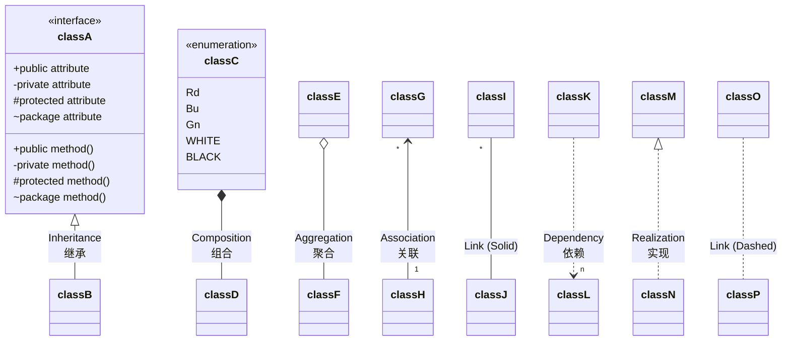
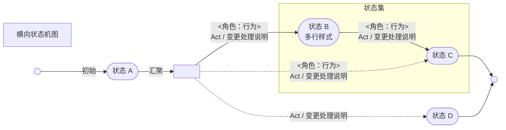
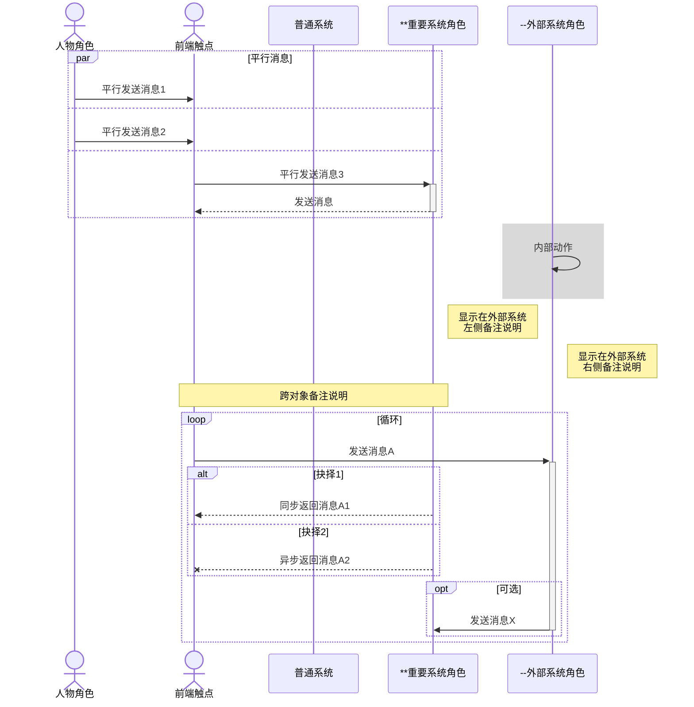

[TOC]

# 打赏

*==打赏 VLOOK™==*

|         **若喜欢 VLOOK™ 的话，可以贡献一杯咖啡 :-)**         | **If you like VLOOK™, you can contribute a cup of coffee :-)** |
| :----------------------------------------------------------: | :----------------------------------------------------------: |
|  | [](https://paypal.me/madmaxchow) |

> **感谢打赏支持 VLOOK™ 的客官（部分名单）/ Thanks for donate VLOOK™ (partial donors)**
>
> ＊山、＊星、＊丽、一＊秋、＊军、＊鹏、李＊6、＊无、H＊t、＊二、f＊y、＊宇、＊琛、＊辉、＊秋、＊笑、＊豫、l＊a、＊心、整＊9、＊国、＊拉、＊龙、＊应、＊销、＊哦、E＊y、……

# °内容标记

## 标签

*Markdown 粉`Q`*「**用 Markdown 写文档，怎样才能通过「标签」这种比较现代的视觉元素来突出关键内容？**」

*VLOOK`A`*_~T2~_ 对 Markdown 的「行内代码」内容（如 `` `标签` `` ）设置为「斜体」，即可实现好看、实用的「标签」排的版！


> **适用范围 ••• *ON`编辑时`*_~Gn~_  *ON` 导出 HTML`*_~Gn~_**


例如这样的「**单级标签**」：*`这样的标签`*_~Rd~_ 或  *`那样的标签`*_~Bu!~_ 还可以是 *`渐变的标签`*_~T1T2!~_ 


例如这样的「**多级标签**」：*这是标题`这是内容`*_~Bn~_ *化学式`H₂O`是水💦*_~Se~_，还可以这样 *ON`灯光`*_~Gn~_ *`灯光`OFF*_~Gy~_


**继续往下看看就知道这是怎么做到的～**

### 单级标签

单级标签是最基础的标签形式，没有进一步的分类或结构化，简单、易于使用，通常用来标识特定常用的信息。


例如 *`VIP`*_~Ro~_ *`待处理`*_~Rd~_ *`需要跟进`*_~Bu~_


> **语法**
>
> - 将需要设置为标签的文本，先设置用代码符号 `` ` `` 包裹 ，并设置为「*斜体*」
>
>   > ###### 快捷键操作
>   >
>   > 选中文本，然后先按下 <kbd>Cmd / Control</kbd> + <kbd>i</kbd> 设置为斜体，再按下 <kbd>`</kbd> 则会自动包裹
>
> - 对应的 Markdown 格式语法为：`` *`这是标签`* `` 
>
> （支持在标签后添加[预置色号](guide.md#预置色号)来指定颜色，不指定则默认为 `T2` ）
>

> [!TIP]
> 
> 若须修改默认色号，可通过「[插件调校参数](#插件调校参数)」 `tag` 指定。

*==标签（常规风格）预置色号及示例==*

| **预置色号** | 应用场景建议               | 渲染效果              |
| :----------: | -------------------------- | --------------------- |
|      Wn      | 警告、危险、关键事项、删除 | *`Wn 常规风格`*_~Wn~_ |
|      Rd      | :                          | *`Rd 常规风格`*_~Rd~_ |
|      Og      | 提醒、注意、修复           | *`Og 常规风格`*_~Og~_ |
|      Ye      | 关注、优化、备忘、说明     | *`Ye 常规风格`*_~Ye~_ |
|      Lm      | 提示、参考、新增           | *`Lm 常规风格`*_~Lm~_ |
|      Gn      | :                          | *`Gn 常规风格`*_~Gn~_ |
|      Mn      | :                          | *`Mn 常规风格`*_~Mn~_ |
|      Ol      | :                          | *`Ol 常规风格`*_~Ol~_ |
|      Aq      | 引用块、公告               | *`Aq 常规风格`*_~Aq~_ |
|      Cy      | :                          | *`Cy 常规风格`*_~Cy~_ |
|      Bu      | 信息、资讯                 | *`Bu 常规风格`*_~Bu~_ |
|      Se      | :                          | *`Se 常规风格`*_~Se~_ |
|      La      | :                          | *`La 常规风格`*_~La~_ |
|      Vn      | :                          | *`Vn 常规风格`*_~Vn~_ |
|      Pu      | 延伸、扩展、保留、备用     | *`Pu 常规风格`*_~Pu~_ |
|      Ro      | 年轻、个性、女性           | *`Ro 常规风格`*_~Ro~_ |
|      Pk      | :                          | *`Pk 常规风格`*_~Pk~_ |
|      Gd      | VIP、金融、工程            | *`Gd 常规风格`*_~Gd~_ |
|      Bn      | :                          | *`Bn 常规风格`*_~Bn~_ |
|      Gy      | 无效、暂缓、停用、结束     | *`Gy 常规风格`*_~Gy~_ |
|      Bk      | 黑白、高对比               | *`Bk 常规风格`*_~Bk~_ |
|      T1      | 当前 VLOOK™ 主题的主色     | *`T1 常规风格`*_~T1~_ |
|      T2      | 当前 VLOOK™ 主题的辅助色   | *`T2 常规风格`*_~T2~_ |


*==标签（强调风格）预置色号及示例==*

| **预置色号** | 应用场景建议               | 渲染效果                                  |
| :----------: | -------------------------- | ----------------------------------------- |
|     Wn!      | 警告、危险、关键事项、删除 | *`Wn 强调风格`*_~Wn!~_ *`WnMn 强调渐变`*_~WnMn!~_ |
|     Rd!      | :                          | *`Rd 强调风格`*_~Rd!~_ *`RdGn 强调渐变`*_~RdGn!~_ |
|     Og!      | 提醒、注意、修复           | *`Og 强调风格`*_~Og!~_ *`OgCy 强调渐变`*_~OgCy!~_ |
|     Ye!      | 关注、优化、备忘、说明     | *`Ye 强调风格`*_~Ye!~_ *`YeGd 强调渐变`*_~YeGd!~_ |
|     Lm!      | 提示、参考、新增           | *`Lm 强调风格`*_~Lm!~_ *`LmAq 强调渐变`*_~LmAq!~_ |
|     Gn!      | :                          | *`Gn 强调风格`*_~Gn!~_ *`GnRd 强调渐变`*_~GnRd!~_ |
|     Mn!      | :                          | *`Mn 强调风格`*_~Mn!~_ *`MnWn 强调渐变`*_~MnWn!~_ |
|     Ol!      | :                          | *`Ol 强调风格`*_~Ol!~_ *`OlCy 强调渐变`*_~OlCy!~_ |
|     Aq!      | 引用块、公告                 | *`Aq 强调风格`*_~Aq!~_ *`AqLm 强调渐变`*_~AqLm!~_ |
|     Cy!      | :                          | *`Cy 强调风格`*_~Cy!~_ *`CyYe 强调渐变`*_~CyYe!~_ |
|     Bu!      | 信息、资讯                 | *`Bu 强调风格`*_~Bu!~_ *`BuOl 强调渐变`*_~BuOl!~_ |
|     Se!      | :                          | *`Se 强调风格`*_~Se!~_ *`SeBn 强调渐变`*_~SeBn!~_ |
|     La!      | :                          | *`La 强调风格`*_~La!~_ *`LaYe 强调渐变`*_~LaYe!~_ |
|     Vn!      | :                          | *`Vn 强调风格`*_~Vn!~_ *`VnPu 强调渐变`*_~VnPu!~_ |
|     Pu!      | 延伸、扩展、保留、备用     | *`Pu 强调风格`*_~Pu!~_ *`PuVn 强调渐变`*_~PuVn!~_ |
|     Ro!      | 年轻、个性、女性           | *`Ro 强调风格`*_~Ro!~_ *`RoRd 强调渐变`*_~RoRd!~_ |
|     Pk!      | :                          | *`Pk 强调风格`*_~Pk!~_ *`PkGd 强调渐变`*_~PkGd!~_ |
|     Gd!      | VIP、金融、工程            | *`Gd 强调风格`*_~Gd!~_ *`GdYe 强调渐变`*_~GdYe!~_ |
|     Bn!      | :                          | *`Bn 强调风格`*_~Bn!~_ *`BnSe 强调渐变`*_~BnSe!~_ |
|     Gy!      | 无效、暂缓、停用、结束     | *`Gy 强调风格`*_~Gy!~_ *`GyCy 强调渐变`*_~GyCy!~_ |
|     Bk!      | 黑白、高对比               | *`Bk 强调风格`*_~Bk!~_ *`BkOg 强调渐变`*_~BkOg!~_ |
|     T1!      | 当前 VLOOK™ 主题的主色     | *`T1 强调风格`*_~T1!~_ *`T1T2 强调渐变`*_~T1T2!~_ |
|     T2!      | 当前 VLOOK™ 主题的辅助色   | *`T2 强调风格`*_~T2!~_ *`T2T1 强调渐变`*_~T2T1!~_ |

### 多级标签

多级标签用于更复杂标签场景，一般可以将标签分为二级或三级结构。不同于单级标签的单一信息，多级标签可以体现多维度的信息。


二级结构举例 *客户等级`VIP`*_~Ro~_ *客户等级`普通客户`*_~Gy~_ *`文档密级`公开*_~Bu~_ *`文档密级`机密*_~Rd~_ *`互动类型`邮件*

三级结构举例 *项目阶段`需求分析`可行性报告* *最新版本`V2.3`beta*


---

> **语法**
>
> 1. 先按「[标签](#标签)」完成设置后；
> 2. 在代码符号 `` ` `` 包裹的内容前面，或后面添加对应的内容即可
>
> - 对应的 Markdown 格式语法为：`` *第1段内容`第2段内容`第3段内容* `` 
>
> （同样支持在多级标签后添加[预置色号](guide.md#预置色号)来指定颜色，不指定则默认为 `T1` ，但不支持「**强调**」风格的预置色号）
>

> **扩展玩法**
>
> - 只在单级标签的后面添加内容，则样式相当于二级多级标签的左右样式反转，举例：
>   *前`标签-A`*  *`标签-A`后*
>
> - 突出变量样式：对于「第 2 段内容」，支持的识别变量格式：
>   ` {{变量}}` ` %变量%`  ` $变量$` ` ${变量}` ` #{变量}` `var(变量)`

> [!TIP]
> 
> 若须修改默认色号，可通过「[插件调校参数](#插件调校参数)」 `badge` 指定。

*==多级标签预置色号示例==*

| **预置色号** | 应用场景建议               | 渲染效果                            |
| :------: | -------------------------- | ----------------------------------- |
|    Wn    | 警告、危险、关键、热情、删除 | *标题`标签内容 {{变量 1}}`*_~Wn~_ |
|    Rd    | :                          | *标题`标签内容 %变量 2%`*_~Rd~_ |
|    Og    | 提醒、注意、活力、修复       | *标题`标签内容 $变量 3$`*_~Og~_ |
|    Ye    | 关注、优化、备忘、说明     | *标题`标签内容 ${变量 4}`*_~Ye~_ |
|    Lm    | 提示、备忘、参考、新增     | *标题`标签内容 #{变量 5}`*_~Lm~_ |
|    Gn    | :                          | *标题`标签内容 var{变量 6}`*_~Gn~_ |
|    Mn    | :                          | *标题`标签内容`*_~Mn~_  |
|    Ol    | :                          | *标题`标签内容`*_~Ol~_ |
|    Aq    | 引用块、冰凉、公告              | *标题`标签内容`*_~Aq~_ |
|    Cy    | :                          | *标题`Value 1`*_~Cy~_          |
|    Bu    | 信息、资讯、海洋              | *标题`Value 1`*_~Bu~_          |
|    Se    | :                          | *标题`Value 1`*_~Se~_          |
|    La    | :                          | *标题`Value 1`*_~La~_          |
|    Vn    | :                          | *标题`Value 1`*_~Vn~_          |
|    Pu    | 延伸、扩展、重要、保留、备用  | *标题`标签内容`*_~Pu~_  |
|    Ro    | 年轻、个性、女性        | *标题`标签内容`*_~Ro~_ |
|    Pk    | :                          | *标题`标签内容`*_~Pk~_ |
|    Gd    | VIP、金融、工程、奖励         | *标题`标签内容 {{变量 1}}`*_~Gd~_ |
|    Bn    | :                          | *标题`标签内容 %变量 2%`*_~Bn~_ |
|    Gy    | 常规、无效、暂缓、停用     | *标题`标签内容 $变量 3$`*_~Gy~_ |
|    Bk    | 黑白、高对比               | *标题`标签内容 ${变量 4}`*_~Bk~_ |
|    T1    | 模板主题的「主色」 | *标题`标签内容 #{变量 5}`*_~T1~_ |
|    T2    | 模板主题的「辅助色」 | *标题`标签内容 var{变量 6}`*_~T2~_ |

*==多级标签更多示例==*

| **格式** | 渲染效果                    | 更多渲染示例            |
| :------: | --------------------------- | --------------------------- |
|    三段式    | *标题`内容 1`内容 2*_~T1~_ | *H₂+O`=`H₂O*_~Bu~_ *圆周率`3.14`1592653*_~T2~_ |
|   :   | : | *化学式`H₂O`是水💦*_~Se~_  *圆的`内角和`180度*_~Ye~_ |
| 无标题 | *`内容 1`内容 2*_~Gy~_ | *` 灯光`OFF*_~Gy~_  *`国庆节`10月1日*_~Rd~_ |


---

如果你对以上内容有更多需求或建议，欢迎随时反馈～ [](https://qm.qq.com/cgi-bin/qm/qr?k=oB8wpFG_4SEMf1CL9qVy-jMw0CMfSwff&jump_from=webapi "加入 QQ 群")  [](https://t.me/vlook_markdown "加入 Telegram 频道")

[<kbd> 我要回到 快速入坑°内容导航</kbd>](?target=vdl#快速入坑°内容导航)

## 进度条

*Markdown 粉`Q`*「**用 Markdown 制作文档时，希望可以将涉及进度的信息更直观体现出来**」

*VLOOK`A`*_~T2~_  这个对于 VLOOK™ 来说真的非常 Easy，组合 Markdown「==粗体、高亮==」这两个标准格式就可以轻松实现

> **适用范围 ••• *`编辑时`OFF*_~Gy~_  *ON` 导出 HTML`*_~Gn~_**


---

> **语法**
>
> - 将作为进度的数值内容，设置为以下格式组合：先「**粗体**」，后「==高亮==」
>
>   > ###### 快捷键操作
>   >
>   > 选中文本，然后先按下 <kbd>Cmd / Control</kbd> + <kbd>b</kbd> 设置为粗体，再按下 <kbd>Cmd / Control</kbd> + <kbd>⇧ Shift</kbd> + <kbd>h</kbd> 设置为高亮即可
>
> - 对应的 Markdown 格式语法为：`**==进度数值==**`
>
> 支持在进度条后添加[预置色号](guide.md#预置色号)来指定颜色，不指定则默认以具体数值自动适配颜色，如下表所示：

> **「进度值」说明**
>
> 1. 为具体数值时，直接指定固定数值，示例如下：
>    - 常规：**==80.5==**
>    - 溢出：**==120==**    **==-35==**
>
> 2. 为 `?` 时，自动计算紧跟其后任务清单中所有子任务项完成进度。
>
> **（编辑时的进度为示意，实际进度以导出 HTML 后的渲染为准）**

---

> *==示例_进度条==*
>
> | 默认自适配色号 | **支持指定预置色号** | ==                |
> | -------------- | :------------------: | ----------------- |
> | **==-25==**    |          Wn          | **==5.5==**_~Wn~_ |
> | **==0==**      |          Rd          | **==10==**_~Rd~_  |
> | **==5==**      |          Og          | **==15==**_~Og~_  |
> | **==19==**     |          Ye          | **==20==**_~Ye~_  |
> | **==20==**     |          Lm          | **==25==**_~Lm~_  |
> | **==39==**     |          Gn          | **==30==**_~Gn~_  |
> | **==40==**     |          Mn          | **==35==**_~Mn~_  |
> | **==59==**     |          Ol          | **==40==**_~Ol~_  |
> | **==60==**     |          Aq          | **==45==**_~Aq~_  |
> | **==79==**     |          Cy          | **==50==**_~Cy~_  |
> | **==80==**     |          Bu          | **==55==**_~Bu~_  |
> | **==99==**     |          Se          | **==60==**_~Se~_  |
> | **==100==**    |          La          | **==65==**_~La~_  |
> | **==125==**    |          Vn          | **==70==**_~Vn~_  |
> | -              |          Gy          | **==75==**_~Gy~_  |
> | :              |          Bk          | **==80==**_~Bk~_  |
> | :              |          Pu          | **==85==**_~Pu~_  |
> | :              |          Ro          | **==90==**_~Ro~_  |
> | :              |          Pk          | **==95==**_~Pk~_  |
> | :              |          Gd          | **==100==**_~Gd~_ |
> | :              |          Bn          | **==120==**_~Bn~_ |
> | :              |          T1          | **==-35==**_~T1~_ |
> | :              |          T2          | **==0==**_~T2~_   |
>
> _~Gy~_

> **自动计算任务项的完成进度示例**
>
> **任务整体进度** **==?==**
>
> - [ ] **一、分析目标市场需求** **==?==**
>   - [ ] 调查目标客户群体 **==?==**
>     - [x] 制定问卷调查或面对面访谈计划
>     - [ ] 收集客户对产品或服务的需求和偏好信息
>   - [ ] 研究竞争对手 **==?==**
>     - [ ] 分析竞争对手的产品、定价策略和市场占有率
>     - [ ] 挖掘竞争对手的优势和劣势，并与自身进行比较
> - [ ] **二、收集市场数据** **==?==**
>   - [ ] 查阅行业报告和数据 **==?==**
>     - [x] 查阅行业协会发布的行业报告和统计数据
>     - [ ] 收集行业趋势和发展预测的相关信息
>   - [x] 分析市场趋势 **==?==**
>     - [x] 通过数据分析工具或软件处理市场数据
>     - [x] 发现并解释市场趋势，以指导项目决策
>
> _~Gy~_

---

如果你对以上内容有更多需求或建议，欢迎随时反馈～ [](https://qm.qq.com/cgi-bin/qm/qr?k=oB8wpFG_4SEMf1CL9qVy-jMw0CMfSwff&jump_from=webapi "加入 QQ 群")  [](https://t.me/vlook_markdown "加入 Telegram 频道")

[<kbd> 我要回到 快速入坑°内容导航</kbd>](?target=vdl#快速入坑°内容导航)

## 面包屑

*Markdown 粉`Q`*「**写教程或指引类文档时，对于菜单顺序、分步操作、目录层级等内容，希望可以简单高效地进行排版**」

*VLOOK`A`*_~T2~_ 这个对于 VLOOK™ 来说真的非常 Easy，组合 Markdown「==斜体、高亮==」这两个标准格式就可以轻松实现。

> **适用范围 ••• *ON`编辑时`*_~Gn~_  *ON` 导出 HTML`*_~Gn~_**


---

> **语法**
>
> - 将作为面包屑的内容，设置为以下格式组合：先「*斜体*」，后「==高亮==」
>
>   > ###### 快捷键操作
>   >
>   > 选中内容，然后先按下 <kbd>Cmd / Control</kbd> + <kbd>i</kbd> 设置为斜体，再按下 <kbd>Cmd / Control</kbd> + <kbd>⇧ Shift</kbd> + <kbd>h</kbd> 设置为高亮即可
>
> - 对应的 Markdown 格式语法为：`*==这是面包屑内容==*` 

> - 支持对面包屑内容进行分段的符号： `>` `/` `\` `->` `→` `▸` `▶︎`
> - 在编辑时预览主要样式，并在导出为 HTML 后支持：
>   - 自动将「分段符号」进行样式优化
>   - 点击复制其原始的信息

> [!CAUTION]
>
> - 整个段落内容只有面包屑的内容，则会优先被识别为「表格/插图/代码块/多媒体」等内容的[题注格式](guide.md#表格题注与自动编号)；
> - 面包屑的起始内容不能包含格式（如粗体、斜体）、文字链接。


1. 这是描述==菜单顺序==的示例：*==菜单 > 文件 > 导出 > [导出配置](index.html)==*，也可以根据需要为某个操作添加文字链接
2. 这是描述==分步操作==的示例：*==登录帐号 ▸ 偏好设置 ▶︎ 修改个人信息==*，可以用于展示目标操作的入口引导
3. 这是描述==目录层级==的示例：*==/根目录/子目录 1/子目录 1.1==*、*==C:\Program Files\Applications==*

*==表格内的面包屑示例==*

|     表格内的目录层级示例（非独占）      |              表格内的菜单序列（独占）              |
| :-------------------------------------: | :------------------------------------------------: |
| 目录：*==/根目录/子目录 1/子目录 1.1==* | *==菜单 -> 文件 → 导出 > [导出配置](index.html)==* |

---

如果你对以上内容有更多需求或建议，欢迎随时反馈～ [](https://qm.qq.com/cgi-bin/qm/qr?k=oB8wpFG_4SEMf1CL9qVy-jMw0CMfSwff&jump_from=webapi "加入 QQ 群")  [](https://t.me/vlook_markdown "加入 Telegram 频道")

[<kbd> 我要回到 快速入坑°内容导航</kbd>](?target=vdl#快速入坑°内容导航)

## 刮刮卡

*Markdown 粉`Q`*「**用 Markdown 制作培训类文档时，希望像刮刮卡那样将『答案』先隐藏，点击才显示**」

*VLOOK`A`*_~T2~_  这个对于 VLOOK™ 来说真的非常 Easy，组合 Markdown「==斜体、粗体==」这两个标准格式就可以轻松实现。

> **适用范围 ••• *ON`编辑时`*_~Gn~_  *ON` 导出 HTML`*_~Gn~_**


> **语法**
>
> 1. 将需要设置为隐藏的内容，设置为以下格式组合：先「*斜体*」，后「**粗体**」
>
>   > ###### 快捷键操作
>   >
>   > 选中内容，然后先按下 <kbd>Cmd / Control</kbd> + <kbd>i</kbd> 设置为斜体，再按下 <kbd>Cmd / Control</kbd> + <kbd>b</kbd> 设置为粗体即可
>
> 2. 提示说明默认为 *`••••`*_~Bk!~_ ，若要指定只需在粗体前直接添加即可
>
> - 对应的 Markdown 格式语法为：`` *提示说明**被隐藏的内容*** `` 
>
> （支持在刮刮卡后添加[预置色号](guide.md#预置色号)来指定颜色，不指定则默认为 `Gy` ）
>

> [!TIP]
>
> 若须修改默认色号，可通过「[插件调校参数](#插件调校参数)」 `coating` 指定。

###### 刮刮卡示例

|       **预置色号**       | 渲染效果                                                     |
| :----------------------: | :----------------------------------------------------------- |
| （不指定时使用默认色号） | ***这是未指定提示的刮刮卡***                                 |
|            :             | *最爱吃竹子的动物？**熊猫***                                 |
|            Rd            | 坚 *␣**持***_~Rd~_ 不 *␣**懈***_~Rd~_                        |
|            Og            | 「**水**」的英语 *Meter**Meter ❌***_~Og~_ *Water**Water ✅***_~Og~_ |
|            Ye            | *"Good night" in Cantonese?**早[zou2] 唞[tau5]***_~Ye~_      |
|            Lm            | *“谢谢”在英语中怎么说？**Thank you***_~Lm~_                  |
|            Gn            | *AppSecret 应用密钥**cf67c3839f0214dc***_~Gn~_               |
|            Aq            | *太阳系第三颗行星？**地球***_~Aq~_                           |
|            Cy            | *地球上最大洋？**太平洋***_~Cy~_                             |
|            Bu            | *7 大洲最大的？**亚洲***_~Bu~_                               |
|            Se            | *世界最高峰？**珠穆朗玛***_~Se~_                             |
|            Vn            | *人体最大器官？**皮肤***_~Vn~_                               |
|            Pu            | *最小的行星？**水星***_~Pu~_                                 |
|            Ro            | *最多岛屿的国家？**瑙鲁***_~Ro~_                             |
|            Pk            | *哪座城市以其斜塔而闻名？**比萨***_~Pk~_                     |
|            Gd            | *最长的河流是？**尼罗河***_~Gd~_                             |
|            Bn            | *太阳系中最大的行星？**木星***_~Bn~_                         |
|            Gy            | *世界上最深的海沟？**马里亚纳***_~Gy~_                       |
|            T1            | *地球上最大的淡水湖是？**贝加尔湖***_~T1~_                   |
|            T2            | *世界上最大的陆地哺乳动物是？**非洲象***_~T2~_               |

---

如果你对以上内容有更多需求或建议，欢迎随时反馈～ [](https://qm.qq.com/cgi-bin/qm/qr?k=oB8wpFG_4SEMf1CL9qVy-jMw0CMfSwff&jump_from=webapi "加入 QQ 群")  [](https://t.me/vlook_markdown "加入 Telegram 频道")

[<kbd> 我要回到 快速入坑°内容导航</kbd>](?target=vdl#快速入坑°内容导航)

## 注音

### 上标式注音

*Markdown 粉`Q`*「**希望 Markdown 文档能方便添加注音（如：拼音、外文对照），这样我语言培训文档和电子书就可以更出彩了**」

*VLOOK`A`*_~T2~_ 通过对 Markdown 上标语法 `^ ^` 进行了扩展，轻松满足实用的「注音」排版需求！

> **适用范围 ••• *ON`编辑时`*_~Gn~_  *ON` 导出 HTML`*_~Gn~_**


> **语法**
>
> - 在需要添加注音的任意一个字符后面进行添加对应的注音，并将该「**注音**」设置为以下格式组合：
>  先「_斜体_」，后「~上标~」
>   
>- 对应的 Markdown 格式语法为：`_^注音^_`
> 

---

> [!IMPORTANT]
>
> 为区分 Typora 默认使用单星号 `*斜体*` 标记的斜体，色号中的斜体建议用 Markdown 的另一个斜体的标记语法：下划线 `_斜体_`

> [!NOTE]
>
>  导出 HTML 后的效果等价于 HTML 5 中 **[ruby](https://www.runoob.com/tags/tag-ruby.html)**、**[rp](https://www.runoob.com/tags/tag-rp.html)**、**[rt](https://www.runoob.com/tags/tag-rt.html)** 标签，并支持点击注音后进行在线释义或翻译。

###### 注音示例-1

「==道_^dào^_生一，一生二，二生_^shēng^_三，三生万_^wàn^_物_^wù^_==_~BuRoGn~_」── 道德经•老子

###### 注音示例-2

*==多语种的注音应用_中/日/韩/英_==*

|  分类  | 以下为 Markdown 格式的内容                        | 渲染效果                                |
| :----: | ------------------------------------------------- | --------------------------------------- |
|  注音  | `道_^ㄉㄠ^_ 德_^ㄉㄜ^_ 经_^ㄐㄧㄥˉ^_`     | 道_^ㄉㄠ^_德_^ㄉㄜ^_经_^ㄐㄧㄥˉ^_     |
| 普通话 | `道_^dào^_ 德_^dé^_ 经_^jīng^_`           | 道_^dào^_德_^dé^_经_^jīng^_           |
|  粤语  | `道_^dou^_ 德_^däk^_ 经_^gïng^_`         | 道_^dou^_德_^däk^_经_^gïng^_          |
|  日文  | `鳥_^とり^_山_^やま^_ 明_^あきら^_`          | 鳥_^とり^_山_^やま^_明_^あきら^_     |
|  韩文  | `대_^Dae^_ 한_^Han^_ 민_^Min^_ 국_^Gug^_` | 대_^Dae^_한_^Han^_민_^Min^_국_^Gug^_ |

---

> ###### 中文注音线上释义服务
>
> 被注音的文字内容为**中文**，由 [](https://www.zdic.net/) 提供服务
>
> - 点击注音后打开「汉典」官网，显示对应的「文字」释义
>
> _~Rd!~_

> ###### 非中文注音线上翻译服务
>
> 被注音的文字内容**不是中文**，由 [](https://www.bing.com/translator/) 提供服务
>
> - 点击注音后打开「Bing 翻译」官网，自动对注音为日文「假名」部分进行翻译
> - 其他情况，则是对被注音的「文字」进行翻译
>
> _~Bu!~_

### 代码式注音

> **适用范围 ••• *`编辑时`OFF*_~Gy~_  *ON` 导出 HTML`*_~Gn~_**

> [!CAUTION]
>
> **代码式注音为旧注音语法，新建的文档不建议使用！**
>
> 该特性只作为对旧有文档，或需要同时对多个字添加同一注音的支持。后续版本可能会移除对该语法的支持。


---

> **语法：**`` `{text}(symbol)` ``
>
> - `text` ：要添加「注音、拼音、注释」的文字
> - `symbol` ：text 对应的注音、拼音符号，或注释内容

> 导出 HTML 后的效果等价于 HTML 5 中 **[ruby](https://www.runoob.com/tags/tag-ruby.html)**、**[rp](https://www.runoob.com/tags/tag-rp.html)**、**[rt](https://www.runoob.com/tags/tag-rt.html)** 标签，并支持点击注音后进行在线释义或翻译。
>
> _~Gy~_

###### 注音示例-1

「==`{道}(dào)`生一，一生二，二`{生}(shēng)`三，三生`{万物}(wàn wù)`==」── 道德经•老子

###### 注音示例-2

*==多语种的注音应用_中/日/韩/英_==*

|  分类  | 以为 Markdown 格式的内容                                     | 渲染效果                                    |
| :----: | ------------------------------------------------------------ | ------------------------------------------- |
|  注音  | `` `{道}(ㄉㄠˋ)` `` `` `{德}(ㄉㄜˊ)` `` `` `{经}(ㄐㄧㄥˉ)` `` | `{道}(ㄉㄠˋ)` `{德}(ㄉㄜˊ)` `{经}(ㄐㄧㄥˉ)` |
| 普通话 | `` `{道}(dào)` `` `` `{德}(dé)` `` `` `{经}(jīng)` ``        | `{道}(dào)` `{德}(dé)` `{经}(jīng)`         |
|  粤语  | `` `{道德经}(dou däk gïng)` ``                               | `{道德经}(dou däk gïng)`                    |
|  日文  | `` `{鳥山}(とりやま)` `` `` `{明}(あきら)` ``                | `{鳥山}(とりやま)` `{明}(あきら)`           |
|  韩文  | `` `{대 한 민 국}(Dae Han Min Gug)` ``                       | `{대 한 민 국}(Dae Han Min Gug)`            |
|  中英  | `` `{道德经}(The Scripture of Ethics)` ``                    | `{道德经}(The Scripture of Ethics)`         |
| 英中 1 | `` `{The Scripture}(经)` `` of `` `{Ethics}(道德)` ``        | `{The Scripture}(经)` of `{Ethics}(道德)`   |
| 英中 2 | `` `{The Scripture of Ethics}(道德经)` ``                    | `{The Scripture of Ethics}(道德经)`         |

---

如果你对以上内容有更多需求或建议，欢迎随时反馈～ [](https://qm.qq.com/cgi-bin/qm/qr?k=oB8wpFG_4SEMf1CL9qVy-jMw0CMfSwff&jump_from=webapi "加入 QQ 群")  [](https://t.me/vlook_markdown "加入 Telegram 频道")

[<kbd> 我要回到 快速入坑°内容导航</kbd>](?target=vdl#快速入坑°内容导航)

# °内容导航

## 章节自动编号

*Markdown 粉`Q`*「**希望对文档中章节自动编号根据进行自定义，以适应具体文档的风格、标题内容的组织方式**」

*VLOOK`A`*_~T2~_ VLOOK™ 提供了非常实用个性的章节编号格式选项，可以轻松满足不同文档对章节编号格式的个性要求。

> **适用范围 ••• *ON`编辑时`*_~Gn~_  *ON` 导出 HTML`*_~Gn~_**


> 使用 VLOOK™ 插件后，默认支持对文档内的章节标题进行自动编号，默认的自动编号格式均为阿拉伯数字，如 `1. 章节标题 `3.2.5 章节标题` 。
>
> - 所有 VLOOK™ 的主题都会自动对 `1 ~ 5级` 标题进行自动的分级编号；
> - 因为 `6 级` 标题在 VLOOK™ 中应用于[封面与封底](#封面与封底)、段落小标题的排版等，所以不在自动编号范围内。
>
> 可通过「[插件预置选项](#插件预置选项)」 `vlook-chp-autonum` 来指定，在导出 HTML 后生效，具体的格式化示例如下：

*==自定义章节自动编号格式示例==*

```yaml
---
vlook-chp-autonum: 层级1{{前缀#格式#后缀}},层级2{{前缀#格式#后缀}},...,层级5{{前缀#格式#后缀}}
---
```

---

> [!TIP]
> 
> 若使用的 VLOOK 主题不包括自动编号样式，也可以通过该参数强制指定在导出 HTML 后启用自动编号及对应格式。

> [!NOTE]
>
> 更多关于通过 YAML Front Matter 设置插件预置选项的说明，详见：[插件预置选项](#插件预置选项)

*==自定义章节自动编号格式的选项说明==*

| **编号选项** |         取值         | 说明                                                         | 选项参考                                    | 效果预览                                    |
| :----------: | :------------------: | ------------------------------------------------------------ | ------------------------------------------- | ------------------------------------------- |
|     层级     |     `h1` ～ `h5`     | 表示 1 级 ～ 5 级目录                                        | `h3{{###}}`                                 | 1.2.3 xxxxx                                 |
|     前缀     |     任意内容文本     | 如：第、Chapter                                              | `h1{{Chapter ###.}}`                        | Chapter 5. xxxxx                            |
|     格式     |        `none`        | 不进行自动编号                                               | `h2{{#none#}}`                              | xxxxx                                       |
|      :       |         `#`          | 阿拉伯数字。如：1、2、3、4、5                                | `h2{{Chapter ###}}`                         | Chapter 3.2 xxxxx                           |
|      :       |         `zh`         | 中文。如：一、二、三、四、五<br>*`注意`*_~Rd~_ **对 `h1` 生效** | `h1{{第#zh#章}}`                            | 第一章 xxxxx                                |
|      :       |         `ZH`         | 中文大写。如：壹、贰、叁、肆、伍<br>*`注意`*_~Rd~_ **对 `h1` 生效** | `h1{{第 #ZH# 回}}`                          | 第 伍 回 xxxxx                              |
|      :       |       `alpha`        | 英文小写。如：a、b、c、d、E<br>*`注意`*_~Rd~_ **对 `h1` 或 `-min` 生效** | `h2{{#alpha#}}`                             | a xxxxx                                     |
|      :       |       `ALPHA`        | 英文大写。如：A、B、C、D、E<br>*`注意`*_~Rd~_ **对 `h1` 或 `-min` 生效** | `h2{{#ALPHA#}}`                             | A xxxxx                                     |
|      :       |       `roman`        | 罗马数字小写。如：i、ii、iii、 iv、v<br>*`注意`*_~Rd~_ **对 `h1` 或 `-min` 生效** | `h3{{#roman# •}}`                           | i • xxxxx                                   |
|      :       |       `ROMAN`        | 罗马数字大写。如：I、 II、III、IV、V<br>*`注意`*_~Rd~_ **对 `h1` 或 `-min` 生效** | `h3{{#ROMAN#}`                              | IV • xxxxx                                  |
|   扩展选项   | `00`<br>`000`<br>... | 固定长度占位，不足则左侧补 0                                 | `h1{{Chapter #00## /}}`                     | Chapter 002 / xxxxx                         |
|      :       |        `-min`        | 以单级方式显示编号<br>*`注意`*_~Rd~_ **与 `-sup` 互斥**      | `h3{{步骤 #0#-min# -}}`                     | 步骤 01 - xxxxx                             |
|      :       |        `-sup`        | 以双级方式显示编号<br>*`注意`*_~Rd~_ **与 `-min` 互斥**      | `h2{{附录 #ALPHA-min#.}},h3{{#00#-sup# -}}` | 二级：附录 A - xxx<br>三级：附录 A.01 - xxx |
|     后缀     |     任意内容文本     | 如：章、.                                                    | `h2{{##-min#}}`                             | 1）xxxxx                                    |

### 这是三级章节示例


#### 这是四级章节示例


##### 这是五级章节示例


###### 这是六级章节示例


---

## 继续上次的阅读

*Markdown 粉`Q`*「**一般发布的静态 HTML 文档，都无法记住上次阅读的位置～**」

*VLOOK`A`*_~T2~_ VLOOK™ 对导出的每一个静态 HTML ，都可以快速定位到上次阅读的位置。

> 打开之前阅读过的 HTML 文档后，会在右上角侧显示「继续上次的阅读」的按钮，点击回到上次阅读的位置。
>
> 稍后该入口会自动隐藏，可通过右上角的  导航历史按钮继续上次的阅读（快捷键 <kbd>H</kbd>）。

## 导航中心

*Markdown 粉`Q`*「**按目录大纲进行导航是文档中很常用的导航方式，适用于内容层次明确，全文档跨章节的快速定位**」

*VLOOK`A`*_~T2~_ VLOOK™ 对导出的 HTML 除自动生成目录大纲外，还支持自动按内容生成分类索引。

> **适用范围 ••• *`编辑时`OFF*_~Gy~_  *ON` 导出 HTML`*_~Gn~_**


**VLOOK™ 通过「导航中心」提供目录大纲与内容索引：**

通过工具栏左侧的的  导航中心按钮收起/打开导航中心（快捷键 <kbd>N</kbd> )


> **导航中心主要特性**
>
> - 除分级目录大纲外，还支持多种「[**文库**](#文库导航)」入口
> - 自动对文档的内容进行分类索引，分类包括：==插图==、==表格==、==代码块==、==公式==、==多媒体==
> - 目录大纲、文库、分类索引条目均支持**按关键字**进行**分词搜索**（不同关键字之间以空格分隔）
> - 自动记录**导航历史**，可以随时通过可通过右上角的  导航历史按钮快速回跳（快捷键 <kbd>H</kbd> )
>

> [!IMPORTANT]
>
> - 基于 Typora 生成的目录大纲，请在文档中「VLOOK™ 的[封面](#封面与封底)」后添加目录标记 `[TOC]` ；
> - 若文档无目录大纲和内容索引时，导航中心会默认收起。


## 逐章导航

*Markdown 粉`Q`*「**除了大纲外，希望可以按章节顺序一章一章进行浏览。**」

*VLOOK`A`*_~T2~_ 由 VLOOK™ 接管后，会自动扩展提供「逐章导航栏」，正如你现在看到顶部的导航栏那样。

当滚动至文档正文区后，会自动在顶部显示逐章导航条，在封面时会自动收起隐藏，支持对 1~5 级章节进行逐章浏览。

> **适用范围 ••• *`编辑时`OFF*_~Gy~_  *ON` 导出 HTML`*_~Gn~_**

*==逐章导航快捷键==*

|       逐章导航的快捷键        | 功能（逐章导航模式激活后生效） |
| :---------------------------: | ------------------------------ |
| <kbd>◀</kbd> 或 <kbd> , </kbd> | **前一个**章节                 |
| <kbd>▶</kbd> 或 <kbd> . </kbd>  | **后一个**章节                 |

## 逐段导航

*Markdown 粉`Q`*「**希望在进行文档评审或演示时，按段落一段一段地突出，进行聚焦式浏览。**」

*VLOOK`A`*_~T2~_ 直接用鼠标「三击」文档任意段落就可以进入「段落导航」模式了。

> **适用范围 ••• *`编辑时`OFF*_~Gy~_  *ON` 导出 HTML`*_~Gn~_**

*==逐段导航快捷键_段落导航快捷键（致敬 VI）_==*

|    快捷键    | 功能               |
| :----------: | ------------------ |
| <kbd>J</kbd> | 跳到**下一个**段落 |
| <kbd>K</kbd> | 跳到**上一个**段落 |

## 插图导航

*Markdown 粉`Q`*「**希望能按图索骥，快速浏览文档中的所有插图，以及快速定位到文档中对应的位置。**」

*VLOOK`A`*_~T2~_ 文档中的所有图片、Mermaid[^Mermaid] 图表都支持快速浏览，一键跳转到对应位置。

> **适用范围 ••• *`编辑时`OFF*_~Gy~_  *ON` 导出 HTML`*_~Gn~_**


---

> - 所有插图可支持通过在插图浏览器中打开，并进行前后插图的导航；
> - 鼠标悬停在插图后，通过右上角内容助手上的  按钮打开，点击插图浏览器中的插图，也能直接跳转到文档中对应的位置。

> ###### 支持的插图类型
>
> - 浏览器支持的所有图片（如：jpg / png / gif / bmp 等）
> - 脚本化图表（如：Mermaid[^Mermaid]）

[^Mermaid]: Mermaid 是一个用于画流程图、状态图、顺序图、甘特图的库，使用 JS 进行本地渲染，广泛集成于许多 Markdown 编辑器中。详见 [Mermaid 官网](https://mermaidjs.github.io)，或 VLOOK™ 的示例文档《[脚本化图表 for Markdown](https://madmaxchow.github.io/VLOOK/chart.md)》

*==插图导航快捷键==*

|         插图导航快捷键         | 功能（打开插图导航后生效） |
| :----------------------------: | -------------------------- |
| <kbd>◀</kbd> 或 <kbd> , </kbd> | **前一张**插图                 |
|  <kbd>▶</kbd> 或 <kbd> . </kbd>  | **后一张**插图                 |

###### 长图片与双题注示例


## 文库导航

*Markdown 粉`Q`*「**同一类话题或项目有很多 Markdown 文档，希望发布 HTML 后还能方便统一进行组织和访问。**」

*VLOOK`A`*_~T2~_ 为每个文档指定作为「文库」索引页的 HTML，这样就可以随时一键直达你「文档宇宙」中的任意文档了。

> **适用范围 ••• *`编辑时`OFF*_~Gy~_  *ON` 导出 HTML`*_~Gn~_**


> - 文档中配置了「文库」，或在文档中含有文库链接时，在工具栏、目录大纲下方都会显示「文库」入口  ；
> - 指定的文库文件默认是会在当前文档的「文库视图」中显示，也可以指定在新标签中显示；
> - 点击任意文库入口即可打开对应的文档，也支持直接通过快捷键 <kbd>L</kbd> 打开。

**作为「文库」的 HTML 文档，可以是任意一篇使用「Typora＋VLOOK™」生成并导出的 HTML（也可以是任意可访问的网页链接），能直接延用 VLOOK™ 绝大部分排版特性。**


> ###### 如何让文档支持「文库导航」？
>
> 1. 首先先确认已按《安装与使用》中的 [Step 3•配置导出选项](index.md#配置导出选项) 完成了「元标签」的安装；
> 2. 然后在文档的 YAML Front Matter 区域内添加 `vlook-doc-lib` 配置项及对应的内容，根据需要选择以下任意一种方式进行使用：
>
> ---
>
> ---
>
> > **方式一：最简化用法**
> >
> > ```yaml
> > vlook-doc-lib: 文库.html
> > ```
>
> > **方式二：自定义标题、搜索关键字**
> >
> > ```yaml
> > vlook-doc-lib: [你的文库标题](文库.html "支持搜索的关键字")
> > ```
>
> > **方式三：在新标签中打开**
> >
> > ```yaml
> > vlook-doc-lib: 文库.html?target=_blank
> > ```
> >
>
> 若文档需要配置多个文库，可以参考以下分段的配置方式：
>
> ```yaml
> vlook-doc-lib: 
> - 文库1.html
> - [以文库方式打开](文库2.html "支持搜索的关键字")
> - [在新标签中打开](文库3.html?target=_blank)
> ```
>
> > [!NOTE]
> >
> > 1. **以上「支持搜索的关键字」，不建议添加英文逗号 `,` ，若要添加，其后不能添加空格；**
> > 2. 更多关于通过 YAML Front Matter 设置插件预置选项的说明，详见：[插件预置选项](#插件预置选项)


> ###### 如何让文档中的普通文本链接也能在「文库」中打开？
>
> 只须设置文本链接是添加 URL 参数 `target=vdl` 即可，示例如下：
>
> ```markdown
> [点击这里打开默认文库](?target=vdl)
> [点击这里打开指定文库2](文库2.html?target=vdl)
> ```
>
> 更多示例效果，详见：[链接内容识别](#链接内容识别)


> ###### 如何隐藏已发布文档中指定的「文库导航」入口？
>
> 在 HTML 文档访问路径后添加 URL 参数 `vdl=off` 即关闭对当前文档的文库导航功能，示例如下：
> 
> ```http
> 我的文档.html?vdl=off
> ```

## 脚注导航

**VLOOK™ 可以直接在当前页面位置弹层的方式进行显示，避免在文档中来回跳转。**

> **适用范围 ••• *`编辑时`OFF*_~Gy~_  *ON` 导出 HTML`*_~Gn~_**


点击文末右上角的链接查看效果[^脚注1]

[^脚注1]: 这是 VLOOK™ 优化后的脚的信息

---

如果你对以上内容有更多需求或建议，欢迎随时反馈～ [](https://qm.qq.com/cgi-bin/qm/qr?k=oB8wpFG_4SEMf1CL9qVy-jMw0CMfSwff&jump_from=webapi "加入 QQ 群")  [](https://t.me/vlook_markdown "加入 Telegram 频道")

[<kbd> 我要回到 快速入坑°内容导航</kbd>](?target=vdl#快速入坑°内容导航)

# °演示与出版

## °内容助手

> **适用范围 ••• *`编辑时`OFF*_~Gy~_  *ON` 导出 HTML`*_~Gn~_**

针对不同形式的内容，提供自适应的快捷辅助功能。目前支持的内容形式包括：[表格](guide.md#°表格)、[插图](guide.md#°图片)、[标签](#标签)、[刮刮卡](#刮刮卡)、[代码与代码块](guide.md#°代码与代码块)、[公式](#更实用美观的公式)、[面包屑](#面包屑)

> [!NOTE]
>
> 其中，鼠标悬停在以上所支持的内容上就会激活显示匹配的内容助手选项。

### 复制内容

---

---

- 复制「[多级标签](#多级标签)」
  
  点击不同分段的内容，即复制其自身及右侧的内容，如：*分类`内容1`内容2*
  
- 复制「[标签](#标签)、代码」

  点击即复制其内容，如：*`这是标签`* `这是代码`

- 复制「[刮刮卡](#刮刮卡)」
  
  首次点击会显示隐藏的内容，然后点击其内容即可复制 ***这是刮刮卡内容***
  
- 复制「代码块」
  
  一键复制全部代码块的所有内容
  
- 复制「表格」

  一键复制表格的所有内容

- 复制「图片」

  复制图片的地址，[找张插图试试 ❯](#长图片与双题注示例)

以上除「刮刮卡」外都支持「**复制为 Markdown 格式**_~T1T2~_」，可通过以下两种方式触发：

---

> **组合键触发**
>
> 先按下 <kbd>Alt</kbd>  或  <kbd>⌥ option</kbd> ，并点击  按钮即可

> **二次点击触发**
>
> 直接点击  按钮后，会自动激活「复制为 Markdown」 ，在 2 秒内再点击一次即可（主要满足在移动设备上访问时使用)

### 插图全屏显示

支持通过内容助手对插图（图片、Mermaid 图片）一键全屏显示，并可进行前/后浏览翻阅，[点这里试试看 ❯](#Mermaid 的流程图)

### 表格阅读模式

*Markdown 粉`Q`*「**表格行、列很多时，希望能快速显示任意单元格相关的行、列都有哪些？**」

*VLOOK`A`*_~T2~_ 无须高大上的设备或方式，VLOOK™ 激活后开箱即用～

> - 鼠标悬停在表格后，通过右上角内容助手上的  按钮打开、关闭；
> - 鼠标点击表格上的任意单元格后，会自动高亮其同一行、同一列的相关信息（类似于十字光标）；
> - 点击文档空白位置，或按下 <kbd>ESC</kbd> 临时取消显示。

###### 试试点击表格的任意单元格，或让鼠标光标在以下表格行间进行移动

| 列 A             | 列 B             |        列 C        |             列 D |
| ---------------- | ---------------- | :----------------: | ---------------: |
| 第一行           | 左对齐（长内容） |      居中对齐      | 右对齐（长内容） |
| 第二行（长内容） | 左对齐           | 居中对齐（长内容） |           右对齐 |

### 换行版式

*Markdown 粉`Q`*「**在实际文档中会有各种「表格、代码块」，希望在阅读时可以根据需要指定不同换行、不行换行版式便于更好阅读浏览**」

*VLOOK`A`*_~T2~_ 安排！VLOOK™ 激活后开箱即用～

> 鼠标悬停在「表格、代码块」后，通过右上角内容助手上的  手工切换为「自动换行」或「不换行」

> [!NOTE]
>
> VLOOK™ 会根据根据表格内容和屏幕宽度，自动适配认换行版式，具体详见[这里 ❯❯](guide.md#表格换行版式)


### 画中画

*Markdown 粉`Q`*「**希望插图、表格、代码块、公式也能像视频那样，可以设置为「画中画」的浮动显示模式，方便在文档相关内容间对比**」

*VLOOK`A`*_~T2~_ 这个可以有，VLOOK™ 激活后开箱即用～

> - 鼠标悬停在插图、表格、代码块、公式后，通过右上角内容助手上的  按钮一键开启；
> - 开启后默认缩小为 75% 大小进行显示，也可通过缩放按钮调整为原始大小进行显示。

快去文档中的任意插图、表格、代码块、公式上试试吧～

---

如果你对以上内容有更多需求或建议，欢迎随时反馈～ [](https://qm.qq.com/cgi-bin/qm/qr?k=oB8wpFG_4SEMf1CL9qVy-jMw0CMfSwff&jump_from=webapi "加入 QQ 群")  [](https://t.me/vlook_markdown "加入 Telegram 频道")

[<kbd> 我要回到 快速入坑°演示与出版</kbd>](?target=vdl#快速入坑°演示与出版)

## °演示辅助

> **适用范围 ••• *`编辑时`OFF*_~Gy~_  *ON` 导出 HTML`*_~Gn~_**

### 聚光灯

*Markdown 粉`Q`*「**在进行文档评审或演示时，可以通过 聚光灯 来让观众聚焦于文档的特定区域和内容。**」

*VLOOK`A`*_~T2~_ 无须高大上的设备或方式，VLOOK™ 激活后开箱即用～

> - 通过工具栏上的  按钮打开、关闭（快捷键操作：<kbd>S</kbd> )；
> - 打开聚光灯后，可支持按通过 <kbd>⇧ Shift</kbd> 键调节聚光灯的大小。

### 激光笔

*Markdown 粉`Q`*「**在进行文档评审或演示时，可以通过 激光笔 来让观众注意力精确跟随演讲者指向的内容。**」

*VLOOK`A`*_~T2~_ 无须高大上的设备或方式，VLOOK™ 激活后开箱即用～

> 通过工具栏上的  按钮打开「聚光灯」（快捷键操作：<kbd>P</kbd>）。

### Mermaid 图表元素高亮

支持通过鼠标悬停的方式，对 Mermaid 图表中的关键元素（节点、子图、文本等）高亮显示，方便在演示场景下更聚焦说明的内容，[点这里去找个 Mermaid 的图表试试 ❯](#更美观的 Mermaid)

### 正文宽度适配

为保障阅读体验，默认情况下正文区域会与自动适应浏览器窗口的宽度，当宽度过大时：

- 自动控制正文区域宽度为固定的宽度
- 支持点击右侧的箭头区域进行切换不同的宽度

> [!NOTE]
>
> 在 Typora 编辑时，以下情况下也会自动适配 Typora 的窗口宽度：
>
> ---
>
> ---
>
> > 不显示左边的侧边栏（大纲/文件）
> >
> > - <kbd>⇧ Shift</kbd> + <kbd>Cmd / Control</kbd> + <kbd>L</kbd>
>
> > 启用专注模式（Focus Mode）
> >
> > - <kbd>F8</kbd>
>
> > 启用打字机模式（Typewriter Mode）
> >
> > - <kbd>F9</kbd>

---

如果你对以上内容有更多需求或建议，欢迎随时反馈～ [](https://qm.qq.com/cgi-bin/qm/qr?k=oB8wpFG_4SEMf1CL9qVy-jMw0CMfSwff&jump_from=webapi "加入 QQ 群")  [](https://t.me/vlook_markdown "加入 Telegram 频道")

[<kbd> 我要回到 快速入坑°演示与出版</kbd>](?target=vdl#快速入坑°演示与出版)


## °出版辅助

> **适用范围 ••• *`编辑时`OFF*_~Gy~_  *ON` 导出 HTML`*_~Gn~_**

### 标记不发布的内容

*Markdown 粉`Q`*「**在进行文档发布时，有些内容还未完成，或暂时不想显示，怎么优雅地处理？**」

*VLOOK`A`*_~T2~_ Markdown 的「删除线」和「标题」一拍即合，优雅地轻松驾驭文档发布的内容范围～

通过 Markdown 的「**~~删除线~~**」格式标记哪些内容暂不发布，支持以下内容：

---

---

> **指定的章节**
>
> 1 级 ～ 6级章节标题，包括其下的子章节。
>
> > **标记方式**：只需将章节标题内容设置为删除线格式即可

> **指定的引用块**
>
> 带[小标题](guide.md#引用块小标题)、[折叠](guide.md#详情折叠)的引用块
>
> > **标记方式**：只需将引用块的小标题、折叠标题内容设置为删除线格式即可

> **指定的表格列**
>
> 指定的 1 列或多列
>
> > **标记方式**：参考[表格列格式](guide.md#表格列格式)，将列头设置为删除线格式即可

---

---

> **~~不发布的带小标题的引用块~~**
>
> 这是不发布的带小标题的引用块

> ==~~不发布的带小标题的引用块~~==
>
> 这是不发布的带小标题的引用块

> ###### ~~不发布的折叠引用引用块~~
>
> 这是不发布的详情折叠


### 社交分享

###### Open Graph Protocol

> [Open Graph Protocol](https://ogp.me/)（OGP）是一个网络协议，用于在网页元数据中丰富内容的表示，尤其是在社交媒体上分享时。使用 OGP，你可以控制网页分享到社交平台时的外观和描述。

> **适用范围 ••• *`编辑时`OFF*_~Gy~_  *ON` 导出 HTML`*_~Gn~_**


> [!IMPORTANT]
>
> 1. OGP 的标签与 VLOOK™ 的[插件调校参数](#插件调校参数)一样，都是通过文档中的 YAML Front Matter 来指定；
> 2. 由于 OGP 的标签都含有冒号 `:` ，所以在 YAML Front Matter 中指定时须用英文的双引号进行包裹，如： `"og:image": https://xxxxx.png` 。


目前 VLOOK™ 导出配置已内置常见的 OGP 标签（详见下表），未在预置范围的标签可以自行在导出配置中添加。

*==支持以下常见的 Open Graph 标签==*

| OGP 标签           | ==YAML 中的名称==  | 说明                                         |
| ------------------ | ------------------ | -------------------------------------------- |
| `og:title`         | `"og:title"`       | 网页的标题，这是分享时显示的主要标题         |
| `og:type`          | `"og:type"`        | 网页类型，如网站、视频、文章等               |
| `og:image`         | `"og:image"`       | 与网页相关联的图像，这是分享时显示的主要图片 |
| `og:url`           | `"og:url"`         | 网页的规范链接                               |
| 其他常用标签       | ==                 | ==                                           |
| > `og:description` | `"og:description"` | 网页的简短描述，这通常在分享时显示           |
| > `og:site_name`   | `"og:site_name"`   | 网站的名称                                   |
| > `og:locale`      | `"og:locale"`      | 网页内容的区域设置或语言                     |
| > `og:video`       | `"og:video"`       | 如果网页包含视频，这是视频的链接             |
| > `og:audio`       | `"og:audio"`       | 如果网页包含音频内容，这是音频的链接         |

*==在 YAML Front Matter 的应用举例==*

```yaml
---
"og:title": 这里是分享的标题
"og:image": 这里是分享的相关联的图像 URL
"og:url": 这里是点击分享引导进入的目标 URL
"og:description": 这里是分享的简短描述
---
```

---

> [!NOTE]
>
> 更多关于通过 YAML Front Matter 设置插件预置选项的说明，详见：[插件预置选项](#插件预置选项)

> [!TIP]
>
> 若需要验证发布到网络的 HTML 的 OGP 配置内容，除直接分享到社交工具外，也可通过 Meta for Developers 的 [Sharing Debugger](https://developers.facebook.com/tools/debug/) 工具进行预览

### 链接地图

---

> ==外链清单及锚点数量==
>
> 支持在当前文档中直接查看所有的外部链接清单，以及引用了这些链接的锚点数量（即链接中以 `#` 开头的内容）

> ==外链锚点有效性检查==
>
> 当维护的文档越来越多后，会存在未及时更新文档中外链锚点的情况，通过链接地图可快速对外链的锚点进行有效性检查
>
> *`注意`* 外部链接的文档也需要由 VLOOK™ 插件生成

> [!TIP]
>
> 点击文档的右下角的  图标查看链接地图（快捷键操作： <kbd>M</kbd> )，并在链接地图中点击带有锚点条目后的「**检查锚点**」进行有效性检查

### 长内容自动折叠

**VLOOK™ 会自动对文档中的长插图、长表格、长代码进行自动折叠，节省文档的屏幕显示空间～**

> - 长长的**图片** … [查看示例 ❯](#长图片与双题注示例)
> - 长长的**表格** … [查看示例 ❯](#快捷键操作汇总)
> - 长长的**代码** … [查看示例 ❯](guide.md#复制代码内容)

> [!IMPORTANT]
>
> 在引用块、[详情折叠](guide.md#详情折叠)内的图片、Mermaid 图表、表格、代码块等均不在长内容自动折叠范围内。

### 自定义欢迎页内容

*Markdown 粉`Q`* 「**应用了 VLOOK™ 插件的文档在加载处理过程中会显示欢迎页，提示插件加载过程。但我希望能修改默认的欢迎信息。**」

*VLOOK`A`*_~T2~_  完成加载处理后会自动关闭并显示文档，若希望自定义欢迎页的显示行为也可以支持。

通过「[插件预置选项](#插件预置选项)」 `vlook-welcome` 来指定，在文档的 YAML Front Matter 区域添加以下内容：

*==自定义欢迎页内容示例==*

```yaml
---
vlook-welcome: 在这里添加欢迎页的自定义内容，可包括 HTML 标记，如：<strong>欢迎页信息</strong>
---
```

> [!NOTE]
>
> 更多关于通过 YAML Front Matter 设置插件预置选项的说明，详见：[插件预置选项](#插件预置选项)

### 链接失效与规范检查

---

> **图片源失效**
>
> 自动识别无法加载的图片，并进行提示，示例：
>
> 
>
> _~Rd~_

> **音频、视频源失效**
>
> 自动识别无法加载的[音频](guide.md#音频)、[视频](guide.md#常规视频)，并进行提示，示例：
>
> ")
>
> _~Rd~_

---

---

>**页内链接（锚点）不存在**
>
>自动检查当前页的页内跳转锚点，是否存在无效的情况，[例如这条无效的页内链接](#这是无效页内链接)
>
>**如何对外链锚点进行检查？详见[链接地图 ❯❯](#链接地图)**
>
>_~Rd~_

> **存在重复的章节标题**
>
> 为避免无法跳转到该章节处
>
> **<sub>（可通过[插件预置选项](#插件预置选项) `vlook-chp-dup` 指定允许可重复的标题）</sub>**
>
> _~Ye~_

> **链接锚点规范检查与修正**
>
> 检查文字链接的锚点是否使用了标点符号，并进行自动修正处理
>
> _~Gy~_

> [!TIP]
>
> 存在需要关注或处理建议的异常结果时，会在文档的右下角显示  图标提示，点击可查看具体的异常信息。

### 链接内容识别

**VLOOK™ 主题会自动识别文档中的超链接内容类型，显示不同的鼠标光标（鼠标光标样式同样适配 Light / Dark Mode）**


---

---

> **VLOOK™ 文库专属链接**
>
> - 打开[**默认文库**](?target=vdl)（有多个文库是指第 1 个文库）
> - 打开[**默认文库，并跳到指定锚点**](?target=vdl#快速入坑)
> - 以文库方式打开指定文件：[**Document Library (En)**](vlook-lib-en.md?target=vdl#📊-scripted-charts)
>
> _~T1!~_

> **识别主流超链接资源**
>
> [**#页内链接**](#打赏) / [**非安全链接**](http://xxx) / [**安全链接**](https://xxx) / [**邮件**](mailto:)
>
> _~Gy!~_

> **高风险资源**
>
> [**.exe 文件** / **.sh 文件**](file.exe)
>
> _~Rd!~_

### 链接内容转换

---

> **自动转换 md 链接**
>
> > 在 Typora 支持在编辑时指定为任意 md 文档（或带锚点的 md 文件），方便在多文档维护时随时跳转，但导出 HTML 后不会自动转为 html，这对不适用于基于 HTML 发布的场景。
>
> 默认支持将文档中的 `*.md` 链接转换为 `html` ，也可以指定为任意的扩展名。
>
> 若希望关闭该自动转换，或指定转换的扩展名，可通过「[插件调校参数](#插件调校参数)」 `xmd` 进行调整。
>
> _~Bu!~_

> **外部链接强制在新标签打开**
>
> 为提高文档阅读与交互体验，对于外链（如：http、https等），自动强制设置为在新标签页中打开。
>
> _~Vn!~_

---

如果你对以上内容有更多需求或建议，欢迎随时反馈～ [](https://qm.qq.com/cgi-bin/qm/qr?k=oB8wpFG_4SEMf1CL9qVy-jMw0CMfSwff&jump_from=webapi "加入 QQ 群")  [](https://t.me/vlook_markdown "加入 Telegram 频道")

[<kbd> 我要回到 快速入坑°演示与出版</kbd>](?target=vdl#快速入坑°演示与出版)

# °外观

## 模板主题

*Markdown 粉`Q`*「**你的 Markdown 文档能一键换肤吗？！**」

*VLOOK`A`*_~T2~_ 内置了多套原创、独具气质的模板主题，能满足多种应用场景需要，完全超越你对 Markdown 主题的印象！

> **适用范围 ••• *ON`编辑时`*_~Gn~_  *ON` 导出 HTML`*_~Gn~_**

**主题会应用到 Typora 的应用程序 UI，以及文档内各类可编辑的元素，尽可能达到从整体到细节的视觉一致性！**

### 预置的模板主题

以下是 VLOOK™ 内置的 6 套免费主题（点击预览效果）～

---

---

> [](theme-hope.html)
>
> _~Bu~_

> [](theme-joint.html)
>
> _~Ye~_

> [](theme-geek.html)
>
> _~Gy~_

---

---

> [](theme-fancy.html)
>
> _~Og~_

> [](theme-thinking.html)
>
> _~Cy~_

> [](theme-solaris.html)
>
> _~Vn~_

**若你使用[在线版本](index.html#在线版本)插件，可通过「[插件调校参数](#插件调校参数)」 `theme` 来动态指定任意 VLOOK 主题。**

---

### 定制模板主题

> [](vip.md)
>
> > 目前现已开放主题的「**定制服务**」，以上为部分定制案例参考 **•• [点击这里去探索更多定制主题](https://madmaxchow.github.io/VLOOK/vip.html)**
> >
> > 定制服务请微信联系： `MaxChow` ，或电子邮箱 (**[maxchow@qq.com](mailto:maxchow@qq.com)**)
> >
> > 
> >
> > [<kbd> 提交我的定制需求</kbd>](https://wj.qq.com/s2/14818521/bd33/?kbd=alt)

---

如果你对以上内容有更多需求或建议，欢迎随时反馈～ [](https://qm.qq.com/cgi-bin/qm/qr?k=oB8wpFG_4SEMf1CL9qVy-jMw0CMfSwff&jump_from=webapi "加入 QQ 群")  [](https://t.me/vlook_markdown "加入 Telegram 频道")

[<kbd> 我要回到 快速入坑°外观与不杂项</kbd>](?target=vdl#快速入坑°外观与不杂项)

## 字体风格

*Markdown 粉`Q`*「**模板主题让文档颜值倍增，而字体则是文档气质担当！**」

*VLOOK`A`*_~T2~_ 提供了五套独特个性的字体风格，可根据个人喜好进行选用。

> **适用范围 ••• *ON`编辑时`*_~Gn~_  *ON` 导出 HTML`*_~Gn~_**


> 通过右下角状态栏上的    按钮进行选择（快捷键操作：<kbd>A</kbd> )

> [!NOTE]
>
> - 设置后同一域名下的所有文档都会应用该配置，也可通过「[插件调校参数](#插件调校参数)」 `font` 来强制指定使用的字体风格（只对指定的文档生效）；
> - 除「书香里、公文风、活力派」，都会强制对「数字、标点符号」使用等宽字体，以使得内容更易于识别。


---

---

> 
>
> _~Gy~_

> 
>
> _~Gy~_

> 
>
> _~Gy~_

---

---

> 
>
> _~Gy~_

> 
>
> _~Gy~_

> 
>
> _~Gy~_


> [!WARNING]
>
> 若加载网络字体字体较慢，或无法访问互联网的情况，建议直接下载字体包并安装到本地，以获得更好的体验。
>
>  [<kbd> 从百度网盘下载</kbd>](https://pan.baidu.com/s/1gH5Hj-X3-LCaOLtN0AxLLw?pwd=11ta)  提取码 `11ta`

---

如果你对以上内容有更多需求或建议，欢迎随时反馈～ [](https://qm.qq.com/cgi-bin/qm/qr?k=oB8wpFG_4SEMf1CL9qVy-jMw0CMfSwff&jump_from=webapi "加入 QQ 群")  [](https://t.me/vlook_markdown "加入 Telegram 频道")

[<kbd> 我要回到 快速入坑°外观与不杂项</kbd>](?target=vdl#快速入坑°外观与不杂项)

## 封面与封底

*Markdown 粉`Q`*「**如何让 Markdown 的文档支持封面、封底**（例如像本文档的封面、封底）？」
*VLOOK`A`*_~T2~_ 在应用了 VLOOK™ 的「[模板主题](#模板主题)」后，使用 Markdown 的标准语法也能让文档支持封面、封底，通过遵从 VLOOK™ 约定的使用规范即可激活。

> **适用范围 ••• *ON`编辑时`*_~Gn~_  *ON` 导出 HTML`*_~Gn~_**


---

> **激活「封面」**
>
> 在文档的**最开始位置**输入一个 `6 级` 标题
>
> > ######  快捷键操作
> >
> > 选中作为封面内容的文字，然后按下 <kbd>Cmd / Control</kbd> + <kbd>6</kbd>
>
> 如： `###### 这是封面标题`
>
> > [!TIP]
> >
> > 若有 YAML 、[TOC] 等内容，则在其后添加。
>
> _~T1~_

> **激活「封底」**
>
> 在文档的**最后 1 行**输入一个 `1 级` 标题
>
> > ###### 快捷键操作
> >
> > 选中作为封底内容的文字，然后按下 <kbd>Cmd / Control</kbd> + <kbd>1</kbd>
>
> 如： `# 这是封底结语`
>
> _~T2~_

根据以上操作成功激活封面、封底后，还可以在 Typora 的大纲面板中出现对应封面、封底条目，可进行一键定位到文档对应位置。

以下是「封面」中特定类型信息（如小标题、作者等）的自动排版规则：

---

---

> ###### 标题
>
> 默认格式就是标题格式，直接输入就可以了；
>
> 可结合下标和下划线格式延伸出「小标题、副标题」：
>
>  - 小标题：`<sub>带 空格 的小标题</sub>` 或 `~不带空格的小标题~`
>  - 副标题： `<u>这是对应大标题的副标题</u>` 
> ###### 文档类型、密级
>
> 可使用 VLOOK™ 的[多级标签](#多级标签)写法来实现，举例如下：
>
> - `` *文档密级`对外公开`*_~Gn~_ ``
> - `` *文档密级`内部公开`*_~Og~_ ``
> - `` *文档密级`机密资料`*_~Rd~_ ``

> ###### 作者
>
> 使用 Markdown 的「粗体」格式标记出「作者信息」即可（会自动添加前缀 `By` 、加粗）
>
> - 举例：`**我是作者**`

> ###### 版权信息
>
> 使用 Markdown 的「斜体」格式标记出「版权信息」即可（会自动缩小字号、加粗）
>
> - 举例：`*(C)2020. 版权所有*`

> [!TIP]
>
> **在封面、封底中如何换行？** 
>
> 直接输入 HTML 的换行标签 `<br>` 即可。

###### 最小化的文档封面内容示例

```markdown
###### 在这填写文档标题<br>**在些填写作者**<br>*在这填版权归属方的信息*
```

###### 本文档的封面内容示例

```markdown
###### ~VLOOK™~<br>让你的 Markdown 有了新看_^wán^_法<br>──<br><u>快速参考手册<br>(Part.II)</u><br>*最新版本`V26.1`*<br><br>**MAX°孟兆**<br>*COPYRIGHT © 2016-2024. MAX°DESIGN.*
```

###### 本文档的封底内容示例

```markdown
# The End
```


> ###### 如何将封面中旧的上标格式语法替换为新的下划线格式语法？
>
> 主要针对在封面中使用了上标语法 `<sup>...</sup>` 的情况。
>
> 使用 Typora 的查找替换功能，或任意支持正则表达式进行查找替换的工具（如：VS Code / UltraEdit 等）进行操作。
>
> 1. 在查找内容中输入 `(###### .+)<sup>(.+)<sup>(.+)<\/sup><\/sup>(.+)` ，并指定查找选项为 `正则表达式`
> 2. 在替换内容中输入 `$1<u>$2$3</u>$4`
> 3. 进行全部替换，或查找到要替换的进行部分替换即可。

---

如果你对以上内容有更多需求或建议，欢迎随时反馈～ [](https://qm.qq.com/cgi-bin/qm/qr?k=oB8wpFG_4SEMf1CL9qVy-jMw0CMfSwff&jump_from=webapi "加入 QQ 群")  [](https://t.me/vlook_markdown "加入 Telegram 频道")

[<kbd> 我要回到 快速入坑°外观与不杂项</kbd>](?target=vdl#快速入坑°外观与不杂项)

## Dark Mode

*Markdown 粉`Q`*「**希望 Markdown 的文档能适配系统的深色模式，保持良好、一致的体验～**」

*VLOOK`A`*_~T2~_ 所有 VLOOK™ 的主题都会自动根据浏览器或系统的 Dark Mode（深色模式）的设置进行自动适配。

> **适用范围 ••• *ON`编辑时`*_~Gn~_  *ON` 导出 HTML`*_~Gn~_**


> 可通过右下角状态栏上的  /  /  按钮进行手动切换（快捷键操作：<kbd>D</kbd> )

---

> [!NOTE]
>
> 设置后同一域名下的所有文档都会应用该配置，也可通过「[插件调校参数](#插件调校参数)」 `cs` 来强制指定使用的字体风格（只对指定的文档生效）。

> [!TIP]
>
> 如果你的图片在 Dark Mode 下显得不够和谐，可以尝试选择让[图片适配 Dark Mode](guide.md#图片适配-Dark-Mode) 。


## Gray Mode

*Markdown 粉`Q`*「**希望在国家公祭日，或其它指定的日期进行浏览时，能自动变为灰色显示～**」

*VLOOK`A`*_~T2~_ 所有 VLOOK™ 的主题都内置了在国家公祭日（12 月 13 日）以灰色显示，也可以添加指定的日期。

> **适用范围 ••• *`编辑时`OFF*_~Gy~_  *ON` 导出 HTML`*_~Gn~_**


通过「[插件预置选项](#插件预置选项)」 `vlook-gray-mode` 来指定启用 Gray Mode 的日期，在文档的 YAML Front Matter 区域添加以下内容：

*==增补以 Gray Mode 显示的日期==*

```yaml
---
vlook-gray-mode: 月-日
---
```

> `月` 表示月份， `日` 表示日期。如： `1-27` 或 `01-27`
>
> 若指定多个日期，每个日期间以英文分号 `;` 进行分隔，如： `1-27;12-14`

---

> [!IMPORTANT]
>
> 「内置了国家公祭日」主要指浏览器中的语言设置为「中文」的情况。

> [!NOTE]
>
> 更多关于通过 YAML Front Matter 设置插件预置选项的说明，详见：[插件预置选项](#插件预置选项)

## 更美观的 Mermaid

> [!NOTE]
>
> 更多脚本化图表样式，以及结合 VLOOK™ 相关的脚本编写规范内容详见《[脚本化图表 for Markdown](chart.md)》。

### Mermaid 图表题注与自动编号

*Markdown 粉`Q`*「**文档中的 Mermaid 图表，也希望可以像插图那样添加编号和题注**」

*VLOOK`A`*_~T2~_ 无须任何设置，即可自动对文档内所有「Mermaid 图表」进行统一的自动编号，编号内容举例： `插图 1` `插图 2` ，命名和编号与[插图](guide.md#插图题注与自动编号)一致。同时，还增强了在演示时的辅助特性 … [了解详情 ❯](#Mermaid 样式优化与扩展)

> **适用范围 ••• *`编辑时`OFF*_~Gy~_  *ON` 导出 HTML`*_~Gn~_**

> 给「Mermaid 图表」添加题注的方式，与给「表格」添加题注的方式是一致的 … [了解详情 ❯](guide.md#表格题注与自动编号)
>
> 若没有指定题注，VLOOK™ 会自动创建带有以 Mermaid 图表内文字内容为关键信息的自动题

### Mermaid 样式优化与扩展

> **适用范围 ••• *ON`编辑时`*_~Gn~_  *ON` 导出 HTML`*_~Gn~_**

*Markdown 粉`Q`*「**如果不喜欢 Mermaid 默认的样式，还希望自动适配 Dark Mode，怎么办？**」

*VLOOK`A`*_~T2~_ 自动提供了深度的样式优化。

••• *编辑时支持`部分支持`*_~Og!~_ •••

> **统一和优化样式**
>
> - 自动针对 Mermaid 的各类图表进行样式优化，并支持 [Dark Mode](#Dark Mode)
> - 以下为部分示例，更多的脚本化图表示例详见这里 [❯❯](chart.md)

###### Mermaid 的流程图

*==流程图示例_（以上的「分支流程」内容由下图进行接续）_==*


*==分支流程示例（接续上图）==*


###### Mermaid 的类图

*==类图示例==*



###### Mermaid 的状态图

> **针对「流程图」标记扩展：**通过特定命名规范衍生出「状态机图」（PS：因为官方的状态机图还不够成熟）

*==由 Mermaid 流程图语法衍生的状态图==*



###### Mermaid 的顺序图

> **针对「顺序图」的标记扩展**
>
> + 支持标记不同类型的角色（人、重要系统、外部系统），以呈现出不同的样式；
> + 将 *`opt`*_~Pu~_ *`alt / else`*_~Rd~_ *`loop`*_~Cy~_ *`par`*_~Og~_ 标签优化不同的外观样式，并根据当前浏览器的语言进行自动翻译。

*==多种不同角色的顺序图，更清晰、更友好==*



---

如果你对以上内容有更多需求或建议，欢迎随时反馈～ [](https://qm.qq.com/cgi-bin/qm/qr?k=oB8wpFG_4SEMf1CL9qVy-jMw0CMfSwff&jump_from=webapi "加入 QQ 群")  [](https://t.me/vlook_markdown "加入 Telegram 频道")

[<kbd> 我要回到 快速入坑°文档排版</kbd>](?target=vdl#快速入坑°文档排版)

## 更实用美观的公式

> **适用范围 ••• *ON`编辑时`*_~Gn~_  *ON` 导出 HTML`*_~Gn~_**

###### 行内混排的公式

这是行内混排的「**数学公式**」$\boxed{\lim_{x \to \infty} \exp{-x} = 0}$，也可以是「**化学公式**」$\boxed{\ce{CH4 + 2 $\left( \ce{O2 + 79/21 N2} \right)$}}$

> ###### 看看以上行内公式的 LaTeX 代码
>
> 数学公式的代码：`$\lim_{x \to \infty} \exp{-x} = 0$`
>
> 化学公式的代码：`$\ce{CH4 + 2 $\left( \ce{O2 + 79/21 N2} \right)$}$`

###### 独占一行的公式块（```math 语法）

```math
x = {-b \pm \sqrt{b^2-4ac} \over 2a}
```

> ###### 看看以上公式的 Gitlab / GitHub 风格代码
>
> ````Gitlab / GitHub style
> ```math
> x = {-b \pm \sqrt{b^2-4ac} \over 2a}
> ```
> ````
>
> 

###### 独占一行的公式块（$$ 语法）

*==独占一行的公式块（$$ 语法）==*
$$
\begin{align*}
y = y(x,t) &= A e^{i\theta} \\
&= A (\cos \theta + i \sin \theta) \label{mymath-1}\tag{My Math - 1} \\
&= A (\cos(kx - \omega t) + i \sin(kx - \omega t)) \\
&= A\cos(kx - \omega t) + i A\sin(kx - \omega t)  \\
&= A\cos \Big(\frac{2\pi}{\lambda}x - \frac{2\pi v}{\lambda} t \Big) + i A\sin \Big(\frac{2\pi}{\lambda}x - \frac{2\pi v}{\lambda} t \Big) \label{mymath-2}\tag{My Math - 2} \\
&= A\cos \frac{2\pi}{\lambda} (x - v t) + i A\sin \frac{2\pi}{\lambda} (x - v t) \label{mymath-3}\tag{My Math - 3}
\end{align*}
$$

还可以**引用块公式序号实现跳转**，例如参考公式：$\ref{mymath-1}$


> ###### 看看以上独占一行公式块的 LaTeX 代码
>
> ```latex
> $$
> \begin{align*}
> y = y(x,t) &= A e^{i\theta} \\
> &= A (\cos \theta + i \sin \theta) \label{mymath-1}\tag{My Math - 1} \\
> &= A (\cos(kx - \omega t) + i \sin(kx - \omega t)) \\
> &= A\cos(kx - \omega t) + i A\sin(kx - \omega t)  \\
> &= A\cos \Big(\frac{2\pi}{\lambda}x - \frac{2\pi v}{\lambda} t \Big) + i A\sin \Big(\frac{2\pi}{\lambda}x - \frac{2\pi v}{\lambda} t \Big) \label{mymath-2}\tag{My Math - 2} \\
> &= A\cos \frac{2\pi}{\lambda} (x - v t) + i A\sin \frac{2\pi}{\lambda} (x - v t) \label{mymath-3}\tag{My Math - 3}
> \end{align*}
> $$
> ```
>
> 

###### 表格内的公式

|            **标题**            | 公式                                                         | 说明                                                         |
| :----------------------------: | :----------------------------------------------------------- | ------------------------------------------------------------ |
|            欧拉公式            | $e^{i\theta}=cos\theta+isin\theta$                           |                                                              |
| 勾股定理<br>（毕达哥拉斯定理） | $a^2+b^2=c^2$                                                | 在平面上的一个直角三角形中，两个直角边边长的平方加起来等于斜边长的平方。<br>如果设直角三角形的两条直角边长度分别是 $a$ 和 $b$，斜边长度是 $c$ |
|            质能方程            | $E=mc^2$                                                     | 其中，<br>$E$ 是能量，单位是[焦耳](https://baike.baidu.com/item/焦耳/5489626)（$J$）<br>$m$ 是质量，单位是[千克](https://baike.baidu.com/item/千克)（$Kg$）<br>$c$ 是真空中[光速](https://baike.baidu.com/item/光速)（$m/s$），$c=299792458 m/s$ |
|         爱因斯坦场方程         | $R_{\mu\nu}-\cfrac{1}{2}g_{\mu\nu}R=8\pi GT_{\mu\nu}-\Lambda g_{\mu\nu}$ | 吸引你的，不是引力，而是扭曲的时空                           |
|         麦克斯韦方程组         | $\nabla \cdot \mathbf{E} = \cfrac{\rho}{\varepsilon_0}$<br>$\nabla \cdot \mathbf{B} = 0$<br>$\nabla \times \mathbf{E} = -\cfrac{\partial \mathbf{B}}{\partial t}$<br>$\nabla \cdot \mathbf{B} = \mu _0 \mathbf{J} + \mu _0 \varepsilon_0 \cfrac{\partial \mathbf{E}}{\partial t}$ | [麦克斯韦方程组](https://baike.baidu.com/item/%E9%BA%A6%E5%85%8B%E6%96%AF%E9%9F%A6%E6%96%B9%E7%A8%8B%E7%BB%84)（Maxwell's equations） |

---

如果你对以上内容有更多需求或建议，欢迎随时反馈～ [](https://qm.qq.com/cgi-bin/qm/qr?k=oB8wpFG_4SEMf1CL9qVy-jMw0CMfSwff&jump_from=webapi "加入 QQ 群")  [](https://t.me/vlook_markdown "加入 Telegram 频道")

[<kbd> 我要回到 快速入坑°外观与不杂项</kbd>](?target=vdl#快速入坑°外观与不杂项)

# °不杂项

## 插件预置选项

> 通过 **[YAML](https://yaml.org/) Front Matter** 对 **VLOOK™** 预置选项进行设置：
>
> 1. 首先，为文档添加 YAML 内容（菜单：Typora ▸ 段落 ▸ YAML Front Matter）；
> 2. 然后对指定预置选项进行设置，格式举例如下：
>
> *==通过 YAML 设置 VLOOK™ 插件预置选项==*
>
> ```yaml
> ---
> <插件预置选项 1>: <选项内容 1>
> <插件预置选项 2>: <选项内容 2>
> ...
> <插件预置选项 n>: <选项内容 n>
> ---
> ```

| 插件预置选项        | []预置到<br>定制主题 | 简介                                 | 内容取值及说明                                               |
| ------------------- | :------------------: | ------------------------------------ | ------------------------------------------------------------ |
| YAML 标准选项       |                      | YAML Front Matter 的标准选项         |                                                              |
| > `title`           |                      | 标题                                 |                                                              |
| > `author`          |                      | 作者                                 |                                                              |
| > `keywords`        |                      | 关键字                               |                                                              |
| `vlook-chp-autonum` |          Y           | 章节自动编号的格式、前缀、后缀等内容 | 详见：[章节自动编号](#章节自动编号)<br>^所有分级的章节都不进行自动编号，可通过定制主题关闭该特性^ |
| `vlook-chp-dup`     |                      | 指定允许重复的章节标题内容           | • 在对文档章节标题查重时指定的内容<br>• 支持正则表达式，需以 `/` 符号进行包裹<br><sup>多个内容间以英文分号 `;` 进行分隔</sup> |
| `vlook-doc-lib`     |                      | 启用并指定当前文档的文库 URL         | 支持指定多个，详见：[文库导航](#文库导航)                    |
| `vlook-gray-mode`   |                      | 设置启用 Gray Mode 的日期            | 详见：[Gray Mode](#Gray Mode)                                |
| `vlook-image-host`  |                      | 默认图床地址                         | 目前主要针对 Safari 打开本地 HTML 的文件，且指定[图片剪影](guide.md#图片剪影)时使用<br>如： `https://xxx.abc.com/images` |
| `vlook-welcome`     |                      | 自定义文档在加载时欢迎页信息         | 详见：[自定义欢迎页内容](#自定义欢迎页内容)                  |
| `vlook-query`       |          Y           | 预置 VLOOK™ 规范的插件调校参数       | 详见以下章节：[插件调校参数](#插件调校参数)                  |

---

如果你对以上内容有更多需求或建议，欢迎随时反馈～ [](https://qm.qq.com/cgi-bin/qm/qr?k=oB8wpFG_4SEMf1CL9qVy-jMw0CMfSwff&jump_from=webapi "加入 QQ 群")  [](https://t.me/vlook_markdown "加入 Telegram 频道")

[<kbd> 我要回到 快速入坑°外观与不杂项</kbd>](?target=vdl#快速入坑°外观与不杂项)

## 插件调校参数

通过 VLOOK™ 的「插件调校参数」可以对插件功能或文档的样式、交互方式进行开关和调整，支持以下方式进行调校（若同时存在则以 URL 参数指定的为优先）：

- **方式一：**通过文档的 URL 参数（即 Query）指定
- **方式二：**通过 Markdown 文档的 YAML Front Matter 来指定

*==VLOOK™ 插件调校参数说明==*

| **调校参数** | 说明                                                         | 默认值  | 取值及说明                                                   |
| :----------: | ------------------------------------------------------------ | :-----: | ------------------------------------------------------------ |
|    badge     | 调整[多级标签](#多级标签)未指定色号时默认使用的色号          |  `T1`   | `色号` - 对应的预置色号，[详见这里](#多级标签)               |
|   capauto    | 指定在内容索引无题注内容时，是否以索引对象的内容自动生成     |  `on`   | `off` - 不开启<br>`on` - 开启                                |
|   capgroup   | 题注的自动编号是否按所属章节（一级标题）进行分组编号         |  `on`   | `off` - 不开启<br>`on` - 开启                                |
|   coating    | 调整[刮刮卡](#刮刮卡)未指定色号时默认使用的色号              |  `Gy`   | `色号` - 对应的预置色号，[详见这里](刮刮卡)                  |
|      cs      | 指定使用固定的颜色方案                                       | `auto`  | `light` - 强制显示为 Light Mode<br>`dark` - 强制显示为 Dark Mode<br>`auto` - 自动跟随系统配置 |
|    effect    | 调整文档的动效级别                                           |   `2`   | `0` - 关闭动效<br>`1` - 标准动效<br>`2` - 增强动效（毛玻璃等） |
|     font     | 强制指定使用的字体风格<br>指定该参数后则忽略 VLOOK 主题配套的字体风格 | `theme` | `theme` 指定使用主题配套<br>`local` - 指定使用「系统默认」<br>`sans` - 指定使用「小清新」<br>`serif` - 指定使用「文艺范」 |
|     fold     | 控制使用长内容自动折叠的开关<br>若有多个指定范围要开启，可用英文逗号「,」进行分隔 |  `on`   | `off` - 全不开启<br>`on` - 全开启<br><br>指定范围开启：<br>`table` - 指定「表格」<br>`figure` - 指定「插图」<br>`codeblock` - 指定「代码块」<br>`list` - 指定「列表」(未实现) |
|     gray     | 临时关闭 [Gray Mode](#Gray Mode)                             |  `on`   | `off` - 关闭                                                 |
|     nav      | 指定导航中心初始的运行模式                                   | `auto`  | `auto` - 在封面时自动关闭、在正文时自动展开<br>`hide` - 始终关闭，手动打开 |
|    quote     | 调整普通的「引用块」默认自动转换为指定色号的[引用块着色](guide.md#引用块着色) |  `off`  | `off` - 关闭，不自动转换<br>`色号` - 对应的预置色号，[详见这里](guide.md#引用块着色) |
|    radius    | 强制使用指定的圆角样式，忽略 VLOOK 主题自带的样式            |         | `none` - 不使用圆角<br>`small` - 使用小号圆角<br>`big` - 使用大号圆角 |
|    reset     | 强制重置浏览器存储的 VLOOK 相关数据                          |         | `true`                                                       |
|    srcset    | 对于没有高清分辨率的图片，在高清屏上强制以高清形式显示       |  `off`  | `auto` - 对未指定 srcset 的图片强制以高清形式显示<br>`off` - 关闭 |
|     tag      | 调整[标签](#标签)未指定色号时默认使用的色号                  |  `T2`   | 对应的预置色号，[详见这里](#标签)                            |
|    target    | 配合[文库导航](#文库导航)使用：<br>应用-1：在[插件预置选项](#插件预置选项) `vlook-doc-lib` 内指定链接在新标签中打开<br>应用-2：文档内指定链接在「文库」中打开 |         | 针对「应用-1」：`_blank`<br>针对「应用-2」： `vdl`           |
|     toc      | 指定目录大纲初始自动折叠的层级                               |   `1`   | `0` - 不折叠，全部展开<br>`1~5` - 折叠指定的层级             |
|      tr      | 指定表格阅读模式（十字光标）默认开关                         |  `off`  | `off` - 不开启<br>`on` - 开启                                |
|    unpub     | 对[标记为不发布内容](#标记不发布的内容)进行处理的开关        |  `on`   | `off` - 不开启<br/>`on` - 开启                               |
|     vdl      | 控制文库功能的开关                                           |  `on`   | `off` - 不开启<br>`on` - 开启                                |
|      ws      | 指定文档的「欢迎页」显示模式                                 | `auto`  | `auto` - 页面加载完成后延时关闭，时长由主题指定<br>`wait` - 文档和插件加载完成后，手动关闭欢迎页<br>`off` - 不显示欢迎页<br>`1~60` - 指定延时的秒数（优先级最高） |
|     xmd      | 指定将扩展名为「*.md」的链接转换为指定的新扩展名<br>^（默认对全局生效，也支持在广西链接中单独指定）^ | `html`  | `off` - 关闭，不转换<br>`{扩展名}` - 指定的扩展名，如 `php` `htm` 等 |

---

> **方式一**
>
> 通过 **URL 参数**指定（多个参数间用「&」进行分隔）
>
> *==示例_指定插件调校参数方式一==*
>
> ```url
> 我的文档.html?参数1=取值&参数2=取值...&参数n=取值
> 
> 举例-我的文档.html?wel=none&tag=t1
> ```
>

> **方式二**
>
> 通过 **YAML Front Matter 指定**（多个参数间用「&」进行分隔）
>
> *==示例_指定插件调校参数方式二==*
>
> ```yaml
> ---
> vlook-query: 参数1=取值&参数2=取值...&参数n=取值
> ---
> ```
>

---

如果你对以上内容有更多需求或建议，欢迎随时反馈～ [](https://qm.qq.com/cgi-bin/qm/qr?k=oB8wpFG_4SEMf1CL9qVy-jMw0CMfSwff&jump_from=webapi "加入 QQ 群")  [](https://t.me/vlook_markdown "加入 Telegram 频道")

[<kbd> 我要回到 快速入坑°外观与不杂项</kbd>](?target=vdl#快速入坑°外观与不杂项)

## 快捷键操作汇总

**VLOOK™ 的功能和特性支持快捷键操作，效率再上一个台阶。**

*==快捷键操作汇总==*

| 分类                                      | 功能                                        |            快捷键            |
| :-----------------------------------------: | :--------------------------: | :--------------------------: |
| 常用                      | 开启、关闭 Dark Mode                        |         <kbd>D</kbd>         |
| : | 显示、隐藏「[导航中心](#导航中心)」面板 |         <kbd>N</kbd>         |
| : | 搜索导航中心的内容 | <kbd>/</kbd> |
| :         | 打开「[文库](#文库导航)」，或显示入口          |         <kbd>L</kbd>         |
| : | 打开「[链接地图](#链接地图)」 | <kbd>M</kbd> |
| : | 打开「导航历史」 | <kbd>H</kbd> |
| [字体风格](#字体风格) | 选择字体风格 | <kbd>A</kbd> |
| :                       | 退出「字体风格」选择                        |        <kbd>ESC</kbd>        |
| [逐章导航](#逐章导航)                   | **前一个**章节                                    | <kbd>◀</kbd> 或 <kbd> , </kbd> |
| :                                   | **后一个**章节                                    | <kbd>▶</kbd> 或 <kbd> . </kbd> |
| [段落导航](#逐段导航)         | 跳到**下一个**段落                          |         <kbd>J</kbd>         |
| :                         | 跳到**上一个**段落                          |         <kbd>K</kbd>         |
| [插图导航](#插图导航) | 显示「插图导航」 | <kbd>I</kbd> |
| :                                 | **前一张**插图                                  | <kbd>◀</kbd> 或 <kbd> , </kbd> |
| :                                 | **后一张**插图                                  | <kbd>▶</kbd> 或 <kbd> . </kbd> |
| :                       | 退出「插图导航」模式                        |        <kbd>ESC</kbd>        |
| [聚光灯](#聚光灯) | 打开「聚光灯」 | <kbd>S</kbd> |
| :                           | 调节聚光灯的大小                            |      <kbd>⇧ Shift</kbd>      |
| :                         | 退出「聚光灯」模式                          |        <kbd>ESC</kbd>        |
| [激光笔](#激光笔) | 打开「激活笔」 | <kbd>P</kbd> |
| :                         | 退出「激光笔」模式                          |        <kbd>ESC</kbd>        |

## 跨平台与动效支持

---

> **跨平台**
>
> - 应用 VLOOK™ 插件的文档能自适应在 PC、平板、手机端访问；
>
> - 推荐使用以下浏览器及最新版本：
>
> -  **[Chrome](https://www.google.cn/chrome/)**　　 **[Edge](https://www.microsoft.com/zh-cn/edge)**　　 **[Firefox](https://www.mozilla.org/zh-CN/firefox/)**

> **动效**
>
> 默认会启增强动效（包括毛玻璃），可以根据实际降低动效级别，可通过「[插件调校参数](#插件调校参数)」 `effect` 来进行调整
>
> > ###### Firefox 如何启用毛玻璃效果？
> >
> > - 在地址栏输入： `about:config`
> > - 搜索配置项： `layout.css.backdrop-filter.enabled` ，并设置为 `true`


---

如果你对以上内容有更多需求或建议，欢迎随时反馈～ [](https://qm.qq.com/cgi-bin/qm/qr?k=oB8wpFG_4SEMf1CL9qVy-jMw0CMfSwff&jump_from=webapi "加入 QQ 群")  [](https://t.me/vlook_markdown "加入 Telegram 频道")

[<kbd> 我要回到 快速入坑°外观与不杂项</kbd>](?target=vdl#快速入坑°外观与不杂项)

# 延伸内容

## 章节标题内容注意事项

1. 标题内容原则上不要带有标点符号（如： `，` `、` `？` `_` 等）
   1. 如果必须保留，在设置文字链接跳转至该标题时忽略这些标点符号
   2. 如标题内容为「标题、标题？」，则文字链接跳转应写成： `标题标题`
2. 标题内容原则上不要带有空格，如果有请替换为连字符 `-`

## 图片地址扩展应用说明

> ###### 图片地址无 Query 参数时
>
> - 先在 URL 后添加英文问号 `?` 后，再添加需要的 URL Query 参数；
> - 当图片地址已有 Query 参数时，多个参数间用英文特殊符号 `&` 进行分隔。
>
> **示例-1：**``
>
> **示例-2：**``
>
> > [!IMPORTANT]
> >
> > 若图片地址中含有锚点内容，如 `xxx.png#icon` ，URL Query 参数须在锚点前添加。

> ###### 图片地址锚点
>
> - 图片地址支持添加锚点「#魔法」实现快速图片排版，目前支持通过锚点排版的特性详见：[°图片](guide.md#°图片)
> - 当需要同时应用以上多个排版，可添加多个锚点，如： `#card#fixmax` 

## ~~基于色轮的配色方案~~

| 配色示例                                          | 说明                                                         |
| ------------------------------------------------- | ------------------------------------------------------------ |
|          | ==单色方案==<br>由一个颜色的暗/中/明色调组成（如：暗绿、绿、粉绿）<br><br>单色搭配上并没有形成颜色的层次，但形成了明暗的层次。<br>这种搭配在设计中应用时，出来的效果永远不错，其重要性也可见一斑。 |
|      | ==类比色方案==<br>色轮上某个颜色的相邻的颜色（如：橙黄色、黄色、橙色）<br><br>类比色都拥有共同的三原色颜色（在上图中，是黄色及红色）。<br>这种颜色搭配产生了一种令人悦目、低对比度的和谐美感。<br>类比色非常丰富，在设计时应用这种搭配同样让你轻易产生不错的视觉效果。 |
|          | ==补色方案==<br>色轮上直线相对的两种颜色（如：红、绿）<br><br>补色形成强列的对比效果，传达出活力、能量、兴奋等意义。<br>补色要达到最佳的效果，最好是其中一种面积比较小，另一种比较大。<br>比如在一个蓝色的区域里搭配橙色的小圆点。 |
|  | ==分裂补色方案==<br>色轮上某颜色（如：红色）及其补色的类比色（如：绿、青）<br><br>这种颜色搭配既具有类比色的低对比度的美感，又具有补色的力量感。<br>形成了一种既和谐又有重点的颜色关系。<br>如在上面三种颜色中，红色就显得更加突出。 |
|      | ==二次色方案==<br>二次色容易构成协调的搭配（如：绿、橙、紫）<br><br>任意两个二次色之间都拥有一种共同的颜色，所以它们轻易能够形成协调的搭配。<br>如果三种二次色同时使用，则显得很舒适、吸引，具有丰富的色调，以及深度和广度。 |
|          | ==原色方案==<br>三原色同时使用是比较少<br><br>红黄搭配较受欢迎。从快餐店到加油站，我们都可以看见这两种颜色同时在一起。<br>蓝红搭配也很常见，但只有当两者的区域是分离时，才会显得吸引人。<br>注意：如果是紧邻在一起，则会产生冲突感，需进行分离。 |
