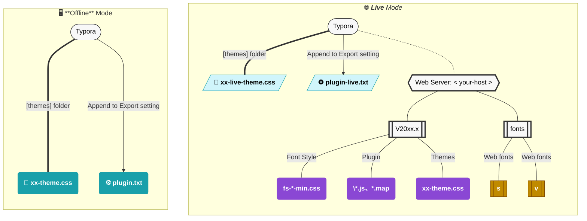

###### ~VLOOK™~<br>Give Your Markdown a New Perspective<br><u>──</u><br>Introduction<br>*`V2026.3`is the Latest*<br><br>**MAX°孟兆**<br>*Copyright © 2016-2026 MAX°DESIGN. All rights reserved.*

[TOC]

> Select language ❯ *[<kbd>🇨🇳 简体中文</kbd>](index.md)*

# What is VLOOK™


<u> **A domestically developed open-source product recommended by [OSChina](https://www.oschina.net/p/vlook)**<br> **[AtomGit](https://atomgit.com/MadMaxChow/VLOOK) G-Star Program Project**.</u>

== **VLOOK™** is a **THEME PACK**_~GnRo~_ and **ENHANCEMENT PLUGIN**_~PuOg~_ for [Typora](https://typora.io)[^Typora] ,<br>is an open-source software that follows the **MIT License**.==

**[*Editor`Typora`V1.9+*_~Gy~_](https://typoraio.cn)　*License`MIT`*_~Rd~_　*`Keywords`Theme, Plugin*_~Pu~_　*`Supported OS`Windows, macOS, Linux*_~Bu~_**

**[](https://github.com/MadMaxChow/VLOOK/releases)  [&labelColor=04B1CC&color=9A4EE6#logo#round2s)](https://github.com/MadMaxChow/VLOOK/releases)  [](https://github.com/MadMaxChow/VLOOK/stargazers)**

> - 👍 It is also Typora - recognized and supported theme pack and enhanced plugin, for details: [Typora Support - Export](https://support.typora.io/Export/#example-export-using-vlook)
> - 👍 [OSChina](https://www.oschina.net/p/vlook) recommended domestic open source products
> - 👍 [AtomGit](https://atomgit.com/MadMaxChow/VLOOK) **G-Star** Project 
>


**Partner Resources:**

> <a href="https://www.producthunt.com/posts/vlook?embed=true&utm_source=badge-featured&utm_medium=badge&utm_souce=badge-vlook" target="_blank"></a>  <a href="https://hellogithub.com/repository/aa6c612ca3de42a082b15053be4ce3c3" target="_blank"></a>


> ###### Agreement
>
> VLOOK™ is open source software and complies with the following open source agreements:
>
> ```LICENSE of VLOOK™
>MIT License
> Copyright (c) 2016-2026 MAX°DESIGN | Max Chow
> Permission is hereby granted, free of charge, to any person obtaining a copy of this software and associated documentation files (the "Software"), to deal in the Software without restriction, including without limitation the rights to use, copy, modify, merge, publish, distribute, sublicense, and/or sell copies of the Software, and to permit persons to whom the Software is furnished to do so, subject to the following conditions:
> The above copyright notice and this permission notice shall be included in all copies or substantial portions of the Software.
> THE SOFTWARE IS PROVIDED "AS IS", WITHOUT WARRANTY OF ANY KIND, EXPRESS OR IMPLIED, INCLUDING BUT NOT LIMITED TO THE WARRANTIES OF MERCHANTABILITY, FITNESS FOR A PARTICULAR PURPOSE AND NONINFRINGEMENT. IN NO EVENT SHALL THE AUTHORS OR COPYRIGHT HOLDERS BE LIABLE FOR ANY CLAIM, DAMAGES OR OTHER LIABILITY, WHETHER IN AN ACTION OF CONTRACT, TORT OR OTHERWISE, ARISING FROM, OUT OF OR IN CONNECTION WITH THE SOFTWARE OR THE USE OR OTHER DEALINGS IN THE SOFTWARE.
> ```

[^Typora]: Typora is a cross-platform Markdown editor (perhaps the best editor at the moment), which supports direct preview and editing. For more detailed features, please refer to the [official websit](https://www.typora.io).

# Prepared For

==If you also have one or more of the following needs or pain points, you can safely try the Markdown-based document solution for document editing, publishing, and management. The recommended combination is **Typora + VLOOK™**==

​	Are you also tired of the same old layout and experience of Markdown documents?  VLOOK™ keeps the elegance of Markdown while giving your documents a completely new look.

​	It provides a **consistent**, **simple**, and **friendly** experience in areas such as **document layout**, **content marking**, **content navigation**, **presentation assistance**, and interactive features.


​	With just a few simple installation steps, you can enjoy documents with cool themes, rich layouts, and friendly interactions:

- Using Markdown to write documentation, but with higher demands for the layout and interactivity of either the Markdown editor or its generated HTML output.
- For the documents you write, you hope that *???**Unified template and output***_~T1~_ ,  and preferably *???**Change theme any time***_~T2~_
- You want to focus solely on writing the content, and wish for the tedious tasks of content arrangement and formatting to be automated.
- You aim to reduce expenses on software tools like Word for documentation or Visio for diagramming, or simply find the formatting operations in these tools tiresome.
- You need support for cross-platform and cross-device document viewing and publishing.
- The output documents should provide interactive assistance tools during reading, review, or presentation—such as a table of contents/captions index, spotlight, laser pointer, footnotes, and so on.

---

> **💡 Do you know?**
>
> **AMAZING!!!** This document is created by Typora and using the VLOOK™ theme and plugin ~
>
> _~Bn!~_

# ==Donate==

<u>**Thanks for donate VLOOK™ (partial donors)**</u>

==**Peter**_~PuOgRd~_、**绿邃清幽**_~CyBuAq~_、**李导996**_~CyBuAq~_、**fanky**_~CyBuAq~_、**＊丽**_~CyBuAq~_、**杨琛**_~CyBuAq~_、**＊哦**_~GnBn~_、**＊豫**_~GnBn~_、**l＊a**_~GnBn~_、**＊o**_~GnBn~_、ocean、swingingroi、＊胡、K＊y、行川、＊药、＊山、＊魂、＊士、＊狗、＊R、＊Z、＊川、l＊n、＊朽、＊杰、A＊C、W＊l、＊山、J＊o、韩宗辉、＊星、一叶知秋、d＊、＊军、＊鹏、＊无、H＊t、＊二、＊宇、＊辉、＊秋、＊笑、＊心、整＊9、＊国、＊哥、乌拉、＊龙、远方眼前、＊雩、＊应、＊销、E＊y、…==

---

> **Your coffee keeps VLOOK™ running ☕️**
>
> [](https://paypal.me/madmaxchow)
>
> _~Se~_

> **你的咖啡，能让 VLOOK™ 保持活力 ☕️**
>
> 
>
> _~Gn~_

# Quick Start

<u>VLOOK™ continues to **explore and expand** Markdown and CSS, and at the same time combines the Internet-based application scenarios of documents~<br>In **the document layout** , **content navigation** , **presentation aid** , **interactive experience** provided and other aspects of the **consistent** , **concise** , **and friendly** experience.</u>


*==Introduction video==*

<iframe src="//player.bilibili.com/player.html?isOutside=true&aid=113423643837219&bvid=BV1miDpY5ERh&cid=26611613913&p=1&autoplay=0" scrolling="no" border="0" frameborder="no" framespacing="0" allowfullscreen="true"></iframe>


---

> 
>
> **° FORMATTING & TAGGING**
>
> **VLOOK™ themes and plugins give you a new understanding and application of the automated typesetting capabilities of Markdown editors (currently only supporting Typora).**
>
> In addition to providing rich capabilities for document layout and content identification, it also enables static documents to "move" with you based on HTML format.
>
> [<kbd>Learn More </kbd>](?target=vdl#Quick Start ° Formatting)  *[<kbd>Samples</kbd>](#Typesetting and Editing Services)*
>
> _~Vn!~_

> 
>
> **° NAVIGATION**
>
> **VLOOK™ provides tools for navigation, quick positioning, and content organization in various forms such as document content, chapters, illustrations, tables, and multimedia, comprehensively improving and enhancing the browsing experience and efficiency of published HTML files.**
>
> Feel free to enjoy at any time according to your needs and preferences~
>
> [<kbd>Learn More </kbd>](?target=vdl#Quick Start ° Navigation)  *[<kbd>Samples</kbd>](#Typesetting and Editing Services)*
>
> _~Bu!~_

---

>
>
> **° PRESENTATION & PUBLICATION**
>
> **VLOOK™ uniquely provides powerful presentation and publishing tools, making Typora + VLOOK a more productive Markdown document solution.**
>
> It is a very suitable presentation assistance tool for on-site and remote use, enabling Turbo mode for your documents~
>
> [<kbd>Learn More </kbd>](?target=vdl#Quick Start ° Presentation and Publishing)  *[<kbd>Samples</kbd>](#Typesetting and Editing Services)*
>
> _~Og!~_

>
>
>**° APPEARANCE & ESSENTIALS**
>
>"**Humans have always been visual creatures. Making the eyes feel pleasant and beautiful when reading, whether for oneself or others, is a virtue, a power, a belief.**"
>
>　　　　--- MAX°孟兆
>
>
>
>[<kbd>Learn More </kbd>](?target=vdl#Quick Start ° Appearance & Essentials)  *[<kbd>Samples</kbd>](#Typesetting and Editing Services)*
>
>_~Lm!~_


> [!IMPORTANT]
>
> Some features of VLOOK™ require the export to HTML in order to be supported.
>
> Please pay attention to the "Applicable Scope" description for each feature in the reference manual, for example:
>
> > ***`Editing`× OFF*_~Gy~_ *`Editing`✓ ON*_~Gn~_ **

# Blog


<u>Blogs selected for the "**Zhihu • Sea Salt Project**" •• [Go go go](https://www.zhihu.com/people/maxchow/posts)</u>

# How to Use

==You can start a brand **new Markdown experience** in **just 3 steps**, give your Markdown a new perspective!==

<u>VLOOK™ supports ==Offline== and ==**Live**== installation modes,<br>both of which can be configured for flexible selection during use~</u>

---

> **📦 Offline Mode**
>
> Packages the theme and plugin into the generated `HTML` ,
> ideal for use without a website or internet connection.
>
> > However, a single HTML file may be relatively large, and when maintaining a large number of files, the efficiency of updates and management is lower compared to the online mode. Additionally, access to font style resources may be limited.
>
> _~Bn~_

> **🌐 Live Mode**
>
> Publishes the theme and plugin to your own `website` , ideal for broader content distribution and timely updates.
>
> > Requires a prepared website (you can also use free overseas Pages services such as those provided by Cloudflare or GitHub).
>
> _~Bu~_


*==Diagram of Different Deployment Modes==*



## Prepare

> **Download the Plug-in  ❯**
>
> [<kbd> GitHub</kbd>](https://github.com/MadMaxChow/VLOOK/releases)    *[<kbd> AtomGit</kbd>](https://atomgit.com/MadMaxChow/VLOOK/releases)*    *[<kbd> gitee</kbd>](https://gitee.com/madmaxchow/VLOOK/releases)*

> **Configure Typora  ❯**
>
> 1. Download and install the latest version of [Typora](https://www.typora.io) ;
> 2. Open menu *==Typora ▸ Settings ▸ Markdown==*;
> 3. Enable all options under `Markdown Extended Syntax` , `Code Blocks` . See the figure below for details:
>
> 
>

## Offline Mode Installation

### Install Theme Package

_^tab^_

> **Add the Themes  ❯**
>
> 1. Open folder *==released/**themes**==*
> 1. Copy all **CSS files** & `vlook` **subfolder** in this directory to Typora's theme directory
>
>
> > **Where is the theme directory of Typora?** 
> >
> > Open menu *==Typora ▸ Settings ▸ Appearance==*, click <kbd>Open Theme Folder</kbd>
>

> **Select Theme**
>
> 1. Restart Typora
> 2. Click menu *==Typora ▸ Themes==* , select to `Vlook ***` any topic can be in the form of naming ([Click here to preview the built-in themes](guide3.md#Built-in Template Themes))
>


**[<kbd> Learn about VLOOK™ Theme Custom Services</kbd>](vip-en.md)**


> ###### Start Writing from the Samples
>
> It is recommended to refer to or base your own Markdown document on the sample document of VLOOK™, making it easier to create well-formatted documents.
>
> 1. All `.md` type files in the directory *==released/samples==* is samples;
> 2. You can also download the document templates directly from project homepage:
>
> [<kbd> Download samples</kbd>](https://github.com/MadMaxChow/VLOOK/tree/master/released/samples)  *[<kbd> Alternative link</kbd>](https://gitee.com/madmaxchow/VLOOK/tree/master/released/samples)*

### Configure Export Options

_^tab^_

> **Export to HTML ❯**
>
> 1. Create an HTML export configuration:
>    1. Open Typora export configurations
>    2. Open the menu *==Typora > File > Export > Export Configurations==*
>    3. Add a configuration (select ==HTML== template) and name it `VLOOK-HTML`
> 2. Install the plugin (**Optional, for documents that use VLOOK™ extended syntax**):
>    1. Clear the content of the `Append in <head />` configuration field
>    2. Open the plugin file: *==released/plugin/**plugin.txt**==*
>    3. Select all and copy the entire content
>    4. Paste the copied content into the configuration field
>
> 

> **Export to PDF ❯**
>
> 1. Create a PDF export configuration:
>    1. Open Typora export configurations
>    2. Open the menu *==Typora > File > Export > Export Configurations==*
>    3. Add a configuration (select ==PDF (Typora / WebKit)== template) and name it `VLOOK-PDF`
> 2. Install the plugin:
>    1. Clear the content of the `Append Extra Content (HTML)` configuration field
>    2. Open the plugin file: *==released/plugin/**plugin.txt**==*
>    3. Select all and copy the entire content
>    4. Paste the copied content into the configuration field
>
> 

> **Sample Files**
>
> 1. Open an MD file that conforms to the VLOOK™ specifications (refer to the files under *==released/**samples**==*)
> 2. Click the menu *==Typora ▸ File ▸ Export==* and select one of the export configurations created above to export
>
> > [!TIP]
> >
> > The current document, along with all Markdown documents of the VLOOK™ [Guide](guide-en.md) and more sample documents, can be found under *==released/**samples**==*.


> [!CAUTION]
>
> Currently, two methods are supported for exporting PDFs:
>
> - **Method 1: Export standard PDF directly from Typora**
>   *Does not involve layout enhancements.*
>
> - **Method 2: Export enhanced PDF directly from Typora**
>   *Involves layout enhancements, <u>plugin install required</u>.*
>
> - **Method 3: Export HTML first, then publish as PDF**
>   *Suitable for controlling more PDF export options.*
>   That is, first complete the above-described "Export as HTML", then open the exported file in a browser and use the VLOOK™ **[Publish as PDF](guide3-en.md#Publish as PDF)** feature. This method provides more control options, see [details](guide3-en.md#Publish as PDF).
>
> ---
>
> **🚨 Note 🚨**
>
> When using **Method 1 or 2**, if any of the following situations apply, it is recommended to export the PDF using **Method 2** first:
>
> - It is expected to have more control and customization over the content of the exported PDF
> - **Windows environment**: the Typora version in use is **1.12.x or earlier**
> - **macOS environment:** The document contains Mermaid diagrams, or the theme includes translucent/gradient elements
>
> **(Some of the issues above will be fixed in Typora version 1.13.x and later)**  

### Language Package (Optional)

VLOOK™ UI language is pre-installed with *English`English`*_~Se~_、*Chinese`简体`*_~Rd~_ by default.

To support more language for the exported HTML, you can choose to append the content of the corresponding language package to the "Meta Tag" section in the export configuration. After doing so, re-export the HTML to include the additional language.

<u>Currently supported languages for expansion include:</u>

***French`Français`*_~La~_  *German`Detusch`*_~Bk~_  *Russian`Русский`*_~Bu~_  *Spanish`Español`*_~Ye~_  *Portuguese`Português`*_~Wn~_<br>*Chinese`繁文`*_~Rd~_   *Japanese`日本語`*_~Gy~_  *Korean`한국어`*_~Se~_*Arabic`العربية`*_~Mn~_**


<u>"Online Mode" adapts language automatically, whereas ==Offline Mode== requires ==manual handling== as needed:</u>

_^tab^_

> **1. Select Language Package  ❯**
>
> 1. The language package file is located in the *==released/plugin/lang==*
> 2. Open language file and copy all the content. (e.g: `Français.txt` )

> **2. Config Language Package**
>
> 1. Open *==Typora > Preferences==* and select the export configuration `VLOOK` that you created in the previous steps
> 2. Paste the copied content at the beginning of the `Insert to <head />` configuration
> 3. If you need to add multiple language packages, repeat the steps above
> 


## Live Mode Installation

**First, complete the setup of your own web site, and then proceed with the following resource deployment, site domain adjustments, and related operations.**

### Online Themes & Plugins

_^tab^_

> **Install Online Themes**
>
> 1. Open the required “online version” theme file in the *==released/**themes-live**==* directory with a text editor (e.g., `vlook-live-hope.css`).
> 2. Search for all occurrences of `<your-host>` in the file, replace them with your website domain, and save.
> 3. Refer to the steps in "[Install Theme Package](#Install Theme Package)" above, and copy the modified **`live` version** theme file into Typora’s theme directory.

> **Deploy Themes to the Website**
>
> 1. Create a VLOOK **theme resource directory** on the website corresponding to the currently deployed version (e.g., `V2025.10`).
> 2. Open the required theme file in *==released/**themes-live**/V20xx.x==* with a text editor (e.g., `vlook-hope.css`).
> 3. Search for all occurrences of `<your-host>`, replace them with your website domain, and save.
> 4. After completing the update, upload the files to the website’s **theme resource directory** (e.g., `V2025.10`).

> **Deploy Plugins to the Website**
>
> 1. Upload all files and subdirectories under *==released/**plugin-live**/V20xx.x==* to the website’s **theme resource directory** (e.g., `V2025.10`).

### Online Font Styles

_^tab^_

> **Deploy Web Fonts**
>
> 1. Create a VLOOK **font style resource directory** on the website (e.g., `fonts`).
> 2. Download the latest release of [openfonts](https://github.com/MadMaxChow/openfonts/releases) from GitHub (e.g., `web-font-V2.0.tar.gz`).
> 3. After extraction, upload all subdirectories inside (e.g., `s`, `v`) to the website's **font style resource directory** (e.g., `fonts`).

> **Reference Web Fonts**
>
> 1. Open all **CSS files** starting with `fs-` under *==released/**theme-live**/V20xx.x==* using a text editor.
> 2. Search for all occurrences of `<your-host>`, replace them with your website domain, and save.
> 3. After completing the update, upload the files to the website's **theme resource directory** (e.g., `V2025.10`).

> [!IMPORTANT]
>
> - If your website does not create resource directories using the recommended names (e.g., `fonts`, VLOOK version numbers), you must update not only `<your-host>` but also the corresponding resource directory names that follow it.
> - If HTML published using older versions of themes or plugins is not republished, keep the original version directories and do not delete them.

### Live Export Options

_^tab^_

> **Configure Resource References**
>
> 1. Open *==released/plugin/**plugin-live.txt**==* with a text editor.
> 2. Search for all `<your-host>` entries, replace them with the domain of the web site, and save.
> 3. The related configuration items and descriptions are as follows:
>    - `<link rel="preconnect" ...>` - the server domain name for preconnection
>    - `<link rel="dns-prefetch" ...>` - (same as above)
>    - `<meta name="vlook-js" ...>` - the URL of the subdirectory containing js files
>    - `<meta name="vlook-fs" ...>` - the URL of the subdirectory containing web font files

> **Configure Live Mode Export Options**
>
> Refer to the above "[Configure Export Options](#configure-export-options)" steps, and create a new export configuration for the online mode. The main differentiated handling is as follows:  
>
> - It is recommended to add `(live)` to the export configuration name for distinction, e.g., `VLOOK (live)`
> - What needs to be pasted is the "online plugin" *==released/plugin/**plugin-live.txt**==*


> [!TIP]
>
> The current document, along with all Markdown documents of the VLOOK™ [Guide](guide-en.md) and more sample documents, can be found under *==released/**samples**==*.

## Install Local Fonts (Optional)

VLOOK™ provides 8 distinctive [Font Style](guide3-en.md#Font Style) options. Some Font Style marked with (WebFont) require an Internet connection to load and take effect properly.

If you cannot connect to the Internet or your network is slow, it is recommended to download the fonts for local installation.

---

---

---

> 
>
> _~Gy~_

> 
>
> _~Gy~_

> 
>
> _~Gy~_

> 
>
> _~Gy~_

---

---

---

> 
>
> _~Gy~_

> 
>
> _~Gy~_

> 
>
> _~Gy~_

> 
>
> _~Gy~_

[<kbd>Visit VLOOK™ Font Style Project</kbd>](https://github.com/MadMaxChow/openfonts/releases/download/V2.1/install-font-V2.1.tar.gz)    *[<kbd>Download directly</kbd>](https://github.com/MadMaxChow/openfonts/releases/download/V2.1/install-font-V2.1.tar.gz)*

> [!NOTE]
>
> - Locally installed font package file: **install-font-Vxx.x.tar.gz**
> - You can choose to install only the font packages for the styles you want to use, or install all of them;  
> - Some fonts are duplicated across different Font Style. If you are prompted that a font already exists during installation, you can skip installing that font.


<u>If you wish to use a **Specific Font Style** by default, you can subscribe to VLOOK™’s ==Custom Theme Service== .</u>

**[<kbd>Explore More About VIP Themes</kbd>](vip-en.md)**

## **🧰** Upgrade and Compatibility

---

> **  How to update to latest version ?**
>
> If a new version is available, an upgrade notification icon  will appear in the bottom right corner. To update, simply repeat the steps mentioned above in [How to Use](#How to Use).
>
> _~Bu~_

> **  Recommend compatible browser !**
>
> In order to ensure the best user experience, it is strongly recommended to use the following browsers to access:
>
>  **[Chrome](https://www.google.cn/chrome/)**　　 **[Edge](https://www.microsoft.com/edge)**　　 **[Firefox](https://www.mozilla.org/firefox/)**
>
> _~Bu~_

---

> **Cross-Platform**
>
> HTML documents published using VLOOK™ can automatically adapt to different screens and resolutions of various devices such as desktops, tablets, and mobile phones, providing the most suitable reading and usage experience.
>
> _~La~_

> **Animation Effect**
>
> The enhanced motion effects (including frosted glass) will be enabled by default. You can reduce the level of motion effects according to the actual situation. The adjustment can be made through the `effect` of the '[Plugin Tuning Parameters](guide3-en.md#Plugin Tuning Parameters)'.
>
> > ###### How to enable Glass-Effect in Firefox?
> >
> > If you find that the frosted glass effect cannot be displayed in the Firefox browser, you can take the following steps:
> >
> > - Enter `about:config` in the address bar
> > - Search for the configuration item `layout.css.backdrop-filter.enabled` and set it to `true`
>
> _~La~_

# ==Premium Services==

## Theme Customization Service

<u>The "**Customization Service**" for Themes is now open! Here are some reference cases for private customization.</u>

[](https://madmaxchow.github.io/VLOOK/vip.html)


**[<kbd> Learn more</kbd>](vip-en.md)**

## Plugin Feature Customization Services

==For more personalized needs in document layout, interaction, and publishing, we offer custom plugin feature development~==

**[<kbd>💬 Contact Us</kbd>](vip-en.md#Contact Us)**

## Typesetting and Editing Services


<u>Based on the content and audience of your document, fully utilize the numerous features of Typora + VLOOK™, to provide services like **Docment Typesetting**, **Content Revision**, **Knowledge Base Construction**, **Publishing Guidance**, **Website Hosting**.</u>

**[<kbd> Learn more</kbd>](https://madmaxchow.github.io/VLOOK/vip.html)**


> [!TIP]
>
> - **Welcome to submit your own examples of using Typora + VLOOK™ ~ Share your best practice experiences with everyone ~**_~GnOg~_
>
> - For more practical samples, please refer to the directory in the download package *==released\\[samples](https://github.com/MadMaxChow/VLOOK/tree/master/released/samples)==*

# ==Brand Merchandise==

## Wallpaper

==The same style as the official theme, with references to **common grammar** and **color codes**==


<u>Choose the required resolution version</u>


[<kbd>1336 × 768</kbd>](https://vlook-doc.pages.dev/pic/VLOOK-wallpaper-1336x768.png)  [<kbd>1440 × 900</kbd>](https://vlook-doc.pages.dev/pic/VLOOK-wallpaper-1440x900.png)  [<kbd>1920 × 1080</kbd>](https://vlook-doc.pages.dev/pic/VLOOK-wallpaper-1920x1080.png)  [<kbd>2560 × 1440</kbd>](https://vlook-doc.pages.dev/pic/VLOOK-wallpaper-2560x1440.png)  [<kbd>2560 × 1600</kbd>](https://vlook-doc.pages.dev/pic/VLOOK-wallpaper-2560x1600.png)


**If you need more personalized wallpapers, you can specify your requirements when [submitting a theme customization request](#Theme Customization Service) ~**

## Physical Products


**[<kbd> I Want - Mouse Pad</kbd>](https://m.tb.cn/h.hZv7kfL?tk=Q2KVVJAuOVI)**


**[<kbd> I Want - Desk Pad</kbd>](https://m.tb.cn/h.hZv7kfL?tk=Q2KVVJAuOVI)**


**If you need more personalized physical merchandise, you can specify your requirements when [submitting a theme customization request](#Theme Customization Service) ~**

# Discussion & Communication

> **Discussion and Communication**
>
> [<kbd>✈️ Telegram Channel</kbd>](https://t.me/vlook_markdown)    *[<kbd>💬 QQ Group (805502564)</kbd>](https://qm.qq.com/q/O0tNC6WBWe)*


---

> **Unpublished via YAML**
>
> Content

> ###### ~~Unpublished via Strike~~
>
> Content

## Unpublished via YAML

The content of this section is marked as not published by specifying it in YAML.

# Coming Soon ...

## ~~V2026.3~~

---

---

> 
>
> ==Live Mode==
>
> <u>Provides a complete online deployment mode for users with self-built web sites, which can reduce network traffic and improve page loading response speed~</u>
>
> [<kbd> Consultation</kbd>](#Discussion & Communication)
>
> _~Bu!~_

> 
>
> ==Publish to PDF==
>
> <u>Provides export-to-PDF support for exported HTML files (experimental version released). Participation in testing and feedback are welcome~</u>
>
> [<kbd> Join the Discussion</kbd>](https://github.com/MadMaxChow/VLOOK/discussions/158)
>
> _~Rd!~_

> 
>
> **Got more feature suggestions?**
>
> <u>Welcome to our discussion group on GitHub! Feel free to share your suggestions or pain points you hope to see resolved.</u>
>
> *[<kbd> Share My Idea</kbd>](https://github.com/MadMaxChow/VLOOK/discussions)*
>
> _~Bn~_

# The End