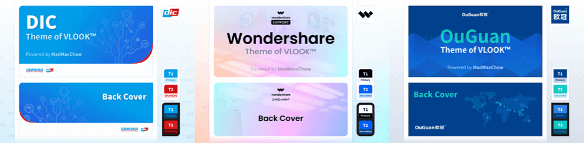

###### 	 ~VLOOK™~<br>让你的 Markdown 有了新看_^wán^_法<br><u>──</u><br>简介<br>*最新版本`V2025.10`*<br>**MAX°孟兆**<br>*COPYRIGHT © 2016-2025. MAX°DESIGN.*

[TOC]

> Select language ❯ *[<kbd>English</kbd>](index-en.md)*

# VLOOK™ 是什么


<u> **[开源中国](https://www.oschina.net/p/vlook) 推荐的国产开源产品。**</u>

== **VLOOK™**_~T1~_ 是针对  [Typora](https://typoraio.cn)[^Typora] **主题包**_~GnRo~_ 和 **增强插件**_~PuOg~_，<br>属于开源软件（遵从 **MIT License**_~Rd~_)。==

**[*编辑工具`Typora`V1.9+*_~Gy~_](https://typoraio.cn)　*开源协议主`MIT`*_~Rd~_　*`关键字`主题、插件*_~Pu~_　*`支持的操作系统`Windows, macOS, Linux*_~Bu~_**

**[](https://github.com/MadMaxChow/VLOOK/releases)  [&labelColor=04B1CC&color=9A4EE6#logo#round2s)](https://github.com/MadMaxChow/VLOOK/releases)  [](https://github.com/MadMaxChow/VLOOK/stargazers)**


> - Typora 官方认可支持的主题包和增强插件，详见 [Typora Support - Export](https://support.typora.io/Export/#example-export-using-vlook) 
> - [OSCHINA (开源中国)](https://www.oschina.net/p/vlook) 推荐的国产开源项目
>


**合作资源：**

---

---

> [](https://www.producthunt.com/posts/vlook?embed=true&utm_source=badge-featured&utm_medium=badge&utm_souce=badge-vlook")

> [](https://hellogithub.com/repository/aa6c612ca3de42a082b15053be4ce3c3)

> [](https://sakuraxy.top/)


> ###### 许可协议
>
> VLOOK™ 属于开源软件，遵从以下开源协议：
>
> ```LICENSE
> MIT License
> Copyright (c) 2016-2025 MAX°DESIGN | Max Chow
> Permission is hereby granted, free of charge, to any person obtaining a copy of this software and associated documentation files (the "Software"), to deal in the Software without restriction, including without limitation the rights to use, copy, modify, merge, publish, distribute, sublicense, and/or sell copies of the Software, and to permit persons to whom the Software is furnished to do so, subject to the following conditions:
> The above copyright notice and this permission notice shall be included in all copies or substantial portions of the Software.
> THE SOFTWARE IS PROVIDED "AS IS", WITHOUT WARRANTY OF ANY KIND, EXPRESS OR IMPLIED, INCLUDING BUT NOT LIMITED TO THE WARRANTIES OF MERCHANTABILITY, FITNESS FOR A PARTICULAR PURPOSE AND NONINFRINGEMENT. IN NO EVENT SHALL THE AUTHORS OR COPYRIGHT HOLDERS BE LIABLE FOR ANY CLAIM, DAMAGES OR OTHER LIABILITY, WHETHER IN AN ACTION OF CONTRACT, TORT OR OTHERWISE, ARISING FROM, OUT OF OR IN CONNECTION WITH THE SOFTWARE OR THE USE OR OTHER DEALINGS IN THE SOFTWARE.
> ```


> ######  Markdown 是什么？
>
> - 2004 年，[John Gruber](https://en.wikipedia.org/wiki/John_Gruber) 创造了 [ Markdown](https://zh.wikipedia.org/wiki/Markdown)，一种专门针对网络写作的 *`文本标记语言`* 。使用 Markdown，你只需在写作过程中插入少量的标记符号，就能很轻松地进行排版（例如设置标题、加粗、列表、引用块等）；
> - Markdown 文档以 *`纯文本格式存储`* ，这意味着，它们可以用几乎任一种文本编辑器打开。同时，又能通过 Markdown 编辑器导出为带排版的富文本文档、HTML 网页等等。==纯粹、简洁、易用、灵活==，都是人们喜欢 Markdown 的原因。
>
> ###### Markdown Logo
>
> 

[^Typora]: Typora 是跨平台的 Markdown 编辑器（也许是目前最好的编辑器），支持直接预览与编辑，更详细的特性详见[官网](https://www.typora.io)

# 为谁准备

_^tab^_

==如果你也有以下一个或多个需求或痛点，就可以放心地尝试基于 Markdown 的文档解决方案进行文档的编辑、发布、管理，建议组合是 **Typora + VLOOK™**_~BkGyT1T1T2~_==

你是否也厌倦了 Markdown 文档千篇一律的排版和体验？VLOOK™ 在保持 Markdown 优雅的同时，还能让你编写的文档焕然一新。

在 **文档排版**、**内容标记**、**内容导航**、**演示辅助**、交互体验 等方面提供了 **一致**、**简洁**、**友好** 的体验。


只需简单几步的安装配置，你也可以拥有主题炫酷、排版丰富、交互友好的文档～


- 使用 Markdown 写文档，但对 Markdown 编辑器，或其输出的 HTML 的排版、交互有更多的需求
- 对于编写的文档，希望 *??? **统一模板与输出***_~T2~_ ，并且最好 *??? **随时切换不同模板***_~T2~_
- 希望只关注文档内容的撰写，内容编排、格式设置这种繁琐的排版工作希望能==自动化==完成
- ==减少==在文档（如：Word）、制图（如：Visio）等软件工具方面的==购买支出==，或是这些软件排版==操作感觉厌烦==
- 需要支持==跨平台==、==跨终端==进行文档浏览和文档发布方式
- 输出的文档能在阅读、评审、演示时，能提供交互辅助的工具（如目录/题注等内容索引、聚光灯、激光笔、脚注等）


> **💡 您知道吗？**
>
> **AMAZING!!!** 您正在浏览的这份文档，就是由 Typora 编辑并应用 VLOOK™ 主题与插件生成的～
>
> _~Bn!~_

# ==打赏==

<u>**感谢打赏支持 VLOOK™ 的客官（部分名单）**</u>

==**Peter**_~PuOgRd~_、**绿邃清幽**_~CyBuAq~_、**李导996**_~CyBuAq~_、**fanky**_~CyBuAq~_、**＊丽**_~CyBuAq~_、**杨琛**_~CyBuAq~_、**＊哦**_~GnBn~_、**＊豫**_~GnBn~_、**l＊a**_~GnBn~_、**＊o**_~GnBn~_、K＊y、行川、＊药、＊山、＊魂、＊士、＊狗、＊R、＊Z、＊川、l＊n、＊朽、＊杰、A＊C、W＊l、＊山、J＊o、韩宗辉、＊星、一叶知秋、d＊、＊军、＊鹏、＊无、H＊t、＊二、＊宇、＊辉、＊秋、＊笑、＊心、整＊9、＊国、＊哥、乌拉、＊龙、远方眼前、＊雩、＊应、＊销、E＊y、…==

---

> **你的咖啡，能让 VLOOK™ 保持活力 ☕️**
>
> 
>
> _~Gn~_

> **你的咖啡，能让 VLOOK™ 保持活力 ☕️**
>
> 
>
> _~Bu~_

# 快速入坑

<u>VLOOK™ 通过持续 **挖掘和扩展** Markdown 和 CSS，同时结合了文档的互联网化应用场景～<br>在 **文档排版、内容标记、内容导航、演示辅助、交互体验**_~GnOgSe~_ 等方面提供了 **一致、简洁、友好**_~PuOgRo~_ 的体验。</u>

*==简介视频==*

<iframe src="//player.bilibili.com/player.html?isOutside=true&aid=113423643837219&bvid=BV1miDpY5ERh&cid=26611613913&p=1&autoplay=0" scrolling="no" border="0" frameborder="no" framespacing="0" allowfullscreen="true"></iframe>


---

> 
>
> **° 文档排版与内容标记**
>
> **VLOOK™ 主题及插件，让你对 Markdown 编辑器（暂只支持 Typora）的自动化排版能力有了全新的理解和应用。**
>
> 提供了丰富的文档排版、内容标识的能力外，还基于 HTML 格式让静态的文档也能与你一起「动」起来～
>
> [<kbd>了解更多 </kbd>](?target=vdl#快速入坑°文档排版)  *[<kbd>范例参考</kbd>](#排版编辑服务)*
>
> _~Vn!~_

> 
>
> **° 内容导航**
>
> **VLOOK™ 提供了对文档内容、章节、插图、表格、多媒体多种形式的导航、快速定位和内容组织的工具，全面改善和提高发布的 HTML 文件的浏览体验和效率。**
>
> 无多余动作，聚焦文档撰写。一键导出之时，即完成自动集成～
>
> [<kbd>了解更多 </kbd>](?target=vdl#快速入坑°内容导航)  *[<kbd>范例参考</kbd>](#排版编辑服务)*
>
> _~Bu!~_

---

> 
>
> **° 演示与出版**
>
> **VLOOK™ 独创性地提供了强大的演示与出版工具，让 Typora + VLOOK 成为更具生产力的 Markdown 文档解决方案。**
>
> 非常适合现场和远程的演示辅助工具，为你的文档开启 Turbo 模式～
>
> [<kbd>了解更多 </kbd>](?target=vdl#快速入坑°演示与出版)  *[<kbd>范例参考</kbd>](#排版编辑服务)*
>
> _~Og!~_

> 
>
> **° 外观与不杂项**
>
> 「**人类从来都是视觉动物，自己或他人在阅读时，让眼睛感受愉悦和美好，是一种美德、一种力量、一种信仰。**」
>
> 　　　　—— MAX°孟兆
>
> 
>
> [<kbd>了解更多 </kbd>](?target=vdl#快速入坑°外观与不杂项)  *[<kbd>范例参考</kbd>](#排版编辑服务)*
>
> _~Lm!~_


> [!IMPORTANT]
>
> VLOOK™ 的部分特性需要通过导出 HTML 后才能支持。
>
> 具体请留意使用攻略中各特性的「适用范围」说明，如：
>
> > ***`编辑时`× 不支持*_~Gy~_ *`编辑时`✓ 支持*_~Gn~_ **

# 专题文章


<u>入选「知乎 • 海盐计划[^海盐计划]」的专题文章 •• [点击前往看看](https://www.zhihu.com/people/maxchow/posts)</u>

[^海盐计划]:浪花中的「海盐」，随着一次次击打海岸，逐渐侵蚀珊瑚礁，海的边界得以拓展。而在知乎中分享知识、经验和见解的知友们，也在一次次思想的碰撞与交互中，用专业、真诚的分享，不断拓展知识的边界。海盐给予浪花磅礴的力量，正如数以万计的优质创作者赋能知乎。为了让「海盐」颗粒能够凝聚更大的能量，知乎推出面向创作者的系列政策「海盐计划」已经来到第四期，2022 年，我们将围绕垂直领域的深耕创作这个方向，用流量和收益全面激励深耕创作者。更多官方内容详见「[知乎海盐计划 4.0](https://zhuanlan.zhihu.com/p/516136721)」「[话题 #知乎海盐计划](https://www.zhihu.com/parker/campaign/1501987192373587968)」

# 安装与使用

==只需要三步，让你快速上车，**开启不一样的 Markdown 体验之旅！**_~OgPuBu~_==

## 准备工作

_^tab^_

> **下载插件  ❯**
>
> [<kbd> 从 GitHub 下载</kbd>](https://github.com/MadMaxChow/VLOOK/releases)  *[<kbd> 从 Gitee 下载</kbd>](https://gitee.com/madmaxchow/VLOOK/tags)*

> **配置 Typora  ❯**
>
> 1. 下载并安装 [Typora](https://typoraio.cn) 的最新版本
> 2. 打开菜单 *==Typora ▸ 偏好设置 ▸ Markdown==*
> 3. 启用 `Markdown 扩展语法` 和 `代码块` 下的所有选项。详见下图：
>
> 


<u>VLOOK™ 支持「==离线==」和「==**在线**==」两种安装模式，可同时安装配置，实际使用时再灵活选择～</u>

---

> **📦 离线模式**
>
> 将主题和插件一并打包到生成的 `HTML` 中，适合没有自己的 Web 站点，或不依赖网络直接打开阅读的情况。
>
> > 但单个 HTML 文件大小会相对较大，维护的文件数量较多时，更新管理的效率相对在线模式会低一些。
>
> _~Bn~_

> **🌐 在线模式**
>
> 将主题和插件先发布到自己的 `Web 站点` 上，适用于更大范围的内容发布，以及随时发布更新内容。
>
> > 需要先准备 Web 站点（也可直接使用国外免费的 Pages 服务，如 CloudFlare、GitHub 所提供的 Pages 服务。
>
> _~Bu~_

## 离线模式安装

### 安装主题包

_^tab^_

> **添加主题  ❯**
>
> 1. 打开目录 *==released/**themes**==*
> 1. 将该目录下所有 **CSS 文件** 及**子目录** `vlook`，复制至 Typora 的主题目录下
>
>
> > **Typora 的主题目录在哪？** 
> >
> > 打开菜单 *==Typora ▸ 偏好设置 ▸ 外观==* ，点击 <kbd>打开主题目录</kbd> 定位到该目录
>

> **选用主题**
>
> 1. 重启 Typora
> 2. 点击菜单 *==Typora ▸ 主题==* ，选择以 `Vlook ***` 形式命名的任意主题即可（[点这预览内置主题](guide3.md#预置的模板主题)）
> 


**[<kbd>  提交我的定制主题需求</kbd>](https://wj.qq.com/s2/14818521/bd33/)**

[<kbd> 了解 VLOOK™ 定制主题服务的更多信息</kbd>](vip.md)


> ###### 建议从范例文件开始你的写作
>
> 建议您参考或基于 VLOOK™ 的范例文档创建您自己的 Markdown 文档，这样可以更轻松做出排版质量更好的文档～
>
> 1. 在目录 *==released\samples==*  下的 `.md` 文件都是范例文件；
> 2. 也可直接在项目主页目录中下载：
>
> [<kbd> 下载范例</kbd>](https://github.com/MadMaxChow/VLOOK/tree/master/released/samples)  *[<kbd> 备用链接</kbd>](https://gitee.com/madmaxchow/VLOOK/tree/master/released/samples)*

### 配置导出选项

_^tab^_

> **添加「导出设置」 ❯**
>
> 1. 打开 Typora 导出配置
> 2. 打开菜单 *==Typora > 文件 > 导出 > 导出配置==*
> 3. 添加（==选择 HTML 模板==），并将配置命名为 `VLOOK`
>

> **安装「插件」 ❯**
>
> 1. 首先，清空 `在 <head /> 中添加` 配置的内容
> 2. 打开插件文件：*==released/plugin/**plugin.txt**==*
> 3. 全选，并复制所有内容
> 4. 将复制的内容粘贴至 `在 <head /> 中添加` 配置内
>

> **一键导出为 HTML**
>
> 1. 打开符合 VLOOK™ 规范的 md 文件（参考 *==released/**samples**==* 下的文件 ）
> 2. 点击菜单 *==Typora ▸ 文件 ▸ 导出 ▸ **VLOOK**==* 完成导出
> 


> [!TIP]
>
> 当前文档，以及 VLOOK™ [使用说明攻略](guide.md)的所有 Markdown 文档及更多示例文档，详见 *==released/**samples**==* 下的文件。

### 语言包（可选）

VLOOK™ 的界面语言默认内置了 *英文`English`*_~Se~_、*中文`简体`*_~Rd~_ ，对导出后的 HTML 需要支持更多语言，可以选择将对应语言包的内容，追加到以上导出配置中「元标签」内容的后面，重新导出 HTML 即可。

<u>目前可扩展支持的语种：</u>

***法语`Français`*_~La~_  *德语`Detusch`*_~Bk~_  *俄语`Русский`*_~Bu~_  *西班牙语`Español`*_~Ye~_  *葡萄牙语`Português`*_~Wn~_<br>*中文`繁体`*_~Rd~_  *日语`日本語`*_~Gy~_  *韩语`한국어`*_~Se~_  *阿拉伯语`العربية`*_~Mn~_**


<u>「在线模式」会自动进行语言适配，而对于对于「==离线模式==」根据实际需要进行==手工处理==，具体如下：</u>

_^tab^_

> **1. 选择语言包  ❯**
>
> 1. 语言包文件位于 *==released/plugin/lang==* 目录下
> 2. 打开一个或多个语言文件，并复制所有内容（如：`Français.txt` ）

> **2. 配置语言包**
>
> 1. 首先，清空 `在 <body /> 中添加` 配置的内容
> 2. 打开 *==Typora > Preferences==*，并选择添加的导出配置 `VLOOK` 
> 3. 将复制的内容粘贴到 `在 <body /> 中添加` 配置内
> 4. 若需要添加多个语言包，注意后续的语言包需要以「**追加**」的方式添加到配置项中
>
> 

## 在线模式安装

**先完成你自己的 Web 站点搭建，然后再进行以下资源的部署、站点域名调整等处理**

### 在线插件与字体

_^tab^_

> **引用网络字体**
>
> 1. 用文本编辑器打开 *==released/**theme-live**/**Vxx.x**==* 下的所有以 `fs-` 开头的 **CSS 文件**
> 2. 搜索所有 `<your-host>` 的内容，替换为 Web 站点的域名，并保存
> 3. 完成更新后的文件上传更新至 Web 站点对应的目录下

> **部署在线插件与网络字体**
>
> 1. 将 *==released/**plugin-live**/**Vxx.x**==* 上传至 Web 站点根目录下
> 2. 在 GitHub 上下载 [openfonts](https://github.com/MadMaxChow/openfonts/releases) 的最新版本（如：`web-font-V2.0.tar.gz` ）
> 3. 解压后将里面的所有子目录（如：`s` `v` ）上传至 Web 站点中对应 VLOOK 在线版本的资源目录下（如：`V2025.10` ）


> [!IMPORTANT]
>
> - 以上 `Vxx.x` 是指对应的版本标识，如 `V2025.10` ，作为 VLOOK 在线版本的资源目录
> - 若使用旧版本的主题、插件所发布的 HTML 不重新发布，则需要保留原来版本的目录，不要删除

### 在线主题

_^tab^_

> **安装在线主题**
>
> 1. 用文本编辑器打开 *==released/**themes-live**==* 目录下需要使用的「在线版本」的主题文件（如 `vlook-live-hope.css` ）
> 2. 搜索文件中所有 `<your-host>` 的内容，并替换为 Web 站点的域名，并保存
> 3. 参考以上「[安装主题包](#安装主题包)」的方式，将修改后的「在线版本」的主题文件复制到 Typora 的主题目录中

> **部署主题文件到 Web 站点**
>
> 1. 用文本编辑器打开 *==released/**themes-live**/**Vxx.x**==* 目录下需要使用的主题文件（如 `vlook-hope.css` ）
> 2. 搜索所有 `<your-host>` 的内容，并替换为 Web 站点的域名，并保存
> 3. 完成更新后的文件上传更新至 Web 站点对应的目录下

### 导出选项

_^tab^_

> **配置引用资源**
>
> 1. 用文本编辑器打开 *==released/plugin/**plugin-live.txt**==*
> 2. 搜索所有 `<your-host>` 的内容，替换为 Web 站点的域名，并保存
> 3. 涉及的配置项及说明如下：
>    - `<link rel="preconnect" ...>` — 预连接的服务器域名
>    - `<link rel="dns-prefetch" ...>` — （同上）
>    - `<meta name="vlook-js" ...>` — js 文件所在子目录的 URL
>    - `<meta name="vlook-fs" ...>` — 网络字体文件所在子目录的 URL

> **配置导出选项**
>
> 参考以上「[配置导出选项](#配置导出选项)」操作，新建针对在线模式的导出配置，主要区别化处理内容如下：
>
> - 导出配置的命名建议增加 `(live)` 进行区分，如：`VLOOK (live)`
> - 需要粘贴的是「在线版插件」*==released/plugin/**plugin_live.txt**==*


> [!TIP]
>
> 当前文档，以及 VLOOK™ [使用说明攻略](guide.md)的所有 Markdown 文档及更多示例文档，详见 *==released/**samples**==* 下的文件。

## 安装本地字体（可选）

VLOOK™ 提供了 8 套个性突出的[字体风格](guide3.md#字体风格)选择，其中部分带有 (WebFont) 标记的字体风格须连接互联网才能正常加载和生效。

若无法连接网络或网络速度较慢，建议下载字体在本地进行安装。

---

---

---

> 
>
> _~Gy~_

> 
>
> _~Gy~_

> 
>
> _~Gy~_

> 
>
> _~Gy~_

---

---

---

> 
>
> _~Gy~_

> 
>
> _~Gy~_

> 
>
> _~Gy~_

> 
>
> _~Gy~_

**[<kbd>下载字体包</kbd>](https://github.com/MadMaxChow/openfonts/releases/download/V2.0/install-font-V2.0.tar.gz)**

> [!NOTE]
>
> - 可以选择所需要使用的字体风格的字体包进行安装，也可以全部安装；
> - 部分字体在不同字体风格中会有重复，安装时若提示已存在，可以跳过对应字体的安装。


<u>若希望默认使用**指定的字体风格**，可以订阅 VLOOK™ 的 ==定制主题服务== 。</u>

**[<kbd>去探索更多定制主题的介绍</kbd>](vip.md)**

## **🧰** 升级与兼容性

---

> **  如何更新到最新版本？**
>
> 若有新版本，在右下角会出现新版本升级提示图标  ，重复以上 [安装与使用](#安装与使用) 中的步骤进行操作即要完成更新。
>
> _~Bu~_

> **  推荐选择兼容的浏览器！**
>
> 为保障最佳的使用体验，强烈建议使用以下浏览器访问：
>
>  **[Chrome](https://www.google.cn/chrome/)**　　 **[Edge](https://www.microsoft.com/edge)**　　 **[Firefox](https://www.mozilla.org/firefox/)**
>
> _~Bu~_

---

> **跨平台**
>
> 使用 VLOOK™ 发布的 HTML 文档能自适应在台式机、平板、手机等多种设备不同屏幕和分辨率，提供最为合适的阅读和使用体验。
>
> _~La~_

> **动效**
>
> 默认会启增强动效（包括毛玻璃），可以根据实际降低动效级别，可通过「[插件调校参数](guide3.md#插件调校参数)」 `effect` 来进行调整
>
> > ###### Firefox 如何启用毛玻璃效果？
> >
> > 如发现在 Firefox 浏览器中无法显示毛玻璃效果，可进行以下处理：
> >
> > - 在地址栏输入： `about:config`
> > - 搜索配置项： `layout.css.backdrop-filter.enabled` ，并设置为 `true`
>
> _~La~_

# ==增值服务==

## 主题定制服务

<u>目前现已开放主题的「**定制服务**」，以下为部分定制案例参考：</u>




**[<kbd> 了解更多定制主题的介绍</kbd>](vip.md)**

## 插件功能定制服务

==针对你更个性的文档排版、交互、发布等方面需要，提供插件功能的定制服务～==

**[<kbd>💬 咨询沟通</kbd>](vip.md#咨询我们)**

## 排版编辑服务

<u>针对你文档的内容、受众，充分应用 Typora + VLOOK™ 的众多特性，提供 **文档排版**、**内容修订**、**知识库搭建**、**出版指导**、**Web 站点托管**、**发布 HTML** 等服务。</u>


**[<kbd> 了解更多增值服务的介绍</kbd>](https://madmaxchow.github.io/VLOOK/vip.html)**


_^tab^_

> [!TIP]
>
> - **欢迎您向 VLOOK™ 投送自己的使用 Typora + VLOOK™ 的范例～与大家分享你的最佳实践经验～**_~RdOg~_
>
> - 更多的实践范例详见下载包中的目录 *==released\\[samples](https://github.com/MadMaxChow/VLOOK/tree/master/released/samples)==*

# ~~用于测试一级章节不发布~~


# ==品牌周边==

## 墙纸

==与官方主题同款，附有 **常用语法**、**色号** 的参考==


<u>选择需要的分辨率版本</u>


[<kbd>1336 × 768</kbd>](https://vlook-doc.pages.dev/pic/VLOOK-wallpaper-1336x768.png)  [<kbd>1440 × 900</kbd>](https://vlook-doc.pages.dev/pic/VLOOK-wallpaper-1440x900.png)  [<kbd>1920 × 1080</kbd>](https://vlook-doc.pages.dev/pic/VLOOK-wallpaper-1920x1080.png)  [<kbd>2560 × 1440</kbd>](https://vlook-doc.pages.dev/pic/VLOOK-wallpaper-2560x1440.png)  [<kbd>2560 × 1600</kbd>](https://vlook-doc.pages.dev/pic/VLOOK-wallpaper-2560x1600.png)

## ~~用于测试二级章节不发布及后跟同级章节~~

## 实物周边

==与官方主题同款，附有 **常用语法**、**色号** 的参考==


**[<kbd>  我要选购 - 鼠标垫</kbd>](https://m.tb.cn/h.hZv7kfL?tk=Q2KVVJAuOVI)**


**[<kbd>  我要选购 - 桌面垫（键盘 & 鼠标垫)</kbd>](https://m.tb.cn/h.hZv7kfL?tk=Q2KVVJAuOVI)**

### ~~用于测试三级章节不发布及后跟一级章节~~

这是三级章节，但不发布，后跟一级章节

# 讨论与交流

> **加入讨论与交流**
>
> [<kbd>💬 加入 QQ 群 (805502564)</kbd>](https://qm.qq.com/q/O0tNC6WBWe)    *[<kbd>✈️ 加入 Telegram 频道</kbd>](https://t.me/vlook_markdown)*


---

> **由 YAML 标记不发布**
>
> 内容

> ###### ~~通过删除标记不发布~~
>
> 内容

## 由 YAML 标记不发布

这个章节的内容，通过在 YAML 中指定为不发布。

# 即将推出...

## ~~V2025.10~~

---

---

> 
>
> ==「在线模式」==
>
> <u>为自建 Web 站点的用户提供完整的在线部署模式，可减少网络流量和提高页面加载响应速度～</u>
>
> [<kbd> 咨询</kbd>](#讨论与交流)
>
> _~Bu!~_

> 
>
> ==「发布为 PDF」==
>
> <u>为导出后的 HTML 文件提供导出 PDF 支持（已发布实验性版本），欢迎参与试用与反馈～</u>
>
> [<kbd> 参与讨论</kbd>](https://github.com/MadMaxChow/VLOOK/discussions/158)
>
> _~Rd!~_

> 
>
> **你有更多的特性建议？**
>
> <u>欢迎前往我们在 GitHub 上的讨论组提出你的建议或期望能解决的痛点～</u>
>
> *[<kbd> 分享个点子</kbd>](https://github.com/MadMaxChow/VLOOK/discussions)*
>
> _~Bn~_

## ~~用于测试最后一章不发布的内容~~

这些内容是不发布的！以及不会对 [不存在的页内锚点](#未发布内容中不存在的内链) 、[外链](no-page.html#未发布内容中的外链) 、[不发布章节内的锚点](#测试不发布章节) 检查有效性的！

```
text
```


*==代码题注测试==*

```YAML
title: 简介 - VLOOK™ - 优雅好用的 Typora 主题与增强插件
author: MAX°孟兆	 
description: 关于 VLOOK™ 下载、设置、安装与配置配置说明
```


# The End