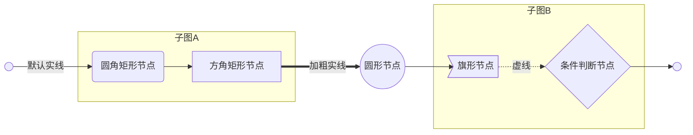
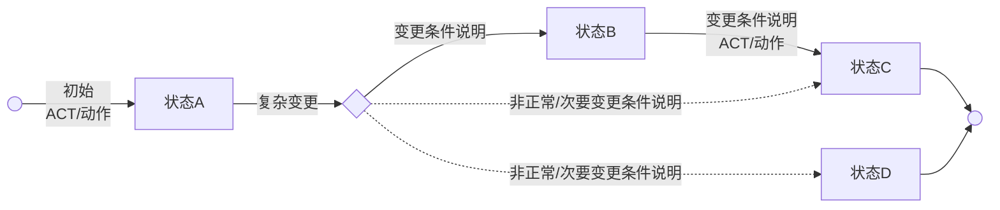
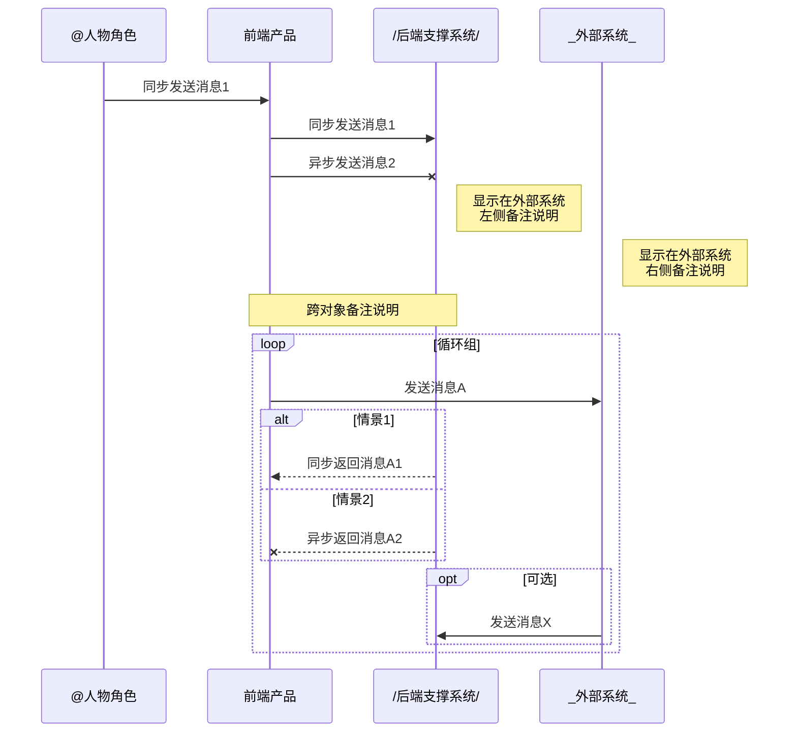

###### **VLOOK™**<br>快速参考手册<br><br>`文档密级｜｜对外公开`<br><br><br><br><u>Max</u><br>*COPYRIGHT © 2017-2018. MAX°DESIGN.*

[TOC]

# VLOOK™是什么

`最新版本｜V7`    `官网｜｜https://github.com/madmaxchow/VLOOK`    `适用平台｜｜｜Typora for Win & macOS`    `开源协议｜｜｜｜MIT`   `开发语言｜｜｜｜｜JavaScript, CSS`

[VLOOK™](https://github.com/MadMaxChow/VLOOK)是针对[Typora](https://www.typora.io)导出的HTML文件的插件，VLOOK™为开源软件，遵从[MIT许可证](#许可协议)。

VLOOK包括[排版增强](#排版增强)和[工具箱](#工具箱)两个部分：

- 排版增强：基于CSS制作，为Typora编辑的Markdown文件和导出的HTML文件提供排版增强、优化呈现细节；
- 工具箱：基于JQuery制作，为导出的HTML文件提供便捷的章节导航、插图导航、图片失效、无效链接检查等特性。

**（本文档是基于最新的VLOOK™插件进行创建）**

---

> **Markdown是什么？**
>
> 十四年前，John Gruber创造了Markdown，一种专门针对网络写作的文本标记语言。使用Markdown，你只需在写作过程中插入少量的标记符号，就能很轻松地进行排版（例如设置标题、加粗、列表、引用等）。
>
> Markdown文档以纯文本格式存储，这意味着，它们可以用几乎任一种文本编辑器打开。同时，又能通过Markdown编辑器导出为带排版的富文本文档、HTML网页等等。纯粹、简洁、易用、灵活，都是人们喜欢Markdown的原因。目前Markdown的标准化项目是[CommonMark](http://commonmark.org)。
>
> 
>
> **Markdown语法参考：**
>
> - 标准化CommonMark语法参考：[60秒学会Markdown语法](http://commonmark.org/help/)、[10分钟深入学习Markdown](http://commonmark.org/help/tutorial/)
> - GitHub采用Flavored Markdown的语法参考：Typora目前采用该标准  [详细](https://support.typora.io/Markdown-Reference/)

# 特性介绍

## 排版增强

### 封面与封底

###### 封面
1. 封面样式支持多个信息项，包括：**主标题**、**副标题**、**文档类型/密级**、**作者**、**版权信息**；

2. 封面必须以`6级标题`（`快捷键｜｜ctrl + 6`）作为整篇文章的`第1个`章节，同时各信息项的顺序与格式规则如下：

   - **主标题**：使用Markdown的粗体格式标记`**主标题**`
   - **副标题**：无须指定格式标记
   - **文档类型/密级**：使用Markdown的代码格式标记` `` `，同时支持VLOOK的[分段式样式](#分段式样式)写法，举例如下：
     - `文档密级｜｜对外公开`
     - `文档密级｜｜｜内部公开`
     - `文档密级｜｜｜｜机密资料`
   - **作者**：使用HTML的下划线格式标记`<u>作者</u>`（会自动增加`By`前缀）
   - **版权信息**，使用Markdown的斜体格式标记`*版权信息*`

3. 样式见本文的封面，完整示例参考如下（其中`<br>`为换行符，可选）：

   ```
   ###### **在此输入主标题**<br>在此输入副标题<br><br><br><u>在此输入作者姓名</u><br>*在此输入版权信息*
   ```

###### 封底

1. 以最后一个`6级标题`作为封底；

2. 样式见本文的封底，完整示例参考如下：

   ```
   ###### 在此输入封底内容
   ```

### 章节标题自动编号

1. 自动对1级~5级标题进行自动编号，6级标题因作特殊用途，不在自动编号范围内；
2. 自动编号格式为阿拉伯数字，多级标题编号以`.`分隔。

### 列表分级编号

1. 自动对列表进行分级编号；
2. 要求编写文档时第一级列表为有序列表，二级及其下列表均为使用无序标记`-`或`*`，会自动进行分级编号设置；

###### 列表分级编号样式：

1. 一级列表内容
   - 二级列表内容
     - 三级列表内容
       - 四级列表内容
         - 五级列表内容
           - 六级列表内容

2. 用Markdown编写参考如下，每级缩进4个空格：

    ```
    1. 一级列表内容
       - 二级列表内容
         - 三级列表内容
           - 四级列表内容
             - 五级列表内容
               - 六级列表内容
    ```

### 表格行自动编号

1. 在表格自动编号会在以下两种特定格式下出现：

2. 在一级列表下，**注意须缩进一级**：

   | 列1    | 列2    |   列3    |    列4 |
   | ------ | ------ | :------: | -----: |
   | 第一行 | 左对齐 | 居中对齐 | 右对齐 |
   | 第二行 | 左对齐 | 居中对齐 | 右对齐 |

3. 在6级标题（H6）下，不缩进情况：

###### 这是6级标题

| 列1    | 列2    |   列3    |    列4 |
| ------ | ------ | :------: | -----: |
| 第一行 | 左对齐 | 居中对齐 | 右对齐 |
| 第二行 | 左对齐 | 居中对齐 | 右对齐 |

### 增强脚本化图表样式

1. 统一优化mermaid、flowchart.js、JS Sequence Diagrams三类脚本化图表的样式；
2. 因Typora的原因，部分样式效果须导出HTML后加入插件代码后才能生效，暂不提供在编辑时进行实时预览；
3. 更多脚本化图表，以及与VLOOK相关的特性内容详见《**Markdown风格画图脚本Demo.html**》。

###### mermaid 流程图



###### mermaid 状态图


###### mermaid 时序图


`--｜注意事项`因Typora的原因，部分特性暂不提供在编辑时进行实时预览，须导出HTML并加入插件代码后才能生效。

###### flowchart.js 流程图

```flow
st=>start:  
e=>end:  
op1=>operation: 操作
op2=>operation: 材料
sub1=>subroutine: 子流程
cond=>condition: 是 / 否？
c2=>condition: 好主意
io=>inputoutput: 获得数据

st->op1(right)->cond
cond(yes, right)->c2
cond(no)->sub1(left)->op1
c2(yes)->io->e
c2(no)->op2->e
```
###### JS Sequence Diagrams 时序图

```sequence
Title: 在此填写流程图标题
participant 客服端 as CLIENT
participant 服务器 as SERVER
Note right of CLIENT: 通过角色、对象列表，\n您可以更改它们的顺序
CLIENT -> SERVER: 请求消息：实线+实箭头
SERVER --> CLIENT: 返回消息：虚线+实箭头
Note over CLIENT: 说明
Note over CLIENT, SERVER: 跨对象说明
CLIENT ->> SERVER: 请求消息：实线+虚箭头
SERVER -->> CLIENT: 返回消息：虚线+虚箭头
Note left of SERVER: 我在最后一位
```

### 增强代码标签样式

对于Markdown的代码标签标记` `` `，通过特定的内容或标识，来用不同的样式渲染指定的代码标签内容。

`--｜注意事项`因Typora的原因，增强代码标签样式暂不提供在编辑时进行实时预览，样式效果须导出HTML并加入插件代码后才能生效。

#### 分类式样式

1. 分类样式通过内容前增加特定的内容来标记；

2. 可用于文档中例如修订记录说明、界面元素（按钮、标签）说明、突出标记等，举例如下：

   - `+｜新增`本次修订新增XXX功能
   - `*｜优化`本次修订删除XXX功能
   - 用户点击`##｜立即购买`后进入XXX页面
   - `--｜注意事项`有关的注意事项说明

3. 通过分隔符进行不同组合标记的方式，可支持多种样式，举例如下：

   | 写法示例（浅色） |   渲染效果    | 写法示例（深色） |    渲染效果    |
   | :--------------: | :-----------: | :--------------: | :------------: |
   |   =｜文本内容    | `=｜文本内容` |   ==｜文本内容   | `==｜文本内容` |
   |   +｜文本内容    | `+｜文本内容` |   ++｜文本内容   | `++｜文本内容` |
   |   \*｜文本内容   | `*｜文本内容` |  \*\*｜文本内容  | `**｜文本内容` |
   |   -｜文本内容    | `-｜文本内容` |   --｜文本内容   | `--｜文本内容` |
   |   ^｜文本内容    | `^｜文本内容` |   ^^｜文本内容   | `^^｜文本内容` |
   |   \#｜文本内容   | `#｜文本内容` |  \#\#｜文本内容  | `##｜文本内容` |

`*｜提示`其中的竖线符号可用英文半角`|`，或中文全角`｜`。

#### 分段式样式

1. 目前支持两段式结构，可用于例如版本号说明、变量说明等，例如：
   - `版本号｜V1.0.2`
   - `快捷键｜｜ctrl + shift + F`
   - `X取值｜｜｜｜｜1234`
   - `优化级｜｜｜｜高`

2. 通过分隔符进行不同组合标记的方式，可支持多种样式，举例如下：

   | 写法示例                  | 渲染效果                    |
   | ------------------------- | --------------------------- |
   | 样式类型｜样式1           | `样式类型｜样式1`           |
   | 样式类型｜｜样式2         | `样式类型｜｜样式2`         |
   | 样式类型｜｜｜样式3       | `样式类型｜｜｜样式3`       |
   | 样式类型｜｜｜｜样式4     | `样式类型｜｜｜｜样式4`     |
   | 样式类型｜｜｜｜｜样式5   | `样式类型｜｜｜｜｜样式5`   |
   | 样式类型｜｜｜｜｜｜样式6 | `样式类型｜｜｜｜｜｜样式6` |

`*｜提示`其中的竖线符号可用英文半角`|`，或中文全角`｜`。

### 优化字体集

1. 优化导出HTML文件使用的字体集，优先以网络字体（WebFont）方式使用开源字体：思源宋体、思源黑体、Noto Sans、Noto Sans Mono；
2. 若无法加载优先字体，则使用微软雅黑等本地化字体呈现；
3. 由于思源宋体暂无免费网络资源，如需使用可下载并放置到Typora的主题目录的子目录`font`下、导出HTML文件的目录的子目录`font`下。

### 打印

1. 打印时字体自动缩小为屏幕显示尺寸的50%，以减少纸张浪费。

## 工具箱

### 章节导航

###### 大纲导航

1. 支持页面左侧显示目录大纲，并能根据页面位置自动高亮当前章节；
2. 目录大纲默认显示前三级，可自行修改样式文件进行调整
3. 编写Markdown文档时，须在封面后添加标签`[TOC]`。

###### 面包屑导航

1. 支持在页面顶部显示当前章节标题内容（除第6级标题）；
2. 根据页面位置自动识别当前章节，正如你现在看到的那样；
3. 显示`上一章`、`下一章`的标题，点击上/下章节标题可在上/下章节间进行快速跳转。

### 识别缺失的图片

1. 识别出无法加载的图片，并替换为提示图片已缺失提示图，示例详见[这里](#这是缺失的图片示例)。

### 插图浏览器

1. 支持的格式：
   - 浏览器支持的所有图片（jpg/png/gif/bmp/...）
   - 脚本化图表（mermaid/flowchart.js/JS Sequence Diagrams）
2. 点击任意图片、图表，或右上角的插图浏览器按钮激活插图浏览器；
3. 支持显示图片/图表标题（图片/图表前须增加h6标题）；
4. 支持按前一张、后一张方式浏览文档中的所有插图；
5. 对于缺失的图片以默认图片进行替换显示；
6. 点击插图能直接跳转到文档中对应的位置，支持通过`快捷键｜esc`关闭插图浏览器；

###### 这是普通的图片示例


###### 这是缺失的图片示例


### 外链强制新标签打开

1. 为提高文档阅读与交互体验，对于外链（http、https、ftp等），自动强制设置为在新标签页中打开。

### 内链有效性检查

###### 无效内链

1. 自动检查页面内部链接的正确性；
2. 若存在无效的页内链接，则通过弹窗提示。

###### 重名章节标题

1. 自动检查文档是否存在重名的标题，以提示作者检查是否会存在页内链接不能跳转到重名的标题位置的可能性；
2. 重名章节标题的警告提示信息须启动浏览器的开发者工具或调试工具后，打开其控制台窗口进行查看。

# 如何使用

## 配置主题

1. 将`released\vlook.css`文件复制至Typora的主题目录；
2. 重启Typora，点击菜单`主题 > VLOOK`即可启用VLOOK主题。

> **如何找到Typora主题目录？**
>
> 打开Typora设置界面，在常规设置中点击【打开主题目录】按钮即可定位到该目录

## 安装插件

1. 在Typora中将Markdown文件导出为`HTML`文件；
2. 打开文件`released\vlook-toolbox.txt`，全选所有内容，并复制；
3. 用纯文件编辑器（如：Windows下的记事本）打开该导出的HTML文件，并拖到文件最末尾，将复制的内容粘贴在`</body>`前；
4. 保存，大功告成。

> 强烈建议使用Chrome或Firefox浏览器浏览HTML文件

# 许可协议

**MIT许可证**

版权所有 (c) 2018 MAX°DESIGN | Max Chow
在此授予任何获得此软件和相关文档文件（“软件”）副本的人免费许可，以无限制地处理本软件，包括但不限于使用，复制，修改，合并，发布，分发，再授权和/或出售本软件的副本，并允许本软件的授予人员遵从以下情况：
上述版权声明和本许可声明应包含在本软件的所有副本或重要部分中。
本软件按“原样”提供，不提供任何以表达或暗示，包括但不限于销售，适用于特定用途和不侵权的保证。在任何情况下，作者或版权所有人不对因软件或软件的使用或其他事宜产生的任何索赔，损害或其他责任（无论是在合同，侵权或其他方面的诉讼中）负责。

# 官方主页

[https://github.com/MadMaxChow/VLOOK](https://github.com/MadMaxChow/VLOOK)

# 捐赠

###### 若喜欢VLOOK™的话，可以请Max喝杯咖啡～


###### 终了<br>